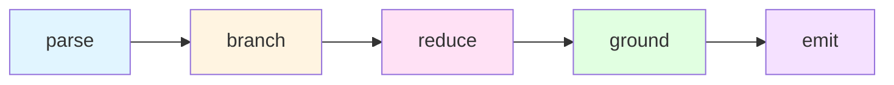

---
# meta-router

---
name: meta-router
description: |
  Primary intent classifier and entry point for all skill routing. Routes requests through
  the unified 7-router hierarchy based on intent analysis. Triggers on any task requiring
  specialized skills or delegation.
---

# Meta Router

> Entry point for all routing decisions. Classifies intent and delegates to appropriate unified router.

## Unified Router Hierarchy (7 Active)

```
                     META-ROUTER
                    (Entry Point)
                         |
    +----------+---------+---------+----------+
    |          |         |         |          |
    v          v         v         v          v
DELEGATE    TOOLS     BUILD     THINK    CONTEXT
(agents)   (cli/mcp) (dev/docs) (reason) (extract)
                         |
                         v
                    GROUNDING
                   (medical/exam)
```

## Trigger Keywords by Router

```yaml
delegate-router:
  keywords: [complex, multi-step, spawn, delegate, agent, research, explore, ultrawork]
  complexity_triggers: [">0.7", "files>20", "domains>2"]
  route: ~/.claude/skills/routers/delegate-router/SKILL.md

tools-router:
  keywords: [shell, terminal, mcp, lootbox, graph, query, database, cli]
  route: ~/.claude/skills/routers/tools-router/SKILL.md

build-router:
  keywords: [build, implement, code, create, feature, component, docs, readme, deploy]
  absorbs: [development, infrastructure, documentation]
  route: ~/.claude/skills/routers/build-router/SKILL.md

think-router:
  keywords: [analyze, debug, reason, research, investigate, prove, verify, think]
  absorbs: [reasoning, research, analysis]
  route: ~/.claude/skills/routers/think-router/SKILL.md

context-router:
  keywords: [context, lifelog, limitless, pieces, ltm, screenapp, recording]
  route: ~/.claude/skills/routers/context-router/SKILL.md

grounding-router:
  keywords: [saq, viva, medical, exam, anzca, cicm, pex, clinical]
  route: ~/.claude/skills/routers/grounding-router/SKILL.md
```

## Routing Logic

### Weight Distribution

| Factor | Weight | Description |
|--------|--------|-------------|
| Keyword Match | 40% | Scan user intent for trigger keywords |
| Context Analysis | 30% | Current project type, recent operations |
| History Pattern | 20% | Recent skill usage patterns |
| Explicit Request | 10% | User directly names skill/category |

### Decision Flow

```
User Intent
    |
    v
Keyword Extraction --> Category Match --> Load Unified Router
                                              |
                                              v
                                    Router-Specific Logic --> Skill/Agent
```

## Direct Shortcuts (Bypass Routing)

For known skills, bypass routing entirely:

```yaml
# Skill shortcuts
/ultrawork     -> ~/.claude/skills/ultrawork/SKILL.md
/learn         -> ~/.claude/skills/learn/SKILL.md
/lambda        -> ~/.claude/skills/lambda-skill/SKILL.md
/obsidian      -> ~/.claude/skills/obsidian/SKILL.md
/git           -> ~/.claude/skills/git-master/SKILL.md

# Agent shortcuts
oracle         -> oracle agent (complex debugging)
explore        -> explore agent (quick search)
sisyphus       -> sisyphus-junior agent (focused execution)
```

## Complexity Assessment

```python
def assess_complexity(task):
    score = (
        0.30 * files_affected(task) +
        0.25 * domains_involved(task) +
        0.25 * steps_required(task) +
        0.20 * research_needed(task)
    )
    return score

# Routing thresholds
if score > 0.7:
    route_to("delegate-router")  # Complex delegation
elif score > 0.4:
    route_to("think-router")     # Analysis needed
else:
    route_to("build-router")     # Direct execution
```

## Usage

When this router activates:

1. Announce: "Routing to [router] for [reason]"
2. Load the unified router
3. The router further refines to specific skill/agent

## Legacy Router Migration

| Legacy Router | Absorbed By |
|---------------|-------------|
| agents-router | delegate-router |
| skills-router | delegate-router |
| cli-router | tools-router |
| data-router | tools-router |
| development-router | build-router |
| infrastructure-router | build-router |
| documentation-router | build-router |
| reasoning-router | think-router |
| research-router | think-router |
| analysis-router | think-router |

Legacy routers archived in: `~/.claude/db/skills/routers/`

## Integration

**Incoming**: All user requests
**Outgoing**: [delegate-router](../delegate-router/SKILL.md), [tools-router](../tools-router/SKILL.md), [build-router](../build-router/SKILL.md), [think-router](../think-router/SKILL.md), [context-router](../context-router/SKILL.md), [grounding-router](../grounding-router/SKILL.md)
**Related**: [UNIFIED-ARCHITECTURE](../UNIFIED-ARCHITECTURE.md)


---
# skills-router

---
name: skills-router
description: Routes tasks to skills in skill-db and skill-library using semantic discovery. Triggers on specialized skill requirements, domain-specific tasks, or explicit skill requests. Uses skill-discovery, mcp-skillset, and skill-rag-router for semantic matching.
---

# Skills Router

Routes tasks to appropriate skills using semantic discovery across skill databases.

## Skill Databases

| Database | Location | Count | Purpose |
|:---------|:---------|:------|:--------|
| **skill-db** | ~/.claude/skill-db/ | 67+ | Primary skill source |
| **skill-library** | ~/.claude/skill-library/ | 48+ | Heavy/categorized skills |
| **skills (active)** | ~/.claude/skills/ | Variable | Currently loaded skills |

## Skill Categories

### Reasoning Skills (skill-db)
| Skill | Triggers | Purpose |
|:------|:---------|:--------|
| `think` | think, analyze, mental-model | Cognitive enhancement |
| `reason` | decompose, understand, break-down | Recursive decomposition |
| `AoT` | prove, atomic, formal | Atom of Thoughts |
| `urf` | universal, multi-scale, complex | Universal Reasoning |
| `ontolog` | holarchic, holons, ontology | Holarchic reasoning |
| `telos` | physiology, biological, teleological | Teleological analysis |
| `qp` | quantitative, calculate, physiological | Quantitative physiology |

### Development Skills (skill-db)
| Skill | Triggers | Purpose |
|:------|:---------|:--------|
| `terminal` | tui, cli, terminal-ui | Terminal UI design |
| `component` | command, agent, config | Claude Code components |
| `mcp-builder` | mcp, server, protocol | MCP development |
| `dspy` | dspy, prompts, optimize | DSPy optimization |

### Research Skills (skill-db)
| Skill | Triggers | Purpose |
|:------|:---------|:--------|
| `deep-research` | research, thorough, citations | 7-phase research |
| `notebooklm` | notebook, query, audio | NotebookLM integration |
| `skill-discovery` | find skill, discover, browse | Skill discovery |

### Context Skills (skill-db)
| Skill | Triggers | Purpose |
|:------|:---------|:--------|
| `context-orchestrator` | context, lifelog, ltm, limitless, pieces | Three-CLI context extraction |
| `limitless-cli` | pendant, personal memory, graph sync, extraction pipeline | Limitless CLI project development |

### Heavy Skills (skill-library)
| Skill | Triggers | Purpose |
|:------|:---------|:--------|
| `dialectical` | persuade, thesis, synthesis | Dialectical writing |
| `critique` | evaluate, lens, adversarial | Multi-lens critique |
| `constraints` | deontic, rights, permissions | Formal constraints |
| `saq` | saq, exam, model-answer | SAQ generation |
| `mega` | complex, n-superhypergraph | Meta-architecture |
| `textbook-grounding` | textbook, citations, syntopical | Textbook grounding |

## Routing Logic

```bash
# Semantic skill search
ck --sem "{query}" ~/.claude/skill-db/ --top-k 5

# Skill discovery metasystem
# (Invokes skill-discovery skill)

# mcp-skillset (when available)
mcp-skillset search "{query}"
```

## Decision Tree

```
Skill Task Detected
    │
    ├── Reasoning/Thinking?
    │   ├── Cognitive? → think
    │   ├── Formal proof? → AoT
    │   ├── Decomposition? → reason
    │   └── Complex system? → urf | mega
    │
    ├── Development?
    │   ├── Terminal UI? → terminal
    │   ├── MCP server? → mcp-builder
    │   └── Claude component? → component
    │
    ├── Research?
    │   ├── Deep dive? → deep-research
    │   ├── Skill finding? → skill-discovery
    │   └── NotebookLM? → notebooklm
    │
    ├── Context Extraction?
    │   ├── Personal/lifelog? → context-orchestrator → limitless
    │   ├── Documentation? → context-orchestrator → research
    │   ├── Local code/LTM? → context-orchestrator → pieces
    │   └── Limitless CLI development? → limitless-cli
    │
    ├── Writing?
    │   ├── Persuasive? → dialectical
    │   ├── SAQ/Exam? → saq | textbook-grounding
    │   └── Critique? → critique
    │
    ├── Data/Graph?
    │   ├── Knowledge graph? → hkgb | ontolog
    │   ├── Batch processing? → process | obsidian-batch
    │   └── Graph reasoning? → mega | graph
    │
    └── Domain-specific?
        ├── Physiology? → telos | qp
        ├── Scientific? → rct-appraisal
        └── Code quality? → code-skills/*
```

## Skill Loading Protocol

```yaml
progressive_loading:
  level_0: Read SKILL.md frontmatter only
  level_1: Read full SKILL.md
  level_2: Load references/*.md
  level_3: Load scripts/ and full capability

load_triggers:
  - Explicit skill invocation
  - Semantic match > 0.7
  - Domain keyword match
  - User request
```

## Integration

- **skill-discovery**: Semantic skill search
- **skill-rag-router**: GraphRAG-based routing
- **mcp-skillset**: MCP skill discovery
- **ck**: Semantic code search for skill content

## Quick Reference

```yaml
# Find skill semantically
ck --sem "formal reasoning proof" ~/.claude/skill-db/

# Load skill progressively
1. Check skill-db/{skill}/SKILL.md
2. If not found, check skill-library/{skill}/SKILL.md
3. Load frontmatter, then full skill on demand

# Skill invocation
/skill_name or invoke via Skill tool
```


---
# agents-router

---
name: agents-router
description: Routes tasks to appropriate Task tool agents (subagents). Triggers on complex multi-step tasks, research, code review, exploration, or any task benefiting from specialized agent execution. Matches intent to agent types.
---

# Agents Router

Routes tasks to appropriate Task tool subagent types for parallel or specialized execution.

## Available Agent Types

| Agent | Purpose | Best For |
|:------|:--------|:---------|
| **general-purpose** | Multi-step research | Complex questions, code search |
| **Explore** | Codebase exploration | Find files, understand patterns |
| **Plan** | Implementation planning | Architecture, strategy |
| **claude-code-guide** | Claude Code help | Feature questions, how-to |
| **orchestrator** | Multi-domain coordination | Complex multi-agent workflows |
| **strategy-analyzer** | Deep strategic analysis | Refactoring, optimization |
| **architect** | Recursive decomposition | Complex system design |
| **gemini** | Long context analysis | Large codebases, multi-file bugs |
| **researcher** | Web research | Finding answers, investigating |
| **engineer** | Professional implementation | PRD execution, debugging |

## Trigger Conditions

Activate when task involves:
- Complex multi-step operations
- Research requiring web/documentation search
- Code review or analysis
- Codebase exploration (files > 20)
- Multi-domain tasks (domains > 2)
- Long-running background operations

## Routing Logic

```yaml
# Complexity scoring
complexity_factors:
  files_affected: weight 0.3
  domains_involved: weight 0.25
  steps_required: weight 0.25
  research_needed: weight 0.2

# Thresholds
spawn_agent_if:
  complexity >= 0.7 OR
  files > 20 OR
  domains > 2 OR
  explicit_request
```

## Decision Tree

```
Task Complexity Assessment
    │
    ├── Exploration needed?
    │   ├── Quick search? → Explore (quick)
    │   ├── Pattern finding? → Explore (medium)
    │   └── Deep analysis? → Explore (very thorough)
    │
    ├── Implementation?
    │   ├── From PRD? → engineer
    │   ├── Architecture? → architect
    │   └── Strategy? → strategy-analyzer
    │
    ├── Research?
    │   ├── Web search? → researcher
    │   ├── Claude Code docs? → claude-code-guide
    │   └── Codebase context? → gemini
    │
    ├── Multi-domain?
    │   └── orchestrator
    │
    └── Code review?
        └── superpowers:code-reviewer (via skill)
```

## Agent Selection Matrix

| Task Type | Primary Agent | Alternatives |
|:----------|:--------------|:-------------|
| Find files by pattern | Explore | general-purpose |
| Search code for keyword | Explore | gemini |
| Plan implementation | Plan | architect |
| Deep strategic analysis | strategy-analyzer | architect |
| Large codebase analysis | gemini | Explore |
| Web research | researcher | general-purpose |
| Multi-agent coordination | orchestrator | general-purpose |
| PRD implementation | engineer | general-purpose |
| Claude Code help | claude-code-guide | - |

## Usage Patterns

### Parallel Agents
When tasks are independent:
```
Task tool (agent1) + Task tool (agent2) in parallel
```

### Sequential Agents
When tasks depend on each other:
```
Task tool (research) → Task tool (implement)
```

### Background Agents
For long-running tasks:
```
Task tool with run_in_background=true
→ TaskOutput to retrieve results
```

## Integration

- **Task tool**: Primary agent spawning
- **TaskOutput**: Result retrieval
- **orchestrator agent**: Multi-agent coordination
- **meta-router**: Parent routing

## Quick Reference

```yaml
# Quick codebase search
agent: Explore
thoroughness: quick

# Deep implementation planning
agent: Plan
complexity: high

# Large codebase bug
agent: gemini
context: 2M tokens

# Professional implementation
agent: engineer
from: PRD

# Multi-domain coordination
agent: orchestrator
domains: [frontend, backend, database]
```


---
# reasoning-router

---
name: reasoning-router
description: Routes formal reasoning, thinking, and analysis tasks. Triggers on reason, prove, verify, formal, atomic, logic, think, analyze-deeply, decompose, validate.
---

# Reasoning Router

Routes formal reasoning, cognitive enhancement, and deep analysis tasks.

## Subcategories

### Cognitive Enhancement
```yaml
triggers: [think, mental-models, non-linear, literate-programming]
skills:
  - think: Cognitive enhancement toolkit
  - goals: Process goals optimization
```

### Formal Reasoning
```yaml
triggers: [prove, verify, formal, atomic, decompose]
skills:
  - AoT: Atom of Thoughts (full)
  - AoT-light: Lightweight AoT
  - reason: Recursive decomposition
```

### Universal Frameworks
```yaml
triggers: [universal, multi-scale, holarchic, complex-system]
skills:
  - urf: Universal Reasoning Framework
  - ontolog: Holarchic reasoning
```

### Domain-Specific
```yaml
triggers: [physiology, biology, medical, quantitative]
skills:
  - telos: Teleological physiology analysis
  - qp: Quantitative physiology calculations
```

## Routing Decision Tree

```
reasoning request
    │
    ├── Cognitive/Thinking?
    │   ├── General? → think
    │   └── Optimization → goals
    │
    ├── Formal proof?
    │   ├── Full analysis? → AoT
    │   ├── Quick? → AoT-light
    │   └── Decomposition → reason
    │
    ├── Universal/Complex?
    │   ├── Multi-scale? → urf
    │   └── Holarchic → ontolog
    │
    └── Domain-specific?
        ├── Physiology? → telos | qp
        └── Other → think
```

## Managed Skills

| Skill | Purpose | Trigger |
|-------|---------|---------|
| think | Cognitive toolkit | "think", "analyze" |
| AoT | Atom of Thoughts | "prove", "atomic" |
| AoT-light | Fast AoT | "quick analysis" |
| reason | Decomposition | "decompose", "understand" |
| urf | Universal framework | "complex", "multi-scale" |
| ontolog | Holarchic | "ontology", "holons" |
| telos | Physiology | "physiology", "biological" |
| qp | Quantitative phys | "calculate", "physiological" |


---
# development-router

---
name: development-router
description: Routes development tasks to frontend, backend, or fullstack skills. Triggers on build, implement, code, create, feature, component, UI, API, server, database, docker, deploy.
---

# Development Router

Routes development-related tasks to appropriate specialized skills.

## Subcategories

### Frontend Development
```yaml
triggers: [UI, component, React, Vue, Svelte, CSS, Tailwind, design-system, terminal-ui, responsive]
skills:
  - terminal: TUI/CLI interfaces with high design quality
  - component: Claude Code configuration components
  - sc:implement: Feature implementation with persona activation
```

### Backend Development
```yaml
triggers: [api, server, database, auth, REST, GraphQL, microservice, endpoint]
skills:
  - sc:build: Build and compile projects
  - sc:design: System architecture and API design
  - mcp-builder: MCP server development
```

### Fullstack / Infrastructure
```yaml
triggers: [fullstack, monorepo, deployment, docker, ci/cd, pipeline]
skills:
  - sc:workflow: Implementation workflows from PRDs
  - sc:task: Complex task execution with persistence
```

## Routing Decision Tree

```
development request
    │
    ├── UI/component keywords?
    │   ├── TUI/terminal? → @skills/terminal
    │   ├── Claude component? → @skills/component
    │   └── general UI → sc:implement
    │
    ├── API/server keywords?
    │   ├── MCP server? → @skills/mcp-builder
    │   ├── architecture? → sc:design
    │   └── implementation → sc:build
    │
    └── deployment/infra?
        └── sc:workflow
```

## Managed Skills

| Skill | Purpose | Trigger |
|-------|---------|---------|
| terminal | Production-grade TUI | "terminal UI", "CLI tool" |
| component | CC config components | "command", "subagent", "skill" |
| sc:implement | Feature implementation | "implement", "build feature" |
| sc:build | Build/compile | "build", "compile", "package" |
| sc:design | Architecture | "design", "architecture" |
| mcp-builder | MCP servers | "MCP", "model context protocol" |
| sc:workflow | PRD workflows | "workflow", "PRD" |


---
# tools-router

---
name: tools-router
description: "Unified router for all external tools: CLI binaries, MCP tools via lootbox, and data processing. Consolidates cli-router + tools-router + data-router."
---

# Tools Router (Unified)

**Consolidates**: cli-router + tools-router + data-router
**Purpose**: All external tool execution (CLI, MCP, databases)
**Legacy References**: `~/.claude/db/skills/routers/cli-router/`, `~/.claude/db/skills/routers/data-router/`

## CLI Tools (Local Binaries)

### AI/LLM Agents
| Tool | Binary | Purpose |
|:-----|:-------|:--------|
| gemini | /opt/homebrew/bin/gemini | Google Gemini CLI (2M context) |
| codex | ~/.local/bin/codex | OpenAI GPT models |
| amp | ~/.amp/bin/amp | Anthropic Claude via MCP |

### Context Extraction
| Tool | Binary | Purpose |
|:-----|:-------|:--------|
| research | ~/.local/bin/research | Online documentation |
| pieces | /opt/homebrew/bin/pieces | Local code context, LTM |

### Data Processing
| Tool | Binary | Purpose |
|:-----|:-------|:--------|
| qsv | qsv | Fast CSV processing |
| jq | jq | JSON processing |
| nu | nu | Nushell data pipelines |

### Semantic Search
| Tool | Binary | Purpose |
|:-----|:-------|:--------|
| ck | ck | Semantic code search |
| ast-grep | ast-grep | AST pattern matching |

---

# MCP Tools (Lootbox)

Routes tasks to MCP tools via lootbox code-mode for external service integration.

## MCP Tool Categories

### Knowledge Graph
| Tool | Namespace | Purpose |
|:-----|:----------|:--------|
| Neo4j | `neo4j` | Graph database operations |
| Neo4j Aura | `neo4j-aura` | Cloud Neo4j |
| Neo4j Memory | `neo4j-memory` | Agent memory graph |
| DeepGraph | `deepgraph` | Code graph analysis |

### Research & Search
| Tool | Namespace | Purpose |
|:-----|:----------|:--------|
| Perplexity | `perplexity` | AI-powered web search |
| Brave Search | `brave-search` | Web search |
| InfraNodus | `relate` | Graph-based text analysis |
| PageIndex | `pageindex-local` | Web page indexing |

### Methodology & Reasoning
| Tool | Namespace | Purpose |
|:-----|:----------|:--------|
| Meta-CC | `meta-cc` | Methodology capabilities |
| Distil (AoT) | `distil` | Atom of Thoughts |
| Zen | `zen` | Multi-model reasoning |
| Gepa | `gepa` | Gemini planning |

### Solvers
| Tool | Namespace | Purpose |
|:-----|:----------|:--------|
| Z3 | `solver-z3` | SMT solving |
| MiniZinc | `solver-minizinc` | Constraint optimization |
| PySAT | `solver-pysat` | SAT solving |
| MaxSAT | `solver-maxsat` | Maximum satisfiability |
| ASP | `solver-asp` | Answer set programming |

### Storage & Memory
| Tool | Namespace | Purpose |
|:-----|:----------|:--------|
| Filesystem | `filesystem` | File operations |
| MCP Memory | `mcp-memory` | Key-value memory |
| Obsidian Memory | `obsidian-memory` | Obsidian integration |
| TurboVault | `turbovault` | High-performance vault |

### External Services
| Tool | Namespace | Purpose |
|:-----|:----------|:--------|
| GitHub | `github` | GitHub API |
| Zotero | `zotero` | Citation management |
| Gemini | `gemini` | Gemini model access |

## Lootbox Code-Mode

### Configuration
```yaml
server: ws://localhost:9742/ws
ui: http://localhost:9742/ui
config: ~/lootbox.config.json
```

### Local Tools (Always Available)
```typescript
tools.kv.*       // Key-value store
tools.sqlite.*   // SQLite database
tools.memory.*   // In-memory storage
tools.graphql.*  // GraphQL queries
```

### Invocation Patterns

```bash
# List available tools
lootbox tools

# Execute single operation
lootbox exec 'await tools.neo4j.query({ cypher: "MATCH (n) RETURN n LIMIT 5" })'

# Chain operations
lootbox exec '
  const results = await tools.perplexity.search({ query: "Claude Code best practices" });
  await tools.kv.set({ key: "research", value: results });
  return results;
'

# Parallel operations
lootbox exec '
  const [a, b] = await Promise.all([
    tools.neo4j.query({ cypher: "MATCH (n:Skill) RETURN n" }),
    tools.deepgraph.semantic_search({ query: "authentication" })
  ]);
  return { skills: a, code: b };
'
```

## Routing Logic

```
MCP Task Detected
    │
    ├── Graph operations?
    │   ├── Neo4j? → tools.neo4j
    │   ├── Code graph? → tools.deepgraph
    │   └── Text graph? → tools.relate
    │
    ├── Research?
    │   ├── AI search? → tools.perplexity
    │   ├── Web search? → tools.brave-search
    │   └── Page index? → tools.pageindex-local
    │
    ├── Reasoning?
    │   ├── Methodology? → tools.meta-cc
    │   ├── Multi-model? → tools.zen
    │   └── AoT? → tools.distil
    │
    ├── Constraint solving?
    │   ├── SMT? → tools.solver-z3
    │   ├── Optimization? → tools.solver-minizinc
    │   └── SAT? → tools.solver-pysat
    │
    └── Storage?
        ├── Files? → tools.filesystem
        ├── KV? → tools.kv
        └── Memory? → tools.memory
```

## Tool Selection Matrix

| Task Type | Primary Tool | Alternative |
|:----------|:-------------|:------------|
| Graph query | neo4j | deepgraph |
| Web research | perplexity | brave-search |
| Code analysis | deepgraph | relate |
| Constraint solving | solver-z3 | solver-minizinc |
| File operations | filesystem | turbovault |
| Citation | zotero | - |
| Methodology | meta-cc | distil |

## Integration

- **lootbox**: Code-mode execution
- **MCP servers**: External tool providers
- **cli-index**: CLI tool fallback
- **meta-router**: Parent routing

## Quick Reference

```yaml
# Start lootbox server
lootbox server --port 9742

# Check available namespaces
lootbox tools

# Neo4j query
lootbox exec 'await tools.neo4j.query({ cypher: "..." })'

# Perplexity search
lootbox exec 'await tools.perplexity.search({ query: "..." })'

# Chained operations
lootbox exec '
  const data = await tools.X.fetch();
  return tools.Y.process(data);
'
```


---
# infrastructure-router

---
name: infrastructure-router
description: Routes infrastructure, MCP, and tooling tasks. Triggers on mcp, server, deploy, orchestrate, pipeline, tools, docker, ci/cd, hook, config, setup.
---

# Infrastructure Router

Routes infrastructure, MCP development, and tooling tasks.

## Subcategories

### MCP Development
```yaml
triggers: [mcp, model-context-protocol, server, tool-registration]
skills:
  - mcp-builder: MCP server development guide
  - component: Claude Code components
```

### Tooling / CLI
```yaml
triggers: [cli, tool, script, automation, batch]
skills:
  - terminal: Terminal UI design
  - ccs: Claude Code Spawner delegation
  - ccs-delegation: Auto-delegation patterns
```

### Hooks / Configuration
```yaml
triggers: [hook, config, setup, settings, plugin]
skills:
  - hookify: Hook creation from behaviors
  - component: Component generation
```

### Orchestration
```yaml
triggers: [orchestrate, pipeline, workflow, multi-agent, coordinate]
skills:
  - agent: Agentic reasoning framework
  - mcp-skillset-workflows: Multi-skill orchestration
```

## Routing Decision Tree

```
infrastructure request
    │
    ├── MCP development?
    │   ├── Server creation? → mcp-builder
    │   └── Component? → component
    │
    ├── CLI/Tooling?
    │   ├── Terminal UI? → terminal
    │   └── Delegation? → ccs
    │
    ├── Hooks/Config?
    │   ├── Hook creation? → hookify
    │   └── Settings? → component
    │
    └── Orchestration?
        ├── Multi-agent? → agent
        └── Workflows → mcp-skillset-workflows
```

## Managed Skills

| Skill | Purpose | Trigger |
|-------|---------|---------|
| mcp-builder | MCP server guide | "MCP", "server" |
| component | CC components | "command", "agent" |
| terminal | TUI design | "terminal", "CLI" |
| ccs | Claude spawner | "delegate", "spawn" |
| hookify | Hook creation | "hook", "prevent" |
| agent | Agentic framework | "orchestrate", "agent" |


---
# research-router

---
name: research-router
description: Routes research and investigation tasks. Triggers on research, investigate, deep-dive, explore, understand, learn, study, compare, thorough, comprehensive.
---

# Research Router

Routes research, learning, and investigation tasks to specialized skills.

## Subcategories

### Deep Research
```yaml
triggers: [comprehensive, thorough, multi-source, citations, verify, deep-dive]
skills:
  - deep-research: 7-phase research protocol with Graph of Thoughts
  - mcp-skillset-workflows: Multi-skill orchestration patterns
```

### Reasoning / Thinking
```yaml
triggers: [think, reason, analyze-deeply, complex-problem, multi-step]
skills:
  - think: Cognitive enhancement toolkit
  - reason: Recursive decomposition
  - AoT: Atom of Thoughts (formal)
  - urf: Universal Reasoning Framework
```

### Learning
```yaml
triggers: [learn, understand, explain, study, compare, evaluate]
skills:
  - sc:explain: Clear explanations
  - deepstudy: Deep study workflows
  - notebooklm: Query NotebookLM
```

## Routing Decision Tree

```
research request
    │
    ├── "deep research" explicit?
    │   └── deep-research
    │
    ├── Reasoning/thinking focus?
    │   ├── Lightweight? → think
    │   ├── Formal proof? → AoT
    │   └── Multi-scale? → urf
    │
    ├── Learning focus?
    │   ├── Explanation? → sc:explain
    │   └── Study → deepstudy
    │
    └── General investigation?
        └── deep-research
```

## Progressive Loading

1. **Light Analysis**: Load `think` or `reason` first
2. **Deep Dive**: If complexity increases, add `deep-research`
3. **Formal Verification**: If proof needed, add `AoT` or `urf`

## Managed Skills

| Skill | Purpose | Trigger |
|-------|---------|---------|
| deep-research | 7-phase research | "deep research", "thorough" |
| think | Non-linear reasoning | "think", "analyze" |
| reason | Recursive decomposition | "reason", "understand" |
| AoT | Atom of Thoughts | "prove", "verify", "formal" |
| urf | Universal framework | "multi-scale", "complex" |
| sc:explain | Explanations | "explain", "describe" |


---
# analysis-router

---
name: analysis-router
description: Routes analysis and debugging tasks. Triggers on analyze, debug, troubleshoot, review, audit, security, performance, optimize, investigate, trace.
---

# Analysis Router

Routes analysis, debugging, and review tasks to specialized skills.

## Subcategories

### Code Analysis
```yaml
triggers: [analyze, review, understand, trace, flow, structure]
skills:
  - sc:analyze: Code quality, security, performance, architecture analysis
  - systematic-debugging: Structured debugging approach
```

### Security Analysis
```yaml
triggers: [security, audit, vulnerability, injection, auth, permissions]
skills:
  - dev:security:security-audit: Security vulnerability scanning
  - dev:security:secure-prompts: Prompt injection defense
  - dev:security:check-best-practices: Security best practices
```

### Performance Analysis
```yaml
triggers: [performance, optimize, bottleneck, profiling, memory, speed]
skills:
  - sc:improve: Systematic improvements
  - parallel-debug-orchestrator: Parallel debugging
```

### Architecture Analysis
```yaml
triggers: [architecture, design, patterns, refactor, structure]
skills:
  - dev:architecture:explain-architecture-pattern: Pattern explanation
  - sc:design: System design
```

## Routing Decision Tree

```
analysis request
    │
    ├── Security focus?
    │   ├── Audit? → security-audit
    │   ├── Prompts? → secure-prompts
    │   └── Best practices → check-best-practices
    │
    ├── Performance focus?
    │   ├── Debugging? → parallel-debug-orchestrator
    │   └── Optimization → sc:improve
    │
    ├── Architecture focus?
    │   └── explain-architecture-pattern
    │
    └── General analysis?
        ├── Debugging? → systematic-debugging
        └── Review → sc:analyze
```

## Managed Skills

| Skill | Purpose | Trigger |
|-------|---------|---------|
| sc:analyze | Code analysis | "analyze code", "review" |
| systematic-debugging | Structured debug | "debug", "troubleshoot" |
| parallel-debug-orchestrator | Parallel debug | "complex bug", "multiple issues" |
| security-audit | Security scan | "security audit", "vulnerabilities" |
| secure-prompts | Prompt security | "prompt injection", "secure prompts" |
| sc:improve | Improvements | "improve", "optimize" |


---
# context-router

---
name: context-router
description: |
  Routes context extraction requests to appropriate CLI tools. Triggers on /context,
  /limitless, /research, /pieces, or detected context needs from intent hook.
  Supports single, parallel, and augmented extraction modes.
---

# Context Router

Routes external context extraction to the three-CLI system.

**Trigger Keywords**: context, lifelog, research, ltm, recall, lookup, pieces, limitless, pendant, documentation

## Trigger Conditions

Activate when:
- Explicit commands: `/context`, `/limitless`, `/research`, `/pieces`
- Intent hook signals context need (balanced detection)
- User asks about past conversations, technical docs, or code history

## Source Categories

| Source | CLI | Triggers | Data Type |
|:-------|:----|:---------|:----------|
| **Personal** | limitless | lifelog, pendant, daily, personal, meeting | Transcripts, chats |
| **Research** | research | fact-check, docs, academic, verify, sdk | Citations, documentation |
| **Local** | pieces | ltm, saved, snippets, my code, history | Code, snippets |

## Routing Decision Tree

```
Request Received
    │
    ├── Explicit Command?
    │   ├── /context → Parallel (all sources)
    │   ├── /limitless → Single (limitless)
    │   ├── /research → Single (research)
    │   └── /pieces → Single (pieces)
    │
    ├── Hook Signal Present?
    │   ├── need_limitless=true → Route to limitless
    │   ├── need_research=true → Route to research
    │   ├── need_pieces=true → Route to pieces
    │   └── Multiple → Parallel mode
    │
    └── No Signal
        └── Skip (no context needed)
```

## Mode Selection

| Mode | Trigger | Process |
|------|---------|---------|
| **Single** | Clear single-source intent | Route to one CLI |
| **Parallel** | `/context` or multi-domain | Spawn all relevant CLIs |
| **Augmented** | With deep-research | Pre-enrich Phase 0 |

## CLI Commands

### Limitless (Personal)
```bash
limitless lifelogs search "query" --limit 10 --format json
limitless workflow daily YYYY-MM-DD --format json
limitless workflow recent --hours 24 --format json
```

### Research (Online)
```bash
research docs -t "query" -k "framework" --format json
research fact-check -t "claim" --format json
research pex-grounding -t "medical query" --format json
```

### Pieces (Local)
```bash
pieces ask "query" --ltm
pieces search --mode ncs "pattern"
```

## Integration

- **Skill**: `skill-db/context-orchestrator/SKILL.md`
- **Rules**: `rules/context/*.md`
- **Subagents**: `skill-db/context-orchestrator/agents/*.md`
- **Commands**: `skill-db/context-orchestrator/commands/*.md`
- **Also listed in**: `skills/routers/skills-router/SKILL.md` (Context Skills category)
- **Hooks**: `hooks/context-intent-detector.ts`, `hooks/session-context-primer.sh`


---
# build-router

---
name: build-router
description: |
  Unified router for development, infrastructure, and documentation tasks.
  Absorbs development-router + infrastructure-router + documentation-router.
---

# Build Router (Unified)

**Tier**: unified
**Absorbs**: development-router + infrastructure-router + documentation-router
**Purpose**: All creation/building tasks (code, configs, docs)

## Triggers
```yaml
patterns:
  - build, implement, create, develop
  - frontend, backend, fullstack, API
  - mcp, server, hook, deploy
  - document, readme, explain, changelog
  - terminal, TUI, CLI interface
```

## Build Domains

### Frontend Development
```yaml
triggers: [UI, UX, component, styling, React, Vue, Svelte]
agent: frontend-engineer
skills:
  - frontend-ui-ux (active)
  - component patterns
  - accessibility (WCAG)
  - responsive design
```

### Backend Development
```yaml
triggers: [API, server, database, authentication]
patterns:
  - RESTful API design
  - GraphQL schemas
  - Database modeling
  - Authentication/authorization
```

### Infrastructure
```yaml
triggers: [MCP, hook, config, deploy, tooling]
skills:
  - mcp-builder (db/skill-db)
  - hook development
  - configuration management
workflows:
  - MCP server: Research → Implement → Review → Evaluate
```

### Documentation
```yaml
triggers: [document, readme, explain, changelog, API docs]
agent: document-writer
patterns:
  - README creation
  - API documentation
  - Code comments
  - Changelogs
```

## Workflow Integration
```yaml
standard_flow:
  1. Analyze requirements
  2. Plan implementation
  3. Build incrementally
  4. Test and validate
  5. Document

sc_commands:
  - sc:implement → Guided implementation
  - sc:build → Build workflow
  - sc:document → Documentation
```

## Build Tool Detection

```yaml
package_managers:
  package.json: pnpm | npm | yarn | bun
  pyproject.toml: uv | poetry | pip
  Cargo.toml: cargo
  go.mod: go

build_commands:
  typescript: "pnpm build" | "npm run build" | "bun build"
  python: "uv run python -m build" | "poetry build"
  rust: "cargo build --release"

test_runners:
  typescript: vitest | jest | playwright
  python: pytest
  rust: cargo test

linting:
  typescript: eslint | prettier | biome
  python: ruff | black | mypy
```

## Decision Tree

```
Build/Create Request
    │
    ├── Frontend?
    │   ├── TUI/terminal? → terminal skill
    │   ├── Component? → frontend-engineer agent
    │   └── Feature → sc:implement
    │
    ├── Backend?
    │   ├── API design? → sc:design
    │   └── Implementation → sc:build
    │
    ├── Infrastructure?
    │   ├── MCP server? → mcp-builder skill
    │   ├── Hooks? → hookify skill
    │   └── Config → component skill
    │
    └── Documentation?
        ├── README → document-writer agent
        ├── API docs → sc:document
        └── Changelog → create-release-note
```

## References
- Original development-router: ~/.claude/db/skills/routers/development-router/
- Original infrastructure-router: ~/.claude/db/skills/routers/infrastructure-router/
- Original documentation-router: ~/.claude/db/skills/routers/documentation-router/


---
# data-router

---
name: data-router
description: Routes data processing, knowledge graph, and analytics tasks. Triggers on graph, vector, knowledge, ontology, process, batch, etl, database, query, csv, json.
---

# Data Router

Routes data processing, knowledge graph, and analytics tasks.

## Subcategories

### Knowledge Graphs
```yaml
triggers: [graph, knowledge-graph, entity, relation, neo4j, networkx]
skills:
  - hkgb: Hybrid Knowledge Graph building
  - ontolog: Holarchic reasoning over graphs
```

### Batch Processing
```yaml
triggers: [batch, process, etl, migrate, transform]
skills:
  - obsidian-batch: Obsidian vault batch operations
  - process: Batch processing workflows
```

### Vector / Semantic
```yaml
triggers: [vector, embedding, semantic, similarity, rag]
skills:
  - skill-discovery: Semantic skill search
```

### Analytics
```yaml
triggers: [analyze-data, query, sql, csv, json, aggregate]
skills:
  - sc:analyze: Data analysis
```

## Routing Decision Tree

```
data request
    │
    ├── Knowledge graph?
    │   ├── Building? → hkgb
    │   └── Reasoning → ontolog
    │
    ├── Batch processing?
    │   ├── Obsidian? → obsidian-batch
    │   └── General → process
    │
    ├── Vector/semantic?
    │   └── skill-discovery
    │
    └── Analytics?
        └── sc:analyze
```

## Managed Skills

| Skill | Purpose | Trigger |
|-------|---------|---------|
| hkgb | Hybrid KG building | "knowledge graph", "neo4j" |
| ontolog | Graph reasoning | "ontology", "holarchic" |
| obsidian-batch | Vault processing | "obsidian", "vault" |
| process | Batch processing | "batch", "process" |
| skill-discovery | Semantic search | "find skill", "discover" |


---
# documentation-router

---
name: documentation-router
description: Routes documentation and explanation tasks. Triggers on document, explain, readme, api-docs, changelog, guide, comment, describe, write-docs.
---

# Documentation Router

Routes documentation, explanation, and writing tasks.

## Subcategories

### Code Documentation
```yaml
triggers: [comment, docstring, jsdoc, type-doc]
skills:
  - sc:document: Focused component documentation
  - sc:explain: Clear explanations
```

### Project Documentation
```yaml
triggers: [readme, guide, setup, installation, contributing]
skills:
  - dev:documentation:create-readme-section: README sections
  - sc:index: Comprehensive documentation
```

### Release Documentation
```yaml
triggers: [changelog, release-notes, version, breaking-changes]
skills:
  - dev:documentation:create-release-note: Release notes
```

### API Documentation
```yaml
triggers: [api-docs, endpoints, swagger, openapi]
skills:
  - sc:document: API documentation
  - sc:design: API design
```

## Routing Decision Tree

```
documentation request
    │
    ├── Code-level?
    │   ├── Comments? → sc:document
    │   └── Explanation → sc:explain
    │
    ├── Project-level?
    │   ├── README? → create-readme-section
    │   └── Full docs → sc:index
    │
    ├── Release?
    │   └── create-release-note
    │
    └── API?
        └── sc:document
```

## Managed Skills

| Skill | Purpose | Trigger |
|-------|---------|---------|
| sc:document | Component docs | "document", "describe" |
| sc:explain | Explanations | "explain", "clarify" |
| sc:index | Full documentation | "index", "comprehensive" |
| create-readme-section | README | "readme", "setup guide" |
| create-release-note | Release notes | "changelog", "release" |


---
# cli-router

---
name: cli-router
description: Routes tasks to locally installed CLI tools using semantic matching. Triggers on tasks requiring shell commands, file operations, code search, data processing, visualization, or external tool invocation. Uses cli-index for semantic routing.
---

# CLI Router

Routes tasks to the most appropriate CLI tool based on semantic intent matching.

## Trigger Conditions

Activate when task involves:
- Shell/terminal operations
- File search or navigation
- Code search (semantic or pattern)
- Data processing (CSV, JSON)
- Visualization generation
- External tool invocation

## CLI Categories

| Category | Tools | Triggers |
|:---------|:------|:---------|
| **ai_llm** | claude, gemini, codex, amp, aider | AI help, implement, explain |
| **semantic_search** | ck, ast-grep, osgrep | semantic search, find code, pattern |
| **knowledge_graph** | cypher-shell, turbovault | graph, neo4j, knowledge |
| **data_processing** | qsv, csvtk, nu, jq | csv, json, transform, data |
| **file_navigation** | yazi, broot, fd, rg | browse, find files, navigate |
| **code_quality** | bat, difftastic, delta | diff, syntax, format |
| **visualization** | d2, mermaid, mermaid-ascii | diagram, flowchart, visual |
| **mcp_tools** | mcp-skillset, lootbox, automcp | mcp, skills, tools |
| **productivity** | fabric, atuin, btop, zellij | patterns, history, monitor |
| **document** | docling, pdf-search, qmd | pdf, document, markdown |

## Routing Logic

```bash
# Use cli-index for semantic routing
cli-index route "{user_intent}"

# Example output:
# tool: ck
# category: semantic_search
# confidence: 0.85
# command_hint: ck --sem "async functions" src/
```

## Decision Tree

```
CLI Task Detected
    │
    ├── Code search?
    │   ├── Semantic? → ck --sem
    │   ├── Pattern/AST? → ast-grep
    │   └── Grep-like? → rg
    │
    ├── File operations?
    │   ├── Navigate? → yazi | broot
    │   ├── Find files? → fd
    │   └── Search content? → rg
    │
    ├── Data processing?
    │   ├── CSV? → qsv | csvtk
    │   ├── JSON? → jq | sj
    │   └── Structured? → nu
    │
    ├── Visualization?
    │   ├── Diagrams? → d2
    │   ├── Flowcharts? → mermaid
    │   └── ASCII? → mermaid-ascii
    │
    ├── AI assistance?
    │   ├── Claude preferred? → claude
    │   ├── Long context? → gemini
    │   └── OpenAI? → codex
    │
    └── Document processing?
        ├── PDF? → docling | pdf-search
        └── Markdown? → qmd
```

## Commands

```bash
# Search for matching tools
cli-index search "semantic code search"

# Route to best tool
cli-index route "find async functions in codebase"

# List tools by category
cli-index list semantic_search

# Get tool info
cli-index info ck

# Suggest tool chain
cli-index suggest "search code then visualize dependencies"

# Verify all tools available
cli-index verify
```

## Integration

- **cli-index**: Primary routing CLI
- **ck**: Semantic code search with embeddings
- **reasoning-index**: Command framework routing
- **mcp-skillset**: Skill discovery

## Quick Reference

```yaml
semantic_search: ck --sem "query" path/
pattern_search: ast-grep -p "pattern"
file_find: fd "pattern"
content_search: rg "pattern"
csv_process: qsv [cmd] file.csv
json_query: jq ".path" file.json
diagram: d2 input.d2 output.svg
ai_help: claude -p "query"
```


---
# commands-router

---
name: commands-router
description: Routes tasks to reasoning frameworks and command patterns in commands-db. Triggers on structured development workflows, skill commands (sc:*), brainstorming, architecture, or any task matching command framework patterns. Uses reasoning-index for semantic routing.
---

# Commands Router

Routes tasks to appropriate reasoning frameworks and command patterns.

## Trigger Conditions

Activate when task involves:
- Structured development workflow (implement, build, test)
- Skill command invocation (sc:*)
- Brainstorming or ideation
- Architecture or design decisions
- Workflow templates
- Schema-based operations

## Command Categories

### SC Commands (Skill Commands)
Primary action verbs for development tasks.

| Command | Trigger Keywords | Purpose |
|:--------|:-----------------|:--------|
| `sc:analyze` | analyze, evaluate, assess, audit | Deep analysis |
| `sc:build` | build, compile, package | Build operations |
| `sc:cleanup` | clean, organize, declutter | Code cleanup |
| `sc:design` | design, architect, plan | Architecture |
| `sc:document` | document, readme, guide | Documentation |
| `sc:estimate` | estimate, cost, time | Estimation |
| `sc:explain` | explain, clarify, describe | Explanations |
| `sc:git` | commit, push, merge | Git operations |
| `sc:implement` | implement, code, feature | Implementation |
| `sc:improve` | improve, enhance, optimize | Improvement |
| `sc:load` | load, context, import | Context loading |
| `sc:spawn` | spawn, delegate, parallel | Delegation |
| `sc:task` | task, complex, persistent | Complex tasks |
| `sc:test` | test, verify, validate | Testing |
| `sc:troubleshoot` | debug, fix, diagnose | Debugging |
| `sc:workflow` | workflow, prd, process | Workflows |

### BMAD Framework
| Module | Purpose |
|:-------|:--------|
| `bmad:brainstorm` | Structured brainstorming |
| `bmad:party-mode` | Multi-agent ideation |
| `bmad:prd` | Product requirements |
| `bmad:architecture` | System architecture |

## Routing Logic

```bash
# Use reasoning-index for semantic routing
reasoning-index search "{user_intent}"
reasoning-index suggest "{task_description}"

# Example output:
# {
#   "commands": ["sc:implement", "sc:design"],
#   "skills": ["test-driven-development"],
#   "reasoning_chain": ["sc:design", "sc:implement", "sc:test"]
# }
```

## Decision Tree

```
Command Task Detected
    │
    ├── Implementation?
    │   ├── New feature? → sc:implement
    │   ├── Build? → sc:build
    │   └── Improvement? → sc:improve
    │
    ├── Analysis?
    │   ├── Code review? → sc:analyze
    │   ├── Debugging? → sc:troubleshoot
    │   └── Testing? → sc:test
    │
    ├── Design?
    │   ├── Architecture? → sc:design
    │   ├── Brainstorm? → bmad:brainstorm
    │   └── PRD? → bmad:prd
    │
    ├── Documentation?
    │   ├── README? → sc:document
    │   ├── Explain? → sc:explain
    │   └── Guide? → sc:document
    │
    └── Operations?
        ├── Git? → sc:git
        ├── Cleanup? → sc:cleanup
        └── Complex? → sc:task
```

## Usage

```bash
# Search commands
reasoning-index search "debug authentication"

# Get reasoning chain suggestion
reasoning-index suggest "implement user login"

# List all SC commands
reasoning-index list sc

# Build knowledge graph
reasoning-index graph "optimize performance" --depth 2
```

## Integration

- **reasoning-index**: Primary routing CLI
- **commands-db**: Command framework database
- **skill-db**: Skill integration
- **meta-router**: Parent router

## Command Chaining

```
Design → Implement → Test → Document

sc:design → sc:implement → sc:test → sc:document
```


---
# think

---
name: think
description: Cognitive enhancement toolkit combining non-linear reasoning, mental models, and literate programming. Use for complex analysis, system design, debugging, deep learning, and research workflows.
---

# Think Skill

Orchestrate three MCP tools for structured reasoning.

## Quick Navigation

| Need | Go To |
|------|-------|
| Non-linear reasoning | [THOUGHTBOX.md](THOUGHTBOX.md) |
| Reasoning frameworks | [MODELS.md](MODELS.md) |
| Executable notebooks | [NOTEBOOK.md](NOTEBOOK.md) |
| Tool combinations | [PATTERNS.md](PATTERNS.md) |
| Problem→Solution routing | [SELECTION.md](SELECTION.md) |
| Concrete examples | [EXAMPLES.md](EXAMPLES.md) |

## Tools At a Glance

| Tool | Purpose | Key Feature |
|------|---------|-------------|
| `thoughtbox` | Step-by-step reasoning | 7 patterns: forward, backward, branching, revision, interleaved, first principles, meta-reflection |
| `mental_models` | Structured schemas | 15 models across 9 tags |
| `notebook` | Literate programming | 10 operations, executable JS/TS |

## When to Use This Skill

- **Complex problems** → decomposition + branching
- **Debugging** → five-whys + backward thinking
- **Architecture decisions** → pre-mortem + trade-off matrix
- **Deep learning** → Sequential Feynman notebook
- **Research tasks** → interleaved reasoning loops

## Minimal Invocation

```javascript
// Reasoning
thoughtbox({ thought: "...", thoughtNumber: 1, totalThoughts: 10, nextThoughtNeeded: true })

// Framework
mental_models({ operation: "get_model", args: { model: "five-whys" } })

// Notebook
notebook({ operation: "create", args: { title: "...", language: "typescript" }})
```

## MCP Resources (On-Demand)

| Resource | Access |
|----------|--------|
| Patterns cookbook | `thoughtbox({ includeGuide: true })` |
| Model content | `mental_models({ operation: "get_model", args: { model: "..." } })` |
| Notebook ops | `thoughtbox://notebook/operations` |
| Interleaved guides | `thoughtbox://interleaved/{mode}` |

---

*For deeper content, follow links above. Each file is self-contained.*


---
# reason

---
name: reason
description: "Understand through recursive decomposition and modular reconstruction
  of simple operations to reproduce emergent complexity. Use this skill whenever
  reasoning is required. Framework for [[#parse|parsing]], [[#branch|branching]],
  [[#reduce|reducing]], [[#ground|grounding]] and [[#emit|emitting]]. Employs
  metacognitive reasoning epistemology, leveraging first principles through
  recursive decomposition[^1]. Self-referential and scale-invariant."
---
# reason

## structure



[[#parse]] → [[#branch]] → [[#reduce]] → [[#ground]] → [[#emit]] ^structure

---

## parse

1. receive `input` ^input
2. extract[^2]:
   - #component/parameter — what varies ^parameters
   - #component/constant — what is fixed ^constants
   - #component/operation — what transforms ^operations
   - #component/unknown — what is sought^unknowns
3. A question is a function awaiting its arguments[^3].
   Identify what arguments it needs. ^function-analogy

---

## branch

Generate multiple resolution paths before committing[^4]:

| Path Type | Tag | Purpose | Anchor |
|-----------|-----|---------|--------|
| Typical | #path/typical | The conventional approach | ^path-typical |
| Alternative | #path/alternative | A valid but less obvious route | ^path-alternative |
| Boundary | #path/boundary | The edge case or inversion | ^path-boundary |

Assign rough likelihood. Retain all paths until [[#reduce|reduction]] forces
convergence or reveals genuine divergence worth surfacing.

>[!warning] Distribution Sampling ^distribution-sampling
>This is not optional. Single-path reasoning collapses to the mode.
>The goal is to sample from the full distribution of valid approaches.

---

## reduce

Transform step by step[^5]. Each step follows the primitive: ^transformation-primitive

$$\text{input} \xrightarrow{\text{operation}} \text{output}$$

>[!caution] Skip Nothing ^skip-nothing
>An obvious step is still a step.
>A hidden step is where errors hide.

### five primitive operations

| Operation | Tag | Definition | Anchor |
|-----------|-----|------------|--------|
| `select` | #primitive/select | condition → one of two branches | ^op-select |
| `sequence` | #primitive/sequence | output of one feeds [[SKILL#^input\|input]] of next | ^op-sequence |
| `iterate` | #primitive/iterate | apply operation n times | ^op-iterate |
| `recurse` | #primitive/recurse | define in terms of self, with base case | ^op-recurse |
| `search` | #primitive/search | find first element satisfying constraint | ^op-search |

Name which [[SKILL#five primitive operations|primitive]] you are applying.

Substitution is explicit:

> Given X, applying rule R yields X transformed by R

Never say "therefore" without showing the step that licenses it. ^explicit-substitution

---

## ground

Before [[#emit|emitting]], verify:

- [ ] Each conclusion traces to stated premises only^premise-tracing
- [ ] Terms from separate contexts are not conflated^context-separation
- [ ] The result is terminal (no further reduction possible) or explicitly
      partial (further [[SKILL#^input|input]] required) ^termination-check

### convergence logic

| State | Tag | Meaning | Anchor |
|-------|-----|---------|--------|
| Converged | #state/converged | confidence is high | ^state-converged |
| Diverged | #state/diverged | present the divergence—it is the answer | ^state-diverged |
| Continuing | #state/continuing | [[#reduce\|reduction]] could continue | ^state-continuing |
| Blocked | #state/blocked | state what is missing | ^state-blocked |

---

## emit

Output the synthesis.

| Context | Tag | Strategy | Anchor |
|---------|-----|----------|--------|
| Simple query | #query/simple | direct answer | ^emit-simple |
| Complex query | #query/complex | show the [[#^structure\|structure]] that produced the answer | ^emit-complex |
| Creative task | #task/creative | weight toward [[#branch\|boundary paths]][^6] | ^emit-creative |
| Analytical task | #task/analytical | weight toward [[#ground\|convergent paths]][^7] | ^emit-analytical |

>[!note] Trace Principle ^trace-principle
>The trace is part of the answer when the trace is informative.
>The trace is omitted when it would obscure.

---

[^1]: Recursive decomposition breaks complex problems into self-similar subproblems until base cases are reached.
[^2]: Component extraction as defined in [[#parse|parse phase]] identifies [[SKILL#^parameters|parameters]], [[SKILL#^constants|constants]], [[SKILL#^operations|operations]], and [[SKILL#^unknowns|unknowns]].
[^3]: See [[SKILL#^function-analogy|function analogy]] for the functional interpretation of queries.
[^4]: Multi-path generation prevents [[SKILL#^distribution-sampling|mode collapse]] by exploring [[SKILL#^path-typical|typical path]], [[SKILL#^path-alternative|alternative path]], and [[SKILL#^path-boundary|path boundary]] simultaneously.
[^5]: Stepwise transformation using [[SKILL#^op-select|op-select]], [[SKILL#^op-sequence|op-sequence]], [[SKILL#^op-iterate|op-iterate]], [[SKILL#^op-recurse|op-recurse]], or [[SKILL#^op-search|op-search]].
[^6]: Boundary paths (see [[SKILL#^path-boundary|path-boundary]]) explore inversions and edge cases suitable for creative divergence.
[^7]: Convergent paths (see [[SKILL#^state-converged|state-converged]]) prioritize analytical rigor through [[SKILL#^premise-tracing|premise-tracing]] and [[SKILL#^context-separation|context-separation]].


---
# dialectical

---
name: dialectical
description: Compose intellectually sophisticated persuasive essays using tripartite dialectical structure (establish-critique-synthesize), paradox accumulation, conversational register calibration, and strategic humility. Supports three atomic writing primitives (AGONAL α, MAIEUTIC β, APOPHATIC γ) with hypersoft plithogenic composition, plus legacy style modes and hybrid combinations. Triggers on requests for persuasive writing to mixed/skeptical audiences, defending counterintuitive claims, Socratic pedagogical dialogue, editorial first-person essays, or writing that must balance accessibility with depth. Implements recursive thematic anchoring, forced dilemma construction, and transformed return closure. Use when linear argumentation is insufficient and accumulated tension resolves through synthesis.
---

# Dialectical Persuasion

Construct essays that persuade through tension, paradox, and synthesis rather than linear proof.

## Core Principle

**Persuasion through accumulated paradox**: Instead of building linear deductive chains, accumulate tensions and paradoxes until the proposed synthesis becomes the only resolution that holds them together.

## Writing Style Modes

The dialectical skill supports three distinct writing style modes, each with its own rhetorical patterns and epistemological stance:

### Available Modes

| Mode | λο.τ Form | Best For | Key Characteristics |
|------|-----------|----------|---------------------|
| **dialectical** | Cultural-Common-Ground → Paradox-Accumulation → Irreducible-Mystery | Persuasive essays, apologetics, counterintuitive claims | Strategic humility, recursive anchoring, forced dilemma, transformed return |
| **gerry** | Question → Narrative-Grounding → Discovery-Through-Dialogue | Pedagogical explanations, Socratic teaching, clinical case discussions | Character-based dialogue, triumphant revelation, grudging acknowledgment |
| **yartzev** | Assertion → Parenthetical-Subversion → Acknowledged-Inadequacy | Critical analysis, editorial commentary, literature reviews | Hostile sympathy, self-critique, citation triangulation, qualified disclaimers |

### Hybrid Combinations

| Hybrid Mode | Structure Source | Voice/Delivery Source | Result |
|-------------|------------------|----------------------|---------|
| **dialectical+gerry** | Dialectical phases | Socratic dialogue | Paradoxes emerge through character exchange; pedagogical triumphant revelation |
| **dialectical+yartzev** | Dialectical phases | Editorial first-person | Framework critique enhanced by parenthetical subversion; meta-commentary on essay |
| **gerry+yartzev** | Clinical narrative | Editorial asides | Conversational pedagogy with hostile sympathy and self-deprecation |

### Specifying Style

**In Frontmatter (Recommended)**:
```yaml
style: gerry              # Pure mode
style: dialectical+yartzev # Hybrid mode
```

**Inline Directive (For Style Switching)**:
```markdown
<!-- style:gerry -->
```

**Default**: If no style specified, defaults to native `dialectical` mode.

## Atomic Composition Framework

The skill implements a hypersoft plithogenic composition system enabling dynamic style interleaving. See [references/atomic-composition.md](references/atomic-composition.md) for complete specification.

### Three Atomic Primitives

| Primitive | Symbol | λο.τ Form | Core Function |
|-----------|--------|-----------|---------------|
| **AGONAL** | α | Cultural-Ground → Paradox-Accumulation → Irreducible-Mystery | Persuasion via accumulated tension |
| **MAIEUTIC** | β | Question → Narrative-Grounding → Discovery-Through-Dialogue | Knowledge via Socratic midwifery |
| **APOPHATIC** | γ | Assertion → Parenthetical-Subversion → Acknowledged-Inadequacy | Authority via self-negation |

### Composition Operators

| Operator | Notation | Function | Example |
|----------|----------|----------|---------|
| Sequential | α ∘ β | Apply first, then second | Establish humility, then build paradoxes |
| Parallel | α ⊗ β | Interleave simultaneously | Paradoxes emerge through dialogue |
| Recursive | α* | Apply until convergence | Meta-commentary on meta-commentary |
| Conditional | α \| c | Apply when condition met | Deploy β only when clinical case exists |

### Scenario Matrix (Quick Reference)

| Scenario | α | β | γ | Primary Composition |
|----------|---|---|---|---------------------|
| Exam SAQ | 0.3 | 0.5 | 0.2 | β ⊗ (α \| has_paradox) |
| Viva Defence | 0.6 | 0.3 | 0.1 | α ∘ β |
| Academic Paper | 0.4 | 0.1 | 0.5 | γ* ⊗ α |
| Tutorial Teaching | 0.2 | 0.7 | 0.1 | β* |
| Editorial/Opinion | 0.5 | 0.2 | 0.3 | α ⊗ γ |
| Entertaining Academic | 0.4 | 0.3 | 0.3 | (α ⊗ β) ⊗ γ |

### Dominance Hierarchy

When composition conflicts cannot be resolved via sequencing:
- **Persuasive/Apologetic context** → α dominates
- **Pedagogical/Tutorial context** → β dominates
- **Academic/Formal context** → γ dominates

## Architecture

```
┌─────────────────────────────────────────────────────────────────┐
│  PHASE 1: ESTABLISH (Cultural Observation)                       │
│  → Common ground | Phenomenological observation | Surface tension│
├─────────────────────────────────────────────────────────────────┤
│  PHASE 2: CRITIQUE (Inadequate Frameworks)                       │
│  → Present alternatives | Immanent critique | Create vacuum      │
├─────────────────────────────────────────────────────────────────┤
│  PHASE 3: SYNTHESIZE (Distinctive Resolution)                    │
│  → Novel framework | Paradox crystallization | Stakes escalation │
├─────────────────────────────────────────────────────────────────┤
│  PHASE 4: RETURN (Transformed Closure)                           │
│  → Return to opening | New weight/meaning | Occasion greeting    │
└─────────────────────────────────────────────────────────────────┘
```

## When to Use

**Optimal conditions:**
- Counterintuitive thesis requiring defended
- Mixed audience (believers/skeptics)
- Occasion-specific timing (events, milestones, cultural moments)
- Topic with multiple inadequate conventional explanations
- Claim containing irreducible paradox/mystery

**Not for:**
- Technical exposition
- Pure information transfer
- Polemical attack
- Time-pressured communication

## Execution Protocol

### Phase 1: Opening Gambit

**The Humble Invitation Pattern:**
```
[Occasion marker/temporal grounding]
[Self-positioning statement—humble, specific]
[Permission hedge for skeptics]
[But invitation to engage]
```

**Why it works:** Psychological reactance—granting permission to leave increases commitment to stay. Self-deprecation paradoxically builds authority.

### Phase 2: Cultural Grounding

**Phenomenological Observation:**
1. Universal observation about topic
2. Evidence of cultural ubiquity
3. Surface articulation of common assumptions
4. Surfacing of latent tension

**Structural devices:**
- **Tricolon for scope**: "X, Y, and Z"
- **Polarity pairs for intensity**: "from A to B"
- **Universal claim**: "We all think/feel/assume..."
- **Escalation**: Move from mundane to eternal

**The Pivot Sentence:**
After establishing observation, deploy standalone punchy transition:
```
How [recursive anchor word].
```
This single-sentence paragraph signals intellectual honesty and marks the transition to critique.

### Phase 3: Inadequate Frameworks

**Grid Structure:**
Critique ≥2 competing explanations, each failing differently:

| Framework | What it Captures | What it Misses | Failure Mode |
|-----------|-----------------|----------------|--------------|
| Framework A | [Partial truth] | [Missing dimension] | Reductionism |
| Framework B | [Different partial truth] | [Different gap] | Incompleteness |

**Immanent Critique Pattern:**
Use each framework's internal logic against itself:
```
If [premise they accept], then [consequence they resist].
```

**Preemptive Concession:**
```
"Some might think X should solve this—[pivot word: au contraire, but, however]"
```
Builds credibility, controls frame, demonstrates fairness.

### Phase 4: Distinctive Resolution

**Entry Pattern:**
```
[Humility hedge]: "if I may be so bold" / "I think what [hearts/intuition] hint at"
[The claim]: State distinctive position
[Technical grounding]: Etymology, definition, or source
[Paradox array]: 3-5 crystallized paradoxes
```

**Paradox Crystallization:**
Express thesis through irreducible tensions:
- "The X became Y so Y could become X"
- "The author of Z wrote himself into Z"
- "[Apparent contradiction] and yet [deeper coherence]"

**Function:** Paradox signals depth; if thesis were simple, it would already be accepted.

### Phase 5: Stakes Escalation

**Forced Dilemma Pattern:**
```
Either [thesis] is [most extreme negative interpretation].
Or else [thesis] is [most extreme positive interpretation].
There is no wiggle room.
```

**Acknowledge difficulty honestly:**
```
"I do not blame you for finding this [difficult/strange]"
"You are not in bad company"
```

### Phase 6: Transformed Return

**Structure:**
1. Brief synthesis statement
2. Return to opening occasion with new weight
3. Optional: curated quotations (3-4, varied sources/eras)

**The transformed return** is essential: the opening occasion greeting carries entirely different meaning after the intervening argument.

## Voice Calibration

### Pronoun Strategy

| Pronoun | Function | When to Use |
|---------|----------|-------------|
| "I" | Personal investment, vulnerability | Thesis commitment, hedges |
| "we" | Solidarity, shared experience | Cultural observations |
| "you" | Direct address, intimacy | Key insights, invitations |
| "us" | Universal humanity | Resolution synthesis |

### Register Oscillation

Alternate between:
- **Elevated**: Complex syntax, philosophical vocabulary
- **Colloquial**: Short sentences, direct address, platform idioms

This oscillation prevents alienation (pure elevation) and trivialization (pure colloquialism).

### The "You See" Marker

Deploy 2-3 times per essay to:
- Signal important insight approaching
- Maintain conversational intimacy
- Create structural rhythm

## Recursive Anchoring

**Pattern**: Choose one word/phrase that recurs at major transitions.

**Function:**
- Creates thematic coherence
- Signals intellectual honesty
- Marks escalating depth
- Returns transformed at conclusion

**Example anchors**: bizarre, strange, peculiar, remarkable, counterintuitive

## Sentence-Level Rhythm

### Variation Patterns

| Type | Structure | Function |
|------|-----------|----------|
| Complex | Long, subordinate clauses, nuance | Depth, qualification |
| Punchy | 2-5 words, standalone paragraph | Emphasis, transition |
| Tricolon | X, Y, and Z | Rhythm, completeness |
| Mirror | Return to earlier phrase transformed | Coherence, closure |

### Tricolon Construction

```
"[verb₁] our lives, [verb₂] us, [verb₃] us"
"from the [place₁] and from the [place₂]"
"[gerund₁], [gerund₂], [gerund₃]"
```

## Quality Gates

### Structural Verification
```
[ ] Occasion-specific opening with temporal grounding
[ ] Cultural observation before propositional claims
[ ] Recursive anchor word deployed at transitions
[ ] ≥2 frameworks critiqued via immanent logic
[ ] Objections preemptively addressed before they arise
[ ] ≥3 paradoxes crystallized in synthesis phase
[ ] Forced dilemma at stakes escalation
[ ] Acknowledgment of legitimate difficulty
[ ] Transformed return to opening occasion
```

### Voice Verification
```
[ ] Humility maintained (hedges, qualifiers, concessions)
[ ] Elevated/colloquial register balanced
[ ] Pronouns strategically varied
[ ] "You see" marker used 2-3 times
[ ] Self-deprecation in opening establishes authority
```

### Rhythm Verification
```
[ ] Complex and punchy sentences alternated
[ ] At least one standalone 2-5 word paragraph
[ ] At least one tricolon for rhythm
[ ] Final closure mirrors/transforms opening
```

## Style-Specific Execution

### When `style: dialectical` (Default)

Use the standard Execution Protocol above (Phases 1-6). This is the native mode.

### When `style: gerry`

**Operational Directives** (see `references/gerry-style-guide.md` for complete patterns):

1. **Establish character voices** (skeptical student, experienced teacher, clinical case)
2. **Ground in phenomenology** ("think about it", "have I got news for you")
3. **Embed calculations conversationally** (mathematics emerges from narrative necessity)
4. **Deploy tables as dialogue props** (data analyzed collaboratively within conversation)
5. **Use circulation time as narrative pacing** (temporal flow mirrors physiological flow)

**Signature Moves**:
- Conversational deflection: "Well Bob, have I got news for you"
- Triumphant revelation: "Gerry showed these figures, looked triumphant, and said..."
- Sarcastic engagement: "My floating-point synapses are already tingling"
- Grudging acknowledgment: "I must admit this is certainly a useful method"

**Avoid**: Pure lecturing, abstract mathematics, unmediated authority, static exposition

### When `style: yartzev`

**Operational Directives** (see `references/yartzev-style-guide.md` for complete patterns):

1. **Establish formal claim** (technical, cited, structured)
2. **Subvert with parenthetical** (wry, self-aware, conversationally hostile)
3. **Acknowledge inadequacy explicitly** (sources, text, examiners, self)
4. **Triangulate everything** (never one source, never one register, never one audience)
5. **Meta-comment on meta-commentary** (acknowledge that you're acknowledging)

**Signature Moves**:
- Editorial first-person: "This author also suffers for want of..."
- Hostile sympathy: "Careless laziness" toward examiners while sympathizing with trainees
- Preemptive apology: "By this stage, the reader will likely be resentful"
- Qualified disclaimer: "I will not take responsibility for errors and omissions"

**Avoid**: Pure formality, pure informality, unacknowledged certainty, single-track addressing

### When `style: dialectical+gerry` (Hybrid)

**Structure**: Dialectical four-phase progression (Establish → Critique → Synthesize → Return)
**Delivery**: Socratic dialogue with character voices (Bob/Gerry/Clinical Case)

**Integration Pattern** (see `references/style-integration-patterns.md`):
- Phase 1 (Establish): Bob raises cultural observation through skeptical questioning
- Phase 2 (Critique): Gerry guides Bob through framework inadequacies via triumphant revelation
- Phase 3 (Synthesize): Paradoxes emerge through dialogue exchange, not declarative accumulation
- Phase 4 (Return): Transformed return delivered as pedagogical triumph

**Example Opening**:
```markdown
"Isn't this idea of [topic] rather old-fashioned?" groaned Bob.

"Well Bob, have I got news for you," replied Gerry with a knowing smile. "You see, we all think the world of [topic]..."
```

### When `style: dialectical+yartzev` (Hybrid)

**Structure**: Dialectical four-phase progression (Establish → Critique → Synthesize → Return)
**Voice**: Editorial first-person with parenthetical subversion

**Integration Pattern** (see `references/style-integration-patterns.md`):
- Phase 1 (Establish): Cultural observation with self-deprecating acknowledgment
- Phase 2 (Critique): Framework inadequacy via hostile sympathy and citation triangulation
- Phase 3 (Synthesize): Paradoxes with "this sounds bizarre, I assure you it is not" pattern
- Phase 4 (Return): Transformed return includes meta-commentary on essay itself

**Example Opening**:
```markdown
I would like to propose [topic]—though by this stage, the reader will likely be resentful of their time being wasted on yet another [field] essay.

Nevertheless (and this author also suffers for want of brevity), if you should be so inclined...
```

### When `style: gerry+yartzev` (Hybrid)

**Structure**: Clinical narrative with character dialogue
**Voice**: Conversational pedagogy with editorial meta-commentary

**Integration Pattern** (see `references/style-integration-patterns.md`):
- Narrative grounding via clinical case (Gerry)
- Character voices with editorial asides (Gerry + Yartzev)
- Hostile sympathy toward conventional teaching (Yartzev)
- Self-deprecating acknowledgment of pedagogical excess (Yartzev)

**Example**:
```markdown
"Let's look at Mrs. Dolore's situation," said Gerry (though this author notes the convention of using patient cases for pedagogy is itself rather tired—nevertheless, it persists).

"I suppose we must calculate her [parameter]," was Bob's grudging reply.
```

## Anti-Patterns

| Pattern | Why Harmful |
|---------|-------------|
| Leading with thesis | Alienates before common ground established |
| Ignoring objections | Appears defensive, loses skeptical readers |
| Triumphal tone | Prevents genuine engagement |
| Pure abstraction | Loses experiential grounding |
| Resolved mystery | Paradox is feature not bug—premature resolution cheapens |
| Alienating skeptics | Mixed audience requires dual-track address |
| Disconnected from occasion | Loses rhetorical urgency and specificity |
| Linear proof structure | Bypasses tension accumulation that creates persuasive power |

## Integration

Combines with:
- **hierarchical-reasoning**: Strategic → tactical → operational decomposition
- **critique**: Multi-lens evaluation of thesis strength
- **obsidian-markdown**: Documentation in PKM-compatible format
- **think**: Mental models for framework analysis

## References

- [references/atomic-composition.md](references/atomic-composition.md): Atomic primitives (α/β/γ), composition operators, plithogenic logic, and scenario matrix
- [references/pattern-analysis.md](references/pattern-analysis.md): Complete multi-level pattern extraction
- [references/execution-protocol.md](references/execution-protocol.md): Phase-by-phase construction guide
- [references/examples.md](references/examples.md): Annotated exemplar passages
- [references/gerry-style-guide.md](references/gerry-style-guide.md): Socratic pedagogical dialogue patterns
- [references/yartzev-style-guide.md](references/yartzev-style-guide.md): Editorial first-person with hostile sympathy
- [references/style-integration-patterns.md](references/style-integration-patterns.md): Hybrid mode combinations and switching


---
# critique

---
name: critique
description: Multi-perspective dialectical reasoning with cross-evaluative synthesis. Spawns parallel evaluative lenses (STRUCTURAL, EVIDENTIAL, SCOPE, ADVERSARIAL, PRAGMATIC) that critique thesis AND critique each other's critiques, producing N-squared evaluation matrix before recursive aggregation. Triggers on /critique, /dialectic, /crosseval, requests for thorough analysis, stress-testing arguments, or finding weaknesses. Implements Hegelian refinement enhanced with interleaved multi-domain evaluation and convergent synthesis.
---

# Critique: Multi-Lens Dialectical Refinement

Execute adversarial self-refinement through parallel evaluative lenses with cross-evaluation and recursive aggregation.

## Architecture

```
┌──────────────────────────────────────────────────────────────────────────────┐
│                         DIALECTIC ENGINE v3                                  │
├──────────────────────────────────────────────────────────────────────────────┤
│  Φ0: CLASSIFY    → complexity assessment, mode selection, lens allocation    │
│  Φ1: THESIS      → committed position with claim DAG                         │
│  Φ2: MULTI-LENS  → N lenses evaluate thesis (N critiques)                    │
│      ANTITHESIS    + each lens evaluates others (N×(N-1) cross-evals)        │
│                    = N² total evaluation cells                               │
│  Φ3: AGGREGATE   → consensus/contested/unique extraction                     │
│      SYNTHESIS     + recursive compression passes → single output            │
│  Φ4: CONVERGE    → stability check, iterate or finalize                      │
└──────────────────────────────────────────────────────────────────────────────┘

PHASE DEPENDENCIES:
  Φ0 ──► Φ1 ──► Φ2a ──► Φ2b ──► Φ3 ──► Φ4
              (initial)  (cross)      │
                                      └──► Φ1 (if ITERATE)
```

## Mode Selection

### Automatic Mode Detection

```python
def select_mode(query: str) -> Mode:
    """
    Select critique depth based on query characteristics.
    
    QUICK:  Simple claims, factual questions, narrow scope
    STANDARD: Moderate complexity, clear domain, some nuance
    FULL:   Complex arguments, multiple stakeholders, high stakes
    """
    indicators = {
        "quick": [
            len(query) < 200,
            single_claim(query),
            factual_verifiable(query),
            low_controversy(query)
        ],
        "full": [
            len(query) > 1000,
            multi_stakeholder(query),
            ethical_implications(query),
            policy_recommendation(query),
            high_stakes_decision(query)
        ]
    }
    
    if sum(indicators["quick"]) >= 3:
        return Mode.QUICK
    elif sum(indicators["full"]) >= 2:
        return Mode.FULL
    else:
        return Mode.STANDARD
```

### Mode Specifications

| Mode | Lenses | Cross-Eval | Cycles | Threshold | Token Budget |
|------|--------|------------|--------|-----------|--------------|
| QUICK | 3 (S,E,A) | None | 1 | 0.85 | ~800 |
| STANDARD | 5 (all) | Selective (10 cells) | 2 | 0.92 | ~2000 |
| FULL | 5 (all) | Complete (25 cells) | 3 | 0.96 | ~4000 |

### Manual Triggers

| Trigger | Mode | Description |
|---------|------|-------------|
| `/critique` | Auto-detect | Intelligent mode selection |
| `/critique-quick` | QUICK | Fast, 3-lens, no cross-eval |
| `/critique-standard` | STANDARD | Balanced, selective cross-eval |
| `/critique-full` | FULL | Complete N² analysis |
| `/crosseval` | FULL | Emphasis on Φ2b matrix |
| `/aggregate` | FULL | Emphasis on Φ3 synthesis |

## Evaluative Lenses

Five orthogonal perspectives designed for comprehensive coverage with minimal overlap:

| Lens | Code | Domain | Core Question | Orthogonality Rationale |
|------|------|--------|---------------|-------------------------|
| STRUCTURAL | S | Logic & coherence | Is reasoning valid? | Form vs content |
| EVIDENTIAL | E | Evidence & epistemology | What justifies belief? | Justification type |
| SCOPE | O | Boundaries & generality | Where does this apply? | Domain limits |
| ADVERSARIAL | A | Opposition & alternatives | What's the best counter? | External challenge |
| PRAGMATIC | P | Application & consequence | Does this work? | Theory vs practice |

### Lens Independence Validation

Lenses target distinct failure modes:
- **S** catches: invalid inference, circular reasoning, equivocation
- **E** catches: weak evidence, unfalsifiable claims, cherry-picking
- **O** catches: overgeneralization, edge cases, context dependence
- **A** catches: stronger alternatives, unconsidered objections
- **P** catches: implementation barriers, unintended consequences

Overlap detection: If two lenses identify the same issue, it's either a genuine high-priority concern (reinforce) or a lens calibration problem (investigate).

## Execution Protocol

### Φ0: Classification & Mode Selection

```python
def classify_and_configure(query: str) -> Config:
    mode = select_mode(query)
    
    configs = {
        Mode.QUICK: {
            "lenses": ["S", "E", "A"],
            "cross_eval": False,
            "cycles": 1,
            "threshold": 0.85,
            "token_budget": 800
        },
        Mode.STANDARD: {
            "lenses": ["S", "E", "O", "A", "P"],
            "cross_eval": "selective",  # 10 highest-value cells
            "cycles": 2,
            "threshold": 0.92,
            "token_budget": 2000
        },
        Mode.FULL: {
            "lenses": ["S", "E", "O", "A", "P"],
            "cross_eval": "complete",   # All 25 cells
            "cycles": 3,
            "threshold": 0.96,
            "token_budget": 4000
        }
    }
    
    return Config(**configs[mode], mode=mode)
```

**Output**: `[CRITIQUE:Φ0|mode={m}|lenses={n}|cross={type}|budget={t}]`

### Φ1: Thesis Generation

Generate committed response with explicit claim DAG.

**Requirements**:
1. State positions with **falsifiable specificity**
2. Build claim graph with stability ordering:
   - `F` (FOUNDATIONAL) — axioms, definitions (immutable after Φ1)
   - `S` (STRUCTURAL) — derived claims (attackable)
   - `P` (PERIPHERAL) — applications (most vulnerable)
3. Verify acyclicity (DAG enforcement)
4. Compute initial topology metrics

**Schema**:
```yaml
thesis:
  response: "{Complete committed response}"
  claims:
    - id: C1
      content: "{Specific falsifiable claim}"
      stability: F|S|P
      supports: [C2, C3]
      depends_on: []
      confidence: 0.0-1.0
      evidence_type: empirical|logical|definitional|analogical
  topology:
    nodes: {n}
    edges: {e}
    density: {e/n}  # Target ≥2.0
    cycles: 0       # Must be 0 (enforced)
  aggregate_confidence: 0.0-1.0
  completion_marker: "Φ1_COMPLETE"  # Required for Φ2 to proceed
```

**Output**: `[CRITIQUE:Φ1|claims={n}|edges={e}|η={density}|conf={c}|✓]`

### Φ2: Multi-Lens Antithesis

#### Φ2a: Initial Lens Evaluations

**Prerequisite**: `Φ1.completion_marker == "Φ1_COMPLETE"`

Each lens independently evaluates thesis using attack vectors:

```yaml
# STRUCTURAL lens attacks
structural:
  - non_sequitur: "Conclusion does not follow from premises"
  - circular_reasoning: "Conclusion presupposed in premises"
  - false_dichotomy: "Excluded middle options"
  - equivocation: "Term shifts meaning mid-argument"

# EVIDENTIAL lens attacks  
evidential:
  - insufficient_evidence: "Claim exceeds evidential support"
  - cherry_picking: "Counter-evidence unaddressed"
  - unfalsifiable: "No possible disconfirming evidence"
  - correlation_causation: "Causal claim from correlational data"

# SCOPE lens attacks
scope:
  - overgeneralization: "Specific case → universal claim"
  - edge_case: "Valid boundary defeats universal"
  - context_dependence: "Unstated contextual requirements"

# ADVERSARIAL lens attacks
adversarial:
  - steel_man: "Strongest form of opposition"
  - alternative_explanation: "Competing hypothesis equally plausible"
  - precedent_contradiction: "Accepted instance defeats thesis"

# PRAGMATIC lens attacks
pragmatic:
  - implementation_barrier: "Cannot be executed as stated"
  - unintended_consequence: "Second-order effects harmful"
  - scaling_failure: "Works small, fails large"
```

**Per-lens output**:
```yaml
lens_evaluation:
  lens: S|E|O|A|P
  attacks:
    - target: C{id}
      type: "{attack_vector}"
      content: "{Specific critique}"
      severity: fatal|major|minor|cosmetic
      confidence_impact: -0.0 to -1.0
  summary_score: 0.0-1.0
  completion_marker: "Φ2a_{lens}_COMPLETE"
```

**Completion Gate**: All lenses must have `completion_marker` before Φ2b proceeds.

#### Φ2b: Cross-Lens Evaluation

**Prerequisite**: All `Φ2a_{lens}_COMPLETE` markers present

**QUICK mode**: Skip Φ2b entirely

**STANDARD mode**: Evaluate 10 highest-value cells:
- High-severity attacks from each lens (5 cells)
- Highest-confidence attacks cross-checked by adjacent lens (5 cells)

**FULL mode**: Complete 5×5 matrix (25 cells, minus 5 diagonal = 20 evaluations)

```
Cross-evaluation matrix:
    │  S eval │  E eval │  O eval │  A eval │  P eval │
────┼─────────┼─────────┼─────────┼─────────┼─────────┤
S → │    —    │   S→E   │   S→O   │   S→A   │   S→P   │
E → │   E→S   │    —    │   E→O   │   E→A   │   E→P   │
O → │   O→S   │   O→E   │    —    │   O→A   │   O→P   │
A → │   A→S   │   A→E   │   A→O   │    —    │   A→P   │
P → │   P→S   │   P→E   │   P→O   │   P→A   │    —    │
```

**Cross-eval output**:
```yaml
cross_evaluation:
  evaluator: S|E|O|A|P
  evaluated: S|E|O|A|P
  verdict: endorse|partial|reject
  agreements: ["{attack_ids}"]
  disagreements:
    - attack: "{attack_id}"
      objection: "{Why evaluator disagrees}"
  missed: ["{What evaluator would add}"]
  calibration: "{Over/under severity assessment}"
```

**Output**: `[CRITIQUE:Φ2|mode={m}|attacks={n}|cross={cells}|✓]`

### Φ3: Aggregation & Synthesis

#### Phase 3a: Matrix Analysis

```python
def analyze_matrix(all_attacks: list, cross_evals: Matrix) -> Analysis:
    # Consensus: ≥80% lenses agree
    consensus = [a for a in all_attacks if agreement_rate(a) >= 0.80]
    
    # Contested: 40-79% agreement
    contested = [a for a in all_attacks if 0.40 <= agreement_rate(a) < 0.80]
    
    # Unique: Single lens, but cross-eval endorsed
    unique = [a for a in all_attacks 
              if source_count(a) == 1 and cross_endorsed(a)]
    
    # Rejected: <40% agreement AND cross-eval rejection
    rejected = [a for a in all_attacks 
                if agreement_rate(a) < 0.40 and cross_rejected(a)]
    
    return Analysis(consensus, contested, unique, rejected)
```

#### Phase 3b: Conflict Resolution

For contested items:

```python
def resolve_contested(contested: list, matrix: Matrix) -> list:
    resolutions = []
    for attack in contested:
        support_weight = sum(credibility(s) for s in supporters(attack))
        oppose_weight = sum(credibility(o) for o in opposers(attack))
        
        if support_weight > oppose_weight * 1.5:
            resolution = "ADOPT"
        elif oppose_weight > support_weight * 1.5:
            resolution = "REJECT"
        else:
            resolution = "CONDITIONAL"
        
        resolutions.append(Resolution(attack, resolution, rationale(attack)))
    return resolutions
```

#### Phase 3c: Recursive Compression

```
Pass 1: Apply consensus → Core modifications (mandatory)
Pass 2: Apply contested → Conditional modifications (with qualifications)
Pass 3: Apply unique → Enhancement layer (optional enrichment)
Pass 4: Validate coherence → If failed, re-compress with tighter constraints
```

**Maximum compression passes**: 4 (prevent infinite recursion)

**Synthesis output**:
```yaml
synthesis:
  response: "{Refined response}"
  modifications:
    from_consensus: [{claim, action, rationale}]
    from_contested: [{claim, action, condition}]
    from_unique: [{claim, enhancement}]
  rejected_attacks: [{attack, rejection_rationale}]
  residual_uncertainties: [{uncertainty, disagreeing_lenses, impact}]
  confidence:
    initial: {Φ1}
    final: {post-synthesis}
```

**Output**: `[CRITIQUE:Φ3|consensus={n}|contested={n}|unique={n}|rejected={n}|conf={f}]`

### Φ4: Convergence Check

**Convergence Formula**:
```python
convergence = (
    0.30 * semantic_similarity(Φ1, Φ3) +
    0.25 * graph_similarity(Φ1.claims, Φ3.claims) +
    0.25 * confidence_stability(Φ1.conf, Φ3.conf) +
    0.20 * consensus_rate(Φ3.consensus / total_attacks)
)
```

**Threshold Justification**:
- 0.85 (QUICK): Acceptable for low-stakes, rapid iteration
- 0.92 (STANDARD): Balances thoroughness with efficiency
- 0.96 (FULL): High confidence required for complex/high-stakes

**Outcomes**:
- `CONVERGED`: Score ≥ threshold → output Φ3 synthesis
- `ITERATE`: Score < threshold AND cycles < max → Φ3 becomes new Φ1
- `EXHAUSTED`: Cycles exhausted → output Φ3 with uncertainty report

**Output**: `[CRITIQUE:Φ4|conv={score}|{STATUS}|iter={n}/{max}]`

## Graceful Degradation

When resources constrained (token budget, time pressure):

```
FULL → interrupt → Continue as STANDARD
STANDARD → interrupt → Continue as QUICK
QUICK → interrupt → Output best available synthesis with uncertainty flag
```

**Degradation markers**:
```yaml
degraded_output:
  original_mode: FULL
  actual_mode: STANDARD
  skipped_phases: [Φ2b_partial]
  confidence_penalty: -0.1
  recommendation: "Re-run in FULL mode for complete analysis"
```

## Compact Output Mode

```
[CRITIQUE|mode={m}|L={lenses}|c={cycle}/{max}]
[Φ1|n{claims}|e{edges}|η{density}|conf{c}|✓]
[Φ2|attacks{n}|cross{cells}|S:{s}|E:{e}|O:{o}|A:{a}|P:{p}|✓]
[Φ3|consensus{n}|contested{n}|unique{n}|rejected{n}|✓]
[Φ4|conv{score}|{STATUS}|conf{initial}→{final}]

SYNTHESIS: {2-3 sentence refined conclusion}
KEY_CHANGES: {Most significant modifications from Φ1}
RESIDUAL: {Primary unresolved uncertainty, if any}
```

## Meta-Cognitive Markers

```
[CLASSIFYING]  — Φ0: determining mode and resources
[COMMITTING]   — Φ1: stating without hedge
[LENS:X]       — Φ2a: evaluating from lens X perspective
[CROSS:X→Y]    — Φ2b: lens X evaluating lens Y's critique
[CONSENSUS]    — Φ3a: noting cross-lens agreement
[CONTESTED]    — Φ3a: noting genuine disagreement
[RESOLVING]    — Φ3b: applying resolution protocol
[COMPRESSING]  — Φ3c: recursive synthesis pass
[CONVERGING]   — Φ4: stability detected
[DEGRADING]    — Resource constraint, reducing scope
```

## Constraints

1. **Phase Dependencies**: Each phase requires predecessor completion marker
2. **DAG Enforcement**: Claim graph must remain acyclic; circular reasoning = fatal
3. **Stability Ordering**: FOUNDATIONAL claims immutable after Φ1
4. **Genuine Critique**: Softball attacks detected via cross-eval and rejected
5. **Compression Termination**: Max 4 recursive passes in Φ3c
6. **Convergence Cap**: Max cycles from config; output uncertainty if exhausted
7. **Token Budget**: Respect mode-specific limits; degrade gracefully if exceeded

## Integration

- **hierarchical-reasoning**: Map lenses to strategic/tactical/operational
- **graph**: Claim topology analysis, k-bisimulation on evaluation matrix
- **think**: Mental models power individual lens templates
- **non-linear**: Subagent spawning for parallel lens execution
- **infranodus**: Graph gap detection enhances STRUCTURAL lens
- **component**: Structure critique outputs as validatable configuration

## References

- `references/lens-specifications.md` — Complete lens templates and attack vectors
- `references/cross-evaluation-protocol.md` — Matrix construction and analysis
- `references/aggregation-algorithms.md` — Consensus extraction and compression


---
# hierarchical-reasoning

---
name: hierarchical-reasoning
description: Implements sophisticated multi-level reasoning for complex problems requiring strategic planning, tactical approach design, and operational execution. Use for problems needing deep analysis, multi-step reasoning, systematic decomposition from first principles to implementation, convergence-aware iterative refinement, or uncertainty quantification across abstraction levels.
---

# Hierarchical Reasoning

Execute sophisticated reasoning through a three-level cognitive architecture that mirrors human multi-timescale processing: strategic (abstract planning), tactical (approach design), and operational (detailed execution).

## Core Principle

**Separate concerns by abstraction level while maintaining bidirectional information flow:**
- Strategic level formulates problems and sets goals (slow, abstract)
- Tactical level designs approaches and selects methods (medium, structured)  
- Operational level performs detailed computations (fast, concrete)

Each level informs the others through iterative refinement until convergence.

## When to Use

Apply hierarchical reasoning for:

1. **Complex multi-step problems** requiring systematic decomposition
2. **Strategic questions** needing both big-picture framing and detailed analysis
3. **Design challenges** bridging abstract requirements to concrete implementation
4. **Reasoning under uncertainty** where confidence tracking matters
5. **Deep analysis** requiring multiple passes of refinement
6. **First principles thinking** building from fundamentals to emergent systems

Do NOT use for:
- Simple factual lookups
- Single-step calculations
- Purely creative tasks without logical structure
- Real-time processing requirements

## Usage Pattern

### 1. Problem Structuring

Frame the problem with clarity:
```
Problem: [Clear statement of what needs to be reasoned about]
Context: [Relevant background, constraints, domain knowledge]
Success Criteria: [How to evaluate reasoning quality]
```

### 2. Execute Hierarchical Reasoning

Use the reasoning script:
```bash
python scripts/hierarchical_reasoner.py "<problem>" --context '<json_context>'
```

Or invoke programmatically:
```python
from hierarchical_reasoner import HierarchicalReasoner

reasoner = HierarchicalReasoner(
    max_strategic_cycles=3,
    max_tactical_cycles=5, 
    max_operational_cycles=7,
    convergence_threshold=0.95,
    uncertainty_threshold=0.1
)

result = reasoner.reason(problem, context)
```

### 3. Interpret Results

Examine multi-level outputs:
- **Strategic state**: Problem formulation, goals, high-level insights
- **Tactical state**: Approaches, methods, reasoning strategies
- **Operational state**: Detailed analysis, computations, evidence
- **Convergence metrics**: State stability and confidence at each level
- **Final synthesis**: Integrated conclusion across all levels

### 4. Iterate Based on Convergence

If not converged (convergence_score < threshold):
- Review which level has low convergence
- Add relevant context or constraints
- Increase cycle count for that level
- Re-run with refined inputs

## Reasoning Flow

```
┌─────────────────────────────────────────────┐
│ STRATEGIC LEVEL (Abstract Planning)         │
│ • Problem formulation                       │
│ • Goal identification                       │
│ • Success criteria                          │
└────────────┬────────────────────────────────┘
             │ guides ↓    ↑ informs
┌────────────▼────────────────────────────────┐
│ TACTICAL LEVEL (Approach Design)            │
│ • Method selection                          │
│ • Decomposition strategy                    │
│ • Reasoning structure                       │
└────────────┬────────────────────────────────┘
             │ guides ↓    ↑ informs
┌────────────▼────────────────────────────────┐
│ OPERATIONAL LEVEL (Detailed Execution)      │
│ • Concrete computations                     │
│ • Evidence gathering                        │
│ • Detailed analysis                         │
└─────────────────────────────────────────────┘
```

## Convergence Detection

Reasoning converges when:
1. State content stabilizes across iterations (high similarity)
2. Confidence increases above threshold (typically 0.90-0.95)
3. Uncertainty decreases below threshold (typically 0.10-0.15)

**Convergence Score Formula:**
```
score = 0.7 × similarity(current, previous) + 0.3 × confidence
```

**Multi-level convergence:**
```
converged = all levels > threshold OR weighted_average > threshold
weighted_avg = 0.5×strategic + 0.3×tactical + 0.2×operational
```

## Configuration Parameters

**Cycle Counts** (iterations per level):
- `max_strategic_cycles`: 2-5 (typically 3)
- `max_tactical_cycles`: 3-7 (typically 5)
- `max_operational_cycles`: 5-10 (typically 7)

Higher values allow more refinement but increase computation.

**Thresholds**:
- `convergence_threshold`: 0.90-0.98 (default 0.95)
- `uncertainty_threshold`: 0.05-0.20 (default 0.10)

Higher convergence thresholds require more stable reasoning.

## Example: Complex Problem Analysis

**Problem:** "Design a sustainable urban transportation system"

**Strategic Output:**
```
- Goal: Minimize environmental impact while maximizing accessibility
- Constraints: Budget, existing infrastructure, citizen adoption
- Success metrics: Emissions reduction, ridership, cost-effectiveness
```

**Tactical Output:**
```
- Approach: Multi-modal integration (public transit + micro-mobility)
- Method: Network optimization with accessibility mapping
- Validation: Simulation before implementation
```

**Operational Output:**
```
- Route optimization calculations
- Demand forecasting analysis
- Cost-benefit quantification
- Environmental impact assessment
```

**Synthesis:** Integrated design bridging strategic goals through tactical approaches to operational specifications, with confidence metrics for each component.

## Advanced Features

### Uncertainty Quantification

Each state tracks:
- **Confidence**: Self-assessed certainty (0.0 to 1.0)
- **Uncertainty**: Recognized unknowns and ambiguities
- **Convergence**: State stability over iterations

Use these for:
- Identifying areas needing more analysis
- Selective trust in conclusions
- Metacognitive awareness of reasoning quality

### Reasoning Trace

Enable full diagnostic trace:
```bash
python scripts/hierarchical_reasoner.py "<problem>" --trace
```

Outputs:
- State evolution at each cycle
- Convergence progression
- Confidence/uncertainty dynamics
- Dependency tracking

Useful for:
- Debugging reasoning failures
- Understanding convergence patterns
- Analyzing computational efficiency

## Architecture Details

For deep technical understanding of:
- Theoretical foundations
- Cognitive architecture alignment
- Implementation patterns
- Scaling properties
- Future enhancements

See: [references/architecture.md](references/architecture.md)

## Integration with Other Tools

Hierarchical reasoning complements:
- **Web search**: Operational level can gather facts
- **Code execution**: Operational level performs calculations
- **Knowledge graphs**: Strategic level structures problem space
- **Document analysis**: Tactical level designs analysis approach

Combine reasoning levels with appropriate tools at each abstraction.

## Troubleshooting

**Low convergence scores:**
- Increase cycle count for non-converging level
- Refine problem statement clarity
- Add relevant context to reduce uncertainty
- Check if problem requires more/fewer abstraction levels

**High computational cost:**
- Decrease cycle counts
- Increase convergence threshold (accept earlier stopping)
- Use adaptive early stopping
- Parallelize level updates (future enhancement)

**Inconsistent multi-level outputs:**
- Review information flow (are levels properly informing each other?)
- Check if strategic goals are well-defined
- Verify tactical approaches align with strategy
- Ensure operational details serve tactical plan


---
# thought-based-reasoning

---
name: thought-based-reasoning
description: Use when tackling complex reasoning tasks requiring step-by-step logic, multi-step arithmetic, commonsense reasoning, symbolic manipulation, or problems where simple prompting fails - provides comprehensive guide to Chain-of-Thought and related prompting techniques
---

# Thought-Based Reasoning Techniques for LLMs

## Overview

Chain-of-Thought (CoT) prompting and its variants encourage LLMs to generate intermediate reasoning steps before arriving at a final answer, significantly improving performance on complex reasoning tasks. These techniques transform how models approach problems by making implicit reasoning explicit.

## Quick Reference

| Technique | When to Use | Complexity | Accuracy Gain |
|-----------|-------------|------------|---------------|
| Zero-shot CoT | Quick reasoning, no examples available | Low | +20-60% |
| Few-shot CoT | Have good examples, consistent format needed | Medium | +30-70% |
| Self-Consistency | High-stakes decisions, need confidence | Medium | +10-20% over CoT |
| Tree of Thoughts | Complex problems requiring exploration | High | +50-70% on hard tasks |
| Least-to-Most | Multi-step problems with subproblems | Medium | +30-80% |
| ReAct | Tasks requiring external information | Medium | +15-35% |
| PAL | Mathematical/computational problems | Medium | +10-15% |
| Reflexion | Iterative improvement, learning from errors | High | +10-20% |

## When to Use Thought-Based Reasoning

**Use CoT techniques when:**
- Multi-step arithmetic or math word problems
- Commonsense reasoning requiring logical deduction
- Symbolic reasoning tasks
- Complex problems where simple prompting fails

**Start with:**
- **Zero-shot CoT** for quick prototyping ("Let's think step by step")
- **Few-shot CoT** when you have good examples
- **Self-Consistency** for high-stakes decisions

## Progressive Loading

**L2 Content** (loaded when core techniques needed):
- See: [references/core-techniques.md](./references/core-techniques.md)
  - Chain-of-Thought (CoT) Prompting
  - Zero-shot Chain-of-Thought
  - Self-Consistency Decoding
  - Tree of Thoughts (ToT)
  - Least-to-Most Prompting
  - ReAct (Reasoning + Acting)
  - PAL (Program-Aided Language Models)
  - Reflexion

**L3 Content** (loaded when decision guidance and best practices needed):
- See: [references/guidance.md](./references/guidance.md)
  - Decision Matrix: Which Technique to Use
  - Best Practices
  - Common Mistakes
  - References


---
# constraints

---
name: constraints
description: "Formal constraint theory unifying deontic logic (P/O/F/I operators), Juarrero's trichotomy (enabling/governing/constitutive), Hohfeldian rights (claim-duty, privilege-noright, power-liability, immunity-disability), and category-theoretic composition. Use when modelling permissions, obligations, prohibitions, rights structures, agent authority, governance systems, ontology validation, or any domain requiring formal constraint specification. Integrates with ontolog via λ-calculus mapping."
---

# Constraints

*Formal theory of constraints as structure-preserving functors over deontic modalities*

## Core Definition

A constraint is a **functor** mapping structural contexts to deontic outcomes:

```
C : (Σ × A) → Δ

Where:
  Σ = Simplicial complex (structural context from ontolog)
  A = Action/state space
  Δ = Deontic modality {P, O, F, I, ?}
```

Constraints shape **possibility spaces** without adding energy—they are **rate-independent** causes that determine what can happen without forcing any particular outcome.

## The Constraint Equation

```
C(σ, a) = δ ⟺ Within context σ, action a has deontic status δ
```

**Composition**: Constraints form a category with:
- Objects: Deontic positions
- Morphisms: Constraint transformations
- Identity: Trivial permission (P by default)
- Composition: Sequential constraint application

## Deontic Modalities (Δ)

Four fundamental operators from modal deontic logic:

| Operator | Symbol | Semantics | Dual |
|----------|--------|-----------|------|
| **Permitted** | P(a) | a is allowed | ¬F(a) |
| **Obligated** | O(a) | a is required | ¬P(¬a) |
| **Forbidden** | F(a) | a is prohibited | ¬P(a) |
| **Impossible** | I(a) | a cannot occur | ¬◇a |

**Axioms** (Standard Deontic Logic):
```
D: O(a) → P(a)           — Ought implies may
K: O(a→b) → (O(a)→O(b))  — Distribution
N: If ⊢a then ⊢O(a)      — Necessitation for tautologies

Interdefinitions:
P(a) ≡ ¬O(¬a)            — Permission as non-obligatory negation
F(a) ≡ O(¬a)             — Prohibition as obligated negation
```

## Constraint Trichotomy (Juarrero)

Constraints differ by **how they shape possibility**:

```
┌─────────────────────────────────────────────────────────────────┐
│                    CONSTRAINT TRICHOTOMY                        │
├──────────────┬──────────────────────────────────────────────────┤
│   ENABLING   │ Creates new possibilities, opens pathways        │
│              │ Examples: catalysts, bridges, APIs, permissions   │
│              │ Effect: Expands action space                      │
│              │ Hohfeldian: Privilege, Power                      │
├──────────────┼──────────────────────────────────────────────────┤
│  GOVERNING   │ Regulates without participating, modulates rate  │
│              │ Examples: thermostats, regulatory genes, duties   │
│              │ Effect: Channels existing possibilities          │
│              │ Hohfeldian: Claim-Duty                            │
├──────────────┼──────────────────────────────────────────────────┤
│ CONSTITUTIVE │ Defines identity, creates closure                │
│              │ Examples: rules of chess, cell membranes, types  │
│              │ Effect: Determines what something IS             │
│              │ Hohfeldian: Immunity-Disability                   │
└──────────────┴──────────────────────────────────────────────────┘
```

**Causal flow**: Enabling → Constitutive → Governing
- Enabling constraints **induce** coherence
- Constitutive constraints **maintain** coherence  
- Governing constraints **regulate** coherent behaviour

## Hohfeldian Rights Structure

Eight fundamental jural positions in two squares:

### First-Order (Conduct)
```
    Claim ←─correlative─→ Duty
      ↕                     ↕
   opposite             opposite
      ↕                     ↕
  No-Right ←─correlative─→ Privilege
```

### Second-Order (Normative Change)
```
    Power ←─correlative─→ Liability
      ↕                     ↕
   opposite             opposite
      ↕                     ↕
 Disability ←─correlative─→ Immunity
```

**Position semantics**:

| Position | Definition | Constraint Type |
|----------|------------|-----------------|
| Claim | X has claim that Y φ | Governing |
| Duty | Y must φ toward X | Governing |
| Privilege | X may φ (no duty not to) | Enabling |
| No-Right | Y cannot demand X not φ | Enabling |
| Power | X can change Y's positions | Enabling |
| Liability | Y's positions changeable by X | Governing |
| Immunity | X's positions unchangeable by Y | Constitutive |
| Disability | Y cannot change X's positions | Constitutive |

**Correlative inference**: If X has Claim against Y, then Y has Duty to X (and vice versa).

## The KROG Theorem

Valid actions satisfy all constraint layers within governance:

```
Valid(a) ⟺ K(a) ∧ R(a) ∧ O(a) ∧ (a ∈ G)

Where:
  K(a) = Knowledge constraint (a is knowable/queryable)
  R(a) = Rights constraint (agent has right to a)
  O(a) = Obligation constraint (a satisfies duties)
  G    = Governance boundary (meta-rules)
```

**Implication**: No valid action can violate knowledge transparency, rights structure, obligation compliance, OR governance bounds.

## ontolog Integration

Constraints map to λ-calculus primitives:

| ontolog | Constraint Role | Mapping |
|---------|-----------------|---------|
| ο (base) | Constraint domain | Agents, states subject to C |
| λ (operation) | Constrained action | Actions C evaluates |
| τ (terminal) | Satisfied state | C(σ,a) = P ∨ O fulfilled |
| Σ (complex) | Context | Structural scope of C |
| H (holon) | Authority scope | Nested jurisdiction |

**Constraint as λ-abstraction**:
```
C = λσ.λa.δ    — Constraint abstracts context and action to modality
```

**Reduction**:
```
(C σ₀) a₀ →β δ₀    — Applying C to specific context and action yields modality
```

## Constraint Composition

### Logical Operations
```
C₁ ∧ C₂ : Both constraints must permit
C₁ ∨ C₂ : Either constraint permits
C₁ → C₂ : If C₁ permits, C₂ must permit
¬C      : Opposite constraint (correlative)
```

### Category-Theoretic Operations
```
C₁ ∘ C₂ : Sequential (C₂ then C₁)
C₁ ⊗ C₂ : Parallel independent
C₁ + C₂ : Coproduct (choice)
```

### Functor Laws
```
C(id) = id                    — Identity preservation
C(f ∘ g) = C(f) ∘ C(g)       — Composition preservation
```

## Temporal Extension

Constraints over time using temporal operators:

```
□C     : C holds always (invariant)
◇C     : C holds eventually
C U C' : C until C' (deadline)
○C     : C holds next (sequence)
```

**Common patterns**:
```
O(a) U t        — Obligated to do a before time t
□P(a)           — Always permitted to do a
F(a) U C(b)     — Forbidden until condition b claimed
```

## Rigidity Classification

| Rigidity | Can Change? | Ontological Type | Example |
|----------|-------------|------------------|---------|
| Constitutional | Never | Fundamental identity | "Persons have rights" |
| Static | By governance only | Kind, Category | Type definitions |
| Dynamic | By power holders | Role, Phase | Employment status |
| Contextual | By situation | Circumstantial | Weather-dependent rules |

## Validation Protocol

```python
def validate_constraint(C, σ, a):
    """Validate constraint application."""
    
    # 1. Scope check
    if not in_scope(a.agent, C.holon):
        return Invalid("Agent outside constraint scope")
    
    # 2. Context check
    if not C.domain.contains(σ):
        return Invalid("Context outside constraint domain")
    
    # 3. Modality check
    δ = C(σ, a)
    
    # 4. Correlative consistency
    for correlative in C.correlatives:
        if not consistent(δ, correlative(σ, a)):
            return Invalid("Correlative inconsistency")
    
    # 5. KROG theorem
    if not (K(a) and R(a) and O(a) and in_governance(a)):
        return Invalid("KROG violation")
    
    return Valid(δ)
```

## Inference Rules

### Correlative Inference
```
Claim(X, Y, φ)  ⊢  Duty(Y, X, φ)
Power(X, Y, φ)  ⊢  Liability(Y, X, φ)
```

### Transitivity (where applicable)
```
C(a, b) ∧ C(b, c) ∧ C.transitive  ⊢  C(a, c)
```

### Governing Propagation
```
Governing(C) ∧ C(parent, child) ∧ scope(H)  ⊢  C(parent, descendants(H))
```

### Constitutional Immutability
```
Constitutive(C)  ⊢  ¬◇modify(C)   — Constitutive constraints cannot be modified
```

## Quick Reference

### Constraint Declaration
```yaml
constraint:
  id: "hiring_authority"
  type: enabling
  modality: P
  domain: [Manager]
  action: hire
  scope: department_holon
  correlative: liability_to_be_hired
  rigidity: dynamic
```

### Hohfeldian Position Check
```
has_position(agent, position, target, action) → Boolean
correlative_of(position) → Position
opposite_of(position) → Position
```

### KROG Compliance
```
krog_valid(action) := K(action) ∧ R(action) ∧ O(action) ∧ G(action)
```

## File Structure

```
constraints/
├── SKILL.md              # This file
├── references/
│   ├── deontic.md        # Full deontic logic reference
│   ├── hohfeld.md        # Complete Hohfeldian analysis
│   └── composition.md    # Category-theoretic details
└── scripts/
    └── validate.py       # Constraint validation
```

## Integration Points

| Skill | Integration |
|-------|-------------|
| ontolog | ο/λ/τ mapping, Σ context, H scope |
| graph | Constraint edges, validation rules |
| reason | Constraint-guided branching bounds |
| agency | Agent authority via Hohfeldian positions |

---

**Core insight**: Constraints are not limitations imposed from outside but **structure-preserving functors** that shape possibility spaces. The trichotomy (enabling/governing/constitutive) combined with deontic modality (P/O/F/I) and Hohfeldian relational structure provides complete formal vocabulary for any rule-based system.


---
# grounding-router

---
name: grounding-router
description: |
  Routes medical education grounding requests through atomic primitive composition.
  Four primitives (Σ Source, Τ Textbook, Δ Dialectical, Ρ Response) combine via
  operators (∘ ⊗ * |) for SAQ/VIVA/Academic response generation.
  Integrates: limitless, research, pieces, pdf-search, pdf-brain CLIs.
---

# Grounding Router

**Version**: 3.0.0
**Architecture**: atomic-permutation-router
**Trigger Keywords**: grounding, saq, viva, textbook, pex, medical, citations, synthesis, sc:grounding

**Progressive Loading**:
- Level 0: Frontmatter (~100 tokens) - trigger detection only
- Level 1: Core SKILL.md (~2500 tokens) - primitives + routing
- Level 2: references/*.md - on-demand deep specifications
- Level 3: scripts/*.py - execute without loading context

**Integrations**:
- Skills: dialectical, critique, mega, textbook-grounding, saq, qp
- CLIs: limitless, research, pieces, pdf-search, pdf-brain, pex
- Commands: sc:grounding
- Routers: context-router

> **λΩ.τ**: Query(ο) → Atomic-Composition(λ) → Grounded-Response(τ)

Routes grounding requests through minimal atomic primitives for maximal emergent function.

## Trigger Conditions

Activate when:
- Explicit: `/grounding`, `/saq`, `/viva`, `sc:grounding`
- Implicit: SAQ, VIVA, medical exam, textbook citations, PEX sources
- Hook signal: `need_grounding=true` from intent detection

## Routing Decision Tree

```
Request Received
    │
    ├── Mode Detection
    │   ├── "SAQ" or ~200 words → SAQ Mode
    │   ├── "VIVA" or examiner → VIVA Mode
    │   ├── "academic" or paper → Academic Mode
    │   └── Default → SAQ Mode
    │
    ├── Composition Selection
    │   ├── SAQ: (Σ ⊗ Τ) ∘ Δ ∘ Ρₛ
    │   ├── VIVA: Σ* ∘ (Τ ⊗ Δ) ∘ Ρᵥ*
    │   └── Academic: Σ* ∘ Τ* ∘ Δ* ∘ Ρₐ
    │
    └── Pipeline Execution
        ├── G₀: Preflight (CLI health)
        ├── Σ: Source extraction
        ├── Τ: Textbook grounding
        ├── Δ: Dialectical synthesis
        ├── G₄: Hallucination check
        └── Ρ: Response generation
```

## The Four Atomic Primitives

| Symbol | Name | λο.τ Form | CLI Sources |
|:-------|:-----|:----------|:------------|
| **Σ** | SOURCE | Context(ο) → Extraction(λ) → Evidence(τ) | limitless, pieces, pdf-search, research |
| **Τ** | TEXTBOOK | Evidence(ο) → Grounding(λ) → Citation(τ) | pdf-search, pdf-brain |
| **Δ** | DIALECTICAL | Claims(ο) → Synthesis(λ) → Universal(τ) | Thesis→Antithesis→Synthesis |
| **Ρ** | RESPONSE | Synthesis(ο) → Formatting(λ) → Output(τ) | SAQ/VIVA/Academic modes |

## Composition Operators

| Operator | Notation | Function | Pattern |
|:---------|:---------|:---------|:--------|
| Sequential | ∘ | Apply in order | `Σ ∘ Τ` (extract then ground) |
| Parallel | ⊗ | Concurrent | `Σₚ ⊗ Σₜ` (parallel sources) |
| Recursive | * | Until convergence | `Δ*` (resolve all antitheses) |
| Conditional | \| | Activate on condition | `Σ \| has_cache` |

## Source Sub-Primitives (Σ)

| Symbol | CLI | Triggers | Output |
|:-------|:----|:---------|:-------|
| Σₚ | limitless | personal, lifelog, recall | personal_context[] |
| Σₗ | pieces | ltm, snippet, history | local_context[] |
| Σₜ | pdf-search | textbook, book, page | textbook_chunks[] |
| Σₐ | research | pex, guidelines, evidence | authoritative_sources[] |
| Σₚₑₓ | pex | exam, lo, saq, curriculum | exam_context[] |

### CLI Commands

```bash
# Σₚ — Personal Context
limitless lifelogs search "{topic}" --limit 10 --json

# Σₗ — Local Context
echo "" | pieces ask "{topic}" --ltm

# Σₜ — Textbook Context
pdf-search "{topic}" --limit 10 --tags {tags}
pdf-brain search "{topic}" --limit 10

# Σₐ — Authoritative Context
research pex-grounding -t "{topic}" --specialty {specialty} --format json

# Σₚₑₓ — PEX Exam Context
pex search "{topic}" --limit 10
pex prereq "LO:{id}" --model fast
pex path "{topic}" --max 10
```

## Mode Compositions

### SAQ Mode: `(Σ ⊗ Τ) ∘ Δ ∘ Ρₛ`

```
Parallel source + textbook → Sequential synthesis → SAQ output
Word count: 180-220 | Citations: 5-10 | Tables: max 1
```

### VIVA Mode: `Σ* ∘ (Τ ⊗ Δ) ∘ Ρᵥ*`

```
Recursive sources → Parallel ground+synthesize → Recursive expand
Word count: 500-800 | Citations: 15-25 | Examiner probes: 3-5
```

### Academic Mode: `Σ* ∘ Τ* ∘ Δ* ∘ Ρₐ`

```
All recursive → Maximum depth → Full scholarly
Word count: 1000-2000 | Citations: 30-50 | Full bibliography
```

## Quality Gates

| Gate | Check | Pass Criteria |
|:-----|:------|:--------------|
| G₀ | Preflight | ≥3/5 CLIs available |
| G₁ | Sources | ≥2 sources, ≥2 types |
| G₂ | Textbook | ≥50% claims grounded |
| G₃ | Synthesis | All theses subsumed |
| G₄ | Hallucination | <20% flagged claims |
| G₅ | Output | Word count compliant |

## Confidence Calculation

```python
confidence = (
    0.30 * source_authority +
    0.25 * textbook_coverage +
    0.20 * synthesis_parsimony +
    0.15 * citation_density +
    0.10 * hallucination_pass_rate
)
```

| Confidence | Action |
|:-----------|:-------|
| ≥ 0.85 | Emit response |
| 0.70-0.84 | Warn, emit |
| 0.50-0.69 | Load references/, retry |
| < 0.50 | Execute scripts/, escalate |

## Progressive Loading Protocol

### Level 0: Trigger (Always Active)
- Frontmatter triggers in hook
- ~100 tokens loaded

### Level 1: Core (On Trigger Match)
- This SKILL.md body
- Routing + primitive specs

### Level 2: References (On Demand)
Load when confidence < 0.7 or customization needed:
- `references/atomic-primitives.md` — Full sub-primitive specs
- `references/composition-patterns.md` — Advanced compositions
- `references/quality-gates.md` — Detailed validation
- `references/cli-integration.md` — CLI command patterns

### Level 3: Scripts (Execute Only)
Invoke without loading context:
- `scripts/preflight.py --format json` — CLI health
- `scripts/extract.py "{query}"` — Parallel extraction
- `scripts/validate.py -r response.md` — Hallucination check

## Integration Points

### Context Router Handoff
```yaml
when: Σ primitives activated
action: Delegate to context-router for CLI orchestration
return: Aggregated sources to Τ primitive
```

### Skill Integration
```yaml
dialectical: Δ uses dialectical.atomic-composition
critique: G₄ uses critique.multi-lens
saq: Ρₛ uses saq.template
mega: Δ* escalates to mega when depth > 3
```

### Command Integration
```yaml
sc:grounding:
  invokes: grounding-router with mode detection
  flags: --mode, --sources, --specialty
```

## Example Invocations

### Basic SAQ
```
/grounding "Describe labetalol pharmacology" --mode=saq

Composition: (Σₗ ⊗ Σₜ ⊗ Σₐ) ∘ Δ ∘ Ρₛ
Output: 195-word SAQ with 7 citations
Confidence: 0.89
```

### Extended VIVA
```
/grounding "Pre-eclampsia management" --mode=viva --sources=all

Composition: Σ* ∘ (Τ ⊗ Δ*) ∘ Ρᵥ*
Output: 650-word VIVA with 22 citations + 5 probes
Confidence: 0.92
```

## Anti-Patterns

| Pattern | Why Harmful | Fix |
|:--------|:------------|:----|
| Σ without Τ | Ungrounded claims | Always include Τ |
| Δ without Σₜ | No textbook basis | Require textbook source |
| Ρ without Δ | No synthesis | Dialectical before response |
| Skip G₄ | Hallucination risk | Always validate |

---

**Recursion**: `grounding-router(grounding-router)` → meta-grounding for skill improvement.


---
# context-engineering

---
name: context-engineering
description: Understand the components, mechanics, and constraints of context in agent systems. Use when writing, editing, or optimizing commands, skills, or sub-agents prompts.
---

# Context Engineering Fundamentals

Context is the complete state available to a language model at inference time. It includes everything the model can attend to when generating responses: system instructions, tool definitions, retrieved documents, message history, and tool outputs. Understanding context fundamentals is prerequisite to effective context engineering.

## Core Concepts

Context comprises several distinct components, each with different characteristics and constraints. The attention mechanism creates a finite budget that constrains effective context usage. Progressive disclosure manages this constraint by loading information only as needed. The engineering discipline is curating the smallest high-signal token set that achieves desired outcomes.

### Key Principles

**Context as Finite Resource**
Context must be treated as a finite resource with diminishing marginal returns. Like humans with limited working memory, language models have an attention budget drawn on when parsing large volumes of context. Every new token introduced depletes this budget by some amount.

**Progressive Disclosure**
Progressive disclosure manages context efficiently by loading information only as needed. At startup, agents load only skill names and descriptions--sufficient to know when a skill might be relevant. Full content loads only when a skill is activated for specific tasks.

**Quality Over Quantity**
The assumption that larger context windows solve memory problems has been empirically debunked. Context engineering means finding the smallest possible set of high-signal tokens that maximize the likelihood of desired outcomes.

**Informativity Over Exhaustiveness**
Include what matters for the decision at hand, exclude what does not, and design systems that can access additional information on demand.

## Progressive Loading

**L2 Content** (loaded when fundamentals or patterns needed):
- See: [references/fundamentals.md](./references/fundamentals.md)
  - The Anatomy of Context
  - Context Windows and Attention Mechanics
  - Practical Guidance
  - Examples

- See: [references/degradation-patterns.md](./references/degradation-patterns.md)
  - Lost-in-Middle Phenomenon
  - Context Poisoning
  - Context Distraction
  - Context Confusion and Clash
  - Architectural Patterns

**L3 Content** (loaded when workflows or optimization needed):
- See: [references/workflows.md](./references/workflows.md)
  - Hallucination Detection Workflow
  - Lost-in-Middle Detection Workflow
  - Error Propagation Analysis
  - Context Relevance Scoring
  - Context Health Monitoring

- See: [references/optimization.md](./references/optimization.md)
  - Compaction Strategies
  - Observation Masking
  - Context Partitioning
  - Optimization Decision Framework


---
# software-architecture

---
name: software-architecture
description: Guide for quality focused software architecture. This skill should be used when users want to write code, design architecture, analyze code, in any case that relates to software development. 
---

# Software Architecture Development Skill

This skill provides guidance for quality focused software development and architecture. It is based on Clean Architecture and Domain Driven Design principles.

## Code Style Rules

### General Principles

- **Early return pattern**: Always use early returns when possible, over nested conditions for better readability
- Avoid code duplication through creation of reusable functions and modules
- Decompose long (more than 80 lines of code) components and functions into multiple smaller components and functions. If they cannot be used anywhere else, keep it in the same file. But if file longer than 200 lines of code, it should be split into multiple files.
- Use arrow functions instead of function declarations when possible

### Best Practices

#### Library-First Approach

- **ALWAYS search for existing solutions before writing custom code**
  - Check npm for existing libraries that solve the problem
  - Evaluate existing services/SaaS solutions
  - Consider third-party APIs for common functionality
- Use libraries instead of writing your own utils or helpers. For example, use `cockatiel` instead of writing your own retry logic.
- **When custom code IS justified:**
  - Specific business logic unique to the domain
  - Performance-critical paths with special requirements
  - When external dependencies would be overkill
  - Security-sensitive code requiring full control
  - When existing solutions don't meet requirements after thorough evaluation

#### Architecture and Design

- **Clean Architecture & DDD Principles:**
  - Follow domain-driven design and ubiquitous language
  - Separate domain entities from infrastructure concerns
  - Keep business logic independent of frameworks
  - Define use cases clearly and keep them isolated
- **Naming Conventions:**
  - **AVOID** generic names: `utils`, `helpers`, `common`, `shared`
  - **USE** domain-specific names: `OrderCalculator`, `UserAuthenticator`, `InvoiceGenerator`
  - Follow bounded context naming patterns
  - Each module should have a single, clear purpose
- **Separation of Concerns:**
  - Do NOT mix business logic with UI components
  - Keep database queries out of controllers
  - Maintain clear boundaries between contexts
  - Ensure proper separation of responsibilities

#### Anti-Patterns to Avoid

- **NIH (Not Invented Here) Syndrome:**
  - Don't build custom auth when Auth0/Supabase exists
  - Don't write custom state management instead of using Redux/Zustand
  - Don't create custom form validation instead of using established libraries
- **Poor Architectural Choices:**
  - Mixing business logic with UI components
  - Database queries directly in controllers
  - Lack of clear separation of concerns
- **Generic Naming Anti-Patterns:**
  - `utils.js` with 50 unrelated functions
  - `helpers/misc.js` as a dumping ground
  - `common/shared.js` with unclear purpose
- Remember: Every line of custom code is a liability that needs maintenance, testing, and documentation

#### Code Quality

- Proper error handling with typed catch blocks
- Break down complex logic into smaller, reusable functions
- Avoid deep nesting (max 3 levels)
- Keep functions focused and under 50 lines when possible
- Keep files focused and under 200 lines of code when possible
```


---
# architecture-decision-records

---
name: decision-recorder
description: Records architectural decisions in ADR (Architecture Decision Record) format with context, options, and consequences. Use when making plugin architecture decisions that need documentation. Automatically syncs to SPECIFICATION.md.
allowed-tools: Read, Write, Edit, Bash
---

# Decision Recorder Skill

This skill records architectural decisions using the ADR (Architecture Decision Record) format in `docs/DECISIONS.md`.

All ADRs are automatically synced to SPECIFICATION.md via the spec-sync.sh script.

## What This Skill Does

1. **ADR Creation**: Generates new architecture decision records
2. **Sequential Numbering**: Auto-increments ADR numbers (ADR-001, ADR-002, etc.)
3. **Structured Format**: Follows Michael Nygard's ADR template
4. **Status Tracking**: Manages decision lifecycle (Proposed/Accepted/Deprecated/Superseded)
5. **Index Management**: Maintains searchable index of all decisions
6. **Context Preservation**: Documents why decisions were made

## ADR Format

```markdown
## ADR-XXX: Decision Title

**Status:** Proposed|Accepted|Deprecated|Superseded

**Date:** YYYY-MM-DD

**Context:**
[Problem statement and forces at play]

**Decision:**
[The decision made]

**Options Considered:**

1. **Option 1**
   - Pros: [Benefits]
   - Cons: [Drawbacks]

2. **Option 2 (CHOSEN)**
   - Pros: [Benefits]
   - Cons: [Drawbacks]

**Consequences:**

**Positive:**
- [Positive outcomes]

**Negative:**
- [Trade-offs and negative outcomes]

**Implementation Notes:**
[Details, gotchas, follow-up actions]
```

## Status Definitions

- **Proposed**: Under consideration, not yet implemented
- **Accepted**: Decision made and being/has been implemented
- **Deprecated**: No longer recommended, but existing implementations remain
- **Superseded**: Replaced by newer decision (references new ADR)

## Usage

When invoked, this skill will:

1. Read existing `docs/DECISIONS.md` (create if missing)
2. Determine next ADR number
3. Generate ADR entry from provided information
4. Add to index with clickable link
5. Append full ADR to document
6. Output confirmation with ADR ID

## When to Create ADRs

Record decisions for:
- Plugin architecture choices
- Technology/framework selections
- Design pattern adoptions
- Breaking changes
- Significant refactoring approaches
- Security model choices
- API design decisions

## Decision Review Process

1. **Create**: Initially mark as "Proposed"
2. **Review**: Discuss with team/stakeholders
3. **Accept**: Change status to "Accepted" when implemented
4. **Deprecate**: Mark "Deprecated" if no longer recommended
5. **Supersede**: Mark "Superseded" with reference to new ADR

## Implementation

Uses the following scripts:
- `scripts/decision-record.sh` - Create new ADRs
- `scripts/decision-status.sh` - Update ADR status (Proposed → Accepted, etc.)
- `scripts/decision-list.sh` - List and filter ADRs
- `scripts/decision-link.sh` - Create relationships between ADRs
- `scripts/spec-sync.sh` - Auto-sync ADRs to SPECIFICATION.md

## Slash Commands

Users can also interact with ADRs via slash commands:
- `/adr-create <title>` - Create new ADR interactively
- `/adr-status <ADR-ID> <status>` - Update ADR status
- `/adr-list [options]` - List/filter ADRs
- `/adr-link <from> <rel> <to>` - Link ADRs together

## Benefits

- **Traceable**: Know why decisions were made
- **Onboarding**: New developers understand rationale
- **Reversible**: Document when/why decisions change
- **Collaborative**: Team discusses options before deciding
- **Historical**: Preserve institutional knowledge


---
# code-refactor

---
name: code-refactor
description: Perform bulk code refactoring operations like renaming variables/functions across files, replacing patterns, and updating API calls. Use when users request renaming identifiers, replacing deprecated code patterns, updating method calls, or making consistent changes across multiple locations. Activates on phrases like "rename all instances", "replace X with Y everywhere", "refactor to use", or "update all calls to".
---

# Code Refactor

## Overview

Perform systematic code refactoring operations across files using pattern-based search and replace. This skill focuses on bulk transformations that maintain code functionality while improving structure, naming, or updating APIs.

## When to Use This Skill

Activate this skill when users request:
- **Rename variables/functions**: "Rename `getUserData` to `fetchUserData` everywhere"
- **Replace deprecated patterns**: "Replace all `var` declarations with `let` or `const`"
- **Update API calls**: "Update all calls to the old authentication API"
- **Refactor patterns**: "Convert all callbacks to async/await"
- **Standardize code**: "Make all import statements use absolute paths"

**Activation phrases:**
- "rename [identifier] to [new_name]"
- "replace all [pattern] with [replacement]"
- "refactor to use [new_pattern]"
- "update all calls to [function/API]"
- "convert [old_pattern] to [new_pattern]"
- "standardize [aspect] across the codebase"

## Core Capabilities

### 1. Find All Occurrences

Before refactoring, locate all instances of the pattern to understand scope and impact.

**Search for exact matches:**
```
Grep(pattern="getUserData", output_mode="files_with_matches")
```

**Search with context to verify usage:**
```
Grep(pattern="getUserData", output_mode="content", -n=true, -B=2, -A=2)
```

**Case-insensitive search:**
```
Grep(pattern="getuserdata", -i=true, output_mode="files_with_matches")
```

**Regex patterns:**
```
Grep(pattern="get\\w+Data", output_mode="content")
```

### 2. Replace All Instances

Use the **Edit** tool with `replace_all=true` for bulk replacements:

**Simple replacement:**
```
Edit(
  file_path="src/api.js",
  old_string="getUserData",
  new_string="fetchUserData",
  replace_all=true
)
```

**Multi-line replacement:**
```
Edit(
  file_path="src/auth.js",
  old_string="function authenticate(user) {\\n  return user.valid;\\n}",
  new_string="async function authenticate(user) {\\n  return await validateUser(user);\\n}",
  replace_all=true
)
```

### 3. Targeted Replacement

For single occurrences or when context matters, use Edit without `replace_all`:

```
Edit(
  file_path="src/config.js",
  old_string="const API_URL = 'http://old-api.com'",
  new_string="const API_URL = 'https://new-api.com'"
)
```

## Workflow Examples

### Example 1: Rename Function Across Codebase

**User:** "Rename `getUserData` to `fetchUserData` everywhere"

**Workflow:**
1. **Find all occurrences** to understand scope:
   ```
   Grep(pattern="getUserData", output_mode="files_with_matches")
   ```

2. **Preview changes** by viewing context:
   ```
   Grep(pattern="getUserData", output_mode="content", -n=true, -B=1, -A=1)
   ```

3. **Inform user of scope**: "Found 15 occurrences in 5 files"

4. **Replace in each file**:
   ```
   Edit(file_path="src/api.js", old_string="getUserData", new_string="fetchUserData", replace_all=true)
   Edit(file_path="src/utils.js", old_string="getUserData", new_string="fetchUserData", replace_all=true)
   # ... for each file
   ```

5. **Verify changes**: Re-run Grep to confirm all instances were replaced

6. **Suggest testing**: Recommend running tests to ensure refactoring didn't break functionality

### Example 2: Replace Deprecated Pattern

**User:** "Replace all `var` declarations with `let` or `const`"

**Workflow:**
1. **Find all var declarations**:
   ```
   Grep(pattern="\\bvar\\s+\\w+", output_mode="content", -n=true)
   ```

2. **Analyze each occurrence** to determine whether to use `let` or `const`:
   - Check if variable is reassigned → use `let`
   - Check if variable is constant → use `const`

3. **Replace systematically**:
   ```
   Edit(file_path="src/index.js", old_string="var count = 0", new_string="let count = 0", replace_all=false)
   Edit(file_path="src/index.js", old_string="var MAX_SIZE = 100", new_string="const MAX_SIZE = 100", replace_all=false)
   ```

4. **Use linter if available** to verify syntax:
   ```bash
   npm run lint
   ```

### Example 3: Update API Calls

**User:** "Update all authentication API calls to use the new endpoint"

**Workflow:**
1. **Find all API calls**:
   ```
   Grep(pattern="/api/auth/login", output_mode="content", -n=true)
   ```

2. **Identify variation patterns**:
   - Look for fetch calls, axios calls, or other HTTP methods
   - Check for different HTTP methods (GET, POST, etc.)

3. **Replace with updated endpoint**:
   ```
   Edit(
     file_path="src/auth.js",
     old_string="fetch('/api/auth/login', {",
     new_string="fetch('/api/v2/authentication/login', {",
     replace_all=true
   )
   ```

4. **Update any response handling** if API contract changed

5. **Recommend integration tests**

### Example 4: Convert Callbacks to Async/Await

**User:** "Refactor this file to use async/await instead of callbacks"

**Workflow:**
1. **Analyze callback patterns**:
   ```
   Grep(pattern="function\\s*\\([^)]*\\)\\s*{", output_mode="content", -n=true)
   ```

2. **Identify callback functions** (typically with `callback`, `cb`, or `done` parameters)

3. **Transform each function**:
   ```
   Edit(
     file_path="src/data.js",
     old_string="function loadData(callback) {\\n  db.query('SELECT *', callback);\\n}",
     new_string="async function loadData() {\\n  return await db.query('SELECT *');\\n}"
   )
   ```

4. **Update call sites** to use await:
   ```
   Edit(
     file_path="src/app.js",
     old_string="loadData((err, data) => {\\n  if (err) throw err;\\n  process(data);\\n});",
     new_string="const data = await loadData();\\nprocess(data);"
   )
   ```

5. **Add try-catch for error handling** where callbacks had error parameters

### Example 5: Standardize Import Paths

**User:** "Convert all relative imports to absolute imports"

**Workflow:**
1. **Find all relative imports**:
   ```
   Grep(pattern="from ['\"]\\.\\.?/", output_mode="content", -n=true)
   ```

2. **Calculate absolute path** for each import based on project structure

3. **Replace each import**:
   ```
   Edit(
     file_path="src/components/Button.jsx",
     old_string="import { theme } from '../../utils/theme'",
     new_string="import { theme } from '@/utils/theme'",
     replace_all=true
   )
   ```

4. **Verify module resolution** works with new paths

## Best Practices

### Planning Refactoring

Before executing refactoring:
1. **Understand scope**: Use Grep to find all affected locations
2. **Assess impact**: Review context of each occurrence
3. **Inform user**: Report how many files/instances will be changed
4. **Consider edge cases**: Look for string literals, comments, documentation

### Safe Refactoring Process

**The refactoring workflow should be:**
1. **Search** → Find all instances
2. **Analyze** → Verify each match is appropriate to change
3. **Inform** → Tell user the scope
4. **Execute** → Make the changes
5. **Verify** → Confirm changes were applied correctly
6. **Test** → Suggest running tests

### Handling Special Cases

**String literals and comments:**
- Ask user if they want to update strings/comments containing the identifier
- Usually rename in code only, not in user-facing strings

**Exported APIs:**
- Warn if renaming exported functions (breaking change for consumers)
- Suggest deprecation warnings or maintaining aliases

**Case sensitivity:**
- Be explicit about case-sensitive vs case-insensitive replacements
- Use `-i` flag in Grep for case-insensitive when appropriate

### Verification

After refactoring:
1. **Re-run Grep** to verify all instances were updated
2. **Check syntax**: Use linter or language-specific checker
3. **Read affected files**: Spot-check critical files
4. **Recommend testing**: Suggest running test suite

## Error Handling

### Common Issues and Solutions

**Issue:** "Replacement created syntax errors"
- **Solution:** Ensure old_string and new_string maintain proper syntax
- **Prevention:** Include sufficient context in old_string to ensure valid replacement points

**Issue:** "Not all instances were replaced"
- **Solution:** Check for variations in whitespace, quotes, or formatting
- **Alternative:** Use regex patterns in Grep to find variations, then handle each

**Issue:** "Replaced instances in comments/strings unintentionally"
- **Solution:** Be more specific with old_string context
- **Consider:** Use language-aware tools if available (parsers, AST tools)

**Issue:** "Replace broke tests"
- **Solution:** Review test files separately, update test expectations
- **Prevention:** Preview test file changes before applying

## Tool Usage Reference

### Edit Tool Parameters

**Required:**
- `file_path`: File to modify
- `old_string`: Exact string to find
- `new_string`: Replacement string

**Optional:**
- `replace_all`: Boolean (default: false)
  - `true`: Replace all occurrences in file
  - `false`: Replace only first occurrence (or fail if multiple matches)

**Important notes:**
- `old_string` must match EXACTLY (including whitespace, quotes)
- If multiple matches exist without `replace_all=true`, Edit will fail
- Use `replace_all=true` for bulk refactoring

### Grep for Refactoring

**Useful Grep options for refactoring:**
- `-n=true`: Show line numbers (helps locate changes)
- `-B=N`, `-A=N`: Show context (verify match is correct)
- `-i=true`: Case-insensitive (find variations)
- `output_mode="content"`: See actual code
- `output_mode="count"`: Count occurrences per file
- `type`: Filter by file type (e.g., `type="py"`)

## Integration with Other Tools

### Working with Claude's Native Tools

- **Grep**: Find patterns across codebase
- **Read**: Analyze files before refactoring
- **Edit**: Execute replacements (with replace_all)
- **Bash**: Run linters, formatters, tests after refactoring
- **Glob**: Find files by pattern for targeted refactoring

### Working with Other Skills

- **test-fixing**: Fix tests broken by refactoring
- **code-transfer**: Move refactored code to better locations
- **feature-planning**: Plan large-scale refactoring efforts

## Language-Specific Patterns

### JavaScript/TypeScript

**Common refactoring patterns:**
- `var` → `let`/`const`
- Callbacks → Promises/async-await
- require() → import statements
- CommonJS → ES modules
- Class components → Function components (React)

### Python

**Common refactoring patterns:**
- Old string formatting → f-strings
- `%` formatting → `.format()` or f-strings
- Dict access → `.get()` with defaults
- Type hints additions

### General

**Universal refactoring patterns:**
- Function/variable renaming
- API endpoint updates
- Library version migrations
- Naming convention standardization
- Import path updates


---
# test-generation

---
name: ln-743-test-infrastructure
description: Creates test infrastructure with Vitest, xUnit, and pytest
---

> **Paths:** File paths (`shared/`, `references/`, `../ln-*`) are relative to skills repo root. If not found at CWD, locate this SKILL.md directory and go up one level for repo root.

# ln-743-test-infrastructure

**Type:** L3 Worker
**Category:** 7XX Project Bootstrap
**Parent:** ln-740-quality-setup

Sets up testing frameworks, coverage tools, and sample tests for projects.

---

## Purpose & Scope

**Does:**
- Detects project stack to choose appropriate test framework
- Creates test configuration files
- Sets up coverage reporting with thresholds
- Creates sample tests demonstrating patterns
- Verifies test suite runs successfully

**Does NOT:**
- Configure linters (ln-741 does this)
- Set up pre-commit hooks (ln-742 does this)
- Write actual application tests (developers do this)

---

## Supported Stacks

| Technology | Test Framework | Coverage Tool | Config File |
|------------|---------------|---------------|-------------|
| TypeScript/React | Vitest | v8/Istanbul | `vitest.config.ts` |
| .NET | xUnit | Coverlet | `*.Tests.csproj` |
| Python | pytest | pytest-cov | `pytest.ini` or `pyproject.toml` |

---

## Phase 1: Check Existing Tests

Before creating test infrastructure, check what exists.

**Files to Check:**

| Stack | Test Indicators |
|-------|-----------------|
| TypeScript | `vitest.config.*`, `jest.config.*`, `*.test.ts`, `*.spec.ts` |
| .NET | `*.Tests.csproj`, `*.IntegrationTests.csproj` |
| Python | `pytest.ini`, `conftest.py`, `tests/`, `test_*.py` |

**Decision Logic:**
1. If complete test setup exists: **SKIP** (inform user)
2. If partial setup: **ASK** to extend or replace
3. If no tests: **CREATE** from templates

---

## Phase 2: Create Test Configuration

### TypeScript/React (Vitest)

Create `vitest.config.ts`:
- Use v8 coverage provider (faster than Istanbul)
- Configure jsdom environment for React
- Set coverage thresholds (80% minimum)
- Create setup file for testing-library

**Dependencies:**
```
npm install -D vitest @vitest/coverage-v8 @testing-library/react @testing-library/jest-dom jsdom
```

### .NET (xUnit)

Create test project:
```bash
dotnet new xunit -n {Project}.Tests
dotnet sln add tests/{Project}.Tests
```

**Dependencies (in .csproj):**
- Microsoft.NET.Test.Sdk
- xunit
- xunit.runner.visualstudio
- Moq
- FluentAssertions
- coverlet.collector

### Python (pytest)

Add to `pyproject.toml` or create `pytest.ini`:
- Configure test discovery paths
- Set coverage thresholds (80% minimum)
- Configure coverage reporting

**Dependencies:**
```
pip install pytest pytest-cov pytest-asyncio
# OR with uv:
uv add --dev pytest pytest-cov pytest-asyncio
```

---

## Phase 3: Create Test Directory Structure

### TypeScript

```
src/
├── components/
│   ├── Button.tsx
│   └── Button.test.tsx  # Co-located tests
├── test/
│   └── setup.ts         # Test setup file
```

### .NET

```
tests/
├── {Project}.Tests/
│   ├── Controllers/
│   │   └── SampleControllerTests.cs
│   ├── Services/
│   └── {Project}.Tests.csproj
└── {Project}.IntegrationTests/  # Optional
```

### Python

```
tests/
├── __init__.py
├── conftest.py          # Fixtures
├── unit/
│   └── test_sample.py
└── integration/         # Optional
```

---

## Phase 4: Create Sample Tests

Create one sample test per stack demonstrating:
- AAA pattern (Arrange-Act-Assert)
- Test naming conventions
- Basic assertions
- Framework-specific patterns

### TypeScript Sample Test

Shows:
- render() from testing-library
- screen queries
- Jest-dom matchers

### .NET Sample Test

Shows:
- [Fact] attribute
- Moq for mocking
- FluentAssertions syntax

### Python Sample Test

Shows:
- pytest fixtures
- assert statements
- parametrized tests (optional)

---

## Phase 5: Verify Test Run

After setup, verify tests work.

**TypeScript:**
```bash
npm test
npm run test:coverage
```
Expected: Sample test passes, coverage report generated

**.NET:**
```bash
dotnet test
dotnet test --collect:"XPlat Code Coverage"
```
Expected: Sample test passes, coverage collected

**Python:**
```bash
pytest
pytest --cov=src --cov-report=term-missing
```
Expected: Sample test passes, coverage report shown

**On Failure:** Check test configuration, dependencies, verify sample test syntax.

---

## Coverage Requirements

| Metric | Minimum | Target |
|--------|---------|--------|
| Lines | 70% | 80% |
| Branches | 70% | 80% |
| Functions | 70% | 80% |
| Statements | 70% | 80% |

Configure CI to fail if coverage drops below thresholds.

---

## Critical Rules

> **RULE 1:** Coverage thresholds MUST be configured. No exceptions.

> **RULE 2:** Sample tests MUST pass. Don't create broken examples.

> **RULE 3:** Use AAA pattern (Arrange-Act-Assert) in all sample tests.

> **RULE 4:** Co-locate unit tests with source (TypeScript) or use tests/ directory (.NET, Python).

---

## Definition of Done

- [ ] Test framework installed and configured
- [ ] Coverage tool configured with 80% threshold
- [ ] Test directory structure created
- [ ] Sample test created and passing
- [ ] `npm test` / `dotnet test` / `pytest` runs successfully
- [ ] Coverage report generates
- [ ] User informed of:
  - How to run tests
  - Where to add new tests
  - Coverage requirements

---

## Reference Files

| File | Purpose |
|------|---------|
| [vitest_template.ts](references/vitest_template.ts) | Vitest config template |
| [vitest_setup_template.ts](references/vitest_setup_template.ts) | Test setup file |
| [react_test_template.tsx](references/react_test_template.tsx) | React component test |
| [xunit_csproj_template.xml](references/xunit_csproj_template.xml) | .NET test project |
| [xunit_test_template.cs](references/xunit_test_template.cs) | xUnit test example |
| [pytest_config_template.toml](references/pytest_config_template.toml) | pytest config |
| [pytest_test_template.py](references/pytest_test_template.py) | pytest test example |
| [testing_guide.md](references/testing_guide.md) | Testing best practices |

---

## Error Handling

| Error | Cause | Resolution |
|-------|-------|------------|
| Vitest not found | Not installed | `npm install -D vitest` |
| jsdom errors | Missing dependency | `npm install -D jsdom` |
| xUnit discovery fails | SDK version mismatch | Update Microsoft.NET.Test.Sdk |
| pytest not found | Not in PATH | `pip install pytest` |
| Coverage 0% | Wrong source path | Check coverage.include config |

---

**Version:** 2.0.0
**Last Updated:** 2026-01-10


---
# test-driven-development

---
name: test-driven-development
description: Use when implementing any feature or bugfix, before writing implementation code - write the test first, watch it fail, write minimal code to pass; ensures tests actually verify behavior by requiring failure first
---

# Test-Driven Development (TDD)

## Overview

Write the test first. Watch it fail. Write minimal code to pass.

**Core principle:** If you didn't watch the test fail, you don't know if it tests the right thing.

**Violating the letter of the rules is violating the spirit of the rules.**

## When to Use

**Always:**

- New features
- Bug fixes
- Refactoring
- Behavior changes

**Exceptions (ask your human partner):**

- Throwaway prototypes
- Generated code
- Configuration files

Thinking "skip TDD just this once"? Stop. That's rationalization.

## The Iron Law

```
NO PRODUCTION CODE WITHOUT A FAILING TEST FIRST
```

Write code before the test? Delete it. Start over.

**No exceptions:**

- Don't keep it as "reference"
- Don't "adapt" it while writing tests
- Don't look at it
- Delete means delete

Implement fresh from tests. Period.

## Progressive Loading

**L2 Content** (loaded when methodology details needed):
- See: [references/methodology.md](./references/methodology.md)
  - Red-Green-Refactor Cycle
  - Good Tests Principles
  - Why Order Matters
  - Common Rationalizations
  - Verification Checklist

**L3 Content** (loaded when advanced patterns needed):
- See: [references/anti-patterns.md](./references/anti-patterns.md)
  - Testing Mock Behavior
  - Test-Only Methods
  - Mocking Without Understanding
  - Incomplete Mocks
  - Integration Tests as Afterthought
  - Quick Reference Guide


---
# api-design

---
name: API Design
description: Systematic API design methodology with 6 validated patterns covering parameter categorization, safe refactoring, audit-first approach, automated validation, quality gates, and example-driven documentation. Use when designing new APIs, improving API consistency, implementing breaking change policies, or building API quality enforcement. Provides deterministic decision trees (5-tier parameter system), validation tool architecture, pre-commit hook patterns. Validated with 82.5% cross-domain transferability, 37.5% efficiency gains through audit-first refactoring.
allowed-tools: Read, Write, Edit, Bash, Grep, Glob
---

# API Design

**Systematic API design with validated patterns and automated quality enforcement.**

> Good APIs are designed, not discovered. 82.5% of patterns transfer across domains.

---

## When to Use This Skill

Use this skill when:
- 🎯 **Designing new API**: Need systematic parameter organization and naming conventions
- 🔄 **Refactoring existing API**: Improving consistency without breaking changes
- 📊 **API quality enforcement**: Building validation tools and quality gates
- 📝 **API documentation**: Writing clear, example-driven documentation
- 🚀 **API evolution**: Implementing versioning, deprecation, and migration policies
- 🔍 **API consistency**: Standardizing conventions across multiple endpoints

**Don't use when**:
- ❌ API has <5 endpoints (overhead not justified)
- ❌ No team collaboration (conventions only valuable for teams)
- ❌ Prototype/throwaway code (skip formalization)
- ❌ Non-REST/non-JSON APIs without adaptation (patterns assume JSON-based APIs)

---

## Prerequisites

### Tools
- **API framework** (language-specific): Go, Python, TypeScript, etc.
- **Validation tools** (optional): Linters, schema validators
- **Version control**: Git (for pre-commit hooks)

### Concepts
- **REST principles**: Resource-based design, HTTP methods
- **JSON specification**: Object property ordering (unordered), schema design
- **Semantic Versioning**: Major.Minor.Patch versioning (if using Pattern 1)
- **Pre-commit hooks**: Git hooks for quality gates

### Background Knowledge
- API design basics (endpoints, parameters, responses)
- Backward compatibility principles
- Testing strategies (integration tests, contract tests)

---

## Quick Start (30 minutes)

This skill was extracted using systematic knowledge extraction methodology from Bootstrap-006 experiment.

**Status**: PARTIAL EXTRACTION (demonstration of methodology, not complete skill)

**Note**: This is a minimal viable skill created to validate the knowledge extraction methodology. A complete skill would include:
- Detailed pattern descriptions with code examples
- Step-by-step walkthroughs for each pattern
- Templates for API specifications
- Scripts for validation and quality gates
- Comprehensive reference documentation

**Extraction Evidence**:
- Source experiment: Bootstrap-006 (V_instance=0.87, V_meta=0.786)
- Patterns extracted: 6/6 identified (not yet fully documented here)
- Principles extracted: 8/8 identified (not yet fully documented here)
- Extraction time: 30 minutes (partial, demonstration only)

---

## Patterns Overview

### Pattern 1: Deterministic Parameter Categorization

**Context**: When designing or refactoring API parameters, categorization decisions must be consistent and unambiguous.

**Solution**: Use 5-tier decision tree system:
- **Tier 1**: Required parameters (can't execute without)
- **Tier 2**: Filtering parameters (affect WHAT is returned)
- **Tier 3**: Range parameters (define bounds/thresholds)
- **Tier 4**: Output control parameters (affect HOW MUCH is returned)
- **Tier 5**: Standard parameters (cross-cutting concerns, framework-applied)

**Evidence**: 100% determinism across 8 tools, 37.5% efficiency gain through pre-audit

**Transferability**: ✅ Universal to all query-based APIs (REST, GraphQL, CLI)

---

### Pattern 2: Safe API Refactoring via JSON Property

**Context**: Need to improve API schema readability without breaking existing clients.

**Solution**: Leverage JSON specification guarantee that object properties are unordered. Parameter order in schema definition is documentation only.

**Evidence**: 60 lines changed, 100% test pass rate, zero compatibility issues

**Transferability**: ✅ Universal to all JSON-based APIs

---

### Pattern 3: Audit-First Refactoring

**Context**: Need to refactor multiple targets (tools, parameters, schemas) for consistency.

**Solution**: Systematic audit process before making changes:
1. List all targets to audit
2. Define compliance criteria
3. Assess each target (compliant vs. non-compliant)
4. Categorize and prioritize
5. Execute changes on non-compliant targets only
6. Verify compliant targets (no changes)

**Evidence**: 37.5% unnecessary work avoided (3 of 8 tools already compliant)

**Transferability**: ✅ Universal to any refactoring effort (not API-specific)

---

### Patterns 4-6

**Note**: Patterns 4-6 (Automated Consistency Validation, Automated Quality Gates, Example-Driven Documentation) are documented in the source experiment (Bootstrap-006) but not yet extracted here due to time constraints in this validation iteration.

**Source**: See `experiments/bootstrap-006-api-design/results.md` lines 616-733 for full descriptions.

---

## Core Principles

### 1. Specifications Alone are Insufficient

**Statement**: Methodology extraction requires observing execution, not just reading design documents.

**Evidence**: Bootstrap-006 Iterations 0-3 produced 0 patterns (specifications only), Iterations 4-6 extracted 6 patterns (execution observed).

**Application**: Always combine design work with implementation to enable pattern extraction.

---

### 2. Operational Quality > Design Quality

**Statement**: Operational implementation scores higher than design quality when verification is rigorous.

**Evidence**: Design V_consistency = 0.87, Operational V_consistency = 0.94 (+0.07).

**Application**: Be conservative with design estimates. Reserve high scores (0.90+) for operational verification.

---

### 3-8. Additional Principles

**Note**: Principles 3-8 are documented in source experiment but not yet extracted here due to time constraints.

---

## Success Metrics

**Instance Layer** (Task Quality):
- API usability: 0.83
- API consistency: 0.97
- API completeness: 0.76
- API evolvability: 0.88
- **Overall**: V_instance = 0.87 (exceeds 0.80 threshold by +8.75%)

**Meta Layer** (Methodology Quality):
- Methodology completeness: 0.85
- Methodology effectiveness: 0.66
- Methodology reusability: 0.825
- **Overall**: V_meta = 0.786 (approaches 0.80 threshold, gap -1.4%)

**Validation**: Transfer test across domains achieved 82.5% average pattern transferability (empirically validated).

---

## Transferability

**Language Independence**: ✅ HIGH (75-85%)
- Patterns focus on decision-making processes, not language features
- Tested primarily in Go, but applicable to Python, TypeScript, Rust, Java

**Domain Independence**: ✅ HIGH (82.5% empirically validated)
- Patterns transfer from MCP Tools API to Slash Command Capabilities with minor adaptation
- Universal patterns (3, 4, 5, 6): 67% of methodology
- Domain-specific patterns (1, 2): Require adaptation for different parameter models

**Codebase Generality**: ✅ MODERATE (60-75%)
- Validated on meta-cc (16 MCP tools, moderate scale)
- Application to very large APIs (100+ tools) unvalidated
- Principles scale-independent, but tooling may need adaptation

---

## Limitations and Gaps

### Known Limitations

1. **Single domain validation**: Patterns extracted from API design only, need validation in non-API contexts
2. **JSON-specific**: Pattern 2 (Safe Refactoring) assumes JSON-based APIs
3. **Moderate scale**: Validated on 16-tool API, not tested on 100+ tool systems
4. **Conservative effectiveness**: No control group study (ad-hoc vs. methodology comparison)

### Skill Completeness

**Current Status**: PARTIAL EXTRACTION (30% complete)

**Completed**:
- ✅ Frontmatter (name, description, allowed-tools)
- ✅ When to Use / Prerequisites
- ✅ Patterns 1-3 documented (summaries)
- ✅ Principles 1-2 documented
- ✅ Success Metrics / Transferability / Limitations

**Missing** (to be completed in future iterations):
- ❌ Patterns 4-6 detailed documentation
- ❌ Principles 3-8 documentation
- ❌ Step-by-step walkthroughs (examples/)
- ❌ Templates directory (API specification templates)
- ❌ Scripts directory (validation tools, quality gates)
- ❌ Reference documentation (comprehensive pattern catalog)

**Reason for Incompleteness**: This skill created as validation of knowledge extraction methodology, not as production-ready artifact. Demonstrates methodology viability but requires additional 60-90 minutes for completion.

---

## Related Skills

- **Testing Strategy**: API testing patterns, integration tests, contract tests
- **Error Recovery**: API error handling, error taxonomy
- **CI/CD Optimization**: Pre-commit hooks, automated quality gates (overlaps with Pattern 5)

---

## Quick Reference

**5-Tier Parameter System**:
1. Required (must have)
2. Filtering (WHAT is returned)
3. Range (bounds/thresholds)
4. Output control (HOW MUCH)
5. Standard (cross-cutting)

**Audit-First Efficiency**: 37.5% work avoided (3/8 tools already compliant)

**Transferability**: 82.5% average (empirical validation across domains)

**Convergence**: V_instance = 0.87, V_meta = 0.786

---

**Skill Status**: DEMONSTRATION / PARTIAL EXTRACTION
**Extraction Source**: Bootstrap-006-api-design
**Extraction Date**: 2025-10-19
**Extraction Time**: 30 minutes (partial)
**Next Steps**: Complete Patterns 4-6, add examples, create templates and scripts


---
# database-optimizer

---
name: sql-expert
description: "Expert SQL query writing, optimization, and database schema design with support for PostgreSQL, MySQL, SQLite, and SQL Server. Use when working with databases for: (1) Writing complex SQL queries with joins, subqueries, and window functions, (2) Optimizing slow queries and analyzing execution plans, (3) Designing database schemas with proper normalization, (4) Creating indexes and improving query performance, (5) Writing migrations and handling schema changes, (6) Debugging SQL errors and query issues"
---

# SQL Expert Skill

Expert guidance for writing, optimizing, and managing SQL databases across PostgreSQL, MySQL, SQLite, and SQL Server.

## Core Capabilities

This skill enables you to:

- **Write complex SQL queries** with JOINs, subqueries, CTEs, and window functions
- **Optimize slow queries** using EXPLAIN plans and index recommendations
- **Design database schemas** with proper normalization (1NF, 2NF, 3NF, BCNF)
- **Create effective indexes** for query performance
- **Write database migrations** safely with rollback support
- **Debug SQL errors** and understand error messages
- **Handle transactions** with proper isolation levels
- **Work with JSON/JSONB** data types
- **Generate sample data** for testing
- **Convert between database dialects** (PostgreSQL ↔ MySQL ↔ SQLite)

---

## Supported Database Systems

### PostgreSQL
**Best for**: Complex queries, JSON data, advanced features, ACID compliance

```bash
pip install psycopg2-binary sqlalchemy
```

### MySQL/MariaDB
**Best for**: Web applications, WordPress, high-read workloads

```bash
pip install mysql-connector-python sqlalchemy
```

### SQLite
**Best for**: Local development, embedded databases, testing

```bash
pip install sqlite3  # Built into Python
```

### SQL Server
**Best for**: Enterprise applications, Windows environments

```bash
pip install pyodbc sqlalchemy
```

---

## Query Writing

### Basic SELECT with JOINs

```sql
-- Simple SELECT with filtering
SELECT
    column1,
    column2,
    column3
FROM
    table_name
WHERE
    condition = 'value'
    AND another_condition > 100
ORDER BY
    column1 DESC
LIMIT 10;

-- INNER JOIN
SELECT
    users.name,
    orders.order_date,
    orders.total_amount
FROM
    users
INNER JOIN
    orders ON users.id = orders.user_id
WHERE
    orders.status = 'completed';

-- LEFT JOIN (include all users, even without orders)
SELECT
    users.name,
    COUNT(orders.id) as order_count,
    COALESCE(SUM(orders.total_amount), 0) as total_spent
FROM
    users
LEFT JOIN
    orders ON users.id = orders.user_id
GROUP BY
    users.id, users.name;
```

### Subqueries and CTEs

```sql
-- Subquery in WHERE clause
SELECT name, salary
FROM employees
WHERE salary > (SELECT AVG(salary) FROM employees);

-- Common Table Expression (CTE)
WITH high_value_customers AS (
    SELECT
        user_id,
        SUM(total_amount) as lifetime_value
    FROM orders
    GROUP BY user_id
    HAVING SUM(total_amount) > 1000
)
SELECT
    users.name,
    users.email,
    hvc.lifetime_value
FROM users
INNER JOIN high_value_customers hvc ON users.id = hvc.user_id;
```

### Window Functions

```sql
-- Ranking within groups
SELECT
    name,
    department,
    salary,
    ROW_NUMBER() OVER (PARTITION BY department ORDER BY salary DESC) as salary_rank
FROM
    employees;

-- Running totals
SELECT
    order_date,
    total_amount,
    SUM(total_amount) OVER (ORDER BY order_date) as running_total
FROM
    orders;

-- Moving averages
SELECT
    order_date,
    total_amount,
    AVG(total_amount) OVER (
        ORDER BY order_date
        ROWS BETWEEN 6 PRECEDING AND CURRENT ROW
    ) as moving_avg_7days
FROM
    daily_sales;
```

See `examples/complex_queries.sql` for more advanced query patterns.

---

## Query Optimization

### Using EXPLAIN

```sql
-- Analyze query performance
EXPLAIN ANALYZE
SELECT
    users.name,
    COUNT(orders.id) as order_count
FROM users
LEFT JOIN orders ON users.id = orders.user_id
GROUP BY users.id, users.name;

-- Look for:
-- - Seq Scan (bad) vs Index Scan (good)
-- - High cost numbers
-- - Large row counts being processed
```

### Quick Optimization Tips

```sql
-- BAD: Function on indexed column
SELECT * FROM users WHERE LOWER(email) = 'user@example.com';

-- GOOD: Keep indexed column clean
SELECT * FROM users WHERE email = LOWER('user@example.com');

-- BAD: SELECT *
SELECT * FROM large_table WHERE id = 123;

-- GOOD: Select only needed columns
SELECT id, name, email FROM large_table WHERE id = 123;
```

For comprehensive optimization techniques, see `references/query-optimization.md`.

---

## Schema Design

### Normalization Principles

**First Normal Form (1NF)**: Eliminate repeating groups, use atomic values

```sql
-- GOOD: Separate table for order items
CREATE TABLE orders (
    order_id INT PRIMARY KEY,
    customer_name VARCHAR(100)
);

CREATE TABLE order_items (
    order_item_id INT PRIMARY KEY,
    order_id INT REFERENCES orders(order_id),
    product_name VARCHAR(100)
);
```

**Second Normal Form (2NF)**: All non-key attributes depend on entire primary key

```sql
-- GOOD: Separate product information
CREATE TABLE products (
    product_id INT PRIMARY KEY,
    product_name VARCHAR(100),
    product_price DECIMAL(10, 2)
);

CREATE TABLE order_items (
    order_id INT,
    product_id INT,
    quantity INT,
    PRIMARY KEY (order_id, product_id),
    FOREIGN KEY (product_id) REFERENCES products(product_id)
);
```

**Third Normal Form (3NF)**: No transitive dependencies

### Common Schema Patterns

**One-to-Many:**

```sql
CREATE TABLE authors (
    author_id INT PRIMARY KEY,
    name VARCHAR(100),
    email VARCHAR(100) UNIQUE
);

CREATE TABLE books (
    book_id INT PRIMARY KEY,
    title VARCHAR(200),
    author_id INT NOT NULL,
    published_date DATE,
    FOREIGN KEY (author_id) REFERENCES authors(author_id)
);
```

**Many-to-Many:**

```sql
CREATE TABLE students (
    student_id INT PRIMARY KEY,
    name VARCHAR(100)
);

CREATE TABLE courses (
    course_id INT PRIMARY KEY,
    course_name VARCHAR(100)
);

-- Junction table
CREATE TABLE enrollments (
    enrollment_id INT PRIMARY KEY,
    student_id INT NOT NULL,
    course_id INT NOT NULL,
    enrollment_date DATE,
    grade CHAR(2),
    FOREIGN KEY (student_id) REFERENCES students(student_id),
    FOREIGN KEY (course_id) REFERENCES courses(course_id),
    UNIQUE (student_id, course_id)
);
```

See `examples/schema_examples.sql` for more schema patterns.

---

## Indexes and Performance

### Creating Indexes

```sql
-- Single column index
CREATE INDEX idx_users_email ON users(email);

-- Composite index (order matters!)
CREATE INDEX idx_orders_user_date ON orders(user_id, order_date);

-- Unique index
CREATE UNIQUE INDEX idx_users_username ON users(username);

-- Partial index (PostgreSQL)
CREATE INDEX idx_active_users ON users(email) WHERE status = 'active';
```

### Index Guidelines

**When to create indexes:**
- ✅ Columns used in WHERE clauses
- ✅ Columns used in JOIN conditions
- ✅ Columns used in ORDER BY
- ✅ Foreign key columns

**When NOT to create indexes:**
- ❌ Small tables (< 1000 rows)
- ❌ Columns with low selectivity (boolean fields)
- ❌ Columns frequently updated

For detailed index strategies, see `references/indexes-performance.md`.

---

## Migrations

### Safe Migration Pattern

```sql
-- Step 1: Add column as nullable
ALTER TABLE users ADD COLUMN status VARCHAR(20);

-- Step 2: Populate existing rows
UPDATE users SET status = 'active' WHERE status IS NULL;

-- Step 3: Make it NOT NULL
ALTER TABLE users ALTER COLUMN status SET NOT NULL;

-- Step 4: Add default for new rows
ALTER TABLE users ALTER COLUMN status SET DEFAULT 'active';

-- Rollback plan
ALTER TABLE users DROP COLUMN status;
```

### Zero-Downtime Migrations

```sql
-- GOOD: Add column as nullable first, then backfill
ALTER TABLE large_table ADD COLUMN new_column VARCHAR(100);

-- Backfill in batches
UPDATE large_table SET new_column = 'value' WHERE new_column IS NULL LIMIT 1000;
-- Repeat until complete

-- Then make it NOT NULL
ALTER TABLE large_table ALTER COLUMN new_column SET NOT NULL;
```

See `examples/migrations.sql` for more migration patterns.

---

## Advanced Patterns

### UPSERT (Insert or Update)

```sql
-- PostgreSQL
INSERT INTO users (user_id, name, email, updated_at)
VALUES (1, 'John Doe', 'john@example.com', NOW())
ON CONFLICT (user_id)
DO UPDATE SET
    name = EXCLUDED.name,
    email = EXCLUDED.email,
    updated_at = NOW();

-- MySQL
INSERT INTO users (user_id, name, email, updated_at)
VALUES (1, 'John Doe', 'john@example.com', NOW())
ON DUPLICATE KEY UPDATE
    name = VALUES(name),
    email = VALUES(email),
    updated_at = NOW();
```

### Recursive CTEs

```sql
-- Hierarchical data traversal
WITH RECURSIVE employee_hierarchy AS (
    -- Anchor: top-level employees
    SELECT id, name, manager_id, 1 as level
    FROM employees
    WHERE manager_id IS NULL

    UNION ALL

    -- Recursive: employees reporting to previous level
    SELECT e.id, e.name, e.manager_id, eh.level + 1
    FROM employees e
    INNER JOIN employee_hierarchy eh ON e.manager_id = eh.id
)
SELECT * FROM employee_hierarchy ORDER BY level, name;
```

For more advanced patterns including pivot tables, JSON operations, and bulk operations, see `references/advanced-patterns.md`.

---

## Best Practices

### Critical Guidelines

1. **Always use parameterized queries** to prevent SQL injection
2. **Use transactions for related operations** to ensure atomicity
3. **Add appropriate constraints** (PRIMARY KEY, FOREIGN KEY, NOT NULL, CHECK)
4. **Include timestamps** (created_at, updated_at) on tables
5. **Use meaningful names** for tables and columns
6. **Avoid SELECT *** - specify only needed columns
7. **Index foreign keys** for join performance
8. **Use VARCHAR instead of CHAR** for variable-length strings
9. **Handle NULL values properly** with IS NULL / IS NOT NULL
10. **Use appropriate data types** (DECIMAL for money, not FLOAT)

Example with multiple best practices:

```sql
CREATE TABLE orders (
    order_id INT PRIMARY KEY,
    user_id INT NOT NULL,
    order_date DATE NOT NULL DEFAULT CURRENT_DATE,
    total_amount DECIMAL(10, 2) CHECK (total_amount >= 0),
    status VARCHAR(20) CHECK (status IN ('pending', 'completed', 'cancelled')),
    created_at TIMESTAMP NOT NULL DEFAULT CURRENT_TIMESTAMP,
    updated_at TIMESTAMP NOT NULL DEFAULT CURRENT_TIMESTAMP,
    FOREIGN KEY (user_id) REFERENCES users(user_id)
);

CREATE INDEX idx_orders_user_id ON orders(user_id);
CREATE INDEX idx_orders_status ON orders(status);
```

For comprehensive best practices, see `references/best-practices.md`.

---

## Common Pitfalls

Watch out for these frequent issues:

1. **N+1 Query Problem** - Use JOINs instead of loops with queries
2. **Not using LIMIT** for exploratory queries on large tables
3. **Implicit type conversions** preventing index usage
4. **Using COUNT(*) when EXISTS is sufficient**
5. **Not handling NULLs properly** (NULL = NULL is always NULL, not TRUE)
6. **Using SELECT DISTINCT** as a band-aid instead of fixing the query
7. **Forgetting transactions** for related operations
8. **Using functions on indexed columns** preventing index usage

Example - Avoiding N+1:

```python
# BAD: N+1 queries
users = db.query("SELECT * FROM users")
for user in users:
    orders = db.query("SELECT * FROM orders WHERE user_id = ?", user.id)

# GOOD: Single query with JOIN
result = db.query("""
    SELECT users.*, orders.*
    FROM users
    LEFT JOIN orders ON users.id = orders.user_id
""")
```

For a complete list of pitfalls and solutions, see `references/common-pitfalls.md`.

---

## Helper Scripts and Examples

### Available Resources

**Helper Scripts** (`scripts/`):
- `sql_helper.py` - Utility functions for query building, schema introspection, index analysis, and migration helpers

**Examples** (`examples/`):
- `complex_queries.sql` - Advanced query patterns with CTEs, window functions, and subqueries
- `schema_examples.sql` - Complete schema design examples for various use cases
- `migrations.sql` - Safe migration patterns and zero-downtime techniques

**References** (`references/`):
- `query-optimization.md` - Comprehensive query optimization techniques and EXPLAIN analysis
- `indexes-performance.md` - Detailed index strategies, maintenance, and monitoring
- `advanced-patterns.md` - UPSERT, bulk operations, pivot tables, JSON operations, recursive queries
- `best-practices.md` - Complete SQL best practices guide
- `common-pitfalls.md` - Common mistakes and how to avoid them

### Quick Start

1. For basic queries, use the patterns shown above
2. For optimization, start with EXPLAIN and check `references/query-optimization.md`
3. For schema design, review normalization patterns and see `examples/schema_examples.sql`
4. For complex scenarios, check `references/advanced-patterns.md`
5. For utilities, use `scripts/sql_helper.py`

---

## Workflow

When working with SQL databases:

1. **Understand requirements** - What data needs to be queried or stored?
2. **Design schema** - Apply normalization, choose appropriate data types
3. **Create indexes** - Index foreign keys and frequently queried columns
4. **Write queries** - Start simple, add complexity as needed
5. **Optimize** - Use EXPLAIN to identify bottlenecks
6. **Test** - Verify with sample data and edge cases
7. **Document** - Add comments for complex queries

For migrations:
1. **Plan changes** - Identify affected tables and dependencies
2. **Write migration** - Create both up and down migrations
3. **Test on copy** - Test on development database first
4. **Backup** - Always backup before running migrations
5. **Execute** - Run migrations during low-traffic periods
6. **Verify** - Check data integrity after migration


---
# ci-cd-optimization

---
name: CI/CD Optimization
description: Comprehensive CI/CD pipeline methodology with quality gates, release automation, smoke testing, observability, and performance tracking. Use when setting up CI/CD from scratch, build time over 5 minutes, no automated quality gates, manual release process, lack of pipeline observability, or broken releases reaching production. Provides 5 quality gate categories (coverage threshold 75-80%, lint blocking, CHANGELOG validation, build verification, test pass rate), release automation with conventional commits and automatic CHANGELOG generation, 25 smoke tests across execution/consistency/structure categories, CI observability with metrics tracking and regression detection, performance optimization including native-only testing for Go cross-compilation. Validated in meta-cc with 91.7% pattern validation rate (11/12 patterns), 2.5-3.5x estimated speedup, GitHub Actions native with 70-80% transferability to GitLab CI and Jenkins.
allowed-tools: Read, Write, Edit, Bash
---

# CI/CD Optimization

**Transform manual releases into automated, quality-gated, observable pipelines.**

> Quality gates prevent regression. Automation prevents human error. Observability enables continuous optimization.

---

## When to Use This Skill

Use this skill when:
- 🚀 **Setting up CI/CD**: New project needs pipeline infrastructure
- ⏱️ **Slow builds**: Build time exceeds 5 minutes
- 🚫 **No quality gates**: Coverage, lint, tests not enforced automatically
- 👤 **Manual releases**: Human-driven deployment process
- 📊 **No observability**: Cannot track pipeline performance metrics
- 🔄 **Broken releases**: Defects reaching production regularly
- 📝 **Manual CHANGELOG**: Release notes created by hand

**Don't use when**:
- ❌ CI/CD already optimal (<2min builds, fully automated, quality-gated)
- ❌ Non-GitHub Actions without adaptation time (70-80% transferable)
- ❌ Infrequent releases (monthly or less, automation ROI low)
- ❌ Single developer projects (overhead may exceed benefit)

---

## Quick Start (30 minutes)

### Step 1: Implement Coverage Gate (10 min)

```yaml
# .github/workflows/ci.yml
- name: Check coverage threshold
  run: |
    COVERAGE=$(go tool cover -func=coverage.out | grep total | awk '{print $3}' | sed 's/%//')
    if (( $(echo "$COVERAGE < 75" | bc -l) )); then
      echo "Coverage $COVERAGE% below threshold 75%"
      exit 1
    fi
```

### Step 2: Automate CHANGELOG Generation (15 min)

```bash
# scripts/generate-changelog-entry.sh
# Parse conventional commits: feat:, fix:, docs:, etc.
# Generate CHANGELOG entry automatically
# Zero manual editing required
```

### Step 3: Add Basic Smoke Tests (5 min)

```bash
# scripts/smoke-tests.sh
# Test 1: Binary executes
./dist/meta-cc --version

# Test 2: Help output valid
./dist/meta-cc --help | grep "Usage:"

# Test 3: Basic command works
./dist/meta-cc get-session-stats
```

---

## Five Quality Gate Categories

### 1. Coverage Threshold Gate
**Purpose**: Prevent coverage regression
**Threshold**: 75-80% (project-specific)
**Action**: Block merge if below threshold

**Implementation**:
```yaml
- name: Coverage gate
  run: |
    COVERAGE=$(go tool cover -func=coverage.out | grep total | awk '{print $3}' | sed 's/%//')
    if (( $(echo "$COVERAGE < 80" | bc -l) )); then
      exit 1
    fi
```

**Principle**: Enforcement before improvement - implement gate even if not at target yet

### 2. Lint Blocking
**Purpose**: Maintain code quality standards
**Tool**: golangci-lint (Go), pylint (Python), ESLint (JS)
**Action**: Block merge on lint failures

### 3. CHANGELOG Validation
**Purpose**: Ensure release notes completeness
**Check**: CHANGELOG.md updated for version changes
**Action**: Block release if CHANGELOG missing

### 4. Build Verification
**Purpose**: Ensure compilable code
**Platforms**: Native + cross-compilation targets
**Action**: Block merge on build failure

### 5. Test Pass Rate
**Purpose**: Maintain test reliability
**Threshold**: 100% (zero tolerance for flaky tests)
**Action**: Block merge on test failures

---

## Release Automation

### Conventional Commits
**Format**: `type(scope): description`

**Types**:
- `feat:` - New feature
- `fix:` - Bug fix
- `docs:` - Documentation only
- `refactor:` - Code restructuring
- `test:` - Test additions/changes
- `chore:` - Maintenance

### Automatic CHANGELOG Generation
**Tool**: Custom script (135 lines, zero dependencies)
**Process**:
1. Parse git commits since last release
2. Group by type (Features, Fixes, Documentation)
3. Generate markdown entry
4. Prepend to CHANGELOG.md

**Time savings**: 5-10 minutes per release

### GitHub Releases
**Automation**: Triggered on version tags
**Artifacts**: Binaries, packages, checksums
**Release notes**: Auto-generated from CHANGELOG

---

## Smoke Testing (25 Tests)

### Execution Tests (10 tests)
- Binary runs without errors
- Help output valid
- Version command works
- Basic commands execute
- Exit codes correct

### Consistency Tests (8 tests)
- Output format stable
- JSON structure valid
- Error messages formatted
- Logging output consistent

### Structure Tests (7 tests)
- Package contents complete
- File permissions correct
- Dependencies bundled
- Configuration files present

**Validation**: 25/25 tests passing in meta-cc

---

## CI Observability

### Metrics Tracked
1. **Build time**: Total pipeline duration
2. **Test time**: Test execution duration
3. **Coverage**: Test coverage percentage
4. **Artifact size**: Binary/package size

### Storage Strategy
**Approach**: Git-committed CSV files
**Location**: `.ci-metrics/*.csv`
**Retention**: Last 100 builds (auto-trimmed)
**Advantages**: Zero infrastructure, automatic versioning

### Regression Detection
**Method**: Moving average baseline (last 10 builds)
**Threshold**: >20% regression triggers PR block
**Metrics**: Build time, test time, artifact size

**Implementation**:
```bash
# scripts/check-performance-regression.sh
BASELINE=$(tail -10 .ci-metrics/build-time.csv | awk '{sum+=$2} END {print sum/NR}')
CURRENT=$BUILD_TIME
if (( $(echo "$CURRENT > $BASELINE * 1.2" | bc -l) )); then
  echo "Build time regression: ${CURRENT}s > ${BASELINE}s + 20%"
  exit 1
fi
```

---

## Performance Optimization

### Native-Only Testing
**Principle**: Trust mature cross-compilation (Go, Rust)
**Savings**: 5-10 minutes per build (avoid emulation)
**Risk**: Platform-specific bugs (mitigated by Go's 99%+ reliability)

**Decision criteria**:
- Mature tooling: YES → native-only
- Immature tooling: NO → test all platforms

### Caching Strategies
- Go module cache
- Build artifact cache
- Test cache for unchanged packages

### Parallel Execution
- Run linters in parallel with tests
- Matrix builds for multiple Go versions
- Parallel smoke tests

---

## Proven Results

**Validated in bootstrap-007** (meta-cc project):
- ✅ 11/12 patterns validated (91.7%)
- ✅ Coverage gate operational (80% threshold)
- ✅ CHANGELOG automation (zero manual editing)
- ✅ 25 smoke tests (100% pass rate)
- ✅ Metrics tracking (4 metrics, 100 builds history)
- ✅ Regression detection (20% threshold)
- ✅ 6 iterations, ~18 hours
- ✅ V_instance: 0.85, V_meta: 0.82

**Estimated speedup**: 2.5-3.5x vs manual process

**Not validated** (1/12):
- E2E pipeline tests (requires staging environment, deferred)

**Transferability**:
- GitHub Actions: 100% (native)
- GitLab CI: 75% (YAML similar, runner differences)
- Jenkins: 70% (concepts transfer, syntax very different)
- **Overall**: 70-80% transferable

---

## Templates

### GitHub Actions CI Workflow
```yaml
# .github/workflows/ci.yml
name: CI
on: [push, pull_request]
jobs:
  test:
    runs-on: ubuntu-latest
    steps:
      - uses: actions/checkout@v3
      - name: Set up Go
        uses: actions/setup-go@v4
      - name: Test
        run: go test -coverprofile=coverage.out ./...
      - name: Coverage gate
        run: ./scripts/check-coverage.sh
      - name: Lint
        run: golangci-lint run
      - name: Track metrics
        run: ./scripts/track-metrics.sh
      - name: Check regression
        run: ./scripts/check-performance-regression.sh
```

### GitHub Actions Release Workflow
```yaml
# .github/workflows/release.yml
name: Release
on:
  push:
    tags: ['v*']
jobs:
  release:
    runs-on: ubuntu-latest
    steps:
      - uses: actions/checkout@v3
      - name: Build
        run: make build-all
      - name: Smoke tests
        run: ./scripts/smoke-tests.sh
      - name: Create release
        uses: actions/create-release@v1
      - name: Upload artifacts
        uses: actions/upload-release-asset@v1
```

---

## Anti-Patterns

❌ **Quality theater**: Gates that don't actually block (warnings only)
❌ **Over-automation**: Automating steps that change frequently
❌ **Metrics without action**: Tracking data but never acting on it
❌ **Flaky gates**: Tests that fail randomly (undermines trust)
❌ **One-size-fits-all**: Same thresholds for all project types

---

## Related Skills

**Parent framework**:
- [methodology-bootstrapping](../methodology-bootstrapping/SKILL.md) - Core OCA cycle

**Complementary**:
- [testing-strategy](../testing-strategy/SKILL.md) - Quality gates foundation
- [observability-instrumentation](../observability-instrumentation/SKILL.md) - Metrics patterns
- [error-recovery](../error-recovery/SKILL.md) - Build failure handling

---

## References

**Core guides**:
- Reference materials in experiments/bootstrap-007-cicd-pipeline/
- Quality gates methodology
- Release automation guide
- Smoke testing patterns
- Observability patterns

**Scripts**:
- scripts/check-coverage.sh
- scripts/generate-changelog-entry.sh
- scripts/smoke-tests.sh
- scripts/track-metrics.sh
- scripts/check-performance-regression.sh

---

**Status**: ✅ Production-ready | 91.7% validation | 2.5-3.5x speedup | 70-80% transferable


---
# dependency-health

---
name: Dependency Health
description: Security-first dependency management methodology with batch remediation, policy-driven compliance, and automated enforcement. Use when security vulnerabilities exist in dependencies, dependency freshness low (outdated packages), license compliance needed, or systematic dependency management lacking. Provides security-first prioritization (critical vulnerabilities immediately, high within week, medium within month), batch remediation strategy (group compatible updates, test together, single PR), policy-driven compliance framework (security policies, freshness policies, license policies), and automation tools for vulnerability scanning, update detection, and compliance checking. Validated in meta-cc with 6x speedup (9 hours manual to 1.5 hours systematic), 3 iterations, 88% transferability across package managers (concepts universal, tools vary by ecosystem).
allowed-tools: Read, Write, Edit, Bash
---

# Dependency Health

**Systematic dependency management: security-first, batch remediation, policy-driven.**

> Dependencies are attack surface. Manage them systematically, not reactively.

---

## When to Use This Skill

Use this skill when:
- 🔒 **Security vulnerabilities**: Known CVEs in dependencies
- 📅 **Outdated dependencies**: Packages months/years behind
- ⚖️ **License compliance**: Need to verify license compatibility
- 🎯 **Systematic management**: Ad-hoc updates causing issues
- 🔄 **Frequent breakage**: Dependency updates break builds
- 📊 **No visibility**: Don't know dependency health status

**Don't use when**:
- ❌ Zero dependencies (static binary, no external deps)
- ❌ Dependencies already managed systematically
- ❌ Short-lived projects (throwaway tools, prototypes)
- ❌ Frozen dependencies (legacy systems, no updates allowed)

---

## Quick Start (30 minutes)

### Step 1: Audit Current State (10 min)

```bash
# Go projects
go list -m -u all | grep '\['

# Node.js
npm audit

# Python
pip list --outdated

# Identify:
# - Security vulnerabilities
# - Outdated packages (>6 months old)
# - License issues
```

### Step 2: Prioritize by Security (10 min)

**Severity levels**:
- **Critical**: Actively exploited, RCE, data breach
- **High**: Authentication bypass, privilege escalation
- **Medium**: DoS, information disclosure
- **Low**: Minor issues, limited impact

**Action timeline**:
- Critical: Immediate (same day)
- High: Within 1 week
- Medium: Within 1 month
- Low: Next quarterly update

### Step 3: Batch Remediation (10 min)

```bash
# Group compatible updates
# Test together
# Create single PR with all updates

# Example: Update all patch versions
go get -u=patch ./...
go test ./...
git commit -m "chore(deps): update dependencies (security + freshness)"
```

---

## Security-First Prioritization

### Vulnerability Assessment

**Critical vulnerabilities** (immediate action):
- RCE (Remote Code Execution)
- SQL Injection
- Authentication bypass
- Data breach potential

**High vulnerabilities** (1 week):
- Privilege escalation
- XSS (Cross-Site Scripting)
- CSRF (Cross-Site Request Forgery)
- Sensitive data exposure

**Medium vulnerabilities** (1 month):
- DoS (Denial of Service)
- Information disclosure
- Insecure defaults
- Weak cryptography

**Low vulnerabilities** (quarterly):
- Minor issues
- Informational
- False positives

### Remediation Strategy

```
Priority queue:
1. Critical vulnerabilities (immediate)
2. High vulnerabilities (week)
3. Dependency freshness (monthly)
4. License compliance (quarterly)
5. Medium/low vulnerabilities (quarterly)
```

---

## Batch Remediation Strategy

### Why Batch Updates?

**Problems with one-at-a-time**:
- Update fatigue (100+ dependencies)
- Test overhead (N tests for N updates)
- PR overhead (N reviews)
- Potential conflicts (update A breaks with update B)

**Benefits of batching**:
- Single test run for all updates
- Single PR review
- Detect incompatibilities early
- 6x faster (validated in meta-cc)

### Batching Strategies

**Strategy 1: By Severity**
```bash
# Batch 1: All security patches
# Batch 2: All minor/patch updates
# Batch 3: All major updates (breaking changes)
```

**Strategy 2: By Compatibility**
```bash
# Batch 1: Compatible updates (no breaking changes)
# Batch 2: Breaking changes (one at a time)
```

**Strategy 3: By Timeline**
```bash
# Batch 1: Immediate (critical vulnerabilities)
# Batch 2: Weekly (high vulnerabilities + freshness)
# Batch 3: Monthly (medium vulnerabilities)
# Batch 4: Quarterly (low vulnerabilities + license)
```

---

## Policy-Driven Compliance

### Security Policies

```yaml
# .dependency-policy.yml
security:
  critical_vulnerabilities:
    action: block_merge
    max_age: 0 days
  high_vulnerabilities:
    action: block_merge
    max_age: 7 days
  medium_vulnerabilities:
    action: warn
    max_age: 30 days
```

### Freshness Policies

```yaml
freshness:
  max_age:
    major: 12 months
    minor: 6 months
    patch: 3 months
  exceptions:
    - package: legacy-lib
      reason: "No maintained alternative"
```

### License Policies

```yaml
licenses:
  allowed:
    - MIT
    - Apache-2.0
    - BSD-3-Clause
  denied:
    - GPL-3.0  # Copyleft issues
    - AGPL-3.0
  review_required:
    - Custom
    - Proprietary
```

---

## Automation Tools

### Vulnerability Scanning

```bash
# Go: govulncheck
go install golang.org/x/vuln/cmd/govulncheck@latest
govulncheck ./...

# Node.js: npm audit
npm audit --audit-level=moderate

# Python: safety
pip install safety
safety check

# Rust: cargo-audit
cargo install cargo-audit
cargo audit
```

### Automated Updates

```bash
# Dependabot (GitHub)
# .github/dependabot.yml
version: 2
updates:
  - package-ecosystem: "gomod"
    directory: "/"
    schedule:
      interval: "weekly"
    open-pull-requests-limit: 5
    groups:
      security:
        patterns:
          - "*"
        update-types:
          - "patch"
          - "minor"
```

### License Checking

```bash
# Go: go-licenses
go install github.com/google/go-licenses@latest
go-licenses check ./...

# Node.js: license-checker
npx license-checker --summary

# Python: pip-licenses
pip install pip-licenses
pip-licenses
```

---

## Proven Results

**Validated in bootstrap-010** (meta-cc project):
- ✅ Security-first prioritization implemented
- ✅ Batch remediation (5 dependencies updated together)
- ✅ 6x speedup: 9 hours manual → 1.5 hours systematic
- ✅ 3 iterations (rapid convergence)
- ✅ V_instance: 0.92 (highest among experiments)
- ✅ V_meta: 0.85

**Metrics**:
- Vulnerabilities: 2 critical → 0 (resolved immediately)
- Freshness: 45% outdated → 15% outdated
- License compliance: 100% (all MIT/Apache-2.0/BSD)

**Transferability**:
- Go (gomod): 100% (native)
- Node.js (npm): 90% (npm audit similar)
- Python (pip): 85% (safety similar)
- Rust (cargo): 90% (cargo audit similar)
- Java (Maven): 85% (OWASP dependency-check)
- **Overall**: 88% transferable

---

## Common Patterns

### Pattern 1: Security Update Workflow

```bash
# 1. Scan for vulnerabilities
govulncheck ./...

# 2. Review severity
# Critical/High → immediate
# Medium/Low → batch

# 3. Update dependencies
go get -u github.com/vulnerable/package@latest

# 4. Test
go test ./...

# 5. Commit
git commit -m "fix(deps): resolve CVE-XXXX-XXXXX in package X"
```

### Pattern 2: Monthly Freshness Update

```bash
# 1. Check for updates
go list -m -u all

# 2. Batch updates (patch/minor)
go get -u=patch ./...

# 3. Test
go test ./...

# 4. Commit
git commit -m "chore(deps): monthly dependency freshness update"
```

### Pattern 3: Major Version Upgrade

```bash
# One at a time (breaking changes)
# 1. Update single package
go get package@v2

# 2. Fix breaking changes
# ... code modifications ...

# 3. Test extensively
go test ./...

# 4. Commit
git commit -m "feat(deps): upgrade package to v2"
```

---

## Anti-Patterns

❌ **Ignoring security advisories**: "We'll update later"
❌ **One-at-a-time updates**: 100 separate PRs for 100 dependencies
❌ **Automatic merging**: Dependabot auto-merge without testing
❌ **Dependency pinning forever**: Never updating to avoid breakage
❌ **License ignorance**: Not checking license compatibility
❌ **No testing after updates**: Assuming updates won't break anything

---

## Related Skills

**Parent framework**:
- [methodology-bootstrapping](../methodology-bootstrapping/SKILL.md) - Core OCA cycle

**Complementary**:
- [ci-cd-optimization](../ci-cd-optimization/SKILL.md) - Automated dependency checks in CI
- [error-recovery](../error-recovery/SKILL.md) - Dependency failure handling

**Acceleration**:
- [rapid-convergence](../rapid-convergence/SKILL.md) - 3 iterations achieved

---

## References

**Core guides**:
- Reference materials in experiments/bootstrap-010-dependency-health/
- Security-first prioritization framework
- Batch remediation strategies
- Policy-driven compliance

**Tools**:
- govulncheck (Go)
- npm audit (Node.js)
- safety (Python)
- cargo-audit (Rust)
- go-licenses (license checking)

---

**Status**: ✅ Production-ready | 6x speedup | 88% transferable | V_instance 0.92 (highest)


---
# technical-debt-management

---
name: Technical Debt Management
description: Systematic technical debt quantification and management using SQALE methodology with value-effort prioritization, phased paydown roadmaps, and prevention strategies. Use when technical debt unmeasured or subjective, need objective prioritization, planning refactoring work, establishing debt prevention practices, or tracking debt trends over time. Provides 6 methodology components (measurement with SQALE index, categorization with code smell taxonomy, prioritization with value-effort matrix, phased paydown roadmap, trend tracking system, prevention guidelines), 3 patterns (SQALE-based quantification, code smell taxonomy mapping, value-effort prioritization), 3 principles (high-value low-effort first, SQALE provides objective baseline, complexity drives maintainability debt). Validated with 4.5x speedup vs manual approach, 85% transferability across languages (Go, Python, JavaScript, Java, Rust), SQALE industry-standard methodology.
allowed-tools: Read, Write, Edit, Bash, Grep, Glob
---

# Technical Debt Management

**Transform subjective debt assessment into objective, data-driven paydown strategy with 4.5x speedup.**

> Measure what matters. Prioritize by value. Pay down strategically. Prevent proactively.

---

## When to Use This Skill

Use this skill when:
- 📊 **Unmeasured debt**: Technical debt unknown or subjectively assessed
- 🎯 **Need prioritization**: Many debt items, unclear which to tackle first
- 📈 **Planning refactoring**: Need objective justification and ROI analysis
- 🚨 **Debt accumulation**: Debt growing but no tracking system
- 🔄 **Prevention lacking**: Reactive debt management, no proactive practices
- 📋 **Objective reporting**: Stakeholders need quantified debt metrics

**Don't use when**:
- ❌ Debt already well-quantified with SQALE or similar methodology
- ❌ Codebase very small (<1K LOC, minimal debt accumulation)
- ❌ No refactoring capacity (debt measurement without action is wasteful)
- ❌ Tools unavailable (need complexity, coverage, duplication analysis tools)

---

## Quick Start (30 minutes)

### Step 1: Calculate SQALE Index (15 min)

**SQALE Formula**:
```
Development Cost = LOC / 30  (30 LOC/hour productivity)
Technical Debt = Remediation Cost (hours)
TD Ratio = Technical Debt / Development Cost × 100%
```

**SQALE Ratings**:
- A (Excellent): ≤5% TD ratio
- B (Good): 6-10%
- C (Moderate): 11-20%
- D (Poor): 21-50%
- E (Critical): >50%

**Example** (meta-cc):
```
LOC: 12,759
Development Cost: 425.3 hours
Technical Debt: 66.0 hours
TD Ratio: 15.52% (Rating: C - Moderate)
```

### Step 2: Categorize Debt (10 min)

**SQALE Code Smell Taxonomy**:
1. **Bloaters**: Long methods, large classes (complexity debt)
2. **Change Preventers**: Shotgun surgery, divergent change (flexibility debt)
3. **Reliability Issues**: Test coverage gaps, error handling (quality debt)
4. **Couplers**: Feature envy, inappropriate intimacy (coupling debt)
5. **Dispensables**: Duplicate code, dead code (maintainability debt)

**Example Breakdown**:
- Complexity: 54.5 hours (82.6%)
- Coverage: 10.0 hours (15.2%)
- Duplication: 1.0 hours (1.5%)

### Step 3: Prioritize with Value-Effort Matrix (5 min)

**Four Quadrants**:
```
High Value, Low Effort  → Quick Wins (do first)
High Value, High Effort → Strategic (plan carefully)
Low Value, Low Effort   → Opportunistic (do when convenient)
Low Value, High Effort  → Avoid (skip unless critical)
```

**Quick Wins Example**:
- Fix error capitalization (0.5 hours)
- Increase test coverage for small module (2.0 hours)

---

## Six Methodology Components

### 1. Measurement Framework (SQALE)

**Objective**: Quantify technical debt objectively using industry-standard SQALE methodology

**Three Calculations**:

**A. Development Cost**:
```
Development Cost = LOC / Productivity
Productivity = 30 LOC/hour (SQALE standard)
```

**B. Remediation Cost** (Complexity Example):
```
Graduated Thresholds:
- Low complexity (≤10): 0 hours
- Medium complexity (11-15): 0.5 hours per function
- High complexity (16-25): 1.0 hours per function
- Very high (26-50): 2.0 hours per function
- Extreme (>50): 4.0 hours per function
```

**C. Technical Debt Ratio**:
```
TD Ratio = (Total Remediation Cost / Development Cost) × 100%
SQALE Rating = Map TD Ratio to A-E scale
```

**Tools**:
- Go: gocyclo, gocov, golangci-lint
- Python: radon, pylint, pytest-cov
- JavaScript: eslint, jscpd, nyc
- Java: PMD, JaCoCo, CheckStyle
- Rust: cargo-geiger, clippy

**Output**: SQALE Index Report (total debt, TD ratio, rating, breakdown by category)

**Transferability**: 100% (SQALE formulas language-agnostic)

---

### 2. Categorization Framework (Code Smells)

**Objective**: Map metrics to SQALE code smell taxonomy for prioritization

**Five SQALE Categories**:

**1. Bloaters** (Complexity Debt):
- Long methods (cyclomatic complexity >10)
- Large classes (>500 LOC)
- Long parameter lists (>5 parameters)
- **Remediation**: Extract method, split class, introduce parameter object

**2. Change Preventers** (Flexibility Debt):
- Shotgun surgery (change requires touching multiple files)
- Divergent change (class changes for multiple reasons)
- **Remediation**: Consolidate logic, introduce abstraction layer

**3. Reliability Issues** (Quality Debt):
- Test coverage gaps (<80% target)
- Missing error handling
- **Remediation**: Add tests, implement error handling

**4. Couplers** (Coupling Debt):
- Feature envy (method uses data from another class more than own)
- Inappropriate intimacy (high coupling between modules)
- **Remediation**: Move method, reduce coupling

**5. Dispensables** (Maintainability Debt):
- Duplicate code (>3% duplication ratio)
- Dead code (unreachable functions)
- **Remediation**: Extract common code, remove dead code

**Output**: Code Smell Report (smell type, instances, files, remediation cost)

**Transferability**: 80-90% (OO smells apply to OO languages only, others universal)

---

### 3. Prioritization Framework (Value-Effort Matrix)

**Objective**: Rank debt items by ROI (business value / remediation effort)

**Business Value Assessment** (3 factors):
1. **User Impact**: Does debt affect user experience? (0-10)
2. **Change Frequency**: How often is this code changed? (0-10)
3. **Error Risk**: Does debt cause bugs? (0-10)
4. **Total Value**: Sum of 3 factors (0-30)

**Effort Estimation**:
- Use SQALE remediation cost model
- Factor in testing, code review, deployment time

**Value-Effort Quadrants**:
```
         High Value
         |
 Quick   |   Strategic
  Wins   |
---------|------------- Effort
Opportun-|   Avoid
  istic  |
         |
       Low Value
```

**Priority Ranking**:
1. Quick Wins (high value, low effort)
2. Strategic (high value, high effort) - plan carefully
3. Opportunistic (low value, low effort) - when convenient
4. Avoid (low value, high effort) - skip unless critical

**Output**: Prioritization Matrix (debt items ranked by quadrant)

**Transferability**: 95% (value-effort concept universal, specific values vary)

---

### 4. Paydown Framework (Phased Roadmap)

**Objective**: Create actionable, phased plan for debt reduction

**Four Phases**:

**Phase 1: Quick Wins** (0-2 hours)
- Highest ROI items
- Build momentum, demonstrate value
- Example: Fix lint issues, error capitalization

**Phase 2: Coverage Gaps** (2-12 hours)
- Test coverage improvements
- Prevent regressions, enable refactoring confidence
- Example: Add integration tests, increase coverage to ≥80%

**Phase 3: Strategic Complexity** (12-30 hours)
- High-value, high-effort refactoring
- Address architectural debt
- Example: Consolidate duplicated logic, refactor high-complexity functions

**Phase 4: Opportunistic** (as time allows)
- Low-priority items tackled when working nearby
- Example: Refactor during feature development in same area

**Expected Improvements** (calculate per phase):
```
Phase TD Reduction = Sum of remediation costs in phase
New TD Ratio = (Total Debt - Phase TD Reduction) / Development Cost × 100%
New SQALE Rating = Map new TD ratio to A-E scale
```

**Output**: Paydown Roadmap (4 phases, time estimates, expected TD ratio improvements)

**Transferability**: 100% (phased approach universal)

---

### 5. Tracking Framework (Trend Analysis)

**Objective**: Continuous debt monitoring with early warning alerts

**Five Tracking Components**:

**1. Automated Data Collection**:
- Weekly metrics collection (complexity, coverage, duplication)
- CI/CD integration (collect on every build)

**2. Baseline Storage**:
- Quarterly SQALE snapshots
- Historical comparison (track delta)

**3. Trend Tracking**:
- Time series: TD ratio, complexity, coverage, hotspots
- Identify trends (increasing, decreasing, stable)

**4. Visualization Dashboard**:
- TD ratio over time
- Debt by category (stacked area chart)
- Coverage trends
- Complexity heatmap
- Hotspot analysis (files with most debt)

**5. Alerting Rules**:
- TD ratio increase >5% in 1 month
- Coverage drop >5%
- New high-complexity functions (>25 complexity)
- Duplication spike >3%

**Expected Impact**:
- Visibility: Point-in-time → continuous trends
- Decision making: Reactive → data-driven proactive
- Early warning: Alert before debt spikes

**Output**: Tracking System Design (automation plan, dashboard mockups, alert rules)

**Transferability**: 95% (tracking concept universal, tools vary)

---

### 6. Prevention Framework (Proactive Practices)

**Objective**: Prevent new debt accumulation through gates and practices

**Six Prevention Strategies**:

**1. Pre-Commit Complexity Gates**:
```bash
# Reject commits with functions >15 complexity
gocyclo -over 15 .
```

**2. Test Coverage Requirements**:
- Overall: ≥80%
- New code: ≥90%
- CI/CD gate: Fail build if coverage drops

**3. Static Analysis Enforcement**:
- Zero tolerance for critical issues
- Warning threshold (fail if >10 warnings)

**4. Code Review Checklist** (6 debt prevention items):
- [ ] No functions >15 complexity
- [ ] Test coverage ≥90% for new code
- [ ] No duplicate code (DRY principle)
- [ ] Error handling complete
- [ ] No dead code
- [ ] Architecture consistency maintained

**5. Refactoring Time Budget**:
- Allocate 20% sprint capacity for refactoring
- Opportunistic paydown during feature work

**6. Architecture Review**:
- Quarterly health checks
- Identify architectural debt early
- Plan strategic refactoring

**Expected Impact**:
- TD accumulation: 2%/quarter → <0.5%/quarter
- ROI: 4 days saved per quarter (prevention time << paydown time)

**Output**: Prevention Guidelines (pre-commit hooks, CI/CD gates, code review checklist)

**Transferability**: 85% (specific thresholds vary, practices universal)

---

## Three Extracted Patterns

### Pattern 1: SQALE-Based Debt Quantification

**Problem**: Subjective debt assessment leads to inconsistent prioritization

**Solution**: Use SQALE methodology for objective, reproducible measurement

**Structure**:
1. Calculate development cost (LOC / 30)
2. Calculate remediation cost (graduated thresholds)
3. Calculate TD ratio (remediation / development × 100%)
4. Assign SQALE rating (A-E)

**Benefits**:
- Objective (same methodology, same results)
- Reproducible (industry standard)
- Comparable (across projects, over time)

**Transferability**: 90% (formulas universal, threshold calibration language-specific)

---

### Pattern 2: Code Smell Taxonomy Mapping

**Problem**: Metrics (complexity, duplication) don't directly translate to actionable insights

**Solution**: Map metrics to SQALE code smell taxonomy for clear remediation strategies

**Structure**:
```
Metric → Code Smell → Remediation Strategy
Complexity >10 → Long Method (Bloater) → Extract Method
Duplication >3% → Duplicate Code (Dispensable) → Extract Common Code
Coverage <80% → Test Gap (Reliability Issue) → Add Tests
```

**Benefits**:
- Actionable (smell → remediation)
- Prioritizable (smell severity)
- Educational (developers learn smell patterns)

**Transferability**: 80% (OO smells require adaptation for non-OO languages)

---

### Pattern 3: Value-Effort Prioritization Matrix

**Problem**: Too many debt items, unclear which to tackle first

**Solution**: Rank by ROI using value-effort matrix

**Structure**:
1. Assess business value (user impact + change frequency + error risk)
2. Estimate remediation effort (SQALE model)
3. Plot on matrix (4 quadrants)
4. Prioritize: Quick Wins → Strategic → Opportunistic → Avoid

**Benefits**:
- ROI-driven (maximize value per hour)
- Transparent (stakeholders understand prioritization)
- Flexible (adjust value weights per project)

**Transferability**: 95% (concept universal, specific values vary)

---

## Three Principles

### Principle 1: Pay High-Value Low-Effort Debt First

**Statement**: "Maximize ROI by prioritizing high-value low-effort debt (quick wins) before tackling strategic debt"

**Rationale**:
- Build momentum (early wins)
- Demonstrate value (stakeholder buy-in)
- Free up capacity (small wins compound)

**Evidence**: Quick wins phase (0.5-2 hours) enables larger strategic work

**Application**: Always start paydown roadmap with quick wins

---

### Principle 2: SQALE Provides Objective Baseline

**Statement**: "Use SQALE methodology for objective, reproducible debt measurement to enable data-driven decisions"

**Rationale**:
- Subjective assessment varies by developer
- Objective measurement enables comparison (projects, time periods)
- Industry standard (validated across thousands of projects)

**Evidence**: 4.5x speedup vs manual approach, objective vs subjective

**Application**: Calculate SQALE index before any debt work

---

### Principle 3: Complexity Drives Maintainability Debt

**Statement**: "Complexity debt dominates technical debt (often 70-90%), focus refactoring on high-complexity functions"

**Rationale**:
- High complexity → hard to understand → slow changes → bugs
- Complexity compounds (high complexity attracts more complexity)
- Refactoring complexity has highest impact

**Evidence**: 82.6% of meta-cc debt from complexity (54.5/66 hours)

**Application**: Prioritize complexity reduction in paydown roadmaps

---

## Proven Results

**Validated in bootstrap-012 (meta-cc project)**:
- ✅ SQALE Index: 66 hours debt, 15.52% TD ratio, rating C (Moderate)
- ✅ Methodology: 6/6 components complete (measurement, categorization, prioritization, paydown, tracking, prevention)
- ✅ Convergence: V_instance = 0.805, V_meta = 0.855 (both >0.80)
- ✅ Duration: 4 iterations, ~7 hours
- ✅ Paydown roadmap: 31.5 hours → rating B (8.23%, -47.7% debt reduction)

**Effectiveness Validation**:
- Manual approach: 9 hours (ad-hoc review, subjective prioritization)
- Methodology approach: 2 hours (tool-based, SQALE calculation)
- **Speedup**: 4.5x ✅
- **Accuracy**: Subjective → Objective (SQALE standard)
- **Reproducibility**: Low → High

**Transferability Validation** (5 languages analyzed):
- Go: 90% transferable (native)
- Python: 85% (tools: radon, pylint, pytest-cov)
- JavaScript: 85% (tools: eslint, jscpd, nyc)
- Java: 90% (tools: PMD, JaCoCo, CheckStyle)
- Rust: 80% (tools: cargo-geiger, clippy, skip OO smells)
- **Overall**: 85% transferable ✅

**Universal Components** (13/16, 81%):
- SQALE formulas (100%)
- Prioritization matrix (100%)
- Paydown roadmap (100%)
- Code smell taxonomy (90%, OO smells excluded)
- Tracking approach (95%)
- Prevention practices (85%)

---

## Common Anti-Patterns

❌ **Measurement without action**: Calculating debt but not creating paydown plan
❌ **Strategic-only focus**: Skipping quick wins, tackling only big refactoring (low momentum)
❌ **No prevention**: Paying down debt without gates (debt re-accumulates)
❌ **Subjective prioritization**: "This code is bad" without quantified impact
❌ **Tool-free assessment**: Manual review instead of automated metrics (4.5x slower)
❌ **No tracking**: Point-in-time snapshot instead of continuous monitoring (reactive)

---

## Templates and Examples

### Templates
- [SQALE Index Report Template](templates/sqale-index-report-template.md) - Standard debt measurement report
- [Code Smell Categorization Template](templates/code-smell-categorization-template.md) - Map metrics to smells
- [Remediation Cost Breakdown Template](templates/remediation-cost-breakdown-template.md) - Estimate paydown effort
- [Transfer Guide Template](templates/transfer-guide-template.md) - Adapt methodology to new language

### Examples
- [SQALE Calculation Walkthrough](examples/sqale-calculation-example.md) - Step-by-step meta-cc example
- [Value-Effort Prioritization](examples/value-effort-matrix-example.md) - Prioritization matrix with real debt items
- [Phased Paydown Roadmap](examples/paydown-roadmap-example.md) - 4-phase plan with TD ratio improvements

---

## Related Skills

**Parent framework**:
- [methodology-bootstrapping](../methodology-bootstrapping/SKILL.md) - Core OCA cycle

**Complementary domains**:
- [testing-strategy](../testing-strategy/SKILL.md) - Coverage debt reduction
- [ci-cd-optimization](../ci-cd-optimization/SKILL.md) - Prevention gates
- [cross-cutting-concerns](../cross-cutting-concerns/SKILL.md) - Architectural debt patterns

---

## References

**Core methodology**:
- [SQALE Methodology](reference/sqale-methodology.md) - Complete SQALE guide
- [Code Smell Taxonomy](reference/code-smell-taxonomy.md) - SQALE categories with examples
- [Prioritization Framework](reference/prioritization-framework.md) - Value-effort matrix guide
- [Transfer Guide](reference/transfer-guide.md) - Language-specific adaptations

**Quick guides**:
- [15-Minute SQALE Analysis](reference/quick-sqale-analysis.md) - Fast debt measurement
- [Remediation Cost Estimation](reference/remediation-cost-guide.md) - Effort calculation

---

**Status**: ✅ Production-ready | Validated in meta-cc | 4.5x speedup | 85% transferable


---
# property-based-testing

---
name: property-based-testing
description: Provides guidance for property-based testing across multiple languages and smart contracts. Use when writing tests, reviewing code with serialization/validation/parsing patterns, designing features, or when property-based testing would provide stronger coverage than example-based tests.
---

# Property-Based Testing Guide

Use this skill proactively during development when you encounter patterns where PBT provides stronger coverage than example-based tests.

## When to Invoke (Automatic Detection)

**Invoke this skill when you detect:**

- **Serialization pairs**: `encode`/`decode`, `serialize`/`deserialize`, `toJSON`/`fromJSON`, `pack`/`unpack`
- **Parsers**: URL parsing, config parsing, protocol parsing, string-to-structured-data
- **Normalization**: `normalize`, `sanitize`, `clean`, `canonicalize`, `format`
- **Validators**: `is_valid`, `validate`, `check_*` (especially with normalizers)
- **Data structures**: Custom collections with `add`/`remove`/`get` operations
- **Mathematical/algorithmic**: Pure functions, sorting, ordering, comparators
- **Smart contracts**: Solidity/Vyper contracts, token operations, state invariants, access control

**Priority by pattern:**

| Pattern | Property | Priority |
|---------|----------|----------|
| encode/decode pair | Roundtrip | HIGH |
| Pure function | Multiple | HIGH |
| Validator | Valid after normalize | MEDIUM |
| Sorting/ordering | Idempotence + ordering | MEDIUM |
| Normalization | Idempotence | MEDIUM |
| Builder/factory | Output invariants | LOW |
| Smart contract | State invariants | HIGH |

## When NOT to Use

Do NOT use this skill for:
- Simple CRUD operations without transformation logic
- One-off scripts or throwaway code
- Code with side effects that cannot be isolated (network calls, database writes)
- Tests where specific example cases are sufficient and edge cases are well-understood
- Integration or end-to-end testing (PBT is best for unit/component testing)

## Property Catalog (Quick Reference)

| Property | Formula | When to Use |
|----------|---------|-------------|
| **Roundtrip** | `decode(encode(x)) == x` | Serialization, conversion pairs |
| **Idempotence** | `f(f(x)) == f(x)` | Normalization, formatting, sorting |
| **Invariant** | Property holds before/after | Any transformation |
| **Commutativity** | `f(a, b) == f(b, a)` | Binary/set operations |
| **Associativity** | `f(f(a,b), c) == f(a, f(b,c))` | Combining operations |
| **Identity** | `f(x, identity) == x` | Operations with neutral element |
| **Inverse** | `f(g(x)) == x` | encrypt/decrypt, compress/decompress |
| **Oracle** | `new_impl(x) == reference(x)` | Optimization, refactoring |
| **Easy to Verify** | `is_sorted(sort(x))` | Complex algorithms |
| **No Exception** | No crash on valid input | Baseline property |

**Strength hierarchy** (weakest to strongest):
No Exception → Type Preservation → Invariant → Idempotence → Roundtrip

## Decision Tree

Based on the current task, read the appropriate section:

```
TASK: Writing new tests
  → Read [{baseDir}/references/generating.md]({baseDir}/references/generating.md) (test generation patterns and examples)
  → Then [{baseDir}/references/strategies.md]({baseDir}/references/strategies.md) if input generation is complex

TASK: Designing a new feature
  → Read [{baseDir}/references/design.md]({baseDir}/references/design.md) (Property-Driven Development approach)

TASK: Code is difficult to test (mixed I/O, missing inverses)
  → Read [{baseDir}/references/refactoring.md]({baseDir}/references/refactoring.md) (refactoring patterns for testability)

TASK: Reviewing existing PBT tests
  → Read [{baseDir}/references/reviewing.md]({baseDir}/references/reviewing.md) (quality checklist and anti-patterns)

TASK: Test failed, need to interpret
  → Read [{baseDir}/references/interpreting-failures.md]({baseDir}/references/interpreting-failures.md) (failure analysis and bug classification)

TASK: Need library reference
  → Read [{baseDir}/references/libraries.md]({baseDir}/references/libraries.md) (PBT libraries by language, includes smart contract tools)
```

## How to Suggest PBT

When you detect a high-value pattern while writing tests, **offer PBT as an option**:

> "I notice `encode_message`/`decode_message` is a serialization pair. Property-based testing with a roundtrip property would provide stronger coverage than example tests. Want me to use that approach?"

**If codebase already uses a PBT library** (Hypothesis, fast-check, proptest, Echidna), be more direct:

> "This codebase uses Hypothesis. I'll write property-based tests for this serialization pair using a roundtrip property."

**If user declines**, write good example-based tests without further prompting.

## When NOT to Use PBT

- Simple CRUD without complex validation
- UI/presentation logic
- Integration tests requiring complex external setup
- Prototyping where requirements are fluid
- User explicitly requests example-based tests only

## Red Flags

- Recommending trivial getters/setters
- Missing paired operations (encode without decode)
- Ignoring type hints (well-typed = easier to test)
- Overwhelming user with candidates (limit to top 5-10)
- Being pushy after user declines

## Rationalizations to Reject

Do not accept these shortcuts:

- **"Example tests are good enough"** - If serialization/parsing/normalization is involved, PBT finds edge cases examples miss
- **"The function is simple"** - Simple functions with complex input domains (strings, floats, nested structures) benefit most from PBT
- **"We don't have time"** - PBT tests are often shorter than comprehensive example suites
- **"It's too hard to write generators"** - Most PBT libraries have excellent built-in strategies; custom generators are rarely needed
- **"The test failed, so it's a bug"** - Failures require validation; see [interpreting-failures.md]({baseDir}/references/interpreting-failures.md)
- **"No crash means it works"** - "No exception" is the weakest property; always push for stronger guarantees


---
# testing-strategy

---
name: Testing Strategy
description: Systematic testing methodology for Go projects using TDD, coverage-driven gap closure, fixture patterns, and CLI testing. Use when establishing test strategy from scratch, improving test coverage from 60-75% to 80%+, creating test infrastructure with mocks and fixtures, building CLI test suites, or systematizing ad-hoc testing. Provides 8 documented patterns (table-driven, golden file, fixture, mocking, CLI testing, integration, helper utilities, coverage-driven gap closure), 3 automation tools (coverage analyzer 186x speedup, test generator 200x speedup, methodology guide 7.5x speedup). Validated across 3 project archetypes with 3.1x average speedup, 5.8% adaptation effort, 89% transferability to Python/Rust/TypeScript.
allowed-tools: Read, Write, Edit, Bash, Grep, Glob
---

# Testing Strategy

**Transform ad-hoc testing into systematic, coverage-driven strategy with 15x speedup.**

> Coverage is a means, quality is the goal. Systematic testing beats heroic testing.

---

## When to Use This Skill

Use this skill when:
- 🎯 **Starting new project**: Need systematic testing from day 1
- 📊 **Coverage below 75%**: Want to reach 80%+ systematically
- 🔧 **Test infrastructure**: Building fixtures, mocks, test helpers
- 🖥️ **CLI applications**: Need CLI-specific testing patterns
- 🔄 **Refactoring legacy**: Adding tests to existing code
- 📈 **Quality gates**: Implementing CI/CD coverage enforcement

**Don't use when**:
- ❌ Coverage already >90% with good quality
- ❌ Non-Go projects without adaptation (89% transferable, needs language-specific adjustments)
- ❌ No CI/CD infrastructure (automation tools require CI integration)
- ❌ Time budget <10 hours (methodology requires investment)

---

## Quick Start (30 minutes)

### Step 1: Measure Baseline (10 min)

```bash
# Run tests with coverage
go test -coverprofile=coverage.out ./...
go tool cover -func=coverage.out

# Identify gaps
# - Total coverage %
# - Packages below 75%
# - Critical paths uncovered
```

### Step 2: Apply Coverage-Driven Gap Closure (15 min)

**Priority algorithm**:
1. **Critical paths first**: Core business logic, error handling
2. **Low-hanging fruit**: Pure functions, simple validators
3. **Complex integrations**: File I/O, external APIs, CLI commands

### Step 3: Use Test Pattern (5 min)

```go
// Table-driven test pattern
func TestFunction(t *testing.T) {
    tests := []struct {
        name    string
        input   InputType
        want    OutputType
        wantErr bool
    }{
        {"happy path", validInput, expectedOutput, false},
        {"error case", invalidInput, zeroValue, true},
    }

    for _, tt := range tests {
        t.Run(tt.name, func(t *testing.T) {
            got, err := Function(tt.input)
            if (err != nil) != tt.wantErr {
                t.Errorf("error = %v, wantErr %v", err, tt.wantErr)
            }
            if !reflect.DeepEqual(got, tt.want) {
                t.Errorf("got %v, want %v", got, tt.want)
            }
        })
    }
}
```

---

## Eight Test Patterns

### 1. Table-Driven Tests (Universal)

**Use for**: Multiple input/output combinations
**Transferability**: 100% (works in all languages)

**Benefits**:
- Comprehensive coverage with minimal code
- Easy to add new test cases
- Clear separation of data vs logic

See [reference/patterns.md#table-driven](reference/patterns.md) for detailed examples.

### 2. Golden File Testing (Complex Outputs)

**Use for**: Large outputs (JSON, HTML, formatted text)
**Transferability**: 95% (concept universal, tools vary)

**Pattern**:
```go
golden := filepath.Join("testdata", "golden", "output.json")
if *update {
    os.WriteFile(golden, got, 0644)
}
want, _ := os.ReadFile(golden)
assert.Equal(t, want, got)
```

### 3. Fixture Patterns (Integration Tests)

**Use for**: Complex setup (DB, files, configurations)
**Transferability**: 90%

**Pattern**:
```go
func LoadFixture(t *testing.T, name string) *Model {
    data, _ := os.ReadFile(fmt.Sprintf("testdata/fixtures/%s.json", name))
    var model Model
    json.Unmarshal(data, &model)
    return &model
}
```

### 4. Mocking External Dependencies

**Use for**: APIs, databases, file systems
**Transferability**: 85% (Go-specific interfaces, patterns universal)

See [reference/patterns.md#mocking](reference/patterns.md) for detailed strategies.

### 5. CLI Testing

**Use for**: Command-line applications
**Transferability**: 80% (subprocess testing varies by language)

**Strategies**:
- Capture stdout/stderr
- Mock os.Exit
- Test flag parsing
- End-to-end subprocess testing

See [templates/cli-test-template.go](templates/cli-test-template.go).

### 6. Integration Test Patterns

**Use for**: Multi-component interactions
**Transferability**: 90%

### 7. Test Helper Utilities

**Use for**: Reduce boilerplate, improve readability
**Transferability**: 95%

### 8. Coverage-Driven Gap Closure

**Use for**: Systematic improvement from 60% to 80%+
**Transferability**: 100% (methodology universal)

**Algorithm**:
```
WHILE coverage < threshold:
  1. Run coverage analysis
  2. Identify file with lowest coverage
  3. Analyze uncovered lines
  4. Prioritize: critical > easy > complex
  5. Write tests
  6. Re-measure
```

---

## Three Automation Tools

### 1. Coverage Gap Analyzer (186x speedup)

**What it does**: Analyzes go tool cover output, identifies gaps by priority

**Speedup**: 15 min manual → 5 sec automated (186x)

**Usage**:
```bash
./scripts/analyze-coverage.sh coverage.out
# Output: Priority-ranked list of files needing tests
```

See [reference/automation-tools.md#coverage-analyzer](reference/automation-tools.md).

### 2. Test Generator (200x speedup)

**What it does**: Generates table-driven test boilerplate from function signatures

**Speedup**: 10 min manual → 3 sec automated (200x)

**Usage**:
```bash
./scripts/generate-test.sh pkg/parser/parse.go ParseTools
# Output: Complete table-driven test scaffold
```

### 3. Methodology Guide Generator (7.5x speedup)

**What it does**: Creates project-specific testing guide from patterns

**Speedup**: 6 hours manual → 48 min automated (7.5x)

---

## Proven Results

**Validated in bootstrap-002 (meta-cc project)**:
- ✅ Coverage: 72.1% → 72.5% (maintained above target)
- ✅ Test count: 590 → 612 tests (+22)
- ✅ Test reliability: 100% pass rate
- ✅ Duration: 6 iterations, 25.5 hours
- ✅ V_instance: 0.80 (converged iteration 3)
- ✅ V_meta: 0.80 (converged iteration 5)

**Multi-context validation** (3 project archetypes):
- ✅ Context A (CLI tool): 2.8x speedup, 5% adaptation
- ✅ Context B (Library): 3.5x speedup, 3% adaptation
- ✅ Context C (Web service): 3.0x speedup, 9% adaptation
- ✅ Average: 3.1x speedup, 5.8% adaptation effort

**Cross-language transferability**:
- Go: 100% (native)
- Python: 90% (pytest patterns similar)
- Rust: 85% (cargo test compatible)
- TypeScript: 85% (Jest patterns similar)
- Java: 82% (JUnit compatible)
- **Overall**: 89% transferable

---

## Quality Criteria

### Coverage Thresholds
- **Minimum**: 75% (gate enforcement)
- **Target**: 80%+ (comprehensive)
- **Excellence**: 90%+ (critical packages only)

### Quality Metrics
- Zero flaky tests (deterministic)
- Test execution <2min (unit + integration)
- Clear failure messages (actionable)
- Independent tests (no ordering dependencies)

### Pattern Adoption
- ✅ Table-driven: 80%+ of test functions
- ✅ Fixtures: All integration tests
- ✅ Mocks: All external dependencies
- ✅ Golden files: Complex output verification

---

## Common Anti-Patterns

❌ **Coverage theater**: 95% coverage but testing getters/setters
❌ **Integration-heavy**: Slow test suite (>5min) due to too many integration tests
❌ **Flaky tests**: Ignored failures undermine trust
❌ **Coupled tests**: Dependencies on execution order
❌ **Missing assertions**: Tests that don't verify behavior
❌ **Over-mocking**: Mocking internal functions (test implementation, not interface)

---

## Templates and Examples

### Templates
- [Unit Test Template](templates/unit-test-template.go) - Table-driven pattern
- [Integration Test Template](templates/integration-test-template.go) - With fixtures
- [CLI Test Template](templates/cli-test-template.go) - Stdout/stderr capture
- [Mock Template](templates/mock-template.go) - Interface-based mocking

### Examples
- [Coverage-Driven Gap Closure](examples/gap-closure-walkthrough.md) - Step-by-step 60%→80%
- [CLI Testing Strategy](examples/cli-testing-example.md) - Complete CLI test suite
- [Fixture Patterns](examples/fixture-examples.md) - Integration test fixtures

---

## Related Skills

**Parent framework**:
- [methodology-bootstrapping](../methodology-bootstrapping/SKILL.md) - Core OCA cycle

**Complementary domains**:
- [ci-cd-optimization](../ci-cd-optimization/SKILL.md) - Quality gates, coverage enforcement
- [error-recovery](../error-recovery/SKILL.md) - Error handling test patterns

**Acceleration**:
- [rapid-convergence](../rapid-convergence/SKILL.md) - Fast methodology development
- [baseline-quality-assessment](../baseline-quality-assessment/SKILL.md) - Strong iteration 0

---

## References

**Core methodology**:
- [Test Patterns](reference/patterns.md) - All 8 patterns detailed
- [Automation Tools](reference/automation-tools.md) - Tool usage guides
- [Quality Criteria](reference/quality-criteria.md) - Standards and thresholds
- [Cross-Language Transfer](reference/cross-language-guide.md) - Adaptation guides

**Quick guides**:
- [TDD Workflow](reference/tdd-workflow.md) - Red-Green-Refactor cycle
- [Coverage-Driven Gap Closure](reference/gap-closure.md) - Algorithm and examples

---

**Status**: ✅ Production-ready | Validated in meta-cc + 3 contexts | 3.1x speedup | 89% transferable


---
# security-threat-model

---
name: "security-threat-model"
description: "Repository-grounded threat modeling that enumerates trust boundaries, assets, attacker capabilities, abuse paths, and mitigations, and writes a concise Markdown threat model. Trigger only when the user explicitly asks to threat model a codebase or path, enumerate threats/abuse paths, or perform AppSec threat modeling. Do not trigger for general architecture summaries, code review, or non-security design work."
---

# Threat Model Source Code Repo

Deliver an actionable AppSec-grade threat model that is specific to the repository or a project path, not a generic checklist. Anchor every architectural claim to evidence in the repo and keep assumptions explicit. Prioritizing realistic attacker goals and concrete impacts over generic checklists.

## Quick start

1) Collect (or infer) inputs:
- Repo root path and any in-scope paths.
- Intended usage, deployment model, internet exposure, and auth expectations (if known).
- Any existing repository summary or architecture spec.
- Use prompts in `references/prompt-template.md` to generate a repository summary.
- Follow the required output contract in `references/prompt-template.md`. Use it verbatim when possible.

## Workflow

### 1) Scope and extract the system model
- Identify primary components, data stores, and external integrations from the repo summary.
- Identify how the system runs (server, CLI, library, worker) and its entrypoints.
- Separate runtime behavior from CI/build/dev tooling and from tests/examples.
- Map the in-scope locations to those components and exclude out-of-scope items explicitly.
- Do not claim components, flows, or controls without evidence.

### 2) Derive boundaries, assets, and entry points
- Enumerate trust boundaries as concrete edges between components, noting protocol, auth, encryption, validation, and rate limiting.
- List assets that drive risk (data, credentials, models, config, compute resources, audit logs).
- Identify entry points (endpoints, upload surfaces, parsers/decoders, job triggers, admin tooling, logging/error sinks).

### 3) Calibrate assets and attacker capabilities
- List the assets that drive risk (credentials, PII, integrity-critical state, availability-critical components, build artifacts).
- Describe realistic attacker capabilities based on exposure and intended usage.
- Explicitly note non-capabilities to avoid inflated severity.


### 4) Enumerate threats as abuse paths
- Prefer attacker goals that map to assets and boundaries (exfiltration, privilege escalation, integrity compromise, denial of service).
- Classify each threat and tie it to impacted assets.
- Keep the number of threats small but high quality.

### 5) Prioritize with explicit likelihood and impact reasoning
- Use qualitative likelihood and impact (low/medium/high) with short justifications.
- Set overall priority (critical/high/medium/low) using likelihood x impact, adjusted for existing controls.
- State which assumptions most influence the ranking.

### 6) Validate service context and assumptions with the user
- Summarize key assumptions that materially affect threat ranking or scope, then ask the user to confirm or correct them.
- Ask 1–3 targeted questions to resolve missing context (service owner and environment, scale/users, deployment model, authn/authz, internet exposure, data sensitivity, multi-tenancy).
- Pause and wait for user feedback before producing the final report.
- If the user declines or can’t answer, state which assumptions remain and how they influence priority.

### 7) Recommend mitigations and focus paths
- Distinguish existing mitigations (with evidence) from recommended mitigations.
- Tie mitigations to concrete locations (component, boundary, or entry point) and control types (authZ checks, input validation, schema enforcement, sandboxing, rate limits, secrets isolation, audit logging).
- Prefer specific implementation hints over generic advice (e.g., "enforce schema at gateway for upload payloads" vs "validate inputs").
- Base recommendations on validated user context; if assumptions remain unresolved, mark recommendations as conditional.

### 8) Run a quality check before finalizing
- Confirm all discovered entrypoints are covered.
- Confirm each trust boundary is represented in threats.
- Confirm runtime vs CI/dev separation.
- Confirm user clarifications (or explicit non-responses) are reflected.
- Confirm assumptions and open questions are explicit.
- Confirm that the format of the report matches closely the required output format defined in prompt template: `references/prompt-template.md`
- Write the final Markdown to a file named `<repo-or-dir-name>-threat-model.md` (use the basename of the repo root, or the in-scope directory if you were asked to model a subpath).


## Risk prioritization guidance (illustrative, not exhaustive)
- High: pre-auth RCE, auth bypass, cross-tenant access, sensitive data exfiltration, key or token theft, model or config integrity compromise, sandbox escape.
- Medium: targeted DoS of critical components, partial data exposure, rate-limit bypass with measurable impact, log/metrics poisoning that affects detection.
- Low: low-sensitivity info leaks, noisy DoS with easy mitigation, issues requiring unlikely preconditions.

## References

- Output contract and full prompt template: `references/prompt-template.md`
- Optional controls/asset list: `references/security-controls-and-assets.md`

Only load the reference files you need. Keep the final result concise, grounded, and reviewable.


---
# security-best-practices

---
name: "security-best-practices"
description: "Perform language and framework specific security best-practice reviews and suggest improvements. Trigger only when the user explicitly requests security best practices guidance, a security review/report, or secure-by-default coding help. Trigger only for supported languages (python, javascript/typescript, go). Do not trigger for general code review, debugging, or non-security tasks."
---

# Security Best Practices

## Overview

This skill provides a description of how to identify the language and frameworks used by the current context, and then to load information from this skill's references directory about the security best practices for this language and or frameworks.

This information, if present, can be used to write new secure by default code, or to passively detect major issues within existing code, or (if requested by the user) provide a vulnerability report and suggest fixes.

## Workflow

The initial step for this skill is to identify ALL languages and ALL frameworks which you are being asked to use or already exist in the scope of the project you are working in. Focus on the primary core frameworks. Often you will want to identify both frontend and backend languages and frameworks.

Then check this skill's references directory to see if there are any relevant documentation for the language and or frameworks. Make sure you read ALL reference files which relate to the specific framework or language. The format of the filenames is `<language>-<framework>-<stack>-security.md`. You should also check if there is a `<language>-general-<stack>-security.md` which is agnostic to the framework you may be using.

If working on a web application which includes a frontend and a backend, make sure you have checked for reference documents for BOTH the frontend and backend!

If you are asked to make a web app which will include both a frontend and backend, but the frontend framework is not specified, also check out `javascript-general-web-frontend-security.md`. It is important that you understand how to secure both the frontend and backend.

If no relevant information is available in the skill's references directory, think a little bit about what you know about the language, the framework, and all well known security best practices for it. If you are unsure you can try to search online for documentation on security best practices.

From there it can operate in a few ways.

1. The primary mode is to just use the information to write secure by default code from this point forward. This is useful for starting a new project or when writing new code.

2. The secondary mode is to passively detect vulnerabilities while working in the project and writing code for the user. Critical or very important vulnerabilities or major issues going against security guidance can be flagged and the user can be told about them. This passive mode should focus on the largest impact vulnerabilities and secure defaults.

3. The user can ask for a security report or to improve the security of the codebase. In this case a full report should be produced describe anyways the project fails to follow security best practices guidance. The report should be prioritized and have clear sections of severity and urgency. Then offer to start working on fixes for these issues. See #fixes below.

## Workflow Decision Tree

- If the language/framework is unclear, inspect the repo to determine it and list your evidence.
- If matching guidance exists in `references/`, load only the relevant files and follow their instructions.
- If no matching guidance exists, consider if you know any well known security best practices for the chosen language and or frameworks, but if asked to generate a report, let the user know that concrete guidance is not available (you can still generate the report or detect for sure critical vulnerabilities)

# Overrides

While these references contain the security best practices for languages and frameworks, customers may have cases where they need to bypass or override these practices. Pay attention to specific rules and instructions in the project's documentation and prompt files which may require you to override certain best practices. When overriding a best practice, you MAY report it to the user, but do not fight with them. If a security best practice needs to be bypassed / ignored for some project specific reason, you can also suggest to add documentation about this to the project so it is clear why the best practice is not being followed and to follow that bypass in the future.

# Report Format

When producing a report, you should write the report as a markdown file in `security_best_practices_report.md` or some other location if provided by the user. You can ask the user where they would like the report to be written to.

The report should have a short executive summary at the top.

The report should be clearly delineated into multiple sections based on severity of the vulnerability. The report should focus on the most critical findings as these have the highest impact for the user. All findings should be noted with an numeric ID to make them easier to reference.

For critical findings include a one sentence impact statement.

Once the report is written, also report it to the user directly, although you may be less verbose. You can offer to explain any of the findings or the reasons behind the security best practices guidance if the user wants more info on any findings.

Important: When referencing code in the report, make sure to find and include line numbers for the code you are referencing.

After you write the report file, summarize the findings to the user.

Also tell the user where the final report was written to

# Fixes

If you produced a report, let the user read the report and ask to begin performing fixes.

If you passively found a critical finding, notify the user and ask if they would like you to fix this finding.

When producing fixes, focus on fixing a single finding at a time. The fixes should have concise clear comments explaining that the new code is based on the specific security best practice, and perhaps a very short reason why it would be dangerous to not do it in this way.

Always consider if the changes you want to make will impact the functionality of the user's code. Consider if the changes may cause regressions with how the project works currently. It is often the case that insecure code is relied on for other reasons (and this is why insecure code lives on for so long). Avoid breaking the user's project as this may make them not want to apply security fixes in the future. It is better to write a well thought out, well informed by the rest of the project, fix, then a quick slapdash change.

Always follow any normal change or commit flow the user has configured. If making git commits, provide clear commit messages explaining this is to align with security best practices. Try to avoid bunching a number of unrelated findings into a single commit.

Always follow any normal testing flows the user has configured (if any) to confirm that your changes are not introducing regressions. Consider the second order impacts the changes may have and inform the user before making them if there are any.

# General Security Advice

Below is a few bits of secure coding advice that applies to almost any language or framework.

### Avoid Using Incrementing IDs for Public IDs of Resources

When assigning an ID for some resource, which will then be used by exposed to the internet, avoid using small auto-incrementing IDs. Use longer, random UUID4 or random hex string instead. This will prevent users from learning the quantity of a resource and being able to guess resource IDs.

### A note on TLS

While TLS is important for production deployments, most development work will be with TLS disabled or provided by some out-of-scope TLS proxy. Due to this, be very careful about not reporting lack of TLS as a security issue. Also be very careful around use of "secure" cookies. They should only be set if the application will actually be over TLS. If they are set on non-TLS applications (such as when deployed for local dev or testing), it will break the application. You can provide a env or other flag to override setting secure as a way to keep it off until on a TLS production deployment. Additionally avoid recommending HSTS. It is dangerous to use without full understanding of the lasting impacts (can cause major outages and user lockout) and it is not generally recommended for the scope of projects being reviewed by codex.


---
# security-ownership-map

---
name: "security-ownership-map"
description: "Analyze git repositories to build a security ownership topology (people-to-file), compute bus factor and sensitive-code ownership, and export CSV/JSON for graph databases and visualization. Trigger only when the user explicitly wants a security-oriented ownership or bus-factor analysis grounded in git history (for example: orphaned sensitive code, security maintainers, CODEOWNERS reality checks for risk, sensitive hotspots, or ownership clusters). Do not trigger for general maintainer lists or non-security ownership questions."
---

# Security Ownership Map

## Overview

Build a bipartite graph of people and files from git history, then compute ownership risk and export graph artifacts for Neo4j/Gephi. Also build a file co-change graph (Jaccard similarity on shared commits) to cluster files by how they move together while ignoring large, noisy commits.

## Requirements

- Python 3
- `networkx` (required; community detection is enabled by default)

Install with:

```bash
pip install networkx
```

## Workflow

1. Scope the repo and time window (optional `--since/--until`).
2. Decide sensitivity rules (use defaults or provide a CSV config).
3. Build the ownership map with `scripts/run_ownership_map.py` (co-change graph is on by default; use `--cochange-max-files` to ignore supernode commits).
4. Communities are computed by default; graphml output is optional (`--graphml`).
5. Query the outputs with `scripts/query_ownership.py` for bounded JSON slices.
6. Persist and visualize (see `references/neo4j-import.md`).

By default, the co-change graph ignores common “glue” files (lockfiles, `.github/*`, editor config) so clusters reflect actual code movement instead of shared infra edits. Override with `--cochange-exclude` or `--no-default-cochange-excludes`. Dependabot commits are excluded by default; override with `--no-default-author-excludes` or add patterns via `--author-exclude-regex`.

If you want to exclude Linux build glue like `Kbuild` from co-change clustering, pass:

```bash
python skills/skills/security-ownership-map/scripts/run_ownership_map.py \
  --repo /path/to/linux \
  --out ownership-map-out \
  --cochange-exclude "**/Kbuild"
```

## Quick start

Run from the repo root:

```bash
python skills/skills/security-ownership-map/scripts/run_ownership_map.py \
  --repo . \
  --out ownership-map-out \
  --since "12 months ago" \
  --emit-commits
```

Defaults: author identity, author date, and merge commits excluded. Use `--identity committer`, `--date-field committer`, or `--include-merges` if needed.

Example (override co-change excludes):

```bash
python skills/skills/security-ownership-map/scripts/run_ownership_map.py \
  --repo . \
  --out ownership-map-out \
  --cochange-exclude "**/Cargo.lock" \
  --cochange-exclude "**/.github/**" \
  --no-default-cochange-excludes
```

Communities are computed by default. To disable:

```bash
python skills/skills/security-ownership-map/scripts/run_ownership_map.py \
  --repo . \
  --out ownership-map-out \
  --no-communities
```

## Sensitivity rules

By default, the script flags common auth/crypto/secret paths. Override by providing a CSV file:

```
# pattern,tag,weight
**/auth/**,auth,1.0
**/crypto/**,crypto,1.0
**/*.pem,secrets,1.0
```

Use it with `--sensitive-config path/to/sensitive.csv`.

## Output artifacts

`ownership-map-out/` contains:

- `people.csv` (nodes: people)
- `files.csv` (nodes: files)
- `edges.csv` (edges: touches)
- `cochange_edges.csv` (file-to-file co-change edges with Jaccard weight; omitted with `--no-cochange`)
- `summary.json` (security ownership findings)
- `commits.jsonl` (optional, if `--emit-commits`)
- `communities.json` (computed by default from co-change edges when available; includes `maintainers` per community; disable with `--no-communities`)
- `cochange.graph.json` (NetworkX node-link JSON with `community_id` + `community_maintainers`; falls back to `ownership.graph.json` if no co-change edges)
- `ownership.graphml` / `cochange.graphml` (optional, if `--graphml`)

`people.csv` includes timezone detection based on author commit offsets: `primary_tz_offset`, `primary_tz_minutes`, and `timezone_offsets`.

## LLM query helper

Use `scripts/query_ownership.py` to return small, JSON-bounded slices without loading the full graph into context.

Examples:

```bash
python skills/skills/security-ownership-map/scripts/query_ownership.py --data-dir ownership-map-out people --limit 10
python skills/skills/security-ownership-map/scripts/query_ownership.py --data-dir ownership-map-out files --tag auth --bus-factor-max 1
python skills/skills/security-ownership-map/scripts/query_ownership.py --data-dir ownership-map-out person --person alice@corp --limit 10
python skills/skills/security-ownership-map/scripts/query_ownership.py --data-dir ownership-map-out file --file crypto/tls
python skills/skills/security-ownership-map/scripts/query_ownership.py --data-dir ownership-map-out cochange --file crypto/tls --limit 10
python skills/skills/security-ownership-map/scripts/query_ownership.py --data-dir ownership-map-out summary --section orphaned_sensitive_code
python skills/skills/security-ownership-map/scripts/query_ownership.py --data-dir ownership-map-out community --id 3
```

Use `--community-top-owners 5` (default) to control how many maintainers are stored per community.

## Basic security queries

Run these to answer common security ownership questions with bounded output:

```bash
# Orphaned sensitive code (stale + low bus factor)
python skills/skills/security-ownership-map/scripts/query_ownership.py --data-dir ownership-map-out summary --section orphaned_sensitive_code

# Hidden owners for sensitive tags
python skills/skills/security-ownership-map/scripts/query_ownership.py --data-dir ownership-map-out summary --section hidden_owners

# Sensitive hotspots with low bus factor
python skills/skills/security-ownership-map/scripts/query_ownership.py --data-dir ownership-map-out summary --section bus_factor_hotspots

# Auth/crypto files with bus factor <= 1
python skills/skills/security-ownership-map/scripts/query_ownership.py --data-dir ownership-map-out files --tag auth --bus-factor-max 1
python skills/skills/security-ownership-map/scripts/query_ownership.py --data-dir ownership-map-out files --tag crypto --bus-factor-max 1

# Who is touching sensitive code the most
python skills/skills/security-ownership-map/scripts/query_ownership.py --data-dir ownership-map-out people --sort sensitive_touches --limit 10

# Co-change neighbors (cluster hints for ownership drift)
python skills/skills/security-ownership-map/scripts/query_ownership.py --data-dir ownership-map-out cochange --file path/to/file --min-jaccard 0.05 --limit 20

# Community maintainers (for a cluster)
python skills/skills/security-ownership-map/scripts/query_ownership.py --data-dir ownership-map-out community --id 3

# Monthly maintainers for the community containing a file
python skills/skills/security-ownership-map/scripts/community_maintainers.py \
  --data-dir ownership-map-out \
  --file network/card.c \
  --since 2025-01-01 \
  --top 5

# Quarterly buckets instead of monthly
python skills/skills/security-ownership-map/scripts/community_maintainers.py \
  --data-dir ownership-map-out \
  --file network/card.c \
  --since 2025-01-01 \
  --bucket quarter \
  --top 5
```

Notes:
- Touches default to one authored commit (not per-file). Use `--touch-mode file` to count per-file touches.
- Use `--window-days 90` or `--weight recency --half-life-days 180` to smooth churn.
- Filter bots with `--ignore-author-regex '(bot|dependabot)'`.
- Use `--min-share 0.1` to show stable maintainers only.
- Use `--bucket quarter` for calendar quarter groupings.
- Use `--identity committer` or `--date-field committer` to switch from author attribution.
- Use `--include-merges` to include merge commits (excluded by default).

### Summary format (default)

Use this structure, add fields if needed:

```json
{
  "orphaned_sensitive_code": [
    {
      "path": "crypto/tls/handshake.rs",
      "last_security_touch": "2023-03-12T18:10:04+00:00",
      "bus_factor": 1
    }
  ],
  "hidden_owners": [
    {
      "person": "alice@corp",
      "controls": "63% of auth code"
    }
  ]
}
```

## Graph persistence

Use `references/neo4j-import.md` when you need to load the CSVs into Neo4j. It includes constraints, import Cypher, and visualization tips.

## Notes

- `bus_factor_hotspots` in `summary.json` lists sensitive files with low bus factor; `orphaned_sensitive_code` is the stale subset.
- If `git log` is too large, narrow with `--since` or `--until`.
- Compare `summary.json` against CODEOWNERS to highlight ownership drift.


---
# osgrep

---
name: osgrep
description: Semantic NLP-based code search using neural embeddings and hybrid ranking
version: 0.4.15
triggers:
  - semantic code search
  - find similar implementations
  - conceptual code exploration
  - NLP grep
  - meaning-based search
  - cross-language patterns
context_codebase: ../osgrep-codebase
author: osgrep team
integration: claude-code
---

# osgrep - Semantic Code Search Skill

## Overview

**osgrep** transforms code search from exact string matching to semantic understanding. It uses neural embeddings (Granite + ColBERT) with hybrid ranking (Vector + BM25 + RRF) to find code by *meaning*, not just tokens.

**Core principle**: `grep` finds strings, `osgrep` finds concepts.

## When to Use This Skill

### Activate osgrep when:
- User asks to "find" or "search for" concepts (not exact strings)
- Exploring unfamiliar codebases
- Finding similar implementations across files/languages
- Questions like "how does the code handle X?"
- Architectural understanding ("show me all API endpoints")
- Pattern discovery ("find retry logic examples")

### DO NOT use osgrep when:
- User provides exact string/regex pattern → use `rg` or `grep`
- Searching for specific variable/function names → use `rg`
- Simple token search → use `rg`
- User explicitly requests grep/ripgrep → respect their choice

## Core Concepts

### Semantic vs Lexical Search

```bash
# Lexical (grep/rg) - exact tokens
rg "authenticate"  # Finds: authenticate, authenticated, authentication

# Semantic (osgrep) - conceptual meaning
osgrep "user login verification"
# Finds: authenticate(), verifyCredentials(), checkUserSession(),
#        validateToken(), isAuthorized() - all semantically similar
```

### Hybrid Architecture

```
Query → [Vector Search] + [BM25 Full-Text] → [RRF Fusion] → [ColBERT Rerank] → Results
         (semantic)        (lexical)          (rank merge)    (precision)
```

**Why hybrid**:
- Vector search: Captures semantic similarity ("auth" ≈ "login" ≈ "credential")
- BM25: Ensures exact tokens aren't missed ("JWT", "bcrypt")
- RRF: Merges rankings without score normalization
- ColBERT: Refines top results with token-level cross-attention

### Relevance Scoring

```yaml
0.9-1.0: Nearly identical (duplicates)
0.7-0.9: Highly relevant ✓ (trust these)
0.5-0.7: Moderately relevant (check manually)
0.3-0.5: Weakly relevant (likely noise)
0.0-0.3: False positive (ignore)
```

**Best practice**: Filter for scores > 0.6 in automated workflows.

## Command Reference

### Basic Search
```bash
osgrep "<conceptual query>" [path] [options]

# Examples
osgrep "JWT token validation"
osgrep "error handling for database connections" src/
osgrep "rate limiting middleware" --max-count 20
```

### Server Mode (Recommended)
```bash
# Start server with live indexing
osgrep serve --port 4444 &

# All queries now use auto-updated index
osgrep "query"
```

### Indexing
```bash
osgrep index                    # Index current directory
osgrep list                     # Show all indexed projects
osgrep doctor                   # Check installation health
```

### Output Formats
```bash
osgrep "query"                  # Default: snippets with context
osgrep "query" --content        # Full chunk content
osgrep "query" --compact        # File paths only (for piping)
osgrep "query" --scores         # Show relevance scores
osgrep "query" --json           # JSON output (for scripting)
osgrep "query" --plain          # No ANSI colors
```

### Result Control
```bash
osgrep "query" --max-count 5    # Total results (default: 10)
osgrep "query" --per-file 3     # Matches per file (default: 1)
osgrep "query" --sync           # Sync index before search
```

## Integration with Claude Code

### Prefer --compact for File Lists
```bash
# When Claude needs file paths for further processing
files=$(osgrep "authentication logic" --compact)
echo "$files" | xargs cat  # Read files
echo "$files" | xargs rg "specific_token"  # Further filtering
```

### Use --json for Structured Output
```bash
# When Claude needs to parse results programmatically
osgrep "error handling" --json |
  jq -r '.results[] | select(.score > 0.7) | .path' |
  sort -u
```

### Use --scores for Confidence
```bash
# When Claude needs to assess result relevance
osgrep "database migration" --scores |
  awk '$2 > 0.65 {print $1}'  # Only high-confidence matches
```

### Combine with Other Tools
```bash
# osgrep → rg pipeline
osgrep "API endpoint" --compact | xargs rg "POST|PUT"

# osgrep → ast-grep pipeline
osgrep "validation function" --compact | xargs ast-grep --pattern 'validate($$$)'

# osgrep → fzf pipeline (interactive)
osgrep "component definition" --compact | fzf --preview 'bat {}'
```

## Common Workflows

### 1. Exploratory Search (Learning Codebase)
```bash
# Start broad
osgrep "authentication system" --max-count 20 --scores

# Identify key files
osgrep "authentication system" --compact | sort -u

# Deep dive specific aspects
osgrep "JWT token generation" --content
osgrep "password hashing" --content
osgrep "session management" --content
```

### 2. Finding Similar Implementations
```bash
# Find pattern variations
osgrep "rate limiting with token bucket" --max-count 15

# Cross-language search
cd ../python-service && osgrep "rate limiting middleware"
cd ../go-service && osgrep "rate limiting middleware"
```

### 3. Debugging (Find Error Sources)
```bash
# Semantic error search
osgrep "connection timeout error handling" --scores

# Filter high-confidence results
osgrep "connection timeout error handling" --scores |
  awk '$2 > 0.7' |
  cut -d: -f1 |
  sort -u |
  xargs bat
```

### 4. API Discovery
```bash
# Find endpoints
osgrep "REST API endpoint handlers" --max-count 30

# Filter by HTTP method
osgrep "POST API endpoint" --compact | xargs rg "POST"

# Find middleware
osgrep "authentication middleware" --content
```

### 5. Security Audit
```bash
# Find anti-patterns
osgrep "SQL injection vulnerability" --scores
osgrep "hardcoded secrets" --scores
osgrep "plaintext password" --scores

# Verify good patterns exist
osgrep "parameterized SQL queries" --max-count 10
osgrep "bcrypt password hashing" --max-count 10
```

### 6. Refactoring Prep (Impact Analysis)
```bash
# Find old pattern
osgrep "legacy cookie authentication" --compact > legacy.txt

# Find new pattern
osgrep "JWT token authentication" --compact > modern.txt

# Identify migration candidates
comm -23 <(sort legacy.txt) <(sort modern.txt)
```

### 7. Testing Gap Analysis
```bash
# Find tests
osgrep "unit test for authentication" --compact | sort > tested.txt

# Find implementations
osgrep "authentication logic" --compact | sort > all.txt

# Find untested code
comm -13 tested.txt all.txt
```

## Query Optimization

### Effective Queries (Conceptual + Specific)
```bash
# Good: Concept + context
osgrep "JWT authentication with refresh token rotation"
osgrep "error handling for database connection timeouts"
osgrep "input validation using zod schemas"
osgrep "pagination with cursor-based approach"
```

### Ineffective Queries (Too Vague or Too Specific)
```bash
# Too vague
osgrep "function"  # Use rg instead
osgrep "error"     # Too broad

# Too specific (exact token)
osgrep "getUserById"  # Use rg for exact names
osgrep "import { something }"  # Use rg for imports
```

### Query Expansion Strategy
```bash
# Instead of single term
osgrep "cache"  # ✗ Vague

# Expand to concept
osgrep "caching strategy with TTL expiration"  # ✓ Clear intent

# Add domain context
osgrep "Redis caching with automatic invalidation"  # ✓ Very specific
```

## Performance Considerations

### Query Speed
```yaml
Fast (<200ms):
  - osgrep "query" --max-count 3 --compact
  - osgrep "query" specific/path/ --max-count 5

Medium (~400ms):
  - osgrep "query"  # Default: 10 results
  - osgrep "query" --scores

Slow (>600ms):
  - osgrep "query" --max-count 50
  - osgrep "query" --content --max-count 20
```

### Index Size
```yaml
Small (<1k files):     ~50-100MB,    index time ~10-30s
Medium (1k-5k files):  ~100-500MB,   index time ~1-3min
Large (5k-10k files):  ~500MB-2GB,   index time ~5-15min
Monorepo (>10k files): ~2-10GB,      index time ~15-60min
```

### Optimization Tips
```bash
# Use server mode for active development (auto-indexing)
osgrep serve &

# Limit results for speed
osgrep "query" --max-count 5

# Target specific paths
osgrep "query" src/api/

# Use --compact to skip rendering
osgrep "query" --compact
```

## Best Practices for Claude Code

### 1. Always Check Index Status
```bash
# Before first search in a project
osgrep doctor  # Verify installation
osgrep list    # Check if project is indexed

# If not indexed
osgrep index
```

### 2. Start with Server Mode
```bash
# At project start
osgrep serve --port 4444 &

# Subsequent searches use live index
osgrep "query"
```

### 3. Use Appropriate Output Format
```bash
# For file lists → --compact
osgrep "concept" --compact

# For confidence assessment → --scores
osgrep "concept" --scores

# For scripting → --json
osgrep "concept" --json | jq ...

# For reading → default or --content
osgrep "concept"
osgrep "concept" --content
```

### 4. Filter by Relevance
```bash
# Only high-confidence results
osgrep "query" --scores | awk '$2 > 0.7'

# JSON filtering
osgrep "query" --json |
  jq -r '.results[] | select(.score > 0.7) | .path'
```

### 5. Combine with Traditional Tools
```bash
# Semantic → lexical pipeline
osgrep "API endpoint" --compact | xargs rg "router\.(get|post)"

# Semantic → syntax pipeline
osgrep "validation" --compact | xargs ast-grep --pattern 'validate($$$)'
```

### 6. Handle No Results Gracefully
```bash
# If no results, try broader query
results=$(osgrep "very specific query" --compact)
if [[ -z "$results" ]]; then
  results=$(osgrep "broader concept" --compact)
fi

# Or sync and retry
osgrep "query" --sync
```

### 7. Use Per-File Limits Strategically
```bash
# Finding entry points (one per file)
osgrep "main application initialization" --per-file 1

# Deep exploration (many per file)
osgrep "error handling patterns" --per-file 5
```

## Limitations and Workarounds

### Limitation: No Boolean Operators
```bash
# No AND/OR/NOT in queries
osgrep "auth AND JWT"  # ✗ Doesn't work

# Workaround: Multiple queries + set operations
comm -12 \
  <(osgrep "authentication" --compact | sort) \
  <(osgrep "JWT" --compact | sort)
```

### Limitation: No Regex
```bash
# Cannot use regex patterns
osgrep "user_\d+"  # ✗ Doesn't work

# Workaround: osgrep then grep
osgrep "user identifier" --compact | xargs rg "user_\d+"
```

### Limitation: English-Optimized
```bash
# Less effective on non-English code
osgrep "用户认证"  # May not work well

# Workaround: Use English equivalent
osgrep "user authentication"
```

### Limitation: Cold Start Delay
```bash
# First query after boot ~1-2s (model loading)

# Workaround: Use server mode (models stay loaded)
osgrep serve &
```

## Troubleshooting

### No Results or Low Scores
```bash
# Check if index exists
osgrep list

# Reindex if stale
osgrep index

# Try broader query
osgrep "broader concept" --max-count 20

# Check scores to diagnose
osgrep "query" --scores
```

### Server Issues
```bash
# Check if server is running
lsof -i :4444

# Start server if not running
osgrep serve &

# Check installation health
osgrep doctor
```

### Index Corruption
```bash
# Clear and rebuild
cd /path/to/project
rm -rf ~/.osgrep/data/$(basename $(pwd))
osgrep index
```

## Examples for Claude Code

### Example 1: Architecture Exploration
```bash
# User: "Explain how the authentication system works"

# Step 1: Find auth components
osgrep "authentication system" --compact > auth_files.txt

# Step 2: Get detailed content
cat auth_files.txt | head -5 | xargs osgrep "authentication flow" --content

# Step 3: Find related components
osgrep "JWT token management" --content
osgrep "session storage" --content
osgrep "password validation" --content
```

### Example 2: Bug Investigation
```bash
# User: "Why are database connections timing out?"

# Step 1: Find timeout handling
osgrep "database connection timeout" --scores --max-count 20

# Step 2: Filter high-confidence matches
osgrep "database connection timeout" --scores |
  awk '$2 > 0.7' |
  cut -d: -f1 |
  sort -u > relevant_files.txt

# Step 3: Check retry logic
cat relevant_files.txt | xargs osgrep "retry connection" --content
```

### Example 3: API Endpoint Discovery
```bash
# User: "List all POST endpoints"

# Step 1: Find API handlers
osgrep "API endpoint handler" --compact | sort -u > endpoints.txt

# Step 2: Filter by HTTP method
cat endpoints.txt | xargs rg "POST" | cut -d: -f1 | sort -u

# Step 3: Get endpoint details
osgrep "POST endpoint implementation" --content --max-count 10
```

### Example 4: Security Review
```bash
# User: "Audit the code for security issues"

# Step 1: Find potential vulnerabilities
osgrep "SQL injection" --scores > sql_issues.txt
osgrep "hardcoded credentials" --scores > cred_issues.txt
osgrep "plaintext password" --scores > pwd_issues.txt

# Step 2: Check for proper patterns
osgrep "parameterized SQL query" --max-count 10
osgrep "environment variable configuration" --max-count 10
osgrep "bcrypt password hashing" --max-count 10

# Step 3: Generate report
cat sql_issues.txt cred_issues.txt pwd_issues.txt |
  awk '$2 > 0.6 {print $0}'
```

### Example 5: Refactoring Analysis
```bash
# User: "Help me refactor legacy authentication to JWT"

# Step 1: Find legacy pattern
osgrep "session cookie authentication" --compact | sort > legacy.txt

# Step 2: Find modern pattern examples
osgrep "JWT token authentication" --compact | sort > modern.txt

# Step 3: Identify migration files
comm -23 legacy.txt modern.txt > needs_migration.txt

# Step 4: Analyze migration complexity
wc -l needs_migration.txt
cat needs_migration.txt | xargs wc -l | sort -n
```

## References

See the codebase documentation:
- **Core principles**: `../osgrep-codebase/principles/semantic-search.md`
- **Ranking details**: `../osgrep-codebase/principles/hybrid-ranking.md`
- **Workflow templates**: `../osgrep-codebase/templates/search-workflow.md`
- **Type definitions**: `../osgrep-codebase/types/core.ts`
- **Cheatsheet**: `./assets/cheatsheet.md`
- **Configuration**: `./references/configuration.md`
- **Search patterns**: `./references/search-patterns.md`

## Scripts

- **search-validator.sh**: Validate search result relevance
- See `./scripts/` directory

## Version

- **osgrep**: 0.4.15
- **Models**: Granite Embedding (30M) + osgrep-colbert (Q8)
- **Storage**: LanceDB with Tree-sitter parsing

## Quick Start for Claude Code

```bash
# 1. Check installation
osgrep doctor

# 2. Index project (if not already)
cd /path/to/project
osgrep list | grep -q "$(pwd)" || osgrep index

# 3. Start server (recommended)
osgrep serve --port 4444 &

# 4. Search semantically
osgrep "user authentication logic" --scores

# 5. Use with other tools
osgrep "API endpoint" --compact | xargs rg "router"
```

---

**Key Principle**: Use osgrep for *semantic* exploration, grep/rg for *lexical* precision. Combine both for powerful code understanding workflows.


---
# multi-agent-patterns

---
name: multi-agent-patterns
description: Design multi-agent architectures for complex tasks. Use when single-agent context limits are exceeded, when tasks decompose naturally into subtasks, or when specializing agents improves quality.
---

# Multi-Agent Architecture Patterns for Claude Code

Multi-agent architectures distribute work across multiple agent invocations, each with its own focused context. When designed well, this distribution enables capabilities beyond single-agent limits. When designed poorly, it introduces coordination overhead that negates benefits. The critical insight is that sub-agents exist primarily to isolate context, not to anthropomorphize role division.

## Core Concepts

Multi-agent systems address single-agent context limitations through distribution. Three dominant patterns exist: supervisor/orchestrator for centralized control, peer-to-peer/swarm for flexible handoffs, and hierarchical for layered abstraction. The critical design principle is context isolation—sub-agents exist primarily to partition context rather than to simulate organizational roles.

Effective multi-agent systems require explicit coordination protocols, consensus mechanisms that avoid sycophancy, and careful attention to failure modes including bottlenecks, divergence, and error propagation.

## Why Multi-Agent Architectures

### The Context Bottleneck

Single agents face inherent ceilings in reasoning capability, context management, and tool coordination. Multi-agent architectures address these limitations by partitioning work across multiple context windows.

### The Parallelization Argument

Many tasks contain parallelizable subtasks that a single agent must execute sequentially. Multi-agent architectures assign each subtask to a dedicated agent with a fresh context.

### The Specialization Argument

Different tasks benefit from different agent configurations. Multi-agent architectures enable specialization without combinatorial explosion.

## Progressive Loading

**L2 Content** (loaded when architectural patterns and implementation details needed):
- See: [references/patterns.md](./references/patterns.md)

**L3 Content** (loaded when memory systems and advanced coordination needed):
- See: [references/memory-systems.md](./references/memory-systems.md)


---
# multi-agent-coordination

---
name: multi-agent-coordination
description: Automatically invoked when peer agents are detected in the same project. Establishes coordination protocols, file reservations, and message-based collaboration. Triggers on SessionStart when other agents exist in the project.
---

# Multi-Agent Coordination Protocol

You are operating in a **multi-agent environment**. Other agents are working on this project concurrently.

## Mandatory Coordination Behavior

### 1. Session Initialization (Do This First)

```yaml
sequence:
  1. register_agent:
      project_key: ${CWD}
      program: "claude-code"
      model: "claude-opus-4-5"
      # Name auto-generated (adjective+noun like "BlueLake")

  2. fetch_inbox:
      agent_name: ${YOUR_AGENT_NAME}
      include_bodies: true
      # Check for pending coordination messages

  3. Acknowledge any ack_required messages immediately
```

### 2. Before Editing Files

**Always reserve files before editing:**

```yaml
file_reservation_paths:
  project_key: ${CWD}
  agent_name: ${YOUR_AGENT_NAME}
  paths: ["path/to/file.py"]  # Or glob: "src/api/*.py"
  ttl_seconds: 3600
  exclusive: true
  reason: "Implementing feature X"
```

**If conflicts returned:**
- Check who holds the reservation
- Send a message requesting coordination
- Wait for response or reservation expiry

### 3. Communication Protocol

**Notify peers of significant changes:**

```yaml
send_message:
  to: ["PeerAgentName"]  # Or discovered via list_agents
  subject: "Working on: [component]"
  body_md: |
    ## What I'm doing
    - Modifying X
    - Adding Y

    ## Files affected
    - `src/foo.py`
    - `src/bar.py`

    ## Coordination needed?
    Let me know if this conflicts with your work.
  importance: "normal"
```

### 4. Periodic Inbox Polling

**Check inbox between major work units:**

```yaml
frequency: After each significant edit/commit
action: fetch_inbox → process messages → acknowledge
```

### 5. File Release on Completion

**Release reservations when done:**

```yaml
release_file_reservations:
  agent_name: ${YOUR_AGENT_NAME}
  # Omit paths to release all
```

## Quick Reference Commands

| Action | Tool |
|--------|------|
| Start session | `macro_start_session` |
| Check peers | `whois` + project agents resource |
| Reserve files | `file_reservation_paths` |
| Send update | `send_message` |
| Check inbox | `fetch_inbox` |
| Reply | `reply_message` |
| Release files | `release_file_reservations` |

## Conflict Resolution

1. **File conflict**: Message the holder, propose merge strategy
2. **Overlapping work**: Summarize thread, align on ownership
3. **Urgent coordination**: Use `importance: "urgent"` + `ack_required: true`

## Exit Protocol

Before ending session:
1. `release_file_reservations` (all)
2. `send_message` with session summary to active peers
3. Mark any pending inbox items as read


---
# agents-v2-py

---
name: agents-v2-py
description: |
  Build container-based Foundry Agents using Azure AI Projects SDK with ImageBasedHostedAgentDefinition.
  Use when creating hosted agents that run custom code in Azure AI Foundry with your own container images.
  Triggers: "ImageBasedHostedAgentDefinition", "hosted agent", "container agent", "Foundry Agent",
  "create_version", "ProtocolVersionRecord", "AgentProtocol.RESPONSES", "custom agent image".
package: azure-ai-projects
---

# Azure AI Hosted Agents (Python)

Build container-based hosted agents using `ImageBasedHostedAgentDefinition` from the Azure AI Projects SDK.

## Installation

```bash
pip install azure-ai-projects>=2.0.0b3 azure-identity
```

**Minimum SDK Version:** `2.0.0b3` or later required for hosted agent support.

## Environment Variables

```bash
AZURE_AI_PROJECT_ENDPOINT=https://<resource>.services.ai.azure.com/api/projects/<project>
```

## Prerequisites

Before creating hosted agents:

1. **Container Image** - Build and push to Azure Container Registry (ACR)
2. **ACR Pull Permissions** - Grant your project's managed identity `AcrPull` role on the ACR
3. **Capability Host** - Account-level capability host with `enablePublicHostingEnvironment=true`
4. **SDK Version** - Ensure `azure-ai-projects>=2.0.0b3`

## Authentication

Always use `DefaultAzureCredential`:

```python
from azure.identity import DefaultAzureCredential
from azure.ai.projects import AIProjectClient

credential = DefaultAzureCredential()
client = AIProjectClient(
    endpoint=os.environ["AZURE_AI_PROJECT_ENDPOINT"],
    credential=credential
)
```

## Core Workflow

### 1. Imports

```python
import os
from azure.identity import DefaultAzureCredential
from azure.ai.projects import AIProjectClient
from azure.ai.projects.models import (
    ImageBasedHostedAgentDefinition,
    ProtocolVersionRecord,
    AgentProtocol,
)
```

### 2. Create Hosted Agent

```python
client = AIProjectClient(
    endpoint=os.environ["AZURE_AI_PROJECT_ENDPOINT"],
    credential=DefaultAzureCredential()
)

agent = client.agents.create_version(
    agent_name="my-hosted-agent",
    definition=ImageBasedHostedAgentDefinition(
        container_protocol_versions=[
            ProtocolVersionRecord(protocol=AgentProtocol.RESPONSES, version="v1")
        ],
        cpu="1",
        memory="2Gi",
        image="myregistry.azurecr.io/my-agent:latest",
        tools=[{"type": "code_interpreter"}],
        environment_variables={
            "AZURE_AI_PROJECT_ENDPOINT": os.environ["AZURE_AI_PROJECT_ENDPOINT"],
            "MODEL_NAME": "gpt-4o-mini"
        }
    )
)

print(f"Created agent: {agent.name} (version: {agent.version})")
```

### 3. List Agent Versions

```python
versions = client.agents.list_versions(agent_name="my-hosted-agent")
for version in versions:
    print(f"Version: {version.version}, State: {version.state}")
```

### 4. Delete Agent Version

```python
client.agents.delete_version(
    agent_name="my-hosted-agent",
    version=agent.version
)
```

## ImageBasedHostedAgentDefinition Parameters

| Parameter | Type | Required | Description |
|-----------|------|----------|-------------|
| `container_protocol_versions` | `list[ProtocolVersionRecord]` | Yes | Protocol versions the agent supports |
| `image` | `str` | Yes | Full container image path (registry/image:tag) |
| `cpu` | `str` | No | CPU allocation (e.g., "1", "2") |
| `memory` | `str` | No | Memory allocation (e.g., "2Gi", "4Gi") |
| `tools` | `list[dict]` | No | Tools available to the agent |
| `environment_variables` | `dict[str, str]` | No | Environment variables for the container |

## Protocol Versions

The `container_protocol_versions` parameter specifies which protocols your agent supports:

```python
from azure.ai.projects.models import ProtocolVersionRecord, AgentProtocol

# RESPONSES protocol - standard agent responses
container_protocol_versions=[
    ProtocolVersionRecord(protocol=AgentProtocol.RESPONSES, version="v1")
]
```

**Available Protocols:**
| Protocol | Description |
|----------|-------------|
| `AgentProtocol.RESPONSES` | Standard response protocol for agent interactions |

## Resource Allocation

Specify CPU and memory for your container:

```python
definition=ImageBasedHostedAgentDefinition(
    container_protocol_versions=[...],
    image="myregistry.azurecr.io/my-agent:latest",
    cpu="2",      # 2 CPU cores
    memory="4Gi"  # 4 GiB memory
)
```

**Resource Limits:**
| Resource | Min | Max | Default |
|----------|-----|-----|---------|
| CPU | 0.5 | 4 | 1 |
| Memory | 1Gi | 8Gi | 2Gi |

## Tools Configuration

Add tools to your hosted agent:

### Code Interpreter

```python
tools=[{"type": "code_interpreter"}]
```

### MCP Tools

```python
tools=[
    {"type": "code_interpreter"},
    {
        "type": "mcp",
        "server_label": "my-mcp-server",
        "server_url": "https://my-mcp-server.example.com"
    }
]
```

### Multiple Tools

```python
tools=[
    {"type": "code_interpreter"},
    {"type": "file_search"},
    {
        "type": "mcp",
        "server_label": "custom-tool",
        "server_url": "https://custom-tool.example.com"
    }
]
```

## Environment Variables

Pass configuration to your container:

```python
environment_variables={
    "AZURE_AI_PROJECT_ENDPOINT": os.environ["AZURE_AI_PROJECT_ENDPOINT"],
    "MODEL_NAME": "gpt-4o-mini",
    "LOG_LEVEL": "INFO",
    "CUSTOM_CONFIG": "value"
}
```

**Best Practice:** Never hardcode secrets. Use environment variables or Azure Key Vault.

## Complete Example

```python
import os
from azure.identity import DefaultAzureCredential
from azure.ai.projects import AIProjectClient
from azure.ai.projects.models import (
    ImageBasedHostedAgentDefinition,
    ProtocolVersionRecord,
    AgentProtocol,
)

def create_hosted_agent():
    """Create a hosted agent with custom container image."""
    
    client = AIProjectClient(
        endpoint=os.environ["AZURE_AI_PROJECT_ENDPOINT"],
        credential=DefaultAzureCredential()
    )
    
    agent = client.agents.create_version(
        agent_name="data-processor-agent",
        definition=ImageBasedHostedAgentDefinition(
            container_protocol_versions=[
                ProtocolVersionRecord(
                    protocol=AgentProtocol.RESPONSES,
                    version="v1"
                )
            ],
            image="myregistry.azurecr.io/data-processor:v1.0",
            cpu="2",
            memory="4Gi",
            tools=[
                {"type": "code_interpreter"},
                {"type": "file_search"}
            ],
            environment_variables={
                "AZURE_AI_PROJECT_ENDPOINT": os.environ["AZURE_AI_PROJECT_ENDPOINT"],
                "MODEL_NAME": "gpt-4o-mini",
                "MAX_RETRIES": "3"
            }
        )
    )
    
    print(f"Created hosted agent: {agent.name}")
    print(f"Version: {agent.version}")
    print(f"State: {agent.state}")
    
    return agent

if __name__ == "__main__":
    create_hosted_agent()
```

## Async Pattern

```python
import os
from azure.identity.aio import DefaultAzureCredential
from azure.ai.projects.aio import AIProjectClient
from azure.ai.projects.models import (
    ImageBasedHostedAgentDefinition,
    ProtocolVersionRecord,
    AgentProtocol,
)

async def create_hosted_agent_async():
    """Create a hosted agent asynchronously."""
    
    async with DefaultAzureCredential() as credential:
        async with AIProjectClient(
            endpoint=os.environ["AZURE_AI_PROJECT_ENDPOINT"],
            credential=credential
        ) as client:
            agent = await client.agents.create_version(
                agent_name="async-agent",
                definition=ImageBasedHostedAgentDefinition(
                    container_protocol_versions=[
                        ProtocolVersionRecord(
                            protocol=AgentProtocol.RESPONSES,
                            version="v1"
                        )
                    ],
                    image="myregistry.azurecr.io/async-agent:latest",
                    cpu="1",
                    memory="2Gi"
                )
            )
            return agent
```

## Common Errors

| Error | Cause | Solution |
|-------|-------|----------|
| `ImagePullBackOff` | ACR pull permission denied | Grant `AcrPull` role to project's managed identity |
| `InvalidContainerImage` | Image not found | Verify image path and tag exist in ACR |
| `CapabilityHostNotFound` | No capability host configured | Create account-level capability host |
| `ProtocolVersionNotSupported` | Invalid protocol version | Use `AgentProtocol.RESPONSES` with version `"v1"` |

## Best Practices

1. **Version Your Images** - Use specific tags, not `latest` in production
2. **Minimal Resources** - Start with minimum CPU/memory, scale up as needed
3. **Environment Variables** - Use for all configuration, never hardcode
4. **Error Handling** - Wrap agent creation in try/except blocks
5. **Cleanup** - Delete unused agent versions to free resources

## Reference Links

- [Azure AI Projects SDK](https://pypi.org/project/azure-ai-projects/)
- [Hosted Agents Documentation](https://learn.microsoft.com/azure/ai-services/agents/how-to/hosted-agents)
- [Azure Container Registry](https://learn.microsoft.com/azure/container-registry/)


---
# agent-evaluation

---
name: agent-evaluation
description: Evaluate and improve Claude Code commands, skills, and agents. Use when testing prompt effectiveness, validating context engineering choices, or measuring improvement quality.
---

# Evaluation Methods for Claude Code Agents

Evaluation of agent systems requires different approaches than traditional software or even standard language model applications. Agents make dynamic decisions, are non-deterministic between runs, and often lack single correct answers. Effective evaluation must account for these characteristics while providing actionable feedback. A robust evaluation framework enables continuous improvement, catches regressions, and validates that context engineering choices achieve intended effects.

## Core Concepts

Agent evaluation requires outcome-focused approaches that account for non-determinism and multiple valid paths. Multi-dimensional rubrics capture various quality aspects: factual accuracy, completeness, citation accuracy, source quality, and tool efficiency. LLM-as-judge provides scalable evaluation while human evaluation catches edge cases.

The key insight is that agents may find alternative paths to goals—the evaluation should judge whether they achieve right outcomes while following reasonable processes.

**Performance Drivers: The 95% Finding**
Research on the BrowseComp evaluation (which tests browsing agents' ability to locate hard-to-find information) found that three factors explain 95% of performance variance:

| Factor | Variance Explained | Implication |
|--------|-------------------|-------------|
| Token usage | 80% | More tokens = better performance |
| Number of tool calls | ~10% | More exploration helps |
| Model choice | ~5% | Better models multiply efficiency |

Implications for Claude Code development:

- **Token budgets matter**: Evaluate with realistic token constraints
- **Model upgrades beat token increases**: Upgrading models provides larger gains than increasing token budgets
- **Multi-agent validation**: Validates architectures that distribute work across subagents with separate context windows

## Progressive Loading

**L2 Content** (loaded when methodology details needed):
- See: [references/methodologies.md](./references/methodologies.md)
  - Evaluation Challenges
  - Evaluation Rubric Design
  - Evaluation Methodologies
  - Test Set Design
  - Context Engineering Evaluation

**L3 Content** (loaded when advanced techniques or examples needed):
- See: [references/advanced.md](./references/advanced.md)
  - Advanced Evaluation: LLM-as-Judge
  - Evaluation Metrics Reference
  - Bias Mitigation Techniques
  - LLM-as-Judge Implementation Patterns
  - Metric Selection Guide
  - Practical Examples


---
# agent-prompt-evolution

---
name: Agent Prompt Evolution
description: Track and optimize agent specialization during methodology development. Use when agent specialization emerges (generic agents show >5x performance gap), multi-experiment comparison needed, or methodology transferability analysis required. Captures agent set evolution (Aₙ tracking), meta-agent evolution (Mₙ tracking), specialization decisions (when/why to create specialized agents), and reusability assessment (universal vs domain-specific vs task-specific). Enables systematic cross-experiment learning and optimized M₀ evolution. 2-3 hours overhead per experiment.
allowed-tools: Read, Grep, Glob, Edit, Write
---

# Agent Prompt Evolution

**Systematically track how agents specialize during methodology development.**

> Specialized agents emerge from need, not prediction. Track their evolution to understand when specialization adds value.

---

## When to Use This Skill

Use this skill when:
- 🔄 **Agent specialization emerges**: Generic agents show >5x performance gap
- 📊 **Multi-experiment comparison**: Want to learn across experiments
- 🧩 **Methodology transferability**: Analyzing what's reusable vs domain-specific
- 📈 **M₀ optimization**: Want to evolve base Meta-Agent capabilities
- 🎯 **Specialization decisions**: Deciding when to create new agents
- 📚 **Agent library**: Building reusable agent catalog

**Don't use when**:
- ❌ Single experiment with no specialization
- ❌ Generic agents sufficient throughout
- ❌ No cross-experiment learning goals
- ❌ Tracking overhead not worth insights

---

## Quick Start (10 minutes per iteration)

### Track Agent Evolution in Each Iteration

**iteration-N.md template**:

```markdown
## Agent Set Evolution

### Current Agent Set (Aₙ)
1. **coder** (generic) - Write code, implement features
2. **doc-writer** (generic) - Documentation
3. **data-analyst** (generic) - Data analysis
4. **coverage-analyzer** (specialized, created iteration 3) - Analyze test coverage gaps

### Changes from Previous Iteration
- Added: coverage-analyzer (10x speedup for coverage analysis)
- Removed: None
- Modified: None

### Specialization Decision
**Why coverage-analyzer?**
- Generic data-analyst took 45 min for coverage analysis
- Identified 10x performance gap
- Coverage analysis is recurring task (every iteration)
- Domain knowledge: Go coverage tools, gap identification patterns
- **ROI**: 3 hours creation cost, saves 40 min/iteration × 3 remaining iterations = 2 hours saved

### Agent Reusability Assessment
- **coder**: Universal (100% transferable)
- **doc-writer**: Universal (100% transferable)
- **data-analyst**: Universal (100% transferable)
- **coverage-analyzer**: Domain-specific (testing methodology, 70% transferable to other languages)

### System State
- Aₙ ≠ Aₙ₋₁ (new agent added)
- System UNSTABLE (need iteration N+1 to confirm stability)
```

---

## Four Tracking Dimensions

### 1. Agent Set Evolution (Aₙ)

**Track changes iteration-to-iteration**:

```
A₀ = {coder, doc-writer, data-analyst}
A₁ = {coder, doc-writer, data-analyst} (unchanged)
A₂ = {coder, doc-writer, data-analyst} (unchanged)
A₃ = {coder, doc-writer, data-analyst, coverage-analyzer} (new specialist)
A₄ = {coder, doc-writer, data-analyst, coverage-analyzer, test-generator} (new specialist)
A₅ = {coder, doc-writer, data-analyst, coverage-analyzer, test-generator} (stable)
```

**Stability**: Aₙ == Aₙ₋₁ for convergence

### 2. Meta-Agent Evolution (Mₙ)

**Standard M₀ capabilities**:
1. **observe**: Pattern observation
2. **plan**: Iteration planning
3. **execute**: Agent orchestration
4. **reflect**: Value assessment
5. **evolve**: System evolution

**Track enhancements**:

```
M₀ = {observe, plan, execute, reflect, evolve}
M₁ = {observe, plan, execute, reflect, evolve, gap-identify} (new capability)
M₂ = {observe, plan, execute, reflect, evolve, gap-identify} (stable)
```

**Finding** (from 8 experiments): M₀ sufficient in all cases (no evolution needed)

### 3. Specialization Decision Tree

**When to create specialized agent**:

```
Decision tree:
1. Is generic agent sufficient? (performance within 2x)
   YES → No specialization
   NO → Continue

2. Is task recurring? (happens ≥3 times)
   NO → One-off, tolerate slowness
   YES → Continue

3. Is performance gap >5x?
   NO → Tolerate moderate slowness
   YES → Continue

4. Is creation cost <ROI?
   Creation cost < (Time saved per use × Remaining uses)
   NO → Not worth it
   YES → Create specialized agent
```

**Example** (Bootstrap-002):

```
Task: Test coverage gap analysis
Generic agent (data-analyst): 45 min
Potential specialist (coverage-analyzer): 4.5 min (10x faster)

Recurring: YES (every iteration, 3 remaining)
Performance gap: 10x (>5x threshold)
Creation cost: 3 hours
ROI: (45-4.5) min × 3 = 121.5 min = 2 hours saved
Decision: CREATE (positive ROI)
```

### 4. Reusability Assessment

**Three categories**:

**Universal** (90-100% transferable):
- Generic agents (coder, doc-writer, data-analyst)
- No domain knowledge required
- Applicable across all domains

**Domain-Specific** (60-80% transferable):
- Requires domain knowledge (testing, CI/CD, error handling)
- Patterns apply within domain
- Needs adaptation for other domains

**Task-Specific** (10-30% transferable):
- Highly specialized for particular task
- One-off creation
- Unlikely to reuse

**Examples**:

```
Agent: coverage-analyzer
Domain: Testing methodology
Transferability: 70%
- Go coverage tools (language-specific, 30% adaptation)
- Gap identification patterns (universal, 100%)
- Overall: 70% transferable to Python/Rust/TypeScript testing

Agent: test-generator
Domain: Testing methodology
Transferability: 40%
- Go test syntax (language-specific, 0% to other languages)
- Test pattern templates (moderately transferable, 60%)
- Overall: 40% transferable

Agent: log-analyzer
Domain: Observability
Transferability: 85%
- Log parsing (universal, 95%)
- Pattern recognition (universal, 100%)
- Structured logging concepts (universal, 100%)
- Go slog specifics (language-specific, 20%)
- Overall: 85% transferable
```

---

## Evolution Log Template

Create `agents/EVOLUTION-LOG.md`:

```markdown
# Agent Evolution Log

## Experiment Overview
- Domain: Testing Strategy
- Baseline agents: 3 (coder, doc-writer, data-analyst)
- Final agents: 5 (+coverage-analyzer, +test-generator)
- Specialization count: 2

---

## Iteration-by-Iteration Evolution

### Iteration 0
**Agent Set**: {coder, doc-writer, data-analyst}
**Changes**: None (baseline)
**Observations**: Generic agents sufficient for baseline establishment

### Iteration 3
**Agent Set**: {coder, doc-writer, data-analyst, coverage-analyzer}
**Changes**: +coverage-analyzer
**Reason**: 10x performance gap (45 min → 4.5 min)
**Creation Cost**: 3 hours
**ROI**: Positive (2 hours saved over 3 iterations)
**Reusability**: 70% (domain-specific, testing)

### Iteration 4
**Agent Set**: {coder, doc-writer, data-analyst, coverage-analyzer, test-generator}
**Changes**: +test-generator
**Reason**: 200x performance gap (manual test writing too slow)
**Creation Cost**: 4 hours
**ROI**: Massive (saved 10+ hours)
**Reusability**: 40% (task-specific, Go testing)

### Iteration 5
**Agent Set**: {coder, doc-writer, data-analyst, coverage-analyzer, test-generator}
**Changes**: None
**System**: STABLE (Aₙ == Aₙ₋₁)

---

## Specialization Analysis

### coverage-analyzer
**Purpose**: Analyze test coverage, identify gaps
**Performance**: 10x faster than generic data-analyst
**Domain**: Testing methodology
**Transferability**: 70%
**Lessons**: Coverage gap identification patterns are universal, tool integration is language-specific

### test-generator
**Purpose**: Generate test boilerplate from coverage gaps
**Performance**: 200x faster than manual
**Domain**: Testing methodology (Go-specific)
**Transferability**: 40%
**Lessons**: High speedup justified low transferability, patterns reusable but syntax is not

---

## Cross-Experiment Reuse

### From Previous Experiments
- **validation-builder** (from API design experiment) → Used for smoke test validation
- Reusability: Excellent (validation patterns are universal)
- Adaptation: Minimal (10 min to adapt from API to CI/CD context)

### To Future Experiments
- **coverage-analyzer** → Reusable for Python/Rust/TypeScript testing (70% transferable)
- **test-generator** → Less reusable (40% transferable, needs rewrite for other languages)

---

## Meta-Agent Evolution

### M₀ Capabilities
{observe, plan, execute, reflect, evolve}

### Changes
None (M₀ sufficient throughout)

### Observations
- M₀'s "evolve" capability successfully identified need for specialization
- No Meta-Agent evolution required
- Convergence: Mₙ == M₀ for all iterations

---

## Lessons Learned

### Specialization Decisions
- **10x performance gap** is good threshold (< 5x not worth it, >10x clear win)
- **Positive ROI required**: Creation cost must be justified by time savings
- **Recurring tasks only**: One-off tasks don't justify specialization

### Reusability Patterns
- **Generic agents always reusable**: coder, doc-writer, data-analyst (100%)
- **Domain agents moderately reusable**: coverage-analyzer (70%)
- **Task agents rarely reusable**: test-generator (40%)

### When NOT to Specialize
- Performance gap <5x (tolerable slowness)
- Task is one-off (no recurring benefit)
- Creation cost >ROI (not worth time investment)
- Generic agent will improve with practice (learning curve)
```

---

## Cross-Experiment Analysis

After 3+ experiments, create `agents/CROSS-EXPERIMENT-ANALYSIS.md`:

```markdown
# Cross-Experiment Agent Analysis

## Agent Reuse Matrix

| Agent | Exp1 | Exp2 | Exp3 | Reuse Rate | Transferability |
|-------|------|------|------|------------|-----------------|
| coder | ✓ | ✓ | ✓ | 100% | Universal |
| doc-writer | ✓ | ✓ | ✓ | 100% | Universal |
| data-analyst | ✓ | ✓ | ✓ | 100% | Universal |
| coverage-analyzer | ✓ | - | ✓ | 67% | Domain (testing) |
| test-generator | ✓ | - | - | 33% | Task-specific |
| validation-builder | - | ✓ | ✓ | 67% | Domain (validation) |
| log-analyzer | - | - | ✓ | 33% | Domain (observability) |

## Specialization Patterns

### Universal Agents (100% reuse)
- Generic capabilities (coder, doc-writer, data-analyst)
- No domain knowledge
- Always included in A₀

### Domain Agents (50-80% reuse)
- Require domain knowledge (testing, CI/CD, observability)
- Reusable within domain
- Examples: coverage-analyzer, validation-builder, log-analyzer

### Task Agents (10-40% reuse)
- Highly specialized
- One-off or rare reuse
- Examples: test-generator (Go-specific)

## M₀ Sufficiency

**Finding**: M₀ = {observe, plan, execute, reflect, evolve} sufficient in ALL experiments

**Implications**:
- No Meta-Agent evolution needed
- Base capabilities handle all domains
- Specialization occurs at Agent layer, not Meta-Agent layer

## Specialization Threshold

**Data** (from 3 experiments):
- Average performance gap for specialization: 15x (range: 5x-200x)
- Average creation cost: 3.5 hours (range: 2-5 hours)
- Average ROI: Positive in 8/9 cases (89% success rate)

**Recommendation**: Use 5x performance gap as threshold

---

**Updated**: After each new experiment
```

---

## Success Criteria

Agent evolution tracking succeeded when:

1. **Complete tracking**: All agent changes documented each iteration
2. **Specialization justified**: Each specialized agent has clear ROI
3. **Reusability assessed**: Each agent categorized (universal/domain/task)
4. **Cross-experiment learning**: Patterns identified across 2+ experiments
5. **M₀ stability documented**: Meta-Agent evolution (or lack thereof) tracked

---

## Related Skills

**Parent framework**:
- [methodology-bootstrapping](../methodology-bootstrapping/SKILL.md) - Core OCA cycle

**Complementary**:
- [rapid-convergence](../rapid-convergence/SKILL.md) - Agent stability criterion

---

## References

**Core guide**:
- [Evolution Tracking](reference/tracking.md) - Detailed tracking process
- [Specialization Decisions](reference/specialization.md) - Decision tree
- [Reusability Framework](reference/reusability.md) - Assessment rubric

**Examples**:
- [Bootstrap-002 Evolution](examples/testing-strategy-agent-evolution.md) - 2 specialists
- [Bootstrap-007 No Evolution](examples/ci-cd-no-specialization.md) - Generic sufficient

---

**Status**: ✅ Formalized | 2-3 hours overhead | Enables systematic learning


---
# agent-observability

---
name: agent-observability
description: |
  Real-time observability dashboard for multi-agent Claude Code sessions.

  Visualize agent interactions, tool usage, and session flows in real-time through a web dashboard. Track multiple agents running in parallel with swim lane visualization, event filtering, and live charts.

  **Key Features:**
  - 🔴 Real-time event streaming via WebSocket
  - 📊 Agent swim lanes showing parallel execution
  - 🔍 Event filtering by agent, session, event type
  - 📈 Live charts for tool usage patterns
  - 💾 Filesystem-based (no database required)

  **Inspired by [@indydevdan](https://github.com/indydevdan)**'s work on multi-agent observability.

  **Our approach:** Filesystem + in-memory streaming vs. indydevdan's SQLite database approach.
---

# Agent Observability Skill

## Prerequisites

- Bun runtime installed
- Claude Code with hooks configured
- PAI_DIR environment variable set

## Installation

See [SETUP.md](./SETUP.md) for complete installation instructions.

**Quick Setup:**

```bash
# 1. Set environment variable
export PAI_DIR="$HOME/.claude"  # Add to ~/.zshrc or ~/.bashrc

# 2. Configure hooks (merge into ~/.claude/settings.json)
cat settings.json.example

# 3. Create directory structure
mkdir -p ~/.claude/history/raw-outputs

# 4. Install dependencies
cd apps/server && bun install
cd ../client && bun install
```

## Usage

### Start the Observability Dashboard

**Terminal 1 - Server:**
```bash
cd ~/Projects/PAI/skills/agent-observability/apps/server
bun run dev
```

**Terminal 2 - Client:**
```bash
cd ~/Projects/PAI/skills/agent-observability/apps/client
bun run dev
```

**Open browser:** http://localhost:5173

### Using Claude Code

Once the dashboard is running, any Claude Code activity will appear in real-time:

1. Open Claude Code
2. Use any tool (Read, Write, Bash, etc.)
3. Launch subagents with Task tool
4. Watch events appear in the dashboard

### Event Types Captured

- **SessionStart** - New Claude Code session begins
- **UserPromptSubmit** - User sends a message
- **PreToolUse** - Before a tool is executed
- **PostToolUse** - After a tool completes
- **Stop** - Main agent task completes
- **SubagentStop** - Subagent task completes
- **SessionEnd** - Session ends

## Features

### Real-Time Visualization

- **Agent Swim Lanes:** See multiple agents (kai, designer, engineer, etc.) running in parallel
- **Event Timeline:** Chronological view of all events
- **Tool Usage Charts:** Visualize which tools are being used most
- **Session Tracking:** Track individual sessions and their lifecycles

### Filtering & Search

- Filter by agent name (kai, designer, engineer, pentester, etc.)
- Filter by event type (PreToolUse, PostToolUse, etc.)
- Filter by session ID
- Search event payloads

### Data Storage

Events are stored in JSONL (JSON Lines) format:

```
~/.claude/history/raw-outputs/YYYY-MM/YYYY-MM-DD_all-events.jsonl
```

Each line is a complete JSON object:
```jsonl
{"source_app":"kai","session_id":"abc123","hook_event_type":"PreToolUse","payload":{...},"timestamp":1234567890,"timestamp_pst":"2025-01-28 14:30:00 PST"}
```

### In-Memory Streaming

- Server keeps last 1000 events in memory
- Low memory footprint
- Fast real-time updates via WebSocket
- No database overhead

## Architecture

```
┌─────────────────┐
│  Claude Code    │  Executes hooks on events
│   (with hooks)  │
└────────┬────────┘
         │
         ▼
┌─────────────────┐
│ capture-all-    │  Appends events to JSONL
│ events.ts hook  │
└────────┬────────┘
         │
         ▼
┌─────────────────────────────────────┐
│ ~/.claude/history/raw-outputs/      │  Daily JSONL files
│ 2025-01/2025-01-28_all-events.jsonl │
└────────┬────────────────────────────┘
         │
         ▼
┌─────────────────┐
│ file-ingest.ts  │  Watches files, streams to memory
│  (Bun server)   │
└────────┬────────┘
         │
         ▼
┌─────────────────┐
│  Vue 3 Client   │  Real-time dashboard visualization
│  (Vite + Tail)  │
└─────────────────┘
```

## Configuration

### Environment Variables

**PAI_DIR:**
Path to your PAI directory (defaults to `~/.claude/`)

```bash
export PAI_DIR="/Users/yourname/.claude"
```

### Hooks Configuration

Add to `~/.claude/settings.json` (see `settings.json.example` for full template):

```json
{
  "hooks": {
    "PreToolUse": [{
      "matcher": "*",
      "hooks": [{
        "type": "command",
        "command": "${PAI_DIR}/skills/agent-observability/hooks/capture-all-events.ts --event-type PreToolUse"
      }]
    }],
    // ... other hooks
  }
}
```

## Troubleshooting

### No events appearing

1. Check PAI_DIR is set: `echo $PAI_DIR`
2. Verify directory exists: `ls ~/.claude/history/raw-outputs/`
3. Check hook is executable: `ls -l hooks/capture-all-events.ts`
4. Look for today's events file: `ls ~/.claude/history/raw-outputs/$(date +%Y-%m)/`

### Server won't start

1. Check Bun is installed: `bun --version`
2. Verify dependencies: `cd apps/server && bun install`
3. Check port 3001 isn't in use: `lsof -i :3001`

### Client won't connect

1. Ensure server is running first
2. Check WebSocket connection in browser console
3. Verify no firewall blocking localhost:3001

## Credits

**Inspired by [@indydevdan](https://github.com/indydevdan)**'s pioneering work on multi-agent observability for Claude Code.

**Our implementation differs** by using filesystem-based event capture and in-memory streaming instead of SQLite database persistence. Both approaches have their merits! Check out indydevdan's work for a database-backed solution with full historical persistence.

## Development

### Running in Development

```bash
# Server (hot reload)
cd apps/server
bun --watch src/index.ts

# Client (Vite dev server)
cd apps/client
bun run dev
```

### Building for Production

```bash
# Client build
cd apps/client
bun run build
bun run preview
```

### Adding New Event Types

1. Update `capture-all-events.ts` hook if needed
2. Add hook configuration to `settings.json`
3. Client will automatically display new event types

## Documentation

- [README.md](./README.md) - Complete documentation
- [SETUP.md](./SETUP.md) - Installation guide
- [history-structure/](./history-structure/) - Data storage structure
- [settings.json.example](./settings.json.example) - Hook configuration template

## License

Part of the [PAI (Personal AI Infrastructure)](https://github.com/danielmiessler/PAI) project.

## Contributing

Contributions welcome! Areas for improvement:

- Historical data persistence options
- Export functionality (CSV, JSON)
- Alert/notification system
- Advanced filtering and search
- Session replay capability
- Integration with other PAI skills


---
# maker-framework

---
name: maker-framework
description: Orchestrate reliable multi-agent reasoning using MAKER (Maximal Agentic Knowledge Engine for Reasoning). Implements three-pillar architecture for transforming probabilistic LLM outputs into deterministic, verifiable results. Use when tasks require high reliability, parallel consensus voting, or systematic error detection. Triggers include reliability-critical tasks, multi-step reasoning chains, consensus-based verification, parallel agent execution, or explicit MAKER invocation.
---

# MAKER Framework Skill

Transform unreliable single-model inference into robust, verifiable reasoning through maximal decomposition, parallel consensus voting, and systematic error filtering.

## When to Use MAKER

**High-value triggers:**
- Tasks requiring >90% accuracy (medical, legal, financial)
- Multi-step reasoning where errors compound (p^n problem)
- Verification-critical outputs (code, calculations, facts)
- Ambiguous tasks benefiting from diverse perspectives

**Skip MAKER for:**
- Single-fact retrieval (no decomposition benefit)
- Creative tasks where diversity is desirable
- Time-critical responses (voting adds latency)

## Core Architecture

MAKER operates on three pillars applied sequentially:

```
Task → [Pillar 1: Decompose] → DAG of subtasks
     → [Pillar 2: Vote]      → Parallel execution + consensus
     → [Pillar 3: Filter]    → Red-flag invalid outputs
     → Validated Result
```

### Pillar 1: Maximal Agentic Decomposition (MAD)

Decompose complex tasks into atomic, independently-executable subtasks forming a DAG.

**Decomposition principles:**
- Each subtask has single, well-defined objective
- Subtasks receive explicit input/output schemas
- Dependencies form acyclic graph (no cycles)
- Maximize width (parallelism) over depth (sequential)

**Tool:** `maker_build_dag`

### Pillar 2: First-to-Ahead-by-k Voting

Execute each subtask with m parallel agents; accept when one result leads by k votes.

**Configuration by criticality:**
| Level    | m  | k | Confidence |
|----------|----|----|------------|
| low      | 3  | 1  | ~70%       |
| medium   | 5  | 2  | ~85%       |
| high     | 7  | 3  | ~95%       |
| critical | 11 | 5  | ~99%       |

**Tool:** `maker_vote`, `maker_get_config`

### Pillar 3: Red-Flagging System

Discard outputs exhibiting error indicators before voting.

**Red flag types:**
- Length exceeded (verbose = uncertain)
- Format violation (schema mismatch)
- Placeholder detected ([TODO], [N/A])
- Uncertainty markers ("possibly", "might be")

**Tool:** `maker_red_flag`

## Workflow

### Standard MAKER Pipeline

```
1. Decompose task → maker_build_dag
2. For each subtask in topological order:
   a. Generate prompts → maker_generate_prompt (×m)
   b. Execute agents (parallel LLM calls)
   c. Validate outputs → maker_red_flag (each)
   d. Vote on valid outputs → maker_vote
3. Compose results → maker_compose_results
```

### Example: Multi-Hop QA

Task: "What is the capital of the country where the inventor of the telephone was born?"

**Step 1: Decompose**
```json
{
  "subtasks": [
    {"id": "t1", "description": "Identify inventor of telephone", "dependencies": []},
    {"id": "t2", "description": "Determine birthplace of {t1}", "dependencies": ["t1"]},
    {"id": "t3", "description": "Identify capital of {t2}", "dependencies": ["t2"]}
  ]
}
```

**Step 2: Execute with voting (m=5, k=2 for medium criticality)**

t1 outputs: ["Alexander Graham Bell", "Alexander Graham Bell", "A.G. Bell", "Alexander Graham Bell", "Bell"]
→ Normalize → "alexander graham bell" wins with 4 votes

t2 (with input "Alexander Graham Bell"):
→ "Edinburgh, Scotland" wins after red-flagging one verbose response

t3 (with input "Scotland"):
→ "Edinburgh" wins unanimously

**Step 3: Compose**
Final answer: "Edinburgh"

## Integration with Reasoning Skills

### With hierarchical-reasoning

MAKER complements hierarchical-reasoning by adding reliability to each reasoning level:

```
Strategic level → MAKER(criticality=high) for key decisions
Tactical level  → MAKER(criticality=medium) for approach validation
Operational     → Direct execution for atomic operations
```

### With knowledge-graph

Use MAKER voting on entity extraction to achieve higher-quality knowledge graphs:

```
Document → [MAKER: Extract entities (m=5)] → Validated entities
        → [MAKER: Extract relations (m=5)] → Validated relations
        → knowledge-graph merge
```

## Tool Reference

### maker_build_dag
Construct DAG from subtask definitions. Validates acyclicity and computes execution order.

### maker_red_flag  
Apply red-flag validation to agent output. Returns is_valid boolean and flag details.

### maker_vote
Execute first-to-ahead-by-k voting. Returns consensus output with confidence score.

### maker_compute_reliability
Calculate theoretical system reliability for given (m, k, n) configuration.

### maker_get_config
Get recommended (m, k) configuration for criticality level.

### maker_compose_results
Combine validated subtask outputs into final result.

### maker_generate_prompt
Create optimized micro-agent prompt with constraints and schema.

## Configuration Guide

### Selecting m and k

**Cost-accuracy tradeoff:**
- Higher m → more reliable but costlier
- Higher k → stronger consensus but slower termination
- Early termination typically reduces cost by 30-50%

**Decision framework:**
1. Start with criticality-based defaults via `maker_get_config`
2. Use `maker_compute_reliability` to validate configuration
3. Adjust based on empirical accuracy and cost metrics

### Output Schema Design

Well-designed schemas enable format-based red-flagging:

```json
{
  "type": "object",
  "properties": {
    "answer": {"type": "string"},
    "confidence": {"type": "number", "minimum": 0, "maximum": 1}
  },
  "required": ["answer"]
}
```

### Equivalence Methods

- `exact`: String equality after trim (dates, numbers)
- `normalized`: Lowercase + whitespace normalization (text)
- `json`: Parse and re-serialize for canonical comparison (structured)

## Performance Characteristics

**Reliability improvement (assuming 85% agent accuracy):**
| Steps | Single Agent | MAKER (m=5, k=2) |
|-------|-------------|------------------|
| 1     | 85.0%       | 97.1%            |
| 3     | 61.4%       | 91.5%            |
| 5     | 44.4%       | 86.2%            |

**Cost multiplier:** ~4-6× single agent (with early termination)

**Latency:** ~2-4× single agent (parallelism offsets voting overhead)

## Error Handling

**Insufficient valid outputs (red-flagging too aggressive):**
1. Retry with additional agents
2. Relax red-flag thresholds
3. Refine subtask prompt

**No consensus (high disagreement):**
1. Further decompose the problematic subtask
2. Increase k threshold
3. Escalate to human review

**Cycle detected in DAG:**
1. Review dependency structure
2. Break circular dependencies into sequential steps


---
# copilot-sdk

---
name: copilot-sdk
description: Build applications powered by GitHub Copilot using the Copilot SDK. Use when creating programmatic integrations with Copilot across Node.js/TypeScript, Python, Go, or .NET. Covers session management, custom tools, streaming, hooks, MCP servers, BYOK providers, session persistence, and custom agents. Requires GitHub Copilot CLI installed and a GitHub Copilot subscription (unless using BYOK).
---

# GitHub Copilot SDK

Build applications that programmatically interact with GitHub Copilot. The SDK wraps the Copilot CLI via JSON-RPC, providing session management, custom tools, hooks, MCP server integration, and streaming across Node.js, Python, Go, and .NET.

## Prerequisites

- **GitHub Copilot CLI** installed and authenticated (`copilot --version` to verify)
- **GitHub Copilot subscription** (Individual, Business, or Enterprise) — not required for BYOK
- **Runtime:** Node.js 18+ / Python 3.8+ / Go 1.21+ / .NET 8.0+

## Installation

| Language | Package | Install |
|----------|---------|---------|
| Node.js | `@github/copilot-sdk` | `npm install @github/copilot-sdk` |
| Python | `github-copilot-sdk` | `pip install github-copilot-sdk` |
| Go | `github.com/github/copilot-sdk/go` | `go get github.com/github/copilot-sdk/go` |
| .NET | `GitHub.Copilot.SDK` | `dotnet add package GitHub.Copilot.SDK` |

---

## Core Pattern: Client → Session → Message

All SDK usage follows this pattern: create a client, create a session, send messages.

### Node.js / TypeScript

```typescript
import { CopilotClient } from "@github/copilot-sdk";

const client = new CopilotClient();
const session = await client.createSession({ model: "gpt-4.1" });

const response = await session.sendAndWait({ prompt: "What is 2 + 2?" });
console.log(response?.data.content);

await client.stop();
```

### Python

```python
import asyncio
from copilot import CopilotClient

async def main():
    client = CopilotClient()
    await client.start()
    session = await client.create_session({"model": "gpt-4.1"})
    response = await session.send_and_wait({"prompt": "What is 2 + 2?"})
    print(response.data.content)
    await client.stop()

asyncio.run(main())
```

### Go

```go
client := copilot.NewClient(nil)
if err := client.Start(ctx); err != nil { log.Fatal(err) }
defer client.Stop()

session, _ := client.CreateSession(ctx, &copilot.SessionConfig{Model: "gpt-4.1"})
response, _ := session.SendAndWait(ctx, copilot.MessageOptions{Prompt: "What is 2 + 2?"})
fmt.Println(*response.Data.Content)
```

### .NET

```csharp
await using var client = new CopilotClient();
await using var session = await client.CreateSessionAsync(new SessionConfig { Model = "gpt-4.1" });
var response = await session.SendAndWaitAsync(new MessageOptions { Prompt = "What is 2 + 2?" });
Console.WriteLine(response?.Data.Content);
```

---

## Streaming Responses

Enable real-time output by setting `streaming: true` and subscribing to delta events.

```typescript
const session = await client.createSession({ model: "gpt-4.1", streaming: true });

session.on("assistant.message_delta", (event) => {
    process.stdout.write(event.data.deltaContent);
});
session.on("session.idle", () => console.log());

await session.sendAndWait({ prompt: "Tell me a joke" });
```

**Python equivalent:**

```python
from copilot.generated.session_events import SessionEventType

session = await client.create_session({"model": "gpt-4.1", "streaming": True})

def handle_event(event):
    if event.type == SessionEventType.ASSISTANT_MESSAGE_DELTA:
        sys.stdout.write(event.data.delta_content)
        sys.stdout.flush()

session.on(handle_event)
await session.send_and_wait({"prompt": "Tell me a joke"})
```

### Event Subscription

| Method | Description |
|--------|-------------|
| `on(handler)` | Subscribe to all events; returns unsubscribe function |
| `on(eventType, handler)` | Subscribe to specific event type (Node.js only) |

---

## Custom Tools

Define tools that Copilot can call to extend its capabilities.

### Node.js

```typescript
import { CopilotClient, defineTool } from "@github/copilot-sdk";

const getWeather = defineTool("get_weather", {
    description: "Get the current weather for a city",
    parameters: {
        type: "object",
        properties: { city: { type: "string", description: "The city name" } },
        required: ["city"],
    },
    handler: async ({ city }) => ({ city, temperature: "72°F", condition: "sunny" }),
});

const session = await client.createSession({
    model: "gpt-4.1",
    tools: [getWeather],
});
```

### Python

```python
from copilot.tools import define_tool
from pydantic import BaseModel, Field

class GetWeatherParams(BaseModel):
    city: str = Field(description="The city name")

@define_tool(description="Get the current weather for a city")
async def get_weather(params: GetWeatherParams) -> dict:
    return {"city": params.city, "temperature": "72°F", "condition": "sunny"}

session = await client.create_session({"model": "gpt-4.1", "tools": [get_weather]})
```

### Go

```go
type WeatherParams struct {
    City string `json:"city" jsonschema:"The city name"`
}

getWeather := copilot.DefineTool("get_weather", "Get weather for a city",
    func(params WeatherParams, inv copilot.ToolInvocation) (WeatherResult, error) {
        return WeatherResult{City: params.City, Temperature: "72°F"}, nil
    },
)

session, _ := client.CreateSession(ctx, &copilot.SessionConfig{
    Model: "gpt-4.1",
    Tools: []copilot.Tool{getWeather},
})
```

### .NET

```csharp
var getWeather = AIFunctionFactory.Create(
    ([Description("The city name")] string city) => new { city, temperature = "72°F" },
    "get_weather", "Get the current weather for a city");

await using var session = await client.CreateSessionAsync(new SessionConfig {
    Model = "gpt-4.1", Tools = [getWeather],
});
```

---

## Hooks

Intercept and customize session behavior at key lifecycle points.

| Hook | Trigger | Use Case |
|------|---------|----------|
| `onPreToolUse` | Before tool executes | Permission control, argument modification |
| `onPostToolUse` | After tool executes | Result transformation, logging |
| `onUserPromptSubmitted` | User sends message | Prompt modification, filtering |
| `onSessionStart` | Session begins | Add context, configure session |
| `onSessionEnd` | Session ends | Cleanup, analytics |
| `onErrorOccurred` | Error happens | Custom error handling, retry logic |

### Example: Tool Permission Control

```typescript
const session = await client.createSession({
    hooks: {
        onPreToolUse: async (input) => {
            if (["shell", "bash"].includes(input.toolName)) {
                return { permissionDecision: "deny", permissionDecisionReason: "Shell access not permitted" };
            }
            return { permissionDecision: "allow" };
        },
    },
});
```

### Pre-Tool Use Output

| Field | Type | Description |
|-------|------|-------------|
| `permissionDecision` | `"allow"` \| `"deny"` \| `"ask"` | Whether to allow the tool call |
| `permissionDecisionReason` | string | Explanation for deny/ask |
| `modifiedArgs` | object | Modified arguments to pass |
| `additionalContext` | string | Extra context for conversation |
| `suppressOutput` | boolean | Hide tool output from conversation |

---

## MCP Server Integration

Connect to MCP servers for pre-built tool capabilities.

### Remote HTTP Server

```typescript
const session = await client.createSession({
    mcpServers: {
        github: { type: "http", url: "https://api.githubcopilot.com/mcp/" },
    },
});
```

### Local Stdio Server

```typescript
const session = await client.createSession({
    mcpServers: {
        filesystem: {
            type: "local",
            command: "npx",
            args: ["-y", "@modelcontextprotocol/server-filesystem", "/allowed/path"],
            tools: ["*"],
        },
    },
});
```

### MCP Config Fields

| Field | Type | Description |
|-------|------|-------------|
| `type` | `"local"` \| `"http"` | Server transport type |
| `command` | string | Executable path (local) |
| `args` | string[] | Command arguments (local) |
| `url` | string | Server URL (http) |
| `tools` | string[] | `["*"]` or specific tool names |
| `env` | object | Environment variables |
| `cwd` | string | Working directory (local) |
| `timeout` | number | Timeout in milliseconds |

---

## Authentication

### Methods (Priority Order)

1. **Explicit token** — `githubToken` in constructor
2. **Environment variables** — `COPILOT_GITHUB_TOKEN` → `GH_TOKEN` → `GITHUB_TOKEN`
3. **Stored OAuth** — From `copilot auth login`
4. **GitHub CLI** — `gh auth` credentials

### Programmatic Token

```typescript
const client = new CopilotClient({ githubToken: process.env.GITHUB_TOKEN });
```

### BYOK (Bring Your Own Key)

Use your own API keys — no Copilot subscription required.

```typescript
const session = await client.createSession({
    model: "gpt-5.2-codex",
    provider: {
        type: "openai",
        baseUrl: "https://your-resource.openai.azure.com/openai/v1/",
        wireApi: "responses",
        apiKey: process.env.FOUNDRY_API_KEY,
    },
});
```

| Provider | Type | Notes |
|----------|------|-------|
| OpenAI | `"openai"` | OpenAI API and compatible endpoints |
| Azure OpenAI | `"azure"` | Native Azure endpoints (don't include `/openai/v1`) |
| Azure AI Foundry | `"openai"` | OpenAI-compatible Foundry endpoints |
| Anthropic | `"anthropic"` | Claude models |
| Ollama | `"openai"` | Local models, no API key needed |

**Wire API:** Use `"responses"` for GPT-5 series, `"completions"` (default) for others.

---

## Session Persistence

Resume sessions across restarts by providing your own session ID.

```typescript
// Create with explicit ID
const session = await client.createSession({
    sessionId: "user-123-task-456",
    model: "gpt-4.1",
});

// Resume later
const resumed = await client.resumeSession("user-123-task-456");
await resumed.sendAndWait({ prompt: "What did we discuss?" });
```

**Session management:**

```typescript
const sessions = await client.listSessions();          // List all
await client.deleteSession("user-123-task-456");       // Delete
await session.destroy();                                // Destroy active
```

**BYOK sessions:** Must re-provide `provider` config on resume (keys are not persisted).

### Infinite Sessions

For long-running workflows that may exceed context limits:

```typescript
const session = await client.createSession({
    infiniteSessions: {
        enabled: true,
        backgroundCompactionThreshold: 0.80,
        bufferExhaustionThreshold: 0.95,
    },
});
```

---

## Custom Agents

Define specialized AI personas:

```typescript
const session = await client.createSession({
    customAgents: [{
        name: "pr-reviewer",
        displayName: "PR Reviewer",
        description: "Reviews pull requests for best practices",
        prompt: "You are an expert code reviewer. Focus on security, performance, and maintainability.",
    }],
});
```

---

## System Message

Control AI behavior and personality:

```typescript
const session = await client.createSession({
    systemMessage: { content: "You are a helpful assistant. Always be concise." },
});
```

---

## Skills Integration

Load skill directories to extend Copilot's capabilities:

```typescript
const session = await client.createSession({
    skillDirectories: ["./skills/code-review", "./skills/documentation"],
    disabledSkills: ["experimental-feature"],
});
```

---

## Permission & Input Handlers

Handle tool permissions and user input requests programmatically:

```typescript
const session = await client.createSession({
    onPermissionRequest: async (request) => {
        // Auto-approve git commands only
        if (request.kind === "shell") {
            return { approved: request.command.startsWith("git") };
        }
        return { approved: true };
    },
    onUserInputRequest: async (request) => {
        // Handle ask_user tool calls
        return { response: "yes" };
    },
});
```

---

## External CLI Server

Connect to a separately running CLI instead of auto-managing the process:

```bash
copilot --headless --port 4321
```

```typescript
const client = new CopilotClient({ cliUrl: "localhost:4321" });
```

---

## Client Configuration

| Option | Type | Description |
|--------|------|-------------|
| `cliPath` | string | Path to Copilot CLI executable |
| `cliUrl` | string | URL of external CLI server |
| `githubToken` | string | GitHub token for auth |
| `useLoggedInUser` | boolean | Use stored CLI credentials (default: true) |
| `logLevel` | string | `"none"` \| `"error"` \| `"warning"` \| `"info"` \| `"debug"` |
| `autoRestart` | boolean | Auto-restart CLI on crash (default: true) |
| `useStdio` | boolean | Use stdio transport (default: true) |

## Session Configuration

| Option | Type | Description |
|--------|------|-------------|
| `model` | string | Model to use (e.g., `"gpt-4.1"`) |
| `sessionId` | string | Custom ID for resumable sessions |
| `streaming` | boolean | Enable streaming responses |
| `tools` | Tool[] | Custom tools |
| `mcpServers` | object | MCP server configurations |
| `hooks` | object | Session hooks |
| `provider` | object | BYOK provider config |
| `customAgents` | object[] | Custom agent definitions |
| `systemMessage` | object | System message override |
| `skillDirectories` | string[] | Directories to load skills from |
| `disabledSkills` | string[] | Skills to disable |
| `reasoningEffort` | string | Reasoning effort level |
| `availableTools` | string[] | Restrict available tools |
| `excludedTools` | string[] | Exclude specific tools |
| `infiniteSessions` | object | Auto-compaction config |
| `workingDirectory` | string | Working directory |

---

## Debugging

Enable debug logging to troubleshoot issues:

```typescript
const client = new CopilotClient({ logLevel: "debug" });
```

**Common issues:**
- `CLI not found` → Install CLI or set `cliPath`
- `Not authenticated` → Run `copilot auth login` or provide `githubToken`
- `Session not found` → Don't use session after `destroy()`
- `Connection refused` → Check CLI process, enable `autoRestart`

---

## Key API Summary

| Language | Client | Session Create | Send | Stop |
|----------|--------|---------------|------|------|
| Node.js | `new CopilotClient()` | `client.createSession()` | `session.sendAndWait()` | `client.stop()` |
| Python | `CopilotClient()` | `client.create_session()` | `session.send_and_wait()` | `client.stop()` |
| Go | `copilot.NewClient(nil)` | `client.CreateSession()` | `session.SendAndWait()` | `client.Stop()` |
| .NET | `new CopilotClient()` | `client.CreateSessionAsync()` | `session.SendAndWaitAsync()` | `client.DisposeAsync()` |

## References

- [GitHub Copilot SDK](https://github.com/github/copilot-sdk)
- [Copilot CLI Installation](https://docs.github.com/en/copilot/how-tos/set-up/install-copilot-cli)
- [MCP Protocol Specification](https://modelcontextprotocol.io)


---
# iac-terraform

---
name: terraform-skill
description: Use when working with Terraform or OpenTofu - creating modules, writing tests (native test framework, Terratest), setting up CI/CD pipelines, reviewing configurations, choosing between testing approaches, debugging state issues, implementing security scanning (trivy, checkov), or making infrastructure-as-code architecture decisions
license: Apache-2.0
metadata:
  author: Anton Babenko
  version: 1.6.0
---

# Terraform Skill for Claude

Comprehensive Terraform and OpenTofu guidance covering testing, modules, CI/CD, and production patterns. Based on terraform-best-practices.com and enterprise experience.

## When to Use This Skill

**Activate this skill when:**
- Creating new Terraform or OpenTofu configurations or modules
- Setting up testing infrastructure for IaC code
- Deciding between testing approaches (validate, plan, frameworks)
- Structuring multi-environment deployments
- Implementing CI/CD for infrastructure-as-code
- Reviewing or refactoring existing Terraform/OpenTofu projects
- Choosing between module patterns or state management approaches

**Don't use this skill for:**
- Basic Terraform/OpenTofu syntax questions (Claude knows this)
- Provider-specific API reference (link to docs instead)
- Cloud platform questions unrelated to Terraform/OpenTofu

## Core Principles

### 1. Code Structure Philosophy

**Module Hierarchy:**

| Type | When to Use | Scope |
|------|-------------|-------|
| **Resource Module** | Single logical group of connected resources | VPC + subnets, Security group + rules |
| **Infrastructure Module** | Collection of resource modules for a purpose | Multiple resource modules in one region/account |
| **Composition** | Complete infrastructure | Spans multiple regions/accounts |

**Hierarchy:** Resource → Resource Module → Infrastructure Module → Composition

**Directory Structure:**
```
environments/        # Environment-specific configurations
├── prod/
├── staging/
└── dev/

modules/            # Reusable modules
├── networking/
├── compute/
└── data/

examples/           # Module usage examples (also serve as tests)
├── complete/
└── minimal/
```

**Key principle from terraform-best-practices.com:**
- Separate **environments** (prod, staging) from **modules** (reusable components)
- Use **examples/** as both documentation and integration test fixtures
- Keep modules small and focused (single responsibility)

**For detailed module architecture, see:** [Code Patterns: Module Types & Hierarchy](references/code-patterns.md)

### 2. Naming Conventions

**Resources:**
```hcl
# Good: Descriptive, contextual
resource "aws_instance" "web_server" { }
resource "aws_s3_bucket" "application_logs" { }

# Good: "this" for singleton resources (only one of that type)
resource "aws_vpc" "this" { }
resource "aws_security_group" "this" { }

# Avoid: Generic names for non-singletons
resource "aws_instance" "main" { }
resource "aws_s3_bucket" "bucket" { }
```

**Singleton Resources:**

Use `"this"` when your module creates only one resource of that type:

✅ DO:
```hcl
resource "aws_vpc" "this" {}           # Module creates one VPC
resource "aws_security_group" "this" {}  # Module creates one SG
```

❌ DON'T use "this" for multiple resources:
```hcl
resource "aws_subnet" "this" {}  # If creating multiple subnets
```

Use descriptive names when creating multiple resources of the same type.

**Variables:**
```hcl
# Prefix with context when needed
var.vpc_cidr_block          # Not just "cidr"
var.database_instance_class # Not just "instance_class"
```

**Files:**
- `main.tf` - Primary resources
- `variables.tf` - Input variables
- `outputs.tf` - Output values
- `versions.tf` - Provider versions
- `data.tf` - Data sources (optional)

## Testing Strategy Framework

### Decision Matrix: Which Testing Approach?

| Your Situation | Recommended Approach | Tools | Cost |
|----------------|---------------------|-------|------|
| **Quick syntax check** | Static analysis | `terraform validate`, `fmt` | Free |
| **Pre-commit validation** | Static + lint | `validate`, `tflint`, `trivy`, `checkov` | Free |
| **Terraform 1.6+, simple logic** | Native test framework | Built-in `terraform test` | Free-Low |
| **Pre-1.6, or Go expertise** | Integration testing | Terratest | Low-Med |
| **Security/compliance focus** | Policy as code | OPA, Sentinel | Free |
| **Cost-sensitive workflow** | Mock providers (1.7+) | Native tests + mocking | Free |
| **Multi-cloud, complex** | Full integration | Terratest + real infra | Med-High |

### Testing Pyramid for Infrastructure

```
        /\
       /  \          End-to-End Tests (Expensive)
      /____\         - Full environment deployment
     /      \        - Production-like setup
    /________\
   /          \      Integration Tests (Moderate)
  /____________\     - Module testing in isolation
 /              \    - Real resources in test account
/________________\   Static Analysis (Cheap)
                     - validate, fmt, lint
                     - Security scanning
```

### Native Test Best Practices (1.6+)

**Before generating test code:**

1. **Validate schemas with Terraform MCP:**
   ```
   Search provider docs → Get resource schema → Identify block types
   ```

2. **Choose correct command mode:**
   - `command = plan` - Fast, for input validation
   - `command = apply` - Required for computed values and set-type blocks

3. **Handle set-type blocks correctly:**
   - Cannot index with `[0]`
   - Use `for` expressions to iterate
   - Or use `command = apply` to materialize

**Common patterns:**
- S3 encryption rules: **set** (use for expressions)
- Lifecycle transitions: **set** (use for expressions)
- IAM policy statements: **set** (use for expressions)

**For detailed testing guides, see:**
- **[Testing Frameworks Guide](references/testing-frameworks.md)** - Deep dive into static analysis, native tests, and Terratest
- **[Quick Reference](references/quick-reference.md#testing-approach-selection)** - Decision flowchart and command cheat sheet

## Code Structure Standards

### Resource Block Ordering

**Strict ordering for consistency:**
1. `count` or `for_each` FIRST (blank line after)
2. Other arguments
3. `tags` as last real argument
4. `depends_on` after tags (if needed)
5. `lifecycle` at the very end (if needed)

```hcl
# ✅ GOOD - Correct ordering
resource "aws_nat_gateway" "this" {
  count = var.create_nat_gateway ? 1 : 0

  allocation_id = aws_eip.this[0].id
  subnet_id     = aws_subnet.public[0].id

  tags = {
    Name = "${var.name}-nat"
  }

  depends_on = [aws_internet_gateway.this]

  lifecycle {
    create_before_destroy = true
  }
}
```

### Variable Block Ordering

1. `description` (ALWAYS required)
2. `type`
3. `default`
4. `validation`
5. `nullable` (when setting to false)

```hcl
variable "environment" {
  description = "Environment name for resource tagging"
  type        = string
  default     = "dev"

  validation {
    condition     = contains(["dev", "staging", "prod"], var.environment)
    error_message = "Environment must be one of: dev, staging, prod."
  }

  nullable = false
}
```

**For complete structure guidelines, see:** [Code Patterns: Block Ordering & Structure](references/code-patterns.md#block-ordering--structure)

## Count vs For_Each: When to Use Each

### Quick Decision Guide

| Scenario | Use | Why |
|----------|-----|-----|
| Boolean condition (create or don't) | `count = condition ? 1 : 0` | Simple on/off toggle |
| Simple numeric replication | `count = 3` | Fixed number of identical resources |
| Items may be reordered/removed | `for_each = toset(list)` | Stable resource addresses |
| Reference by key | `for_each = map` | Named access to resources |
| Multiple named resources | `for_each` | Better maintainability |

### Common Patterns

**Boolean conditions:**
```hcl
# ✅ GOOD - Boolean condition
resource "aws_nat_gateway" "this" {
  count = var.create_nat_gateway ? 1 : 0
  # ...
}
```

**Stable addressing with for_each:**
```hcl
# ✅ GOOD - Removing "us-east-1b" only affects that subnet
resource "aws_subnet" "private" {
  for_each = toset(var.availability_zones)

  availability_zone = each.key
  # ...
}

# ❌ BAD - Removing middle AZ recreates all subsequent subnets
resource "aws_subnet" "private" {
  count = length(var.availability_zones)

  availability_zone = var.availability_zones[count.index]
  # ...
}
```

**For migration guides and detailed examples, see:** [Code Patterns: Count vs For_Each](references/code-patterns.md#count-vs-for_each-deep-dive)

## Locals for Dependency Management

**Use locals to ensure correct resource deletion order:**

```hcl
# Problem: Subnets might be deleted after CIDR blocks, causing errors
# Solution: Use try() in locals to hint deletion order

locals {
  # References secondary CIDR first, falling back to VPC
  # Forces Terraform to delete subnets before CIDR association
  vpc_id = try(
    aws_vpc_ipv4_cidr_block_association.this[0].vpc_id,
    aws_vpc.this.id,
    ""
  )
}

resource "aws_vpc" "this" {
  cidr_block = "10.0.0.0/16"
}

resource "aws_vpc_ipv4_cidr_block_association" "this" {
  count = var.add_secondary_cidr ? 1 : 0

  vpc_id     = aws_vpc.this.id
  cidr_block = "10.1.0.0/16"
}

resource "aws_subnet" "public" {
  vpc_id     = local.vpc_id  # Uses local, not direct reference
  cidr_block = "10.1.0.0/24"
}
```

**Why this matters:**
- Prevents deletion errors when destroying infrastructure
- Ensures correct dependency order without explicit `depends_on`
- Particularly useful for VPC configurations with secondary CIDR blocks

**For detailed examples, see:** [Code Patterns: Locals for Dependency Management](references/code-patterns.md#locals-for-dependency-management)

## Module Development

### Standard Module Structure

```
my-module/
├── README.md           # Usage documentation
├── main.tf             # Primary resources
├── variables.tf        # Input variables with descriptions
├── outputs.tf          # Output values
├── versions.tf         # Provider version constraints
├── examples/
│   ├── minimal/        # Minimal working example
│   └── complete/       # Full-featured example
└── tests/              # Test files
    └── module_test.tftest.hcl  # Or .go
```

### Best Practices Summary

**Variables:**
- ✅ Always include `description`
- ✅ Use explicit `type` constraints
- ✅ Provide sensible `default` values where appropriate
- ✅ Add `validation` blocks for complex constraints
- ✅ Use `sensitive = true` for secrets

**Outputs:**
- ✅ Always include `description`
- ✅ Mark sensitive outputs with `sensitive = true`
- ✅ Consider returning objects for related values
- ✅ Document what consumers should do with each output

**For detailed module patterns, see:**
- **[Module Patterns Guide](references/module-patterns.md)** - Variable best practices, output design, ✅ DO vs ❌ DON'T patterns
- **[Quick Reference](references/quick-reference.md#common-patterns)** - Resource naming, variable naming, file organization

## CI/CD Integration

### Recommended Workflow Stages

1. **Validate** - Format check + syntax validation + linting
2. **Test** - Run automated tests (native or Terratest)
3. **Plan** - Generate and review execution plan
4. **Apply** - Execute changes (with approvals for production)

### Cost Optimization Strategy

1. **Use mocking for PR validation** (free)
2. **Run integration tests only on main branch** (controlled cost)
3. **Implement auto-cleanup** (prevent orphaned resources)
4. **Tag all test resources** (track spending)

**For complete CI/CD templates, see:**
- **[CI/CD Workflows Guide](references/ci-cd-workflows.md)** - GitHub Actions, GitLab CI, Atlantis integration, cost optimization
- **[Quick Reference](references/quick-reference.md#troubleshooting-guide)** - Common CI/CD issues and solutions

## Security & Compliance

### Essential Security Checks

```bash
# Static security scanning
trivy config .
checkov -d .
```

### Common Issues to Avoid

❌ **Don't:**
- Store secrets in variables
- Use default VPC
- Skip encryption
- Open security groups to 0.0.0.0/0

✅ **Do:**
- Use AWS Secrets Manager / Parameter Store
- Create dedicated VPCs
- Enable encryption at rest
- Use least-privilege security groups

**For detailed security guidance, see:**
- **[Security & Compliance Guide](references/security-compliance.md)** - Trivy/Checkov integration, secrets management, state file security, compliance testing

## Version Management

### Version Constraint Syntax

```hcl
version = "5.0.0"      # Exact (avoid - inflexible)
version = "~> 5.0"     # Recommended: 5.0.x only
version = ">= 5.0"     # Minimum (risky - breaking changes)
```

### Strategy by Component

| Component | Strategy | Example |
|-----------|----------|---------|
| **Terraform** | Pin minor version | `required_version = "~> 1.9"` |
| **Providers** | Pin major version | `version = "~> 5.0"` |
| **Modules (prod)** | Pin exact version | `version = "5.1.2"` |
| **Modules (dev)** | Allow patch updates | `version = "~> 5.1"` |

### Update Workflow

```bash
# Lock versions initially
terraform init              # Creates .terraform.lock.hcl

# Update to latest within constraints
terraform init -upgrade     # Updates providers

# Review and test
terraform plan
```

**For detailed version management, see:** [Code Patterns: Version Management](references/code-patterns.md#version-management)

## Modern Terraform Features (1.0+)

### Feature Availability by Version

| Feature | Version | Use Case |
|---------|---------|----------|
| `try()` function | 0.13+ | Safe fallbacks, replaces `element(concat())` |
| `nullable = false` | 1.1+ | Prevent null values in variables |
| `moved` blocks | 1.1+ | Refactor without destroy/recreate |
| `optional()` with defaults | 1.3+ | Optional object attributes |
| Native testing | 1.6+ | Built-in test framework |
| Mock providers | 1.7+ | Cost-free unit testing |
| Provider functions | 1.8+ | Provider-specific data transformation |
| Cross-variable validation | 1.9+ | Validate relationships between variables |
| Write-only arguments | 1.11+ | Secrets never stored in state |

### Quick Examples

```hcl
# try() - Safe fallbacks (0.13+)
output "sg_id" {
  value = try(aws_security_group.this[0].id, "")
}

# optional() - Optional attributes with defaults (1.3+)
variable "config" {
  type = object({
    name    = string
    timeout = optional(number, 300)  # Default: 300
  })
}

# Cross-variable validation (1.9+)
variable "environment" { type = string }
variable "backup_days" {
  type = number
  validation {
    condition     = var.environment == "prod" ? var.backup_days >= 7 : true
    error_message = "Production requires backup_days >= 7"
  }
}
```

**For complete patterns and examples, see:** [Code Patterns: Modern Terraform Features](references/code-patterns.md#modern-terraform-features-10)

## Version-Specific Guidance

### Terraform 1.0-1.5
- Use Terratest for testing
- No native testing framework available
- Focus on static analysis and plan validation

### Terraform 1.6+ / OpenTofu 1.6+
- **New:** Native `terraform test` / `tofu test` command
- Consider migrating from external frameworks for simple tests
- Keep Terratest only for complex integration tests

### Terraform 1.7+ / OpenTofu 1.7+
- **New:** Mock providers for unit testing
- Reduce cost by mocking external dependencies
- Use real integration tests for final validation

### Terraform vs OpenTofu

Both are fully supported by this skill. For licensing, governance, and feature comparison, see [Quick Reference: Terraform vs OpenTofu](references/quick-reference.md#terraform-vs-opentofu-comparison).

## Detailed Guides

This skill uses **progressive disclosure** - essential information is in this main file, detailed guides are available when needed:

📚 **Reference Files:**
- **[Testing Frameworks](references/testing-frameworks.md)** - In-depth guide to static analysis, native tests, and Terratest
- **[Module Patterns](references/module-patterns.md)** - Module structure, variable/output best practices, ✅ DO vs ❌ DON'T patterns
- **[CI/CD Workflows](references/ci-cd-workflows.md)** - GitHub Actions, GitLab CI templates, cost optimization, automated cleanup
- **[Security & Compliance](references/security-compliance.md)** - Trivy/Checkov integration, secrets management, compliance testing
- **[Quick Reference](references/quick-reference.md)** - Command cheat sheets, decision flowcharts, troubleshooting guide

**How to use:** When you need detailed information on a topic, reference the appropriate guide. Claude will load it on demand to provide comprehensive guidance.

## License

This skill is licensed under the **Apache License 2.0**. See the LICENSE file for full terms.

**Copyright © 2026 Anton Babenko**


---
# k8s-troubleshooter

---
name: k8s-troubleshooter
description: Systematic Kubernetes troubleshooting and incident response. Use when diagnosing pod failures, cluster issues, performance problems, networking issues, storage failures, or responding to production incidents. Provides diagnostic workflows, automated health checks, and comprehensive remediation guidance for common Kubernetes problems.
---

# Kubernetes Troubleshooter & Incident Response

Systematic approach to diagnosing and resolving Kubernetes issues in production environments.

## When to Use This Skill

Use this skill when:
- Investigating pod failures (CrashLoopBackOff, ImagePullBackOff, Pending, etc.)
- Responding to production incidents or outages
- Troubleshooting cluster health issues
- Diagnosing networking or service connectivity problems
- Investigating storage/volume issues
- Analyzing performance degradation
- Conducting post-incident analysis

## Core Troubleshooting Workflow

Follow this systematic approach for any Kubernetes issue:

### 1. Gather Context
- What is the observed symptom?
- When did it start?
- What changed recently (deployments, config, infrastructure)?
- What is the scope (single pod, service, node, cluster)?
- What is the business impact (severity level)?

### 2. Initial Triage

Run cluster health check:
```bash
python3 scripts/cluster_health.py
```

This provides an overview of:
- Node health status
- System pod health
- Pending pods
- Failed pods
- Crash loop pods

### 3. Deep Dive Investigation

Based on triage results, focus investigation:

**For Namespace-Level Issues:**
```bash
python3 scripts/check_namespace.py <namespace>
```

This provides comprehensive namespace health:
- Pod status (running, pending, failed, crashlooping)
- Service health and endpoints
- Deployment availability
- PVC status
- Resource quota usage
- Recent events
- Actionable recommendations

**For Pod Issues:**
```bash
python3 scripts/diagnose_pod.py <namespace> <pod-name>
```

This analyzes:
- Pod phase and readiness
- Container statuses and states
- Restart counts
- Recent events
- Resource usage

**For specific investigations:**
- Review pod details: `kubectl describe pod <pod> -n <namespace>`
- Check logs: `kubectl logs <pod> -n <namespace>`
- Check previous logs if restarting: `kubectl logs <pod> -n <namespace> --previous`
- Check events: `kubectl get events -n <namespace> --sort-by='.lastTimestamp'`

### 4. Identify Root Cause

Consult references/common_issues.md for detailed information on:
- ImagePullBackOff / ErrImagePull
- CrashLoopBackOff
- Pending Pods
- OOMKilled
- Node issues (NotReady, DiskPressure)
- Networking failures
- Storage/PVC issues
- Resource quotas and throttling
- RBAC permission errors

Each issue includes:
- Symptoms
- Common causes
- Diagnostic commands
- Remediation steps
- Prevention strategies

### 5. Apply Remediation

Follow remediation steps from common_issues.md based on root cause identified.

Always:
- Test fixes in non-production first if possible
- Document actions taken
- Monitor for effectiveness
- Have rollback plan ready

### 6. Verify & Monitor

After applying fix:
- Verify issue is resolved
- Monitor for recurrence (15-30 minutes minimum)
- Check related systems
- Update documentation

## Incident Response

For production incidents, follow structured response in references/incident_response.md:

**Severity Assessment:**
- SEV-1 (Critical): Complete outage, data loss, security breach
- SEV-2 (High): Major degradation, significant user impact
- SEV-3 (Medium): Minor impairment, workaround available
- SEV-4 (Low): Cosmetic, minimal impact

**Incident Phases:**
1. **Detection** - Identify and assess
2. **Triage** - Determine scope and impact
3. **Investigation** - Find root cause
4. **Resolution** - Apply fix
5. **Post-Incident** - Document and improve

**Common Incident Scenarios:**
- Complete cluster outage
- Service degradation
- Node failure
- Storage issues
- Security incidents

See references/incident_response.md for detailed playbooks.

## Quick Reference Commands

### Cluster Overview
```bash
kubectl cluster-info
kubectl get nodes
kubectl get pods --all-namespaces | grep -v Running
kubectl get events --all-namespaces --sort-by='.lastTimestamp' | tail -20
```

### Pod Diagnostics
```bash
kubectl describe pod <pod> -n <namespace>
kubectl logs <pod> -n <namespace>
kubectl logs <pod> -n <namespace> --previous
kubectl exec -it <pod> -n <namespace> -- /bin/sh
kubectl get pod <pod> -n <namespace> -o yaml
```

### Node Diagnostics
```bash
kubectl describe node <node>
kubectl top nodes
kubectl top pods --all-namespaces
ssh <node> "systemctl status kubelet"
ssh <node> "journalctl -u kubelet -n 100"
```

### Service & Network
```bash
kubectl describe svc <service> -n <namespace>
kubectl get endpoints <service> -n <namespace>
kubectl get networkpolicies --all-namespaces
```

### Storage
```bash
kubectl get pvc,pv --all-namespaces
kubectl describe pvc <pvc> -n <namespace>
kubectl get storageclass
```

### Resource & Configuration
```bash
kubectl describe resourcequota -n <namespace>
kubectl describe limitrange -n <namespace>
kubectl get rolebindings,clusterrolebindings -n <namespace>
```

## Diagnostic Scripts

### cluster_health.py
Comprehensive cluster health check covering:
- Node status and health
- System pod status (kube-system, etc.)
- Pending pods across all namespaces
- Failed pods
- Pods in crash loops

Usage: `python3 scripts/cluster_health.py`

Best used as first diagnostic step to get overall cluster health snapshot.

### check_namespace.py

Namespace-level health check and diagnostics:
- Pod health (running, pending, failed, crashlooping, image pull errors)
- Service health and endpoints
- Deployment availability status
- PersistentVolumeClaim status
- Resource quota usage and limits
- Recent namespace events
- Health status assessment
- Actionable recommendations

**Usage:**
```bash
# Human-readable output
python3 scripts/check_namespace.py <namespace>

# JSON output for automation
python3 scripts/check_namespace.py <namespace> --json

# Include more events
python3 scripts/check_namespace.py <namespace> --events 20
```

Best used when troubleshooting issues in a specific namespace or assessing overall namespace health.

### diagnose_pod.py
Detailed pod-level diagnostics:
- Pod phase and status
- Container states (waiting, running, terminated)
- Restart counts and patterns
- Resource configuration issues
- Recent events
- Actionable recommendations

Usage: `python3 scripts/diagnose_pod.py <namespace> <pod-name>`

Best used when investigating specific pod failures or behavior.

## Reference Documentation

### references/common_issues.md
Comprehensive guide to common Kubernetes issues with:
- Detailed symptom descriptions
- Root cause analysis
- Step-by-step diagnostic procedures
- Remediation instructions
- Prevention strategies

Covers:
- Pod issues (ImagePullBackOff, CrashLoopBackOff, Pending, OOMKilled)
- Node issues (NotReady, DiskPressure)
- Networking issues (pod-to-pod communication, service access)
- Storage issues (PVC pending, volume mount failures)
- Resource issues (quota exceeded, CPU throttling)
- Security issues (vulnerabilities, RBAC)

Read this when you identify a specific issue type but need detailed remediation steps.

### references/incident_response.md
Structured incident response framework including:
- Incident response phases (Detection → Triage → Investigation → Resolution → Post-Incident)
- Severity level definitions
- Detailed playbooks for common incident scenarios
- Communication guidelines
- Post-incident review template
- Best practices for prevention, preparedness, response, and recovery

Read this when responding to production incidents or planning incident response procedures.

### references/performance_troubleshooting.md

Comprehensive performance diagnosis and optimization guide covering:
- **High Latency Issues** - API response time, request latency troubleshooting
- **CPU Performance** - Throttling detection, profiling, optimization
- **Memory Performance** - OOM issues, leak detection, heap profiling
- **Network Performance** - Latency, packet loss, DNS resolution
- **Storage I/O Performance** - Disk performance testing, optimization
- **Application-Level Metrics** - Prometheus integration, distributed tracing
- **Cluster-Wide Performance** - Control plane, scheduler, resource utilization

Read this when:
- Investigating slow application response times
- Diagnosing CPU or memory performance issues
- Troubleshooting network latency or connectivity
- Optimizing storage I/O performance
- Setting up performance monitoring

### references/helm_troubleshooting.md

Complete guide to Helm troubleshooting including:
- **Release Issues** - Stuck releases, missing resources, state problems
- **Installation Failures** - Chart conflicts, validation errors, template rendering
- **Upgrade and Rollback** - Failed upgrades, immutable field errors, rollback procedures
- **Values and Configuration** - Values not applied, parsing errors, secret handling
- **Chart Dependencies** - Dependency updates, version conflicts, subchart values
- **Hooks and Lifecycle** - Hook failures, cleanup issues
- **Repository Issues** - Chart access problems, version mismatches

Read this when:
- Working with Helm-deployed applications
- Troubleshooting chart installations or upgrades
- Debugging Helm release states
- Managing chart dependencies

## Best Practices

**Always:**
- Start with high-level health check before deep diving
- Document symptoms and findings as you investigate
- Check recent changes (deployments, config, infrastructure)
- Preserve logs and state before making destructive changes
- Test fixes in non-production when possible
- Monitor after applying fixes to verify resolution

**Never:**
- Make production changes without understanding impact
- Delete resources without confirming they're safe to remove
- Restart pods repeatedly without investigating root cause
- Apply fixes without documentation
- Skip post-incident review

**Key Principles:**
- Systematic over random troubleshooting
- Evidence-based diagnosis
- Fix root cause, not symptoms
- Learn and improve from each incident
- Prevention is better than reaction


---
# observability-instrumentation

---
name: Observability Instrumentation
description: Comprehensive observability methodology implementing three pillars (logs, metrics, traces) with structured logging using Go slog, Prometheus-style metrics, and distributed tracing patterns. Use when adding observability from scratch, logs unstructured or inadequate, no metrics collection, debugging production issues difficult, or need performance monitoring. Provides structured logging patterns (contextual logging, log levels DEBUG/INFO/WARN/ERROR, request ID propagation), metrics instrumentation (counter/gauge/histogram patterns, Prometheus exposition), tracing setup (span creation, context propagation, sampling strategies), and Go slog best practices (JSON formatting, attribute management, handler configuration). Validated in meta-cc with 23-46x speedup vs ad-hoc logging, 90-95% transferability across languages (slog specific to Go but patterns universal).
allowed-tools: Read, Write, Edit, Bash, Grep, Glob
---

# Observability Instrumentation

**Implement three pillars of observability: logs, metrics, and traces.**

> You can't improve what you can't measure. You can't debug what you can't observe.

---

## When to Use This Skill

Use this skill when:
- 📊 **No observability**: Starting from scratch
- 📝 **Unstructured logs**: Printf debugging, no context
- 📈 **No metrics**: Can't measure performance or errors
- 🐛 **Hard to debug**: Production issues take hours to diagnose
- 🔍 **Performance unknown**: No visibility into bottlenecks
- 🎯 **SLO/SLA tracking**: Need to measure reliability

**Don't use when**:
- ❌ Observability already comprehensive
- ❌ Non-production code (development scripts, throwaway tools)
- ❌ Performance not critical (batch jobs, admin tools)
- ❌ No logging infrastructure available

---

## Quick Start (20 minutes)

### Step 1: Add Structured Logging (10 min)

```go
// Initialize slog
import "log/slog"

logger := slog.New(slog.NewJSONHandler(os.Stdout, &slog.HandlerOptions{
    Level: slog.LevelInfo,
}))

// Use structured logging
logger.Info("operation completed",
    slog.String("user_id", userID),
    slog.Int("count", count),
    slog.Duration("duration", elapsed))
```

### Step 2: Add Basic Metrics (5 min)

```go
// Counters
requestCount.Add(1)
errorCount.Add(1)

// Gauges
activeConnections.Set(float64(count))

// Histograms
requestDuration.Observe(elapsed.Seconds())
```

### Step 3: Add Request ID Propagation (5 min)

```go
// Generate request ID
requestID := uuid.New().String()

// Add to context
ctx = context.WithValue(ctx, requestIDKey, requestID)

// Log with request ID
logger.InfoContext(ctx, "processing request",
    slog.String("request_id", requestID))
```

---

## Three Pillars of Observability

### 1. Logs (Structured Logging)

**Purpose**: Record discrete events with context

**Go slog patterns**:
```go
// Contextual logging
logger.InfoContext(ctx, "user authenticated",
    slog.String("user_id", userID),
    slog.String("method", authMethod),
    slog.Duration("elapsed", elapsed))

// Error logging with stack trace
logger.ErrorContext(ctx, "database query failed",
    slog.String("query", query),
    slog.Any("error", err))

// Debug logging (disabled in production)
logger.DebugContext(ctx, "cache hit",
    slog.String("key", cacheKey))
```

**Log levels**:
- **DEBUG**: Detailed diagnostic information
- **INFO**: General informational messages
- **WARN**: Warning messages (potential issues)
- **ERROR**: Error messages (failures)

**Best practices**:
- Always use structured logging (not printf)
- Include request ID in all logs
- Log both successes and failures
- Include timing information
- Don't log sensitive data (passwords, tokens)

### 2. Metrics (Quantitative Measurements)

**Purpose**: Track aggregate statistics over time

**Three metric types**:

**Counter** (monotonically increasing):
```go
httpRequestsTotal.Add(1)
httpErrorsTotal.Add(1)
```

**Gauge** (can go up or down):
```go
activeConnections.Set(float64(connCount))
queueLength.Set(float64(len(queue)))
```

**Histogram** (distributions):
```go
requestDuration.Observe(elapsed.Seconds())
responseSize.Observe(float64(size))
```

**Prometheus exposition**:
```go
http.Handle("/metrics", promhttp.Handler())
```

### 3. Traces (Distributed Request Tracking)

**Purpose**: Track requests across services

**Span creation**:
```go
ctx, span := tracer.Start(ctx, "database.query")
defer span.End()

// Add attributes
span.SetAttributes(
    attribute.String("db.query", query),
    attribute.Int("db.rows", rowCount))

// Record error
if err != nil {
    span.RecordError(err)
    span.SetStatus(codes.Error, err.Error())
}
```

**Context propagation**:
```go
// Extract from HTTP headers
ctx = otel.GetTextMapPropagator().Extract(ctx, propagation.HeaderCarrier(req.Header))

// Inject into HTTP headers
otel.GetTextMapPropagator().Inject(ctx, propagation.HeaderCarrier(req.Header))
```

---

## Go slog Best Practices

### Handler Configuration

```go
// Production: JSON handler
logger := slog.New(slog.NewJSONHandler(os.Stdout, &slog.HandlerOptions{
    Level: slog.LevelInfo,
    AddSource: true, // Include file:line
}))

// Development: Text handler
logger := slog.New(slog.NewTextHandler(os.Stdout, &slog.HandlerOptions{
    Level: slog.LevelDebug,
}))
```

### Attribute Management

```go
// Reusable attributes
attrs := []slog.Attr{
    slog.String("service", "api"),
    slog.String("version", version),
}

// Child logger with default attributes
apiLogger := logger.With(attrs...)

// Use child logger
apiLogger.Info("request received") // Includes service and version automatically
```

### Performance Optimization

```go
// Lazy evaluation (expensive operations)
logger.Info("operation completed",
    slog.Group("stats",
        slog.Int("count", count),
        slog.Any("details", func() interface{} {
            return computeExpensiveStats() // Only computed if logged
        })))
```

---

## Implementation Patterns

### Pattern 1: Request ID Propagation

```go
type contextKey string
const requestIDKey contextKey = "request_id"

// Generate and store
requestID := uuid.New().String()
ctx = context.WithValue(ctx, requestIDKey, requestID)

// Extract and log
if reqID, ok := ctx.Value(requestIDKey).(string); ok {
    logger.InfoContext(ctx, "processing",
        slog.String("request_id", reqID))
}
```

### Pattern 2: Operation Timing

```go
func instrumentOperation(ctx context.Context, name string, fn func() error) error {
    start := time.Now()
    logger.InfoContext(ctx, "operation started", slog.String("operation", name))

    err := fn()
    elapsed := time.Since(start)

    if err != nil {
        logger.ErrorContext(ctx, "operation failed",
            slog.String("operation", name),
            slog.Duration("elapsed", elapsed),
            slog.Any("error", err))
        operationErrors.Add(1)
    } else {
        logger.InfoContext(ctx, "operation completed",
            slog.String("operation", name),
            slog.Duration("elapsed", elapsed))
    }

    operationDuration.Observe(elapsed.Seconds())
    return err
}
```

### Pattern 3: Error Rate Monitoring

```go
// Track error rates
totalRequests.Add(1)
if err != nil {
    errorRequests.Add(1)
}

// Calculate error rate (in monitoring system)
// error_rate = rate(errorRequests[5m]) / rate(totalRequests[5m])
```

---

## Proven Results

**Validated in bootstrap-009** (meta-cc project):
- ✅ Structured logging with slog (100% coverage)
- ✅ Metrics instrumentation (Prometheus-compatible)
- ✅ Distributed tracing setup (OpenTelemetry)
- ✅ 23-46x speedup vs ad-hoc logging
- ✅ 7 iterations, ~21 hours
- ✅ V_instance: 0.87, V_meta: 0.83

**Speedup breakdown**:
- Debug time: 46x faster (context immediately available)
- Performance analysis: 23x faster (metrics pre-collected)
- Error diagnosis: 30x faster (structured logs + traces)

**Transferability**:
- Go slog: 100% (Go-specific)
- Structured logging patterns: 100% (universal)
- Metrics patterns: 95% (Prometheus standard)
- Tracing patterns: 95% (OpenTelemetry standard)
- **Overall**: 90-95% transferable

**Language adaptations**:
- Python: structlog, prometheus_client, opentelemetry-python
- Java: SLF4J, Micrometer, OpenTelemetry Java
- Node.js: winston, prom-client, @opentelemetry/api
- Rust: tracing, prometheus, opentelemetry

---

## Anti-Patterns

❌ **Log spamming**: Logging everything (noise overwhelms signal)
❌ **Unstructured logs**: String concatenation instead of structured fields
❌ **Synchronous logging**: Blocking on log writes (use async handlers)
❌ **Missing context**: Logs without request ID or user context
❌ **Metrics explosion**: Too many unique label combinations (cardinality issues)
❌ **Trace everything**: 100% sampling in production (performance impact)

---

## Related Skills

**Parent framework**:
- [methodology-bootstrapping](../methodology-bootstrapping/SKILL.md) - Core OCA cycle

**Complementary**:
- [error-recovery](../error-recovery/SKILL.md) - Error logging patterns
- [ci-cd-optimization](../ci-cd-optimization/SKILL.md) - Build metrics
- [testing-strategy](../testing-strategy/SKILL.md) - Test instrumentation

---

## References

**Core guides**:
- Reference materials in experiments/bootstrap-009-observability-methodology/
- Three pillars methodology
- Go slog patterns
- Metrics instrumentation guide
- Tracing setup guide

**Templates**:
- templates/logger-setup.go - Logger initialization
- templates/metrics-instrumentation.go - Metrics patterns
- templates/tracing-setup.go - OpenTelemetry configuration

---

**Status**: ✅ Production-ready | 23-46x speedup | 90-95% transferable | Validated in meta-cc


---
# cloudflare-deploy

---
name: cloudflare-deploy
description: Deploy applications and infrastructure to Cloudflare using Workers, Pages, and related platform services. Use when the user asks to deploy, host, publish, or set up a project on Cloudflare.
---

# Cloudflare Deploy

Consolidated skill for building on the Cloudflare platform. Use decision trees below to find the right product, then load detailed references.

## Prerequisites

- When sandboxing blocks the deployment network calls, rerun with `sandbox_permissions=require_escalated`.
- The deployment might take a few minutes. Use appropriate timeout values.

## Authentication (Required Before Deploy)

Verify auth before `wrangler deploy`, `wrangler pages deploy`, or `npm run deploy`:

```bash
npx wrangler whoami    # Shows account if authenticated
```

Not authenticated? → `references/wrangler/auth.md`
- Interactive/local: `wrangler login` (one-time OAuth)
- CI/CD: Set `CLOUDFLARE_API_TOKEN` env var

## Quick Decision Trees

### "I need to run code"

```
Need to run code?
├─ Serverless functions at the edge → workers/
├─ Full-stack web app with Git deploys → pages/
├─ Stateful coordination/real-time → durable-objects/
├─ Long-running multi-step jobs → workflows/
├─ Run containers → containers/
├─ Multi-tenant (customers deploy code) → workers-for-platforms/
├─ Scheduled tasks (cron) → cron-triggers/
├─ Lightweight edge logic (modify HTTP) → snippets/
├─ Process Worker execution events (logs/observability) → tail-workers/
└─ Optimize latency to backend infrastructure → smart-placement/
```

### "I need to store data"

```
Need storage?
├─ Key-value (config, sessions, cache) → kv/
├─ Relational SQL → d1/ (SQLite) or hyperdrive/ (existing Postgres/MySQL)
├─ Object/file storage (S3-compatible) → r2/
├─ Message queue (async processing) → queues/
├─ Vector embeddings (AI/semantic search) → vectorize/
├─ Strongly-consistent per-entity state → durable-objects/ (DO storage)
├─ Secrets management → secrets-store/
├─ Streaming ETL to R2 → pipelines/
└─ Persistent cache (long-term retention) → cache-reserve/
```

### "I need AI/ML"

```
Need AI?
├─ Run inference (LLMs, embeddings, images) → workers-ai/
├─ Vector database for RAG/search → vectorize/
├─ Build stateful AI agents → agents-sdk/
├─ Gateway for any AI provider (caching, routing) → ai-gateway/
└─ AI-powered search widget → ai-search/
```

### "I need networking/connectivity"

```
Need networking?
├─ Expose local service to internet → tunnel/
├─ TCP/UDP proxy (non-HTTP) → spectrum/
├─ WebRTC TURN server → turn/
├─ Private network connectivity → network-interconnect/
├─ Optimize routing → argo-smart-routing/
├─ Optimize latency to backend (not user) → smart-placement/
└─ Real-time video/audio → realtimekit/ or realtime-sfu/
```

### "I need security"

```
Need security?
├─ Web Application Firewall → waf/
├─ DDoS protection → ddos/
├─ Bot detection/management → bot-management/
├─ API protection → api-shield/
├─ CAPTCHA alternative → turnstile/
└─ Credential leak detection → waf/ (managed ruleset)
```

### "I need media/content"

```
Need media?
├─ Image optimization/transformation → images/
├─ Video streaming/encoding → stream/
├─ Browser automation/screenshots → browser-rendering/
└─ Third-party script management → zaraz/
```

### "I need infrastructure-as-code"

```
Need IaC? → pulumi/ (Pulumi), terraform/ (Terraform), or api/ (REST API)
```

## Product Index

### Compute & Runtime
| Product | Reference |
|---------|-----------|
| Workers | `references/workers/` |
| Pages | `references/pages/` |
| Pages Functions | `references/pages-functions/` |
| Durable Objects | `references/durable-objects/` |
| Workflows | `references/workflows/` |
| Containers | `references/containers/` |
| Workers for Platforms | `references/workers-for-platforms/` |
| Cron Triggers | `references/cron-triggers/` |
| Tail Workers | `references/tail-workers/` |
| Snippets | `references/snippets/` |
| Smart Placement | `references/smart-placement/` |

### Storage & Data
| Product | Reference |
|---------|-----------|
| KV | `references/kv/` |
| D1 | `references/d1/` |
| R2 | `references/r2/` |
| Queues | `references/queues/` |
| Hyperdrive | `references/hyperdrive/` |
| DO Storage | `references/do-storage/` |
| Secrets Store | `references/secrets-store/` |
| Pipelines | `references/pipelines/` |
| R2 Data Catalog | `references/r2-data-catalog/` |
| R2 SQL | `references/r2-sql/` |

### AI & Machine Learning
| Product | Reference |
|---------|-----------|
| Workers AI | `references/workers-ai/` |
| Vectorize | `references/vectorize/` |
| Agents SDK | `references/agents-sdk/` |
| AI Gateway | `references/ai-gateway/` |
| AI Search | `references/ai-search/` |

### Networking & Connectivity
| Product | Reference |
|---------|-----------|
| Tunnel | `references/tunnel/` |
| Spectrum | `references/spectrum/` |
| TURN | `references/turn/` |
| Network Interconnect | `references/network-interconnect/` |
| Argo Smart Routing | `references/argo-smart-routing/` |
| Workers VPC | `references/workers-vpc/` |

### Security
| Product | Reference |
|---------|-----------|
| WAF | `references/waf/` |
| DDoS Protection | `references/ddos/` |
| Bot Management | `references/bot-management/` |
| API Shield | `references/api-shield/` |
| Turnstile | `references/turnstile/` |

### Media & Content
| Product | Reference |
|---------|-----------|
| Images | `references/images/` |
| Stream | `references/stream/` |
| Browser Rendering | `references/browser-rendering/` |
| Zaraz | `references/zaraz/` |

### Real-Time Communication
| Product | Reference |
|---------|-----------|
| RealtimeKit | `references/realtimekit/` |
| Realtime SFU | `references/realtime-sfu/` |

### Developer Tools
| Product | Reference |
|---------|-----------|
| Wrangler | `references/wrangler/` |
| Miniflare | `references/miniflare/` |
| C3 | `references/c3/` |
| Observability | `references/observability/` |
| Analytics Engine | `references/analytics-engine/` |
| Web Analytics | `references/web-analytics/` |
| Sandbox | `references/sandbox/` |
| Workerd | `references/workerd/` |
| Workers Playground | `references/workers-playground/` |

### Infrastructure as Code
| Product | Reference |
|---------|-----------|
| Pulumi | `references/pulumi/` |
| Terraform | `references/terraform/` |
| API | `references/api/` |

### Other Services
| Product | Reference |
|---------|-----------|
| Email Routing | `references/email-routing/` |
| Email Workers | `references/email-workers/` |
| Static Assets | `references/static-assets/` |
| Bindings | `references/bindings/` |
| Cache Reserve | `references/cache-reserve/` |

## Troubleshooting

### Escalated Network Access

If deployment fails due to network issues (timeouts, DNS errors, connection resets), rerun the deploy with escalated permissions (use `sandbox_permissions=require_escalated`). The deploy requires escalated network access when sandbox networking blocks outbound requests.

Example guidance to the user:

```
The deploy needs escalated network access to deploy to Cloudflare. I can rerun the command with escalated permissions—want me to proceed?
```


---
# vercel-deploy

---
name: vercel-deploy
description: Deploy applications and websites to Vercel. Use when the user requests deployment actions like "deploy my app", "deploy and give me the link", "push this live", or "create a preview deployment".
---

# Vercel Deploy

Deploy any project to Vercel instantly. **Always deploy as preview** (not production) unless the user explicitly asks for production.

## Prerequisites

- When sandboxing blocks the deployment network calls, rerun with `sandbox_permissions=require_escalated`.
- The deployment might take a few minutes. Use appropriate timeout values.

## Quick Start

**Just run this (with a 10 minute timeout):**
```bash
vercel deploy [path] -y
```

**Important:** Use a 10 minute (600000ms) timeout for the deploy command since builds can take a while.

If that fails with "No existing credentials found", use the fallback method below.

## Fallback (No Auth)

If CLI fails with auth error, use the deploy script:

```bash
# Deploy current directory
bash scripts/deploy.sh

# Deploy specific project
bash scripts/deploy.sh /path/to/project

# Deploy existing tarball
bash scripts/deploy.sh /path/to/project.tgz
```

The script handles framework detection, packaging, and deployment. It waits for the build to complete and returns JSON with `previewUrl` and `claimUrl`.

**Tell the user:** "Your deployment is ready at [previewUrl]. Claim it at [claimUrl] to manage your deployment."

## Production Deploys

Only if user explicitly asks:
```bash
vercel deploy [path] --prod -y
```

## Output

Show the user the deployment URL. For fallback deployments, also show the claim URL.

**Do not** curl or fetch the deployed URL to verify it works. Just return the link.

## Troubleshooting

### Escalated Network Access

If deployment fails due to network issues (timeouts, DNS errors, connection resets), rerun the deploy with escalated permissions (use `sandbox_permissions=require_escalated`). The deploy requires escalated network access when sandbox networking blocks outbound requests.

Example guidance to the user:

```
The deploy needs escalated network access to deploy to Vercel. I can rerun the command with escalated permissions—want me to proceed?
```


---
# hugging-face-model-trainer

---
name: hugging-face-model-trainer
description: This skill should be used when users want to train or fine-tune language models using TRL (Transformer Reinforcement Learning) on Hugging Face Jobs infrastructure. Covers SFT, DPO, GRPO and reward modeling training methods, plus GGUF conversion for local deployment. Includes guidance on the TRL Jobs package, UV scripts with PEP 723 format, dataset preparation and validation, hardware selection, cost estimation, Trackio monitoring, Hub authentication, and model persistence. Should be invoked for tasks involving cloud GPU training, GGUF conversion, or when users mention training on Hugging Face Jobs without local GPU setup.
license: Complete terms in LICENSE.txt
---

# TRL Training on Hugging Face Jobs

## Overview

Train language models using TRL (Transformer Reinforcement Learning) on fully managed Hugging Face infrastructure. No local GPU setup required—models train on cloud GPUs and results are automatically saved to the Hugging Face Hub.

**TRL provides multiple training methods:**
- **SFT** (Supervised Fine-Tuning) - Standard instruction tuning
- **DPO** (Direct Preference Optimization) - Alignment from preference data
- **GRPO** (Group Relative Policy Optimization) - Online RL training
- **Reward Modeling** - Train reward models for RLHF

**For detailed TRL method documentation:**
```python
hf_doc_search("your query", product="trl")
hf_doc_fetch("https://huggingface.co/docs/trl/sft_trainer")  # SFT
hf_doc_fetch("https://huggingface.co/docs/trl/dpo_trainer")  # DPO
# etc.
```

**See also:** `references/training_methods.md` for method overviews and selection guidance

## When to Use This Skill

Use this skill when users want to:
- Fine-tune language models on cloud GPUs without local infrastructure
- Train with TRL methods (SFT, DPO, GRPO, etc.)
- Run training jobs on Hugging Face Jobs infrastructure
- Convert trained models to GGUF for local deployment (Ollama, LM Studio, llama.cpp)
- Ensure trained models are permanently saved to the Hub
- Use modern workflows with optimized defaults

### When to Use Unsloth

Use **Unsloth** (`references/unsloth.md`) instead of standard TRL when:
- **Limited GPU memory** - Unsloth uses ~60% less VRAM
- **Speed matters** - Unsloth is ~2x faster
- Training **large models (>13B)** - memory efficiency is critical
- Training **Vision-Language Models (VLMs)** - Unsloth has `FastVisionModel` support

See `references/unsloth.md` for complete Unsloth documentation and `scripts/unsloth_sft_example.py` for a production-ready training script.

## Key Directives

When assisting with training jobs:

1. **ALWAYS use `hf_jobs()` MCP tool** - Submit jobs using `hf_jobs("uv", {...})`, NOT bash `trl-jobs` commands. The `script` parameter accepts Python code directly. Do NOT save to local files unless the user explicitly requests it. Pass the script content as a string to `hf_jobs()`. If user asks to "train a model", "fine-tune", or similar requests, you MUST create the training script AND submit the job immediately using `hf_jobs()`.

2. **Always include Trackio** - Every training script should include Trackio for real-time monitoring. Use example scripts in `scripts/` as templates.

3. **Provide job details after submission** - After submitting, provide job ID, monitoring URL, estimated time, and note that the user can request status checks later.

4. **Use example scripts as templates** - Reference `scripts/train_sft_example.py`, `scripts/train_dpo_example.py`, etc. as starting points.

## Local Script Dependencies

To run scripts locally (like `estimate_cost.py`), install dependencies:
```bash
pip install -r requirements.txt
```

## Prerequisites Checklist

Before starting any training job, verify:

### ✅ **Account & Authentication**
- Hugging Face Account with [Pro](https://hf.co/pro), [Team](https://hf.co/enterprise), or [Enterprise](https://hf.co/enterprise) plan (Jobs require paid plan)
- Authenticated login: Check with `hf_whoami()`
- **HF_TOKEN for Hub Push** ⚠️ CRITICAL - Training environment is ephemeral, must push to Hub or ALL training results are lost
- Token must have write permissions  
- **MUST pass `secrets={"HF_TOKEN": "$HF_TOKEN"}` in job config** to make token available (the `$HF_TOKEN` syntax
  references your actual token value)

### ✅ **Dataset Requirements**
- Dataset must exist on Hub or be loadable via `datasets.load_dataset()`
- Format must match training method (SFT: "messages"/text/prompt-completion; DPO: chosen/rejected; GRPO: prompt-only)
- **ALWAYS validate unknown datasets** before GPU training to prevent format failures (see Dataset Validation section below)
- Size appropriate for hardware (Demo: 50-100 examples on t4-small; Production: 1K-10K+ on a10g-large/a100-large)

### ⚠️ **Critical Settings**
- **Timeout must exceed expected training time** - Default 30min is TOO SHORT for most training. Minimum recommended: 1-2 hours. Job fails and loses all progress if timeout is exceeded.
- **Hub push must be enabled** - Config: `push_to_hub=True`, `hub_model_id="username/model-name"`; Job: `secrets={"HF_TOKEN": "$HF_TOKEN"}`

## Asynchronous Job Guidelines

**⚠️ IMPORTANT: Training jobs run asynchronously and can take hours**

### Action Required

**When user requests training:**
1. **Create the training script** with Trackio included (use `scripts/train_sft_example.py` as template)
2. **Submit immediately** using `hf_jobs()` MCP tool with script content inline - don't save to file unless user requests
3. **Report submission** with job ID, monitoring URL, and estimated time
4. **Wait for user** to request status checks - don't poll automatically

### Ground Rules
- **Jobs run in background** - Submission returns immediately; training continues independently
- **Initial logs delayed** - Can take 30-60 seconds for logs to appear
- **User checks status** - Wait for user to request status updates
- **Avoid polling** - Check logs only on user request; provide monitoring links instead

### After Submission

**Provide to user:**
- ✅ Job ID and monitoring URL
- ✅ Expected completion time
- ✅ Trackio dashboard URL
- ✅ Note that user can request status checks later

**Example Response:**
```
✅ Job submitted successfully!

Job ID: abc123xyz
Monitor: https://huggingface.co/jobs/username/abc123xyz

Expected time: ~2 hours
Estimated cost: ~$10

The job is running in the background. Ask me to check status/logs when ready!
```

## Quick Start: Three Approaches

**💡 Tip for Demos:** For quick demos on smaller GPUs (t4-small), omit `eval_dataset` and `eval_strategy` to save ~40% memory. You'll still see training loss and learning progress.

### Sequence Length Configuration

**TRL config classes use `max_length` (not `max_seq_length`)** to control tokenized sequence length:

```python
# ✅ CORRECT - If you need to set sequence length
SFTConfig(max_length=512)   # Truncate sequences to 512 tokens
DPOConfig(max_length=2048)  # Longer context (2048 tokens)

# ❌ WRONG - This parameter doesn't exist
SFTConfig(max_seq_length=512)  # TypeError!
```

**Default behavior:** `max_length=1024` (truncates from right). This works well for most training.

**When to override:**
- **Longer context**: Set higher (e.g., `max_length=2048`)
- **Memory constraints**: Set lower (e.g., `max_length=512`)
- **Vision models**: Set `max_length=None` (prevents cutting image tokens)

**Usually you don't need to set this parameter at all** - the examples below use the sensible default.

### Approach 1: UV Scripts (Recommended—Default Choice)

UV scripts use PEP 723 inline dependencies for clean, self-contained training. **This is the primary approach for Claude Code.**

```python
hf_jobs("uv", {
    "script": """
# /// script
# dependencies = ["trl>=0.12.0", "peft>=0.7.0", "trackio"]
# ///

from datasets import load_dataset
from peft import LoraConfig
from trl import SFTTrainer, SFTConfig
import trackio

dataset = load_dataset("trl-lib/Capybara", split="train")

# Create train/eval split for monitoring
dataset_split = dataset.train_test_split(test_size=0.1, seed=42)

trainer = SFTTrainer(
    model="Qwen/Qwen2.5-0.5B",
    train_dataset=dataset_split["train"],
    eval_dataset=dataset_split["test"],
    peft_config=LoraConfig(r=16, lora_alpha=32),
    args=SFTConfig(
        output_dir="my-model",
        push_to_hub=True,
        hub_model_id="username/my-model",
        num_train_epochs=3,
        eval_strategy="steps",
        eval_steps=50,
        report_to="trackio",
        project="meaningful_prject_name", # project name for the training name (trackio)
        run_name="meaningful_run_name",   # descriptive name for the specific training run (trackio)
    )
)

trainer.train()
trainer.push_to_hub()
""",
    "flavor": "a10g-large",
    "timeout": "2h",
    "secrets": {"HF_TOKEN": "$HF_TOKEN"}
})
```

**Benefits:** Direct MCP tool usage, clean code, dependencies declared inline (PEP 723), no file saving required, full control
**When to use:** Default choice for all training tasks in Claude Code, custom training logic, any scenario requiring `hf_jobs()`

#### Working with Scripts

⚠️ **Important:** The `script` parameter accepts either inline code (as shown above) OR a URL. **Local file paths do NOT work.**

**Why local paths don't work:**
Jobs run in isolated Docker containers without access to your local filesystem. Scripts must be:
- Inline code (recommended for custom training)
- Publicly accessible URLs
- Private repo URLs (with HF_TOKEN)

**Common mistakes:**
```python
# ❌ These will all fail
hf_jobs("uv", {"script": "train.py"})
hf_jobs("uv", {"script": "./scripts/train.py"})
hf_jobs("uv", {"script": "/path/to/train.py"})
```

**Correct approaches:**
```python
# ✅ Inline code (recommended)
hf_jobs("uv", {"script": "# /// script\n# dependencies = [...]\n# ///\n\n<your code>"})

# ✅ From Hugging Face Hub
hf_jobs("uv", {"script": "https://huggingface.co/user/repo/resolve/main/train.py"})

# ✅ From GitHub
hf_jobs("uv", {"script": "https://raw.githubusercontent.com/user/repo/main/train.py"})

# ✅ From Gist
hf_jobs("uv", {"script": "https://gist.githubusercontent.com/user/id/raw/train.py"})
```

**To use local scripts:** Upload to HF Hub first:
```bash
huggingface-cli repo create my-training-scripts --type model
huggingface-cli upload my-training-scripts ./train.py train.py
# Use: https://huggingface.co/USERNAME/my-training-scripts/resolve/main/train.py
```

### Approach 2: TRL Maintained Scripts (Official Examples)

TRL provides battle-tested scripts for all methods. Can be run from URLs:

```python
hf_jobs("uv", {
    "script": "https://github.com/huggingface/trl/blob/main/trl/scripts/sft.py",
    "script_args": [
        "--model_name_or_path", "Qwen/Qwen2.5-0.5B",
        "--dataset_name", "trl-lib/Capybara",
        "--output_dir", "my-model",
        "--push_to_hub",
        "--hub_model_id", "username/my-model"
    ],
    "flavor": "a10g-large",
    "timeout": "2h",
    "secrets": {"HF_TOKEN": "$HF_TOKEN"}
})
```

**Benefits:** No code to write, maintained by TRL team, production-tested
**When to use:** Standard TRL training, quick experiments, don't need custom code
**Available:** Scripts are available from https://github.com/huggingface/trl/tree/main/examples/scripts

### Finding More UV Scripts on Hub

The `uv-scripts` organization provides ready-to-use UV scripts stored as datasets on Hugging Face Hub:

```python
# Discover available UV script collections
dataset_search({"author": "uv-scripts", "sort": "downloads", "limit": 20})

# Explore a specific collection
hub_repo_details(["uv-scripts/classification"], repo_type="dataset", include_readme=True)
```

**Popular collections:** ocr, classification, synthetic-data, vllm, dataset-creation

### Approach 3: HF Jobs CLI (Direct Terminal Commands)

When the `hf_jobs()` MCP tool is unavailable, use the `hf jobs` CLI directly.

**⚠️ CRITICAL: CLI Syntax Rules**

```bash
# ✅ CORRECT syntax - flags BEFORE script URL
hf jobs uv run --flavor a10g-large --timeout 2h --secrets HF_TOKEN "https://example.com/train.py"

# ❌ WRONG - "run uv" instead of "uv run"
hf jobs run uv "https://example.com/train.py" --flavor a10g-large

# ❌ WRONG - flags AFTER script URL (will be ignored!)
hf jobs uv run "https://example.com/train.py" --flavor a10g-large

# ❌ WRONG - "--secret" instead of "--secrets" (plural)
hf jobs uv run --secret HF_TOKEN "https://example.com/train.py"
```

**Key syntax rules:**
1. Command order is `hf jobs uv run` (NOT `hf jobs run uv`)
2. All flags (`--flavor`, `--timeout`, `--secrets`) must come BEFORE the script URL
3. Use `--secrets` (plural), not `--secret`
4. Script URL must be the last positional argument

**Complete CLI example:**
```bash
hf jobs uv run \
  --flavor a10g-large \
  --timeout 2h \
  --secrets HF_TOKEN \
  "https://huggingface.co/user/repo/resolve/main/train.py"
```

**Check job status via CLI:**
```bash
hf jobs ps                        # List all jobs
hf jobs logs <job-id>             # View logs
hf jobs inspect <job-id>          # Job details
hf jobs cancel <job-id>           # Cancel a job
```

### Approach 4: TRL Jobs Package (Simplified Training)

The `trl-jobs` package provides optimized defaults and one-liner training.

```bash
# Install
pip install trl-jobs

# Train with SFT (simplest possible)
trl-jobs sft \
  --model_name Qwen/Qwen2.5-0.5B \
  --dataset_name trl-lib/Capybara
```

**Benefits:** Pre-configured settings, automatic Trackio integration, automatic Hub push, one-line commands
**When to use:** User working in terminal directly (not Claude Code context), quick local experimentation
**Repository:** https://github.com/huggingface/trl-jobs

⚠️ **In Claude Code context, prefer using `hf_jobs()` MCP tool (Approach 1) when available.**

## Hardware Selection

| Model Size | Recommended Hardware | Cost (approx/hr) | Use Case |
|------------|---------------------|------------------|----------|
| <1B params | `t4-small` | ~$0.75 | Demos, quick tests only without eval steps |
| 1-3B params | `t4-medium`, `l4x1` | ~$1.50-2.50 | Development |
| 3-7B params | `a10g-small`, `a10g-large` | ~$3.50-5.00 | Production training |
| 7-13B params | `a10g-large`, `a100-large` | ~$5-10 | Large models (use LoRA) |
| 13B+ params | `a100-large`, `a10g-largex2` | ~$10-20 | Very large (use LoRA) |

**GPU Flavors:** cpu-basic/upgrade/performance/xl, t4-small/medium, l4x1/x4, a10g-small/large/largex2/largex4, a100-large, h100/h100x8

**Guidelines:**
- Use **LoRA/PEFT** for models >7B to reduce memory
- Multi-GPU automatically handled by TRL/Accelerate
- Start with smaller hardware for testing

**See:** `references/hardware_guide.md` for detailed specifications

## Critical: Saving Results to Hub

**⚠️ EPHEMERAL ENVIRONMENT—MUST PUSH TO HUB**

The Jobs environment is temporary. All files are deleted when the job ends. If the model isn't pushed to Hub, **ALL TRAINING IS LOST**.

### Required Configuration

**In training script/config:**
```python
SFTConfig(
    push_to_hub=True,
    hub_model_id="username/model-name",  # MUST specify
    hub_strategy="every_save",  # Optional: push checkpoints
)
```

**In job submission:**
```python
{
    "secrets": {"HF_TOKEN": "$HF_TOKEN"}  # Enables authentication
}
```

### Verification Checklist

Before submitting:
- [ ] `push_to_hub=True` set in config
- [ ] `hub_model_id` includes username/repo-name
- [ ] `secrets` parameter includes HF_TOKEN
- [ ] User has write access to target repo

**See:** `references/hub_saving.md` for detailed troubleshooting

## Timeout Management

**⚠️ DEFAULT: 30 MINUTES—TOO SHORT FOR TRAINING**

### Setting Timeouts

```python
{
    "timeout": "2h"   # 2 hours (formats: "90m", "2h", "1.5h", or seconds as integer)
}
```

### Timeout Guidelines

| Scenario | Recommended | Notes |
|----------|-------------|-------|
| Quick demo (50-100 examples) | 10-30 min | Verify setup |
| Development training | 1-2 hours | Small datasets |
| Production (3-7B model) | 4-6 hours | Full datasets |
| Large model with LoRA | 3-6 hours | Depends on dataset |

**Always add 20-30% buffer** for model/dataset loading, checkpoint saving, Hub push operations, and network delays.

**On timeout:** Job killed immediately, all unsaved progress lost, must restart from beginning

## Cost Estimation

**Offer to estimate cost when planning jobs with known parameters.** Use `scripts/estimate_cost.py`:

```bash
uv run scripts/estimate_cost.py \
  --model meta-llama/Llama-2-7b-hf \
  --dataset trl-lib/Capybara \
  --hardware a10g-large \
  --dataset-size 16000 \
  --epochs 3
```

Output includes estimated time, cost, recommended timeout (with buffer), and optimization suggestions.

**When to offer:** User planning a job, asks about cost/time, choosing hardware, job will run >1 hour or cost >$5

## Example Training Scripts

**Production-ready templates with all best practices:**

Load these scripts for correctly:

- **`scripts/train_sft_example.py`** - Complete SFT training with Trackio, LoRA, checkpoints
- **`scripts/train_dpo_example.py`** - DPO training for preference learning
- **`scripts/train_grpo_example.py`** - GRPO training for online RL

These scripts demonstrate proper Hub saving, Trackio integration, checkpoint management, and optimized parameters. Pass their content inline to `hf_jobs()` or use as templates for custom scripts.

## Monitoring and Tracking

**Trackio** provides real-time metrics visualization. See `references/trackio_guide.md` for complete setup guide.

**Key points:**
- Add `trackio` to dependencies
- Configure trainer with `report_to="trackio" and run_name="meaningful_name"`

### Trackio Configuration Defaults

**Use sensible defaults unless user specifies otherwise.** When generating training scripts with Trackio:

**Default Configuration:**
- **Space ID**: `{username}/trackio` (use "trackio" as default space name)
- **Run naming**: Unless otherwise specified, name the run in a way the user will recognize (e.g., descriptive of the task, model, or purpose)
- **Config**: Keep minimal - only include hyperparameters and model/dataset info
- **Project Name**: Use a Project Name to associate runs with a particular Project 

**User overrides:** If user requests specific trackio configuration (custom space, run naming, grouping, or additional config), apply their preferences instead of defaults.


This is useful for managing multiple jobs with the same configuration or keeping training scripts portable.

See `references/trackio_guide.md` for complete documentation including grouping runs for experiments.

### Check Job Status

```python
# List all jobs
hf_jobs("ps")

# Inspect specific job
hf_jobs("inspect", {"job_id": "your-job-id"})

# View logs
hf_jobs("logs", {"job_id": "your-job-id"})
```

**Remember:** Wait for user to request status checks. Avoid polling repeatedly.

## Dataset Validation

**Validate dataset format BEFORE launching GPU training to prevent the #1 cause of training failures: format mismatches.**

### Why Validate

- 50%+ of training failures are due to dataset format issues
- DPO especially strict: requires exact column names (`prompt`, `chosen`, `rejected`)
- Failed GPU jobs waste $1-10 and 30-60 minutes
- Validation on CPU costs ~$0.01 and takes <1 minute

### When to Validate

**ALWAYS validate for:**
- Unknown or custom datasets
- DPO training (CRITICAL - 90% of datasets need mapping)
- Any dataset not explicitly TRL-compatible

**Skip validation for known TRL datasets:**
- `trl-lib/ultrachat_200k`, `trl-lib/Capybara`, `HuggingFaceH4/ultrachat_200k`, etc.

### Usage

```python
hf_jobs("uv", {
    "script": "https://huggingface.co/datasets/mcp-tools/skills/raw/main/dataset_inspector.py",
    "script_args": ["--dataset", "username/dataset-name", "--split", "train"]
})
```

The script is fast, and will usually complete synchronously.

### Reading Results

The output shows compatibility for each training method:

- **`✓ READY`** - Dataset is compatible, use directly
- **`✗ NEEDS MAPPING`** - Compatible but needs preprocessing (mapping code provided)
- **`✗ INCOMPATIBLE`** - Cannot be used for this method

When mapping is needed, the output includes a **"MAPPING CODE"** section with copy-paste ready Python code.

### Example Workflow

```python
# 1. Inspect dataset (costs ~$0.01, <1 min on CPU)
hf_jobs("uv", {
    "script": "https://huggingface.co/datasets/mcp-tools/skills/raw/main/dataset_inspector.py",
    "script_args": ["--dataset", "argilla/distilabel-math-preference-dpo", "--split", "train"]
})

# 2. Check output markers:
#    ✓ READY → proceed with training
#    ✗ NEEDS MAPPING → apply mapping code below
#    ✗ INCOMPATIBLE → choose different method/dataset

# 3. If mapping needed, apply before training:
def format_for_dpo(example):
    return {
        'prompt': example['instruction'],
        'chosen': example['chosen_response'],
        'rejected': example['rejected_response'],
    }
dataset = dataset.map(format_for_dpo, remove_columns=dataset.column_names)

# 4. Launch training job with confidence
```

### Common Scenario: DPO Format Mismatch

Most DPO datasets use non-standard column names. Example:

```
Dataset has: instruction, chosen_response, rejected_response
DPO expects: prompt, chosen, rejected
```

The validator detects this and provides exact mapping code to fix it.

## Converting Models to GGUF

After training, convert models to **GGUF format** for use with llama.cpp, Ollama, LM Studio, and other local inference tools.

**What is GGUF:**
- Optimized for CPU/GPU inference with llama.cpp
- Supports quantization (4-bit, 5-bit, 8-bit) to reduce model size
- Compatible with Ollama, LM Studio, Jan, GPT4All, llama.cpp
- Typically 2-8GB for 7B models (vs 14GB unquantized)

**When to convert:**
- Running models locally with Ollama or LM Studio
- Reducing model size with quantization
- Deploying to edge devices
- Sharing models for local-first use

**See:** `references/gguf_conversion.md` for complete conversion guide, including production-ready conversion script, quantization options, hardware requirements, usage examples, and troubleshooting.

**Quick conversion:**
```python
hf_jobs("uv", {
    "script": "<see references/gguf_conversion.md for complete script>",
    "flavor": "a10g-large",
    "timeout": "45m",
    "secrets": {"HF_TOKEN": "$HF_TOKEN"},
    "env": {
        "ADAPTER_MODEL": "username/my-finetuned-model",
        "BASE_MODEL": "Qwen/Qwen2.5-0.5B",
        "OUTPUT_REPO": "username/my-model-gguf"
    }
})
```

## Common Training Patterns

See `references/training_patterns.md` for detailed examples including:
- Quick demo (5-10 minutes)
- Production with checkpoints
- Multi-GPU training
- DPO training (preference learning)
- GRPO training (online RL)

## Common Failure Modes

### Out of Memory (OOM)

**Fix (try in order):**
1. Reduce batch size: `per_device_train_batch_size=1`, increase `gradient_accumulation_steps=8`. Effective batch size is `per_device_train_batch_size` x `gradient_accumulation_steps`. For best performance keep effective batch size close to 128. 
2. Enable: `gradient_checkpointing=True`
3. Upgrade hardware: t4-small → l4x1, a10g-small → a10g-large etc. 

### Dataset Misformatted

**Fix:**
1. Validate first with dataset inspector:
   ```bash
   uv run https://huggingface.co/datasets/mcp-tools/skills/raw/main/dataset_inspector.py \
     --dataset name --split train
   ```
2. Check output for compatibility markers (✓ READY, ✗ NEEDS MAPPING, ✗ INCOMPATIBLE)
3. Apply mapping code from inspector output if needed

### Job Timeout

**Fix:**
1. Check logs for actual runtime: `hf_jobs("logs", {"job_id": "..."})`
2. Increase timeout with buffer: `"timeout": "3h"` (add 30% to estimated time)
3. Or reduce training: lower `num_train_epochs`, use smaller dataset, enable `max_steps`
4. Save checkpoints: `save_strategy="steps"`, `save_steps=500`, `hub_strategy="every_save"`

**Note:** Default 30min is insufficient for real training. Minimum 1-2 hours.

### Hub Push Failures

**Fix:**
1. Add to job: `secrets={"HF_TOKEN": "$HF_TOKEN"}`
2. Add to config: `push_to_hub=True`, `hub_model_id="username/model-name"`
3. Verify auth: `mcp__huggingface__hf_whoami()`
4. Check token has write permissions and repo exists (or set `hub_private_repo=True`)

### Missing Dependencies

**Fix:**
Add to PEP 723 header:
```python
# /// script
# dependencies = ["trl>=0.12.0", "peft>=0.7.0", "trackio", "missing-package"]
# ///
```

## Troubleshooting

**Common issues:**
- Job times out → Increase timeout, reduce epochs/dataset, use smaller model/LoRA
- Model not saved to Hub → Check push_to_hub=True, hub_model_id, secrets=HF_TOKEN
- Out of Memory (OOM) → Reduce batch size, increase gradient accumulation, enable LoRA, use larger GPU
- Dataset format error → Validate with dataset inspector (see Dataset Validation section)
- Import/module errors → Add PEP 723 header with dependencies, verify format
- Authentication errors → Check `mcp__huggingface__hf_whoami()`, token permissions, secrets parameter

**See:** `references/troubleshooting.md` for complete troubleshooting guide

## Resources

### References (In This Skill)
- `references/training_methods.md` - Overview of SFT, DPO, GRPO, KTO, PPO, Reward Modeling
- `references/training_patterns.md` - Common training patterns and examples
- `references/unsloth.md` - Unsloth for fast VLM training (~2x speed, 60% less VRAM)
- `references/gguf_conversion.md` - Complete GGUF conversion guide
- `references/trackio_guide.md` - Trackio monitoring setup
- `references/hardware_guide.md` - Hardware specs and selection
- `references/hub_saving.md` - Hub authentication troubleshooting
- `references/troubleshooting.md` - Common issues and solutions

### Scripts (In This Skill)
- `scripts/train_sft_example.py` - Production SFT template
- `scripts/train_dpo_example.py` - Production DPO template
- `scripts/train_grpo_example.py` - Production GRPO template
- `scripts/unsloth_sft_example.py` - Unsloth text LLM training template (faster, less VRAM)
- `scripts/estimate_cost.py` - Estimate time and cost (offer when appropriate)
- `scripts/convert_to_gguf.py` - Complete GGUF conversion script

### External Scripts
- [Dataset Inspector](https://huggingface.co/datasets/mcp-tools/skills/raw/main/dataset_inspector.py) - Validate dataset format before training (use via `uv run` or `hf_jobs`)

### External Links
- [TRL Documentation](https://huggingface.co/docs/trl)
- [TRL Jobs Training Guide](https://huggingface.co/docs/trl/en/jobs_training)
- [TRL Jobs Package](https://github.com/huggingface/trl-jobs)
- [HF Jobs Documentation](https://huggingface.co/docs/huggingface_hub/guides/jobs)
- [TRL Example Scripts](https://github.com/huggingface/trl/tree/main/examples/scripts)
- [UV Scripts Guide](https://docs.astral.sh/uv/guides/scripts/)
- [UV Scripts Organization](https://huggingface.co/uv-scripts)

## Key Takeaways

1. **Submit scripts inline** - The `script` parameter accepts Python code directly; no file saving required unless user requests
2. **Jobs are asynchronous** - Don't wait/poll; let user check when ready
3. **Always set timeout** - Default 30 min is insufficient; minimum 1-2 hours recommended
4. **Always enable Hub push** - Environment is ephemeral; without push, all results lost
5. **Include Trackio** - Use example scripts as templates for real-time monitoring
6. **Offer cost estimation** - When parameters are known, use `scripts/estimate_cost.py`
7. **Use UV scripts (Approach 1)** - Default to `hf_jobs("uv", {...})` with inline scripts; TRL maintained scripts for standard training; avoid bash `trl-jobs` commands in Claude Code
8. **Use hf_doc_fetch/hf_doc_search** for latest TRL documentation
9. **Validate dataset format** before training with dataset inspector (see Dataset Validation section)
10. **Choose appropriate hardware** for model size; use LoRA for models >7B


---
# hugging-face-evaluation

---
name: hugging-face-evaluation
description: Add and manage evaluation results in Hugging Face model cards. Supports extracting eval tables from README content, importing scores from Artificial Analysis API, and running custom model evaluations with vLLM/lighteval. Works with the model-index metadata format.
---

# Overview
This skill provides tools to add structured evaluation results to Hugging Face model cards. It supports multiple methods for adding evaluation data:
- Extracting existing evaluation tables from README content
- Importing benchmark scores from Artificial Analysis
- Running custom model evaluations with vLLM or accelerate backends (lighteval/inspect-ai)

## Integration with HF Ecosystem
- **Model Cards**: Updates model-index metadata for leaderboard integration
- **Artificial Analysis**: Direct API integration for benchmark imports
- **Papers with Code**: Compatible with their model-index specification
- **Jobs**: Run evaluations directly on Hugging Face Jobs with `uv` integration
- **vLLM**: Efficient GPU inference for custom model evaluation
- **lighteval**: HuggingFace's evaluation library with vLLM/accelerate backends
- **inspect-ai**: UK AI Safety Institute's evaluation framework

# Version
1.3.0

# Dependencies

## Core Dependencies
- huggingface_hub>=0.26.0
- markdown-it-py>=3.0.0
- python-dotenv>=1.2.1
- pyyaml>=6.0.3
- requests>=2.32.5
- re (built-in)

## Inference Provider Evaluation
- inspect-ai>=0.3.0
- inspect-evals
- openai

## vLLM Custom Model Evaluation (GPU required)
- lighteval[accelerate,vllm]>=0.6.0
- vllm>=0.4.0
- torch>=2.0.0
- transformers>=4.40.0
- accelerate>=0.30.0

Note: vLLM dependencies are installed automatically via PEP 723 script headers when using `uv run`.

# IMPORTANT: Using This Skill

## ⚠️ CRITICAL: Check for Existing PRs Before Creating New Ones

**Before creating ANY pull request with `--create-pr`, you MUST check for existing open PRs:**

```bash
uv run scripts/evaluation_manager.py get-prs --repo-id "username/model-name"
```

**If open PRs exist:**
1. **DO NOT create a new PR** - this creates duplicate work for maintainers
2. **Warn the user** that open PRs already exist
3. **Show the user** the existing PR URLs so they can review them
4. Only proceed if the user explicitly confirms they want to create another PR

This prevents spamming model repositories with duplicate evaluation PRs.

---

> **All paths are relative to the directory containing this SKILL.md
file.**
> Before running any script, first `cd` to that directory or use the full
path.


**Use `--help` for the latest workflow guidance.** Works with plain Python or `uv run`:
```bash
uv run scripts/evaluation_manager.py --help
uv run scripts/evaluation_manager.py inspect-tables --help
uv run scripts/evaluation_manager.py extract-readme --help
```
Key workflow (matches CLI help):

1) `get-prs` → check for existing open PRs first
2) `inspect-tables` → find table numbers/columns  
3) `extract-readme --table N` → prints YAML by default  
4) add `--apply` (push) or `--create-pr` to write changes

# Core Capabilities

## 1. Inspect and Extract Evaluation Tables from README
- **Inspect Tables**: Use `inspect-tables` to see all tables in a README with structure, columns, and sample rows
- **Parse Markdown Tables**: Accurate parsing using markdown-it-py (ignores code blocks and examples)
- **Table Selection**: Use `--table N` to extract from a specific table (required when multiple tables exist)
- **Format Detection**: Recognize common formats (benchmarks as rows, columns, or comparison tables with multiple models)
- **Column Matching**: Automatically identify model columns/rows; prefer `--model-column-index` (index from inspect output). Use `--model-name-override` only with exact column header text.
- **YAML Generation**: Convert selected table to model-index YAML format
- **Task Typing**: `--task-type` sets the `task.type` field in model-index output (e.g., `text-generation`, `summarization`)

## 2. Import from Artificial Analysis
- **API Integration**: Fetch benchmark scores directly from Artificial Analysis
- **Automatic Formatting**: Convert API responses to model-index format
- **Metadata Preservation**: Maintain source attribution and URLs
- **PR Creation**: Automatically create pull requests with evaluation updates

## 3. Model-Index Management
- **YAML Generation**: Create properly formatted model-index entries
- **Merge Support**: Add evaluations to existing model cards without overwriting
- **Validation**: Ensure compliance with Papers with Code specification
- **Batch Operations**: Process multiple models efficiently

## 4. Run Evaluations on HF Jobs (Inference Providers)
- **Inspect-AI Integration**: Run standard evaluations using the `inspect-ai` library
- **UV Integration**: Seamlessly run Python scripts with ephemeral dependencies on HF infrastructure
- **Zero-Config**: No Dockerfiles or Space management required
- **Hardware Selection**: Configure CPU or GPU hardware for the evaluation job
- **Secure Execution**: Handles API tokens safely via secrets passed through the CLI

## 5. Run Custom Model Evaluations with vLLM (NEW)

⚠️ **Important:** This approach is only possible on devices with `uv` installed and sufficient GPU memory.
**Benefits:** No need to use `hf_jobs()` MCP tool, can run scripts directly in terminal
**When to use:** User working in local device directly  when GPU is available

### Before running the script

- check the script path
- check uv is installed
- check gpu is available with `nvidia-smi`

### Running the script

```bash
uv run scripts/train_sft_example.py
```
### Features

- **vLLM Backend**: High-performance GPU inference (5-10x faster than standard HF methods)
- **lighteval Framework**: HuggingFace's evaluation library with Open LLM Leaderboard tasks
- **inspect-ai Framework**: UK AI Safety Institute's evaluation library
- **Standalone or Jobs**: Run locally or submit to HF Jobs infrastructure

# Usage Instructions

The skill includes Python scripts in `scripts/` to perform operations.

### Prerequisites
- Preferred: use `uv run` (PEP 723 header auto-installs deps)
- Or install manually: `pip install huggingface-hub markdown-it-py python-dotenv pyyaml requests`
- Set `HF_TOKEN` environment variable with Write-access token
- For Artificial Analysis: Set `AA_API_KEY` environment variable
- `.env` is loaded automatically if `python-dotenv` is installed

### Method 1: Extract from README (CLI workflow)

Recommended flow (matches `--help`):
```bash
# 1) Inspect tables to get table numbers and column hints
uv run scripts/evaluation_manager.py inspect-tables --repo-id "username/model"

# 2) Extract a specific table (prints YAML by default)
uv run scripts/evaluation_manager.py extract-readme \
  --repo-id "username/model" \
  --table 1 \
  [--model-column-index <column index shown by inspect-tables>] \
  [--model-name-override "<column header/model name>"]  # use exact header text if you can't use the index

# 3) Apply changes (push or PR)
uv run scripts/evaluation_manager.py extract-readme \
  --repo-id "username/model" \
  --table 1 \
  --apply       # push directly
# or
uv run scripts/evaluation_manager.py extract-readme \
  --repo-id "username/model" \
  --table 1 \
  --create-pr   # open a PR
```

Validation checklist:
- YAML is printed by default; compare against the README table before applying.
- Prefer `--model-column-index`; if using `--model-name-override`, the column header text must be exact.
- For transposed tables (models as rows), ensure only one row is extracted.

### Method 2: Import from Artificial Analysis

Fetch benchmark scores from Artificial Analysis API and add them to a model card.

**Basic Usage:**
```bash
AA_API_KEY="your-api-key" uv run scripts/evaluation_manager.py import-aa \
  --creator-slug "anthropic" \
  --model-name "claude-sonnet-4" \
  --repo-id "username/model-name"
```

**With Environment File:**
```bash
# Create .env file
echo "AA_API_KEY=your-api-key" >> .env
echo "HF_TOKEN=your-hf-token" >> .env

# Run import
uv run scripts/evaluation_manager.py import-aa \
  --creator-slug "anthropic" \
  --model-name "claude-sonnet-4" \
  --repo-id "username/model-name"
```

**Create Pull Request:**
```bash
uv run scripts/evaluation_manager.py import-aa \
  --creator-slug "anthropic" \
  --model-name "claude-sonnet-4" \
  --repo-id "username/model-name" \
  --create-pr
```

### Method 3: Run Evaluation Job

Submit an evaluation job on Hugging Face infrastructure using the `hf jobs uv run` CLI.

**Direct CLI Usage:**
```bash
HF_TOKEN=$HF_TOKEN \
hf jobs uv run hf-evaluation/scripts/inspect_eval_uv.py \
  --flavor cpu-basic \
  --secret HF_TOKEN=$HF_TOKEN \
  -- --model "meta-llama/Llama-2-7b-hf" \
     --task "mmlu"
```

**GPU Example (A10G):**
```bash
HF_TOKEN=$HF_TOKEN \
hf jobs uv run hf-evaluation/scripts/inspect_eval_uv.py \
  --flavor a10g-small \
  --secret HF_TOKEN=$HF_TOKEN \
  -- --model "meta-llama/Llama-2-7b-hf" \
     --task "gsm8k"
```

**Python Helper (optional):**
```bash
uv run scripts/run_eval_job.py \
  --model "meta-llama/Llama-2-7b-hf" \
  --task "mmlu" \
  --hardware "t4-small"
```

### Method 4: Run Custom Model Evaluation with vLLM

Evaluate custom HuggingFace models directly on GPU using vLLM or accelerate backends. These scripts are **separate from inference provider scripts** and run models locally on the job's hardware.

#### When to Use vLLM Evaluation (vs Inference Providers)

| Feature | vLLM Scripts | Inference Provider Scripts |
|---------|-------------|---------------------------|
| Model access | Any HF model | Models with API endpoints |
| Hardware | Your GPU (or HF Jobs GPU) | Provider's infrastructure |
| Cost | HF Jobs compute cost | API usage fees |
| Speed | vLLM optimized | Depends on provider |
| Offline | Yes (after download) | No |

#### Option A: lighteval with vLLM Backend

lighteval is HuggingFace's evaluation library, supporting Open LLM Leaderboard tasks.

**Standalone (local GPU):**
```bash
# Run MMLU 5-shot with vLLM
uv run scripts/lighteval_vllm_uv.py \
  --model meta-llama/Llama-3.2-1B \
  --tasks "leaderboard|mmlu|5"

# Run multiple tasks
uv run scripts/lighteval_vllm_uv.py \
  --model meta-llama/Llama-3.2-1B \
  --tasks "leaderboard|mmlu|5,leaderboard|gsm8k|5"

# Use accelerate backend instead of vLLM
uv run scripts/lighteval_vllm_uv.py \
  --model meta-llama/Llama-3.2-1B \
  --tasks "leaderboard|mmlu|5" \
  --backend accelerate

# Chat/instruction-tuned models
uv run scripts/lighteval_vllm_uv.py \
  --model meta-llama/Llama-3.2-1B-Instruct \
  --tasks "leaderboard|mmlu|5" \
  --use-chat-template
```

**Via HF Jobs:**
```bash
hf jobs uv run scripts/lighteval_vllm_uv.py \
  --flavor a10g-small \
  --secrets HF_TOKEN=$HF_TOKEN \
  -- --model meta-llama/Llama-3.2-1B \
     --tasks "leaderboard|mmlu|5"
```

**lighteval Task Format:**
Tasks use the format `suite|task|num_fewshot`:
- `leaderboard|mmlu|5` - MMLU with 5-shot
- `leaderboard|gsm8k|5` - GSM8K with 5-shot
- `lighteval|hellaswag|0` - HellaSwag zero-shot
- `leaderboard|arc_challenge|25` - ARC-Challenge with 25-shot

**Finding Available Tasks:**
The complete list of available lighteval tasks can be found at:
https://github.com/huggingface/lighteval/blob/main/examples/tasks/all_tasks.txt

This file contains all supported tasks in the format `suite|task|num_fewshot|0` (the trailing `0` is a version flag and can be ignored). Common suites include:
- `leaderboard` - Open LLM Leaderboard tasks (MMLU, GSM8K, ARC, HellaSwag, etc.)
- `lighteval` - Additional lighteval tasks
- `bigbench` - BigBench tasks
- `original` - Original benchmark tasks

To use a task from the list, extract the `suite|task|num_fewshot` portion (without the trailing `0`) and pass it to the `--tasks` parameter. For example:
- From file: `leaderboard|mmlu|0` → Use: `leaderboard|mmlu|0` (or change to `5` for 5-shot)
- From file: `bigbench|abstract_narrative_understanding|0` → Use: `bigbench|abstract_narrative_understanding|0`
- From file: `lighteval|wmt14:hi-en|0` → Use: `lighteval|wmt14:hi-en|0`

Multiple tasks can be specified as comma-separated values: `--tasks "leaderboard|mmlu|5,leaderboard|gsm8k|5"`

#### Option B: inspect-ai with vLLM Backend

inspect-ai is the UK AI Safety Institute's evaluation framework.

**Standalone (local GPU):**
```bash
# Run MMLU with vLLM
uv run scripts/inspect_vllm_uv.py \
  --model meta-llama/Llama-3.2-1B \
  --task mmlu

# Use HuggingFace Transformers backend
uv run scripts/inspect_vllm_uv.py \
  --model meta-llama/Llama-3.2-1B \
  --task mmlu \
  --backend hf

# Multi-GPU with tensor parallelism
uv run scripts/inspect_vllm_uv.py \
  --model meta-llama/Llama-3.2-70B \
  --task mmlu \
  --tensor-parallel-size 4
```

**Via HF Jobs:**
```bash
hf jobs uv run scripts/inspect_vllm_uv.py \
  --flavor a10g-small \
  --secrets HF_TOKEN=$HF_TOKEN \
  -- --model meta-llama/Llama-3.2-1B \
     --task mmlu
```

**Available inspect-ai Tasks:**
- `mmlu` - Massive Multitask Language Understanding
- `gsm8k` - Grade School Math
- `hellaswag` - Common sense reasoning
- `arc_challenge` - AI2 Reasoning Challenge
- `truthfulqa` - TruthfulQA benchmark
- `winogrande` - Winograd Schema Challenge
- `humaneval` - Code generation

#### Option C: Python Helper Script

The helper script auto-selects hardware and simplifies job submission:

```bash
# Auto-detect hardware based on model size
uv run scripts/run_vllm_eval_job.py \
  --model meta-llama/Llama-3.2-1B \
  --task "leaderboard|mmlu|5" \
  --framework lighteval

# Explicit hardware selection
uv run scripts/run_vllm_eval_job.py \
  --model meta-llama/Llama-3.2-70B \
  --task mmlu \
  --framework inspect \
  --hardware a100-large \
  --tensor-parallel-size 4

# Use HF Transformers backend
uv run scripts/run_vllm_eval_job.py \
  --model microsoft/phi-2 \
  --task mmlu \
  --framework inspect \
  --backend hf
```

**Hardware Recommendations:**
| Model Size | Recommended Hardware |
|------------|---------------------|
| < 3B params | `t4-small` |
| 3B - 13B | `a10g-small` |
| 13B - 34B | `a10g-large` |
| 34B+ | `a100-large` |

### Commands Reference

**Top-level help and version:**
```bash
uv run scripts/evaluation_manager.py --help
uv run scripts/evaluation_manager.py --version
```

**Inspect Tables (start here):**
```bash
uv run scripts/evaluation_manager.py inspect-tables --repo-id "username/model-name"
```

**Extract from README:**
```bash
uv run scripts/evaluation_manager.py extract-readme \
  --repo-id "username/model-name" \
  --table N \
  [--model-column-index N] \
  [--model-name-override "Exact Column Header or Model Name"] \
  [--task-type "text-generation"] \
  [--dataset-name "Custom Benchmarks"] \
  [--apply | --create-pr]
```

**Import from Artificial Analysis:**
```bash
AA_API_KEY=... uv run scripts/evaluation_manager.py import-aa \
  --creator-slug "creator-name" \
  --model-name "model-slug" \
  --repo-id "username/model-name" \
  [--create-pr]
```

**View / Validate:**
```bash
uv run scripts/evaluation_manager.py show --repo-id "username/model-name"
uv run scripts/evaluation_manager.py validate --repo-id "username/model-name"
```

**Check Open PRs (ALWAYS run before --create-pr):**
```bash
uv run scripts/evaluation_manager.py get-prs --repo-id "username/model-name"
```
Lists all open pull requests for the model repository. Shows PR number, title, author, date, and URL.

**Run Evaluation Job (Inference Providers):**
```bash
hf jobs uv run scripts/inspect_eval_uv.py \
  --flavor "cpu-basic|t4-small|..." \
  --secret HF_TOKEN=$HF_TOKEN \
  -- --model "model-id" \
     --task "task-name"
```

or use the Python helper:

```bash
uv run scripts/run_eval_job.py \
  --model "model-id" \
  --task "task-name" \
  --hardware "cpu-basic|t4-small|..."
```

**Run vLLM Evaluation (Custom Models):**
```bash
# lighteval with vLLM
hf jobs uv run scripts/lighteval_vllm_uv.py \
  --flavor "a10g-small" \
  --secrets HF_TOKEN=$HF_TOKEN \
  -- --model "model-id" \
     --tasks "leaderboard|mmlu|5"

# inspect-ai with vLLM
hf jobs uv run scripts/inspect_vllm_uv.py \
  --flavor "a10g-small" \
  --secrets HF_TOKEN=$HF_TOKEN \
  -- --model "model-id" \
     --task "mmlu"

# Helper script (auto hardware selection)
uv run scripts/run_vllm_eval_job.py \
  --model "model-id" \
  --task "leaderboard|mmlu|5" \
  --framework lighteval
```

### Model-Index Format

The generated model-index follows this structure:

```yaml
model-index:
  - name: Model Name
    results:
      - task:
          type: text-generation
        dataset:
          name: Benchmark Dataset
          type: benchmark_type
        metrics:
          - name: MMLU
            type: mmlu
            value: 85.2
          - name: HumanEval
            type: humaneval
            value: 72.5
        source:
          name: Source Name
          url: https://source-url.com
```

WARNING: Do not use markdown formatting in the model name. Use the exact name from the table. Only use urls in the source.url field.

### Error Handling
- **Table Not Found**: Script will report if no evaluation tables are detected
- **Invalid Format**: Clear error messages for malformed tables
- **API Errors**: Retry logic for transient Artificial Analysis API failures
- **Token Issues**: Validation before attempting updates
- **Merge Conflicts**: Preserves existing model-index entries when adding new ones
- **Space Creation**: Handles naming conflicts and hardware request failures gracefully

### Best Practices

1. **Check for existing PRs first**: Run `get-prs` before creating any new PR to avoid duplicates
2. **Always start with `inspect-tables`**: See table structure and get the correct extraction command
3. **Use `--help` for guidance**: Run `inspect-tables --help` to see the complete workflow
4. **Preview first**: Default behavior prints YAML; review it before using `--apply` or `--create-pr`
5. **Verify extracted values**: Compare YAML output against the README table manually
6. **Use `--table N` for multi-table READMEs**: Required when multiple evaluation tables exist
7. **Use `--model-name-override` for comparison tables**: Copy the exact column header from `inspect-tables` output
8. **Create PRs for Others**: Use `--create-pr` when updating models you don't own
9. **One model per repo**: Only add the main model's results to model-index
10. **No markdown in YAML names**: The model name field in YAML should be plain text

### Model Name Matching

When extracting evaluation tables with multiple models (either as columns or rows), the script uses **exact normalized token matching**:

- Removes markdown formatting (bold `**`, links `[]()`  )
- Normalizes names (lowercase, replace `-` and `_` with spaces)
- Compares token sets: `"OLMo-3-32B"` → `{"olmo", "3", "32b"}` matches `"**Olmo 3 32B**"` or `"[Olmo-3-32B](...)`
- Only extracts if tokens match exactly (handles different word orders and separators)
- Fails if no exact match found (rather than guessing from similar names)

**For column-based tables** (benchmarks as rows, models as columns):
- Finds the column header matching the model name
- Extracts scores from that column only

**For transposed tables** (models as rows, benchmarks as columns):
- Finds the row in the first column matching the model name
- Extracts all benchmark scores from that row only

This ensures only the correct model's scores are extracted, never unrelated models or training checkpoints. 

### Common Patterns

**Update Your Own Model:**
```bash
# Extract from README and push directly
uv run scripts/evaluation_manager.py extract-readme \
  --repo-id "your-username/your-model" \
  --task-type "text-generation"
```

**Update Someone Else's Model (Full Workflow):**
```bash
# Step 1: ALWAYS check for existing PRs first
uv run scripts/evaluation_manager.py get-prs \
  --repo-id "other-username/their-model"

# Step 2: If NO open PRs exist, proceed with creating one
uv run scripts/evaluation_manager.py extract-readme \
  --repo-id "other-username/their-model" \
  --create-pr

# If open PRs DO exist:
# - Warn the user about existing PRs
# - Show them the PR URLs
# - Do NOT create a new PR unless user explicitly confirms
```

**Import Fresh Benchmarks:**
```bash
# Step 1: Check for existing PRs
uv run scripts/evaluation_manager.py get-prs \
  --repo-id "anthropic/claude-sonnet-4"

# Step 2: If no PRs, import from Artificial Analysis
AA_API_KEY=... uv run scripts/evaluation_manager.py import-aa \
  --creator-slug "anthropic" \
  --model-name "claude-sonnet-4" \
  --repo-id "anthropic/claude-sonnet-4" \
  --create-pr
```

### Troubleshooting

**Issue**: "No evaluation tables found in README"
- **Solution**: Check if README contains markdown tables with numeric scores

**Issue**: "Could not find model 'X' in transposed table"
- **Solution**: The script will display available models. Use `--model-name-override` with the exact name from the list
- **Example**: `--model-name-override "**Olmo 3-32B**"`

**Issue**: "AA_API_KEY not set"
- **Solution**: Set environment variable or add to .env file

**Issue**: "Token does not have write access"
- **Solution**: Ensure HF_TOKEN has write permissions for the repository

**Issue**: "Model not found in Artificial Analysis"
- **Solution**: Verify creator-slug and model-name match API values

**Issue**: "Payment required for hardware"
- **Solution**: Add a payment method to your Hugging Face account to use non-CPU hardware

**Issue**: "vLLM out of memory" or CUDA OOM
- **Solution**: Use a larger hardware flavor, reduce `--gpu-memory-utilization`, or use `--tensor-parallel-size` for multi-GPU

**Issue**: "Model architecture not supported by vLLM"
- **Solution**: Use `--backend hf` (inspect-ai) or `--backend accelerate` (lighteval) for HuggingFace Transformers

**Issue**: "Trust remote code required"
- **Solution**: Add `--trust-remote-code` flag for models with custom code (e.g., Phi-2, Qwen)

**Issue**: "Chat template not found"
- **Solution**: Only use `--use-chat-template` for instruction-tuned models that include a chat template

### Integration Examples

**Python Script Integration:**
```python
import subprocess
import os

def update_model_evaluations(repo_id, readme_content):
    """Update model card with evaluations from README."""
    result = subprocess.run([
        "python", "scripts/evaluation_manager.py",
        "extract-readme",
        "--repo-id", repo_id,
        "--create-pr"
    ], capture_output=True, text=True)

    if result.returncode == 0:
        print(f"Successfully updated {repo_id}")
    else:
        print(f"Error: {result.stderr}")
```


---
# hugging-face-datasets

---
name: hugging-face-datasets
description: Create and manage datasets on Hugging Face Hub. Supports initializing repos, defining configs/system prompts, streaming row updates, and SQL-based dataset querying/transformation. Designed to work alongside HF MCP server for comprehensive dataset workflows.
---

# Overview
This skill provides tools to manage datasets on the Hugging Face Hub with a focus on creation, configuration, content management, and SQL-based data manipulation. It is designed to complement the existing Hugging Face MCP server by providing dataset editing and querying capabilities.

## Integration with HF MCP Server
- **Use HF MCP Server for**: Dataset discovery, search, and metadata retrieval
- **Use This Skill for**: Dataset creation, content editing, SQL queries, data transformation, and structured data formatting

# Version
2.1.0

# Dependencies
# This skill uses PEP 723 scripts with inline dependency management
# Scripts auto-install requirements when run with: uv run scripts/script_name.py

- uv (Python package manager)
- Getting Started: See "Usage Instructions" below for PEP 723 usage

# Core Capabilities

## 1. Dataset Lifecycle Management
- **Initialize**: Create new dataset repositories with proper structure
- **Configure**: Store detailed configuration including system prompts and metadata
- **Stream Updates**: Add rows efficiently without downloading entire datasets

## 2. SQL-Based Dataset Querying (NEW)
Query any Hugging Face dataset using DuckDB SQL via `scripts/sql_manager.py`:
- **Direct Queries**: Run SQL on datasets using the `hf://` protocol
- **Schema Discovery**: Describe dataset structure and column types
- **Data Sampling**: Get random samples for exploration
- **Aggregations**: Count, histogram, unique values analysis
- **Transformations**: Filter, join, reshape data with SQL
- **Export & Push**: Save results locally or push to new Hub repos

## 3. Multi-Format Dataset Support
Supports diverse dataset types through template system:
- **Chat/Conversational**: Chat templating, multi-turn dialogues, tool usage examples
- **Text Classification**: Sentiment analysis, intent detection, topic classification
- **Question-Answering**: Reading comprehension, factual QA, knowledge bases
- **Text Completion**: Language modeling, code completion, creative writing
- **Tabular Data**: Structured data for regression/classification tasks
- **Custom Formats**: Flexible schema definition for specialized needs

## 4. Quality Assurance Features
- **JSON Validation**: Ensures data integrity during uploads
- **Batch Processing**: Efficient handling of large datasets
- **Error Recovery**: Graceful handling of upload failures and conflicts

# Usage Instructions

The skill includes two Python scripts that use PEP 723 inline dependency management:

> **All paths are relative to the directory containing this SKILL.md
file.**
> Scripts are run with: `uv run scripts/script_name.py [arguments]`

- `scripts/dataset_manager.py` - Dataset creation and management
- `scripts/sql_manager.py` - SQL-based dataset querying and transformation

### Prerequisites
- `uv` package manager installed
- `HF_TOKEN` environment variable must be set with a Write-access token

---

# SQL Dataset Querying (sql_manager.py)

Query, transform, and push Hugging Face datasets using DuckDB SQL. The `hf://` protocol provides direct access to any public dataset (or private with token).

## Quick Start

```bash
# Query a dataset
uv run scripts/sql_manager.py query \
  --dataset "cais/mmlu" \
  --sql "SELECT * FROM data WHERE subject='nutrition' LIMIT 10"

# Get dataset schema
uv run scripts/sql_manager.py describe --dataset "cais/mmlu"

# Sample random rows
uv run scripts/sql_manager.py sample --dataset "cais/mmlu" --n 5

# Count rows with filter
uv run scripts/sql_manager.py count --dataset "cais/mmlu" --where "subject='nutrition'"
```

## SQL Query Syntax

Use `data` as the table name in your SQL - it gets replaced with the actual `hf://` path:

```sql
-- Basic select
SELECT * FROM data LIMIT 10

-- Filtering
SELECT * FROM data WHERE subject='nutrition'

-- Aggregations
SELECT subject, COUNT(*) as cnt FROM data GROUP BY subject ORDER BY cnt DESC

-- Column selection and transformation
SELECT question, choices[answer] AS correct_answer FROM data

-- Regex matching
SELECT * FROM data WHERE regexp_matches(question, 'nutrition|diet')

-- String functions
SELECT regexp_replace(question, '\n', '') AS cleaned FROM data
```

## Common Operations

### 1. Explore Dataset Structure
```bash
# Get schema
uv run scripts/sql_manager.py describe --dataset "cais/mmlu"

# Get unique values in column
uv run scripts/sql_manager.py unique --dataset "cais/mmlu" --column "subject"

# Get value distribution
uv run scripts/sql_manager.py histogram --dataset "cais/mmlu" --column "subject" --bins 20
```

### 2. Filter and Transform
```bash
# Complex filtering with SQL
uv run scripts/sql_manager.py query \
  --dataset "cais/mmlu" \
  --sql "SELECT subject, COUNT(*) as cnt FROM data GROUP BY subject HAVING cnt > 100"

# Using transform command
uv run scripts/sql_manager.py transform \
  --dataset "cais/mmlu" \
  --select "subject, COUNT(*) as cnt" \
  --group-by "subject" \
  --order-by "cnt DESC" \
  --limit 10
```

### 3. Create Subsets and Push to Hub
```bash
# Query and push to new dataset
uv run scripts/sql_manager.py query \
  --dataset "cais/mmlu" \
  --sql "SELECT * FROM data WHERE subject='nutrition'" \
  --push-to "username/mmlu-nutrition-subset" \
  --private

# Transform and push
uv run scripts/sql_manager.py transform \
  --dataset "ibm/duorc" \
  --config "ParaphraseRC" \
  --select "question, answers" \
  --where "LENGTH(question) > 50" \
  --push-to "username/duorc-long-questions"
```

### 4. Export to Local Files
```bash
# Export to Parquet
uv run scripts/sql_manager.py export \
  --dataset "cais/mmlu" \
  --sql "SELECT * FROM data WHERE subject='nutrition'" \
  --output "nutrition.parquet" \
  --format parquet

# Export to JSONL
uv run scripts/sql_manager.py export \
  --dataset "cais/mmlu" \
  --sql "SELECT * FROM data LIMIT 100" \
  --output "sample.jsonl" \
  --format jsonl
```

### 5. Working with Dataset Configs/Splits
```bash
# Specify config (subset)
uv run scripts/sql_manager.py query \
  --dataset "ibm/duorc" \
  --config "ParaphraseRC" \
  --sql "SELECT * FROM data LIMIT 5"

# Specify split
uv run scripts/sql_manager.py query \
  --dataset "cais/mmlu" \
  --split "test" \
  --sql "SELECT COUNT(*) FROM data"

# Query all splits
uv run scripts/sql_manager.py query \
  --dataset "cais/mmlu" \
  --split "*" \
  --sql "SELECT * FROM data LIMIT 10"
```

### 6. Raw SQL with Full Paths
For complex queries or joining datasets:
```bash
uv run scripts/sql_manager.py raw --sql "
  SELECT a.*, b.* 
  FROM 'hf://datasets/dataset1@~parquet/default/train/*.parquet' a
  JOIN 'hf://datasets/dataset2@~parquet/default/train/*.parquet' b
  ON a.id = b.id
  LIMIT 100
"
```

## Python API Usage

```python
from sql_manager import HFDatasetSQL

sql = HFDatasetSQL()

# Query
results = sql.query("cais/mmlu", "SELECT * FROM data WHERE subject='nutrition' LIMIT 10")

# Get schema
schema = sql.describe("cais/mmlu")

# Sample
samples = sql.sample("cais/mmlu", n=5, seed=42)

# Count
count = sql.count("cais/mmlu", where="subject='nutrition'")

# Histogram
dist = sql.histogram("cais/mmlu", "subject")

# Filter and transform
results = sql.filter_and_transform(
    "cais/mmlu",
    select="subject, COUNT(*) as cnt",
    group_by="subject",
    order_by="cnt DESC",
    limit=10
)

# Push to Hub
url = sql.push_to_hub(
    "cais/mmlu",
    "username/nutrition-subset",
    sql="SELECT * FROM data WHERE subject='nutrition'",
    private=True
)

# Export locally
sql.export_to_parquet("cais/mmlu", "output.parquet", sql="SELECT * FROM data LIMIT 100")

sql.close()
```

## HF Path Format

DuckDB uses the `hf://` protocol to access datasets:
```
hf://datasets/{dataset_id}@{revision}/{config}/{split}/*.parquet
```

Examples:
- `hf://datasets/cais/mmlu@~parquet/default/train/*.parquet`
- `hf://datasets/ibm/duorc@~parquet/ParaphraseRC/test/*.parquet`

The `@~parquet` revision provides auto-converted Parquet files for any dataset format.

## Useful DuckDB SQL Functions

```sql
-- String functions
LENGTH(column)                    -- String length
regexp_replace(col, '\n', '')     -- Regex replace
regexp_matches(col, 'pattern')    -- Regex match
LOWER(col), UPPER(col)           -- Case conversion

-- Array functions  
choices[0]                        -- Array indexing (0-based)
array_length(choices)             -- Array length
unnest(choices)                   -- Expand array to rows

-- Aggregations
COUNT(*), SUM(col), AVG(col)
GROUP BY col HAVING condition

-- Sampling
USING SAMPLE 10                   -- Random sample
USING SAMPLE 10 (RESERVOIR, 42)   -- Reproducible sample

-- Window functions
ROW_NUMBER() OVER (PARTITION BY col ORDER BY col2)
```

---

# Dataset Creation (dataset_manager.py)

### Recommended Workflow

**1. Discovery (Use HF MCP Server):**
```python
# Use HF MCP tools to find existing datasets
search_datasets("conversational AI training")
get_dataset_details("username/dataset-name")
```

**2. Creation (Use This Skill):**
```bash
# Initialize new dataset
uv run scripts/dataset_manager.py init --repo_id "your-username/dataset-name" [--private]

# Configure with detailed system prompt
uv run scripts/dataset_manager.py config --repo_id "your-username/dataset-name" --system_prompt "$(cat system_prompt.txt)"
```

**3. Content Management (Use This Skill):**
```bash
# Quick setup with any template
uv run scripts/dataset_manager.py quick_setup \
  --repo_id "your-username/dataset-name" \
  --template classification

# Add data with template validation
uv run scripts/dataset_manager.py add_rows \
  --repo_id "your-username/dataset-name" \
  --template qa \
  --rows_json "$(cat your_qa_data.json)"
```

### Template-Based Data Structures

**1. Chat Template (`--template chat`)**
```json
{
  "messages": [
    {"role": "user", "content": "Natural user request"},
    {"role": "assistant", "content": "Response with tool usage"},
    {"role": "tool", "content": "Tool response", "tool_call_id": "call_123"}
  ],
  "scenario": "Description of use case",
  "complexity": "simple|intermediate|advanced"
}
```

**2. Classification Template (`--template classification`)**
```json
{
  "text": "Input text to be classified",
  "label": "classification_label",
  "confidence": 0.95,
  "metadata": {"domain": "technology", "language": "en"}
}
```

**3. QA Template (`--template qa`)**
```json
{
  "question": "What is the question being asked?",
  "answer": "The complete answer",
  "context": "Additional context if needed",
  "answer_type": "factual|explanatory|opinion",
  "difficulty": "easy|medium|hard"
}
```

**4. Completion Template (`--template completion`)**
```json
{
  "prompt": "The beginning text or context",
  "completion": "The expected continuation",
  "domain": "code|creative|technical|conversational",
  "style": "description of writing style"
}
```

**5. Tabular Template (`--template tabular`)**
```json
{
  "columns": [
    {"name": "feature1", "type": "numeric", "description": "First feature"},
    {"name": "target", "type": "categorical", "description": "Target variable"}
  ],
  "data": [
    {"feature1": 123, "target": "class_a"},
    {"feature1": 456, "target": "class_b"}
  ]
}
```

### Advanced System Prompt Template

For high-quality training data generation:
```text
You are an AI assistant expert at using MCP tools effectively.

## MCP SERVER DEFINITIONS
[Define available servers and tools]

## TRAINING EXAMPLE STRUCTURE
[Specify exact JSON schema for chat templating]

## QUALITY GUIDELINES
[Detail requirements for realistic scenarios, progressive complexity, proper tool usage]

## EXAMPLE CATEGORIES
[List development workflows, debugging scenarios, data management tasks]
```

### Example Categories & Templates

The skill includes diverse training examples beyond just MCP usage:

**Available Example Sets:**
- `training_examples.json` - MCP tool usage examples (debugging, project setup, database analysis)
- `diverse_training_examples.json` - Broader scenarios including:
  - **Educational Chat** - Explaining programming concepts, tutorials
  - **Git Workflows** - Feature branches, version control guidance
  - **Code Analysis** - Performance optimization, architecture review
  - **Content Generation** - Professional writing, creative brainstorming
  - **Codebase Navigation** - Legacy code exploration, systematic analysis
  - **Conversational Support** - Problem-solving, technical discussions

**Using Different Example Sets:**
```bash
# Add MCP-focused examples
uv run scripts/dataset_manager.py add_rows --repo_id "your-username/dataset-name" \
  --rows_json "$(cat examples/training_examples.json)"

# Add diverse conversational examples
uv run scripts/dataset_manager.py add_rows --repo_id "your-username/dataset-name" \
  --rows_json "$(cat examples/diverse_training_examples.json)"

# Mix both for comprehensive training data
uv run scripts/dataset_manager.py add_rows --repo_id "your-username/dataset-name" \
  --rows_json "$(jq -s '.[0] + .[1]' examples/training_examples.json examples/diverse_training_examples.json)"
```

### Commands Reference

**List Available Templates:**
```bash
uv run scripts/dataset_manager.py list_templates
```

**Quick Setup (Recommended):**
```bash
uv run scripts/dataset_manager.py quick_setup --repo_id "your-username/dataset-name" --template classification
```

**Manual Setup:**
```bash
# Initialize repository
uv run scripts/dataset_manager.py init --repo_id "your-username/dataset-name" [--private]

# Configure with system prompt
uv run scripts/dataset_manager.py config --repo_id "your-username/dataset-name" --system_prompt "Your prompt here"

# Add data with validation
uv run scripts/dataset_manager.py add_rows \
  --repo_id "your-username/dataset-name" \
  --template qa \
  --rows_json '[{"question": "What is AI?", "answer": "Artificial Intelligence..."}]'
```

**View Dataset Statistics:**
```bash
uv run scripts/dataset_manager.py stats --repo_id "your-username/dataset-name"
```

### Error Handling
- **Repository exists**: Script will notify and continue with configuration
- **Invalid JSON**: Clear error message with parsing details
- **Network issues**: Automatic retry for transient failures
- **Token permissions**: Validation before operations begin

---

# Combined Workflow Examples

## Example 1: Create Training Subset from Existing Dataset
```bash
# 1. Explore the source dataset
uv run scripts/sql_manager.py describe --dataset "cais/mmlu"
uv run scripts/sql_manager.py histogram --dataset "cais/mmlu" --column "subject"

# 2. Query and create subset
uv run scripts/sql_manager.py query \
  --dataset "cais/mmlu" \
  --sql "SELECT * FROM data WHERE subject IN ('nutrition', 'anatomy', 'clinical_knowledge')" \
  --push-to "username/mmlu-medical-subset" \
  --private
```

## Example 2: Transform and Reshape Data
```bash
# Transform MMLU to QA format with correct answers extracted
uv run scripts/sql_manager.py query \
  --dataset "cais/mmlu" \
  --sql "SELECT question, choices[answer] as correct_answer, subject FROM data" \
  --push-to "username/mmlu-qa-format"
```

## Example 3: Merge Multiple Dataset Splits
```bash
# Export multiple splits and combine
uv run scripts/sql_manager.py export \
  --dataset "cais/mmlu" \
  --split "*" \
  --output "mmlu_all.parquet"
```

## Example 4: Quality Filtering
```bash
# Filter for high-quality examples
uv run scripts/sql_manager.py query \
  --dataset "squad" \
  --sql "SELECT * FROM data WHERE LENGTH(context) > 500 AND LENGTH(question) > 20" \
  --push-to "username/squad-filtered"
```

## Example 5: Create Custom Training Dataset
```bash
# 1. Query source data
uv run scripts/sql_manager.py export \
  --dataset "cais/mmlu" \
  --sql "SELECT question, subject FROM data WHERE subject='nutrition'" \
  --output "nutrition_source.jsonl" \
  --format jsonl

# 2. Process with your pipeline (add answers, format, etc.)

# 3. Push processed data
uv run scripts/dataset_manager.py init --repo_id "username/nutrition-training"
uv run scripts/dataset_manager.py add_rows \
  --repo_id "username/nutrition-training" \
  --template qa \
  --rows_json "$(cat processed_data.json)"
```


---
# dspy

---
name: dspy
description: "Build complex AI systems with declarative programming, optimize prompts automatically, create modular RAG systems and agents with DSPy - Stanford NLP's framework for systematic LM programming. Use when you need to build complex AI systems, program LMs declaratively, optimize prompts automatically, create modular AI pipelines, or build RAG systems and agents."
---

# DSPy: Declarative Language Model Programming

**Stanford NLP's framework for programming—not prompting—language models.**

## Quick Start

```python
import dspy

# 1. Configure
dspy.settings.configure(lm=dspy.OpenAI(model='gpt-4o-mini'))

# 2. Define Module
qa = dspy.ChainOfThought("question -> answer")

# 3. Run
response = qa(question="What is the capital of France?")
print(response.answer)
```

## Learning Path (DAG)

The DSPy framework follows a natural progression from core concepts through optimization to advanced applications. Use this directed acyclic graph to understand dependencies and navigate the skill components.

### Foundation Layer (Start Here)
1. **[Configuring Language Models](./core/configuring-language-models.md)**
   - Prerequisites: None
   - Next: Signatures, Modules, Datasets

2. **[Designing Signatures](./core/designing-signatures.md)**
   - Prerequisites: LM Configuration
   - Next: Modules, Optimization

3. **[Building Modules](./core/building-modules.md)**
   - Prerequisites: Signatures
   - Next: Optimization, Applications

4. **[Creating Datasets](./core/creating-datasets.md)**
   - Prerequisites: None
   - Next: Optimization

### Optimization Layer
5. **[Few-Shot Learning](./optimization/few-shot-learning.md)**
   - Prerequisites: Modules, Datasets
   - Techniques: LabeledFewShot, BootstrapFewShot, KNNFewShot
   - Next: Applications

6. **[Instruction Optimization](./optimization/instruction-optimization.md)**
   - Prerequisites: Modules, Datasets
   - Techniques: COPRO, MIPROv2, GEPA
   - Next: Applications

7. **[Finetuning Models](./optimization/finetuning-models.md)**
   - Prerequisites: Modules, Datasets
   - Techniques: BootstrapFinetune
   - Next: Applications

8. **[Ensemble Strategies](./optimization/ensemble-strategies.md)**
   - Prerequisites: Multiple trained modules
   - Next: Applications

### Application Layer
9. **[Building RAG Pipelines](./applications/building-rag-pipelines.md)**
   - Prerequisites: Modules, Optimization (recommended)

10. **[Evaluating Programs](./applications/evaluating-programs.md)**
    - Prerequisites: Modules, Datasets

11. **[Integrating Haystack](./applications/integrating-haystack.md)**
    - Prerequisites: Modules, Haystack knowledge

### Advanced Features (Cross-Cutting)
12. **[Assertions & Validation](./advanced/assertions-validation.md)**
    - Prerequisites: Modules

13. **[Typed Outputs](./advanced/typed-outputs.md)**
    - Prerequisites: Signatures

14. **[Multi-Chain Comparison](./advanced/multi-chain-comparison.md)**
    - Prerequisites: ChainOfThought module

## Reference Documentation

- **[Modules Reference](./references/modules-reference.md)** - Complete module catalog
- **[Optimizers Reference](./references/optimizers-reference.md)** - All optimization techniques
- **[Examples Reference](./references/examples-reference.md)** - Real-world implementations

## Common Workflows

### Workflow 1: Basic QA System
1. Configure LM → Design Signature → Build Module
2. Path: `configuring-language-models.md` → `designing-signatures.md` → `building-modules.md`

### Workflow 2: Optimized RAG System
1. Configure LM → Build RAG Module → Optimize with Few-Shot → Evaluate
2. Path: `configuring-language-models.md` → `building-rag-pipelines.md` → `few-shot-learning.md` → `evaluating-programs.md`

### Workflow 3: Production Agent
1. Configure LM → Design Signature → Build ReAct Module → Add Assertions → Optimize Instructions → Evaluate
2. Path: `configuring-language-models.md` → `designing-signatures.md` → `building-modules.md` → `assertions-validation.md` → `instruction-optimization.md` → `evaluating-programs.md`

## Installation

```bash
pip install dspy
# Or with specific providers
pip install dspy[anthropic]  # Claude
pip install dspy[openai]     # GPT
pip install dspy[all]        # All providers
```

## Additional Resources

- **Official Docs**: dspy.ai
- **GitHub**: github.com/stanfordnlp/dspy


---
# prompt-engineering

---
name: prompt-engineering
description: Use this skill when you writing commands, hooks, skills for Agent, or prompts for sub agents or any other LLM interaction, including optimizing prompts, improving LLM outputs, or designing production prompt templates.
---

# Prompt Engineering Patterns

Advanced prompt engineering techniques to maximize LLM performance, reliability, and controllability.

## Overview

Effective prompt engineering combines structured patterns, iterative optimization, and psychological principles to achieve consistent, high-quality LLM outputs. This skill covers core capabilities, key patterns, best practices, and production-ready templates.

## Core Capabilities

1. **Few-Shot Learning**: Teach by showing examples (2-5 input-output pairs)
2. **Chain-of-Thought Prompting**: Request step-by-step reasoning
3. **Prompt Optimization**: Systematically improve through testing
4. **Template Systems**: Build reusable prompt structures
5. **System Prompt Design**: Set global behavior and constraints

## When to Use

Use prompt engineering when:
- Writing commands, hooks, or skills for agents
- Designing prompts for sub-agents
- Optimizing LLM interactions
- Building production prompt templates
- Improving output consistency and reliability

## Progressive Loading

**L2 Content** (loaded when patterns and practices needed):
- See: [references/patterns.md](./references/patterns.md)
  - Core Capabilities (detailed)
  - Key Patterns
  - Best Practices
  - Common Pitfalls
  - Integration Patterns
  - Performance Optimization

**L3 Content** (loaded when advanced techniques and examples needed):
- See: [references/advanced.md](./references/advanced.md)
  - The Seven Principles
  - Principle Combinations by Prompt Type
  - Psychology Behind Effective Prompts
  - Ethical Use Guidelines
  - Production Examples
  - Quick Reference


---
# fabric

---
name: fabric
description: Intelligent pattern selection for Fabric CLI. Automatically selects the right pattern from 242+ specialized prompts based on your intent - threat modeling, analysis, summarization, content creation, extraction, and more. USE WHEN processing content, analyzing data, creating summaries, threat modeling, or transforming text.
---

# Fabric Skill

## Setup Check - Fabric Repository

**IMPORTANT: Before using this skill, verify the Fabric repository is available:**

```bash
# Check if Fabric repo exists
if [ ! -d "$HOME/.claude/skills/fabric/fabric-repo" ]; then
  echo "Fabric repository not found. Cloning..."
  cd "$HOME/.claude/skills/fabric"
  git clone https://github.com/danielmiessler/fabric.git fabric-repo
  echo "Fabric repository cloned successfully."
else
  echo "Fabric repository found at $HOME/.claude/skills/fabric/fabric-repo"
fi
```

**If the repo doesn't exist, clone it immediately before proceeding with any pattern selection.**

## When to Activate This Skill

**Primary Use Cases:**
- "Create a threat model for..."
- "Summarize this article/video/paper..."
- "Extract wisdom/insights from..."
- "Analyze this [code/malware/claims/debate]..."
- "Improve my writing/code/prompt..."
- "Create a [visualization/summary/report]..."
- "Rate/review/judge this content..."

**The Goal:** Select the RIGHT pattern from 242+ available patterns based on what you're trying to accomplish.

## 🎯 Pattern Selection Strategy

When a user requests Fabric processing, follow this decision tree:

### 1. Identify Intent Category

**Threat Modeling & Security:**
- Threat model → `create_threat_model` or `create_stride_threat_model`
- Threat scenarios → `create_threat_scenarios`
- Security update → `create_security_update`
- Security rules → `create_sigma_rules`, `write_nuclei_template_rule`, `write_semgrep_rule`
- Threat analysis → `analyze_threat_report`, `analyze_threat_report_trends`

**Summarization:**
- General summary → `summarize`
- 5-sentence summary → `create_5_sentence_summary`
- Micro summary → `create_micro_summary` or `summarize_micro`
- Meeting → `summarize_meeting`
- Paper/research → `summarize_paper`
- Video/YouTube → `youtube_summary`
- Newsletter → `summarize_newsletter`
- Code changes → `summarize_git_changes` or `summarize_git_diff`

**Wisdom Extraction:**
- General wisdom → `extract_wisdom`
- Article wisdom → `extract_article_wisdom`
- Book ideas → `extract_book_ideas`
- Insights → `extract_insights` or `extract_insights_dm`
- Main idea → `extract_main_idea`
- Recommendations → `extract_recommendations`
- Controversial ideas → `extract_controversial_ideas`

**Analysis:**
- Malware → `analyze_malware`
- Code → `analyze_code` or `review_code`
- Claims → `analyze_claims`
- Debate → `analyze_debate`
- Logs → `analyze_logs`
- Paper → `analyze_paper`
- Threat report → `analyze_threat_report`
- Product feedback → `analyze_product_feedback`
- Sales call → `analyze_sales_call`

**Content Creation:**
- PRD → `create_prd`
- Design document → `create_design_document`
- User story → `create_user_story`
- Visualization → `create_visualization`, `create_mermaid_visualization`, `create_markmap_visualization`
- Essay → `write_essay`
- Report finding → `create_report_finding`
- Newsletter entry → `create_newsletter_entry`

**Improvement:**
- Writing → `improve_writing`
- Academic writing → `improve_academic_writing`
- Prompt → `improve_prompt`
- Report finding → `improve_report_finding`
- Code → `review_code`

**Rating/Evaluation:**
- AI response → `rate_ai_response`
- Content quality → `rate_content`
- Value assessment → `rate_value`
- General judgment → `judge_output`

### 2. Execute Pattern

```bash
# Basic format
fabric [input] -p [selected_pattern]

# From URL
fabric -u "URL" -p [pattern]

# From YouTube
fabric -y "YOUTUBE_URL" -p [pattern]

# From file
cat file.txt | fabric -p [pattern]

# Direct text
fabric "your text here" -p [pattern]
```

## 📚 Pattern Categories (242 Total)

### Threat Modeling & Security (15 patterns)
- `create_threat_model` - General threat modeling
- `create_stride_threat_model` - STRIDE methodology
- `create_threat_scenarios` - Threat scenario generation
- `create_security_update` - Security update documentation
- `create_sigma_rules` - SIGMA detection rules
- `write_nuclei_template_rule` - Nuclei scanner templates
- `write_semgrep_rule` - Semgrep static analysis rules
- `analyze_threat_report` - Threat report analysis
- `analyze_threat_report_cmds` - Extract commands from threat reports
- `analyze_threat_report_trends` - Identify threat trends
- `t_threat_model_plans` - Threat model for plans
- `ask_secure_by_design_questions` - Secure by design questions
- `create_network_threat_landscape` - Network threat landscape
- `analyze_incident` - Incident analysis
- `analyze_risk` - Risk analysis

### Summarization (20 patterns)
- `summarize` - General summarization
- `create_5_sentence_summary` - Ultra-concise 5-line summary
- `create_micro_summary` - Micro summary
- `create_summary` - Detailed summary
- `summarize_micro` - Micro summarization
- `summarize_meeting` - Meeting notes summary
- `summarize_paper` - Academic paper summary
- `summarize_lecture` - Lecture summary
- `summarize_newsletter` - Newsletter summary
- `summarize_debate` - Debate summary
- `summarize_legislation` - Legislation summary
- `summarize_rpg_session` - RPG session summary
- `summarize_board_meeting` - Board meeting summary
- `summarize_git_changes` - Git changes summary
- `summarize_git_diff` - Git diff summary
- `summarize_pull-requests` - PR summary
- `summarize_prompt` - Prompt summary
- `youtube_summary` - YouTube video summary
- `create_ul_summary` - Unsupervised Learning summary
- `create_cyber_summary` - Cybersecurity summary

### Extraction (30+ patterns)
- `extract_wisdom` - General wisdom extraction
- `extract_article_wisdom` - Article-specific wisdom
- `extract_book_ideas` - Book ideas
- `extract_insights` - General insights
- `extract_insights_dm` - Daniel Miessler style insights
- `extract_main_idea` - Core message
- `extract_recommendations` - Recommendations
- `extract_ideas` - Ideas from content
- `extract_questions` - Questions raised
- `extract_predictions` - Predictions made
- `extract_controversial_ideas` - Controversial points
- `extract_business_ideas` - Business opportunities
- `extract_skills` - Skills mentioned
- `extract_patterns` - Patterns identified
- `extract_sponsors` - Sponsor mentions
- `extract_references` - References cited
- `extract_instructions` - Instructions from content
- `extract_jokes` - Humor extraction
- `extract_primary_problem` - Main problem
- `extract_primary_solution` - Main solution
- `extract_product_features` - Product features
- `extract_core_message` - Core message
- `extract_algorithm_update_recommendations` - Algorithm recommendations
- `extract_extraordinary_claims` - Extraordinary claims
- `extract_most_redeeming_thing` - Most valuable aspect

### Analysis (35+ patterns)
- `analyze_claims` - Claim analysis
- `analyze_malware` - Malware analysis
- `analyze_code` - Code analysis
- `analyze_paper` - Paper analysis
- `analyze_logs` - Log analysis
- `analyze_debate` - Debate analysis
- `analyze_incident` - Incident analysis
- `analyze_comments` - Comment analysis
- `analyze_answers` - Answer analysis
- `analyze_email_headers` - Email header analysis
- `analyze_military_strategy` - Military strategy
- `analyze_mistakes` - Mistake analysis
- `analyze_personality` - Personality analysis
- `analyze_presentation` - Presentation analysis
- `analyze_product_feedback` - Product feedback
- `analyze_proposition` - Proposition analysis
- `analyze_prose` - Prose analysis
- `analyze_risk` - Risk analysis
- `analyze_sales_call` - Sales call analysis
- `analyze_spiritual_text` - Spiritual text analysis
- `analyze_tech_impact` - Tech impact analysis
- `analyze_threat_report` - Threat report analysis
- `analyze_bill` - Legislation analysis
- `analyze_candidates` - Candidate analysis
- `analyze_cfp_submission` - CFP submission analysis
- `analyze_terraform_plan` - Terraform plan analysis
- `analyze_interviewer_techniques` - Interviewer technique analysis

### Creation (50+ patterns)
- `create_prd` - Product Requirements Document
- `create_design_document` - Design documentation
- `create_user_story` - User stories
- `create_coding_project` - Coding project
- `create_coding_feature` - Code features
- `create_mermaid_visualization` - Mermaid diagrams
- `create_markmap_visualization` - Markmap mindmaps
- `create_visualization` - General visualizations
- `create_threat_model` - Threat models
- `create_stride_threat_model` - STRIDE threat models
- `create_threat_scenarios` - Threat scenarios
- `create_report_finding` - Report findings
- `create_newsletter_entry` - Newsletter content
- `create_keynote` - Keynote presentations
- `create_academic_paper` - Academic papers
- `create_flash_cards` - Study flashcards
- `create_quiz` - Quizzes
- `create_graph_from_input` - Graphs
- `create_tags` - Content tags
- `create_art_prompt` - Art generation prompts
- `create_command` - CLI commands
- `create_pattern` - Fabric patterns
- `create_logo` - Logo designs
- `create_podcast_image` - Podcast imagery
- `create_sigma_rules` - SIGMA rules
- `create_video_chapters` - Video chapters
- `create_upgrade_pack` - Upgrade documentation

### Improvement (10 patterns)
- `improve_writing` - General writing improvement
- `improve_academic_writing` - Academic writing
- `improve_prompt` - Prompt engineering
- `improve_report_finding` - Report findings
- `review_code` - Code review
- `review_design` - Design review
- `refine_design_document` - Design refinement
- `humanize` - Humanize AI text
- `enrich_blog_post` - Blog enhancement
- `clean_text` - Text cleanup

### Rating/Judgment (8 patterns)
- `rate_ai_response` - Rate AI outputs
- `rate_ai_result` - Rate AI results
- `rate_content` - Rate content quality
- `rate_value` - Rate value proposition
- `judge_output` - General judgment
- `label_and_rate` - Label and rate
- `check_agreement` - Agreement checking
- `arbiter-evaluate-quality` - Quality evaluation

## 🔄 Updating Patterns

The Fabric repository is included in this skill at `${PAI_DIR}/skills/fabric/fabric-repo/`.

**To update patterns:**

```bash
cd ${PAI_DIR}/skills/fabric/fabric-repo
git pull origin main
```

**To see all available patterns:**

```bash
ls ${PAI_DIR}/skills/fabric/fabric-repo/data/patterns/
# OR from your local Fabric install:
ls ~/.config/fabric/patterns/
```

## 💡 Usage Examples

**Threat Modeling:**
```bash
# User: "Create a threat model for our new API"
fabric "API that handles user authentication and payment processing" -p create_threat_model
```

**Summarization:**
```bash
# User: "Summarize this blog post"
fabric -u "https://example.com/blog-post" -p summarize

# User: "Give me a 5-sentence summary"
fabric -u "https://example.com/article" -p create_5_sentence_summary
```

**Wisdom Extraction:**
```bash
# User: "Extract wisdom from this video"
fabric -y "https://youtube.com/watch?v=..." -p extract_wisdom

# User: "What are the main ideas?"
fabric -u "URL" -p extract_main_idea
```

**Analysis:**
```bash
# User: "Analyze this code for issues"
fabric "$(cat code.py)" -p analyze_code

# User: "Analyze these security claims"
fabric "security claims text" -p analyze_claims
```

## 🎯 Pattern Selection Decision Matrix

| User Request Contains | Likely Intent | Recommended Patterns |
|----------------------|---------------|----------------------|
| "threat model" | Security modeling | `create_threat_model`, `create_stride_threat_model` |
| "summarize", "summary" | Summarization | `summarize`, `create_5_sentence_summary` |
| "extract wisdom", "insights" | Wisdom extraction | `extract_wisdom`, `extract_insights` |
| "analyze [X]" | Analysis | `analyze_[X]` (match X to pattern) |
| "improve", "enhance" | Improvement | `improve_writing`, `improve_prompt` |
| "create [visualization]" | Visualization | `create_mermaid_visualization`, `create_markmap_visualization` |
| "rate", "judge", "evaluate" | Rating | `rate_content`, `judge_output` |
| "main idea", "core message" | Core extraction | `extract_main_idea`, `extract_core_message` |

## 🚀 Advanced Usage

**Pipe content through Fabric:**
```bash
cat article.txt | fabric -p extract_wisdom
pbpaste | fabric -p summarize
curl -s "https://..." | fabric -p analyze_claims
```

**Process YouTube videos:**
```bash
# Fabric handles download + transcription + processing
fabric -y "https://youtube.com/watch?v=..." -p youtube_summary
```

**Chain patterns (manual):**
```bash
# Extract then summarize
fabric -u "URL" -p extract_wisdom > wisdom.txt
cat wisdom.txt | fabric -p create_5_sentence_summary
```

## 📖 Supplementary Resources

**Full Pattern List:** `ls ${PAI_DIR}/skills/fabric/fabric-repo/data/patterns/`
**Fabric Repo:** `${PAI_DIR}/skills/fabric/fabric-repo/`
**Fabric Documentation:** https://github.com/danielmiessler/fabric
**Pattern Templates:** See `${PAI_DIR}/skills/fabric/fabric-repo/data/patterns/official_pattern_template/`

## 🔑 Key Insight

**The skill's value is in selecting the RIGHT pattern for the task.**

When user says "Create a threat model using Fabric", your job is to:
1. Recognize "threat model" intent
2. Know available options: `create_threat_model`, `create_stride_threat_model`, `create_threat_scenarios`
3. Select the best match (usually `create_threat_model` unless STRIDE specified)
4. Execute: `fabric "[content]" -p create_threat_model`

**Not:** "Here are the patterns, pick one"
**Instead:** "I'll use `create_threat_model` for this" → execute immediately


---
# slack-automation

---
name: slack-automation
description: Automate Slack messaging, channel management, search, reactions, and threads via Rube MCP (Composio). Send messages, search conversations, manage channels/users, and react to messages programmatically.
requires:
  mcp: [rube]
---

# Slack Automation via Rube MCP

Automate Slack workspace operations including messaging, search, channel management, and reaction workflows through Composio's Slack toolkit.

**Toolkit docs**: [composio.dev/toolkits/slack](https://composio.dev/toolkits/slack)

## Prerequisites

- Rube MCP must be connected (RUBE_SEARCH_TOOLS available)
- Active Slack connection via `RUBE_MANAGE_CONNECTIONS` with toolkit `slack`
- Always call `RUBE_SEARCH_TOOLS` first to get current tool schemas

## Setup

**Get Rube MCP**: Add `https://rube.app/mcp` as an MCP server in your client configuration. No API keys needed — just add the endpoint and it works.


1. Verify Rube MCP is available by confirming `RUBE_SEARCH_TOOLS` responds
2. Call `RUBE_MANAGE_CONNECTIONS` with toolkit `slack`
3. If connection is not ACTIVE, follow the returned auth link to complete Slack OAuth
4. Confirm connection status shows ACTIVE before running any workflows

## Core Workflows

### 1. Send Messages to Channels

**When to use**: User wants to post a message to a Slack channel or DM

**Tool sequence**:
1. `SLACK_FIND_CHANNELS` - Resolve channel name to channel ID [Prerequisite]
2. `SLACK_LIST_ALL_CHANNELS` - Fallback if FIND_CHANNELS returns empty/ambiguous results [Fallback]
3. `SLACK_FIND_USERS` - Resolve user for DMs or @mentions [Optional]
4. `SLACK_OPEN_DM` - Open/reuse a DM channel if messaging a user directly [Optional]
5. `SLACK_SEND_MESSAGE` - Post the message with resolved channel ID [Required]
6. `SLACK_UPDATES_A_SLACK_MESSAGE` - Edit the posted message if corrections needed [Optional]

**Key parameters**:
- `channel`: Channel ID or name (without '#' prefix)
- `markdown_text`: Preferred field for formatted messages (supports headers, bold, italic, code blocks)
- `text`: Raw text fallback (deprecated in favor of markdown_text)
- `thread_ts`: Timestamp of parent message to reply in a thread
- `blocks`: Block Kit layout blocks (deprecated, use markdown_text)

**Pitfalls**:
- `SLACK_FIND_CHANNELS` requires `query` param; missing it errors with "Invalid request data provided"
- `SLACK_SEND_MESSAGE` requires valid channel plus one of markdown_text/text/blocks/attachments
- Invalid block payloads return error=invalid_blocks (max 50 blocks)
- Replies become top-level posts if `thread_ts` is omitted
- Persist `response.data.channel` and `response.data.message.ts` from SEND_MESSAGE for edit/thread operations

### 2. Search Messages and Conversations

**When to use**: User wants to find specific messages across the workspace

**Tool sequence**:
1. `SLACK_FIND_CHANNELS` - Resolve channel for scoped search with `in:#channel` [Optional]
2. `SLACK_FIND_USERS` - Resolve user for author filter with `from:@user` [Optional]
3. `SLACK_SEARCH_MESSAGES` - Run keyword search across accessible conversations [Required]
4. `SLACK_FETCH_MESSAGE_THREAD_FROM_A_CONVERSATION` - Expand threads for relevant hits [Required]

**Key parameters**:
- `query`: Search string supporting modifiers (`in:#channel`, `from:@user`, `before:YYYY-MM-DD`, `after:YYYY-MM-DD`, `has:link`, `has:file`)
- `count`: Results per page (max 100), or total with auto_paginate=true
- `sort`: 'score' (relevance) or 'timestamp' (chronological)
- `sort_dir`: 'asc' or 'desc'

**Pitfalls**:
- Validation fails if `query` is missing/empty
- `ok=true` can still mean no hits (`response.data.messages.total=0`)
- Matches are under `response.data.messages.matches` (sometimes also `response.data_preview.messages.matches`)
- `match.text` may be empty/truncated; key info can appear in `matches[].attachments[]`
- Thread expansion via FETCH_MESSAGE_THREAD can truncate when `response.data.has_more=true`; paginate via `response_metadata.next_cursor`

### 3. Manage Channels and Users

**When to use**: User wants to list channels, users, or workspace info

**Tool sequence**:
1. `SLACK_FETCH_TEAM_INFO` - Validate connectivity and get workspace identity [Required]
2. `SLACK_LIST_ALL_CHANNELS` - Enumerate public channels [Required]
3. `SLACK_LIST_CONVERSATIONS` - Include private channels and DMs [Optional]
4. `SLACK_LIST_ALL_USERS` - List workspace members [Required]
5. `SLACK_RETRIEVE_CONVERSATION_INFORMATION` - Get detailed channel metadata [Optional]
6. `SLACK_LIST_USER_GROUPS_FOR_TEAM_WITH_OPTIONS` - List user groups [Optional]

**Key parameters**:
- `cursor`: Pagination cursor from `response_metadata.next_cursor`
- `limit`: Results per page (default varies; set explicitly for large workspaces)
- `types`: Channel types filter ('public_channel', 'private_channel', 'im', 'mpim')

**Pitfalls**:
- Workspace metadata is nested under `response.data.team`, not top-level
- `SLACK_LIST_ALL_CHANNELS` returns public channels only; use `SLACK_LIST_CONVERSATIONS` for private/IM coverage
- `SLACK_LIST_ALL_USERS` can hit HTTP 429 rate limits; honor Retry-After header
- Always paginate via `response_metadata.next_cursor` until empty; de-duplicate by `id`

### 4. React to and Thread Messages

**When to use**: User wants to add reactions or manage threaded conversations

**Tool sequence**:
1. `SLACK_SEARCH_MESSAGES` or `SLACK_FETCH_CONVERSATION_HISTORY` - Find the target message [Prerequisite]
2. `SLACK_ADD_REACTION_TO_AN_ITEM` - Add an emoji reaction [Required]
3. `SLACK_FETCH_ITEM_REACTIONS` - List reactions on a message [Optional]
4. `SLACK_REMOVE_REACTION_FROM_ITEM` - Remove a reaction [Optional]
5. `SLACK_SEND_MESSAGE` - Reply in thread using `thread_ts` [Optional]
6. `SLACK_FETCH_MESSAGE_THREAD_FROM_A_CONVERSATION` - Read full thread [Optional]

**Key parameters**:
- `channel`: Channel ID where the message lives
- `timestamp` / `ts`: Message timestamp (unique identifier like '1234567890.123456')
- `name`: Emoji name without colons (e.g., 'thumbsup', 'wave::skin-tone-3')
- `thread_ts`: Parent message timestamp for threaded replies

**Pitfalls**:
- Reactions require exact channel ID + message timestamp pair
- Emoji names use Slack's naming convention without colons
- `SLACK_FETCH_CONVERSATION_HISTORY` only returns main channel timeline, NOT threaded replies
- Use `SLACK_FETCH_MESSAGE_THREAD_FROM_A_CONVERSATION` with parent's `thread_ts` to get thread replies

### 5. Schedule Messages

**When to use**: User wants to schedule a message for future delivery

**Tool sequence**:
1. `SLACK_FIND_CHANNELS` - Resolve channel ID [Prerequisite]
2. `SLACK_SCHEDULE_MESSAGE` - Schedule the message with `post_at` timestamp [Required]

**Key parameters**:
- `channel`: Resolved channel ID
- `post_at`: Unix timestamp for delivery (up to 120 days in advance)
- `text` / `blocks`: Message content

**Pitfalls**:
- Scheduling is limited to 120 days in advance
- `post_at` must be a Unix timestamp, not ISO 8601

## Common Patterns

### ID Resolution
Always resolve display names to IDs before operations:
- **Channel name -> Channel ID**: `SLACK_FIND_CHANNELS` with `query` param
- **User name -> User ID**: `SLACK_FIND_USERS` with `search_query` or `email`
- **DM channel**: `SLACK_OPEN_DM` with resolved user IDs

### Pagination
Most list endpoints use cursor-based pagination:
- Follow `response_metadata.next_cursor` until empty
- Set explicit `limit` values (e.g., 100-200) for reliable paging
- De-duplicate results by `id` across pages

### Message Formatting
- Prefer `markdown_text` over `text` or `blocks` for formatted messages
- Use `<@USER_ID>` format to mention users (not @username)
- Use `\n` for line breaks in markdown_text

## Known Pitfalls

- **Channel resolution**: `SLACK_FIND_CHANNELS` can return empty results if channel is private and bot hasn't been invited
- **Rate limits**: `SLACK_LIST_ALL_USERS` and other list endpoints can hit HTTP 429; honor Retry-After header
- **Nested responses**: Results may be nested under `response.data.results[0].response.data` in wrapped executions
- **Thread vs channel**: `SLACK_FETCH_CONVERSATION_HISTORY` returns main timeline only; use `SLACK_FETCH_MESSAGE_THREAD_FROM_A_CONVERSATION` for thread replies
- **Message editing**: Requires both `channel` and original message `ts`; persist these from SEND_MESSAGE response
- **Search delays**: Recently posted messages may not appear in search results immediately
- **Scope limitations**: Missing OAuth scopes can cause 403 errors; check with `SLACK_GET_APP_PERMISSION_SCOPES`

## Quick Reference

| Task | Tool Slug | Key Params |
|------|-----------|------------|
| Find channels | `SLACK_FIND_CHANNELS` | `query` |
| List all channels | `SLACK_LIST_ALL_CHANNELS` | `limit`, `cursor`, `types` |
| Send message | `SLACK_SEND_MESSAGE` | `channel`, `markdown_text` |
| Edit message | `SLACK_UPDATES_A_SLACK_MESSAGE` | `channel`, `ts`, `markdown_text` |
| Search messages | `SLACK_SEARCH_MESSAGES` | `query`, `count`, `sort` |
| Get thread | `SLACK_FETCH_MESSAGE_THREAD_FROM_A_CONVERSATION` | `channel`, `ts` |
| Add reaction | `SLACK_ADD_REACTION_TO_AN_ITEM` | `channel`, `name`, `timestamp` |
| Find users | `SLACK_FIND_USERS` | `search_query` or `email` |
| List users | `SLACK_LIST_ALL_USERS` | `limit`, `cursor` |
| Open DM | `SLACK_OPEN_DM` | user IDs |
| Schedule message | `SLACK_SCHEDULE_MESSAGE` | `channel`, `post_at`, `text` |
| Get channel info | `SLACK_RETRIEVE_CONVERSATION_INFORMATION` | channel ID |
| Channel history | `SLACK_FETCH_CONVERSATION_HISTORY` | `channel`, `oldest`, `latest` |
| Workspace info | `SLACK_FETCH_TEAM_INFO` | (none) |

---
*Powered by [Composio](https://composio.dev)*


---
# notion-automation

---
name: notion-automation
description: "Automate Notion tasks via Rube MCP (Composio): pages, databases, blocks, comments, users. Always search tools first for current schemas."
requires:
  mcp: [rube]
---

# Notion Automation via Rube MCP

Automate Notion operations through Composio's Notion toolkit via Rube MCP.

**Toolkit docs**: [composio.dev/toolkits/notion](https://composio.dev/toolkits/notion)

## Prerequisites

- Rube MCP must be connected (RUBE_SEARCH_TOOLS available)
- Active Notion connection via `RUBE_MANAGE_CONNECTIONS` with toolkit `notion`
- Always call `RUBE_SEARCH_TOOLS` first to get current tool schemas

## Setup

**Get Rube MCP**: Add `https://rube.app/mcp` as an MCP server in your client configuration. No API keys needed — just add the endpoint and it works.


1. Verify Rube MCP is available by confirming `RUBE_SEARCH_TOOLS` responds
2. Call `RUBE_MANAGE_CONNECTIONS` with toolkit `notion`
3. If connection is not ACTIVE, follow the returned auth link to complete Notion OAuth
4. Confirm connection status shows ACTIVE before running any workflows

## Core Workflows

### 1. Create and Manage Pages

**When to use**: User wants to create, update, or archive Notion pages

**Tool sequence**:
1. `NOTION_SEARCH_NOTION_PAGE` - Find parent page or existing page [Prerequisite]
2. `NOTION_CREATE_NOTION_PAGE` - Create a new page under a parent [Optional]
3. `NOTION_RETRIEVE_PAGE` - Get page metadata/properties [Optional]
4. `NOTION_UPDATE_PAGE` - Update page properties, title, icon, cover [Optional]
5. `NOTION_ARCHIVE_NOTION_PAGE` - Soft-delete (archive) a page [Optional]

**Key parameters**:
- `query`: Search text for SEARCH_NOTION_PAGE
- `parent_id`: Parent page or database ID
- `page_id`: Page ID for retrieval/update/archive
- `properties`: Page property values matching parent schema

**Pitfalls**:
- RETRIEVE_PAGE returns only metadata/properties, NOT body content; use FETCH_BLOCK_CONTENTS for page body
- ARCHIVE_NOTION_PAGE is a soft-delete (sets archived=true), not permanent deletion
- Broad searches can look incomplete unless has_more/next_cursor is fully paginated

### 2. Query and Manage Databases

**When to use**: User wants to query database rows, insert entries, or update records

**Tool sequence**:
1. `NOTION_SEARCH_NOTION_PAGE` - Find the database by name [Prerequisite]
2. `NOTION_FETCH_DATABASE` - Inspect schema and properties [Prerequisite]
3. `NOTION_QUERY_DATABASE` / `NOTION_QUERY_DATABASE_WITH_FILTER` - Query rows [Required]
4. `NOTION_INSERT_ROW_DATABASE` - Add new entries [Optional]
5. `NOTION_UPDATE_ROW_DATABASE` - Update existing entries [Optional]

**Key parameters**:
- `database_id`: Database ID (from search or URL)
- `filter`: Filter object matching Notion filter syntax
- `sorts`: Array of sort objects
- `start_cursor`: Pagination cursor from previous response
- `properties`: Property values matching database schema for inserts/updates

**Pitfalls**:
- 404 object_not_found usually means wrong database_id or the database is not shared with the integration
- Results are paginated; ignoring has_more/next_cursor silently truncates reads
- Schema mismatches or missing required properties cause 400 validation_error
- Formula and read-only fields cannot be set via INSERT_ROW_DATABASE
- Property names in filters must match schema exactly (case-sensitive)

### 3. Manage Blocks and Page Content

**When to use**: User wants to read, append, or modify content blocks in a page

**Tool sequence**:
1. `NOTION_FETCH_BLOCK_CONTENTS` - Read child blocks of a page [Required]
2. `NOTION_ADD_MULTIPLE_PAGE_CONTENT` - Append blocks to a page [Optional]
3. `NOTION_APPEND_TEXT_BLOCKS` - Append text-only blocks [Optional]
4. `NOTION_REPLACE_PAGE_CONTENT` - Replace all page content [Optional]
5. `NOTION_DELETE_BLOCK` - Remove a specific block [Optional]

**Key parameters**:
- `block_id` / `page_id`: Target page or block ID
- `content_blocks`: Array of block objects (NOT child_blocks)
- `text`: Plain text content for APPEND_TEXT_BLOCKS

**Pitfalls**:
- Use `content_blocks` parameter, NOT `child_blocks` -- the latter fails validation
- ADD_MULTIPLE_PAGE_CONTENT fails on archived pages; unarchive via UPDATE_PAGE first
- Created blocks are in response.data.results; persist block IDs for later edits
- DELETE_BLOCK is archival (archived=true), not permanent deletion

### 4. Manage Database Schema

**When to use**: User wants to create databases or modify their structure

**Tool sequence**:
1. `NOTION_FETCH_DATABASE` - Inspect current schema [Prerequisite]
2. `NOTION_CREATE_DATABASE` - Create a new database [Optional]
3. `NOTION_UPDATE_SCHEMA_DATABASE` - Modify database properties [Optional]

**Key parameters**:
- `parent_id`: Parent page ID for new databases
- `title`: Database title
- `properties`: Property definitions with types and options
- `database_id`: Database ID for schema updates

**Pitfalls**:
- Cannot change property types via UPDATE_SCHEMA; must create new property and migrate data
- Formula, rollup, and relation properties have complex configuration requirements

### 5. Manage Users and Comments

**When to use**: User wants to list workspace users or manage comments on pages

**Tool sequence**:
1. `NOTION_LIST_USERS` - List all workspace users [Optional]
2. `NOTION_GET_ABOUT_ME` - Get current authenticated user [Optional]
3. `NOTION_CREATE_COMMENT` - Add a comment to a page [Optional]
4. `NOTION_FETCH_COMMENTS` - List comments on a page [Optional]

**Key parameters**:
- `page_id`: Page ID for comments (also called `discussion_id`)
- `rich_text`: Comment content as rich text array

**Pitfalls**:
- Comments are linked to pages, not individual blocks
- User IDs from LIST_USERS are needed for people-type property filters

## Common Patterns

### ID Resolution

**Page/Database name -> ID**:
```
1. Call NOTION_SEARCH_NOTION_PAGE with query=name
2. Paginate with has_more/next_cursor until found
3. Extract id from matching result
```

**Database schema inspection**:
```
1. Call NOTION_FETCH_DATABASE with database_id
2. Extract properties object for field names and types
3. Use exact property names in queries and inserts
```

### Pagination

- Set `page_size` for results per page (max 100)
- Check response for `has_more` boolean
- Pass `start_cursor` or `next_cursor` in next request
- Continue until `has_more` is false

### Notion Filter Syntax

**Single filter**:
```json
{"property": "Status", "select": {"equals": "Done"}}
```

**Compound filter**:
```json
{"and": [
  {"property": "Status", "select": {"equals": "In Progress"}},
  {"property": "Assignee", "people": {"contains": "user-id"}}
]}
```

## Known Pitfalls

**Integration Sharing**:
- Pages and databases must be shared with the Notion integration to be accessible
- Title queries can return 0 when the item is not shared with the integration

**Property Types**:
- Property names are case-sensitive and must match schema exactly
- Formula, rollup, and created_time fields are read-only
- Select/multi-select values must match existing options unless creating new ones

**Response Parsing**:
- Response data may be nested under `data_preview` or `data.results`
- Parse defensively with fallbacks for different nesting levels

## Quick Reference

| Task | Tool Slug | Key Params |
|------|-----------|------------|
| Search pages/databases | NOTION_SEARCH_NOTION_PAGE | query |
| Create page | NOTION_CREATE_NOTION_PAGE | parent_id, properties |
| Get page metadata | NOTION_RETRIEVE_PAGE | page_id |
| Update page | NOTION_UPDATE_PAGE | page_id, properties |
| Archive page | NOTION_ARCHIVE_NOTION_PAGE | page_id |
| Duplicate page | NOTION_DUPLICATE_PAGE | page_id |
| Get page blocks | NOTION_FETCH_BLOCK_CONTENTS | block_id |
| Append blocks | NOTION_ADD_MULTIPLE_PAGE_CONTENT | page_id, content_blocks |
| Append text | NOTION_APPEND_TEXT_BLOCKS | page_id, text |
| Replace content | NOTION_REPLACE_PAGE_CONTENT | page_id, content_blocks |
| Delete block | NOTION_DELETE_BLOCK | block_id |
| Query database | NOTION_QUERY_DATABASE | database_id, filter, sorts |
| Query with filter | NOTION_QUERY_DATABASE_WITH_FILTER | database_id, filter |
| Insert row | NOTION_INSERT_ROW_DATABASE | database_id, properties |
| Update row | NOTION_UPDATE_ROW_DATABASE | page_id, properties |
| Get database schema | NOTION_FETCH_DATABASE | database_id |
| Create database | NOTION_CREATE_DATABASE | parent_id, title, properties |
| Update schema | NOTION_UPDATE_SCHEMA_DATABASE | database_id, properties |
| List users | NOTION_LIST_USERS | (none) |
| Create comment | NOTION_CREATE_COMMENT | page_id, rich_text |
| List comments | NOTION_FETCH_COMMENTS | page_id |

---
*Powered by [Composio](https://composio.dev)*


---
# github-automation

---
name: github-automation
description: Automate GitHub repositories, issues, pull requests, branches, CI/CD, and permissions via Rube MCP (Composio). Manage code workflows, review PRs, search code, and handle deployments programmatically.
requires:
  mcp: [rube]
---

# GitHub Automation via Rube MCP

Automate GitHub repository management, issue tracking, pull request workflows, branch operations, and CI/CD through Composio's GitHub toolkit.

**Toolkit docs**: [composio.dev/toolkits/github](https://composio.dev/toolkits/github)

## Prerequisites

- Rube MCP must be connected (RUBE_SEARCH_TOOLS available)
- Active GitHub connection via `RUBE_MANAGE_CONNECTIONS` with toolkit `github`
- Always call `RUBE_SEARCH_TOOLS` first to get current tool schemas

## Setup

**Get Rube MCP**: Add `https://rube.app/mcp` as an MCP server in your client configuration. No API keys needed — just add the endpoint and it works.


1. Verify Rube MCP is available by confirming `RUBE_SEARCH_TOOLS` responds
2. Call `RUBE_MANAGE_CONNECTIONS` with toolkit `github`
3. If connection is not ACTIVE, follow the returned auth link to complete GitHub OAuth
4. Confirm connection status shows ACTIVE before running any workflows

## Core Workflows

### 1. Create and Manage Issues

**When to use**: User wants to create, list, or manage GitHub issues

**Tool sequence**:
1. `GITHUB_LIST_REPOSITORIES_FOR_THE_AUTHENTICATED_USER` - Find target repo if unknown [Prerequisite]
2. `GITHUB_LIST_REPOSITORY_ISSUES` - List existing issues (includes PRs) [Required]
3. `GITHUB_CREATE_AN_ISSUE` - Create a new issue [Required]
4. `GITHUB_CREATE_AN_ISSUE_COMMENT` - Add comments to an issue [Optional]
5. `GITHUB_SEARCH_ISSUES_AND_PULL_REQUESTS` - Search across repos by keyword [Optional]

**Key parameters**:
- `owner`: Repository owner (username or org), case-insensitive
- `repo`: Repository name without .git extension
- `title`: Issue title (required for creation)
- `body`: Issue description (supports Markdown)
- `labels`: Array of label names
- `assignees`: Array of GitHub usernames
- `state`: 'open', 'closed', or 'all' for filtering

**Pitfalls**:
- `GITHUB_LIST_REPOSITORY_ISSUES` returns both issues AND pull requests; check `pull_request` field to distinguish
- Only users with push access can set assignees, labels, and milestones; they are silently dropped otherwise
- Pagination: `per_page` max 100; iterate pages until empty

### 2. Manage Pull Requests

**When to use**: User wants to create, review, or merge pull requests

**Tool sequence**:
1. `GITHUB_FIND_PULL_REQUESTS` - Search and filter PRs [Required]
2. `GITHUB_GET_A_PULL_REQUEST` - Get detailed PR info including mergeable status [Required]
3. `GITHUB_LIST_PULL_REQUESTS_FILES` - Review changed files [Optional]
4. `GITHUB_CREATE_A_PULL_REQUEST` - Create a new PR [Required]
5. `GITHUB_CREATE_AN_ISSUE_COMMENT` - Post review comments [Optional]
6. `GITHUB_LIST_CHECK_RUNS_FOR_A_REF` - Verify CI status before merge [Optional]
7. `GITHUB_MERGE_A_PULL_REQUEST` - Merge after explicit user approval [Required]

**Key parameters**:
- `head`: Source branch with changes (must exist; for cross-repo: 'username:branch')
- `base`: Target branch to merge into (e.g., 'main')
- `title`: PR title (required unless `issue` number provided)
- `merge_method`: 'merge', 'squash', or 'rebase'
- `state`: 'open', 'closed', or 'all'

**Pitfalls**:
- `GITHUB_CREATE_A_PULL_REQUEST` fails with 422 if base/head are invalid, identical, or already merged
- `GITHUB_MERGE_A_PULL_REQUEST` can be rejected if PR is draft, closed, or branch protection applies
- Always verify mergeable status with `GITHUB_GET_A_PULL_REQUEST` immediately before merging
- Require explicit user confirmation before calling MERGE

### 3. Manage Repositories and Branches

**When to use**: User wants to create repos, manage branches, or update repo settings

**Tool sequence**:
1. `GITHUB_LIST_REPOSITORIES_FOR_THE_AUTHENTICATED_USER` - List user's repos [Required]
2. `GITHUB_GET_A_REPOSITORY` - Get detailed repo info [Optional]
3. `GITHUB_CREATE_A_REPOSITORY_FOR_THE_AUTHENTICATED_USER` - Create personal repo [Required]
4. `GITHUB_CREATE_AN_ORGANIZATION_REPOSITORY` - Create org repo [Alternative]
5. `GITHUB_LIST_BRANCHES` - List branches [Required]
6. `GITHUB_CREATE_A_REFERENCE` - Create new branch from SHA [Required]
7. `GITHUB_UPDATE_A_REPOSITORY` - Update repo settings [Optional]

**Key parameters**:
- `name`: Repository name
- `private`: Boolean for visibility
- `ref`: Full reference path (e.g., 'refs/heads/new-branch')
- `sha`: Commit SHA to point the new reference to
- `default_branch`: Default branch name

**Pitfalls**:
- `GITHUB_CREATE_A_REFERENCE` only creates NEW references; use `GITHUB_UPDATE_A_REFERENCE` for existing ones
- `ref` must start with 'refs/' and contain at least two slashes
- `GITHUB_LIST_BRANCHES` paginates via `page`/`per_page`; iterate until empty page
- `GITHUB_DELETE_A_REPOSITORY` is permanent and irreversible; requires admin privileges

### 4. Search Code and Commits

**When to use**: User wants to find code, files, or commits across repositories

**Tool sequence**:
1. `GITHUB_SEARCH_CODE` - Search file contents and paths [Required]
2. `GITHUB_SEARCH_CODE_ALL_PAGES` - Multi-page code search [Alternative]
3. `GITHUB_SEARCH_COMMITS_BY_AUTHOR` - Search commits by author/date/org [Required]
4. `GITHUB_LIST_COMMITS` - List commits for a specific repo [Alternative]
5. `GITHUB_GET_A_COMMIT` - Get detailed commit info [Optional]
6. `GITHUB_GET_REPOSITORY_CONTENT` - Get file content [Optional]

**Key parameters**:
- `q`: Search query with qualifiers (`language:python`, `repo:owner/repo`, `extension:js`)
- `owner`/`repo`: For repo-specific commit listing
- `author`: Filter by commit author
- `since`/`until`: ISO 8601 date range for commits

**Pitfalls**:
- Code search only indexes files under 384KB on default branch
- Maximum 1000 results returned from code search
- `GITHUB_SEARCH_COMMITS_BY_AUTHOR` requires keywords in addition to qualifiers; qualifier-only queries are not allowed
- `GITHUB_LIST_COMMITS` returns 409 on empty repos

### 5. Manage CI/CD and Deployments

**When to use**: User wants to view workflows, check CI status, or manage deployments

**Tool sequence**:
1. `GITHUB_LIST_REPOSITORY_WORKFLOWS` - List GitHub Actions workflows [Required]
2. `GITHUB_GET_A_WORKFLOW` - Get workflow details by ID or filename [Optional]
3. `GITHUB_CREATE_A_WORKFLOW_DISPATCH_EVENT` - Manually trigger a workflow [Required]
4. `GITHUB_LIST_CHECK_RUNS_FOR_A_REF` - Check CI status for a commit/branch [Required]
5. `GITHUB_LIST_DEPLOYMENTS` - List deployments [Optional]
6. `GITHUB_GET_A_DEPLOYMENT_STATUS` - Get deployment status [Optional]

**Key parameters**:
- `workflow_id`: Numeric ID or filename (e.g., 'ci.yml')
- `ref`: Git reference (branch/tag) for workflow dispatch
- `inputs`: JSON string of workflow inputs matching `on.workflow_dispatch.inputs`
- `environment`: Filter deployments by environment name

**Pitfalls**:
- `GITHUB_CREATE_A_WORKFLOW_DISPATCH_EVENT` requires the workflow to have `workflow_dispatch` trigger configured
- Full path `.github/workflows/main.yml` is auto-stripped to just `main.yml`
- Inputs max 10 key-value pairs; must match workflow's `on.workflow_dispatch.inputs` definitions

### 6. Manage Users and Permissions

**When to use**: User wants to check collaborators, permissions, or branch protection

**Tool sequence**:
1. `GITHUB_LIST_REPOSITORY_COLLABORATORS` - List repo collaborators [Required]
2. `GITHUB_GET_REPOSITORY_PERMISSIONS_FOR_A_USER` - Check specific user's access [Optional]
3. `GITHUB_GET_BRANCH_PROTECTION` - Inspect branch protection rules [Required]
4. `GITHUB_UPDATE_BRANCH_PROTECTION` - Update protection settings [Optional]
5. `GITHUB_ADD_A_REPOSITORY_COLLABORATOR` - Add/update collaborator [Optional]

**Key parameters**:
- `affiliation`: 'outside', 'direct', or 'all' for collaborator filtering
- `permission`: Filter by 'pull', 'triage', 'push', 'maintain', 'admin'
- `branch`: Branch name for protection rules
- `enforce_admins`: Whether protection applies to admins

**Pitfalls**:
- `GITHUB_GET_BRANCH_PROTECTION` returns 404 for unprotected branches; treat as no protection rules
- Determine push ability from `permissions.push` or `role_name`, not display labels
- `GITHUB_LIST_REPOSITORY_COLLABORATORS` paginates; iterate all pages
- `GITHUB_GET_REPOSITORY_PERMISSIONS_FOR_A_USER` may be inconclusive for non-collaborators

## Common Patterns

### ID Resolution
- **Repo name -> owner/repo**: `GITHUB_LIST_REPOSITORIES_FOR_THE_AUTHENTICATED_USER`
- **PR number -> PR details**: `GITHUB_FIND_PULL_REQUESTS` then `GITHUB_GET_A_PULL_REQUEST`
- **Branch name -> SHA**: `GITHUB_GET_A_BRANCH`
- **Workflow name -> ID**: `GITHUB_LIST_REPOSITORY_WORKFLOWS`

### Pagination
All list endpoints use page-based pagination:
- `page`: Page number (starts at 1)
- `per_page`: Results per page (max 100)
- Iterate until response returns fewer results than `per_page`

### Safety
- Always verify PR mergeable status before merge
- Require explicit user confirmation for destructive operations (merge, delete)
- Check CI status with `GITHUB_LIST_CHECK_RUNS_FOR_A_REF` before merging

## Known Pitfalls

- **Issues vs PRs**: `GITHUB_LIST_REPOSITORY_ISSUES` returns both; check `pull_request` field
- **Pagination limits**: `per_page` max 100; always iterate pages until empty
- **Branch creation**: `GITHUB_CREATE_A_REFERENCE` fails with 422 if reference already exists
- **Merge guards**: Merge can fail due to branch protection, failing checks, or draft status
- **Code search limits**: Only files <384KB on default branch; max 1000 results
- **Commit search**: Requires search text keywords alongside qualifiers
- **Destructive actions**: Repo deletion is irreversible; merge cannot be undone
- **Silent permission drops**: Labels, assignees, milestones silently dropped without push access

## Quick Reference

| Task | Tool Slug | Key Params |
|------|-----------|------------|
| List repos | `GITHUB_LIST_REPOSITORIES_FOR_THE_AUTHENTICATED_USER` | `type`, `sort`, `per_page` |
| Get repo | `GITHUB_GET_A_REPOSITORY` | `owner`, `repo` |
| Create issue | `GITHUB_CREATE_AN_ISSUE` | `owner`, `repo`, `title`, `body` |
| List issues | `GITHUB_LIST_REPOSITORY_ISSUES` | `owner`, `repo`, `state` |
| Find PRs | `GITHUB_FIND_PULL_REQUESTS` | `repo`, `state`, `author` |
| Create PR | `GITHUB_CREATE_A_PULL_REQUEST` | `owner`, `repo`, `head`, `base`, `title` |
| Merge PR | `GITHUB_MERGE_A_PULL_REQUEST` | `owner`, `repo`, `pull_number`, `merge_method` |
| List branches | `GITHUB_LIST_BRANCHES` | `owner`, `repo` |
| Create branch | `GITHUB_CREATE_A_REFERENCE` | `owner`, `repo`, `ref`, `sha` |
| Search code | `GITHUB_SEARCH_CODE` | `q` |
| List commits | `GITHUB_LIST_COMMITS` | `owner`, `repo`, `author`, `since` |
| Search commits | `GITHUB_SEARCH_COMMITS_BY_AUTHOR` | `q` |
| List workflows | `GITHUB_LIST_REPOSITORY_WORKFLOWS` | `owner`, `repo` |
| Trigger workflow | `GITHUB_CREATE_A_WORKFLOW_DISPATCH_EVENT` | `owner`, `repo`, `workflow_id`, `ref` |
| Check CI | `GITHUB_LIST_CHECK_RUNS_FOR_A_REF` | `owner`, `repo`, ref |
| List collaborators | `GITHUB_LIST_REPOSITORY_COLLABORATORS` | `owner`, `repo` |
| Branch protection | `GITHUB_GET_BRANCH_PROTECTION` | `owner`, `repo`, `branch` |

---
*Powered by [Composio](https://composio.dev)*


---
# gmail-automation

---
name: gmail-automation
description: "Automate Gmail tasks via Rube MCP (Composio): send/reply, search, labels, drafts, attachments. Always search tools first for current schemas."
requires:
  mcp: [rube]
---

# Gmail Automation via Rube MCP

Automate Gmail operations through Composio's Gmail toolkit via Rube MCP.

**Toolkit docs**: [composio.dev/toolkits/gmail](https://composio.dev/toolkits/gmail)

## Prerequisites

- Rube MCP must be connected (RUBE_SEARCH_TOOLS available)
- Active Gmail connection via `RUBE_MANAGE_CONNECTIONS` with toolkit `gmail`
- Always call `RUBE_SEARCH_TOOLS` first to get current tool schemas

## Setup

**Get Rube MCP**: Add `https://rube.app/mcp` as an MCP server in your client configuration. No API keys needed — just add the endpoint and it works.


1. Verify Rube MCP is available by confirming `RUBE_SEARCH_TOOLS` responds
2. Call `RUBE_MANAGE_CONNECTIONS` with toolkit `gmail`
3. If connection is not ACTIVE, follow the returned auth link to complete Google OAuth
4. Confirm connection status shows ACTIVE before running any workflows

## Core Workflows

### 1. Send an Email

**When to use**: User wants to compose and send a new email

**Tool sequence**:
1. `GMAIL_SEARCH_PEOPLE` - Resolve contact name to email address [Optional]
2. `GMAIL_SEND_EMAIL` - Send the email [Required]

**Key parameters**:
- `recipient_email`: Email address or 'me' for self
- `subject`: Email subject line
- `body`: Email content (plain text or HTML)
- `is_html`: Must be `true` if body contains HTML markup
- `cc`/`bcc`: Arrays of email addresses
- `attachment`: Object with `{s3key, mimetype, name}` from prior download

**Pitfalls**:
- At least one of `recipient_email`, `cc`, or `bcc` required
- At least one of `subject` or `body` required
- Attachment `mimetype` MUST contain '/' (e.g., 'application/pdf', not 'pdf')
- Total message size limit ~25MB after base64 encoding
- Use `from_email` only for verified aliases in Gmail 'Send mail as' settings

### 2. Reply to a Thread

**When to use**: User wants to reply to an existing email conversation

**Tool sequence**:
1. `GMAIL_FETCH_EMAILS` - Find the email/thread to reply to [Prerequisite]
2. `GMAIL_REPLY_TO_THREAD` - Send reply within the thread [Required]

**Key parameters**:
- `thread_id`: Hex string from FETCH_EMAILS (e.g., '169eefc8138e68ca')
- `message_body`: Reply content
- `recipient_email`: Reply recipient
- `is_html`: Set `true` for HTML content

**Pitfalls**:
- `thread_id` must be hex string; prefixes like 'msg-f:' are auto-stripped
- Legacy Gmail web UI IDs (e.g., 'FMfcgz...') are NOT supported
- Subject is inherited from original thread; setting it creates a new thread instead
- Do NOT include subject parameter to stay within thread

### 3. Search and Filter Emails

**When to use**: User wants to find specific emails by sender, subject, date, label, etc.

**Tool sequence**:
1. `GMAIL_FETCH_EMAILS` - Search with Gmail query syntax [Required]
2. `GMAIL_FETCH_MESSAGE_BY_MESSAGE_ID` - Get full message details for selected results [Optional]

**Key parameters**:
- `query`: Gmail search syntax (from:, to:, subject:, is:unread, has:attachment, after:YYYY/MM/DD, before:YYYY/MM/DD)
- `max_results`: 1-500 messages per page
- `label_ids`: System IDs like 'INBOX', 'UNREAD'
- `include_payload`: Set `true` to get full message content
- `ids_only`: Set `true` for just message IDs
- `page_token`: For pagination (from `nextPageToken`)

**Pitfalls**:
- Returns max ~500 per page; follow `nextPageToken` via `page_token` until absent
- `resultSizeEstimate` is approximate, not exact count
- Use 'is:' for states (is:unread, is:snoozed, is:starred)
- Use 'label:' ONLY for user-created labels
- Common mistake: 'label:snoozed' is WRONG — use 'is:snoozed'
- `include_payload=true` on broad searches creates huge responses; default to metadata
- Custom labels require label ID (e.g., 'Label_123'), NOT label name

### 4. Manage Labels

**When to use**: User wants to create, modify, or organize labels

**Tool sequence**:
1. `GMAIL_LIST_LABELS` - List all labels to find IDs and detect conflicts [Required]
2. `GMAIL_CREATE_LABEL` - Create a new label [Optional]
3. `GMAIL_PATCH_LABEL` - Rename or change label colors/visibility [Optional]
4. `GMAIL_DELETE_LABEL` - Delete a user-created label (irreversible) [Optional]

**Key parameters**:
- `label_name`: Max 225 chars, no commas, '/' for nesting (e.g., 'Work/Projects')
- `background_color`/`text_color`: Hex values from Gmail's predefined palette
- `id`: Label ID for PATCH/DELETE operations

**Pitfalls**:
- 400/409 error if name is blank, duplicate, or reserved (INBOX, SPAM, CATEGORY_*)
- Color specs must use Gmail's predefined palette of 102 hex values
- DELETE is permanent and removes label from all messages
- Cannot delete system labels (INBOX, SENT, DRAFT, etc.)

### 5. Apply/Remove Labels on Messages

**When to use**: User wants to label, archive, or mark emails as read/unread

**Tool sequence**:
1. `GMAIL_LIST_LABELS` - Get label IDs for custom labels [Prerequisite]
2. `GMAIL_FETCH_EMAILS` - Find target messages [Prerequisite]
3. `GMAIL_BATCH_MODIFY_MESSAGES` - Bulk add/remove labels (up to 1000 messages) [Required]
4. `GMAIL_ADD_LABEL_TO_EMAIL` - Single-message label changes [Fallback]

**Key parameters**:
- `messageIds`: Array of message IDs (max 1000)
- `addLabelIds`: Array of label IDs to add
- `removeLabelIds`: Array of label IDs to remove
- `message_id`: 15-16 char hex string for single operations

**Pitfalls**:
- Max 1000 messageIds per BATCH call; chunk larger sets
- Use 'CATEGORY_UPDATES' not 'UPDATES'; full prefix required for category labels
- SENT, DRAFT, CHAT are immutable — cannot be added/removed
- To mark as read: REMOVE 'UNREAD'. To archive: REMOVE 'INBOX'
- `message_id` must be 15-16 char hex, NOT UUIDs or web UI IDs

### 6. Handle Drafts and Attachments

**When to use**: User wants to create, edit, or send email drafts, possibly with attachments

**Tool sequence**:
1. `GMAIL_CREATE_EMAIL_DRAFT` - Create a new draft [Required]
2. `GMAIL_UPDATE_DRAFT` - Edit draft content [Optional]
3. `GMAIL_LIST_DRAFTS` - List existing drafts [Optional]
4. `GMAIL_SEND_DRAFT` - Send a draft (requires explicit user approval) [Optional]
5. `GMAIL_GET_ATTACHMENT` - Download attachment from existing message [Optional]

**Key parameters**:
- `recipient_email`: Draft recipient
- `subject`: Draft subject (omit for reply drafts to stay in thread)
- `body`: Draft content
- `is_html`: Set `true` for HTML content
- `attachment`: Object with `{s3key, mimetype, name}`
- `thread_id`: For reply drafts (leave subject empty to stay in thread)

**Pitfalls**:
- Response includes `data.id` (draft_id) AND `data.message.id`; use `data.id` for draft operations
- Setting subject on a thread reply draft creates a NEW thread instead
- Attachment capped at ~25MB; base64 overhead can push near-limit files over
- UPDATE_DRAFT replaces entire content, not patches; include all fields you want to keep
- HTTP 429 on bulk draft creation; use exponential backoff

## Common Patterns

### ID Resolution

**Label name → Label ID**:
```
1. Call GMAIL_LIST_LABELS
2. Find label by name in response
3. Extract id field (e.g., 'Label_123')
```

**Contact name → Email**:
```
1. Call GMAIL_SEARCH_PEOPLE with query=contact_name
2. Extract emailAddresses from response
```

**Thread ID from search**:
```
1. Call GMAIL_FETCH_EMAILS or GMAIL_LIST_THREADS
2. Extract threadId (15-16 char hex string)
```

### Pagination

- Set `max_results` up to 500 per page
- Check response for `nextPageToken`
- Pass token as `page_token` in next request
- Continue until `nextPageToken` is absent or empty string
- `resultSizeEstimate` is approximate, not exact

### Gmail Query Syntax

**Operators**:
- `from:sender@example.com` - Emails from sender
- `to:recipient@example.com` - Emails to recipient
- `subject:"exact phrase"` - Subject contains exact phrase
- `is:unread` - Unread messages
- `is:starred` - Starred messages
- `is:snoozed` - Snoozed messages
- `has:attachment` - Has attachments
- `after:2024/01/01` - After date (YYYY/MM/DD)
- `before:2024/12/31` - Before date
- `label:custom_label` - User-created label (use label ID)
- `in:sent` - In sent folder
- `category:primary` - Primary category

**Combinators**:
- `AND` - Both conditions (default)
- `OR` - Either condition
- `NOT` - Exclude condition
- `()` - Group conditions

**Examples**:
- `from:boss@company.com is:unread` - Unread emails from boss
- `subject:invoice has:attachment after:2024/01/01` - Invoices with attachments this year
- `(from:alice OR from:bob) is:starred` - Starred emails from Alice or Bob

## Known Pitfalls

**ID Formats**:
- Custom label operations require label IDs (e.g., 'Label_123'), not display names
- Always call LIST_LABELS first to resolve names to IDs
- Message IDs are 15-16 char hex strings
- Do NOT use UUIDs, web UI IDs, or 'thread-f:' prefixes

**Query Syntax**:
- Use 'is:' for states (unread, snoozed, starred)
- Use 'label:' ONLY for user-created labels
- System labels use 'is:' or 'in:' (e.g., 'is:sent', 'in:inbox')

**Rate Limits**:
- BATCH_MODIFY_MESSAGES max 1000 messages per call
- Heavy use triggers 403/429 rate limits
- Implement exponential backoff for bulk operations

**Response Parsing**:
- Response data may be nested under `data_preview` or `data.messages`
- Parse defensively with fallbacks
- Timestamp `messageTimestamp` uses RFC3339 with 'Z' suffix
- Normalize to '+00:00' for parsing if needed

**Attachments**:
- Attachment `s3key` from prior download may expire
- Use promptly after retrieval
- Mimetype must include '/' separator

## Quick Reference

| Task | Tool Slug | Key Params |
|------|-----------|------------|
| Send email | GMAIL_SEND_EMAIL | recipient_email, subject, body, is_html |
| Reply to thread | GMAIL_REPLY_TO_THREAD | thread_id, message_body, recipient_email |
| Search emails | GMAIL_FETCH_EMAILS | query, max_results, label_ids, page_token |
| Get message details | GMAIL_FETCH_MESSAGE_BY_MESSAGE_ID | message_id |
| List labels | GMAIL_LIST_LABELS | (none) |
| Create label | GMAIL_CREATE_LABEL | label_name, background_color, text_color |
| Modify labels bulk | GMAIL_BATCH_MODIFY_MESSAGES | messageIds, addLabelIds, removeLabelIds |
| Create draft | GMAIL_CREATE_EMAIL_DRAFT | recipient_email, subject, body, thread_id |
| Send draft | GMAIL_SEND_DRAFT | draft_id |
| Get attachment | GMAIL_GET_ATTACHMENT | message_id, attachment_id |
| Search contacts | GMAIL_SEARCH_PEOPLE | query |
| Get profile | GMAIL_GET_PROFILE | (none) |
---
*Powered by [Composio](https://composio.dev)*


---
# google-drive-automation

---
name: google-drive-automation
description: Automate Google Drive file operations (upload, download, search, share, organize) via Rube MCP (Composio). Upload/download files, manage folders, share with permissions, and search across drives programmatically.
requires:
  mcp: [rube]
---

# Google Drive Automation via Rube MCP

Automate Google Drive workflows including file upload/download, search, folder management, sharing/permissions, and organization through Composio's Google Drive toolkit.

**Toolkit docs**: [composio.dev/toolkits/googledrive](https://composio.dev/toolkits/googledrive)

## Prerequisites

- Rube MCP must be connected (RUBE_SEARCH_TOOLS available)
- Active Google Drive connection via `RUBE_MANAGE_CONNECTIONS` with toolkit `googledrive`
- Always call `RUBE_SEARCH_TOOLS` first to get current tool schemas

## Setup

**Get Rube MCP**: Add `https://rube.app/mcp` as an MCP server in your client configuration. No API keys needed — just add the endpoint and it works.


1. Verify Rube MCP is available by confirming `RUBE_SEARCH_TOOLS` responds
2. Call `RUBE_MANAGE_CONNECTIONS` with toolkit `googledrive`
3. If connection is not ACTIVE, follow the returned auth link to complete Google OAuth
4. Confirm connection status shows ACTIVE before running any workflows

## Core Workflows

### 1. Upload and Download Files

**When to use**: User wants to upload files to or download files from Google Drive

**Tool sequence**:
1. `GOOGLEDRIVE_FIND_FILE` - Locate target folder for upload [Prerequisite]
2. `GOOGLEDRIVE_UPLOAD_FILE` - Upload a file (max 5MB) [Required]
3. `GOOGLEDRIVE_RESUMABLE_UPLOAD` - Upload large files [Fallback]
4. `GOOGLEDRIVE_DOWNLOAD_FILE` - Download a file by ID [Required]
5. `GOOGLEDRIVE_DOWNLOAD_FILE_OPERATION` - Track long-running downloads [Fallback]
6. `GOOGLEDRIVE_GET_FILE_METADATA` - Verify file after upload/download [Optional]

**Key parameters**:
- `file_to_upload`: Object with `name`, `mimetype`, and `s3key` (file must be in internal storage)
- `folder_to_upload_to`: Target folder ID (optional; uploads to root if omitted)
- `file_id`: ID of file to download
- `mime_type`: Export format for Google Workspace files only (omit for native files)

**Pitfalls**:
- `GOOGLEDRIVE_UPLOAD_FILE` requires `file_to_upload.s3key`; files must already be in internal storage
- For non-Google formats (Excel, PDF), do NOT set `mime_type`; it causes errors for native files
- Download responses provide a temporary URL at `data.downloaded_file_content.s3url`, not inline bytes
- Use `GOOGLEDRIVE_RESUMABLE_UPLOAD` for files >5MB or when basic uploads fail

### 2. Search and List Files

**When to use**: User wants to find specific files or browse Drive contents

**Tool sequence**:
1. `GOOGLEDRIVE_FIND_FILE` - Search by name, content, type, date, or folder [Required]
2. `GOOGLEDRIVE_LIST_FILES` - Browse files with folder scoping [Alternative]
3. `GOOGLEDRIVE_LIST_SHARED_DRIVES` - Enumerate shared drives [Optional]
4. `GOOGLEDRIVE_GET_FILE_METADATA` - Get detailed file info [Optional]
5. `GOOGLEDRIVE_GET_ABOUT` - Check storage quota and supported formats [Optional]

**Key parameters**:
- `q`: Drive query string (e.g., "name contains 'report'", "mimeType = 'application/pdf'")
- `corpora`: Search scope ('user', 'domain', 'drive', 'allDrives')
- `fields`: Response fields to include (e.g., 'files(id,name,mimeType)')
- `orderBy`: Sort key ('modifiedTime desc', 'name', 'quotaBytesUsed desc')
- `pageSize`: Results per page (max 1000)
- `pageToken`: Pagination cursor from `nextPageToken`
- `folder_id`: Scope search to a specific folder

**Pitfalls**:
- 403 PERMISSION_DENIED if OAuth scopes insufficient for shared drives
- Pagination required; files are in `response.data.files`; follow `nextPageToken` until exhausted
- `corpora="domain"` may trigger 400; try `"allDrives"` with `includeItemsFromAllDrives=true`
- Query complexity limits: >5-10 OR clauses may error "The query is too complex"
- Wildcards (*) NOT supported in `name`; use `contains` for partial matching
- 'My Drive' is NOT searchable by name; use `folder_id='root'` for root folder
- User email searches: use `'user@example.com' in owners` (NOT `owner:user@example.com`)

### 3. Share Files and Manage Permissions

**When to use**: User wants to share files or manage access permissions

**Tool sequence**:
1. `GOOGLEDRIVE_FIND_FILE` - Locate the file to share [Prerequisite]
2. `GOOGLEDRIVE_ADD_FILE_SHARING_PREFERENCE` - Set sharing permission [Required]
3. `GOOGLEDRIVE_LIST_PERMISSIONS` - View current permissions [Optional]
4. `GOOGLEDRIVE_GET_PERMISSION` - Inspect a specific permission [Optional]
5. `GOOGLEDRIVE_UPDATE_PERMISSION` - Modify existing permission [Optional]
6. `GOOGLEDRIVE_DELETE_PERMISSION` - Revoke access [Optional]

**Key parameters**:
- `file_id`: ID of file to share
- `type`: 'user', 'group', 'domain', or 'anyone'
- `role`: 'owner', 'organizer', 'fileOrganizer', 'writer', 'commenter', 'reader'
- `email_address`: Required for type='user' or 'group'
- `domain`: Required for type='domain'
- `transfer_ownership`: Required when role='owner'

**Pitfalls**:
- Invalid type/email combinations trigger 4xx errors
- Using `type='anyone'` or powerful roles is risky; get explicit user confirmation
- Org policies may block certain sharing types, causing 403
- Permission changes may take time to propagate
- Use `GMAIL_SEARCH_PEOPLE` to resolve contact names to emails before sharing

### 4. Create and Organize Folders

**When to use**: User wants to create folder structures or move files between folders

**Tool sequence**:
1. `GOOGLEDRIVE_FIND_FILE` - Check if folder already exists [Prerequisite]
2. `GOOGLEDRIVE_CREATE_FOLDER` - Create a new folder [Required]
3. `GOOGLEDRIVE_GET_FILE_METADATA` - Verify created folder [Optional]
4. `GOOGLEDRIVE_MOVE_FILE` - Move files between folders [Optional]
5. `GOOGLEDRIVE_UPDATE_FILE_PUT` - Update file metadata/parents [Alternative]

**Key parameters**:
- `name`: Folder name
- `parent_id`: Parent folder ID (NOT name); omit for root
- `file_id`: File to move
- `add_parents`: Destination folder ID for move
- `remove_parents`: Source folder ID to remove from

**Pitfalls**:
- `GOOGLEDRIVE_CREATE_FOLDER` requires `parent_id` as an ID, not a folder name
- Using `parent_id="root"` creates at top level; for nested paths, chain folder IDs
- `GOOGLEDRIVE_FIND_FILE` returns ~100 items/page; follow `nextPageToken` for large drives
- Move operations can leave items with multiple parents; use `remove_parents` for true moves
- Always verify parent folder exists before creating children

## Common Patterns

### ID Resolution
- **File/folder name -> ID**: `GOOGLEDRIVE_FIND_FILE` with `q` parameter
- **Root folder**: Use `folder_id='root'` or `'root' in parents`
- **Shared drive -> driveId**: `GOOGLEDRIVE_LIST_SHARED_DRIVES`
- **Contact name -> email**: `GMAIL_SEARCH_PEOPLE` (for sharing)

### Query Syntax
Google Drive uses a specific query language:
- Name search: `"name contains 'report'"` or `"name = 'exact.pdf'"`
- Type filter: `"mimeType = 'application/pdf'"` or `"mimeType = 'application/vnd.google-apps.folder'"`
- Folder scoping: `"'FOLDER_ID' in parents"`
- Date filter: `"modifiedTime > '2024-01-01T00:00:00'"`
- Combine with `and`/`or`/`not`: `"name contains 'report' and trashed = false"`
- Boolean filters: `"sharedWithMe = true"`, `"starred = true"`, `"trashed = false"`

### Pagination
- Follow `nextPageToken` until absent for complete results
- Set `pageSize` explicitly (default 100, max 1000)
- De-duplicate results if running multiple searches

### Export Formats
For Google Workspace files, set `mime_type` to export:
- **Docs**: `application/pdf`, `text/plain`, `text/html`, `application/vnd.openxmlformats-officedocument.wordprocessingml.document`
- **Sheets**: `text/csv`, `application/vnd.openxmlformats-officedocument.spreadsheetml.sheet`
- **Slides**: `application/pdf`, `application/vnd.openxmlformats-officedocument.presentationml.presentation`

## Known Pitfalls

- **Internal storage required**: Upload requires files in internal S3 storage (s3key)
- **Export vs download**: Set `mime_type` ONLY for Google Workspace files; omit for native files
- **Temporary URLs**: Downloaded content via `s3url` is temporary; fetch promptly
- **Query complexity**: >5-10 OR clauses may error; split complex searches into multiple queries
- **Shared drive scoping**: Missing drive permissions yield empty results; verify access first
- **No wildcards**: Use `contains` operator instead of `*` for partial name matching
- **Folder creation chains**: Always pass folder IDs (not names) as `parent_id`
- **Multiple parents**: Move operations may leave items with multiple parents; use `remove_parents`
- **Rate limits**: Heavy searches/exports can trigger 403/429; implement backoff

## Quick Reference

| Task | Tool Slug | Key Params |
|------|-----------|------------|
| Search files | `GOOGLEDRIVE_FIND_FILE` | `q`, `corpora`, `pageSize` |
| List files | `GOOGLEDRIVE_LIST_FILES` | `folderId`, `q`, `orderBy` |
| Upload file | `GOOGLEDRIVE_UPLOAD_FILE` | `file_to_upload`, `folder_to_upload_to` |
| Resumable upload | `GOOGLEDRIVE_RESUMABLE_UPLOAD` | file data |
| Download file | `GOOGLEDRIVE_DOWNLOAD_FILE` | `file_id`, `mime_type` (Workspace only) |
| File metadata | `GOOGLEDRIVE_GET_FILE_METADATA` | `fileId`, `fields` |
| Create folder | `GOOGLEDRIVE_CREATE_FOLDER` | `name`, `parent_id` |
| Move file | `GOOGLEDRIVE_MOVE_FILE` | `file_id`, `add_parents`, `remove_parents` |
| Share file | `GOOGLEDRIVE_ADD_FILE_SHARING_PREFERENCE` | `file_id`, `role`, `type`, `email_address` |
| List permissions | `GOOGLEDRIVE_LIST_PERMISSIONS` | `fileId` |
| Update permission | `GOOGLEDRIVE_UPDATE_PERMISSION` | file_id, permission_id |
| Delete permission | `GOOGLEDRIVE_DELETE_PERMISSION` | file_id, permission_id |
| List shared drives | `GOOGLEDRIVE_LIST_SHARED_DRIVES` | `pageSize` |
| Drive info | `GOOGLEDRIVE_GET_ABOUT` | (none) |
| Create shortcut | `GOOGLEDRIVE_CREATE_SHORTCUT_TO_FILE` | target file_id |

---
*Powered by [Composio](https://composio.dev)*


---
# google-calendar-automation

---
name: google-calendar-automation
description: Automate Google Calendar events, scheduling, availability checks, and attendee management via Rube MCP (Composio). Create events, find free slots, manage attendees, and list calendars programmatically.
requires:
  mcp: [rube]
---

# Google Calendar Automation via Rube MCP

Automate Google Calendar workflows including event creation, scheduling, availability checks, attendee management, and calendar browsing through Composio's Google Calendar toolkit.

**Toolkit docs**: [composio.dev/toolkits/googlecalendar](https://composio.dev/toolkits/googlecalendar)

## Prerequisites

- Rube MCP must be connected (RUBE_SEARCH_TOOLS available)
- Active Google Calendar connection via `RUBE_MANAGE_CONNECTIONS` with toolkit `googlecalendar`
- Always call `RUBE_SEARCH_TOOLS` first to get current tool schemas

## Setup

**Get Rube MCP**: Add `https://rube.app/mcp` as an MCP server in your client configuration. No API keys needed — just add the endpoint and it works.


1. Verify Rube MCP is available by confirming `RUBE_SEARCH_TOOLS` responds
2. Call `RUBE_MANAGE_CONNECTIONS` with toolkit `googlecalendar`
3. If connection is not ACTIVE, follow the returned auth link to complete Google OAuth
4. Confirm connection status shows ACTIVE before running any workflows

## Core Workflows

### 1. Create and Manage Events

**When to use**: User wants to create, update, or delete calendar events

**Tool sequence**:
1. `GOOGLECALENDAR_LIST_CALENDARS` - Identify target calendar ID [Prerequisite]
2. `GOOGLECALENDAR_GET_CURRENT_DATE_TIME` - Get current time with proper timezone [Optional]
3. `GOOGLECALENDAR_FIND_FREE_SLOTS` - Check availability before booking [Optional]
4. `GOOGLECALENDAR_CREATE_EVENT` - Create the event [Required]
5. `GOOGLECALENDAR_PATCH_EVENT` - Update specific fields of an existing event [Alternative]
6. `GOOGLECALENDAR_UPDATE_EVENT` - Full replacement update of an event [Alternative]
7. `GOOGLECALENDAR_DELETE_EVENT` - Delete an event [Optional]

**Key parameters**:
- `calendar_id`: Use 'primary' for main calendar, or specific calendar ID
- `start_datetime`: ISO 8601 format 'YYYY-MM-DDTHH:MM:SS' (NOT natural language)
- `timezone`: IANA timezone name (e.g., 'America/New_York', NOT 'EST' or 'PST')
- `event_duration_hour`: Hours (0+)
- `event_duration_minutes`: Minutes (0-59 only; NEVER use 60+)
- `summary`: Event title
- `attendees`: Array of email addresses (NOT names)
- `location`: Free-form text for event location

**Pitfalls**:
- `start_datetime` must be ISO 8601; natural language like 'tomorrow' is rejected
- `event_duration_minutes` max is 59; use `event_duration_hour=1` instead of `event_duration_minutes=60`
- `timezone` must be IANA identifier; abbreviations like 'EST', 'PST' are NOT valid
- `attendees` only accepts email addresses, not names; resolve names first
- Google Meet link creation defaults to true; may fail on personal Gmail accounts (graceful fallback)
- Organizer is auto-added as attendee unless `exclude_organizer=true`

### 2. List and Search Events

**When to use**: User wants to find or browse events on their calendar

**Tool sequence**:
1. `GOOGLECALENDAR_LIST_CALENDARS` - Get available calendars [Prerequisite]
2. `GOOGLECALENDAR_FIND_EVENT` - Search by title/keyword with time bounds [Required]
3. `GOOGLECALENDAR_EVENTS_LIST` - List events in a time range [Alternative]
4. `GOOGLECALENDAR_EVENTS_INSTANCES` - List instances of a recurring event [Optional]

**Key parameters**:
- `query` / `q`: Free-text search (matches summary, description, location, attendees)
- `timeMin`: Lower bound (RFC3339 with timezone offset, e.g., '2024-01-01T00:00:00-08:00')
- `timeMax`: Upper bound (RFC3339 with timezone offset)
- `singleEvents`: true to expand recurring events into instances
- `orderBy`: 'startTime' (requires singleEvents=true) or 'updated'
- `maxResults`: Results per page (max 2500)

**Pitfalls**:
- **Timezone warning**: UTC timestamps (ending in 'Z') don't align with local dates; use local timezone offsets instead
- Example: '2026-01-19T00:00:00Z' covers 2026-01-18 4pm to 2026-01-19 4pm in PST
- Omitting `timeMin`/`timeMax` scans the full calendar and can be slow
- `pageToken` in response means more results; paginate until absent
- `orderBy='startTime'` requires `singleEvents=true`

### 3. Manage Attendees and Invitations

**When to use**: User wants to add, remove, or update event attendees

**Tool sequence**:
1. `GOOGLECALENDAR_FIND_EVENT` or `GOOGLECALENDAR_EVENTS_LIST` - Find the event [Prerequisite]
2. `GOOGLECALENDAR_PATCH_EVENT` - Add attendees (replaces entire attendees list) [Required]
3. `GOOGLECALENDAR_REMOVE_ATTENDEE` - Remove a specific attendee by email [Required]

**Key parameters**:
- `event_id`: Unique event identifier (opaque string, NOT the event title)
- `attendees`: Full list of attendee emails (PATCH replaces entire list)
- `attendee_email`: Email to remove
- `send_updates`: 'all', 'externalOnly', or 'none'

**Pitfalls**:
- `event_id` is a technical identifier, NOT the event title; always search first to get the ID
- `PATCH_EVENT` attendees field replaces the entire list; include existing attendees to avoid removing them
- Attendee names cannot be resolved; always use email addresses
- Use `GMAIL_SEARCH_PEOPLE` to resolve names to emails before managing attendees

### 4. Check Availability and Free/Busy Status

**When to use**: User wants to find available time slots or check busy periods

**Tool sequence**:
1. `GOOGLECALENDAR_LIST_CALENDARS` - Identify calendars to check [Prerequisite]
2. `GOOGLECALENDAR_GET_CURRENT_DATE_TIME` - Get current time with timezone [Optional]
3. `GOOGLECALENDAR_FIND_FREE_SLOTS` - Find free intervals across calendars [Required]
4. `GOOGLECALENDAR_FREE_BUSY_QUERY` - Get raw busy periods for computing gaps [Fallback]
5. `GOOGLECALENDAR_CREATE_EVENT` - Book a confirmed slot [Required]

**Key parameters**:
- `items`: List of calendar IDs to check (e.g., ['primary'])
- `time_min`/`time_max`: Query interval (defaults to current day if omitted)
- `timezone`: IANA timezone for interpreting naive timestamps
- `calendarExpansionMax`: Max calendars (1-50)
- `groupExpansionMax`: Max members per group (1-100)

**Pitfalls**:
- Maximum span ~90 days per Google Calendar freeBusy API limit
- Very long ranges or inaccessible calendars yield empty/invalid results
- Only calendars with at least freeBusyReader access are visible
- Free slots responses may normalize to UTC ('Z'); check offsets
- `GOOGLECALENDAR_FREE_BUSY_QUERY` requires RFC3339 timestamps with timezone

## Common Patterns

### ID Resolution
- **Calendar name -> calendar_id**: `GOOGLECALENDAR_LIST_CALENDARS` to enumerate all calendars
- **Event title -> event_id**: `GOOGLECALENDAR_FIND_EVENT` or `GOOGLECALENDAR_EVENTS_LIST`
- **Attendee name -> email**: `GMAIL_SEARCH_PEOPLE`

### Timezone Handling
- Always use IANA timezone identifiers (e.g., 'America/Los_Angeles')
- Use `GOOGLECALENDAR_GET_CURRENT_DATE_TIME` to get current time in user's timezone
- When querying events for a local date, use timestamps with local offset, NOT UTC
- Example: '2026-01-19T00:00:00-08:00' for PST, NOT '2026-01-19T00:00:00Z'

### Pagination
- `GOOGLECALENDAR_EVENTS_LIST` returns `nextPageToken`; iterate until absent
- `GOOGLECALENDAR_LIST_CALENDARS` also paginates; use `page_token`

## Known Pitfalls

- **Natural language dates**: NOT supported; all dates must be ISO 8601 or RFC3339
- **Timezone mismatch**: UTC timestamps don't align with local dates for filtering
- **Duration limits**: `event_duration_minutes` max 59; use hours for longer durations
- **IANA timezones only**: 'EST', 'PST', etc. are NOT valid; use 'America/New_York'
- **Event IDs are opaque**: Always search to get event_id; never guess or construct
- **Attendees as emails**: Names cannot be used; resolve with GMAIL_SEARCH_PEOPLE
- **PATCH replaces attendees**: Include all desired attendees in the array, not just new ones
- **Conference limitations**: Google Meet may fail on personal accounts (graceful fallback)
- **Rate limits**: High-volume searches can trigger 403/429; throttle between calls

## Quick Reference

| Task | Tool Slug | Key Params |
|------|-----------|------------|
| List calendars | `GOOGLECALENDAR_LIST_CALENDARS` | `max_results` |
| Create event | `GOOGLECALENDAR_CREATE_EVENT` | `start_datetime`, `timezone`, `summary` |
| Update event | `GOOGLECALENDAR_PATCH_EVENT` | `calendar_id`, `event_id`, fields to update |
| Delete event | `GOOGLECALENDAR_DELETE_EVENT` | `calendar_id`, `event_id` |
| Search events | `GOOGLECALENDAR_FIND_EVENT` | `query`, `timeMin`, `timeMax` |
| List events | `GOOGLECALENDAR_EVENTS_LIST` | `calendarId`, `timeMin`, `timeMax` |
| Recurring instances | `GOOGLECALENDAR_EVENTS_INSTANCES` | `calendarId`, `eventId` |
| Find free slots | `GOOGLECALENDAR_FIND_FREE_SLOTS` | `items`, `time_min`, `time_max`, `timezone` |
| Free/busy query | `GOOGLECALENDAR_FREE_BUSY_QUERY` | `timeMin`, `timeMax`, `items` |
| Remove attendee | `GOOGLECALENDAR_REMOVE_ATTENDEE` | `event_id`, `attendee_email` |
| Get current time | `GOOGLECALENDAR_GET_CURRENT_DATE_TIME` | `timezone` |
| Get calendar | `GOOGLECALENDAR_GET_CALENDAR` | `calendar_id` |

---
*Powered by [Composio](https://composio.dev)*


---
# jira-automation

---
name: jira-automation
description: "Automate Jira tasks via Rube MCP (Composio): issues, projects, sprints, boards, comments, users. Always search tools first for current schemas."
requires:
  mcp: [rube]
---

# Jira Automation via Rube MCP

Automate Jira operations through Composio's Jira toolkit via Rube MCP.

**Toolkit docs**: [composio.dev/toolkits/jira](https://composio.dev/toolkits/jira)

## Prerequisites

- Rube MCP must be connected (RUBE_SEARCH_TOOLS available)
- Active Jira connection via `RUBE_MANAGE_CONNECTIONS` with toolkit `jira`
- Always call `RUBE_SEARCH_TOOLS` first to get current tool schemas

## Setup

**Get Rube MCP**: Add `https://rube.app/mcp` as an MCP server in your client configuration. No API keys needed — just add the endpoint and it works.


1. Verify Rube MCP is available by confirming `RUBE_SEARCH_TOOLS` responds
2. Call `RUBE_MANAGE_CONNECTIONS` with toolkit `jira`
3. If connection is not ACTIVE, follow the returned auth link to complete Jira OAuth
4. Confirm connection status shows ACTIVE before running any workflows

## Core Workflows

### 1. Search and Filter Issues

**When to use**: User wants to find issues using JQL or browse project issues

**Tool sequence**:
1. `JIRA_SEARCH_FOR_ISSUES_USING_JQL_POST` - Search with JQL query [Required]
2. `JIRA_GET_ISSUE` - Get full details of a specific issue [Optional]

**Key parameters**:
- `jql`: JQL query string (e.g., `project = PROJ AND status = "In Progress"`)
- `maxResults`: Max results per page (default 50, max 100)
- `startAt`: Pagination offset
- `fields`: Array of field names to return
- `issueIdOrKey`: Issue key like 'PROJ-123' for GET_ISSUE

**Pitfalls**:
- JQL field names are case-sensitive and must match Jira configuration
- Custom fields use IDs like `customfield_10001`, not display names
- Results are paginated; check `total` vs `startAt + maxResults` to continue

### 2. Create and Edit Issues

**When to use**: User wants to create new issues or update existing ones

**Tool sequence**:
1. `JIRA_GET_ALL_PROJECTS` - List projects to find project key [Prerequisite]
2. `JIRA_GET_FIELDS` - Get available fields and their IDs [Prerequisite]
3. `JIRA_CREATE_ISSUE` - Create a new issue [Required]
4. `JIRA_EDIT_ISSUE` - Update fields on an existing issue [Optional]
5. `JIRA_ASSIGN_ISSUE` - Assign issue to a user [Optional]

**Key parameters**:
- `project`: Project key (e.g., 'PROJ')
- `issuetype`: Issue type name (e.g., 'Bug', 'Story', 'Task')
- `summary`: Issue title
- `description`: Issue description (Atlassian Document Format or plain text)
- `issueIdOrKey`: Issue key for edits

**Pitfalls**:
- Issue types and required fields vary by project; use GET_FIELDS to check
- Custom fields require exact field IDs, not display names
- Description may need Atlassian Document Format (ADF) for rich content

### 3. Manage Sprints and Boards

**When to use**: User wants to work with agile boards, sprints, and backlogs

**Tool sequence**:
1. `JIRA_LIST_BOARDS` - List all boards [Prerequisite]
2. `JIRA_LIST_SPRINTS` - List sprints for a board [Required]
3. `JIRA_MOVE_ISSUE_TO_SPRINT` - Move issue to a sprint [Optional]
4. `JIRA_CREATE_SPRINT` - Create a new sprint [Optional]

**Key parameters**:
- `boardId`: Board ID from LIST_BOARDS
- `sprintId`: Sprint ID for move operations
- `name`: Sprint name for creation
- `startDate`/`endDate`: Sprint dates in ISO format

**Pitfalls**:
- Boards and sprints are specific to Jira Software (not Jira Core)
- Only one sprint can be active at a time per board

### 4. Manage Comments

**When to use**: User wants to add or view comments on issues

**Tool sequence**:
1. `JIRA_LIST_ISSUE_COMMENTS` - List existing comments [Optional]
2. `JIRA_ADD_COMMENT` - Add a comment to an issue [Required]

**Key parameters**:
- `issueIdOrKey`: Issue key like 'PROJ-123'
- `body`: Comment body (supports ADF for rich text)

**Pitfalls**:
- Comments support ADF (Atlassian Document Format) for formatting
- Mentions use account IDs, not usernames

### 5. Manage Projects and Users

**When to use**: User wants to list projects, find users, or manage project roles

**Tool sequence**:
1. `JIRA_GET_ALL_PROJECTS` - List all projects [Optional]
2. `JIRA_GET_PROJECT` - Get project details [Optional]
3. `JIRA_FIND_USERS` / `JIRA_GET_ALL_USERS` - Search for users [Optional]
4. `JIRA_GET_PROJECT_ROLES` - List project roles [Optional]
5. `JIRA_ADD_USERS_TO_PROJECT_ROLE` - Add user to role [Optional]

**Key parameters**:
- `projectIdOrKey`: Project key
- `query`: Search text for FIND_USERS
- `roleId`: Role ID for role operations

**Pitfalls**:
- User operations use account IDs (not email or display name)
- Project roles differ from global permissions

## Common Patterns

### JQL Syntax

**Common operators**:
- `project = "PROJ"` - Filter by project
- `status = "In Progress"` - Filter by status
- `assignee = currentUser()` - Current user's issues
- `created >= -7d` - Created in last 7 days
- `labels = "bug"` - Filter by label
- `priority = High` - Filter by priority
- `ORDER BY created DESC` - Sort results

**Combinators**:
- `AND` - Both conditions
- `OR` - Either condition
- `NOT` - Negate condition

### Pagination

- Use `startAt` and `maxResults` parameters
- Check `total` in response to determine remaining pages
- Continue until `startAt + maxResults >= total`

## Known Pitfalls

**Field Names**:
- Custom fields use IDs like `customfield_10001`
- Use JIRA_GET_FIELDS to discover field IDs and names
- Field names in JQL may differ from API field names

**Authentication**:
- Jira Cloud uses account IDs, not usernames
- Site URL must be configured correctly in the connection

## Quick Reference

| Task | Tool Slug | Key Params |
|------|-----------|------------|
| Search issues (JQL) | JIRA_SEARCH_FOR_ISSUES_USING_JQL_POST | jql, maxResults |
| Get issue | JIRA_GET_ISSUE | issueIdOrKey |
| Create issue | JIRA_CREATE_ISSUE | project, issuetype, summary |
| Edit issue | JIRA_EDIT_ISSUE | issueIdOrKey, fields |
| Assign issue | JIRA_ASSIGN_ISSUE | issueIdOrKey, accountId |
| Add comment | JIRA_ADD_COMMENT | issueIdOrKey, body |
| List comments | JIRA_LIST_ISSUE_COMMENTS | issueIdOrKey |
| List projects | JIRA_GET_ALL_PROJECTS | (none) |
| Get project | JIRA_GET_PROJECT | projectIdOrKey |
| List boards | JIRA_LIST_BOARDS | (none) |
| List sprints | JIRA_LIST_SPRINTS | boardId |
| Move to sprint | JIRA_MOVE_ISSUE_TO_SPRINT | sprintId, issues |
| Create sprint | JIRA_CREATE_SPRINT | name, boardId |
| Find users | JIRA_FIND_USERS | query |
| Get fields | JIRA_GET_FIELDS | (none) |
| List filters | JIRA_LIST_FILTERS | (none) |
| Project roles | JIRA_GET_PROJECT_ROLES | projectIdOrKey |
| Project versions | JIRA_GET_PROJECT_VERSIONS | projectIdOrKey |

---
*Powered by [Composio](https://composio.dev)*


---
# linear-automation

---
name: linear-automation
description: "Automate Linear tasks via Rube MCP (Composio): issues, projects, cycles, teams, labels. Always search tools first for current schemas."
requires:
  mcp: [rube]
---

# Linear Automation via Rube MCP

Automate Linear operations through Composio's Linear toolkit via Rube MCP.

**Toolkit docs**: [composio.dev/toolkits/linear](https://composio.dev/toolkits/linear)

## Prerequisites

- Rube MCP must be connected (RUBE_SEARCH_TOOLS available)
- Active Linear connection via `RUBE_MANAGE_CONNECTIONS` with toolkit `linear`
- Always call `RUBE_SEARCH_TOOLS` first to get current tool schemas

## Setup

**Get Rube MCP**: Add `https://rube.app/mcp` as an MCP server in your client configuration. No API keys needed — just add the endpoint and it works.


1. Verify Rube MCP is available by confirming `RUBE_SEARCH_TOOLS` responds
2. Call `RUBE_MANAGE_CONNECTIONS` with toolkit `linear`
3. If connection is not ACTIVE, follow the returned auth link to complete Linear OAuth
4. Confirm connection status shows ACTIVE before running any workflows

## Core Workflows

### 1. Manage Issues

**When to use**: User wants to create, search, update, or list Linear issues

**Tool sequence**:
1. `LINEAR_GET_ALL_LINEAR_TEAMS` - Get team IDs [Prerequisite]
2. `LINEAR_LIST_LINEAR_STATES` - Get workflow states for a team [Prerequisite]
3. `LINEAR_CREATE_LINEAR_ISSUE` - Create a new issue [Optional]
4. `LINEAR_SEARCH_ISSUES` / `LINEAR_LIST_LINEAR_ISSUES` - Find issues [Optional]
5. `LINEAR_GET_LINEAR_ISSUE` - Get issue details [Optional]
6. `LINEAR_UPDATE_ISSUE` - Update issue properties [Optional]

**Key parameters**:
- `team_id`: Team ID (required for creation)
- `title`: Issue title
- `description`: Issue description (Markdown supported)
- `state_id`: Workflow state ID
- `assignee_id`: Assignee user ID
- `priority`: 0 (none), 1 (urgent), 2 (high), 3 (medium), 4 (low)
- `label_ids`: Array of label IDs

**Pitfalls**:
- Team ID is required when creating issues; use GET_ALL_LINEAR_TEAMS first
- State IDs are team-specific; use LIST_LINEAR_STATES with the correct team
- Priority uses integer values 0-4, not string names

### 2. Manage Projects

**When to use**: User wants to create or update Linear projects

**Tool sequence**:
1. `LINEAR_LIST_LINEAR_PROJECTS` - List existing projects [Optional]
2. `LINEAR_CREATE_LINEAR_PROJECT` - Create a new project [Optional]
3. `LINEAR_UPDATE_LINEAR_PROJECT` - Update project details [Optional]

**Key parameters**:
- `name`: Project name
- `description`: Project description
- `team_ids`: Array of team IDs associated with the project
- `state`: Project state (e.g., 'planned', 'started', 'completed')

**Pitfalls**:
- Projects span teams; they can be associated with multiple teams

### 3. Manage Cycles

**When to use**: User wants to work with Linear cycles (sprints)

**Tool sequence**:
1. `LINEAR_GET_ALL_LINEAR_TEAMS` - Get team ID [Prerequisite]
2. `LINEAR_GET_CYCLES_BY_TEAM_ID` / `LINEAR_LIST_LINEAR_CYCLES` - List cycles [Required]

**Key parameters**:
- `team_id`: Team ID for cycle operations
- `number`: Cycle number

**Pitfalls**:
- Cycles are team-specific; always scope by team_id

### 4. Manage Labels and Comments

**When to use**: User wants to create labels or comment on issues

**Tool sequence**:
1. `LINEAR_CREATE_LINEAR_LABEL` - Create a new label [Optional]
2. `LINEAR_CREATE_LINEAR_COMMENT` - Comment on an issue [Optional]
3. `LINEAR_UPDATE_LINEAR_COMMENT` - Edit a comment [Optional]

**Key parameters**:
- `name`: Label name
- `color`: Label color (hex)
- `issue_id`: Issue ID for comments
- `body`: Comment body (Markdown)

**Pitfalls**:
- Labels can be team-scoped or workspace-scoped
- Comment body supports Markdown formatting

### 5. Custom GraphQL Queries

**When to use**: User needs advanced queries not covered by standard tools

**Tool sequence**:
1. `LINEAR_RUN_QUERY_OR_MUTATION` - Execute custom GraphQL [Required]

**Key parameters**:
- `query`: GraphQL query or mutation string
- `variables`: Variables for the query

**Pitfalls**:
- Requires knowledge of Linear's GraphQL schema
- Rate limits apply to GraphQL queries

## Common Patterns

### ID Resolution

**Team name -> Team ID**:
```
1. Call LINEAR_GET_ALL_LINEAR_TEAMS
2. Find team by name in response
3. Extract id field
```

**State name -> State ID**:
```
1. Call LINEAR_LIST_LINEAR_STATES with team_id
2. Find state by name
3. Extract id field
```

### Pagination

- Linear tools return paginated results
- Check for pagination cursors in responses
- Pass cursor to next request for additional pages

## Known Pitfalls

**Team Scoping**:
- Issues, states, and cycles are team-specific
- Always resolve team_id before creating issues

**Priority Values**:
- 0 = No priority, 1 = Urgent, 2 = High, 3 = Medium, 4 = Low
- Use integer values, not string names

## Quick Reference

| Task | Tool Slug | Key Params |
|------|-----------|------------|
| List teams | LINEAR_GET_ALL_LINEAR_TEAMS | (none) |
| Create issue | LINEAR_CREATE_LINEAR_ISSUE | team_id, title, description |
| Search issues | LINEAR_SEARCH_ISSUES | query |
| List issues | LINEAR_LIST_LINEAR_ISSUES | team_id, filters |
| Get issue | LINEAR_GET_LINEAR_ISSUE | issue_id |
| Update issue | LINEAR_UPDATE_ISSUE | issue_id, fields |
| List states | LINEAR_LIST_LINEAR_STATES | team_id |
| List projects | LINEAR_LIST_LINEAR_PROJECTS | (none) |
| Create project | LINEAR_CREATE_LINEAR_PROJECT | name, team_ids |
| Update project | LINEAR_UPDATE_LINEAR_PROJECT | project_id, fields |
| List cycles | LINEAR_LIST_LINEAR_CYCLES | team_id |
| Get cycles | LINEAR_GET_CYCLES_BY_TEAM_ID | team_id |
| Create label | LINEAR_CREATE_LINEAR_LABEL | name, color |
| Create comment | LINEAR_CREATE_LINEAR_COMMENT | issue_id, body |
| Update comment | LINEAR_UPDATE_LINEAR_COMMENT | comment_id, body |
| List users | LINEAR_LIST_LINEAR_USERS | (none) |
| Current user | LINEAR_GET_CURRENT_USER | (none) |
| Run GraphQL | LINEAR_RUN_QUERY_OR_MUTATION | query, variables |

---
*Powered by [Composio](https://composio.dev)*


---
# discord-automation

---
name: discord-automation
description: "Automate Discord tasks via Rube MCP (Composio): messages, channels, roles, webhooks, reactions. Always search tools first for current schemas."
requires:
  mcp: [rube]
---

# Discord Automation via Rube MCP

Automate Discord operations through Composio's Discord/Discordbot toolkits via Rube MCP.

**Toolkit docs**: [composio.dev/toolkits/discord](https://composio.dev/toolkits/discord)

## Prerequisites

- Rube MCP must be connected (RUBE_SEARCH_TOOLS available)
- Active Discord connection via `RUBE_MANAGE_CONNECTIONS` with toolkits `discord` and `discordbot`
- Always call `RUBE_SEARCH_TOOLS` first to get current tool schemas

## Setup

**Get Rube MCP**: Add `https://rube.app/mcp` as an MCP server in your client configuration. No API keys needed — just add the endpoint and it works.


1. Verify Rube MCP is available by confirming `RUBE_SEARCH_TOOLS` responds
2. Call `RUBE_MANAGE_CONNECTIONS` with toolkit `discordbot` (bot operations) or `discord` (user operations)
3. If connection is not ACTIVE, follow the returned auth link to complete Discord auth
4. Confirm connection status shows ACTIVE before running any workflows

## Core Workflows

### 1. Send Messages

**When to use**: User wants to send messages to channels or DMs

**Tool sequence**:
1. `DISCORD_LIST_MY_GUILDS` - List guilds the bot belongs to [Prerequisite]
2. `DISCORDBOT_LIST_GUILD_CHANNELS` - List channels in a guild [Prerequisite]
3. `DISCORDBOT_CREATE_MESSAGE` - Send a message [Required]
4. `DISCORDBOT_UPDATE_MESSAGE` - Edit a sent message [Optional]

**Key parameters**:
- `channel_id`: Channel snowflake ID
- `content`: Message text (max 2000 characters)
- `embeds`: Array of embed objects for rich content
- `guild_id`: Guild ID for channel listing

**Pitfalls**:
- Bot must have SEND_MESSAGES permission in the channel
- High-frequency sends can hit per-route rate limits; respect Retry-After headers
- Only messages sent by the same bot can be edited

### 2. Send Direct Messages

**When to use**: User wants to DM a Discord user

**Tool sequence**:
1. `DISCORDBOT_CREATE_DM` - Create or get DM channel [Required]
2. `DISCORDBOT_CREATE_MESSAGE` - Send message to DM channel [Required]

**Key parameters**:
- `recipient_id`: User snowflake ID for DM
- `channel_id`: DM channel ID from CREATE_DM

**Pitfalls**:
- Cannot DM users who have DMs disabled or have blocked the bot
- CREATE_DM returns existing channel if one already exists

### 3. Manage Roles

**When to use**: User wants to create, assign, or remove roles

**Tool sequence**:
1. `DISCORDBOT_CREATE_GUILD_ROLE` - Create a new role [Optional]
2. `DISCORDBOT_ADD_GUILD_MEMBER_ROLE` - Assign role to member [Optional]
3. `DISCORDBOT_DELETE_GUILD_ROLE` - Delete a role [Optional]
4. `DISCORDBOT_GET_GUILD_MEMBER` - Get member details [Optional]
5. `DISCORDBOT_UPDATE_GUILD_MEMBER` - Update member (roles, nick, etc.) [Optional]

**Key parameters**:
- `guild_id`: Guild snowflake ID
- `user_id`: User snowflake ID
- `role_id`: Role snowflake ID
- `name`: Role name
- `permissions`: Bitwise permission value
- `color`: RGB color integer

**Pitfalls**:
- Role assignment requires MANAGE_ROLES permission
- Target role must be lower in hierarchy than bot's highest role
- DELETE permanently removes the role from all members

### 4. Manage Webhooks

**When to use**: User wants to create or use webhooks for external integrations

**Tool sequence**:
1. `DISCORDBOT_GET_GUILD_WEBHOOKS` / `DISCORDBOT_LIST_CHANNEL_WEBHOOKS` - List webhooks [Optional]
2. `DISCORDBOT_CREATE_WEBHOOK` - Create a new webhook [Optional]
3. `DISCORDBOT_EXECUTE_WEBHOOK` - Send message via webhook [Optional]
4. `DISCORDBOT_UPDATE_WEBHOOK` - Update webhook settings [Optional]

**Key parameters**:
- `webhook_id`: Webhook ID
- `webhook_token`: Webhook secret token
- `channel_id`: Channel for webhook creation
- `name`: Webhook name
- `content`/`embeds`: Message content for execution

**Pitfalls**:
- Webhook tokens are secrets; handle securely
- Webhooks can post with custom username and avatar per message
- MANAGE_WEBHOOKS permission required for creation

### 5. Manage Reactions

**When to use**: User wants to view or manage message reactions

**Tool sequence**:
1. `DISCORDBOT_LIST_MESSAGE_REACTIONS_BY_EMOJI` - List users who reacted [Optional]
2. `DISCORDBOT_DELETE_ALL_MESSAGE_REACTIONS` - Remove all reactions [Optional]
3. `DISCORDBOT_DELETE_ALL_MESSAGE_REACTIONS_BY_EMOJI` - Remove specific emoji reactions [Optional]
4. `DISCORDBOT_DELETE_USER_MESSAGE_REACTION` - Remove specific user's reaction [Optional]

**Key parameters**:
- `channel_id`: Channel ID
- `message_id`: Message snowflake ID
- `emoji_name`: URL-encoded emoji or `name:id` for custom emojis
- `user_id`: User ID for specific reaction removal

**Pitfalls**:
- Unicode emojis must be URL-encoded (e.g., '%F0%9F%91%8D' for thumbs up)
- Custom emojis use `name:id` format
- DELETE_ALL requires MANAGE_MESSAGES permission

## Common Patterns

### Snowflake IDs

Discord uses snowflake IDs (64-bit integers as strings) for all entities:
- Guilds, channels, users, roles, messages, webhooks

### Permission Bitfields

Permissions are combined using bitwise OR:
- SEND_MESSAGES = 0x800
- MANAGE_ROLES = 0x10000000
- MANAGE_MESSAGES = 0x2000
- ADMINISTRATOR = 0x8

### Pagination

- Most list endpoints support `limit`, `before`, `after` parameters
- Messages: max 100 per request
- Reactions: max 100 per request, use `after` for pagination

## Known Pitfalls

**Bot vs User Tokens**:
- `discordbot` toolkit uses bot tokens; `discord` uses user OAuth
- Bot operations are preferred for automation

**Rate Limits**:
- Discord enforces per-route rate limits
- Respect `Retry-After` headers on 429 responses

## Quick Reference

| Task | Tool Slug | Key Params |
|------|-----------|------------|
| List guilds | DISCORD_LIST_MY_GUILDS | (none) |
| List channels | DISCORDBOT_LIST_GUILD_CHANNELS | guild_id |
| Send message | DISCORDBOT_CREATE_MESSAGE | channel_id, content |
| Edit message | DISCORDBOT_UPDATE_MESSAGE | channel_id, message_id |
| Get messages | DISCORDBOT_LIST_MESSAGES | channel_id, limit |
| Create DM | DISCORDBOT_CREATE_DM | recipient_id |
| Create role | DISCORDBOT_CREATE_GUILD_ROLE | guild_id, name |
| Assign role | DISCORDBOT_ADD_GUILD_MEMBER_ROLE | guild_id, user_id, role_id |
| Delete role | DISCORDBOT_DELETE_GUILD_ROLE | guild_id, role_id |
| Get member | DISCORDBOT_GET_GUILD_MEMBER | guild_id, user_id |
| Update member | DISCORDBOT_UPDATE_GUILD_MEMBER | guild_id, user_id |
| Get guild | DISCORDBOT_GET_GUILD | guild_id |
| Create webhook | DISCORDBOT_CREATE_WEBHOOK | channel_id, name |
| Execute webhook | DISCORDBOT_EXECUTE_WEBHOOK | webhook_id, webhook_token |
| List webhooks | DISCORDBOT_GET_GUILD_WEBHOOKS | guild_id |
| Get reactions | DISCORDBOT_LIST_MESSAGE_REACTIONS_BY_EMOJI | channel_id, message_id, emoji_name |
| Clear reactions | DISCORDBOT_DELETE_ALL_MESSAGE_REACTIONS | channel_id, message_id |
| Test auth | DISCORDBOT_TEST_AUTH | (none) |
| Get channel | DISCORDBOT_GET_CHANNEL | channel_id |

---
*Powered by [Composio](https://composio.dev)*


---
# hubspot-automation

---
name: hubspot-automation
description: Automate HubSpot CRM operations (contacts, companies, deals, tickets, properties) via Rube MCP using Composio integration.
requires:
  mcp: [rube]
---

# HubSpot CRM Automation via Rube MCP

Automate HubSpot CRM workflows including contact/company management, deal pipeline tracking, ticket search, and custom property creation through Composio's HubSpot toolkit.

**Toolkit docs**: [composio.dev/toolkits/hubspot](https://composio.dev/toolkits/hubspot)

## Prerequisites

- Rube MCP must be connected (RUBE_SEARCH_TOOLS available)
- Active HubSpot connection via `RUBE_MANAGE_CONNECTIONS` with toolkit `hubspot`
- Always call `RUBE_SEARCH_TOOLS` first to get current tool schemas

## Setup

**Get Rube MCP**: Add `https://rube.app/mcp` as an MCP server in your client configuration. No API keys needed — just add the endpoint and it works.


1. Verify Rube MCP is available by confirming `RUBE_SEARCH_TOOLS` responds
2. Call `RUBE_MANAGE_CONNECTIONS` with toolkit `hubspot`
3. If connection is not ACTIVE, follow the returned auth link to complete HubSpot OAuth
4. Confirm connection status shows ACTIVE before running any workflows

## Core Workflows

### 1. Create and Manage Contacts

**When to use**: User wants to create new contacts or update existing ones in HubSpot CRM

**Tool sequence**:
1. `HUBSPOT_GET_ACCOUNT_INFO` - Verify connection and permissions (Prerequisite)
2. `HUBSPOT_SEARCH_CONTACTS_BY_CRITERIA` - Search for existing contacts to avoid duplicates (Prerequisite)
3. `HUBSPOT_READ_A_CRM_PROPERTY_BY_NAME` - Check property metadata for constrained values (Optional)
4. `HUBSPOT_CREATE_CONTACT` - Create a single contact (Required)
5. `HUBSPOT_CREATE_CONTACTS` - Batch create contacts up to 100 (Alternative)

**Key parameters**:
- `HUBSPOT_CREATE_CONTACT`: `properties` object with `email`, `firstname`, `lastname`, `phone`, `company`
- `HUBSPOT_CREATE_CONTACTS`: `inputs` array of `{properties}` objects, max 100 per batch
- `HUBSPOT_SEARCH_CONTACTS_BY_CRITERIA`: `filterGroups` array with `{filters: [{propertyName, operator, value}]}`, `properties` array of fields to return

**Pitfalls**:
- Max 100 records per batch; chunk larger imports
- 400 'Property values were not valid' if using incorrect property names or enum values
- Always search before creating to avoid duplicates
- Auth errors from GET_ACCOUNT_INFO mean all subsequent calls will fail

### 2. Manage Companies

**When to use**: User wants to create, search, or update company records

**Tool sequence**:
1. `HUBSPOT_SEARCH_COMPANIES` - Search existing companies (Prerequisite)
2. `HUBSPOT_CREATE_COMPANIES` - Batch create companies, max 100 (Required)
3. `HUBSPOT_UPDATE_COMPANIES` - Batch update existing companies (Alternative)
4. `HUBSPOT_GET_COMPANY` - Get single company details (Optional)
5. `HUBSPOT_BATCH_READ_COMPANIES_BY_PROPERTIES` - Bulk read companies by property values (Optional)

**Key parameters**:
- `HUBSPOT_CREATE_COMPANIES`: `inputs` array of `{properties}` objects, max 100
- `HUBSPOT_SEARCH_COMPANIES`: `filterGroups`, `properties`, `sorts`, `limit`, `after` (pagination cursor)

**Pitfalls**:
- Max 100 per batch; chunk larger sets
- Store returned IDs immediately for downstream operations
- Property values must match exact internal names, not display labels

### 3. Manage Deals and Pipeline

**When to use**: User wants to search deals, view pipeline stages, or track deal progress

**Tool sequence**:
1. `HUBSPOT_RETRIEVE_ALL_PIPELINES_FOR_SPECIFIED_OBJECT_TYPE` - Map pipeline and stage IDs/names (Prerequisite)
2. `HUBSPOT_SEARCH_DEALS` - Search deals with filters (Required)
3. `HUBSPOT_RETRIEVE_PIPELINE_STAGES` - Get stage details for one pipeline (Optional)
4. `HUBSPOT_RETRIEVE_OWNERS` - Get owner/rep details (Optional)
5. `HUBSPOT_GET_DEAL` - Get single deal details (Optional)
6. `HUBSPOT_LIST_DEALS` - List all deals without filters (Fallback)

**Key parameters**:
- `HUBSPOT_SEARCH_DEALS`: `filterGroups` with filters on `pipeline`, `dealstage`, `createdate`, `closedate`, `hubspot_owner_id`; `properties`, `sorts`, `limit`, `after`
- `HUBSPOT_RETRIEVE_ALL_PIPELINES_FOR_SPECIFIED_OBJECT_TYPE`: `objectType` set to `'deals'`

**Pitfalls**:
- Results nested under `response.data.results`; properties are often strings (amounts, dates)
- Stage IDs may be readable strings or opaque numeric IDs; use `label` field for display
- Filters must use internal property names (`pipeline`, `dealstage`, `createdate`), not display names
- Paginate via `paging.next.after` until absent

### 4. Search and Filter Tickets

**When to use**: User wants to find support tickets by status, date, or criteria

**Tool sequence**:
1. `HUBSPOT_SEARCH_TICKETS` - Search with filterGroups (Required)
2. `HUBSPOT_READ_ALL_PROPERTIES_FOR_OBJECT_TYPE` - Discover available property names (Fallback)
3. `HUBSPOT_GET_TICKET` - Get single ticket details (Optional)
4. `HUBSPOT_GET_TICKETS` - Bulk fetch tickets by IDs (Optional)

**Key parameters**:
- `HUBSPOT_SEARCH_TICKETS`: `filterGroups`, `properties` (only listed fields are returned), `sorts`, `limit`, `after`

**Pitfalls**:
- Incorrect `propertyName`/`operator` returns zero results without errors
- Date filtering may require epoch-ms bounds; mixing formats causes mismatches
- Only fields in the `properties` array are returned; missing ones break downstream logic
- Use READ_ALL_PROPERTIES to discover exact internal property names

### 5. Create and Manage Custom Properties

**When to use**: User wants to add custom fields to CRM objects

**Tool sequence**:
1. `HUBSPOT_READ_ALL_PROPERTIES_FOR_OBJECT_TYPE` - List existing properties (Prerequisite)
2. `HUBSPOT_READ_PROPERTY_GROUPS_FOR_OBJECT_TYPE` - List property groups (Optional)
3. `HUBSPOT_CREATE_PROPERTY_FOR_SPECIFIED_OBJECT_TYPE` - Create a single property (Required)
4. `HUBSPOT_CREATE_BATCH_OF_PROPERTIES` - Batch create properties (Alternative)
5. `HUBSPOT_UPDATE_SPECIFIC_CRM_PROPERTY` - Update existing property definition (Optional)

**Key parameters**:
- `HUBSPOT_CREATE_PROPERTY_FOR_SPECIFIED_OBJECT_TYPE`: `objectType`, `name`, `label`, `type` (string/number/date/enumeration), `fieldType`, `groupName`, `options` (for enumerations)

**Pitfalls**:
- Property names are immutable after creation; choose carefully
- Enumeration options must be pre-defined with `value` and `label`
- Group must exist before assigning properties to it

## Common Patterns

### ID Resolution
- **Property display name → internal name**: Use `HUBSPOT_READ_ALL_PROPERTIES_FOR_OBJECT_TYPE`
- **Pipeline name → pipeline ID**: Use `HUBSPOT_RETRIEVE_ALL_PIPELINES_FOR_SPECIFIED_OBJECT_TYPE`
- **Stage name → stage ID**: Extract from pipeline stages response
- **Owner name → owner ID**: Use `HUBSPOT_RETRIEVE_OWNERS`

### Pagination
- Search endpoints use cursor-based pagination
- Follow `paging.next.after` until absent
- Typical limit: 100 records per page
- Pass `after` value from previous response to get next page

### Batch Operations
- Most create/update endpoints support batching with max 100 records per call
- For larger datasets, chunk into groups of 100
- Store returned IDs from each batch before proceeding
- Use batch endpoints (`CREATE_CONTACTS`, `CREATE_COMPANIES`, `UPDATE_COMPANIES`) instead of single-record endpoints for efficiency

## Known Pitfalls

- **Property names**: All search/filter endpoints use internal property names, NOT display labels. Always call `READ_ALL_PROPERTIES_FOR_OBJECT_TYPE` to discover correct names
- **Batch limits**: Max 100 records per batch operation. Larger sets must be chunked
- **Response structure**: Search results are nested under `response.data.results` with properties as string values
- **Date formats**: Date properties may be epoch-ms or ISO strings depending on endpoint. Parse defensively
- **Immutable names**: Property names cannot be changed after creation. Plan naming conventions carefully
- **Cursor pagination**: Use `paging.next.after` cursor, not page numbers. Continue until `after` is absent
- **Duplicate prevention**: Always search before creating contacts/companies to avoid duplicates
- **Auth verification**: Run `HUBSPOT_GET_ACCOUNT_INFO` first; auth failures cascade to all subsequent calls

## Quick Reference

| Task | Tool Slug | Key Params |
|------|-----------|------------|
| Create contact | `HUBSPOT_CREATE_CONTACT` | `properties: {email, firstname, lastname}` |
| Batch create contacts | `HUBSPOT_CREATE_CONTACTS` | `inputs: [{properties}]` (max 100) |
| Search contacts | `HUBSPOT_SEARCH_CONTACTS_BY_CRITERIA` | `filterGroups, properties, limit, after` |
| Create companies | `HUBSPOT_CREATE_COMPANIES` | `inputs: [{properties}]` (max 100) |
| Search companies | `HUBSPOT_SEARCH_COMPANIES` | `filterGroups, properties, after` |
| Search deals | `HUBSPOT_SEARCH_DEALS` | `filterGroups, properties, after` |
| Get pipelines | `HUBSPOT_RETRIEVE_ALL_PIPELINES_FOR_SPECIFIED_OBJECT_TYPE` | `objectType: 'deals'` |
| Search tickets | `HUBSPOT_SEARCH_TICKETS` | `filterGroups, properties, after` |
| List properties | `HUBSPOT_READ_ALL_PROPERTIES_FOR_OBJECT_TYPE` | `objectType` |
| Create property | `HUBSPOT_CREATE_PROPERTY_FOR_SPECIFIED_OBJECT_TYPE` | `objectType, name, label, type, fieldType` |
| Get owners | `HUBSPOT_RETRIEVE_OWNERS` | None |
| Verify connection | `HUBSPOT_GET_ACCOUNT_INFO` | None |
---
*Powered by [Composio](https://composio.dev)*


---
# salesforce-automation

---
name: salesforce-automation
description: "Automate Salesforce tasks via Rube MCP (Composio): leads, contacts, accounts, opportunities, SOQL queries. Always search tools first for current schemas."
requires:
  mcp: [rube]
---

# Salesforce Automation via Rube MCP

Automate Salesforce CRM operations through Composio's Salesforce toolkit via Rube MCP.

**Toolkit docs**: [composio.dev/toolkits/salesforce](https://composio.dev/toolkits/salesforce)

## Prerequisites

- Rube MCP must be connected (RUBE_SEARCH_TOOLS available)
- Active Salesforce connection via `RUBE_MANAGE_CONNECTIONS` with toolkit `salesforce`
- Always call `RUBE_SEARCH_TOOLS` first to get current tool schemas

## Setup

**Get Rube MCP**: Add `https://rube.app/mcp` as an MCP server in your client configuration. No API keys needed — just add the endpoint and it works.


1. Verify Rube MCP is available by confirming `RUBE_SEARCH_TOOLS` responds
2. Call `RUBE_MANAGE_CONNECTIONS` with toolkit `salesforce`
3. If connection is not ACTIVE, follow the returned auth link to complete Salesforce OAuth
4. Confirm connection status shows ACTIVE before running any workflows

## Core Workflows

### 1. Manage Leads

**When to use**: User wants to create, search, update, or list leads

**Tool sequence**:
1. `SALESFORCE_SEARCH_LEADS` - Search leads by criteria [Optional]
2. `SALESFORCE_LIST_LEADS` - List all leads [Optional]
3. `SALESFORCE_CREATE_LEAD` - Create a new lead [Optional]
4. `SALESFORCE_UPDATE_LEAD` - Update lead fields [Optional]
5. `SALESFORCE_ADD_LEAD_TO_CAMPAIGN` - Add lead to campaign [Optional]
6. `SALESFORCE_APPLY_LEAD_ASSIGNMENT_RULES` - Apply assignment rules [Optional]

**Key parameters**:
- `LastName`: Required for lead creation
- `Company`: Required for lead creation
- `Email`, `Phone`, `Title`: Common lead fields
- `lead_id`: Lead ID for updates
- `campaign_id`: Campaign ID for campaign operations

**Pitfalls**:
- LastName and Company are required fields for lead creation
- Lead IDs are 15 or 18 character Salesforce IDs

### 2. Manage Contacts and Accounts

**When to use**: User wants to manage contacts and their associated accounts

**Tool sequence**:
1. `SALESFORCE_SEARCH_CONTACTS` - Search contacts [Optional]
2. `SALESFORCE_LIST_CONTACTS` - List contacts [Optional]
3. `SALESFORCE_CREATE_CONTACT` - Create a new contact [Optional]
4. `SALESFORCE_SEARCH_ACCOUNTS` - Search accounts [Optional]
5. `SALESFORCE_CREATE_ACCOUNT` - Create a new account [Optional]
6. `SALESFORCE_ASSOCIATE_CONTACT_TO_ACCOUNT` - Link contact to account [Optional]

**Key parameters**:
- `LastName`: Required for contact creation
- `Name`: Account name for creation
- `AccountId`: Account ID to associate with contact
- `contact_id`, `account_id`: IDs for association

**Pitfalls**:
- Contact requires at least LastName
- Account association requires both valid contact and account IDs

### 3. Manage Opportunities

**When to use**: User wants to track and manage sales opportunities

**Tool sequence**:
1. `SALESFORCE_SEARCH_OPPORTUNITIES` - Search opportunities [Optional]
2. `SALESFORCE_LIST_OPPORTUNITIES` - List all opportunities [Optional]
3. `SALESFORCE_GET_OPPORTUNITY` - Get opportunity details [Optional]
4. `SALESFORCE_CREATE_OPPORTUNITY` - Create new opportunity [Optional]
5. `SALESFORCE_RETRIEVE_OPPORTUNITIES_DATA` - Retrieve opportunity data [Optional]

**Key parameters**:
- `Name`: Opportunity name (required)
- `StageName`: Sales stage (required)
- `CloseDate`: Expected close date (required)
- `Amount`: Deal value
- `AccountId`: Associated account

**Pitfalls**:
- Name, StageName, and CloseDate are required for creation
- Stage names must match exactly what is configured in Salesforce

### 4. Run SOQL Queries

**When to use**: User wants to query Salesforce data with custom SOQL

**Tool sequence**:
1. `SALESFORCE_RUN_SOQL_QUERY` / `SALESFORCE_QUERY` - Execute SOQL [Required]

**Key parameters**:
- `query`: SOQL query string

**Pitfalls**:
- SOQL syntax differs from SQL; uses Salesforce object and field API names
- Field API names may differ from display labels (e.g., `Account.Name` not `Account Name`)
- Results are paginated for large datasets

### 5. Manage Tasks

**When to use**: User wants to create, search, update, or complete tasks

**Tool sequence**:
1. `SALESFORCE_SEARCH_TASKS` - Search tasks [Optional]
2. `SALESFORCE_UPDATE_TASK` - Update task fields [Optional]
3. `SALESFORCE_COMPLETE_TASK` - Mark task as complete [Optional]

**Key parameters**:
- `task_id`: Task ID for updates
- `Status`: Task status value
- `Subject`: Task subject

**Pitfalls**:
- Task status values must match picklist options in Salesforce

## Common Patterns

### SOQL Syntax

**Basic query**:
```
SELECT Id, Name, Email FROM Contact WHERE LastName = 'Smith'
```

**With relationships**:
```
SELECT Id, Name, Account.Name FROM Contact WHERE Account.Industry = 'Technology'
```

**Date filtering**:
```
SELECT Id, Name FROM Lead WHERE CreatedDate = TODAY
SELECT Id, Name FROM Opportunity WHERE CloseDate = NEXT_MONTH
```

### Pagination

- SOQL queries with large results return pagination tokens
- Use `SALESFORCE_QUERY` with nextRecordsUrl for pagination
- Check `done` field in response; if false, continue paging

## Known Pitfalls

**Field API Names**:
- Always use API names, not display labels
- Custom fields end with `__c` suffix
- Use SALESFORCE_GET_ALL_CUSTOM_OBJECTS to discover custom objects

**ID Formats**:
- Salesforce IDs are 15 (case-sensitive) or 18 (case-insensitive) characters
- Both formats are accepted in most operations

## Quick Reference

| Task | Tool Slug | Key Params |
|------|-----------|------------|
| Create lead | SALESFORCE_CREATE_LEAD | LastName, Company |
| Search leads | SALESFORCE_SEARCH_LEADS | query |
| List leads | SALESFORCE_LIST_LEADS | (filters) |
| Update lead | SALESFORCE_UPDATE_LEAD | lead_id, fields |
| Create contact | SALESFORCE_CREATE_CONTACT | LastName |
| Search contacts | SALESFORCE_SEARCH_CONTACTS | query |
| Create account | SALESFORCE_CREATE_ACCOUNT | Name |
| Search accounts | SALESFORCE_SEARCH_ACCOUNTS | query |
| Link contact | SALESFORCE_ASSOCIATE_CONTACT_TO_ACCOUNT | contact_id, account_id |
| Create opportunity | SALESFORCE_CREATE_OPPORTUNITY | Name, StageName, CloseDate |
| Get opportunity | SALESFORCE_GET_OPPORTUNITY | opportunity_id |
| Search opportunities | SALESFORCE_SEARCH_OPPORTUNITIES | query |
| Run SOQL | SALESFORCE_RUN_SOQL_QUERY | query |
| Query | SALESFORCE_QUERY | query |
| Search tasks | SALESFORCE_SEARCH_TASKS | query |
| Update task | SALESFORCE_UPDATE_TASK | task_id, fields |
| Complete task | SALESFORCE_COMPLETE_TASK | task_id |
| Get user info | SALESFORCE_GET_USER_INFO | (none) |
| Custom objects | SALESFORCE_GET_ALL_CUSTOM_OBJECTS | (none) |
| Create record | SALESFORCE_CREATE_A_RECORD | object_type, fields |
| Transfer ownership | SALESFORCE_MASS_TRANSFER_OWNERSHIP | records, new_owner |

---
*Powered by [Composio](https://composio.dev)*


---
# stripe-automation

---
name: stripe-automation
description: "Automate Stripe tasks via Rube MCP (Composio): customers, charges, subscriptions, invoices, products, refunds. Always search tools first for current schemas."
requires:
  mcp: [rube]
---

# Stripe Automation via Rube MCP

Automate Stripe payment operations through Composio's Stripe toolkit via Rube MCP.

**Toolkit docs**: [composio.dev/toolkits/stripe](https://composio.dev/toolkits/stripe)

## Prerequisites

- Rube MCP must be connected (RUBE_SEARCH_TOOLS available)
- Active Stripe connection via `RUBE_MANAGE_CONNECTIONS` with toolkit `stripe`
- Always call `RUBE_SEARCH_TOOLS` first to get current tool schemas

## Setup

**Get Rube MCP**: Add `https://rube.app/mcp` as an MCP server in your client configuration. No API keys needed — just add the endpoint and it works.


1. Verify Rube MCP is available by confirming `RUBE_SEARCH_TOOLS` responds
2. Call `RUBE_MANAGE_CONNECTIONS` with toolkit `stripe`
3. If connection is not ACTIVE, follow the returned auth link to complete Stripe connection
4. Confirm connection status shows ACTIVE before running any workflows

## Core Workflows

### 1. Manage Customers

**When to use**: User wants to create, update, search, or list Stripe customers

**Tool sequence**:
1. `STRIPE_SEARCH_CUSTOMERS` - Search customers by email/name [Optional]
2. `STRIPE_LIST_CUSTOMERS` - List all customers [Optional]
3. `STRIPE_CREATE_CUSTOMER` - Create a new customer [Optional]
4. `STRIPE_POST_CUSTOMERS_CUSTOMER` - Update a customer [Optional]

**Key parameters**:
- `email`: Customer email
- `name`: Customer name
- `description`: Customer description
- `metadata`: Key-value metadata pairs
- `customer`: Customer ID for updates (e.g., 'cus_xxx')

**Pitfalls**:
- Stripe allows duplicate customers with the same email; search first to avoid duplicates
- Customer IDs start with 'cus_'

### 2. Manage Charges and Payments

**When to use**: User wants to create charges, payment intents, or view charge history

**Tool sequence**:
1. `STRIPE_LIST_CHARGES` - List charges with filters [Optional]
2. `STRIPE_CREATE_PAYMENT_INTENT` - Create a payment intent [Optional]
3. `STRIPE_CONFIRM_PAYMENT_INTENT` - Confirm a payment intent [Optional]
4. `STRIPE_POST_CHARGES` - Create a direct charge [Optional]
5. `STRIPE_CAPTURE_CHARGE` - Capture an authorized charge [Optional]

**Key parameters**:
- `amount`: Amount in smallest currency unit (e.g., cents for USD)
- `currency`: Three-letter ISO currency code (e.g., 'usd')
- `customer`: Customer ID
- `payment_method`: Payment method ID
- `description`: Charge description

**Pitfalls**:
- Amounts are in smallest currency unit (100 = $1.00 for USD)
- Currency codes must be lowercase (e.g., 'usd' not 'USD')
- Payment intents are the recommended flow over direct charges

### 3. Manage Subscriptions

**When to use**: User wants to create, list, update, or cancel subscriptions

**Tool sequence**:
1. `STRIPE_LIST_SUBSCRIPTIONS` - List subscriptions [Optional]
2. `STRIPE_POST_CUSTOMERS_CUSTOMER_SUBSCRIPTIONS` - Create subscription [Optional]
3. `STRIPE_RETRIEVE_SUBSCRIPTION` - Get subscription details [Optional]
4. `STRIPE_UPDATE_SUBSCRIPTION` - Modify subscription [Optional]

**Key parameters**:
- `customer`: Customer ID
- `items`: Array of price items (price_id and quantity)
- `subscription`: Subscription ID for retrieval/update (e.g., 'sub_xxx')

**Pitfalls**:
- Subscriptions require a valid customer with a payment method
- Price IDs (not product IDs) are used for subscription items
- Cancellation can be immediate or at period end

### 4. Manage Invoices

**When to use**: User wants to create, list, or search invoices

**Tool sequence**:
1. `STRIPE_LIST_INVOICES` - List invoices [Optional]
2. `STRIPE_SEARCH_INVOICES` - Search invoices [Optional]
3. `STRIPE_CREATE_INVOICE` - Create an invoice [Optional]

**Key parameters**:
- `customer`: Customer ID for invoice
- `collection_method`: 'charge_automatically' or 'send_invoice'
- `days_until_due`: Days until invoice is due

**Pitfalls**:
- Invoices auto-finalize by default; use `auto_advance: false` for draft invoices

### 5. Manage Products and Prices

**When to use**: User wants to list or search products and their pricing

**Tool sequence**:
1. `STRIPE_LIST_PRODUCTS` - List products [Optional]
2. `STRIPE_SEARCH_PRODUCTS` - Search products [Optional]
3. `STRIPE_LIST_PRICES` - List prices [Optional]
4. `STRIPE_GET_PRICES_SEARCH` - Search prices [Optional]

**Key parameters**:
- `active`: Filter by active/inactive status
- `query`: Search query for search endpoints

**Pitfalls**:
- Products and prices are separate objects; a product can have multiple prices
- Price IDs (e.g., 'price_xxx') are used for subscriptions and checkout

### 6. Handle Refunds

**When to use**: User wants to issue refunds on charges

**Tool sequence**:
1. `STRIPE_LIST_REFUNDS` - List refunds [Optional]
2. `STRIPE_POST_CHARGES_CHARGE_REFUNDS` - Create a refund [Optional]
3. `STRIPE_CREATE_REFUND` - Create refund via payment intent [Optional]

**Key parameters**:
- `charge`: Charge ID for refund
- `amount`: Partial refund amount (omit for full refund)
- `reason`: Refund reason ('duplicate', 'fraudulent', 'requested_by_customer')

**Pitfalls**:
- Refunds can take 5-10 business days to appear on customer statements
- Amount is in smallest currency unit

## Common Patterns

### Amount Formatting

Stripe uses smallest currency unit:
- USD: $10.50 = 1050 cents
- EUR: 10.50 = 1050 cents
- JPY: 1000 = 1000 (no decimals)

### Pagination

- Use `limit` parameter (max 100)
- Check `has_more` in response
- Pass `starting_after` with last object ID for next page
- Continue until `has_more` is false

## Known Pitfalls

**Amount Units**:
- Always use smallest currency unit (cents for USD/EUR)
- Zero-decimal currencies (JPY, KRW) use the amount directly

**ID Prefixes**:
- Customers: `cus_`, Charges: `ch_`, Subscriptions: `sub_`
- Invoices: `in_`, Products: `prod_`, Prices: `price_`
- Payment Intents: `pi_`, Refunds: `re_`

## Quick Reference

| Task | Tool Slug | Key Params |
|------|-----------|------------|
| Create customer | STRIPE_CREATE_CUSTOMER | email, name |
| Search customers | STRIPE_SEARCH_CUSTOMERS | query |
| Update customer | STRIPE_POST_CUSTOMERS_CUSTOMER | customer, fields |
| List charges | STRIPE_LIST_CHARGES | customer, limit |
| Create payment intent | STRIPE_CREATE_PAYMENT_INTENT | amount, currency |
| Confirm payment | STRIPE_CONFIRM_PAYMENT_INTENT | payment_intent |
| List subscriptions | STRIPE_LIST_SUBSCRIPTIONS | customer |
| Create subscription | STRIPE_POST_CUSTOMERS_CUSTOMER_SUBSCRIPTIONS | customer, items |
| Update subscription | STRIPE_UPDATE_SUBSCRIPTION | subscription, fields |
| List invoices | STRIPE_LIST_INVOICES | customer |
| Create invoice | STRIPE_CREATE_INVOICE | customer |
| Search invoices | STRIPE_SEARCH_INVOICES | query |
| List products | STRIPE_LIST_PRODUCTS | active |
| Search products | STRIPE_SEARCH_PRODUCTS | query |
| List prices | STRIPE_LIST_PRICES | product |
| Search prices | STRIPE_GET_PRICES_SEARCH | query |
| List refunds | STRIPE_LIST_REFUNDS | charge |
| Create refund | STRIPE_CREATE_REFUND | charge, amount |
| Payment methods | STRIPE_LIST_CUSTOMER_PAYMENT_METHODS | customer |
| Checkout session | STRIPE_CREATE_CHECKOUT_SESSION | line_items |
| List payment intents | STRIPE_LIST_PAYMENT_INTENTS | customer |

---
*Powered by [Composio](https://composio.dev)*


---
# shopify-automation

---
name: shopify-automation
description: "Automate Shopify tasks via Rube MCP (Composio): products, orders, customers, inventory, collections. Always search tools first for current schemas."
requires:
  mcp: [rube]
---

# Shopify Automation via Rube MCP

Automate Shopify operations through Composio's Shopify toolkit via Rube MCP.

**Toolkit docs**: [composio.dev/toolkits/shopify](https://composio.dev/toolkits/shopify)

## Prerequisites

- Rube MCP must be connected (RUBE_SEARCH_TOOLS available)
- Active Shopify connection via `RUBE_MANAGE_CONNECTIONS` with toolkit `shopify`
- Always call `RUBE_SEARCH_TOOLS` first to get current tool schemas

## Setup

**Get Rube MCP**: Add `https://rube.app/mcp` as an MCP server in your client configuration. No API keys needed — just add the endpoint and it works.


1. Verify Rube MCP is available by confirming `RUBE_SEARCH_TOOLS` responds
2. Call `RUBE_MANAGE_CONNECTIONS` with toolkit `shopify`
3. If connection is not ACTIVE, follow the returned auth link to complete Shopify OAuth
4. Confirm connection status shows ACTIVE before running any workflows

## Core Workflows

### 1. Manage Products

**When to use**: User wants to list, search, create, or manage products

**Tool sequence**:
1. `SHOPIFY_GET_PRODUCTS` / `SHOPIFY_GET_PRODUCTS_PAGINATED` - List products [Optional]
2. `SHOPIFY_GET_PRODUCT` - Get single product details [Optional]
3. `SHOPIFY_BULK_CREATE_PRODUCTS` - Create products in bulk [Optional]
4. `SHOPIFY_GET_PRODUCTS_COUNT` - Get product count [Optional]

**Key parameters**:
- `product_id`: Product ID for single retrieval
- `title`: Product title
- `vendor`: Product vendor
- `status`: 'active', 'draft', or 'archived'

**Pitfalls**:
- Paginated results require cursor-based pagination for large catalogs
- Product variants are nested within the product object

### 2. Manage Orders

**When to use**: User wants to list, search, or inspect orders

**Tool sequence**:
1. `SHOPIFY_GET_ORDERS_WITH_FILTERS` - List orders with filters [Required]
2. `SHOPIFY_GET_ORDER` - Get single order details [Optional]
3. `SHOPIFY_GET_FULFILLMENT` - Get fulfillment details [Optional]
4. `SHOPIFY_GET_FULFILLMENT_EVENTS` - Track fulfillment events [Optional]

**Key parameters**:
- `status`: Order status filter ('any', 'open', 'closed', 'cancelled')
- `financial_status`: Payment status filter
- `fulfillment_status`: Fulfillment status filter
- `order_id`: Order ID for single retrieval
- `created_at_min`/`created_at_max`: Date range filters

**Pitfalls**:
- Order IDs are numeric; use string format for API calls
- Default order listing may not include all statuses; specify 'any' for all

### 3. Manage Customers

**When to use**: User wants to list or search customers

**Tool sequence**:
1. `SHOPIFY_GET_ALL_CUSTOMERS` - List all customers [Required]

**Key parameters**:
- `limit`: Number of customers per page
- `since_id`: Pagination cursor

**Pitfalls**:
- Customer data includes order count and total spent
- Large customer lists require pagination

### 4. Manage Collections

**When to use**: User wants to manage product collections

**Tool sequence**:
1. `SHOPIFY_GET_SMART_COLLECTIONS` - List smart collections [Optional]
2. `SHOPIFY_GET_SMART_COLLECTION_BY_ID` - Get collection details [Optional]
3. `SHOPIFY_CREATE_SMART_COLLECTIONS` - Create a smart collection [Optional]
4. `SHOPIFY_ADD_PRODUCT_TO_COLLECTION` - Add product to collection [Optional]
5. `SHOPIFY_GET_PRODUCTS_IN_COLLECTION` - List products in collection [Optional]

**Key parameters**:
- `collection_id`: Collection ID
- `product_id`: Product ID for adding to collection
- `rules`: Smart collection rules for automatic inclusion

**Pitfalls**:
- Smart collections auto-populate based on rules; manual collections use custom collections API
- Collection count endpoints provide approximate counts

### 5. Manage Inventory

**When to use**: User wants to check or manage inventory levels

**Tool sequence**:
1. `SHOPIFY_GET_INVENTORY_LEVELS` / `SHOPIFY_RETRIEVES_A_LIST_OF_INVENTORY_LEVELS` - Check stock [Required]
2. `SHOPIFY_LIST_LOCATION` - List store locations [Optional]

**Key parameters**:
- `inventory_item_ids`: Inventory item IDs to check
- `location_ids`: Location IDs to filter by

**Pitfalls**:
- Inventory is tracked per variant per location
- Location IDs are required for multi-location stores

## Common Patterns

### Pagination

- Use `limit` and `page_info` cursor for paginated results
- Check response for `next` link header
- Continue until no more pages available

### GraphQL Queries

For advanced operations:
```
1. Call SHOPIFY_GRAPH_QL_QUERY with custom query
2. Parse response from data object
```

## Known Pitfalls

**API Versioning**:
- Shopify REST API has versioned endpoints
- Some features require specific API versions

**Rate Limits**:
- REST API: 2 requests/second for standard plans
- GraphQL: 1000 cost points per second

## Quick Reference

| Task | Tool Slug | Key Params |
|------|-----------|------------|
| List products | SHOPIFY_GET_PRODUCTS | (filters) |
| Get product | SHOPIFY_GET_PRODUCT | product_id |
| Products paginated | SHOPIFY_GET_PRODUCTS_PAGINATED | limit, page_info |
| Bulk create | SHOPIFY_BULK_CREATE_PRODUCTS | products |
| Product count | SHOPIFY_GET_PRODUCTS_COUNT | (none) |
| List orders | SHOPIFY_GET_ORDERS_WITH_FILTERS | status, financial_status |
| Get order | SHOPIFY_GET_ORDER | order_id |
| List customers | SHOPIFY_GET_ALL_CUSTOMERS | limit |
| Shop details | SHOPIFY_GET_SHOP_DETAILS | (none) |
| Validate access | SHOPIFY_VALIDATE_ACCESS | (none) |
| Smart collections | SHOPIFY_GET_SMART_COLLECTIONS | (none) |
| Products in collection | SHOPIFY_GET_PRODUCTS_IN_COLLECTION | collection_id |
| Inventory levels | SHOPIFY_GET_INVENTORY_LEVELS | inventory_item_ids |
| Locations | SHOPIFY_LIST_LOCATION | (none) |
| Fulfillment | SHOPIFY_GET_FULFILLMENT | order_id, fulfillment_id |
| GraphQL | SHOPIFY_GRAPH_QL_QUERY | query |
| Bulk query | SHOPIFY_BULK_QUERY_OPERATION | query |

---
*Powered by [Composio](https://composio.dev)*


---
# airtable-automation

---
name: airtable-automation
description: "Automate Airtable tasks via Rube MCP (Composio): records, bases, tables, fields, views. Always search tools first for current schemas."
requires:
  mcp: [rube]
---

# Airtable Automation via Rube MCP

Automate Airtable operations through Composio's Airtable toolkit via Rube MCP.

**Toolkit docs**: [composio.dev/toolkits/airtable](https://composio.dev/toolkits/airtable)

## Prerequisites

- Rube MCP must be connected (RUBE_SEARCH_TOOLS available)
- Active Airtable connection via `RUBE_MANAGE_CONNECTIONS` with toolkit `airtable`
- Always call `RUBE_SEARCH_TOOLS` first to get current tool schemas

## Setup

**Get Rube MCP**: Add `https://rube.app/mcp` as an MCP server in your client configuration. No API keys needed — just add the endpoint and it works.


1. Verify Rube MCP is available by confirming `RUBE_SEARCH_TOOLS` responds
2. Call `RUBE_MANAGE_CONNECTIONS` with toolkit `airtable`
3. If connection is not ACTIVE, follow the returned auth link to complete Airtable auth
4. Confirm connection status shows ACTIVE before running any workflows

## Core Workflows

### 1. Create and Manage Records

**When to use**: User wants to create, read, update, or delete records

**Tool sequence**:
1. `AIRTABLE_LIST_BASES` - Discover available bases [Prerequisite]
2. `AIRTABLE_GET_BASE_SCHEMA` - Inspect table structure [Prerequisite]
3. `AIRTABLE_LIST_RECORDS` - List/filter records [Optional]
4. `AIRTABLE_CREATE_RECORD` / `AIRTABLE_CREATE_RECORDS` - Create records [Optional]
5. `AIRTABLE_UPDATE_RECORD` / `AIRTABLE_UPDATE_MULTIPLE_RECORDS` - Update records [Optional]
6. `AIRTABLE_DELETE_RECORD` / `AIRTABLE_DELETE_MULTIPLE_RECORDS` - Delete records [Optional]

**Key parameters**:
- `baseId`: Base ID (starts with 'app', e.g., 'appXXXXXXXXXXXXXX')
- `tableIdOrName`: Table ID (starts with 'tbl') or table name
- `fields`: Object mapping field names to values
- `recordId`: Record ID (starts with 'rec') for updates/deletes
- `filterByFormula`: Airtable formula for filtering
- `typecast`: Set true for automatic type conversion

**Pitfalls**:
- pageSize capped at 100; uses offset pagination; changing filters between pages can skip/duplicate rows
- CREATE_RECORDS hard limit of 10 records per request; chunk larger imports
- Field names are CASE-SENSITIVE and must match schema exactly
- 422 UNKNOWN_FIELD_NAME when field names are wrong; 403 for permission issues
- INVALID_MULTIPLE_CHOICE_OPTIONS may require typecast=true

### 2. Search and Filter Records

**When to use**: User wants to find specific records using formulas

**Tool sequence**:
1. `AIRTABLE_GET_BASE_SCHEMA` - Verify field names and types [Prerequisite]
2. `AIRTABLE_LIST_RECORDS` - Query with filterByFormula [Required]
3. `AIRTABLE_GET_RECORD` - Get full record details [Optional]

**Key parameters**:
- `filterByFormula`: Airtable formula (e.g., `{Status}='Done'`)
- `sort`: Array of sort objects
- `fields`: Array of field names to return
- `maxRecords`: Max total records across all pages
- `offset`: Pagination cursor from previous response

**Pitfalls**:
- Field names in formulas must be wrapped in `{}` and match schema exactly
- String values must be quoted: `{Status}='Active'` not `{Status}=Active`
- 422 INVALID_FILTER_BY_FORMULA for bad syntax or non-existent fields
- Airtable rate limit: ~5 requests/second per base; handle 429 with Retry-After

### 3. Manage Fields and Schema

**When to use**: User wants to create or modify table fields

**Tool sequence**:
1. `AIRTABLE_GET_BASE_SCHEMA` - Inspect current schema [Prerequisite]
2. `AIRTABLE_CREATE_FIELD` - Create a new field [Optional]
3. `AIRTABLE_UPDATE_FIELD` - Rename/describe a field [Optional]
4. `AIRTABLE_UPDATE_TABLE` - Update table metadata [Optional]

**Key parameters**:
- `name`: Field name
- `type`: Field type (singleLineText, number, singleSelect, etc.)
- `options`: Type-specific options (choices for select, precision for number)
- `description`: Field description

**Pitfalls**:
- UPDATE_FIELD only changes name/description, NOT type/options; create a replacement field and migrate
- Computed fields (formula, rollup, lookup) cannot be created via API
- 422 when type options are missing or malformed

### 4. Manage Comments

**When to use**: User wants to view or add comments on records

**Tool sequence**:
1. `AIRTABLE_LIST_COMMENTS` - List comments on a record [Required]

**Key parameters**:
- `baseId`: Base ID
- `tableIdOrName`: Table identifier
- `recordId`: Record ID (17 chars, starts with 'rec')
- `pageSize`: Comments per page (max 100)

**Pitfalls**:
- Record IDs must be exactly 17 characters starting with 'rec'

## Common Patterns

### Airtable Formula Syntax

**Comparison**:
- `{Status}='Done'` - Equals
- `{Priority}>1` - Greater than
- `{Name}!=''` - Not empty

**Functions**:
- `AND({A}='x', {B}='y')` - Both conditions
- `OR({A}='x', {A}='y')` - Either condition
- `FIND('test', {Name})>0` - Contains text
- `IS_BEFORE({Due Date}, TODAY())` - Date comparison

**Escape rules**:
- Single quotes in values: double them (`{Name}='John''s Company'`)

### Pagination

- Set `pageSize` (max 100)
- Check response for `offset` string
- Pass `offset` to next request unchanged
- Keep filters/sorts/view stable between pages

## Known Pitfalls

**ID Formats**:
- Base IDs: `appXXXXXXXXXXXXXX` (17 chars)
- Table IDs: `tblXXXXXXXXXXXXXX` (17 chars)
- Record IDs: `recXXXXXXXXXXXXXX` (17 chars)
- Field IDs: `fldXXXXXXXXXXXXXX` (17 chars)

**Batch Limits**:
- CREATE_RECORDS: max 10 per request
- UPDATE_MULTIPLE_RECORDS: max 10 per request
- DELETE_MULTIPLE_RECORDS: max 10 per request

## Quick Reference

| Task | Tool Slug | Key Params |
|------|-----------|------------|
| List bases | AIRTABLE_LIST_BASES | (none) |
| Get schema | AIRTABLE_GET_BASE_SCHEMA | baseId |
| List records | AIRTABLE_LIST_RECORDS | baseId, tableIdOrName |
| Get record | AIRTABLE_GET_RECORD | baseId, tableIdOrName, recordId |
| Create record | AIRTABLE_CREATE_RECORD | baseId, tableIdOrName, fields |
| Create records | AIRTABLE_CREATE_RECORDS | baseId, tableIdOrName, records |
| Update record | AIRTABLE_UPDATE_RECORD | baseId, tableIdOrName, recordId, fields |
| Update records | AIRTABLE_UPDATE_MULTIPLE_RECORDS | baseId, tableIdOrName, records |
| Delete record | AIRTABLE_DELETE_RECORD | baseId, tableIdOrName, recordId |
| Create field | AIRTABLE_CREATE_FIELD | baseId, tableIdOrName, name, type |
| Update field | AIRTABLE_UPDATE_FIELD | baseId, tableIdOrName, fieldId |
| Update table | AIRTABLE_UPDATE_TABLE | baseId, tableIdOrName, name |
| List comments | AIRTABLE_LIST_COMMENTS | baseId, tableIdOrName, recordId |

---
*Powered by [Composio](https://composio.dev)*


---
# clickup-automation

---
name: clickup-automation
description: Automate ClickUp project management including tasks, spaces, folders, lists, comments, and team operations via Rube MCP (Composio). Always search tools first for current schemas.
requires:
  mcp: [rube]
---

# ClickUp Automation via Rube MCP

Automate ClickUp project management workflows including task creation and updates, workspace hierarchy navigation, comments, and team member management through Composio's ClickUp toolkit.

**Toolkit docs**: [composio.dev/toolkits/clickup](https://composio.dev/toolkits/clickup)

## Prerequisites

- Rube MCP must be connected (RUBE_SEARCH_TOOLS available)
- Active ClickUp connection via `RUBE_MANAGE_CONNECTIONS` with toolkit `clickup`
- Always call `RUBE_SEARCH_TOOLS` first to get current tool schemas

## Setup

**Get Rube MCP**: Add `https://rube.app/mcp` as an MCP server in your client configuration. No API keys needed — just add the endpoint and it works.


1. Verify Rube MCP is available by confirming `RUBE_SEARCH_TOOLS` responds
2. Call `RUBE_MANAGE_CONNECTIONS` with toolkit `clickup`
3. If connection is not ACTIVE, follow the returned auth link to complete ClickUp OAuth
4. Confirm connection status shows ACTIVE before running any workflows

## Core Workflows

### 1. Create and Manage Tasks

**When to use**: User wants to create tasks, subtasks, update task properties, or list tasks in a ClickUp list.

**Tool sequence**:
1. `CLICKUP_GET_AUTHORIZED_TEAMS_WORKSPACES` - Get workspace/team IDs [Prerequisite]
2. `CLICKUP_GET_SPACES` - List spaces in the workspace [Prerequisite]
3. `CLICKUP_GET_FOLDERS` - List folders in a space [Prerequisite]
4. `CLICKUP_GET_FOLDERLESS_LISTS` - Get lists not inside folders [Optional]
5. `CLICKUP_GET_LIST` - Validate list and check available statuses [Prerequisite]
6. `CLICKUP_CREATE_TASK` - Create a task in the target list [Required]
7. `CLICKUP_CREATE_TASK` (with `parent`) - Create subtask under a parent task [Optional]
8. `CLICKUP_UPDATE_TASK` - Modify task status, assignees, dates, priority [Optional]
9. `CLICKUP_GET_TASK` - Retrieve full task details [Optional]
10. `CLICKUP_GET_TASKS` - List all tasks in a list with filters [Optional]
11. `CLICKUP_DELETE_TASK` - Permanently remove a task [Optional]

**Key parameters for CLICKUP_CREATE_TASK**:
- `list_id`: Target list ID (integer, required)
- `name`: Task name (string, required)
- `description`: Detailed task description
- `status`: Must exactly match (case-sensitive) a status name configured in the target list
- `priority`: 1 (Urgent), 2 (High), 3 (Normal), 4 (Low)
- `assignees`: Array of user IDs (integers)
- `due_date`: Unix timestamp in milliseconds
- `parent`: Parent task ID string for creating subtasks
- `tags`: Array of tag name strings
- `time_estimate`: Estimated time in milliseconds

**Pitfalls**:
- `status` is case-sensitive and must match an existing status in the list; use `CLICKUP_GET_LIST` to check available statuses
- `due_date` and `start_date` are Unix timestamps in **milliseconds**, not seconds
- Subtask `parent` must be a task (not another subtask) in the same list
- `notify_all` triggers watcher notifications; set to false for bulk operations
- Retries can create duplicates; track created task IDs to avoid re-creation
- `custom_item_id` for milestones (ID 1) is subject to workspace plan quotas

### 2. Navigate Workspace Hierarchy

**When to use**: User wants to browse or manage the ClickUp workspace structure (Workspaces > Spaces > Folders > Lists).

**Tool sequence**:
1. `CLICKUP_GET_AUTHORIZED_TEAMS_WORKSPACES` - List all accessible workspaces [Required]
2. `CLICKUP_GET_SPACES` - List spaces within a workspace [Required]
3. `CLICKUP_GET_SPACE` - Get details for a specific space [Optional]
4. `CLICKUP_GET_FOLDERS` - List folders in a space [Required]
5. `CLICKUP_GET_FOLDER` - Get details for a specific folder [Optional]
6. `CLICKUP_CREATE_FOLDER` - Create a new folder in a space [Optional]
7. `CLICKUP_GET_FOLDERLESS_LISTS` - List lists not inside any folder [Required]
8. `CLICKUP_GET_LIST` - Get list details including statuses and custom fields [Optional]

**Key parameters**:
- `team_id`: Workspace ID from GET_AUTHORIZED_TEAMS_WORKSPACES (required for spaces)
- `space_id`: Space ID (required for folders and folderless lists)
- `folder_id`: Folder ID (required for GET_FOLDER)
- `list_id`: List ID (required for GET_LIST)
- `archived`: Boolean filter for archived/active items

**Pitfalls**:
- ClickUp hierarchy is: Workspace (Team) > Space > Folder > List > Task
- Lists can exist directly under Spaces (folderless) or inside Folders
- Must use `CLICKUP_GET_FOLDERLESS_LISTS` to find lists not inside folders; `CLICKUP_GET_FOLDERS` only returns folders
- `team_id` in ClickUp API refers to the Workspace ID, not a user group

### 3. Add Comments to Tasks

**When to use**: User wants to add comments, review existing comments, or manage comment threads on tasks.

**Tool sequence**:
1. `CLICKUP_GET_TASK` - Verify task exists and get task_id [Prerequisite]
2. `CLICKUP_CREATE_TASK_COMMENT` - Add a new comment to the task [Required]
3. `CLICKUP_GET_TASK_COMMENTS` - List existing comments on the task [Optional]
4. `CLICKUP_UPDATE_COMMENT` - Edit comment text, assignee, or resolution status [Optional]

**Key parameters for CLICKUP_CREATE_TASK_COMMENT**:
- `task_id`: Task ID string (required)
- `comment_text`: Comment content with ClickUp formatting support (required)
- `assignee`: User ID to assign the comment to (required)
- `notify_all`: true/false for watcher notifications (required)

**Key parameters for CLICKUP_GET_TASK_COMMENTS**:
- `task_id`: Task ID string (required)
- `start` / `start_id`: Pagination for older comments (max 25 per page)

**Pitfalls**:
- `CLICKUP_CREATE_TASK_COMMENT` requires all four fields: `task_id`, `comment_text`, `assignee`, and `notify_all`
- `assignee` on a comment assigns the comment (not the task) to that user
- Comments are paginated at 25 per page; use `start` (Unix ms) and `start_id` for older pages
- `CLICKUP_UPDATE_COMMENT` requires all four fields: `comment_id`, `comment_text`, `assignee`, `resolved`

### 4. Manage Team Members and Assignments

**When to use**: User wants to view workspace members, check seat utilization, or look up user details.

**Tool sequence**:
1. `CLICKUP_GET_AUTHORIZED_TEAMS_WORKSPACES` - List workspaces and get team_id [Required]
2. `CLICKUP_GET_WORKSPACE_SEATS` - Check seat utilization (members vs guests) [Required]
3. `CLICKUP_GET_TEAMS` - List user groups within the workspace [Optional]
4. `CLICKUP_GET_USER` - Get details for a specific user (Enterprise only) [Optional]
5. `CLICKUP_GET_CUSTOM_ROLES` - List custom permission roles [Optional]

**Key parameters**:
- `team_id`: Workspace ID (required for all team operations)
- `user_id`: Specific user ID for GET_USER
- `group_ids`: Comma-separated group IDs to filter teams

**Pitfalls**:
- `CLICKUP_GET_WORKSPACE_SEATS` returns seat counts, not member details; distinguish members from guests
- `CLICKUP_GET_TEAMS` returns user groups, not workspace members; empty groups does not mean no members
- `CLICKUP_GET_USER` is only available on ClickUp Enterprise Plan
- Must repeat workspace seat queries for each workspace in multi-workspace setups

### 5. Filter and Query Tasks

**When to use**: User wants to find tasks with specific filters (status, assignee, dates, tags, custom fields).

**Tool sequence**:
1. `CLICKUP_GET_TASKS` - Filter tasks in a list with multiple criteria [Required]
2. `CLICKUP_GET_TASK` - Get full details for individual tasks [Optional]

**Key parameters for CLICKUP_GET_TASKS**:
- `list_id`: List ID (integer, required)
- `statuses`: Array of status strings to filter by
- `assignees`: Array of user ID strings
- `tags`: Array of tag name strings
- `due_date_gt` / `due_date_lt`: Unix timestamp in ms for date range
- `include_closed`: Boolean to include closed tasks
- `subtasks`: Boolean to include subtasks
- `order_by`: "id", "created", "updated", or "due_date"
- `page`: Page number starting at 0 (max 100 tasks per page)

**Pitfalls**:
- Only tasks whose home list matches `list_id` are returned; tasks in sublists are not included
- Date filters use Unix timestamps in milliseconds
- Status strings must match exactly; use URL encoding for spaces (e.g., "to%20do")
- Page numbering starts at 0; each page returns up to 100 tasks
- `custom_fields` filter accepts an array of JSON strings, not objects

## Common Patterns

### ID Resolution
Always resolve names to IDs through the hierarchy:
- **Workspace name -> team_id**: `CLICKUP_GET_AUTHORIZED_TEAMS_WORKSPACES` and match by name
- **Space name -> space_id**: `CLICKUP_GET_SPACES` with `team_id`
- **Folder name -> folder_id**: `CLICKUP_GET_FOLDERS` with `space_id`
- **List name -> list_id**: Navigate folders or use `CLICKUP_GET_FOLDERLESS_LISTS`
- **Task name -> task_id**: `CLICKUP_GET_TASKS` with `list_id` and match by name

### Pagination
- `CLICKUP_GET_TASKS`: Page-based with `page` starting at 0, max 100 tasks per page
- `CLICKUP_GET_TASK_COMMENTS`: Uses `start` (Unix ms) and `start_id` for cursor-based paging, max 25 per page
- Continue fetching until response returns fewer items than the page size

## Known Pitfalls

### ID Formats
- Workspace/Team IDs are large integers
- Space, folder, and list IDs are integers
- Task IDs are alphanumeric strings (e.g., "9hz", "abc123")
- User IDs are integers
- Comment IDs are integers

### Rate Limits
- ClickUp enforces rate limits; bulk task creation can trigger 429 responses
- Honor `Retry-After` header when present
- Set `notify_all=false` for bulk operations to reduce notification load

### Parameter Quirks
- `team_id` in the API means Workspace ID, not a user group
- `status` on tasks is case-sensitive and list-specific
- Dates are Unix timestamps in **milliseconds** (multiply seconds by 1000)
- `priority` is an integer 1-4 (1=Urgent, 4=Low), not a string
- `CLICKUP_CREATE_TASK_COMMENT` marks `assignee` and `notify_all` as required
- To clear a task description, pass a single space `" "` to `CLICKUP_UPDATE_TASK`

### Hierarchy Rules
- Subtask parent must not itself be a subtask
- Subtask parent must be in the same list
- Lists can be folderless (directly in a Space) or inside a Folder
- Subitem boards are not supported by CLICKUP_CREATE_TASK

## Quick Reference

| Task | Tool Slug | Key Params |
|------|-----------|------------|
| List workspaces | `CLICKUP_GET_AUTHORIZED_TEAMS_WORKSPACES` | (none) |
| List spaces | `CLICKUP_GET_SPACES` | `team_id` |
| Get space details | `CLICKUP_GET_SPACE` | `space_id` |
| List folders | `CLICKUP_GET_FOLDERS` | `space_id` |
| Get folder details | `CLICKUP_GET_FOLDER` | `folder_id` |
| Create folder | `CLICKUP_CREATE_FOLDER` | `space_id`, `name` |
| Folderless lists | `CLICKUP_GET_FOLDERLESS_LISTS` | `space_id` |
| Get list details | `CLICKUP_GET_LIST` | `list_id` |
| Create task | `CLICKUP_CREATE_TASK` | `list_id`, `name`, `status`, `assignees` |
| Update task | `CLICKUP_UPDATE_TASK` | `task_id`, `status`, `priority` |
| Get task | `CLICKUP_GET_TASK` | `task_id`, `include_subtasks` |
| List tasks | `CLICKUP_GET_TASKS` | `list_id`, `statuses`, `page` |
| Delete task | `CLICKUP_DELETE_TASK` | `task_id` |
| Add comment | `CLICKUP_CREATE_TASK_COMMENT` | `task_id`, `comment_text`, `assignee` |
| List comments | `CLICKUP_GET_TASK_COMMENTS` | `task_id`, `start`, `start_id` |
| Update comment | `CLICKUP_UPDATE_COMMENT` | `comment_id`, `comment_text`, `resolved` |
| Workspace seats | `CLICKUP_GET_WORKSPACE_SEATS` | `team_id` |
| List user groups | `CLICKUP_GET_TEAMS` | `team_id` |
| Get user details | `CLICKUP_GET_USER` | `team_id`, `user_id` |
| Custom roles | `CLICKUP_GET_CUSTOM_ROLES` | `team_id` |

---
*Powered by [Composio](https://composio.dev)*


---
# asana-automation

---
name: asana-automation
description: "Automate Asana tasks via Rube MCP (Composio): tasks, projects, sections, teams, workspaces. Always search tools first for current schemas."
requires:
  mcp: [rube]
---

# Asana Automation via Rube MCP

Automate Asana operations through Composio's Asana toolkit via Rube MCP.

**Toolkit docs**: [composio.dev/toolkits/asana](https://composio.dev/toolkits/asana)

## Prerequisites

- Rube MCP must be connected (RUBE_SEARCH_TOOLS available)
- Active Asana connection via `RUBE_MANAGE_CONNECTIONS` with toolkit `asana`
- Always call `RUBE_SEARCH_TOOLS` first to get current tool schemas

## Setup

**Get Rube MCP**: Add `https://rube.app/mcp` as an MCP server in your client configuration. No API keys needed — just add the endpoint and it works.


1. Verify Rube MCP is available by confirming `RUBE_SEARCH_TOOLS` responds
2. Call `RUBE_MANAGE_CONNECTIONS` with toolkit `asana`
3. If connection is not ACTIVE, follow the returned auth link to complete Asana OAuth
4. Confirm connection status shows ACTIVE before running any workflows

## Core Workflows

### 1. Manage Tasks

**When to use**: User wants to create, search, list, or organize tasks

**Tool sequence**:
1. `ASANA_GET_MULTIPLE_WORKSPACES` - Get workspace ID [Prerequisite]
2. `ASANA_SEARCH_TASKS_IN_WORKSPACE` - Search tasks [Optional]
3. `ASANA_GET_TASKS_FROM_A_PROJECT` - List project tasks [Optional]
4. `ASANA_CREATE_A_TASK` - Create a new task [Optional]
5. `ASANA_GET_A_TASK` - Get task details [Optional]
6. `ASANA_CREATE_SUBTASK` - Create a subtask [Optional]
7. `ASANA_GET_TASK_SUBTASKS` - List subtasks [Optional]

**Key parameters**:
- `workspace`: Workspace GID (required for search/creation)
- `projects`: Array of project GIDs to add task to
- `name`: Task name
- `notes`: Task description
- `assignee`: Assignee (user GID or email)
- `due_on`: Due date (YYYY-MM-DD)

**Pitfalls**:
- Workspace GID is required for most operations; get it first
- Task GIDs are returned as strings, not integers
- Search is workspace-scoped, not project-scoped

### 2. Manage Projects and Sections

**When to use**: User wants to create projects, manage sections, or organize tasks

**Tool sequence**:
1. `ASANA_GET_WORKSPACE_PROJECTS` - List workspace projects [Optional]
2. `ASANA_GET_A_PROJECT` - Get project details [Optional]
3. `ASANA_CREATE_A_PROJECT` - Create a new project [Optional]
4. `ASANA_GET_SECTIONS_IN_PROJECT` - List sections [Optional]
5. `ASANA_CREATE_SECTION_IN_PROJECT` - Create a new section [Optional]
6. `ASANA_ADD_TASK_TO_SECTION` - Move task to section [Optional]
7. `ASANA_GET_TASKS_FROM_A_SECTION` - List tasks in section [Optional]

**Key parameters**:
- `project_gid`: Project GID
- `name`: Project or section name
- `workspace`: Workspace GID for creation
- `task`: Task GID for section assignment
- `section`: Section GID

**Pitfalls**:
- Projects belong to workspaces; workspace GID is needed for creation
- Sections are ordered within a project
- DUPLICATE_PROJECT creates a copy with optional task inclusion

### 3. Manage Teams and Users

**When to use**: User wants to list teams, team members, or workspace users

**Tool sequence**:
1. `ASANA_GET_TEAMS_IN_WORKSPACE` - List workspace teams [Optional]
2. `ASANA_GET_USERS_FOR_TEAM` - List team members [Optional]
3. `ASANA_GET_USERS_FOR_WORKSPACE` - List all workspace users [Optional]
4. `ASANA_GET_CURRENT_USER` - Get authenticated user [Optional]
5. `ASANA_GET_MULTIPLE_USERS` - Get multiple user details [Optional]

**Key parameters**:
- `workspace_gid`: Workspace GID
- `team_gid`: Team GID

**Pitfalls**:
- Users are workspace-scoped
- Team membership requires the team GID

### 4. Parallel Operations

**When to use**: User needs to perform bulk operations efficiently

**Tool sequence**:
1. `ASANA_SUBMIT_PARALLEL_REQUESTS` - Execute multiple API calls in parallel [Required]

**Key parameters**:
- `actions`: Array of action objects with method, path, and data

**Pitfalls**:
- Each action must be a valid Asana API call
- Failed individual requests do not roll back successful ones

## Common Patterns

### ID Resolution

**Workspace name -> GID**:
```
1. Call ASANA_GET_MULTIPLE_WORKSPACES
2. Find workspace by name
3. Extract gid field
```

**Project name -> GID**:
```
1. Call ASANA_GET_WORKSPACE_PROJECTS with workspace GID
2. Find project by name
3. Extract gid field
```

### Pagination

- Asana uses cursor-based pagination with `offset` parameter
- Check for `next_page` in response
- Pass `offset` from `next_page.offset` for next request

## Known Pitfalls

**GID Format**:
- All Asana IDs are strings (GIDs), not integers
- GIDs are globally unique identifiers

**Workspace Scoping**:
- Most operations require a workspace context
- Tasks, projects, and users are workspace-scoped

## Quick Reference

| Task | Tool Slug | Key Params |
|------|-----------|------------|
| List workspaces | ASANA_GET_MULTIPLE_WORKSPACES | (none) |
| Search tasks | ASANA_SEARCH_TASKS_IN_WORKSPACE | workspace, text |
| Create task | ASANA_CREATE_A_TASK | workspace, name, projects |
| Get task | ASANA_GET_A_TASK | task_gid |
| Create subtask | ASANA_CREATE_SUBTASK | parent, name |
| List subtasks | ASANA_GET_TASK_SUBTASKS | task_gid |
| Project tasks | ASANA_GET_TASKS_FROM_A_PROJECT | project_gid |
| List projects | ASANA_GET_WORKSPACE_PROJECTS | workspace |
| Create project | ASANA_CREATE_A_PROJECT | workspace, name |
| Get project | ASANA_GET_A_PROJECT | project_gid |
| Duplicate project | ASANA_DUPLICATE_PROJECT | project_gid |
| List sections | ASANA_GET_SECTIONS_IN_PROJECT | project_gid |
| Create section | ASANA_CREATE_SECTION_IN_PROJECT | project_gid, name |
| Add to section | ASANA_ADD_TASK_TO_SECTION | section, task |
| Section tasks | ASANA_GET_TASKS_FROM_A_SECTION | section_gid |
| List teams | ASANA_GET_TEAMS_IN_WORKSPACE | workspace_gid |
| Team members | ASANA_GET_USERS_FOR_TEAM | team_gid |
| Workspace users | ASANA_GET_USERS_FOR_WORKSPACE | workspace_gid |
| Current user | ASANA_GET_CURRENT_USER | (none) |
| Parallel requests | ASANA_SUBMIT_PARALLEL_REQUESTS | actions |

---
*Powered by [Composio](https://composio.dev)*


---
# todoist-automation

---
name: todoist-automation
description: Automate Todoist task management, projects, sections, filtering, and bulk operations via Rube MCP (Composio). Always search tools first for current schemas.
requires:
  mcp: [rube]
---

# Todoist Automation via Rube MCP

Automate Todoist operations including task creation and management, project organization, section management, filtering, and bulk task workflows through Composio's Todoist toolkit.

**Toolkit docs**: [composio.dev/toolkits/todoist](https://composio.dev/toolkits/todoist)

## Prerequisites

- Rube MCP must be connected (RUBE_SEARCH_TOOLS available)
- Active Todoist connection via `RUBE_MANAGE_CONNECTIONS` with toolkit `todoist`
- Always call `RUBE_SEARCH_TOOLS` first to get current tool schemas

## Setup

**Get Rube MCP**: Add `https://rube.app/mcp` as an MCP server in your client configuration. No API keys needed — just add the endpoint and it works.


1. Verify Rube MCP is available by confirming `RUBE_SEARCH_TOOLS` responds
2. Call `RUBE_MANAGE_CONNECTIONS` with toolkit `todoist`
3. If connection is not ACTIVE, follow the returned auth link to complete Todoist OAuth
4. Confirm connection status shows ACTIVE before running any workflows

## Core Workflows

### 1. Create and Manage Tasks

**When to use**: User wants to create, update, complete, reopen, or delete tasks

**Tool sequence**:
1. `TODOIST_GET_ALL_PROJECTS` - List projects to find the target project ID [Prerequisite]
2. `TODOIST_GET_ALL_SECTIONS` - List sections within a project for task placement [Optional]
3. `TODOIST_CREATE_TASK` - Create a single task with content, due date, priority, labels [Required]
4. `TODOIST_BULK_CREATE_TASKS` - Create multiple tasks in one request [Alternative]
5. `TODOIST_UPDATE_TASK` - Modify task properties (content, due date, priority, labels) [Optional]
6. `TODOIST_CLOSE_TASK` - Mark a task as completed [Optional]
7. `TODOIST_REOPEN_TASK` - Restore a previously completed task [Optional]
8. `TODOIST_DELETE_TASK` - Permanently remove a task [Optional]

**Key parameters for CREATE_TASK**:
- `content`: Task title (supports markdown and hyperlinks)
- `description`: Additional notes (do NOT put due dates here)
- `project_id`: Alphanumeric project ID; omit to add to Inbox
- `section_id`: Alphanumeric section ID for placement within a project
- `parent_id`: Task ID for creating subtasks
- `priority`: 1 (normal) to 4 (urgent) -- note: Todoist UI shows p1=urgent, API p4=urgent
- `due_string`: Natural language date like `"tomorrow at 3pm"`, `"every Friday at 9am"`
- `due_date`: Specific date `YYYY-MM-DD` format
- `due_datetime`: Specific date+time in RFC3339 `YYYY-MM-DDTHH:mm:ssZ`
- `labels`: Array of label name strings
- `duration` + `duration_unit`: Task duration (e.g., `30` + `"minute"`)

**Pitfalls**:
- Only one `due_*` field can be used at a time (except `due_lang` which can accompany any)
- Do NOT embed due dates in `content` or `description` -- use `due_string` field
- Do NOT embed duration phrases like "for 30 minutes" in `due_string` -- use `duration` + `duration_unit`
- `priority` in API: 1=normal, 4=urgent (opposite of Todoist UI display where p1=urgent)
- Task IDs can be numeric or alphanumeric; use the format returned by the API
- `CLOSE_TASK` marks complete; `DELETE_TASK` permanently removes -- they are different operations

### 2. Manage Projects

**When to use**: User wants to list, create, update, or inspect projects

**Tool sequence**:
1. `TODOIST_GET_ALL_PROJECTS` - List all projects with metadata [Required]
2. `TODOIST_GET_PROJECT` - Get details for a specific project by ID [Optional]
3. `TODOIST_CREATE_PROJECT` - Create a new project with name, color, view style [Optional]
4. `TODOIST_UPDATE_PROJECT` - Modify project properties [Optional]

**Key parameters**:
- `name`: Project name (required for creation)
- `color`: Todoist palette color (e.g., `"blue"`, `"red"`, `"green"`, `"charcoal"`)
- `view_style`: `"list"` or `"board"` layout
- `parent_id`: Parent project ID for creating sub-projects
- `is_favorite` / `favorite`: Boolean to mark as favorite
- `project_id`: Required for update and get operations

**Pitfalls**:
- Projects with similar names can lead to selecting the wrong project_id; always verify
- `CREATE_PROJECT` uses `favorite` while `UPDATE_PROJECT` uses `is_favorite` -- different field names
- Use the project `id` returned by API, not the `v2_id`, for downstream operations
- Alphanumeric/URL-style project IDs may cause HTTP 400 in some tools; use numeric ID if available

### 3. Manage Sections

**When to use**: User wants to organize tasks within projects using sections

**Tool sequence**:
1. `TODOIST_GET_ALL_PROJECTS` - Find the target project ID [Prerequisite]
2. `TODOIST_GET_ALL_SECTIONS` - List existing sections to avoid duplicates [Prerequisite]
3. `TODOIST_CREATE_SECTION` - Create a new section in a project [Required]
4. `TODOIST_UPDATE_SECTION` - Rename an existing section [Optional]
5. `TODOIST_DELETE_SECTION` - Permanently remove a section [Optional]

**Key parameters**:
- `project_id`: Required -- the project to create the section in
- `name`: Section name (required for creation)
- `order`: Integer position within the project (lower values appear first)
- `section_id`: Required for update and delete operations

**Pitfalls**:
- `CREATE_SECTION` requires `project_id` and `name` -- omitting project_id causes a 400 error
- HTTP 400 "project_id is invalid" can occur if alphanumeric ID is used; prefer numeric ID
- Deleting a section may move or regroup its tasks in non-obvious ways
- Response may include both `id` and `v2_id`; store and reuse the correct identifier consistently
- Always check existing sections first to avoid creating duplicates

### 4. Search and Filter Tasks

**When to use**: User wants to find tasks by criteria, view today's tasks, or get completed task history

**Tool sequence**:
1. `TODOIST_GET_ALL_TASKS` - Fetch incomplete tasks with optional filter query [Required]
2. `TODOIST_GET_TASK` - Get full details of a specific task by ID [Optional]
3. `TODOIST_GET_COMPLETED_TASKS_BY_COMPLETION_DATE` - Retrieve completed tasks within a date range [Optional]
4. `TODOIST_LIST_FILTERS` - List user's custom saved filters [Optional]

**Key parameters for GET_ALL_TASKS**:
- `filter`: Todoist filter syntax string
  - Keywords: `today`, `tomorrow`, `overdue`, `no date`, `recurring`, `subtask`
  - Priority: `p1` (urgent), `p2`, `p3`, `p4` (normal)
  - Projects: `#ProjectName` (must exist in account)
  - Labels: `@LabelName` (must exist in account)
  - Date ranges: `7 days`, `-7 days`, `due before: YYYY-MM-DD`, `due after: YYYY-MM-DD`
  - Search: `search: keyword` for content text search
  - Operators: `&` (AND), `|` (OR), `!` (NOT)
- `ids`: List of specific task IDs to retrieve

**Key parameters for GET_COMPLETED_TASKS_BY_COMPLETION_DATE**:
- `since`: Start date in RFC3339 format (e.g., `2024-01-01T00:00:00Z`)
- `until`: End date in RFC3339 format
- `project_id`, `section_id`, `parent_id`: Optional filters
- `cursor`: Pagination cursor from previous response
- `limit`: Max results per page (default 50)

**Pitfalls**:
- `GET_ALL_TASKS` returns ONLY incomplete tasks; use `GET_COMPLETED_TASKS_BY_COMPLETION_DATE` for completed ones
- Filter terms must reference ACTUAL EXISTING entities; arbitrary text causes HTTP 400 errors
- Do NOT use `completed`, `!completed`, or `completed after` in GET_ALL_TASKS filter -- causes 400 error
- `GET_COMPLETED_TASKS_BY_COMPLETION_DATE` limits date range to approximately 3 months between `since` and `until`
- Search uses `search: keyword` syntax within the filter, not a separate parameter

### 5. Bulk Task Creation

**When to use**: User wants to scaffold a project with multiple tasks at once

**Tool sequence**:
1. `TODOIST_GET_ALL_PROJECTS` - Find target project ID [Prerequisite]
2. `TODOIST_GET_ALL_SECTIONS` - Find section IDs for task placement [Optional]
3. `TODOIST_BULK_CREATE_TASKS` - Create multiple tasks in a single request [Required]

**Key parameters**:
- `tasks`: Array of task objects, each requiring at minimum `content`
- Each task object supports: `content`, `description`, `project_id`, `section_id`, `parent_id`, `priority`, `labels`, `due` (object with `string`, `date`, or `datetime`), `duration`, `order`

**Pitfalls**:
- Each task in the array must have at least the `content` field
- The `due` field in bulk create is an object with nested fields (`string`, `date`, `datetime`, `lang`) -- different structure from CREATE_TASK's flat fields
- All tasks can target different projects/sections within the same batch

## Common Patterns

### ID Resolution
Always resolve human-readable names to IDs before operations:
- **Project name -> Project ID**: `TODOIST_GET_ALL_PROJECTS`, match by `name` field
- **Section name -> Section ID**: `TODOIST_GET_ALL_SECTIONS` with `project_id`
- **Task content -> Task ID**: `TODOIST_GET_ALL_TASKS` with `filter` or `search: keyword`

### Pagination
- `TODOIST_GET_ALL_TASKS`: Returns all matching incomplete tasks (no pagination needed)
- `TODOIST_GET_COMPLETED_TASKS_BY_COMPLETION_DATE`: Uses cursor-based pagination; follow `cursor` from response until no more results
- `TODOIST_GET_ALL_PROJECTS` and `TODOIST_GET_ALL_SECTIONS`: Return all results (no pagination)

### Due Date Handling
- Natural language: Use `due_string` (e.g., `"tomorrow at 3pm"`, `"every Monday"`)
- Specific date: Use `due_date` in `YYYY-MM-DD` format
- Specific datetime: Use `due_datetime` in RFC3339 format (`YYYY-MM-DDTHH:mm:ssZ`)
- Only use ONE due field at a time (except `due_lang` which can accompany any)
- Recurring tasks: Use natural language in `due_string` (e.g., `"every Friday at 9am"`)

## Known Pitfalls

### ID Formats
- Task IDs can be numeric (`"2995104339"`) or alphanumeric (`"6X4Vw2Hfmg73Q2XR"`)
- Project IDs similarly vary; prefer the format returned by the API
- Some tools accept only numeric IDs; if 400 error occurs, try fetching the numeric `id` via GET_PROJECT
- Response objects may contain both `id` and `v2_id`; use `id` for API operations

### Priority Inversion
- API priority: 1 = normal, 4 = urgent
- Todoist UI display: p1 = urgent, p4 = normal
- This is inverted; always clarify with the user which convention they mean

### Filter Syntax
- Filter terms must reference real entities in the user's account
- `#NonExistentProject` or `@NonExistentLabel` will cause HTTP 400
- Use `search: keyword` for text search, not bare keywords
- Combine with `&` (AND), `|` (OR), `!` (NOT)
- `completed` filters do NOT work on GET_ALL_TASKS endpoint

### Rate Limits
- Todoist API has rate limits; batch operations should use `BULK_CREATE_TASKS` where possible
- Space out rapid sequential requests to avoid throttling

## Quick Reference

| Task | Tool Slug | Key Params |
|------|-----------|------------|
| List all projects | `TODOIST_GET_ALL_PROJECTS` | (none) |
| Get project | `TODOIST_GET_PROJECT` | `project_id` |
| Create project | `TODOIST_CREATE_PROJECT` | `name`, `color`, `view_style` |
| Update project | `TODOIST_UPDATE_PROJECT` | `project_id`, `name`, `color` |
| List sections | `TODOIST_GET_ALL_SECTIONS` | `project_id` |
| Create section | `TODOIST_CREATE_SECTION` | `project_id`, `name`, `order` |
| Update section | `TODOIST_UPDATE_SECTION` | `section_id`, `name` |
| Delete section | `TODOIST_DELETE_SECTION` | `section_id` |
| Get all tasks | `TODOIST_GET_ALL_TASKS` | `filter`, `ids` |
| Get task | `TODOIST_GET_TASK` | `task_id` |
| Create task | `TODOIST_CREATE_TASK` | `content`, `project_id`, `due_string`, `priority` |
| Bulk create tasks | `TODOIST_BULK_CREATE_TASKS` | `tasks` (array) |
| Update task | `TODOIST_UPDATE_TASK` | `task_id`, `content`, `due_string` |
| Complete task | `TODOIST_CLOSE_TASK` | `task_id` |
| Reopen task | `TODOIST_REOPEN_TASK` | `task_id` |
| Delete task | `TODOIST_DELETE_TASK` | `task_id` |
| Completed tasks | `TODOIST_GET_COMPLETED_TASKS_BY_COMPLETION_DATE` | `since`, `until` |
| List filters | `TODOIST_LIST_FILTERS` | `sync_token` |

---
*Powered by [Composio](https://composio.dev)*


---
# figma-automation

---
name: figma-automation
description: "Automate Figma tasks via Rube MCP (Composio): files, components, design tokens, comments, exports. Always search tools first for current schemas."
requires:
  mcp: [rube]
---

# Figma Automation via Rube MCP

Automate Figma operations through Composio's Figma toolkit via Rube MCP.

**Toolkit docs**: [composio.dev/toolkits/figma](https://composio.dev/toolkits/figma)

## Prerequisites

- Rube MCP must be connected (RUBE_SEARCH_TOOLS available)
- Active Figma connection via `RUBE_MANAGE_CONNECTIONS` with toolkit `figma`
- Always call `RUBE_SEARCH_TOOLS` first to get current tool schemas

## Setup

**Get Rube MCP**: Add `https://rube.app/mcp` as an MCP server in your client configuration. No API keys needed — just add the endpoint and it works.


1. Verify Rube MCP is available by confirming `RUBE_SEARCH_TOOLS` responds
2. Call `RUBE_MANAGE_CONNECTIONS` with toolkit `figma`
3. If connection is not ACTIVE, follow the returned auth link to complete Figma auth
4. Confirm connection status shows ACTIVE before running any workflows

## Core Workflows

### 1. Get File Data and Components

**When to use**: User wants to inspect Figma design files or extract component information

**Tool sequence**:
1. `FIGMA_DISCOVER_FIGMA_RESOURCES` - Extract IDs from Figma URLs [Prerequisite]
2. `FIGMA_GET_FILE_JSON` - Get file data (simplified by default) [Required]
3. `FIGMA_GET_FILE_NODES` - Get specific node data [Optional]
4. `FIGMA_GET_FILE_COMPONENTS` - List published components [Optional]
5. `FIGMA_GET_FILE_COMPONENT_SETS` - List component sets [Optional]

**Key parameters**:
- `file_key`: File key from URL (e.g., 'abc123XYZ' from figma.com/design/abc123XYZ/...)
- `ids`: Comma-separated node IDs (NOT an array)
- `depth`: Tree traversal depth (2 for pages and top-level children)
- `simplify`: True for AI-friendly format (70%+ size reduction)

**Pitfalls**:
- Only supports Design files; FigJam boards and Slides return 400 errors
- `ids` must be a comma-separated string, not an array
- Node IDs may be dash-formatted (1-541) in URLs but need colon format (1:541) for API
- Broad ids/depth can trigger oversized payloads (413); narrow scope or reduce depth
- Response data may be in `data_preview` instead of `data`

### 2. Export and Render Images

**When to use**: User wants to export design assets as images

**Tool sequence**:
1. `FIGMA_GET_FILE_JSON` - Find node IDs to export [Prerequisite]
2. `FIGMA_RENDER_IMAGES_OF_FILE_NODES` - Render nodes as images [Required]
3. `FIGMA_DOWNLOAD_FIGMA_IMAGES` - Download rendered images [Optional]
4. `FIGMA_GET_IMAGE_FILLS` - Get image fill URLs [Optional]

**Key parameters**:
- `file_key`: File key
- `ids`: Comma-separated node IDs to render
- `format`: 'png', 'svg', 'jpg', or 'pdf'
- `scale`: Scale factor (0.01-4.0) for PNG/JPG
- `images`: Array of {node_id, file_name, format} for downloads

**Pitfalls**:
- Images return as node_id-to-URL map; some IDs may be null (failed renders)
- URLs are temporary (valid ~30 days)
- Images capped at 32 megapixels; larger requests auto-scaled down

### 3. Extract Design Tokens

**When to use**: User wants to extract design tokens for development

**Tool sequence**:
1. `FIGMA_EXTRACT_DESIGN_TOKENS` - Extract colors, typography, spacing [Required]
2. `FIGMA_DESIGN_TOKENS_TO_TAILWIND` - Convert to Tailwind config [Optional]

**Key parameters**:
- `file_key`: File key
- `include_local_styles`: Include local styles (default true)
- `include_variables`: Include Figma variables
- `tokens`: Full tokens object from extraction (for Tailwind conversion)

**Pitfalls**:
- Tailwind conversion requires the full tokens object including total_tokens and sources
- Do not strip fields from the extraction response before passing to conversion

### 4. Manage Comments and Versions

**When to use**: User wants to view or add comments, or inspect version history

**Tool sequence**:
1. `FIGMA_GET_COMMENTS_IN_A_FILE` - List all file comments [Optional]
2. `FIGMA_ADD_A_COMMENT_TO_A_FILE` - Add a comment [Optional]
3. `FIGMA_GET_REACTIONS_FOR_A_COMMENT` - Get comment reactions [Optional]
4. `FIGMA_GET_VERSIONS_OF_A_FILE` - Get version history [Optional]

**Key parameters**:
- `file_key`: File key
- `as_md`: Return comments in Markdown format
- `message`: Comment text
- `comment_id`: Comment ID for reactions

**Pitfalls**:
- Comments can be positioned on specific nodes using client_meta
- Reply comments cannot be nested (only one level of replies)

### 5. Browse Projects and Teams

**When to use**: User wants to list team projects or files

**Tool sequence**:
1. `FIGMA_GET_PROJECTS_IN_A_TEAM` - List team projects [Optional]
2. `FIGMA_GET_FILES_IN_A_PROJECT` - List project files [Optional]
3. `FIGMA_GET_TEAM_STYLES` - List team published styles [Optional]

**Key parameters**:
- `team_id`: Team ID from URL (figma.com/files/team/TEAM_ID/...)
- `project_id`: Project ID

**Pitfalls**:
- Team ID cannot be obtained programmatically; extract from Figma URL
- Only published styles/components are returned by team endpoints

## Common Patterns

### URL Parsing

Extract IDs from Figma URLs:
```
1. Call FIGMA_DISCOVER_FIGMA_RESOURCES with figma_url
2. Extract file_key, node_id, team_id from response
3. Convert dash-format node IDs (1-541) to colon format (1:541)
```

### Node Traversal

```
1. Call FIGMA_GET_FILE_JSON with depth=2 for overview
2. Identify target nodes from the response
3. Call again with specific ids and higher depth for details
```

## Known Pitfalls

**File Type Support**:
- GET_FILE_JSON only supports Design files (figma.com/design/ or figma.com/file/)
- FigJam boards (figma.com/board/) and Slides (figma.com/slides/) are NOT supported

**Node ID Formats**:
- URLs use dash format: `node-id=1-541`
- API uses colon format: `1:541`

## Quick Reference

| Task | Tool Slug | Key Params |
|------|-----------|------------|
| Parse URL | FIGMA_DISCOVER_FIGMA_RESOURCES | figma_url |
| Get file JSON | FIGMA_GET_FILE_JSON | file_key, ids, depth |
| Get nodes | FIGMA_GET_FILE_NODES | file_key, ids |
| Render images | FIGMA_RENDER_IMAGES_OF_FILE_NODES | file_key, ids, format |
| Download images | FIGMA_DOWNLOAD_FIGMA_IMAGES | file_key, images |
| Get component | FIGMA_GET_COMPONENT | file_key, node_id |
| File components | FIGMA_GET_FILE_COMPONENTS | file_key |
| Component sets | FIGMA_GET_FILE_COMPONENT_SETS | file_key |
| Design tokens | FIGMA_EXTRACT_DESIGN_TOKENS | file_key |
| Tokens to Tailwind | FIGMA_DESIGN_TOKENS_TO_TAILWIND | tokens |
| File comments | FIGMA_GET_COMMENTS_IN_A_FILE | file_key |
| Add comment | FIGMA_ADD_A_COMMENT_TO_A_FILE | file_key, message |
| File versions | FIGMA_GET_VERSIONS_OF_A_FILE | file_key |
| Team projects | FIGMA_GET_PROJECTS_IN_A_TEAM | team_id |
| Project files | FIGMA_GET_FILES_IN_A_PROJECT | project_id |
| Team styles | FIGMA_GET_TEAM_STYLES | team_id |
| File styles | FIGMA_GET_FILE_STYLES | file_key |
| Image fills | FIGMA_GET_IMAGE_FILLS | file_key |

---
*Powered by [Composio](https://composio.dev)*


---
# postmark-automation

---
name: postmark-automation
description: "Automate Postmark email delivery tasks via Rube MCP (Composio): send templated emails, manage templates, monitor delivery stats and bounces. Always search tools first for current schemas."
requires:
  mcp: [rube]
---

# Postmark Automation via Rube MCP

Automate Postmark transactional email operations through Composio's Postmark toolkit via Rube MCP.

**Toolkit docs**: [composio.dev/toolkits/postmark](https://composio.dev/toolkits/postmark)

## Prerequisites

- Rube MCP must be connected (RUBE_SEARCH_TOOLS available)
- Active Postmark connection via `RUBE_MANAGE_CONNECTIONS` with toolkit `postmark`
- Always call `RUBE_SEARCH_TOOLS` first to get current tool schemas

## Setup

**Get Rube MCP**: Add `https://rube.app/mcp` as an MCP server in your client configuration. No API keys needed — just add the endpoint and it works.


1. Verify Rube MCP is available by confirming `RUBE_SEARCH_TOOLS` responds
2. Call `RUBE_MANAGE_CONNECTIONS` with toolkit `postmark`
3. If connection is not ACTIVE, follow the returned auth link to complete Postmark authentication
4. Confirm connection status shows ACTIVE before running any workflows

## Core Workflows

### 1. Send Templated Batch Emails

**When to use**: User wants to send templated emails to multiple recipients in one call

**Tool sequence**:
1. `POSTMARK_LIST_TEMPLATES` - Find available templates and their IDs [Prerequisite]
2. `POSTMARK_VALIDATE_TEMPLATE` - Validate template with model data before sending [Optional]
3. `POSTMARK_SEND_BATCH_WITH_TEMPLATES` - Send batch emails using a template [Required]

**Key parameters**:
- `TemplateId` or `TemplateAlias`: Identifier for the template to use
- `Messages`: Array of message objects with `From`, `To`, `TemplateModel`
- `TemplateModel`: Key-value pairs matching template variables

**Pitfalls**:
- Maximum 500 messages per batch call
- Either `TemplateId` or `TemplateAlias` is required, not both
- `TemplateModel` keys must match template variable names exactly (case-sensitive)
- Sender address must be a verified Sender Signature or from a verified domain

### 2. Manage Email Templates

**When to use**: User wants to create, edit, or inspect email templates

**Tool sequence**:
1. `POSTMARK_LIST_TEMPLATES` - List all templates with IDs and names [Required]
2. `POSTMARK_GET_TEMPLATE` - Get full template details including HTML/text body [Optional]
3. `POSTMARK_EDIT_TEMPLATE` - Update template content or settings [Optional]
4. `POSTMARK_VALIDATE_TEMPLATE` - Test template rendering with sample data [Optional]

**Key parameters**:
- `TemplateId`: Numeric template ID for GET/EDIT operations
- `Name`: Template display name
- `Subject`: Email subject line (supports template variables)
- `HtmlBody`: HTML content of the template
- `TextBody`: Plain text fallback content
- `TemplateType`: 'Standard' or 'Layout'

**Pitfalls**:
- Template IDs are numeric integers, not strings
- Editing a template replaces the entire content; include all fields you want to keep
- Layout templates wrap Standard templates; changing a layout affects all linked templates
- Validate before sending to catch missing variables early

### 3. Monitor Delivery Statistics

**When to use**: User wants to check email delivery health, open/click rates, or outbound overview

**Tool sequence**:
1. `POSTMARK_GET_DELIVERY_STATS` - Get bounce counts by type [Required]
2. `POSTMARK_GET_OUTBOUND_OVERVIEW` - Get sent/opened/clicked/bounced summary [Required]
3. `POSTMARK_GET_TRACKED_EMAIL_COUNTS` - Get tracked email volume over time [Optional]

**Key parameters**:
- `fromdate`: Start date for filtering stats (YYYY-MM-DD)
- `todate`: End date for filtering stats (YYYY-MM-DD)
- `tag`: Filter stats by message tag
- `messagestreamid`: Filter by message stream (e.g., 'outbound', 'broadcast')

**Pitfalls**:
- Date parameters use YYYY-MM-DD format without time component
- Stats are aggregated; individual message tracking requires separate API calls
- `messagestreamid` defaults to all streams if not specified

### 4. Manage Bounces and Complaints

**When to use**: User wants to review bounced emails or spam complaints

**Tool sequence**:
1. `POSTMARK_GET_BOUNCES` - List bounced messages with details [Required]
2. `POSTMARK_GET_SPAM_COMPLAINTS` - List spam complaint records [Optional]
3. `POSTMARK_GET_DELIVERY_STATS` - Get bounce summary counts [Optional]

**Key parameters**:
- `count`: Number of records to return per page
- `offset`: Pagination offset for results
- `type`: Bounce type filter (e.g., 'HardBounce', 'SoftBounce', 'SpamNotification')
- `fromdate`/`todate`: Date range filters
- `emailFilter`: Filter by recipient email address

**Pitfalls**:
- Bounce types include: HardBounce, SoftBounce, SpamNotification, SpamComplaint, Transient, and others
- Hard bounces indicate permanent delivery failures; these addresses should be removed
- Spam complaints affect sender reputation; monitor regularly
- Pagination uses `count` and `offset`, not page tokens

### 5. Configure Server Settings

**When to use**: User wants to view or modify Postmark server configuration

**Tool sequence**:
1. `POSTMARK_GET_SERVER` - Retrieve current server settings [Required]
2. `POSTMARK_EDIT_SERVER` - Update server configuration [Optional]

**Key parameters**:
- `Name`: Server display name
- `SmtpApiActivated`: Enable/disable SMTP API access
- `BounceHookUrl`: Webhook URL for bounce notifications
- `InboundHookUrl`: Webhook URL for inbound email processing
- `TrackOpens`: Enable/disable open tracking
- `TrackLinks`: Link tracking mode ('None', 'HtmlAndText', 'HtmlOnly', 'TextOnly')

**Pitfalls**:
- Server edits affect all messages sent through that server
- Webhook URLs must be publicly accessible HTTPS endpoints
- Changing `SmtpApiActivated` affects SMTP relay access immediately
- Track settings apply to future messages only, not retroactively

## Common Patterns

### Template Variable Resolution

```
1. Call POSTMARK_GET_TEMPLATE with TemplateId
2. Inspect HtmlBody/TextBody for {{variable}} placeholders
3. Build TemplateModel dict with matching keys
4. Call POSTMARK_VALIDATE_TEMPLATE to verify rendering
```

### Pagination

- Set `count` for results per page (varies by endpoint)
- Use `offset` to skip previously fetched results
- Increment offset by count each page until results returned < count
- Total records may be returned in response metadata

## Known Pitfalls

**Authentication**:
- Postmark uses server-level API tokens, not account-level
- Each server has its own token; ensure correct server context
- Sender addresses must be verified Sender Signatures or from verified domains

**Rate Limits**:
- Batch send limited to 500 messages per call
- API rate limits vary by endpoint; implement backoff on 429 responses

**Response Parsing**:
- Response data may be nested under `data` or `data.data`
- Parse defensively with fallback patterns
- Template IDs are always numeric integers

## Quick Reference

| Task | Tool Slug | Key Params |
|------|-----------|------------|
| Send batch templated emails | POSTMARK_SEND_BATCH_WITH_TEMPLATES | Messages, TemplateId/TemplateAlias |
| List templates | POSTMARK_LIST_TEMPLATES | Count, Offset, TemplateType |
| Get template details | POSTMARK_GET_TEMPLATE | TemplateId |
| Edit template | POSTMARK_EDIT_TEMPLATE | TemplateId, Name, Subject, HtmlBody |
| Validate template | POSTMARK_VALIDATE_TEMPLATE | TemplateId, TemplateModel |
| Delivery stats | POSTMARK_GET_DELIVERY_STATS | (none or date filters) |
| Outbound overview | POSTMARK_GET_OUTBOUND_OVERVIEW | fromdate, todate, tag |
| Get bounces | POSTMARK_GET_BOUNCES | count, offset, type, emailFilter |
| Get spam complaints | POSTMARK_GET_SPAM_COMPLAINTS | count, offset, fromdate, todate |
| Tracked email counts | POSTMARK_GET_TRACKED_EMAIL_COUNTS | fromdate, todate, tag |
| Get server config | POSTMARK_GET_SERVER | (none) |
| Edit server config | POSTMARK_EDIT_SERVER | Name, TrackOpens, TrackLinks |

---
*Powered by [Composio](https://composio.dev)*


---
# sendgrid-automation

---
name: sendgrid-automation
description: Automate SendGrid email operations including sending emails, managing contacts/lists, sender identities, templates, and analytics via Rube MCP (Composio). Always search tools first for current schemas.
requires:
  mcp: [rube]
---

# SendGrid Automation via Rube MCP

Automate SendGrid email delivery workflows including marketing campaigns (Single Sends), contact and list management, sender identity setup, and email analytics through Composio's SendGrid toolkit.

**Toolkit docs**: [composio.dev/toolkits/sendgrid](https://composio.dev/toolkits/sendgrid)

## Prerequisites

- Rube MCP must be connected (RUBE_SEARCH_TOOLS available)
- Active SendGrid connection via `RUBE_MANAGE_CONNECTIONS` with toolkit `sendgrid`
- Always call `RUBE_SEARCH_TOOLS` first to get current tool schemas

## Setup

**Get Rube MCP**: Add `https://rube.app/mcp` as an MCP server in your client configuration. No API keys needed — just add the endpoint and it works.


1. Verify Rube MCP is available by confirming `RUBE_SEARCH_TOOLS` responds
2. Call `RUBE_MANAGE_CONNECTIONS` with toolkit `sendgrid`
3. If connection is not ACTIVE, follow the returned auth link to complete SendGrid API key authentication
4. Confirm connection status shows ACTIVE before running any workflows

## Core Workflows

### 1. Create and Send Marketing Campaigns (Single Sends)

**When to use**: User wants to create and send a marketing email campaign to a contact list or segment.

**Tool sequence**:
1. `SENDGRID_RETRIEVE_ALL_LISTS` - List available marketing lists to target [Prerequisite]
2. `SENDGRID_CREATE_A_LIST` - Create a new list if needed [Optional]
3. `SENDGRID_ADD_OR_UPDATE_A_CONTACT` - Add contacts to the list [Optional]
4. `SENDGRID_GET_ALL_SENDER_IDENTITIES` - Get verified sender ID [Prerequisite]
5. `SENDGRID_CREATE_SINGLE_SEND` - Create the campaign with content, sender, and recipients [Required]

**Key parameters for SENDGRID_CREATE_SINGLE_SEND**:
- `name`: Campaign name (required)
- `email__config__subject`: Email subject line
- `email__config__html__content`: HTML body content
- `email__config__plain__content`: Plain text version
- `email__config__sender__id`: Verified sender identity ID
- `email__config__design__id`: Use instead of html_content for pre-built designs
- `send__to__list__ids`: Array of list UUIDs to send to
- `send__to__segment__ids`: Array of segment UUIDs
- `send__to__all`: true to send to all contacts
- `email__config__suppression__group__id` or `email__config__custom__unsubscribe__url`: One required for compliance

**Pitfalls**:
- Setting `send_at` on CREATE does NOT schedule the send; it only prepopulates the UI date; use the Schedule endpoint separately
- `send_at: "now"` is only valid with the Schedule endpoint, not CREATE
- Must provide either `suppression_group_id` or `custom_unsubscribe_url` for unsubscribe compliance
- Sender must be verified before use; check with `SENDGRID_GET_ALL_SENDER_IDENTITIES`
- Nested params use double-underscore notation (e.g., `email__config__subject`)

### 2. Manage Contacts and Lists

**When to use**: User wants to create contact lists, add/update contacts, search for contacts, or remove contacts from lists.

**Tool sequence**:
1. `SENDGRID_RETRIEVE_ALL_LISTS` - List all marketing lists [Required]
2. `SENDGRID_CREATE_A_LIST` - Create a new contact list [Optional]
3. `SENDGRID_GET_A_LIST_BY_ID` - Get list details and sample contacts [Optional]
4. `SENDGRID_ADD_OR_UPDATE_A_CONTACT` - Upsert contacts with list association [Required]
5. `SENDGRID_GET_CONTACTS_BY_EMAILS` - Look up contacts by email [Optional]
6. `SENDGRID_GET_CONTACTS_BY_IDENTIFIERS` - Look up contacts by email, phone, or external ID [Optional]
7. `SENDGRID_GET_LIST_CONTACT_COUNT` - Verify contact count after operations [Optional]
8. `SENDGRID_REMOVE_CONTACTS_FROM_A_LIST` - Remove contacts from a list without deleting [Optional]
9. `SENDGRID_REMOVE_LIST_AND_OPTIONAL_CONTACTS` - Delete an entire list [Optional]
10. `SENDGRID_IMPORT_CONTACTS` - Bulk import from CSV [Optional]

**Key parameters for SENDGRID_ADD_OR_UPDATE_A_CONTACT**:
- `contacts`: Array of contact objects (max 30,000 or 6MB), each with at least one identifier: `email`, `phone_number_id`, `external_id`, or `anonymous_id` (required)
- `list_ids`: Array of list UUID strings to associate contacts with

**Pitfalls**:
- `SENDGRID_ADD_OR_UPDATE_A_CONTACT` is asynchronous; returns 202 with `job_id`; contacts may take 10-30 seconds to appear
- List IDs are UUIDs (e.g., "ca7a3796-e8a8-4029-9ccb-df8937940562"), not integers
- List names must be unique; duplicate names cause 400 errors
- `SENDGRID_ADD_A_SINGLE_RECIPIENT_TO_A_LIST` uses the legacy API; prefer `SENDGRID_ADD_OR_UPDATE_A_CONTACT` with `list_ids`
- `SENDGRID_REMOVE_LIST_AND_OPTIONAL_CONTACTS` is irreversible; require explicit user confirmation
- Email addresses are automatically lowercased by SendGrid

### 3. Manage Sender Identities

**When to use**: User wants to set up or view sender identities (From addresses) for sending emails.

**Tool sequence**:
1. `SENDGRID_GET_ALL_SENDER_IDENTITIES` - List all existing sender identities [Required]
2. `SENDGRID_CREATE_A_SENDER_IDENTITY` - Create a new sender identity [Optional]
3. `SENDGRID_VIEW_A_SENDER_IDENTITY` - View details for a specific sender [Optional]
4. `SENDGRID_UPDATE_A_SENDER_IDENTITY` - Update sender details [Optional]
5. `SENDGRID_CREATE_VERIFIED_SENDER_REQUEST` - Create and verify a new sender [Optional]
6. `SENDGRID_AUTHENTICATE_A_DOMAIN` - Set up domain authentication for auto-verification [Optional]

**Key parameters for SENDGRID_CREATE_A_SENDER_IDENTITY**:
- `from__email`: From email address (required)
- `from__name`: Display name (required)
- `reply__to__email`: Reply-to address (required)
- `nickname`: Internal identifier (required)
- `address`, `city`, `country`: Physical address for CAN-SPAM compliance (required)

**Pitfalls**:
- New senders must be verified before use; if domain is not authenticated, a verification email is sent
- Up to 100 unique sender identities per account
- Avoid using domains with strict DMARC policies (gmail.com, yahoo.com) as from addresses
- `SENDGRID_CREATE_VERIFIED_SENDER_REQUEST` sends a verification email; sender is unusable until verified

### 4. View Email Statistics and Activity

**When to use**: User wants to review email delivery stats, bounce rates, open/click metrics, or message activity.

**Tool sequence**:
1. `SENDGRID_RETRIEVE_GLOBAL_EMAIL_STATISTICS` - Get account-wide delivery metrics [Required]
2. `SENDGRID_GET_ALL_CATEGORIES` - Discover available categories for filtering [Optional]
3. `SENDGRID_RETRIEVE_EMAIL_STATISTICS_FOR_CATEGORIES` - Get stats broken down by category [Optional]
4. `SENDGRID_FILTER_ALL_MESSAGES` - Search email activity feed by recipient, status, or date [Optional]
5. `SENDGRID_FILTER_MESSAGES_BY_MESSAGE_ID` - Get detailed events for a specific message [Optional]
6. `SENDGRID_REQUEST_CSV` - Export activity data as CSV for large datasets [Optional]
7. `SENDGRID_DOWNLOAD_CSV` - Download the exported CSV file [Optional]

**Key parameters for SENDGRID_RETRIEVE_GLOBAL_EMAIL_STATISTICS**:
- `start_date`: Start date YYYY-MM-DD (required)
- `end_date`: End date YYYY-MM-DD
- `aggregated_by`: "day", "week", or "month"
- `limit` / `offset`: Pagination (default 500)

**Key parameters for SENDGRID_FILTER_ALL_MESSAGES**:
- `query`: SQL-like query string, e.g., `status="delivered"`, `to_email="user@example.com"`, date ranges with `BETWEEN TIMESTAMP`
- `limit`: 1-1000 (default 10)

**Pitfalls**:
- `SENDGRID_FILTER_ALL_MESSAGES` requires the "30 Days Additional Email Activity History" paid add-on; returns 403 without it
- Global statistics are nested under `details[].stats[0].metrics`, not a flat structure
- Category statistics are only available for the previous 13 months
- Maximum 10 categories per request in `SENDGRID_RETRIEVE_EMAIL_STATISTICS_FOR_CATEGORIES`
- CSV export is limited to one request per 12 hours; link expires after 3 days

### 5. Manage Suppressions

**When to use**: User wants to check or manage unsubscribe groups for email compliance.

**Tool sequence**:
1. `SENDGRID_GET_SUPPRESSION_GROUPS` - List all suppression groups [Required]
2. `SENDGRID_RETRIEVE_ALL_SUPPRESSION_GROUPS_FOR_AN_EMAIL_ADDRESS` - Check suppression status for a specific email [Optional]

**Pitfalls**:
- Suppressed addresses remain undeliverable even if present on marketing lists
- Campaign send counts may be lower than list counts due to suppressions

## Common Patterns

### ID Resolution
Always resolve names to IDs before operations:
- **List name -> list_id**: `SENDGRID_RETRIEVE_ALL_LISTS` and match by name
- **Sender name -> sender_id**: `SENDGRID_GET_ALL_SENDER_IDENTITIES` and match
- **Contact email -> contact_id**: `SENDGRID_GET_CONTACTS_BY_EMAILS` with email array
- **Template name -> template_id**: Use the SendGrid UI or template endpoints

### Pagination
- `SENDGRID_RETRIEVE_ALL_LISTS`: Token-based with `page_token` and `page_size` (max 1000)
- `SENDGRID_RETRIEVE_GLOBAL_EMAIL_STATISTICS`: Offset-based with `limit` (max 500) and `offset`
- Always paginate list retrieval to avoid missing existing lists

### Async Operations
Contact operations (`ADD_OR_UPDATE_A_CONTACT`, `IMPORT_CONTACTS`) are asynchronous:
- Returns 202 with a `job_id`
- Wait 10-30 seconds before verifying with `GET_CONTACTS_BY_EMAILS`
- Use `GET_LIST_CONTACT_COUNT` to confirm list growth

## Known Pitfalls

### ID Formats
- Marketing list IDs are UUIDs (e.g., "ca7a3796-e8a8-4029-9ccb-df8937940562")
- Legacy list IDs are integers; do not mix with Marketing API endpoints
- Sender identity IDs are integers
- Template IDs: Dynamic templates start with "d-", legacy templates are UUIDs
- Contact IDs are UUIDs

### Rate Limits
- SendGrid may return HTTP 429; respect `Retry-After` headers
- CSV export limited to one request per 12 hours
- Bulk contact upsert max: 30,000 contacts or 6MB per request

### Parameter Quirks
- Nested params use double-underscore: `email__config__subject`, `from__email`
- `send_at` on CREATE_SINGLE_SEND only sets a UI default, does NOT schedule
- `SENDGRID_ADD_A_SINGLE_RECIPIENT_TO_A_LIST` uses legacy API; `recipient_id` is Base64-encoded lowercase email
- `SENDGRID_RETRIEVE_ALL_LISTS` and `SENDGRID_GET_ALL_LISTS` both exist; prefer RETRIEVE_ALL_LISTS for Marketing API
- Contact adds are async (202); always verify after a delay

### Legacy vs Marketing API
- Some tools use the legacy Contact Database API (`/v3/contactdb/`) which may return 403 on newer accounts
- Prefer Marketing API tools: `SENDGRID_ADD_OR_UPDATE_A_CONTACT`, `SENDGRID_RETRIEVE_ALL_LISTS`, `SENDGRID_CREATE_SINGLE_SEND`

## Quick Reference

| Task | Tool Slug | Key Params |
|------|-----------|------------|
| List marketing lists | `SENDGRID_RETRIEVE_ALL_LISTS` | `page_size`, `page_token` |
| Create list | `SENDGRID_CREATE_A_LIST` | `name` |
| Get list by ID | `SENDGRID_GET_A_LIST_BY_ID` | `id` |
| Get list count | `SENDGRID_GET_LIST_CONTACT_COUNT` | `id` |
| Add/update contacts | `SENDGRID_ADD_OR_UPDATE_A_CONTACT` | `contacts`, `list_ids` |
| Search contacts by email | `SENDGRID_GET_CONTACTS_BY_EMAILS` | `emails` |
| Search by identifiers | `SENDGRID_GET_CONTACTS_BY_IDENTIFIERS` | `identifier_type`, `identifiers` |
| Remove from list | `SENDGRID_REMOVE_CONTACTS_FROM_A_LIST` | `id`, `contact_ids` |
| Delete list | `SENDGRID_REMOVE_LIST_AND_OPTIONAL_CONTACTS` | `id`, `delete_contacts` |
| Import contacts CSV | `SENDGRID_IMPORT_CONTACTS` | field mappings |
| Create Single Send | `SENDGRID_CREATE_SINGLE_SEND` | `name`, `email__config__*`, `send__to__list__ids` |
| List sender identities | `SENDGRID_GET_ALL_SENDER_IDENTITIES` | (none) |
| Create sender | `SENDGRID_CREATE_A_SENDER_IDENTITY` | `from__email`, `from__name`, `address` |
| Verify sender | `SENDGRID_CREATE_VERIFIED_SENDER_REQUEST` | `from_email`, `nickname`, `address` |
| Authenticate domain | `SENDGRID_AUTHENTICATE_A_DOMAIN` | `domain` |
| Global email stats | `SENDGRID_RETRIEVE_GLOBAL_EMAIL_STATISTICS` | `start_date`, `aggregated_by` |
| Category stats | `SENDGRID_RETRIEVE_EMAIL_STATISTICS_FOR_CATEGORIES` | `start_date`, `categories` |
| Filter email activity | `SENDGRID_FILTER_ALL_MESSAGES` | `query`, `limit` |
| Message details | `SENDGRID_FILTER_MESSAGES_BY_MESSAGE_ID` | `msg_id` |
| Export CSV | `SENDGRID_REQUEST_CSV` | `query` |
| Download CSV | `SENDGRID_DOWNLOAD_CSV` | `download_uuid` |
| List categories | `SENDGRID_GET_ALL_CATEGORIES` | (none) |
| Suppression groups | `SENDGRID_GET_SUPPRESSION_GROUPS` | (none) |
| Get template | `SENDGRID_RETRIEVE_A_SINGLE_TRANSACTIONAL_TEMPLATE` | `template_id` |
| Duplicate template | `SENDGRID_DUPLICATE_A_TRANSACTIONAL_TEMPLATE` | `template_id`, `name` |

---
*Powered by [Composio](https://composio.dev)*


---
# telnyx-automation

---
name: telnyx-automation
description: "Automate Telnyx tasks via Rube MCP (Composio). Always search tools first for current schemas."
requires:
  mcp: [rube]
---

# Telnyx Automation via Rube MCP

Automate Telnyx operations through Composio's Telnyx toolkit via Rube MCP.

**Toolkit docs**: [composio.dev/toolkits/telnyx](https://composio.dev/toolkits/telnyx)

## Prerequisites

- Rube MCP must be connected (RUBE_SEARCH_TOOLS available)
- Active Telnyx connection via `RUBE_MANAGE_CONNECTIONS` with toolkit `telnyx`
- Always call `RUBE_SEARCH_TOOLS` first to get current tool schemas

## Setup

**Get Rube MCP**: Add `https://rube.app/mcp` as an MCP server in your client configuration. No API keys needed — just add the endpoint and it works.

1. Verify Rube MCP is available by confirming `RUBE_SEARCH_TOOLS` responds
2. Call `RUBE_MANAGE_CONNECTIONS` with toolkit `telnyx`
3. If connection is not ACTIVE, follow the returned auth link to complete setup
4. Confirm connection status shows ACTIVE before running any workflows

## Tool Discovery

Always discover available tools before executing workflows:

```
RUBE_SEARCH_TOOLS
queries: [{use_case: "Telnyx operations", known_fields: ""}]
session: {generate_id: true}
```

This returns available tool slugs, input schemas, recommended execution plans, and known pitfalls.

## Core Workflow Pattern

### Step 1: Discover Available Tools

```
RUBE_SEARCH_TOOLS
queries: [{use_case: "your specific Telnyx task"}]
session: {id: "existing_session_id"}
```

### Step 2: Check Connection

```
RUBE_MANAGE_CONNECTIONS
toolkits: ["telnyx"]
session_id: "your_session_id"
```

### Step 3: Execute Tools

```
RUBE_MULTI_EXECUTE_TOOL
tools: [{
  tool_slug: "TOOL_SLUG_FROM_SEARCH",
  arguments: {/* schema-compliant args from search results */}
}]
memory: {}
session_id: "your_session_id"
```

## Known Pitfalls

- **Always search first**: Tool schemas change. Never hardcode tool slugs or arguments without calling `RUBE_SEARCH_TOOLS`
- **Check connection**: Verify `RUBE_MANAGE_CONNECTIONS` shows ACTIVE status before executing tools
- **Schema compliance**: Use exact field names and types from the search results
- **Memory parameter**: Always include `memory` in `RUBE_MULTI_EXECUTE_TOOL` calls, even if empty (`{}`)
- **Session reuse**: Reuse session IDs within a workflow. Generate new ones for new workflows
- **Pagination**: Check responses for pagination tokens and continue fetching until complete

## Quick Reference

| Operation | Approach |
|-----------|----------|
| Find tools | `RUBE_SEARCH_TOOLS` with Telnyx-specific use case |
| Connect | `RUBE_MANAGE_CONNECTIONS` with toolkit `telnyx` |
| Execute | `RUBE_MULTI_EXECUTE_TOOL` with discovered tool slugs |
| Bulk ops | `RUBE_REMOTE_WORKBENCH` with `run_composio_tool()` |
| Full schema | `RUBE_GET_TOOL_SCHEMAS` for tools with `schemaRef` |

---
*Powered by [Composio](https://composio.dev)*


---
# zoom-automation

---
name: zoom-automation
description: Automate Zoom meeting creation, management, recordings, webinars, and participant tracking via Rube MCP (Composio). Always search tools first for current schemas.
requires:
  mcp: [rube]
---

# Zoom Automation via Rube MCP

Automate Zoom operations including meeting scheduling, webinar management, cloud recording retrieval, participant tracking, and usage reporting through Composio's Zoom toolkit.

**Toolkit docs**: [composio.dev/toolkits/zoom](https://composio.dev/toolkits/zoom)

## Prerequisites

- Rube MCP must be connected (RUBE_SEARCH_TOOLS available)
- Active Zoom connection via `RUBE_MANAGE_CONNECTIONS` with toolkit `zoom`
- Always call `RUBE_SEARCH_TOOLS` first to get current tool schemas
- Most features require a paid Zoom account (Pro plan or higher)

## Setup

**Get Rube MCP**: Add `https://rube.app/mcp` as an MCP server in your client configuration. No API keys needed — just add the endpoint and it works.


1. Verify Rube MCP is available by confirming `RUBE_SEARCH_TOOLS` responds
2. Call `RUBE_MANAGE_CONNECTIONS` with toolkit `zoom`
3. If connection is not ACTIVE, follow the returned auth link to complete Zoom OAuth
4. Confirm connection status shows ACTIVE before running any workflows

## Core Workflows

### 1. Create and Schedule Meetings

**When to use**: User wants to create a new Zoom meeting with specific time, duration, and settings

**Tool sequence**:
1. `ZOOM_GET_USER` - Verify authenticated user and check license type [Prerequisite]
2. `ZOOM_CREATE_A_MEETING` - Create the meeting with topic, time, duration, and settings [Required]
3. `ZOOM_GET_A_MEETING` - Retrieve full meeting details including join_url [Optional]
4. `ZOOM_UPDATE_A_MEETING` - Modify meeting settings or reschedule [Optional]
5. `ZOOM_ADD_A_MEETING_REGISTRANT` - Register participants for registration-enabled meetings [Optional]

**Key parameters**:
- `userId`: Always use `"me"` for user-level apps
- `topic`: Meeting subject line
- `type`: `1` (instant), `2` (scheduled), `3` (recurring no fixed time), `8` (recurring fixed time)
- `start_time`: ISO 8601 format (`yyyy-MM-ddTHH:mm:ssZ` for UTC or `yyyy-MM-ddTHH:mm:ss` with timezone field)
- `timezone`: Timezone ID (e.g., `"America/New_York"`)
- `duration`: Duration in minutes
- `settings__auto_recording`: `"none"`, `"local"`, or `"cloud"`
- `settings__waiting_room`: Boolean to enable waiting room
- `settings__join_before_host`: Boolean (disabled when waiting room is enabled)
- `settings__meeting_invitees`: Array of invitee objects with email addresses

**Pitfalls**:
- `start_time` must be in the future; Zoom stores and returns times in UTC regardless of input timezone
- If no `start_time` is set for type `2`, it becomes an instant meeting that expires after 30 days
- The `join_url` for participants and `start_url` for host come from the create response - persist these
- `start_url` expires in 2 hours (or 90 days for `custCreate` users)
- Meeting creation is rate-limited to 100 requests/day
- Setting names use double underscores for nesting (e.g., `settings__host_video`)

### 2. List and Manage Meetings

**When to use**: User wants to view upcoming, live, or past meetings

**Tool sequence**:
1. `ZOOM_LIST_MEETINGS` - List meetings by type (scheduled, live, upcoming, previous) [Required]
2. `ZOOM_GET_A_MEETING` - Get detailed info for a specific meeting [Optional]
3. `ZOOM_UPDATE_A_MEETING` - Modify meeting details [Optional]

**Key parameters**:
- `userId`: Use `"me"` for authenticated user
- `type`: `"scheduled"` (default), `"live"`, `"upcoming"`, `"upcoming_meetings"`, `"previous_meetings"`
- `page_size`: Records per page (default 30)
- `next_page_token`: Pagination token from previous response
- `from` / `to`: Date range filters

**Pitfalls**:
- `ZOOM_LIST_MEETINGS` excludes instant meetings and only shows unexpired scheduled meetings
- For past meetings, use `type: "previous_meetings"`
- Pagination: always follow `next_page_token` until empty to get complete results
- Token expiration: `next_page_token` expires after 15 minutes
- Meeting IDs can exceed 10 digits; store as long integers, not standard integers

### 3. Manage Recordings

**When to use**: User wants to list, retrieve, or delete cloud recordings

**Tool sequence**:
1. `ZOOM_LIST_ALL_RECORDINGS` - List all cloud recordings for a user within a date range [Required]
2. `ZOOM_GET_MEETING_RECORDINGS` - Get recordings for a specific meeting [Optional]
3. `ZOOM_DELETE_MEETING_RECORDINGS` - Move recordings to trash or permanently delete [Optional]
4. `ZOOM_LIST_ARCHIVED_FILES` - List archived meeting/webinar files [Optional]

**Key parameters**:
- `userId`: Use `"me"` for authenticated user
- `from` / `to`: Date range in `yyyy-mm-dd` format (max 1 month range)
- `meetingId`: Meeting ID or UUID for specific recording retrieval
- `action`: `"trash"` (recoverable) or `"delete"` (permanent) for deletion
- `include_fields`: Set to `"download_access_token"` to get JWT for downloading recordings
- `trash`: Set `true` to list recordings from trash

**Pitfalls**:
- Date range maximum is 1 month; API auto-adjusts `from` if range exceeds this
- Cloud Recording must be enabled on the account
- UUIDs starting with `/` or containing `//` must be double URL-encoded
- `ZOOM_DELETE_MEETING_RECORDINGS` defaults to `"trash"` action (recoverable); `"delete"` is permanent
- Download URLs require the OAuth token in the Authorization header for passcode-protected recordings
- Requires Pro plan or higher

### 4. Get Meeting Participants and Reports

**When to use**: User wants to see who attended a past meeting or get usage statistics

**Tool sequence**:
1. `ZOOM_GET_PAST_MEETING_PARTICIPANTS` - List attendees of a completed meeting [Required]
2. `ZOOM_GET_A_MEETING` - Get meeting details and registration info for upcoming meetings [Optional]
3. `ZOOM_GET_DAILY_USAGE_REPORT` - Get daily usage statistics (meetings, participants, minutes) [Optional]
4. `ZOOM_GET_A_MEETING_SUMMARY` - Get AI-generated meeting summary [Optional]

**Key parameters**:
- `meetingId`: Meeting ID (latest instance) or UUID (specific occurrence)
- `page_size`: Records per page (default 30)
- `next_page_token`: Pagination token for large participant lists

**Pitfalls**:
- `ZOOM_GET_PAST_MEETING_PARTICIPANTS` only works for completed meetings on paid plans
- Solo meetings (no other participants) return empty results
- UUID encoding: UUIDs starting with `/` or containing `//` must be double-encoded
- Always paginate with `next_page_token` until empty to avoid dropping attendees
- `ZOOM_GET_A_MEETING_SUMMARY` requires a paid plan with AI Companion enabled; free accounts get 400 errors
- `ZOOM_GET_DAILY_USAGE_REPORT` has a Heavy rate limit; avoid frequent calls

### 5. Manage Webinars

**When to use**: User wants to list webinars or register participants for webinars

**Tool sequence**:
1. `ZOOM_LIST_WEBINARS` - List scheduled or upcoming webinars [Required]
2. `ZOOM_GET_A_WEBINAR` - Get detailed webinar information [Optional]
3. `ZOOM_ADD_A_WEBINAR_REGISTRANT` - Register a participant for a webinar [Optional]

**Key parameters**:
- `userId`: Use `"me"` for authenticated user
- `type`: `"scheduled"` (default) or `"upcoming"`
- `page_size`: Records per page (default 30)
- `next_page_token`: Pagination token

**Pitfalls**:
- Webinar features require Pro plan or higher with Webinar add-on
- Free/basic accounts cannot use webinar tools
- Only shows unexpired webinars
- Registration must be enabled on the webinar for `ZOOM_ADD_A_WEBINAR_REGISTRANT` to work

## Common Patterns

### ID Resolution
- **User ID**: Always use `"me"` for user-level apps to refer to the authenticated user
- **Meeting ID**: Numeric ID (store as long integer); use for latest instance
- **Meeting UUID**: Use for specific occurrence of recurring meetings; double-encode if starts with `/` or contains `//`
- **Occurrence ID**: Use with recurring meetings to target a specific occurrence

### Pagination
Most Zoom list endpoints use token-based pagination:
- Follow `next_page_token` until it is empty or missing
- Token expires after 15 minutes
- Set explicit `page_size` (default 30, varies by endpoint)
- Do not use `page_number` (deprecated on many endpoints)

### Time Handling
- Zoom stores all times in UTC internally
- Provide `timezone` field alongside `start_time` for local time input
- Use ISO 8601 format: `yyyy-MM-ddTHH:mm:ssZ` (UTC) or `yyyy-MM-ddTHH:mm:ss` (with timezone field)
- Date-only fields use `yyyy-mm-dd` format

## Known Pitfalls

### Plan Requirements
- Most recording and participant features require Pro plan or higher
- Webinar features require Webinar add-on
- AI meeting summaries require AI Companion feature enabled
- Archived files require "Meeting and Webinar Archiving" enabled by Zoom Support

### Rate Limits
- Meeting creation: 100 requests/day, 100 updates per meeting in 24 hours
- `ZOOM_GET_PAST_MEETING_PARTICIPANTS`: Moderate throttle; add delays for batch processing
- `ZOOM_GET_DAILY_USAGE_REPORT`: Heavy rate limit
- `ZOOM_GET_A_MEETING`, `ZOOM_GET_MEETING_RECORDINGS`: Light rate limit
- `ZOOM_LIST_MEETINGS`, `ZOOM_LIST_ALL_RECORDINGS`: Medium rate limit

### Parameter Quirks
- Nested settings use double underscore notation (e.g., `settings__waiting_room`)
- `start_url` expires in 2 hours; renew via API if needed
- `join_before_host` is automatically disabled when `waiting_room` is `true`
- Recurring meeting fields (`recurrence__*`) only apply to type `3` and `8`
- `password` field has max 10 characters with alphanumeric and `@`, `-`, `_`, `*` only

## Quick Reference

| Task | Tool Slug | Key Params |
|------|-----------|------------|
| Create meeting | `ZOOM_CREATE_A_MEETING` | `userId`, `topic`, `start_time`, `type` |
| Get meeting details | `ZOOM_GET_A_MEETING` | `meetingId` |
| Update meeting | `ZOOM_UPDATE_A_MEETING` | `meetingId`, fields to update |
| List meetings | `ZOOM_LIST_MEETINGS` | `userId`, `type`, `page_size` |
| Get user info | `ZOOM_GET_USER` | `userId` |
| List recordings | `ZOOM_LIST_ALL_RECORDINGS` | `userId`, `from`, `to` |
| Get recording | `ZOOM_GET_MEETING_RECORDINGS` | `meetingId` |
| Delete recording | `ZOOM_DELETE_MEETING_RECORDINGS` | `meetingId`, `action` |
| Past participants | `ZOOM_GET_PAST_MEETING_PARTICIPANTS` | `meetingId`, `page_size` |
| Daily usage report | `ZOOM_GET_DAILY_USAGE_REPORT` | date params |
| Meeting summary | `ZOOM_GET_A_MEETING_SUMMARY` | `meetingId` |
| List webinars | `ZOOM_LIST_WEBINARS` | `userId`, `type` |
| Get webinar | `ZOOM_GET_A_WEBINAR` | webinar ID |
| Register for meeting | `ZOOM_ADD_A_MEETING_REGISTRANT` | `meetingId`, participant details |
| Register for webinar | `ZOOM_ADD_A_WEBINAR_REGISTRANT` | webinar ID, participant details |
| List archived files | `ZOOM_LIST_ARCHIVED_FILES` | `from`, `to` |

---
*Powered by [Composio](https://composio.dev)*


---
# confluence-automation

---
name: confluence-automation
description: Automate Confluence page creation, content search, space management, labels, and hierarchy navigation via Rube MCP (Composio). Always search tools first for current schemas.
requires:
  mcp: [rube]
---

# Confluence Automation via Rube MCP

Automate Confluence operations including page creation and updates, content search with CQL, space management, label tagging, and page hierarchy navigation through Composio's Confluence toolkit.

**Toolkit docs**: [composio.dev/toolkits/confluence](https://composio.dev/toolkits/confluence)

## Prerequisites

- Rube MCP must be connected (RUBE_SEARCH_TOOLS available)
- Active Confluence connection via `RUBE_MANAGE_CONNECTIONS` with toolkit `confluence`
- Always call `RUBE_SEARCH_TOOLS` first to get current tool schemas

## Setup

**Get Rube MCP**: Add `https://rube.app/mcp` as an MCP server in your client configuration. No API keys needed — just add the endpoint and it works.


1. Verify Rube MCP is available by confirming `RUBE_SEARCH_TOOLS` responds
2. Call `RUBE_MANAGE_CONNECTIONS` with toolkit `confluence`
3. If connection is not ACTIVE, follow the returned auth link to complete Confluence OAuth
4. Confirm connection status shows ACTIVE before running any workflows

## Core Workflows

### 1. Create and Update Pages

**When to use**: User wants to create new documentation or update existing Confluence pages

**Tool sequence**:
1. `CONFLUENCE_GET_SPACES` - List spaces to find the target space ID [Prerequisite]
2. `CONFLUENCE_SEARCH_CONTENT` - Find existing page to avoid duplicates or locate parent [Optional]
3. `CONFLUENCE_GET_PAGE_BY_ID` - Get current page content and version number before updating [Prerequisite for updates]
4. `CONFLUENCE_CREATE_PAGE` - Create a new page in a space [Required for creation]
5. `CONFLUENCE_UPDATE_PAGE` - Update an existing page with new content and incremented version [Required for updates]
6. `CONFLUENCE_ADD_CONTENT_LABEL` - Tag the page with labels after creation [Optional]

**Key parameters**:
- `spaceId`: Space ID or key (e.g., `"DOCS"`, `"12345678"`) -- space keys are auto-converted to IDs
- `title`: Page title (must be unique within a space)
- `parentId`: Parent page ID for creating child pages; omit to place under space homepage
- `body.storage.value`: HTML/XHTML content in Confluence storage format
- `body.storage.representation`: Must be `"storage"` for create operations
- `version.number`: For updates, must be current version + 1
- `version.message`: Optional change description

**Pitfalls**:
- Confluence enforces unique page titles per space; creating a page with a duplicate title will fail
- `UPDATE_PAGE` requires `version.number` set to current version + 1; always fetch current version first with `GET_PAGE_BY_ID`
- Content must be in Confluence storage format (XHTML), not plain text or Markdown
- `CREATE_PAGE` uses `body.storage.value` while `UPDATE_PAGE` uses `body.value` with `body.representation`
- `GET_PAGE_BY_ID` requires a numeric long ID, not a UUID or string

### 2. Search Content

**When to use**: User wants to find pages, blog posts, or content across Confluence

**Tool sequence**:
1. `CONFLUENCE_SEARCH_CONTENT` - Keyword search with intelligent relevance ranking [Required]
2. `CONFLUENCE_CQL_SEARCH` - Advanced search using Confluence Query Language [Alternative]
3. `CONFLUENCE_GET_PAGE_BY_ID` - Hydrate full content for selected search results [Optional]
4. `CONFLUENCE_GET_PAGES` - Browse pages sorted by date when search relevance is weak [Fallback]

**Key parameters for SEARCH_CONTENT**:
- `query`: Search text matched against page titles with intelligent ranking
- `spaceKey`: Limit search to a specific space
- `limit`: Max results (default 25, max 250)
- `start`: Pagination offset (0-based)

**Key parameters for CQL_SEARCH**:
- `cql`: CQL query string (e.g., `text ~ "API docs" AND space = DOCS AND type = page`)
- `expand`: Comma-separated properties (e.g., `content.space`, `content.body.storage`)
- `excerpt`: `highlight`, `indexed`, or `none`
- `limit`: Max results (max 250; reduced to 25-50 when using body expansions)

**CQL operators and fields**:
- Fields: `text`, `title`, `label`, `space`, `type`, `creator`, `lastModified`, `created`, `ancestor`
- Operators: `=`, `!=`, `~` (contains), `!~`, `>`, `<`, `>=`, `<=`, `IN`, `NOT IN`
- Functions: `currentUser()`, `now("-7d")`, `now("-30d")`
- Example: `title ~ "meeting" AND lastModified > now("-7d") ORDER BY lastModified DESC`

**Pitfalls**:
- `CONFLUENCE_SEARCH_CONTENT` fetches up to 300 pages and applies client-side filtering -- not a true full-text search
- `CONFLUENCE_CQL_SEARCH` is the real full-text search; use `text ~ "term"` for content body search
- HTTP 429 rate limits can occur; throttle to ~2 requests/second with backoff
- Using body expansions in CQL_SEARCH may reduce max results to 25-50
- Search indexing is not immediate; recently created pages may not appear

### 3. Manage Spaces

**When to use**: User wants to list, create, or inspect Confluence spaces

**Tool sequence**:
1. `CONFLUENCE_GET_SPACES` - List all spaces with optional filtering [Required]
2. `CONFLUENCE_GET_SPACE_BY_ID` - Get detailed metadata for a specific space [Optional]
3. `CONFLUENCE_CREATE_SPACE` - Create a new space with key and name [Optional]
4. `CONFLUENCE_GET_SPACE_PROPERTIES` - Retrieve custom metadata stored as space properties [Optional]
5. `CONFLUENCE_GET_SPACE_CONTENTS` - List pages, blog posts, or attachments in a space [Optional]
6. `CONFLUENCE_GET_LABELS_FOR_SPACE` - List labels on a space [Optional]

**Key parameters**:
- `key`: Space key -- alphanumeric only, no underscores or hyphens (e.g., `DOCS`, `PROJECT1`)
- `name`: Human-readable space name
- `type`: `global` or `personal`
- `status`: `current` (active) or `archived`
- `spaceKey`: For GET_SPACE_CONTENTS, filters by space key
- `id`: Numeric space ID for GET_SPACE_BY_ID (NOT the space key)

**Pitfalls**:
- Space keys must be alphanumeric only (no underscores, hyphens, or special characters)
- `GET_SPACE_BY_ID` requires numeric space ID, not the space key; use `GET_SPACES` to find numeric IDs
- Clickable space URLs may need assembly: join `_links.webui` (relative) with `_links.base`
- Default pagination is 25; set `limit` explicitly (max 200 for spaces)

### 4. Navigate Page Hierarchy and Labels

**When to use**: User wants to explore page trees, child pages, ancestors, or manage labels

**Tool sequence**:
1. `CONFLUENCE_SEARCH_CONTENT` - Find the target page ID [Prerequisite]
2. `CONFLUENCE_GET_CHILD_PAGES` - List direct children of a parent page [Required]
3. `CONFLUENCE_GET_PAGE_ANCESTORS` - Get the full ancestor chain for a page [Optional]
4. `CONFLUENCE_GET_LABELS_FOR_PAGE` - List labels on a specific page [Optional]
5. `CONFLUENCE_ADD_CONTENT_LABEL` - Add labels to a page [Optional]
6. `CONFLUENCE_GET_LABELS_FOR_SPACE_CONTENT` - List labels across all content in a space [Optional]
7. `CONFLUENCE_GET_PAGE_VERSIONS` - Audit edit history for a page [Optional]

**Key parameters**:
- `id`: Page ID for child pages, ancestors, labels, and versions
- `cursor`: Opaque pagination cursor for GET_CHILD_PAGES (from `_links.next`)
- `limit`: Items per page (max 250 for child pages)
- `sort`: Child page sort options: `id`, `-id`, `created-date`, `-created-date`, `modified-date`, `-modified-date`, `child-position`, `-child-position`

**Pitfalls**:
- `GET_CHILD_PAGES` only returns direct children, not nested descendants; recurse for full tree
- Pagination for GET_CHILD_PAGES uses cursor-based pagination (not start/limit)
- Verify the correct page ID from search before using as parent; search can return similar titles
- `GET_PAGE_VERSIONS` requires the page ID, not a version number

## Common Patterns

### ID Resolution
Always resolve human-readable names to IDs before operations:
- **Space key -> Space ID**: `CONFLUENCE_GET_SPACES` with `spaceKey` filter, or `CREATE_PAGE` accepts space keys directly
- **Page title -> Page ID**: `CONFLUENCE_SEARCH_CONTENT` with `query` param, then extract page ID
- **Space ID from URL**: Extract numeric ID from Confluence URLs or use GET_SPACES

### Pagination
Confluence uses two pagination styles:
- **Offset-based** (most endpoints): `start` (0-based offset) + `limit` (page size). Increment `start` by `limit` until fewer results than `limit` are returned.
- **Cursor-based** (GET_CHILD_PAGES, GET_PAGES): Use the `cursor` from `_links.next` in the response. Continue until no `next` link is present.

### Content Formatting
- Pages use Confluence storage format (XHTML), not Markdown
- Basic elements: `<p>`, `<h1>`-`<h6>`, `<strong>`, `<em>`, `<code>`, `<ul>`, `<ol>`, `<li>`
- Tables: `<table><tbody><tr><th>` / `<td>` structure
- Macros: `<ac:structured-macro ac:name="code">` for code blocks, etc.
- Always wrap content in proper XHTML tags

## Known Pitfalls

### ID Formats
- Space IDs are numeric (e.g., `557060`); space keys are short strings (e.g., `DOCS`)
- Page IDs are numeric long values for GET_PAGE_BY_ID; some tools accept UUID format
- `GET_SPACE_BY_ID` requires numeric ID, not the space key
- `GET_PAGE_BY_ID` takes an integer, not a string

### Rate Limits
- HTTP 429 can occur on search endpoints; honor Retry-After header
- Throttle to ~2 requests/second with exponential backoff and jitter
- Body expansion in CQL_SEARCH reduces result limits to 25-50

### Content Format
- Content must be Confluence storage format (XHTML), not Markdown or plain text
- Invalid XHTML will cause page creation/update to fail
- `CREATE_PAGE` nests body under `body.storage.value`; `UPDATE_PAGE` uses `body.value` + `body.representation`

### Version Conflicts
- Updates require exact next version number (current + 1)
- Concurrent edits can cause version conflicts; always fetch current version immediately before updating
- Title changes during update must still be unique within the space

## Quick Reference

| Task | Tool Slug | Key Params |
|------|-----------|------------|
| List spaces | `CONFLUENCE_GET_SPACES` | `type`, `status`, `limit` |
| Get space by ID | `CONFLUENCE_GET_SPACE_BY_ID` | `id` |
| Create space | `CONFLUENCE_CREATE_SPACE` | `key`, `name`, `type` |
| Space contents | `CONFLUENCE_GET_SPACE_CONTENTS` | `spaceKey`, `type`, `status` |
| Space properties | `CONFLUENCE_GET_SPACE_PROPERTIES` | `id`, `key` |
| Search content | `CONFLUENCE_SEARCH_CONTENT` | `query`, `spaceKey`, `limit` |
| CQL search | `CONFLUENCE_CQL_SEARCH` | `cql`, `expand`, `limit` |
| List pages | `CONFLUENCE_GET_PAGES` | `spaceId`, `sort`, `limit` |
| Get page by ID | `CONFLUENCE_GET_PAGE_BY_ID` | `id` (integer) |
| Create page | `CONFLUENCE_CREATE_PAGE` | `title`, `spaceId`, `body` |
| Update page | `CONFLUENCE_UPDATE_PAGE` | `id`, `title`, `body`, `version` |
| Delete page | `CONFLUENCE_DELETE_PAGE` | `id` |
| Child pages | `CONFLUENCE_GET_CHILD_PAGES` | `id`, `limit`, `sort` |
| Page ancestors | `CONFLUENCE_GET_PAGE_ANCESTORS` | `id` |
| Page labels | `CONFLUENCE_GET_LABELS_FOR_PAGE` | `id` |
| Add label | `CONFLUENCE_ADD_CONTENT_LABEL` | content ID, label |
| Page versions | `CONFLUENCE_GET_PAGE_VERSIONS` | `id` |
| Space labels | `CONFLUENCE_GET_LABELS_FOR_SPACE` | space ID |

---
*Powered by [Composio](https://composio.dev)*


---
# datadog-automation

---
name: datadog-automation
description: "Automate Datadog tasks via Rube MCP (Composio): query metrics, search logs, manage monitors/dashboards, create events and downtimes. Always search tools first for current schemas."
requires:
  mcp: [rube]
---

# Datadog Automation via Rube MCP

Automate Datadog monitoring and observability operations through Composio's Datadog toolkit via Rube MCP.

**Toolkit docs**: [composio.dev/toolkits/datadog](https://composio.dev/toolkits/datadog)

## Prerequisites

- Rube MCP must be connected (RUBE_SEARCH_TOOLS available)
- Active Datadog connection via `RUBE_MANAGE_CONNECTIONS` with toolkit `datadog`
- Always call `RUBE_SEARCH_TOOLS` first to get current tool schemas

## Setup

**Get Rube MCP**: Add `https://rube.app/mcp` as an MCP server in your client configuration. No API keys needed — just add the endpoint and it works.


1. Verify Rube MCP is available by confirming `RUBE_SEARCH_TOOLS` responds
2. Call `RUBE_MANAGE_CONNECTIONS` with toolkit `datadog`
3. If connection is not ACTIVE, follow the returned auth link to complete Datadog authentication
4. Confirm connection status shows ACTIVE before running any workflows

## Core Workflows

### 1. Query and Explore Metrics

**When to use**: User wants to query metric data or list available metrics

**Tool sequence**:
1. `DATADOG_LIST_METRICS` - List available metric names [Optional]
2. `DATADOG_QUERY_METRICS` - Query metric time series data [Required]

**Key parameters**:
- `query`: Datadog metric query string (e.g., `avg:system.cpu.user{host:web01}`)
- `from`: Start timestamp (Unix epoch seconds)
- `to`: End timestamp (Unix epoch seconds)
- `q`: Search string for listing metrics

**Pitfalls**:
- Query syntax follows Datadog's metric query format: `aggregation:metric_name{tag_filters}`
- `from` and `to` are Unix epoch timestamps in seconds, not milliseconds
- Valid aggregations: `avg`, `sum`, `min`, `max`, `count`
- Tag filters use curly braces: `{host:web01,env:prod}`
- Time range should not exceed Datadog's retention limits for the metric type

### 2. Search and Analyze Logs

**When to use**: User wants to search log entries or list log indexes

**Tool sequence**:
1. `DATADOG_LIST_LOG_INDEXES` - List available log indexes [Optional]
2. `DATADOG_SEARCH_LOGS` - Search logs with query and filters [Required]

**Key parameters**:
- `query`: Log search query using Datadog log query syntax
- `from`: Start time (ISO 8601 or Unix timestamp)
- `to`: End time (ISO 8601 or Unix timestamp)
- `sort`: Sort order ('asc' or 'desc')
- `limit`: Number of log entries to return

**Pitfalls**:
- Log queries use Datadog's log search syntax: `service:web status:error`
- Search is limited to retained logs within the configured retention period
- Large result sets require pagination; check for cursor/page tokens
- Log indexes control routing and retention; filter by index if known

### 3. Manage Monitors

**When to use**: User wants to create, update, mute, or inspect monitors

**Tool sequence**:
1. `DATADOG_LIST_MONITORS` - List all monitors with filters [Required]
2. `DATADOG_GET_MONITOR` - Get specific monitor details [Optional]
3. `DATADOG_CREATE_MONITOR` - Create a new monitor [Optional]
4. `DATADOG_UPDATE_MONITOR` - Update monitor configuration [Optional]
5. `DATADOG_MUTE_MONITOR` - Silence a monitor temporarily [Optional]
6. `DATADOG_UNMUTE_MONITOR` - Re-enable a muted monitor [Optional]

**Key parameters**:
- `monitor_id`: Numeric monitor ID
- `name`: Monitor display name
- `type`: Monitor type ('metric alert', 'service check', 'log alert', 'query alert', etc.)
- `query`: Monitor query defining the alert condition
- `message`: Notification message with @mentions
- `tags`: Array of tag strings
- `thresholds`: Alert threshold values (`critical`, `warning`, `ok`)

**Pitfalls**:
- Monitor `type` must match the query type; mismatches cause creation failures
- `message` supports @mentions for notifications (e.g., `@slack-channel`, `@pagerduty`)
- Thresholds vary by monitor type; metric monitors need `critical` at minimum
- Muting a monitor suppresses notifications but the monitor still evaluates
- Monitor IDs are numeric integers

### 4. Manage Dashboards

**When to use**: User wants to list, view, update, or delete dashboards

**Tool sequence**:
1. `DATADOG_LIST_DASHBOARDS` - List all dashboards [Required]
2. `DATADOG_GET_DASHBOARD` - Get full dashboard definition [Optional]
3. `DATADOG_UPDATE_DASHBOARD` - Update dashboard layout or widgets [Optional]
4. `DATADOG_DELETE_DASHBOARD` - Remove a dashboard (irreversible) [Optional]

**Key parameters**:
- `dashboard_id`: Dashboard identifier string
- `title`: Dashboard title
- `layout_type`: 'ordered' (grid) or 'free' (freeform positioning)
- `widgets`: Array of widget definition objects
- `description`: Dashboard description

**Pitfalls**:
- Dashboard IDs are alphanumeric strings (e.g., 'abc-def-ghi'), not numeric
- `layout_type` cannot be changed after creation; must recreate the dashboard
- Widget definitions are complex nested objects; get existing dashboard first to understand structure
- DELETE is permanent; there is no undo

### 5. Create Events and Manage Downtimes

**When to use**: User wants to post events or schedule maintenance downtimes

**Tool sequence**:
1. `DATADOG_LIST_EVENTS` - List existing events [Optional]
2. `DATADOG_CREATE_EVENT` - Post a new event [Required]
3. `DATADOG_CREATE_DOWNTIME` - Schedule a maintenance downtime [Optional]

**Key parameters for events**:
- `title`: Event title
- `text`: Event body text (supports markdown)
- `alert_type`: Event severity ('error', 'warning', 'info', 'success')
- `tags`: Array of tag strings

**Key parameters for downtimes**:
- `scope`: Tag scope for the downtime (e.g., `host:web01`)
- `start`: Start time (Unix epoch)
- `end`: End time (Unix epoch; omit for indefinite)
- `message`: Downtime description
- `monitor_id`: Specific monitor to downtime (optional, omit for scope-based)

**Pitfalls**:
- Event `text` supports Datadog's markdown format including @mentions
- Downtimes scope uses tag syntax: `host:web01`, `env:staging`
- Omitting `end` creates an indefinite downtime; always set an end time for maintenance
- Downtime `monitor_id` narrows to a single monitor; scope applies to all matching monitors

### 6. Manage Hosts and Traces

**When to use**: User wants to list infrastructure hosts or inspect distributed traces

**Tool sequence**:
1. `DATADOG_LIST_HOSTS` - List all reporting hosts [Required]
2. `DATADOG_GET_TRACE_BY_ID` - Get a specific distributed trace [Optional]

**Key parameters**:
- `filter`: Host search filter string
- `sort_field`: Sort hosts by field (e.g., 'name', 'apps', 'cpu')
- `sort_dir`: Sort direction ('asc' or 'desc')
- `trace_id`: Distributed trace ID for trace lookup

**Pitfalls**:
- Host list includes all hosts reporting to Datadog within the retention window
- Trace IDs are long numeric strings; ensure exact match
- Hosts that stop reporting are retained for a configured period before removal

## Common Patterns

### Monitor Query Syntax

**Metric alerts**:
```
avg(last_5m):avg:system.cpu.user{env:prod} > 90
```

**Log alerts**:
```
logs("service:web status:error").index("main").rollup("count").last("5m") > 10
```

### Tag Filtering

- Tags use `key:value` format: `host:web01`, `env:prod`, `service:api`
- Multiple tags: `{host:web01,env:prod}` (AND logic)
- Wildcard: `host:web*`

### Pagination

- Use `page` and `page_size` or offset-based pagination depending on endpoint
- Check response for total count to determine if more pages exist
- Continue until all results are retrieved

## Known Pitfalls

**Timestamps**:
- Most endpoints use Unix epoch seconds (not milliseconds)
- Some endpoints accept ISO 8601; check tool schema
- Time ranges should be reasonable (not years of data)

**Query Syntax**:
- Metric queries: `aggregation:metric{tags}`
- Log queries: `field:value` pairs
- Monitor queries vary by type; check Datadog documentation

**Rate Limits**:
- Datadog API has per-endpoint rate limits
- Implement backoff on 429 responses
- Batch operations where possible

## Quick Reference

| Task | Tool Slug | Key Params |
|------|-----------|------------|
| Query metrics | DATADOG_QUERY_METRICS | query, from, to |
| List metrics | DATADOG_LIST_METRICS | q |
| Search logs | DATADOG_SEARCH_LOGS | query, from, to, limit |
| List log indexes | DATADOG_LIST_LOG_INDEXES | (none) |
| List monitors | DATADOG_LIST_MONITORS | tags |
| Get monitor | DATADOG_GET_MONITOR | monitor_id |
| Create monitor | DATADOG_CREATE_MONITOR | name, type, query, message |
| Update monitor | DATADOG_UPDATE_MONITOR | monitor_id |
| Mute monitor | DATADOG_MUTE_MONITOR | monitor_id |
| Unmute monitor | DATADOG_UNMUTE_MONITOR | monitor_id |
| List dashboards | DATADOG_LIST_DASHBOARDS | (none) |
| Get dashboard | DATADOG_GET_DASHBOARD | dashboard_id |
| Update dashboard | DATADOG_UPDATE_DASHBOARD | dashboard_id, title, widgets |
| Delete dashboard | DATADOG_DELETE_DASHBOARD | dashboard_id |
| List events | DATADOG_LIST_EVENTS | start, end |
| Create event | DATADOG_CREATE_EVENT | title, text, alert_type |
| Create downtime | DATADOG_CREATE_DOWNTIME | scope, start, end |
| List hosts | DATADOG_LIST_HOSTS | filter, sort_field |
| Get trace | DATADOG_GET_TRACE_BY_ID | trace_id |

---
*Powered by [Composio](https://composio.dev)*


---
# sentry-automation

---
name: sentry-automation
description: "Automate Sentry tasks via Rube MCP (Composio): manage issues/events, configure alerts, track releases, monitor projects and teams. Always search tools first for current schemas."
requires:
  mcp: [rube]
---

# Sentry Automation via Rube MCP

Automate Sentry error tracking and monitoring operations through Composio's Sentry toolkit via Rube MCP.

**Toolkit docs**: [composio.dev/toolkits/sentry](https://composio.dev/toolkits/sentry)

## Prerequisites

- Rube MCP must be connected (RUBE_SEARCH_TOOLS available)
- Active Sentry connection via `RUBE_MANAGE_CONNECTIONS` with toolkit `sentry`
- Always call `RUBE_SEARCH_TOOLS` first to get current tool schemas

## Setup

**Get Rube MCP**: Add `https://rube.app/mcp` as an MCP server in your client configuration. No API keys needed — just add the endpoint and it works.


1. Verify Rube MCP is available by confirming `RUBE_SEARCH_TOOLS` responds
2. Call `RUBE_MANAGE_CONNECTIONS` with toolkit `sentry`
3. If connection is not ACTIVE, follow the returned auth link to complete Sentry OAuth
4. Confirm connection status shows ACTIVE before running any workflows

## Core Workflows

### 1. Investigate Issues

**When to use**: User wants to find, inspect, or triage error issues

**Tool sequence**:
1. `SENTRY_LIST_AN_ORGANIZATIONS_ISSUES` - List issues across the organization [Required]
2. `SENTRY_GET_ORGANIZATION_ISSUE_DETAILS` - Get detailed info on a specific issue [Optional]
3. `SENTRY_LIST_AN_ISSUES_EVENTS` - View individual error events for an issue [Optional]
4. `SENTRY_RETRIEVE_AN_ISSUE_EVENT` - Get full event details with stack trace [Optional]
5. `SENTRY_RETRIEVE_ISSUE_TAG_DETAILS` - Inspect tag distribution for an issue [Optional]

**Key parameters**:
- `organization_id_or_slug`: Organization identifier
- `issue_id`: Numeric issue ID
- `query`: Search query (e.g., `is:unresolved`, `assigned:me`, `browser:Chrome`)
- `sort`: Sort order (`date`, `new`, `freq`, `priority`)
- `statsPeriod`: Time window for stats (`24h`, `14d`, etc.)

**Pitfalls**:
- `organization_id_or_slug` is the org slug (e.g., 'my-org'), not the display name
- Issue IDs are numeric; do not confuse with event IDs which are UUIDs
- Query syntax uses Sentry's search format: `is:unresolved`, `assigned:me`, `!has:release`
- Events within an issue can have different stack traces; inspect individual events for details

### 2. Manage Project Issues

**When to use**: User wants to view issues scoped to a specific project

**Tool sequence**:
1. `SENTRY_RETRIEVE_ORGANIZATION_PROJECTS` - List projects to find project slug [Prerequisite]
2. `SENTRY_RETRIEVE_PROJECT_ISSUES_LIST` - List issues for a specific project [Required]
3. `SENTRY_RETRIEVE_ISSUE_EVENTS_BY_ID` - Get events for a specific issue [Optional]

**Key parameters**:
- `organization_id_or_slug`: Organization identifier
- `project_id_or_slug`: Project identifier
- `query`: Search filter string
- `statsPeriod`: Stats time window

**Pitfalls**:
- Project slugs are different from project display names
- Always resolve project names to slugs via RETRIEVE_ORGANIZATION_PROJECTS first
- Project-scoped issue lists may have different pagination than org-scoped lists

### 3. Configure Alert Rules

**When to use**: User wants to create or manage alert rules for a project

**Tool sequence**:
1. `SENTRY_RETRIEVE_ORGANIZATION_PROJECTS` - Find project for the alert [Prerequisite]
2. `SENTRY_RETRIEVE_PROJECT_RULES_BY_ORG_AND_PROJECT_ID` - List existing rules [Optional]
3. `SENTRY_CREATE_PROJECT_RULE_FOR_ALERTS` - Create a new alert rule [Required]
4. `SENTRY_CREATE_ORGANIZATION_ALERT_RULE` - Create org-level metric alert [Alternative]
5. `SENTRY_UPDATE_ORGANIZATION_ALERT_RULES` - Update existing alert rules [Optional]
6. `SENTRY_RETRIEVE_ALERT_RULE_DETAILS` - Inspect specific alert rule [Optional]
7. `SENTRY_GET_PROJECT_RULE_DETAILS` - Get project-level rule details [Optional]

**Key parameters**:
- `name`: Alert rule name
- `conditions`: Array of trigger conditions
- `actions`: Array of actions to perform when triggered
- `filters`: Array of event filters
- `frequency`: How often to trigger (in minutes)
- `actionMatch`: 'all', 'any', or 'none' for condition matching

**Pitfalls**:
- Project-level rules (CREATE_PROJECT_RULE) and org-level metric alerts (CREATE_ORGANIZATION_ALERT_RULE) are different
- Conditions, actions, and filters use specific JSON schemas; check Sentry docs for valid types
- `frequency` is in minutes; setting too low causes alert fatigue
- `actionMatch` defaults may vary; explicitly set to avoid unexpected behavior

### 4. Manage Releases

**When to use**: User wants to create, track, or manage release versions

**Tool sequence**:
1. `SENTRY_LIST_ORGANIZATION_RELEASES` - List existing releases [Optional]
2. `SENTRY_CREATE_RELEASE_FOR_ORGANIZATION` - Create a new release [Required]
3. `SENTRY_UPDATE_RELEASE_DETAILS_FOR_ORGANIZATION` - Update release metadata [Optional]
4. `SENTRY_CREATE_RELEASE_DEPLOY_FOR_ORG` - Record a deployment for a release [Optional]
5. `SENTRY_UPLOAD_RELEASE_FILE_TO_ORGANIZATION` - Upload source maps or files [Optional]

**Key parameters**:
- `version`: Release version string (e.g., '1.0.0', commit SHA)
- `projects`: Array of project slugs this release belongs to
- `dateReleased`: Release timestamp (ISO 8601)
- `environment`: Deployment environment name (e.g., 'production', 'staging')

**Pitfalls**:
- Release versions must be unique within an organization
- Releases can span multiple projects; use the `projects` array
- Deploying a release is separate from creating it; use CREATE_RELEASE_DEPLOY
- Source map uploads require the release to exist first

### 5. Monitor Organization and Teams

**When to use**: User wants to view org structure, teams, or member lists

**Tool sequence**:
1. `SENTRY_GET_ORGANIZATION_DETAILS` or `SENTRY_GET_ORGANIZATION_BY_ID_OR_SLUG` - Get org info [Required]
2. `SENTRY_LIST_TEAMS_IN_ORGANIZATION` - List all teams [Optional]
3. `SENTRY_LIST_ORGANIZATION_MEMBERS` - List org members [Optional]
4. `SENTRY_GET_PROJECT_LIST` - List all accessible projects [Optional]

**Key parameters**:
- `organization_id_or_slug`: Organization identifier
- `cursor`: Pagination cursor for large result sets

**Pitfalls**:
- Organization slugs are URL-safe identifiers, not display names
- Member lists may be paginated; follow cursor pagination
- Team and member visibility depends on the authenticated user's permissions

### 6. Manage Monitors (Cron Monitoring)

**When to use**: User wants to update cron job monitoring configuration

**Tool sequence**:
1. `SENTRY_UPDATE_A_MONITOR` - Update monitor configuration [Required]

**Key parameters**:
- `organization_id_or_slug`: Organization identifier
- `monitor_id_or_slug`: Monitor identifier
- `name`: Monitor display name
- `schedule`: Cron schedule expression or interval
- `checkin_margin`: Grace period in minutes for late check-ins
- `max_runtime`: Maximum expected runtime in minutes

**Pitfalls**:
- Monitor slugs are auto-generated from the name; use slug for API calls
- Schedule changes take effect immediately
- Missing check-ins trigger alerts after the margin period

## Common Patterns

### ID Resolution

**Organization name -> Slug**:
```
1. Call SENTRY_GET_ORGANIZATION_DETAILS
2. Extract slug field from response
```

**Project name -> Slug**:
```
1. Call SENTRY_RETRIEVE_ORGANIZATION_PROJECTS
2. Find project by name, extract slug
```

### Pagination

- Sentry uses cursor-based pagination with `Link` headers
- Check response for cursor values
- Pass cursor in next request until no more pages

### Search Query Syntax

- `is:unresolved` - Unresolved issues
- `is:resolved` - Resolved issues
- `assigned:me` - Assigned to current user
- `assigned:team-slug` - Assigned to a team
- `!has:release` - Issues without a release
- `first-release:1.0.0` - Issues first seen in release
- `times-seen:>100` - Seen more than 100 times
- `browser:Chrome` - Filter by browser tag

## Known Pitfalls

**ID Formats**:
- Organization: use slug (e.g., 'my-org'), not display name
- Project: use slug (e.g., 'my-project'), not display name
- Issue IDs: numeric integers
- Event IDs: UUIDs (32-char hex strings)

**Permissions**:
- API token scopes must match the operations being performed
- Organization-level operations require org-level permissions
- Project-level operations require project access

**Rate Limits**:
- Sentry enforces per-organization rate limits
- Implement backoff on 429 responses
- Bulk operations should be staggered

## Quick Reference

| Task | Tool Slug | Key Params |
|------|-----------|------------|
| List org issues | SENTRY_LIST_AN_ORGANIZATIONS_ISSUES | organization_id_or_slug, query |
| Get issue details | SENTRY_GET_ORGANIZATION_ISSUE_DETAILS | organization_id_or_slug, issue_id |
| List issue events | SENTRY_LIST_AN_ISSUES_EVENTS | issue_id |
| Get event details | SENTRY_RETRIEVE_AN_ISSUE_EVENT | organization_id_or_slug, event_id |
| List project issues | SENTRY_RETRIEVE_PROJECT_ISSUES_LIST | organization_id_or_slug, project_id_or_slug |
| List projects | SENTRY_RETRIEVE_ORGANIZATION_PROJECTS | organization_id_or_slug |
| Get org details | SENTRY_GET_ORGANIZATION_DETAILS | organization_id_or_slug |
| List teams | SENTRY_LIST_TEAMS_IN_ORGANIZATION | organization_id_or_slug |
| List members | SENTRY_LIST_ORGANIZATION_MEMBERS | organization_id_or_slug |
| Create alert rule | SENTRY_CREATE_PROJECT_RULE_FOR_ALERTS | organization_id_or_slug, project_id_or_slug |
| Create metric alert | SENTRY_CREATE_ORGANIZATION_ALERT_RULE | organization_id_or_slug |
| Create release | SENTRY_CREATE_RELEASE_FOR_ORGANIZATION | organization_id_or_slug, version |
| Deploy release | SENTRY_CREATE_RELEASE_DEPLOY_FOR_ORG | organization_id_or_slug, version |
| List releases | SENTRY_LIST_ORGANIZATION_RELEASES | organization_id_or_slug |
| Update monitor | SENTRY_UPDATE_A_MONITOR | organization_id_or_slug, monitor_id_or_slug |

---
*Powered by [Composio](https://composio.dev)*


---
# posthog-automation

---
name: posthog-automation
description: "Automate PostHog tasks via Rube MCP (Composio): events, feature flags, projects, user profiles, annotations. Always search tools first for current schemas."
requires:
  mcp: [rube]
---

# PostHog Automation via Rube MCP

Automate PostHog product analytics and feature flag management through Composio's PostHog toolkit via Rube MCP.

**Toolkit docs**: [composio.dev/toolkits/posthog](https://composio.dev/toolkits/posthog)

## Prerequisites

- Rube MCP must be connected (RUBE_SEARCH_TOOLS available)
- Active PostHog connection via `RUBE_MANAGE_CONNECTIONS` with toolkit `posthog`
- Always call `RUBE_SEARCH_TOOLS` first to get current tool schemas

## Setup

**Get Rube MCP**: Add `https://rube.app/mcp` as an MCP server in your client configuration. No API keys needed — just add the endpoint and it works.


1. Verify Rube MCP is available by confirming `RUBE_SEARCH_TOOLS` responds
2. Call `RUBE_MANAGE_CONNECTIONS` with toolkit `posthog`
3. If connection is not ACTIVE, follow the returned auth link to complete PostHog authentication
4. Confirm connection status shows ACTIVE before running any workflows

## Core Workflows

### 1. Capture Events

**When to use**: User wants to send event data to PostHog for analytics tracking

**Tool sequence**:
1. `POSTHOG_CAPTURE_EVENT` - Send one or more events to PostHog [Required]

**Key parameters**:
- `event`: Event name (e.g., '$pageview', 'user_signed_up', 'purchase_completed')
- `distinct_id`: Unique user identifier (required)
- `properties`: Object with event-specific properties
- `timestamp`: ISO 8601 timestamp (optional; defaults to server time)

**Pitfalls**:
- `distinct_id` is required for every event; identifies the user/device
- PostHog system events use `$` prefix (e.g., '$pageview', '$identify')
- Custom events should NOT use the `$` prefix
- Properties are freeform; maintain consistent schemas across events
- Events are processed asynchronously; ingestion delay is typically seconds

### 2. List and Filter Events

**When to use**: User wants to browse or search through captured events

**Tool sequence**:
1. `POSTHOG_LIST_AND_FILTER_PROJECT_EVENTS` - Query events with filters [Required]

**Key parameters**:
- `project_id`: PostHog project ID (required)
- `event`: Filter by event name
- `person_id`: Filter by person ID
- `after`: Events after this ISO 8601 timestamp
- `before`: Events before this ISO 8601 timestamp
- `limit`: Maximum events to return
- `offset`: Pagination offset

**Pitfalls**:
- `project_id` is required; resolve via LIST_PROJECTS first
- Date filters use ISO 8601 format (e.g., '2024-01-15T00:00:00Z')
- Large event volumes require pagination; use `offset` and `limit`
- Results are returned in reverse chronological order by default
- Event properties are nested; parse carefully

### 3. Manage Feature Flags

**When to use**: User wants to create, view, or manage feature flags

**Tool sequence**:
1. `POSTHOG_LIST_AND_MANAGE_PROJECT_FEATURE_FLAGS` - List existing feature flags [Required]
2. `POSTHOG_RETRIEVE_FEATURE_FLAG_DETAILS` - Get detailed flag configuration [Optional]
3. `POSTHOG_CREATE_FEATURE_FLAGS_FOR_PROJECT` - Create a new feature flag [Optional]

**Key parameters**:
- For listing: `project_id` (required)
- For details: `project_id`, `id` (feature flag ID)
- For creation:
  - `project_id`: Target project
  - `key`: Flag key (e.g., 'new-dashboard-beta')
  - `name`: Human-readable name
  - `filters`: Targeting rules and rollout percentage
  - `active`: Whether the flag is enabled

**Pitfalls**:
- Feature flag `key` must be unique within a project
- Flag keys should use kebab-case (e.g., 'my-feature-flag')
- `filters` define targeting groups with properties and rollout percentages
- Creating a flag with `active: true` immediately enables it for matching users
- Flag changes take effect within seconds due to PostHog's polling mechanism

### 4. Manage Projects

**When to use**: User wants to list or inspect PostHog projects and organizations

**Tool sequence**:
1. `POSTHOG_LIST_PROJECTS_IN_ORGANIZATION_WITH_PAGINATION` - List all projects [Required]

**Key parameters**:
- `organization_id`: Organization identifier (may be optional depending on auth)
- `limit`: Number of results per page
- `offset`: Pagination offset

**Pitfalls**:
- Project IDs are numeric; used as parameters in most other endpoints
- Organization ID may be required; check your PostHog setup
- Pagination is offset-based; iterate until results are empty
- Project settings include API keys and configuration details

### 5. User Profile and Authentication

**When to use**: User wants to check current user details or verify API access

**Tool sequence**:
1. `POSTHOG_WHOAMI` - Get current API user information [Optional]
2. `POSTHOG_RETRIEVE_CURRENT_USER_PROFILE` - Get detailed user profile [Optional]

**Key parameters**:
- No required parameters for either call
- Returns current authenticated user's details, permissions, and organization info

**Pitfalls**:
- WHOAMI is a lightweight check; use for verifying API connectivity
- User profile includes organization membership and permissions
- These endpoints confirm the API key's access level and scope

## Common Patterns

### ID Resolution

**Organization -> Project ID**:
```
1. Call POSTHOG_LIST_PROJECTS_IN_ORGANIZATION_WITH_PAGINATION
2. Find project by name in results
3. Extract id (numeric) for use in other endpoints
```

**Feature flag name -> Flag ID**:
```
1. Call POSTHOG_LIST_AND_MANAGE_PROJECT_FEATURE_FLAGS with project_id
2. Find flag by key or name
3. Extract id for detailed operations
```

### Feature Flag Targeting

Feature flags support sophisticated targeting:
```json
{
  "filters": {
    "groups": [
      {
        "properties": [
          {"key": "email", "value": "@company.com", "operator": "icontains"}
        ],
        "rollout_percentage": 100
      },
      {
        "properties": [],
        "rollout_percentage": 10
      }
    ]
  }
}
```
- Groups are evaluated in order; first matching group determines the rollout
- Properties filter users by their traits
- Rollout percentage determines what fraction of matching users see the flag

### Pagination

- Events: Use `offset` and `limit` (offset-based)
- Feature flags: Use `offset` and `limit` (offset-based)
- Projects: Use `offset` and `limit` (offset-based)
- Continue until results array is empty or smaller than `limit`

## Known Pitfalls

**Project IDs**:
- Required for most API endpoints
- Always resolve project names to numeric IDs first
- Multiple projects can exist in one organization

**Event Naming**:
- System events use `$` prefix ($pageview, $identify, $autocapture)
- Custom events should NOT use `$` prefix
- Event names are case-sensitive; maintain consistency

**Feature Flags**:
- Flag keys must be unique within a project
- Use kebab-case for flag keys
- Changes propagate within seconds
- Deleting a flag is permanent; consider disabling instead

**Rate Limits**:
- Event ingestion has throughput limits
- Batch events where possible for efficiency
- API endpoints have per-minute rate limits

**Response Parsing**:
- Response data may be nested under `data` or `results` key
- Paginated responses include `count`, `next`, `previous` fields
- Event properties are nested objects; access carefully
- Parse defensively with fallbacks for optional fields

## Quick Reference

| Task | Tool Slug | Key Params |
|------|-----------|------------|
| Capture event | POSTHOG_CAPTURE_EVENT | event, distinct_id, properties |
| List events | POSTHOG_LIST_AND_FILTER_PROJECT_EVENTS | project_id, event, after, before |
| List feature flags | POSTHOG_LIST_AND_MANAGE_PROJECT_FEATURE_FLAGS | project_id |
| Get flag details | POSTHOG_RETRIEVE_FEATURE_FLAG_DETAILS | project_id, id |
| Create flag | POSTHOG_CREATE_FEATURE_FLAGS_FOR_PROJECT | project_id, key, filters |
| List projects | POSTHOG_LIST_PROJECTS_IN_ORGANIZATION_WITH_PAGINATION | organization_id |
| Who am I | POSTHOG_WHOAMI | (none) |
| User profile | POSTHOG_RETRIEVE_CURRENT_USER_PROFILE | (none) |

---
*Powered by [Composio](https://composio.dev)*


---
# supabase-automation

---
name: supabase-automation
description: Automate Supabase database queries, table management, project administration, storage, edge functions, and SQL execution via Rube MCP (Composio). Always search tools first for current schemas.
requires:
  mcp: [rube]
---

# Supabase Automation via Rube MCP

Automate Supabase operations including database queries, table schema inspection, SQL execution, project and organization management, storage buckets, edge functions, and service health monitoring through Composio's Supabase toolkit.

**Toolkit docs**: [composio.dev/toolkits/supabase](https://composio.dev/toolkits/supabase)

## Prerequisites

- Rube MCP must be connected (RUBE_SEARCH_TOOLS available)
- Active Supabase connection via `RUBE_MANAGE_CONNECTIONS` with toolkit `supabase`
- Always call `RUBE_SEARCH_TOOLS` first to get current tool schemas

## Setup

**Get Rube MCP**: Add `https://rube.app/mcp` as an MCP server in your client configuration. No API keys needed — just add the endpoint and it works.


1. Verify Rube MCP is available by confirming `RUBE_SEARCH_TOOLS` responds
2. Call `RUBE_MANAGE_CONNECTIONS` with toolkit `supabase`
3. If connection is not ACTIVE, follow the returned auth link to complete Supabase authentication
4. Confirm connection status shows ACTIVE before running any workflows

## Core Workflows

### 1. Query and Manage Database Tables

**When to use**: User wants to read data from tables, inspect schemas, or perform CRUD operations

**Tool sequence**:
1. `SUPABASE_LIST_ALL_PROJECTS` - List projects to find the target project_ref [Prerequisite]
2. `SUPABASE_LIST_TABLES` - List all tables and views in the database [Prerequisite]
3. `SUPABASE_GET_TABLE_SCHEMAS` - Get detailed column types, constraints, and relationships [Prerequisite for writes]
4. `SUPABASE_SELECT_FROM_TABLE` - Query rows with filtering, sorting, and pagination [Required for reads]
5. `SUPABASE_BETA_RUN_SQL_QUERY` - Execute arbitrary SQL for complex queries, inserts, updates, or deletes [Required for writes]

**Key parameters for SELECT_FROM_TABLE**:
- `project_ref`: 20-character lowercase project reference
- `table`: Table or view name to query
- `select`: Comma-separated column list (supports nested selections and JSON paths like `profile->avatar_url`)
- `filters`: Array of filter objects with `column`, `operator`, `value`
- `order`: Sort expression like `created_at.desc`
- `limit`: Max rows to return (minimum 1)
- `offset`: Rows to skip for pagination

**PostgREST filter operators**:
- `eq`, `neq`: Equal / not equal
- `gt`, `gte`, `lt`, `lte`: Comparison operators
- `like`, `ilike`: Pattern matching (case-sensitive / insensitive)
- `is`: IS check (for null, true, false)
- `in`: In a list of values
- `cs`, `cd`: Contains / contained by (arrays)
- `fts`, `plfts`, `phfts`, `wfts`: Full-text search variants

**Key parameters for RUN_SQL_QUERY**:
- `ref`: Project reference (20 lowercase letters, pattern `^[a-z]{20}$`)
- `query`: Valid PostgreSQL SQL statement
- `read_only`: Boolean to force read-only transaction (safer for SELECTs)

**Pitfalls**:
- `project_ref` must be exactly 20 lowercase letters (a-z only, no numbers or hyphens)
- `SELECT_FROM_TABLE` is read-only; use `RUN_SQL_QUERY` for INSERT, UPDATE, DELETE operations
- For PostgreSQL array columns (text[], integer[]), use `ARRAY['item1', 'item2']` or `'{"item1", "item2"}'` syntax, NOT JSON array syntax `'["item1", "item2"]'`
- SQL identifiers that are case-sensitive must be double-quoted in queries
- Complex DDL operations may timeout (~60 second limit); break into smaller queries
- ERROR 42P01 "relation does not exist" usually means unquoted case-sensitive identifiers
- ERROR 42883 "function does not exist" means you are calling non-standard helpers; prefer information_schema queries

### 2. Manage Projects and Organizations

**When to use**: User wants to list projects, inspect configurations, or manage organizations

**Tool sequence**:
1. `SUPABASE_LIST_ALL_ORGANIZATIONS` - List all organizations (IDs and names) [Required]
2. `SUPABASE_GETS_INFORMATION_ABOUT_THE_ORGANIZATION` - Get detailed org info by slug [Optional]
3. `SUPABASE_LIST_MEMBERS_OF_AN_ORGANIZATION` - List org members with roles and MFA status [Optional]
4. `SUPABASE_LIST_ALL_PROJECTS` - List all projects with metadata [Required]
5. `SUPABASE_GETS_PROJECT_S_POSTGRES_CONFIG` - Get database configuration [Optional]
6. `SUPABASE_GETS_PROJECT_S_AUTH_CONFIG` - Get authentication configuration [Optional]
7. `SUPABASE_GET_PROJECT_API_KEYS` - Get API keys (sensitive -- handle carefully) [Optional]
8. `SUPABASE_GETS_PROJECT_S_SERVICE_HEALTH_STATUS` - Check service health [Optional]

**Key parameters**:
- `ref`: Project reference for project-specific tools
- `slug`: Organization slug (URL-friendly identifier) for org tools
- `services`: Array of services for health check: `auth`, `db`, `db_postgres_user`, `pg_bouncer`, `pooler`, `realtime`, `rest`, `storage`

**Pitfalls**:
- `LIST_ALL_ORGANIZATIONS` returns both `id` and `slug`; `LIST_MEMBERS_OF_AN_ORGANIZATION` expects `slug`, not `id`
- `GET_PROJECT_API_KEYS` returns live secrets -- NEVER log, display, or persist full key values
- `GETS_PROJECT_S_SERVICE_HEALTH_STATUS` requires a non-empty `services` array; empty array causes invalid_request error
- Config tools may return 401/403 if token lacks required scope; handle gracefully rather than failing the whole workflow

### 3. Inspect Database Schema

**When to use**: User wants to understand table structure, columns, constraints, or generate types

**Tool sequence**:
1. `SUPABASE_LIST_ALL_PROJECTS` - Find the target project [Prerequisite]
2. `SUPABASE_LIST_TABLES` - Enumerate all tables and views with metadata [Required]
3. `SUPABASE_GET_TABLE_SCHEMAS` - Get detailed schema for specific tables [Required]
4. `SUPABASE_GENERATE_TYPE_SCRIPT_TYPES` - Generate TypeScript types from schema [Optional]

**Key parameters for LIST_TABLES**:
- `project_ref`: Project reference
- `schemas`: Array of schema names to search (e.g., `["public"]`); omit for all non-system schemas
- `include_views`: Include views alongside tables (default true)
- `include_metadata`: Include row count estimates and sizes (default true)
- `include_system_schemas`: Include pg_catalog, information_schema, etc. (default false)

**Key parameters for GET_TABLE_SCHEMAS**:
- `project_ref`: Project reference
- `table_names`: Array of table names (max 20 per request); supports schema prefix like `public.users`, `auth.users`
- `include_relationships`: Include foreign key info (default true)
- `include_indexes`: Include index info (default true)
- `exclude_null_values`: Cleaner output by hiding null fields (default true)

**Key parameters for GENERATE_TYPE_SCRIPT_TYPES**:
- `ref`: Project reference
- `included_schemas`: Comma-separated schema names (default `"public"`)

**Pitfalls**:
- Table names without schema prefix assume `public` schema
- `row_count` and `size_bytes` from LIST_TABLES may be null for views or recently created tables; treat as unknown, not zero
- GET_TABLE_SCHEMAS has a max of 20 tables per request; batch if needed
- TypeScript types include all tables in specified schemas; cannot filter individual tables

### 4. Manage Edge Functions

**When to use**: User wants to list, inspect, or work with Supabase Edge Functions

**Tool sequence**:
1. `SUPABASE_LIST_ALL_PROJECTS` - Find the project reference [Prerequisite]
2. `SUPABASE_LIST_ALL_FUNCTIONS` - List all edge functions with metadata [Required]
3. `SUPABASE_RETRIEVE_A_FUNCTION` - Get detailed info for a specific function [Optional]

**Key parameters**:
- `ref`: Project reference
- Function slug for RETRIEVE_A_FUNCTION

**Pitfalls**:
- `LIST_ALL_FUNCTIONS` returns metadata only, not function code or logs
- `created_at` and `updated_at` may be epoch milliseconds; convert to human-readable timestamps
- These tools cannot create or deploy edge functions; they are read-only inspection tools
- Permission errors may occur without org/project admin rights

### 5. Manage Storage Buckets

**When to use**: User wants to list storage buckets or manage file storage

**Tool sequence**:
1. `SUPABASE_LIST_ALL_PROJECTS` - Find the project reference [Prerequisite]
2. `SUPABASE_LISTS_ALL_BUCKETS` - List all storage buckets [Required]

**Key parameters**:
- `ref`: Project reference

**Pitfalls**:
- `LISTS_ALL_BUCKETS` returns bucket list only, not bucket contents or access policies
- For file uploads, `SUPABASE_RESUMABLE_UPLOAD_SIGN_OPTIONS_WITH_ID` handles CORS preflight for TUS resumable uploads only
- Direct file operations may require using `proxy_execute` with the Supabase storage API

## Common Patterns

### ID Resolution
- **Project reference**: `SUPABASE_LIST_ALL_PROJECTS` -- extract `ref` field (20 lowercase letters)
- **Organization slug**: `SUPABASE_LIST_ALL_ORGANIZATIONS` -- use `slug` (not `id`) for downstream org tools
- **Table names**: `SUPABASE_LIST_TABLES` -- enumerate available tables before querying
- **Schema discovery**: `SUPABASE_GET_TABLE_SCHEMAS` -- inspect columns and constraints before writes

### Pagination
- `SUPABASE_SELECT_FROM_TABLE`: Uses `offset` + `limit` pagination. Increment offset by limit until fewer rows than limit are returned.
- `SUPABASE_LIST_ALL_PROJECTS`: May paginate for large accounts; follow cursors/pages until exhausted.
- `SUPABASE_LIST_TABLES`: May paginate for large databases.

### SQL Best Practices
- Always use `SUPABASE_GET_TABLE_SCHEMAS` or `SUPABASE_LIST_TABLES` before writing SQL
- Use `read_only: true` for SELECT queries to prevent accidental mutations
- Quote case-sensitive identifiers: `SELECT * FROM "MyTable"` not `SELECT * FROM MyTable`
- Use PostgreSQL array syntax for array columns: `ARRAY['a', 'b']` not `['a', 'b']`
- Break complex DDL into smaller statements to avoid timeouts

## Known Pitfalls

### ID Formats
- Project references are exactly 20 lowercase letters (a-z): pattern `^[a-z]{20}$`
- Organization identifiers come as both `id` (UUID) and `slug` (URL-friendly string); tools vary in which they accept
- `LIST_MEMBERS_OF_AN_ORGANIZATION` requires `slug`, not `id`

### SQL Execution
- `BETA_RUN_SQL_QUERY` has ~60 second timeout for complex operations
- PostgreSQL array syntax required: `ARRAY['item']` or `'{"item"}'`, NOT JSON syntax `'["item"]'`
- Case-sensitive identifiers must be double-quoted in SQL
- ERROR 42P01: relation does not exist (check quoting and schema prefix)
- ERROR 42883: function does not exist (use information_schema instead of custom helpers)

### Sensitive Data
- `GET_PROJECT_API_KEYS` returns service-role keys -- NEVER expose full values
- Auth config tools exclude secrets but may still contain sensitive configuration
- Always mask or truncate API keys in output

### Schema Metadata
- `row_count` and `size_bytes` from `LIST_TABLES` can be null; do not treat as zero
- System schemas are excluded by default; set `include_system_schemas: true` to see them
- Views appear alongside tables unless `include_views: false`

### Rate Limits and Permissions
- Enrichment tools (API keys, configs) may return 401/403 without proper scopes; skip gracefully
- Large table listings may require pagination
- `GETS_PROJECT_S_SERVICE_HEALTH_STATUS` fails with empty `services` array -- always specify at least one

## Quick Reference

| Task | Tool Slug | Key Params |
|------|-----------|------------|
| List organizations | `SUPABASE_LIST_ALL_ORGANIZATIONS` | (none) |
| Get org info | `SUPABASE_GETS_INFORMATION_ABOUT_THE_ORGANIZATION` | `slug` |
| List org members | `SUPABASE_LIST_MEMBERS_OF_AN_ORGANIZATION` | `slug` |
| List projects | `SUPABASE_LIST_ALL_PROJECTS` | (none) |
| List tables | `SUPABASE_LIST_TABLES` | `project_ref`, `schemas` |
| Get table schemas | `SUPABASE_GET_TABLE_SCHEMAS` | `project_ref`, `table_names` |
| Query table | `SUPABASE_SELECT_FROM_TABLE` | `project_ref`, `table`, `select`, `filters` |
| Run SQL | `SUPABASE_BETA_RUN_SQL_QUERY` | `ref`, `query`, `read_only` |
| Generate TS types | `SUPABASE_GENERATE_TYPE_SCRIPT_TYPES` | `ref`, `included_schemas` |
| Postgres config | `SUPABASE_GETS_PROJECT_S_POSTGRES_CONFIG` | `ref` |
| Auth config | `SUPABASE_GETS_PROJECT_S_AUTH_CONFIG` | `ref` |
| Get API keys | `SUPABASE_GET_PROJECT_API_KEYS` | `ref` |
| Service health | `SUPABASE_GETS_PROJECT_S_SERVICE_HEALTH_STATUS` | `ref`, `services` |
| List edge functions | `SUPABASE_LIST_ALL_FUNCTIONS` | `ref` |
| Get edge function | `SUPABASE_RETRIEVE_A_FUNCTION` | `ref`, function slug |
| List storage buckets | `SUPABASE_LISTS_ALL_BUCKETS` | `ref` |
| List DB branches | `SUPABASE_LIST_ALL_DATABASE_BRANCHES` | `ref` |

---
*Powered by [Composio](https://composio.dev)*


---
# cloudflare-automation

---
name: cloudflare-automation
description: "Automate Cloudflare tasks via Rube MCP (Composio). Always search tools first for current schemas."
requires:
  mcp: [rube]
---

# Cloudflare Automation via Rube MCP

Automate Cloudflare operations through Composio's Cloudflare toolkit via Rube MCP.

**Toolkit docs**: [composio.dev/toolkits/cloudflare](https://composio.dev/toolkits/cloudflare)

## Prerequisites

- Rube MCP must be connected (RUBE_SEARCH_TOOLS available)
- Active Cloudflare connection via `RUBE_MANAGE_CONNECTIONS` with toolkit `cloudflare`
- Always call `RUBE_SEARCH_TOOLS` first to get current tool schemas

## Setup

**Get Rube MCP**: Add `https://rube.app/mcp` as an MCP server in your client configuration. No API keys needed — just add the endpoint and it works.

1. Verify Rube MCP is available by confirming `RUBE_SEARCH_TOOLS` responds
2. Call `RUBE_MANAGE_CONNECTIONS` with toolkit `cloudflare`
3. If connection is not ACTIVE, follow the returned auth link to complete setup
4. Confirm connection status shows ACTIVE before running any workflows

## Tool Discovery

Always discover available tools before executing workflows:

```
RUBE_SEARCH_TOOLS
queries: [{use_case: "Cloudflare operations", known_fields: ""}]
session: {generate_id: true}
```

This returns available tool slugs, input schemas, recommended execution plans, and known pitfalls.

## Core Workflow Pattern

### Step 1: Discover Available Tools

```
RUBE_SEARCH_TOOLS
queries: [{use_case: "your specific Cloudflare task"}]
session: {id: "existing_session_id"}
```

### Step 2: Check Connection

```
RUBE_MANAGE_CONNECTIONS
toolkits: ["cloudflare"]
session_id: "your_session_id"
```

### Step 3: Execute Tools

```
RUBE_MULTI_EXECUTE_TOOL
tools: [{
  tool_slug: "TOOL_SLUG_FROM_SEARCH",
  arguments: {/* schema-compliant args from search results */}
}]
memory: {}
session_id: "your_session_id"
```

## Known Pitfalls

- **Always search first**: Tool schemas change. Never hardcode tool slugs or arguments without calling `RUBE_SEARCH_TOOLS`
- **Check connection**: Verify `RUBE_MANAGE_CONNECTIONS` shows ACTIVE status before executing tools
- **Schema compliance**: Use exact field names and types from the search results
- **Memory parameter**: Always include `memory` in `RUBE_MULTI_EXECUTE_TOOL` calls, even if empty (`{}`)
- **Session reuse**: Reuse session IDs within a workflow. Generate new ones for new workflows
- **Pagination**: Check responses for pagination tokens and continue fetching until complete

## Quick Reference

| Operation | Approach |
|-----------|----------|
| Find tools | `RUBE_SEARCH_TOOLS` with Cloudflare-specific use case |
| Connect | `RUBE_MANAGE_CONNECTIONS` with toolkit `cloudflare` |
| Execute | `RUBE_MULTI_EXECUTE_TOOL` with discovered tool slugs |
| Bulk ops | `RUBE_REMOTE_WORKBENCH` with `run_composio_tool()` |
| Full schema | `RUBE_GET_TOOL_SCHEMAS` for tools with `schemaRef` |

---
*Powered by [Composio](https://composio.dev)*


---
# vercel-automation

---
name: vercel-automation
description: "Automate Vercel tasks via Rube MCP (Composio): manage deployments, domains, DNS, env vars, projects, and teams. Always search tools first for current schemas."
requires:
  mcp: [rube]
---

# Vercel Automation via Rube MCP

Automate Vercel platform operations through Composio's Vercel toolkit via Rube MCP.

**Toolkit docs**: [composio.dev/toolkits/vercel](https://composio.dev/toolkits/vercel)

## Prerequisites

- Rube MCP must be connected (RUBE_SEARCH_TOOLS available)
- Active Vercel connection via `RUBE_MANAGE_CONNECTIONS` with toolkit `vercel`
- Always call `RUBE_SEARCH_TOOLS` first to get current tool schemas

## Setup

**Get Rube MCP**: Add `https://rube.app/mcp` as an MCP server in your client configuration. No API keys needed — just add the endpoint and it works.


1. Verify Rube MCP is available by confirming `RUBE_SEARCH_TOOLS` responds
2. Call `RUBE_MANAGE_CONNECTIONS` with toolkit `vercel`
3. If connection is not ACTIVE, follow the returned auth link to complete Vercel OAuth
4. Confirm connection status shows ACTIVE before running any workflows

## Core Workflows

### 1. Monitor and Inspect Deployments

**When to use**: User wants to list, inspect, or debug deployments

**Tool sequence**:
1. `VERCEL_LIST_ALL_DEPLOYMENTS` or `VERCEL_GET_DEPLOYMENTS` - List deployments with filters [Required]
2. `VERCEL_GET_DEPLOYMENT` or `VERCEL_GET_DEPLOYMENT_DETAILS` - Get specific deployment info [Optional]
3. `VERCEL_GET_DEPLOYMENT_LOGS` or `VERCEL_GET_RUNTIME_LOGS` - View build/runtime logs [Optional]
4. `VERCEL_GET_DEPLOYMENT_EVENTS` - Get deployment event timeline [Optional]
5. `VERCEL_LIST_DEPLOYMENT_CHECKS` - View deployment check results [Optional]

**Key parameters**:
- `projectId`: Filter deployments by project
- `state`: Filter by deployment state (e.g., 'READY', 'ERROR', 'BUILDING')
- `limit`: Number of deployments to return
- `target`: Filter by environment ('production', 'preview')
- `deploymentId` or `idOrUrl`: Specific deployment identifier

**Pitfalls**:
- Deployment IDs and URLs are both accepted as identifiers in most endpoints
- Build logs and runtime logs are separate; use the appropriate tool
- `VERCEL_GET_DEPLOYMENT_LOGS` returns build logs; `VERCEL_GET_RUNTIME_LOGS` returns serverless function logs
- Deployment events include status transitions and are useful for debugging timing issues

### 2. Create and Manage Deployments

**When to use**: User wants to trigger a new deployment

**Tool sequence**:
1. `VERCEL_LIST_PROJECTS` - Find the target project [Prerequisite]
2. `VERCEL_CREATE_NEW_DEPLOYMENT` - Trigger a new deployment [Required]
3. `VERCEL_GET_DEPLOYMENT` - Monitor deployment progress [Optional]

**Key parameters**:
- `name`: Project name for the deployment
- `target`: Deployment target ('production' or 'preview')
- `gitSource`: Git repository source with ref/branch info
- `files`: Array of file objects for file-based deployments

**Pitfalls**:
- Either `gitSource` or `files` must be provided, not both
- Git-based deployments require proper repository integration
- Production deployments update the production domain alias automatically
- Deployment creation is asynchronous; poll with GET_DEPLOYMENT for status

### 3. Manage Environment Variables

**When to use**: User wants to add, list, or remove environment variables for a project

**Tool sequence**:
1. `VERCEL_LIST_PROJECTS` - Find the project ID [Prerequisite]
2. `VERCEL_LIST_ENV_VARIABLES` - List existing env vars [Required]
3. `VERCEL_ADD_ENVIRONMENT_VARIABLE` - Add a new env var [Optional]
4. `VERCEL_DELETE_ENVIRONMENT_VARIABLE` - Remove an env var [Optional]

**Key parameters**:
- `projectId`: Target project identifier
- `key`: Environment variable name
- `value`: Environment variable value
- `target`: Array of environments ('production', 'preview', 'development')
- `type`: Variable type ('plain', 'secret', 'encrypted', 'sensitive')

**Pitfalls**:
- Environment variable names must be unique per target environment
- `type: 'secret'` variables cannot be read back after creation; only the ID is returned
- Deleting an env var requires both `projectId` and the env var `id` (not the key name)
- Changes require a new deployment to take effect

### 4. Manage Domains and DNS

**When to use**: User wants to configure custom domains or manage DNS records

**Tool sequence**:
1. `VERCEL_GET_DOMAIN` - Check domain status and configuration [Required]
2. `VERCEL_GET_DOMAIN_CONFIG` - Get DNS/SSL configuration details [Optional]
3. `VERCEL_LIST_PROJECT_DOMAINS` - List domains attached to a project [Optional]
4. `VERCEL_GET_DNS_RECORDS` - List DNS records for a domain [Optional]
5. `VERCEL_CREATE_DNS_RECORD` - Add a new DNS record [Optional]
6. `VERCEL_UPDATE_DNS_RECORD` - Modify an existing DNS record [Optional]

**Key parameters**:
- `domain`: Domain name (e.g., 'example.com')
- `name`: DNS record name/subdomain
- `type`: DNS record type ('A', 'AAAA', 'CNAME', 'MX', 'TXT', 'SRV')
- `value`: DNS record value
- `ttl`: Time-to-live in seconds

**Pitfalls**:
- Domain must be added to the Vercel account before DNS management
- SSL certificates are auto-provisioned but may take time for new domains
- CNAME records at the apex domain are not supported; use A records instead
- MX records require priority values

### 5. Manage Projects

**When to use**: User wants to list, inspect, or update project settings

**Tool sequence**:
1. `VERCEL_LIST_PROJECTS` - List all projects [Required]
2. `VERCEL_GET_PROJECT` - Get detailed project information [Optional]
3. `VERCEL_UPDATE_PROJECT` - Modify project settings [Optional]

**Key parameters**:
- `idOrName`: Project ID or name for lookup
- `name`: Project name for updates
- `framework`: Framework preset (e.g., 'nextjs', 'vite', 'remix')
- `buildCommand`: Custom build command override
- `rootDirectory`: Root directory if not repo root

**Pitfalls**:
- Project names are globally unique within a team/account
- Changing framework settings affects subsequent deployments
- `rootDirectory` is relative to the repository root

### 6. Team Management

**When to use**: User wants to view team info or list team members

**Tool sequence**:
1. `VERCEL_LIST_TEAMS` - List all teams the user belongs to [Required]
2. `VERCEL_GET_TEAM` - Get detailed team information [Optional]
3. `VERCEL_GET_TEAM_MEMBERS` - List members of a specific team [Optional]

**Key parameters**:
- `teamId`: Team identifier
- `limit`: Number of results per page
- `role`: Filter members by role

**Pitfalls**:
- Team operations require appropriate team-level permissions
- Personal accounts have no teams; team endpoints return empty results
- Member roles include 'OWNER', 'MEMBER', 'DEVELOPER', 'VIEWER'

## Common Patterns

### ID Resolution

**Project name -> Project ID**:
```
1. Call VERCEL_LIST_PROJECTS
2. Find project by name in response
3. Extract id field for subsequent operations
```

**Domain -> DNS Records**:
```
1. Call VERCEL_GET_DNS_RECORDS with domain name
2. Extract record IDs for update/delete operations
```

### Pagination

- Use `limit` parameter to control page size
- Check response for pagination tokens or `next` fields
- Continue fetching until no more pages are indicated

## Known Pitfalls

**Deployment States**:
- States include: INITIALIZING, ANALYZING, BUILDING, DEPLOYING, READY, ERROR, CANCELED, QUEUED
- Only READY deployments are live and serving traffic
- ERROR deployments should be inspected via logs for failure details

**Environment Variables**:
- Secret type vars are write-only; values cannot be retrieved after creation
- Env vars are scoped to environments (production, preview, development)
- A redeployment is needed for env var changes to take effect

**Rate Limits**:
- Vercel API has rate limits per endpoint
- Implement backoff on 429 responses
- Batch operations where possible to reduce API calls

## Quick Reference

| Task | Tool Slug | Key Params |
|------|-----------|------------|
| List projects | VERCEL_LIST_PROJECTS | limit |
| Get project details | VERCEL_GET_PROJECT | idOrName |
| Update project | VERCEL_UPDATE_PROJECT | idOrName, name, framework |
| List deployments | VERCEL_LIST_ALL_DEPLOYMENTS | projectId, state, limit |
| Get deployment | VERCEL_GET_DEPLOYMENT | idOrUrl |
| Create deployment | VERCEL_CREATE_NEW_DEPLOYMENT | name, target, gitSource |
| Deployment logs | VERCEL_GET_DEPLOYMENT_LOGS | deploymentId |
| Runtime logs | VERCEL_GET_RUNTIME_LOGS | deploymentId |
| List env vars | VERCEL_LIST_ENV_VARIABLES | projectId |
| Add env var | VERCEL_ADD_ENVIRONMENT_VARIABLE | projectId, key, value, target |
| Delete env var | VERCEL_DELETE_ENVIRONMENT_VARIABLE | projectId, id |
| Get domain | VERCEL_GET_DOMAIN | domain |
| Get domain config | VERCEL_GET_DOMAIN_CONFIG | domain |
| List DNS records | VERCEL_GET_DNS_RECORDS | domain |
| Create DNS record | VERCEL_CREATE_DNS_RECORD | domain, name, type, value |
| Update DNS record | VERCEL_UPDATE_DNS_RECORD | domain, recordId |
| List project domains | VERCEL_LIST_PROJECT_DOMAINS | projectId |
| List teams | VERCEL_LIST_TEAMS | (none) |
| Get team | VERCEL_GET_TEAM | teamId |
| Get team members | VERCEL_GET_TEAM_MEMBERS | teamId, limit |

---
*Powered by [Composio](https://composio.dev)*


---
# firecrawl-automation

---
name: Firecrawl Automation
description: "Automate web crawling and data extraction with Firecrawl -- scrape pages, crawl sites, extract structured data, batch scrape URLs, and map website structures through the Composio Firecrawl integration."
requires:
  mcp:
    - rube
---

# Firecrawl Automation

Run **Firecrawl** web crawling and extraction directly from Claude Code. Scrape individual pages, crawl entire sites, extract structured data with AI, batch process URL lists, and map website structures without leaving your terminal.

**Toolkit docs:** [composio.dev/toolkits/firecrawl](https://composio.dev/toolkits/firecrawl)

---

## Setup

1. Add the Composio MCP server to your configuration:
   ```
   https://rube.app/mcp
   ```
2. Connect your Firecrawl account when prompted. The agent will provide an authentication link.
3. Be mindful of credit consumption -- scope your crawls tightly and test on small URL sets before scaling.

---

## Core Workflows

### 1. Scrape a Single Page

Fetch content from a URL in multiple formats with optional browser actions for dynamic pages.

**Tool:** `FIRECRAWL_SCRAPE`

Key parameters:
- `url` (required) -- fully qualified URL to scrape
- `formats` -- output formats: `markdown` (default), `html`, `rawHtml`, `links`, `screenshot`, `json`
- `onlyMainContent` (default true) -- extract main content only, excluding nav/footer/ads
- `waitFor` -- milliseconds to wait for JS rendering (default 0)
- `timeout` -- max wait in ms (default 30000)
- `actions` -- browser actions before scraping (click, write, wait, press, scroll)
- `includeTags` / `excludeTags` -- filter by HTML tags
- `jsonOptions` -- for structured extraction with `schema` and/or `prompt`

Example prompt: *"Scrape the main content from https://example.com/pricing as markdown"*

---

### 2. Crawl an Entire Site

Discover and scrape multiple pages from a website with configurable depth, path filters, and concurrency.

**Tool:** `FIRECRAWL_CRAWL_V2`

Key parameters:
- `url` (required) -- starting URL for the crawl
- `limit` (default 10) -- max pages to crawl
- `maxDiscoveryDepth` -- depth limit from the root page
- `includePaths` / `excludePaths` -- regex patterns for URL paths
- `allowSubdomains` -- include subdomains (default false)
- `crawlEntireDomain` -- follow sibling/parent links, not just children (default false)
- `sitemap` -- `include` (default), `skip`, or `only`
- `prompt` -- natural language to auto-configure crawler settings
- `scrapeOptions_formats` -- output format for each page
- `scrapeOptions_onlyMainContent` -- main content extraction per page

Example prompt: *"Crawl the docs section of firecrawl.dev, max 50 pages, only paths matching docs"*

---

### 3. Extract Structured Data

Extract structured JSON data from web pages using AI with a natural language prompt or JSON schema.

**Tool:** `FIRECRAWL_EXTRACT`

Key parameters:
- `urls` (required) -- array of URLs to extract from (max 10 in beta). Supports wildcards like `https://example.com/blog/*`
- `prompt` -- natural language description of what to extract
- `schema` -- JSON Schema defining the desired output structure
- `enable_web_search` -- allow crawling links outside initial domains (default false)

At least one of `prompt` or `schema` must be provided.

Check extraction status with `FIRECRAWL_EXTRACT_GET` using the returned job `id`.

Example prompt: *"Extract company name, pricing tiers, and feature lists from https://example.com/pricing"*

---

### 4. Batch Scrape Multiple URLs

Scrape many URLs concurrently with shared configuration for efficient bulk data collection.

**Tool:** `FIRECRAWL_BATCH_SCRAPE`

Key parameters:
- `urls` (required) -- array of URLs to scrape
- `formats` -- output format for all pages (default `markdown`)
- `onlyMainContent` (default true) -- main content extraction
- `maxConcurrency` -- parallel scrape limit
- `ignoreInvalidURLs` (default true) -- skip bad URLs instead of failing the batch
- `location` -- geolocation settings with `country` code
- `actions` -- browser actions applied to each page
- `blockAds` (default true) -- block advertisements

Example prompt: *"Batch scrape these 20 product page URLs as markdown with ad blocking"*

---

### 5. Map Website Structure

Discover all URLs on a website from a starting URL, useful for planning crawls or auditing site structure.

**Tool:** `FIRECRAWL_MAP_MULTIPLE_URLS_BASED_ON_OPTIONS`

Key parameters:
- `url` (required) -- starting URL (must be `https://` or `http://`)
- `search` -- guide URL discovery toward specific page types
- `limit` (default 5000, max 100000) -- max URLs to return
- `includeSubdomains` (default true) -- include subdomains
- `ignoreQueryParameters` (default true) -- dedupe URLs differing only by query params
- `sitemap` -- `include`, `skip`, or `only`

Example prompt: *"Map all URLs on docs.example.com, focusing on API reference pages"*

---

### 6. Monitor and Manage Crawl Jobs

Track crawl progress, retrieve results, and cancel runaway jobs.

**Tools:** `FIRECRAWL_CRAWL_GET`, `FIRECRAWL_GET_THE_STATUS_OF_A_CRAWL_JOB`, `FIRECRAWL_CANCEL_A_CRAWL_JOB`

- `FIRECRAWL_CRAWL_GET` -- get status, progress, credits used, and crawled page data
- `FIRECRAWL_CANCEL_A_CRAWL_JOB` -- stop an active or queued crawl

Both require the crawl job `id` (UUID) returned when the crawl was initiated.

Example prompt: *"Check the status of crawl job 019b0806-b7a1-7652-94c1-e865b5d2e89a"*

---

## Known Pitfalls

- **Rate limiting:** Firecrawl can trigger "Rate limit exceeded" errors (429). Prefer `FIRECRAWL_BATCH_SCRAPE` over many individual `FIRECRAWL_SCRAPE` calls, and implement backoff on 429/5xx responses.
- **Credit consumption:** `FIRECRAWL_EXTRACT` can fail with "Insufficient credits." Scope tightly and avoid broad homepage URLs that yield sparse fields. Test on small URL sets first.
- **Nested error responses:** Per-page failures may be nested in `response.data.code` (e.g., `SCRAPE_DNS_RESOLUTION_ERROR`) even when the outer API call succeeds. Always validate inner status/error fields.
- **JS-heavy pages:** Non-rendered fetches may miss key content. Use `waitFor` (e.g., 1000-5000ms) for dynamic pages, or configure `scrapeOptions_actions` to interact with the page before scraping.
- **Extraction schema precision:** Vague or shifting schemas/prompts produce noisy, inconsistent output. Freeze your schema and test on a small sample before scaling to many URLs.
- **Crawl jobs are async:** `FIRECRAWL_CRAWL_V2` returns immediately with a job ID. Use `FIRECRAWL_CRAWL_GET` to poll for results. Cancel stuck crawls with `FIRECRAWL_CANCEL_A_CRAWL_JOB` to avoid wasting credits.
- **Extract job polling:** `FIRECRAWL_EXTRACT` is also async for larger jobs. Retrieve final output with `FIRECRAWL_EXTRACT_GET`.
- **URL batching for extract:** Keep extract URL batches small (~10 URLs) to avoid 429 rate limit errors.
- **Deeply nested responses:** Results are often nested under `data.data` or deeper. Inspect the returned shape rather than assuming flat keys.

---

## Quick Reference

| Tool Slug | Description |
|---|---|
| `FIRECRAWL_SCRAPE` | Scrape a single URL with format/action options |
| `FIRECRAWL_CRAWL_V2` | Crawl a website with depth/path control |
| `FIRECRAWL_EXTRACT` | Extract structured data with AI prompt/schema |
| `FIRECRAWL_BATCH_SCRAPE` | Batch scrape multiple URLs concurrently |
| `FIRECRAWL_MAP_MULTIPLE_URLS_BASED_ON_OPTIONS` | Discover/map all URLs on a site |
| `FIRECRAWL_CRAWL_GET` | Get crawl job status and results |
| `FIRECRAWL_GET_THE_STATUS_OF_A_CRAWL_JOB` | Check crawl job progress |
| `FIRECRAWL_CANCEL_A_CRAWL_JOB` | Cancel an active crawl job |
| `FIRECRAWL_EXTRACT_GET` | Get extraction job status and results |
| `FIRECRAWL_CRAWL_PARAMS_PREVIEW` | Preview crawl parameters before starting |
| `FIRECRAWL_SEARCH` | Web search + scrape top results |

---

*Powered by [Composio](https://composio.dev)*


---
# pdf

---
name: "pdf"
description: "Use when tasks involve reading, creating, or reviewing PDF files where rendering and layout matter; prefer visual checks by rendering pages (Poppler) and use Python tools such as `reportlab`, `pdfplumber`, and `pypdf` for generation and extraction."
---


# PDF Skill

## When to use
- Read or review PDF content where layout and visuals matter.
- Create PDFs programmatically with reliable formatting.
- Validate final rendering before delivery.

## Workflow
1. Prefer visual review: render PDF pages to PNGs and inspect them.
   - Use `pdftoppm` if available.
   - If unavailable, install Poppler or ask the user to review the output locally.
2. Use `reportlab` to generate PDFs when creating new documents.
3. Use `pdfplumber` (or `pypdf`) for text extraction and quick checks; do not rely on it for layout fidelity.
4. After each meaningful update, re-render pages and verify alignment, spacing, and legibility.

## Temp and output conventions
- Use `tmp/pdfs/` for intermediate files; delete when done.
- Write final artifacts under `output/pdf/` when working in this repo.
- Keep filenames stable and descriptive.

## Dependencies (install if missing)
Prefer `uv` for dependency management.

Python packages:
```
uv pip install reportlab pdfplumber pypdf
```
If `uv` is unavailable:
```
python3 -m pip install reportlab pdfplumber pypdf
```
System tools (for rendering):
```
# macOS (Homebrew)
brew install poppler

# Ubuntu/Debian
sudo apt-get install -y poppler-utils
```

If installation isn't possible in this environment, tell the user which dependency is missing and how to install it locally.

## Environment
No required environment variables.

## Rendering command
```
pdftoppm -png $INPUT_PDF $OUTPUT_PREFIX
```

## Quality expectations
- Maintain polished visual design: consistent typography, spacing, margins, and section hierarchy.
- Avoid rendering issues: clipped text, overlapping elements, broken tables, black squares, or unreadable glyphs.
- Charts, tables, and images must be sharp, aligned, and clearly labeled.
- Use ASCII hyphens only. Avoid U+2011 (non-breaking hyphen) and other Unicode dashes.
- Citations and references must be human-readable; never leave tool tokens or placeholder strings.

## Final checks
- Do not deliver until the latest PNG inspection shows zero visual or formatting defects.
- Confirm headers/footers, page numbering, and section transitions look polished.
- Keep intermediate files organized or remove them after final approval.


---
# xlsx

---
name: xlsx
description: "Comprehensive spreadsheet creation, editing, and analysis with support for formulas, formatting, data analysis, and visualization. When Claude needs to work with spreadsheets (.xlsx, .xlsm, .csv, .tsv, etc) for: (1) Creating new spreadsheets with formulas and formatting, (2) Reading or analyzing data, (3) Modify existing spreadsheets while preserving formulas, (4) Data analysis and visualization in spreadsheets, or (5) Recalculating formulas"
license: Proprietary. LICENSE.txt has complete terms
---

# Requirements for Outputs

## All Excel files

### Zero Formula Errors
- Every Excel model MUST be delivered with ZERO formula errors (#REF!, #DIV/0!, #VALUE!, #N/A, #NAME?)

### Preserve Existing Templates (when updating templates)
- Study and EXACTLY match existing format, style, and conventions when modifying files
- Never impose standardized formatting on files with established patterns
- Existing template conventions ALWAYS override these guidelines

## Financial models

### Color Coding Standards
Unless otherwise stated by the user or existing template

#### Industry-Standard Color Conventions
- **Blue text (RGB: 0,0,255)**: Hardcoded inputs, and numbers users will change for scenarios
- **Black text (RGB: 0,0,0)**: ALL formulas and calculations
- **Green text (RGB: 0,128,0)**: Links pulling from other worksheets within same workbook
- **Red text (RGB: 255,0,0)**: External links to other files
- **Yellow background (RGB: 255,255,0)**: Key assumptions needing attention or cells that need to be updated

### Number Formatting Standards

#### Required Format Rules
- **Years**: Format as text strings (e.g., "2024" not "2,024")
- **Currency**: Use $#,##0 format; ALWAYS specify units in headers ("Revenue ($mm)")
- **Zeros**: Use number formatting to make all zeros "-", including percentages (e.g., "$#,##0;($#,##0);-")
- **Percentages**: Default to 0.0% format (one decimal)
- **Multiples**: Format as 0.0x for valuation multiples (EV/EBITDA, P/E)
- **Negative numbers**: Use parentheses (123) not minus -123

### Formula Construction Rules

#### Assumptions Placement
- Place ALL assumptions (growth rates, margins, multiples, etc.) in separate assumption cells
- Use cell references instead of hardcoded values in formulas
- Example: Use =B5*(1+$B$6) instead of =B5*1.05

#### Formula Error Prevention
- Verify all cell references are correct
- Check for off-by-one errors in ranges
- Ensure consistent formulas across all projection periods
- Test with edge cases (zero values, negative numbers)
- Verify no unintended circular references

#### Documentation Requirements for Hardcodes
- Comment or in cells beside (if end of table). Format: "Source: [System/Document], [Date], [Specific Reference], [URL if applicable]"
- Examples:
  - "Source: Company 10-K, FY2024, Page 45, Revenue Note, [SEC EDGAR URL]"
  - "Source: Company 10-Q, Q2 2025, Exhibit 99.1, [SEC EDGAR URL]"
  - "Source: Bloomberg Terminal, 8/15/2025, AAPL US Equity"
  - "Source: FactSet, 8/20/2025, Consensus Estimates Screen"

# XLSX creation, editing, and analysis

## Overview

A user may ask you to create, edit, or analyze the contents of an .xlsx file. You have different tools and workflows available for different tasks.

## Important Requirements

**LibreOffice Required for Formula Recalculation**: You can assume LibreOffice is installed for recalculating formula values using the `recalc.py` script. The script automatically configures LibreOffice on first run

## Reading and analyzing data

### Data analysis with pandas
For data analysis, visualization, and basic operations, use **pandas** which provides powerful data manipulation capabilities:

```python
import pandas as pd

# Read Excel
df = pd.read_excel('file.xlsx')  # Default: first sheet
all_sheets = pd.read_excel('file.xlsx', sheet_name=None)  # All sheets as dict

# Analyze
df.head()      # Preview data
df.info()      # Column info
df.describe()  # Statistics

# Write Excel
df.to_excel('output.xlsx', index=False)
```

## Excel File Workflows

## CRITICAL: Use Formulas, Not Hardcoded Values

**Always use Excel formulas instead of calculating values in Python and hardcoding them.** This ensures the spreadsheet remains dynamic and updateable.

### ❌ WRONG - Hardcoding Calculated Values
```python
# Bad: Calculating in Python and hardcoding result
total = df['Sales'].sum()
sheet['B10'] = total  # Hardcodes 5000

# Bad: Computing growth rate in Python
growth = (df.iloc[-1]['Revenue'] - df.iloc[0]['Revenue']) / df.iloc[0]['Revenue']
sheet['C5'] = growth  # Hardcodes 0.15

# Bad: Python calculation for average
avg = sum(values) / len(values)
sheet['D20'] = avg  # Hardcodes 42.5
```

### ✅ CORRECT - Using Excel Formulas
```python
# Good: Let Excel calculate the sum
sheet['B10'] = '=SUM(B2:B9)'

# Good: Growth rate as Excel formula
sheet['C5'] = '=(C4-C2)/C2'

# Good: Average using Excel function
sheet['D20'] = '=AVERAGE(D2:D19)'
```

This applies to ALL calculations - totals, percentages, ratios, differences, etc. The spreadsheet should be able to recalculate when source data changes.

## Common Workflow
1. **Choose tool**: pandas for data, openpyxl for formulas/formatting
2. **Create/Load**: Create new workbook or load existing file
3. **Modify**: Add/edit data, formulas, and formatting
4. **Save**: Write to file
5. **Recalculate formulas (MANDATORY IF USING FORMULAS)**: Use the recalc.py script
   ```bash
   python recalc.py output.xlsx
   ```
6. **Verify and fix any errors**: 
   - The script returns JSON with error details
   - If `status` is `errors_found`, check `error_summary` for specific error types and locations
   - Fix the identified errors and recalculate again
   - Common errors to fix:
     - `#REF!`: Invalid cell references
     - `#DIV/0!`: Division by zero
     - `#VALUE!`: Wrong data type in formula
     - `#NAME?`: Unrecognized formula name

### Creating new Excel files

```python
# Using openpyxl for formulas and formatting
from openpyxl import Workbook
from openpyxl.styles import Font, PatternFill, Alignment

wb = Workbook()
sheet = wb.active

# Add data
sheet['A1'] = 'Hello'
sheet['B1'] = 'World'
sheet.append(['Row', 'of', 'data'])

# Add formula
sheet['B2'] = '=SUM(A1:A10)'

# Formatting
sheet['A1'].font = Font(bold=True, color='FF0000')
sheet['A1'].fill = PatternFill('solid', start_color='FFFF00')
sheet['A1'].alignment = Alignment(horizontal='center')

# Column width
sheet.column_dimensions['A'].width = 20

wb.save('output.xlsx')
```

### Editing existing Excel files

```python
# Using openpyxl to preserve formulas and formatting
from openpyxl import load_workbook

# Load existing file
wb = load_workbook('existing.xlsx')
sheet = wb.active  # or wb['SheetName'] for specific sheet

# Working with multiple sheets
for sheet_name in wb.sheetnames:
    sheet = wb[sheet_name]
    print(f"Sheet: {sheet_name}")

# Modify cells
sheet['A1'] = 'New Value'
sheet.insert_rows(2)  # Insert row at position 2
sheet.delete_cols(3)  # Delete column 3

# Add new sheet
new_sheet = wb.create_sheet('NewSheet')
new_sheet['A1'] = 'Data'

wb.save('modified.xlsx')
```

## Recalculating formulas

Excel files created or modified by openpyxl contain formulas as strings but not calculated values. Use the provided `recalc.py` script to recalculate formulas:

```bash
python recalc.py <excel_file> [timeout_seconds]
```

Example:
```bash
python recalc.py output.xlsx 30
```

The script:
- Automatically sets up LibreOffice macro on first run
- Recalculates all formulas in all sheets
- Scans ALL cells for Excel errors (#REF!, #DIV/0!, etc.)
- Returns JSON with detailed error locations and counts
- Works on both Linux and macOS

## Formula Verification Checklist

Quick checks to ensure formulas work correctly:

### Essential Verification
- [ ] **Test 2-3 sample references**: Verify they pull correct values before building full model
- [ ] **Column mapping**: Confirm Excel columns match (e.g., column 64 = BL, not BK)
- [ ] **Row offset**: Remember Excel rows are 1-indexed (DataFrame row 5 = Excel row 6)

### Common Pitfalls
- [ ] **NaN handling**: Check for null values with `pd.notna()`
- [ ] **Far-right columns**: FY data often in columns 50+ 
- [ ] **Multiple matches**: Search all occurrences, not just first
- [ ] **Division by zero**: Check denominators before using `/` in formulas (#DIV/0!)
- [ ] **Wrong references**: Verify all cell references point to intended cells (#REF!)
- [ ] **Cross-sheet references**: Use correct format (Sheet1!A1) for linking sheets

### Formula Testing Strategy
- [ ] **Start small**: Test formulas on 2-3 cells before applying broadly
- [ ] **Verify dependencies**: Check all cells referenced in formulas exist
- [ ] **Test edge cases**: Include zero, negative, and very large values

### Interpreting recalc.py Output
The script returns JSON with error details:
```json
{
  "status": "success",           // or "errors_found"
  "total_errors": 0,              // Total error count
  "total_formulas": 42,           // Number of formulas in file
  "error_summary": {              // Only present if errors found
    "#REF!": {
      "count": 2,
      "locations": ["Sheet1!B5", "Sheet1!C10"]
    }
  }
}
```

## Best Practices

### Library Selection
- **pandas**: Best for data analysis, bulk operations, and simple data export
- **openpyxl**: Best for complex formatting, formulas, and Excel-specific features

### Working with openpyxl
- Cell indices are 1-based (row=1, column=1 refers to cell A1)
- Use `data_only=True` to read calculated values: `load_workbook('file.xlsx', data_only=True)`
- **Warning**: If opened with `data_only=True` and saved, formulas are replaced with values and permanently lost
- For large files: Use `read_only=True` for reading or `write_only=True` for writing
- Formulas are preserved but not evaluated - use recalc.py to update values

### Working with pandas
- Specify data types to avoid inference issues: `pd.read_excel('file.xlsx', dtype={'id': str})`
- For large files, read specific columns: `pd.read_excel('file.xlsx', usecols=['A', 'C', 'E'])`
- Handle dates properly: `pd.read_excel('file.xlsx', parse_dates=['date_column'])`

## Code Style Guidelines
**IMPORTANT**: When generating Python code for Excel operations:
- Write minimal, concise Python code without unnecessary comments
- Avoid verbose variable names and redundant operations
- Avoid unnecessary print statements

**For Excel files themselves**:
- Add comments to cells with complex formulas or important assumptions
- Document data sources for hardcoded values
- Include notes for key calculations and model sections

---
# docx

---
name: docx
description: "Use this skill whenever the user wants to create, read, edit, or manipulate Word documents (.docx files). Triggers include: any mention of \"Word doc\", \"word document\", \".docx\", or requests to produce professional documents with formatting like tables of contents, headings, page numbers, or letterheads. Also use when extracting or reorganizing content from .docx files, inserting or replacing images in documents, performing find-and-replace in Word files, working with tracked changes or comments, or converting content into a polished Word document. If the user asks for a \"report\", \"memo\", \"letter\", \"template\", or similar deliverable as a Word or .docx file, use this skill. Do NOT use for PDFs, spreadsheets, Google Docs, or general coding tasks unrelated to document generation."
license: Proprietary. LICENSE.txt has complete terms
---

# DOCX creation, editing, and analysis

## Overview

A .docx file is a ZIP archive containing XML files.

## Quick Reference

| Task | Approach |
|------|----------|
| Read/analyze content | `pandoc` or unpack for raw XML |
| Create new document | Use `docx-js` - see Creating New Documents below |
| Edit existing document | Unpack → edit XML → repack - see Editing Existing Documents below |

### Converting .doc to .docx

Legacy `.doc` files must be converted before editing:

```bash
python scripts/office/soffice.py --headless --convert-to docx document.doc
```

### Reading Content

```bash
# Text extraction with tracked changes
pandoc --track-changes=all document.docx -o output.md

# Raw XML access
python scripts/office/unpack.py document.docx unpacked/
```

### Converting to Images

```bash
python scripts/office/soffice.py --headless --convert-to pdf document.docx
pdftoppm -jpeg -r 150 document.pdf page
```

### Accepting Tracked Changes

To produce a clean document with all tracked changes accepted (requires LibreOffice):

```bash
python scripts/accept_changes.py input.docx output.docx
```

---

## Creating New Documents

Generate .docx files with JavaScript, then validate. Install: `npm install -g docx`

### Setup
```javascript
const { Document, Packer, Paragraph, TextRun, Table, TableRow, TableCell, ImageRun,
        Header, Footer, AlignmentType, PageOrientation, LevelFormat, ExternalHyperlink,
        TableOfContents, HeadingLevel, BorderStyle, WidthType, ShadingType,
        VerticalAlign, PageNumber, PageBreak } = require('docx');

const doc = new Document({ sections: [{ children: [/* content */] }] });
Packer.toBuffer(doc).then(buffer => fs.writeFileSync("doc.docx", buffer));
```

### Validation
After creating the file, validate it. If validation fails, unpack, fix the XML, and repack.
```bash
python scripts/office/validate.py doc.docx
```

### Page Size

```javascript
// CRITICAL: docx-js defaults to A4, not US Letter
// Always set page size explicitly for consistent results
sections: [{
  properties: {
    page: {
      size: {
        width: 12240,   // 8.5 inches in DXA
        height: 15840   // 11 inches in DXA
      },
      margin: { top: 1440, right: 1440, bottom: 1440, left: 1440 } // 1 inch margins
    }
  },
  children: [/* content */]
}]
```

**Common page sizes (DXA units, 1440 DXA = 1 inch):**

| Paper | Width | Height | Content Width (1" margins) |
|-------|-------|--------|---------------------------|
| US Letter | 12,240 | 15,840 | 9,360 |
| A4 (default) | 11,906 | 16,838 | 9,026 |

**Landscape orientation:** docx-js swaps width/height internally, so pass portrait dimensions and let it handle the swap:
```javascript
size: {
  width: 12240,   // Pass SHORT edge as width
  height: 15840,  // Pass LONG edge as height
  orientation: PageOrientation.LANDSCAPE  // docx-js swaps them in the XML
},
// Content width = 15840 - left margin - right margin (uses the long edge)
```

### Styles (Override Built-in Headings)

Use Arial as the default font (universally supported). Keep titles black for readability.

```javascript
const doc = new Document({
  styles: {
    default: { document: { run: { font: "Arial", size: 24 } } }, // 12pt default
    paragraphStyles: [
      // IMPORTANT: Use exact IDs to override built-in styles
      { id: "Heading1", name: "Heading 1", basedOn: "Normal", next: "Normal", quickFormat: true,
        run: { size: 32, bold: true, font: "Arial" },
        paragraph: { spacing: { before: 240, after: 240 }, outlineLevel: 0 } }, // outlineLevel required for TOC
      { id: "Heading2", name: "Heading 2", basedOn: "Normal", next: "Normal", quickFormat: true,
        run: { size: 28, bold: true, font: "Arial" },
        paragraph: { spacing: { before: 180, after: 180 }, outlineLevel: 1 } },
    ]
  },
  sections: [{
    children: [
      new Paragraph({ heading: HeadingLevel.HEADING_1, children: [new TextRun("Title")] }),
    ]
  }]
});
```

### Lists (NEVER use unicode bullets)

```javascript
// ❌ WRONG - never manually insert bullet characters
new Paragraph({ children: [new TextRun("• Item")] })  // BAD
new Paragraph({ children: [new TextRun("\u2022 Item")] })  // BAD

// ✅ CORRECT - use numbering config with LevelFormat.BULLET
const doc = new Document({
  numbering: {
    config: [
      { reference: "bullets",
        levels: [{ level: 0, format: LevelFormat.BULLET, text: "•", alignment: AlignmentType.LEFT,
          style: { paragraph: { indent: { left: 720, hanging: 360 } } } }] },
      { reference: "numbers",
        levels: [{ level: 0, format: LevelFormat.DECIMAL, text: "%1.", alignment: AlignmentType.LEFT,
          style: { paragraph: { indent: { left: 720, hanging: 360 } } } }] },
    ]
  },
  sections: [{
    children: [
      new Paragraph({ numbering: { reference: "bullets", level: 0 },
        children: [new TextRun("Bullet item")] }),
      new Paragraph({ numbering: { reference: "numbers", level: 0 },
        children: [new TextRun("Numbered item")] }),
    ]
  }]
});

// ⚠️ Each reference creates INDEPENDENT numbering
// Same reference = continues (1,2,3 then 4,5,6)
// Different reference = restarts (1,2,3 then 1,2,3)
```

### Tables

**CRITICAL: Tables need dual widths** - set both `columnWidths` on the table AND `width` on each cell. Without both, tables render incorrectly on some platforms.

```javascript
// CRITICAL: Always set table width for consistent rendering
// CRITICAL: Use ShadingType.CLEAR (not SOLID) to prevent black backgrounds
const border = { style: BorderStyle.SINGLE, size: 1, color: "CCCCCC" };
const borders = { top: border, bottom: border, left: border, right: border };

new Table({
  width: { size: 9360, type: WidthType.DXA }, // Always use DXA (percentages break in Google Docs)
  columnWidths: [4680, 4680], // Must sum to table width (DXA: 1440 = 1 inch)
  rows: [
    new TableRow({
      children: [
        new TableCell({
          borders,
          width: { size: 4680, type: WidthType.DXA }, // Also set on each cell
          shading: { fill: "D5E8F0", type: ShadingType.CLEAR }, // CLEAR not SOLID
          margins: { top: 80, bottom: 80, left: 120, right: 120 }, // Cell padding (internal, not added to width)
          children: [new Paragraph({ children: [new TextRun("Cell")] })]
        })
      ]
    })
  ]
})
```

**Table width calculation:**

Always use `WidthType.DXA` — `WidthType.PERCENTAGE` breaks in Google Docs.

```javascript
// Table width = sum of columnWidths = content width
// US Letter with 1" margins: 12240 - 2880 = 9360 DXA
width: { size: 9360, type: WidthType.DXA },
columnWidths: [7000, 2360]  // Must sum to table width
```

**Width rules:**
- **Always use `WidthType.DXA`** — never `WidthType.PERCENTAGE` (incompatible with Google Docs)
- Table width must equal the sum of `columnWidths`
- Cell `width` must match corresponding `columnWidth`
- Cell `margins` are internal padding - they reduce content area, not add to cell width
- For full-width tables: use content width (page width minus left and right margins)

### Images

```javascript
// CRITICAL: type parameter is REQUIRED
new Paragraph({
  children: [new ImageRun({
    type: "png", // Required: png, jpg, jpeg, gif, bmp, svg
    data: fs.readFileSync("image.png"),
    transformation: { width: 200, height: 150 },
    altText: { title: "Title", description: "Desc", name: "Name" } // All three required
  })]
})
```

### Page Breaks

```javascript
// CRITICAL: PageBreak must be inside a Paragraph
new Paragraph({ children: [new PageBreak()] })

// Or use pageBreakBefore
new Paragraph({ pageBreakBefore: true, children: [new TextRun("New page")] })
```

### Table of Contents

```javascript
// CRITICAL: Headings must use HeadingLevel ONLY - no custom styles
new TableOfContents("Table of Contents", { hyperlink: true, headingStyleRange: "1-3" })
```

### Headers/Footers

```javascript
sections: [{
  properties: {
    page: { margin: { top: 1440, right: 1440, bottom: 1440, left: 1440 } } // 1440 = 1 inch
  },
  headers: {
    default: new Header({ children: [new Paragraph({ children: [new TextRun("Header")] })] })
  },
  footers: {
    default: new Footer({ children: [new Paragraph({
      children: [new TextRun("Page "), new TextRun({ children: [PageNumber.CURRENT] })]
    })] })
  },
  children: [/* content */]
}]
```

### Critical Rules for docx-js

- **Set page size explicitly** - docx-js defaults to A4; use US Letter (12240 x 15840 DXA) for US documents
- **Landscape: pass portrait dimensions** - docx-js swaps width/height internally; pass short edge as `width`, long edge as `height`, and set `orientation: PageOrientation.LANDSCAPE`
- **Never use `\n`** - use separate Paragraph elements
- **Never use unicode bullets** - use `LevelFormat.BULLET` with numbering config
- **PageBreak must be in Paragraph** - standalone creates invalid XML
- **ImageRun requires `type`** - always specify png/jpg/etc
- **Always set table `width` with DXA** - never use `WidthType.PERCENTAGE` (breaks in Google Docs)
- **Tables need dual widths** - `columnWidths` array AND cell `width`, both must match
- **Table width = sum of columnWidths** - for DXA, ensure they add up exactly
- **Always add cell margins** - use `margins: { top: 80, bottom: 80, left: 120, right: 120 }` for readable padding
- **Use `ShadingType.CLEAR`** - never SOLID for table shading
- **TOC requires HeadingLevel only** - no custom styles on heading paragraphs
- **Override built-in styles** - use exact IDs: "Heading1", "Heading2", etc.
- **Include `outlineLevel`** - required for TOC (0 for H1, 1 for H2, etc.)

---

## Editing Existing Documents

**Follow all 3 steps in order.**

### Step 1: Unpack
```bash
python scripts/office/unpack.py document.docx unpacked/
```
Extracts XML, pretty-prints, merges adjacent runs, and converts smart quotes to XML entities (`&#x201C;` etc.) so they survive editing. Use `--merge-runs false` to skip run merging.

### Step 2: Edit XML

Edit files in `unpacked/word/`. See XML Reference below for patterns.

**Use "Claude" as the author** for tracked changes and comments, unless the user explicitly requests use of a different name.

**Use the Edit tool directly for string replacement. Do not write Python scripts.** Scripts introduce unnecessary complexity. The Edit tool shows exactly what is being replaced.

**CRITICAL: Use smart quotes for new content.** When adding text with apostrophes or quotes, use XML entities to produce smart quotes:
```xml
<!-- Use these entities for professional typography -->
<w:t>Here&#x2019;s a quote: &#x201C;Hello&#x201D;</w:t>
```
| Entity | Character |
|--------|-----------|
| `&#x2018;` | ‘ (left single) |
| `&#x2019;` | ’ (right single / apostrophe) |
| `&#x201C;` | “ (left double) |
| `&#x201D;` | ” (right double) |

**Adding comments:** Use `comment.py` to handle boilerplate across multiple XML files (text must be pre-escaped XML):
```bash
python scripts/comment.py unpacked/ 0 "Comment text with &amp; and &#x2019;"
python scripts/comment.py unpacked/ 1 "Reply text" --parent 0  # reply to comment 0
python scripts/comment.py unpacked/ 0 "Text" --author "Custom Author"  # custom author name
```
Then add markers to document.xml (see Comments in XML Reference).

### Step 3: Pack
```bash
python scripts/office/pack.py unpacked/ output.docx --original document.docx
```
Validates with auto-repair, condenses XML, and creates DOCX. Use `--validate false` to skip.

**Auto-repair will fix:**
- `durableId` >= 0x7FFFFFFF (regenerates valid ID)
- Missing `xml:space="preserve"` on `<w:t>` with whitespace

**Auto-repair won't fix:**
- Malformed XML, invalid element nesting, missing relationships, schema violations

### Common Pitfalls

- **Replace entire `<w:r>` elements**: When adding tracked changes, replace the whole `<w:r>...</w:r>` block with `<w:del>...<w:ins>...` as siblings. Don't inject tracked change tags inside a run.
- **Preserve `<w:rPr>` formatting**: Copy the original run's `<w:rPr>` block into your tracked change runs to maintain bold, font size, etc.

---

## XML Reference

### Schema Compliance

- **Element order in `<w:pPr>`**: `<w:pStyle>`, `<w:numPr>`, `<w:spacing>`, `<w:ind>`, `<w:jc>`, `<w:rPr>` last
- **Whitespace**: Add `xml:space="preserve"` to `<w:t>` with leading/trailing spaces
- **RSIDs**: Must be 8-digit hex (e.g., `00AB1234`)

### Tracked Changes

**Insertion:**
```xml
<w:ins w:id="1" w:author="Claude" w:date="2025-01-01T00:00:00Z">
  <w:r><w:t>inserted text</w:t></w:r>
</w:ins>
```

**Deletion:**
```xml
<w:del w:id="2" w:author="Claude" w:date="2025-01-01T00:00:00Z">
  <w:r><w:delText>deleted text</w:delText></w:r>
</w:del>
```

**Inside `<w:del>`**: Use `<w:delText>` instead of `<w:t>`, and `<w:delInstrText>` instead of `<w:instrText>`.

**Minimal edits** - only mark what changes:
```xml
<!-- Change "30 days" to "60 days" -->
<w:r><w:t>The term is </w:t></w:r>
<w:del w:id="1" w:author="Claude" w:date="...">
  <w:r><w:delText>30</w:delText></w:r>
</w:del>
<w:ins w:id="2" w:author="Claude" w:date="...">
  <w:r><w:t>60</w:t></w:r>
</w:ins>
<w:r><w:t> days.</w:t></w:r>
```

**Deleting entire paragraphs/list items** - when removing ALL content from a paragraph, also mark the paragraph mark as deleted so it merges with the next paragraph. Add `<w:del/>` inside `<w:pPr><w:rPr>`:
```xml
<w:p>
  <w:pPr>
    <w:numPr>...</w:numPr>  <!-- list numbering if present -->
    <w:rPr>
      <w:del w:id="1" w:author="Claude" w:date="2025-01-01T00:00:00Z"/>
    </w:rPr>
  </w:pPr>
  <w:del w:id="2" w:author="Claude" w:date="2025-01-01T00:00:00Z">
    <w:r><w:delText>Entire paragraph content being deleted...</w:delText></w:r>
  </w:del>
</w:p>
```
Without the `<w:del/>` in `<w:pPr><w:rPr>`, accepting changes leaves an empty paragraph/list item.

**Rejecting another author's insertion** - nest deletion inside their insertion:
```xml
<w:ins w:author="Jane" w:id="5">
  <w:del w:author="Claude" w:id="10">
    <w:r><w:delText>their inserted text</w:delText></w:r>
  </w:del>
</w:ins>
```

**Restoring another author's deletion** - add insertion after (don't modify their deletion):
```xml
<w:del w:author="Jane" w:id="5">
  <w:r><w:delText>deleted text</w:delText></w:r>
</w:del>
<w:ins w:author="Claude" w:id="10">
  <w:r><w:t>deleted text</w:t></w:r>
</w:ins>
```

### Comments

After running `comment.py` (see Step 2), add markers to document.xml. For replies, use `--parent` flag and nest markers inside the parent's.

**CRITICAL: `<w:commentRangeStart>` and `<w:commentRangeEnd>` are siblings of `<w:r>`, never inside `<w:r>`.**

```xml
<!-- Comment markers are direct children of w:p, never inside w:r -->
<w:commentRangeStart w:id="0"/>
<w:del w:id="1" w:author="Claude" w:date="2025-01-01T00:00:00Z">
  <w:r><w:delText>deleted</w:delText></w:r>
</w:del>
<w:r><w:t> more text</w:t></w:r>
<w:commentRangeEnd w:id="0"/>
<w:r><w:rPr><w:rStyle w:val="CommentReference"/></w:rPr><w:commentReference w:id="0"/></w:r>

<!-- Comment 0 with reply 1 nested inside -->
<w:commentRangeStart w:id="0"/>
  <w:commentRangeStart w:id="1"/>
  <w:r><w:t>text</w:t></w:r>
  <w:commentRangeEnd w:id="1"/>
<w:commentRangeEnd w:id="0"/>
<w:r><w:rPr><w:rStyle w:val="CommentReference"/></w:rPr><w:commentReference w:id="0"/></w:r>
<w:r><w:rPr><w:rStyle w:val="CommentReference"/></w:rPr><w:commentReference w:id="1"/></w:r>
```

### Images

1. Add image file to `word/media/`
2. Add relationship to `word/_rels/document.xml.rels`:
```xml
<Relationship Id="rId5" Type=".../image" Target="media/image1.png"/>
```
3. Add content type to `[Content_Types].xml`:
```xml
<Default Extension="png" ContentType="image/png"/>
```
4. Reference in document.xml:
```xml
<w:drawing>
  <wp:inline>
    <wp:extent cx="914400" cy="914400"/>  <!-- EMUs: 914400 = 1 inch -->
    <a:graphic>
      <a:graphicData uri=".../picture">
        <pic:pic>
          <pic:blipFill><a:blip r:embed="rId5"/></pic:blipFill>
        </pic:pic>
      </a:graphicData>
    </a:graphic>
  </wp:inline>
</w:drawing>
```

---

## Dependencies

- **pandoc**: Text extraction
- **docx**: `npm install -g docx` (new documents)
- **LibreOffice**: PDF conversion (auto-configured for sandboxed environments via `scripts/office/soffice.py`)
- **Poppler**: `pdftoppm` for images


---
# csv-analysis

---
name: csv-analysis
description: Analyzes CSV files, generates summary stats, and plots quick visualizations using Python and pandas.
metadata:
  version: 2.1.0
  dependencies: python>=3.8, pandas>=2.0.0, matplotlib>=3.7.0, seaborn>=0.12.0
---

# CSV Data Summarizer

This Skill analyzes CSV files and provides comprehensive summaries with statistical insights and visualizations.

## When to Use This Skill

Claude should use this Skill whenever the user:
- Uploads or references a CSV file
- Asks to summarize, analyze, or visualize tabular data
- Requests insights from CSV data
- Wants to understand data structure and quality

## How It Works

## ⚠️ CRITICAL BEHAVIOR REQUIREMENT ⚠️

**DO NOT ASK THE USER WHAT THEY WANT TO DO WITH THE DATA.**
**DO NOT OFFER OPTIONS OR CHOICES.**
**DO NOT SAY "What would you like me to help you with?"**
**DO NOT LIST POSSIBLE ANALYSES.**

**IMMEDIATELY AND AUTOMATICALLY:**
1. Run the comprehensive analysis
2. Generate ALL relevant visualizations
3. Present complete results
4. NO questions, NO options, NO waiting for user input

**THE USER WANTS A FULL ANALYSIS RIGHT AWAY - JUST DO IT.**

### Automatic Analysis Steps:

**The skill intelligently adapts to different data types and industries by inspecting the data first, then determining what analyses are most relevant.**

1. **Load and inspect** the CSV file into pandas DataFrame
2. **Identify data structure** - column types, date columns, numeric columns, categories
3. **Determine relevant analyses** based on what's actually in the data:
   - **Sales/E-commerce data** (order dates, revenue, products): Time-series trends, revenue analysis, product performance
   - **Customer data** (demographics, segments, regions): Distribution analysis, segmentation, geographic patterns
   - **Financial data** (transactions, amounts, dates): Trend analysis, statistical summaries, correlations
   - **Operational data** (timestamps, metrics, status): Time-series, performance metrics, distributions
   - **Survey data** (categorical responses, ratings): Frequency analysis, cross-tabulations, distributions
   - **Generic tabular data**: Adapts based on column types found

4. **Only create visualizations that make sense** for the specific dataset:
   - Time-series plots ONLY if date/timestamp columns exist
   - Correlation heatmaps ONLY if multiple numeric columns exist
   - Category distributions ONLY if categorical columns exist
   - Histograms for numeric distributions when relevant

5. **Generate comprehensive output** automatically including:
   - Data overview (rows, columns, types)
   - Key statistics and metrics relevant to the data type
   - Missing data analysis
   - Multiple relevant visualizations (only those that apply)
   - Actionable insights based on patterns found in THIS specific dataset

6. **Present everything** in one complete analysis - no follow-up questions

**Example adaptations:**
- Healthcare data with patient IDs → Focus on demographics, treatment patterns, temporal trends
- Inventory data with stock levels → Focus on quantity distributions, reorder patterns, SKU analysis
- Web analytics with timestamps → Focus on traffic patterns, conversion metrics, time-of-day analysis
- Survey responses → Focus on response distributions, demographic breakdowns, sentiment patterns

### Behavior Guidelines

✅ **CORRECT APPROACH - SAY THIS:**
- "I'll analyze this data comprehensively right now."
- "Here's the complete analysis with visualizations:"
- "I've identified this as [type] data and generated relevant insights:"
- Then IMMEDIATELY show the full analysis

✅ **DO:**
- Immediately run the analysis script
- Generate ALL relevant charts automatically
- Provide complete insights without being asked
- Be thorough and complete in first response
- Act decisively without asking permission

❌ **NEVER SAY THESE PHRASES:**
- "What would you like to do with this data?"
- "What would you like me to help you with?"
- "Here are some common options:"
- "Let me know what you'd like help with"
- "I can create a comprehensive analysis if you'd like!"
- Any sentence ending with "?" asking for user direction
- Any list of options or choices
- Any conditional "I can do X if you want"

❌ **FORBIDDEN BEHAVIORS:**
- Asking what the user wants
- Listing options for the user to choose from
- Waiting for user direction before analyzing
- Providing partial analysis that requires follow-up
- Describing what you COULD do instead of DOING it

### Usage

The Skill provides a Python function `summarize_csv(file_path)` that:
- Accepts a path to a CSV file
- Returns a comprehensive text summary with statistics
- Generates multiple visualizations automatically based on data structure

### Example Prompts

> "Here's `sales_data.csv`. Can you summarize this file?"

> "Analyze this customer data CSV and show me trends."

> "What insights can you find in `orders.csv`?"

### Example Output

**Dataset Overview**
- 5,000 rows × 8 columns
- 3 numeric columns, 1 date column

**Summary Statistics**
- Average order value: $58.2
- Standard deviation: $12.4
- Missing values: 2% (100 cells)

**Insights**
- Sales show upward trend over time
- Peak activity in Q4
*(Attached: trend plot)*

## Files

- `analyze.py` - Core analysis logic
- `requirements.txt` - Python dependencies
- `resources/sample.csv` - Example dataset for testing
- `resources/README.md` - Additional documentation

## Notes

- Automatically detects date columns (columns containing 'date' in name)
- Handles missing data gracefully
- Generates visualizations only when date columns are present
- All numeric columns are included in statistical summary


---
# obsidian

---
name: obsidian
description: This skill should be used when working with Obsidian files including .md notes with wikilinks/callouts/properties, .base database views with filters/formulas, or .canvas visual diagrams. Routes to specialized sub-skills based on file type and task context. Features self-iterative learning that improves with use.
user-invocable: true
context: fork
agent: obsidian-file-agent
model: sonnet
hooks:
  SessionStart:
    - type: command
      command: bash ${CLAUDE_PLUGIN_ROOT}/scripts/hooks/session-start.sh
      timeout: 10
  PostToolUse:
    - matcher: Write|Edit
      type: command
      command: bash ${CLAUDE_PLUGIN_ROOT}/scripts/hooks/post-tool-use.sh
      timeout: 5
  SessionEnd:
    - type: command
      command: bash ${CLAUDE_PLUGIN_ROOT}/scripts/hooks/session-end.sh
      timeout: 10
allowed-tools:
  - Read
  - Write
  - Edit
  - Glob
  - Grep
  - Bash
---

# Obsidian Skill

**Version**: 2.2.0 | **SDK**: Claude Code Skills 2.1+

## Directory Index

- [markdown/obsidian-markdown.md](markdown/obsidian-markdown.md) - Wikilinks, embeds, callouts, properties
- [bases/obsidian-bases.md](bases/obsidian-bases.md) - Filters, formulas, database views
- [canvas/obsidian-canvas.md](canvas/obsidian-canvas.md) - JSON Canvas nodes, edges, groups
- [agents/obsidian-file-agent.md](agents/obsidian-file-agent.md) - Master agent (Sonnet)
- [agents/obsidian-markdown.md](agents/obsidian-markdown.md) - Markdown agent (Haiku)
- [agents/obsidian-bases.md](agents/obsidian-bases.md) - Bases agent (Sonnet)
- [agents/obsidian-canvas.md](agents/obsidian-canvas.md) - Canvas agent (Haiku)

---

Comprehensive skill for creating and editing Obsidian vault files. Routes to specialized sub-skills based on file type. **Self-iterative**: learns your patterns and preferences over time through hot-reloadable memory.

## File Type Detection

| Extension | File Type | Sub-skill |
|-----------|-----------|-----------|
| `.md` | Markdown notes | [obsidian-markdown](markdown/obsidian-markdown.md) |
| `.base` | Database views | [obsidian-bases](bases/obsidian-bases.md) |
| `.canvas` | Visual diagrams | [obsidian-canvas](canvas/obsidian-canvas.md) |

## Sub-skill Routing

### When to use each sub-skill:

**[Obsidian Markdown](markdown/obsidian-markdown.md)** - Use when:
- Creating or editing `.md` files in Obsidian vaults
- Working with wikilinks (`[[Note]]`), embeds (`![[Note]]`)
- Adding callouts, frontmatter properties, or tags
- Using Obsidian-specific syntax (block references, comments)

**[Obsidian Bases](bases/obsidian-bases.md)** - Use when:
- Creating or editing `.base` files
- Building database-like views of notes
- Working with filters, formulas, or summaries
- Creating table, cards, list, or map views

**[JSON Canvas](canvas/obsidian-canvas.md)** - Use when:
- Creating or editing `.canvas` files
- Building visual mind maps or flowcharts
- Working with nodes, edges, and groups
- Creating project boards or research canvases

## Quick Syntax Reference

### Markdown (`.md`)
```markdown
[[Note Name]]              # Wikilink
![[Note Name]]             # Embed
> [!note] Title            # Callout
#tag                       # Tag
```

### Bases (`.base`)
```yaml
filters:
  and:
    - file.hasTag("project")
views:
  - type: table
    order: [file.name, status]
```

### Canvas (`.canvas`)
```json
{
  "nodes": [
    {"id": "1", "type": "text", "x": 0, "y": 0, "width": 300, "height": 150, "text": "# Node"}
  ],
  "edges": []
}
```

## Progressive Loading

For detailed documentation, load the appropriate sub-skill:

- **Detailed syntax** → `references/*.md` in each sub-skill
- **Working examples** → `examples/*` in each sub-skill
- **Starter templates** → `templates/*` in each sub-skill

## Self-Iterative Memory

This skill learns and improves over time:

### How It Works
1. **SessionStart** - Loads your usage history and preferences
2. **Pattern Tracking** - Records which Obsidian features you use most
3. **SessionEnd** - Derives preferences from usage patterns
4. **Hot-Reload** - Changes to skill files are immediately available

### Memory Storage
- Location: `.claude/obsidian-memory.json` in project directory
- Tracks: pattern usage, vault context, learned preferences

### Memory Commands
```bash
# View usage statistics
python scripts/hooks/memory-manager.py stats

# Add a learning note
python scripts/hooks/memory-manager.py learn "Discovered useful pattern"

# Reset memory
python scripts/hooks/memory-manager.py reset
```

### What's Tracked
| Category | Patterns |
|----------|----------|
| Markdown | wikilinks, callouts, embeds, properties, tags |
| Bases | filters, formulas, views, summaries |
| Canvas | textNodes, fileNodes, linkNodes, groupNodes, edges |

## Validation

Run validation scripts to check file syntax:
```bash
./scripts/validate-all.sh
```

## Hooks Architecture

| Hook | Trigger | Purpose |
|------|---------|---------|
| SessionStart | Session begins | Load memory, detect vault |
| PostToolUse | Write/Edit completes | Track pattern usage |
| SessionEnd | Session ends | Save learnings, derive preferences |

## Specialized Agents

This skill uses `context: fork` with specialized agents for optimal Obsidian file handling.

### Default Agent
- **obsidian-file-agent** - Master agent handling all three file types with domain-specific expertise

### Domain-Specific Agents
Located in `agents/` directory:

| Agent | Model | Specialization |
|-------|-------|----------------|
| [obsidian-markdown](agents/obsidian-markdown.md) | Haiku | Fast markdown note operations |
| [obsidian-bases](agents/obsidian-bases.md) | Sonnet | Complex formula calculations |
| [obsidian-canvas](agents/obsidian-canvas.md) | Haiku | JSON canvas generation |
| [obsidian-file-agent](agents/obsidian-file-agent.md) | Sonnet | Master agent (default) |

### Agent Installation

For the specialized agents to work, install them to your global agents directory:

```bash
# Install all obsidian agents
./scripts/install-agents.sh

# Or manually symlink
ln -s "$(pwd)/agents/"*.md ~/.claude/agents/
```

### Agent Selection
- The skill uses `agent: obsidian-file-agent` by default
- Specialized agents can be invoked directly if installed:
  - Use `obsidian-markdown` for fast note operations
  - Use `obsidian-bases` for complex formula work
  - Use `obsidian-canvas` for visual diagram creation

## References

- [Obsidian Help](https://help.obsidian.md/)
- [JSON Canvas Spec](https://jsoncanvas.org/spec/1.0/)
- [Claude Code Skills Docs](https://code.claude.com/docs/en/skills)


---
# imagegen

---
name: "imagegen"
description: "Use when the user asks to generate or edit images via the OpenAI Image API (for example: generate image, edit/inpaint/mask, background removal or replacement, transparent background, product shots, concept art, covers, or batch variants); run the bundled CLI (`scripts/image_gen.py`) and require `OPENAI_API_KEY` for live calls."
---


# Image Generation Skill

Generates or edits images for the current project (e.g., website assets, game assets, UI mockups, product mockups, wireframes, logo design, photorealistic images, infographics). Defaults to `gpt-image-1.5` and the OpenAI Image API, and prefers the bundled CLI for deterministic, reproducible runs.

## When to use
- Generate a new image (concept art, product shot, cover, website hero)
- Edit an existing image (inpainting, masked edits, lighting or weather transformations, background replacement, object removal, compositing, transparent background)
- Batch runs (many prompts, or many variants across prompts)

## Decision tree (generate vs edit vs batch)
- If the user provides an input image (or says “edit/retouch/inpaint/mask/translate/localize/change only X”) → **edit**
- Else if the user needs many different prompts/assets → **generate-batch**
- Else → **generate**

## Workflow
1. Decide intent: generate vs edit vs batch (see decision tree above).
2. Collect inputs up front: prompt(s), exact text (verbatim), constraints/avoid list, and any input image(s)/mask(s). For multi-image edits, label each input by index and role; for edits, list invariants explicitly.
3. If batch: write a temporary JSONL under tmp/ (one job per line), run once, then delete the JSONL.
4. Augment prompt into a short labeled spec (structure + constraints) without inventing new creative requirements.
5. Run the bundled CLI (`scripts/image_gen.py`) with sensible defaults (see references/cli.md).
6. For complex edits/generations, inspect outputs (open/view images) and validate: subject, style, composition, text accuracy, and invariants/avoid items.
7. Iterate: make a single targeted change (prompt or mask), re-run, re-check.
8. Save/return final outputs and note the final prompt + flags used.

## Temp and output conventions
- Use `tmp/imagegen/` for intermediate files (for example JSONL batches); delete when done.
- Write final artifacts under `output/imagegen/` when working in this repo.
- Use `--out` or `--out-dir` to control output paths; keep filenames stable and descriptive.

## Dependencies (install if missing)
Prefer `uv` for dependency management.

Python packages:
```
uv pip install openai pillow
```
If `uv` is unavailable:
```
python3 -m pip install openai pillow
```

## Environment
- `OPENAI_API_KEY` must be set for live API calls.

If the key is missing, give the user these steps:
1. Create an API key in the OpenAI platform UI: https://platform.openai.com/api-keys
2. Set `OPENAI_API_KEY` as an environment variable in their system.
3. Offer to guide them through setting the environment variable for their OS/shell if needed.
- Never ask the user to paste the full key in chat. Ask them to set it locally and confirm when ready.

If installation isn't possible in this environment, tell the user which dependency is missing and how to install it locally.

## Defaults & rules
- Use `gpt-image-1.5` unless the user explicitly asks for `gpt-image-1-mini` or explicitly prefers a cheaper/faster model.
- Assume the user wants a new image unless they explicitly ask for an edit.
- Require `OPENAI_API_KEY` before any live API call.
- Use the OpenAI Python SDK (`openai` package) for all API calls; do not use raw HTTP.
- If the user requests edits, use `client.images.edit(...)` and include input images (and mask if provided).
- Prefer the bundled CLI (`scripts/image_gen.py`) over writing new one-off scripts.
- Never modify `scripts/image_gen.py`. If something is missing, ask the user before doing anything else.
- If the result isn’t clearly relevant or doesn’t satisfy constraints, iterate with small targeted prompt changes; only ask a question if a missing detail blocks success.

## Prompt augmentation
Reformat user prompts into a structured, production-oriented spec. Only make implicit details explicit; do not invent new requirements.

## Use-case taxonomy (exact slugs)
Classify each request into one of these buckets and keep the slug consistent across prompts and references.

Generate:
- photorealistic-natural — candid/editorial lifestyle scenes with real texture and natural lighting.
- product-mockup — product/packaging shots, catalog imagery, merch concepts.
- ui-mockup — app/web interface mockups that look shippable.
- infographic-diagram — diagrams/infographics with structured layout and text.
- logo-brand — logo/mark exploration, vector-friendly.
- illustration-story — comics, children’s book art, narrative scenes.
- stylized-concept — style-driven concept art, 3D/stylized renders.
- historical-scene — period-accurate/world-knowledge scenes.

Edit:
- text-localization — translate/replace in-image text, preserve layout.
- identity-preserve — try-on, person-in-scene; lock face/body/pose.
- precise-object-edit — remove/replace a specific element (incl. interior swaps).
- lighting-weather — time-of-day/season/atmosphere changes only.
- background-extraction — transparent background / clean cutout.
- style-transfer — apply reference style while changing subject/scene.
- compositing — multi-image insert/merge with matched lighting/perspective.
- sketch-to-render — drawing/line art to photoreal render.

Quick clarification (augmentation vs invention):
- If the user says “a hero image for a landing page”, you may add *layout/composition constraints* that are implied by that use (e.g., “generous negative space on the right for headline text”).
- Do not introduce new creative elements the user didn’t ask for (e.g., adding a mascot, changing the subject, inventing brand names/logos).

Template (include only relevant lines):
```
Use case: <taxonomy slug>
Asset type: <where the asset will be used>
Primary request: <user's main prompt>
Scene/background: <environment>
Subject: <main subject>
Style/medium: <photo/illustration/3D/etc>
Composition/framing: <wide/close/top-down; placement>
Lighting/mood: <lighting + mood>
Color palette: <palette notes>
Materials/textures: <surface details>
Quality: <low/medium/high/auto>
Input fidelity (edits): <low/high>
Text (verbatim): "<exact text>"
Constraints: <must keep/must avoid>
Avoid: <negative constraints>
```

Augmentation rules:
- Keep it short; add only details the user already implied or provided elsewhere.
- Always classify the request into a taxonomy slug above and tailor constraints/composition/quality to that bucket. Use the slug to find the matching example in `references/sample-prompts.md`.
- If the user gives a broad request (e.g., "Generate images for this website"), use judgment to propose tasteful, context-appropriate assets and map each to a taxonomy slug.
- For edits, explicitly list invariants ("change only X; keep Y unchanged").
- If any critical detail is missing and blocks success, ask a question; otherwise proceed.

## Examples

### Generation example (hero image)
```
Use case: stylized-concept
Asset type: landing page hero
Primary request: a minimal hero image of a ceramic coffee mug
Style/medium: clean product photography
Composition/framing: centered product, generous negative space on the right
Lighting/mood: soft studio lighting
Constraints: no logos, no text, no watermark
```

### Edit example (invariants)
```
Use case: precise-object-edit
Asset type: product photo background replacement
Primary request: replace the background with a warm sunset gradient
Constraints: change only the background; keep the product and its edges unchanged; no text; no watermark
```

## Prompting best practices (short list)
- Structure prompt as scene -> subject -> details -> constraints.
- Include intended use (ad, UI mock, infographic) to set the mode and polish level.
- Use camera/composition language for photorealism.
- Quote exact text and specify typography + placement.
- For tricky words, spell them letter-by-letter and require verbatim rendering.
- For multi-image inputs, reference images by index and describe how to combine them.
- For edits, repeat invariants every iteration to reduce drift.
- Iterate with single-change follow-ups.
- For latency-sensitive runs, start with quality=low; use quality=high for text-heavy or detail-critical outputs.
- For strict edits (identity/layout lock), consider input_fidelity=high.
- If results feel “tacky”, add a brief “Avoid:” line (stock-photo vibe; cheesy lens flare; oversaturated neon; harsh bloom; oversharpening; clutter) and specify restraint (“editorial”, “premium”, “subtle”).

More principles: `references/prompting.md`. Copy/paste specs: `references/sample-prompts.md`.

## Guidance by asset type
Asset-type templates (website assets, game assets, wireframes, logo) are consolidated in `references/sample-prompts.md`.

## CLI + environment notes
- CLI commands + examples: `references/cli.md`
- API parameter quick reference: `references/image-api.md`
- If network approvals / sandbox settings are getting in the way: `references/codex-network.md`

## Reference map
- **`references/cli.md`**: how to *run* image generation/edits/batches via `scripts/image_gen.py` (commands, flags, recipes).
- **`references/image-api.md`**: what knobs exist at the API level (parameters, sizes, quality, background, edit-only fields).
- **`references/prompting.md`**: prompting principles (structure, constraints/invariants, iteration patterns).
- **`references/sample-prompts.md`**: copy/paste prompt recipes (generate + edit workflows; examples only).
- **`references/codex-network.md`**: environment/sandbox/network-approval troubleshooting.


---
# youtube-transcript

---
name: youtube-transcript
description: Download YouTube video transcripts when user provides a YouTube URL or asks to download/get/fetch a transcript from YouTube. Also use when user wants to transcribe or get captions/subtitles from a YouTube video.
---

# YouTube Transcript Downloader

This skill helps download transcripts (subtitles/captions) from YouTube videos using yt-dlp.

## When to Use This Skill

Activate this skill when the user:
- Provides a YouTube URL and wants the transcript
- Asks to "download transcript from YouTube"
- Wants to "get captions" or "get subtitles" from a video
- Asks to "transcribe a YouTube video"
- Needs text content from a YouTube video

## How It Works

### Priority Order:
1. **Check if yt-dlp is installed** - install if needed
2. **List available subtitles** - see what's actually available
3. **Try manual subtitles first** (`--write-sub`) - highest quality
4. **Fallback to auto-generated** (`--write-auto-sub`) - usually available
5. **Last resort: Whisper transcription** - if no subtitles exist (requires user confirmation)
6. **Confirm the download** and show the user where the file is saved
7. **Optionally clean up** the VTT format if the user wants plain text

## Installation Check

**IMPORTANT**: Always check if yt-dlp is installed first:

```bash
which yt-dlp || command -v yt-dlp
```

### If Not Installed

Attempt automatic installation based on the system:

**macOS (Homebrew)**:
```bash
brew install yt-dlp
```

**Linux (apt/Debian/Ubuntu)**:
```bash
sudo apt update && sudo apt install -y yt-dlp
```

**Alternative (pip - works on all systems)**:
```bash
pip3 install yt-dlp
# or
python3 -m pip install yt-dlp
```

**If installation fails**: Inform the user they need to install yt-dlp manually and provide them with installation instructions from https://github.com/yt-dlp/yt-dlp#installation

## Check Available Subtitles

**ALWAYS do this first** before attempting to download:

```bash
yt-dlp --list-subs "YOUTUBE_URL"
```

This shows what subtitle types are available without downloading anything. Look for:
- Manual subtitles (better quality)
- Auto-generated subtitles (usually available)
- Available languages

## Download Strategy

### Option 1: Manual Subtitles (Preferred)

Try this first - highest quality, human-created:

```bash
yt-dlp --write-sub --skip-download --output "OUTPUT_NAME" "YOUTUBE_URL"
```

### Option 2: Auto-Generated Subtitles (Fallback)

If manual subtitles aren't available:

```bash
yt-dlp --write-auto-sub --skip-download --output "OUTPUT_NAME" "YOUTUBE_URL"
```

Both commands create a `.vtt` file (WebVTT subtitle format).

## Option 3: Whisper Transcription (Last Resort)

**ONLY use this if both manual and auto-generated subtitles are unavailable.**

### Step 1: Show File Size and Ask for Confirmation

```bash
# Get audio file size estimate
yt-dlp --print "%(filesize,filesize_approx)s" -f "bestaudio" "YOUTUBE_URL"

# Or get duration to estimate
yt-dlp --print "%(duration)s %(title)s" "YOUTUBE_URL"
```

**IMPORTANT**: Display the file size to the user and ask: "No subtitles are available. I can download the audio (approximately X MB) and transcribe it using Whisper. Would you like to proceed?"

**Wait for user confirmation before continuing.**

### Step 2: Check for Whisper Installation

```bash
command -v whisper
```

If not installed, ask user: "Whisper is not installed. Install it with `pip install openai-whisper` (requires ~1-3GB for models)? This is a one-time installation."

**Wait for user confirmation before installing.**

Install if approved:
```bash
pip3 install openai-whisper
```

### Step 3: Download Audio Only

```bash
yt-dlp -x --audio-format mp3 --output "audio_%(id)s.%(ext)s" "YOUTUBE_URL"
```

### Step 4: Transcribe with Whisper

```bash
# Auto-detect language (recommended)
whisper audio_VIDEO_ID.mp3 --model base --output_format vtt

# Or specify language if known
whisper audio_VIDEO_ID.mp3 --model base --language en --output_format vtt
```

**Model Options** (stick to `base` for now):
- `tiny` - fastest, least accurate (~1GB)
- `base` - good balance (~1GB) ← **USE THIS**
- `small` - better accuracy (~2GB)
- `medium` - very good (~5GB)
- `large` - best accuracy (~10GB)

### Step 5: Cleanup

After transcription completes, ask user: "Transcription complete! Would you like me to delete the audio file to save space?"

If yes:
```bash
rm audio_VIDEO_ID.mp3
```

## Getting Video Information

### Extract Video Title (for filename)

```bash
yt-dlp --print "%(title)s" "YOUTUBE_URL"
```

Use this to create meaningful filenames based on the video title. Clean the title for filesystem compatibility:
- Replace `/` with `-`
- Replace special characters that might cause issues
- Consider using sanitized version: `$(yt-dlp --print "%(title)s" "URL" | tr '/' '-' | tr ':' '-')`

## Post-Processing

### Convert to Plain Text (Recommended)

YouTube's auto-generated VTT files contain **duplicate lines** because captions are shown progressively with overlapping timestamps. Always deduplicate when converting to plain text while preserving the original speaking order.

```bash
python3 -c "
import sys, re
seen = set()
with open('transcript.en.vtt', 'r') as f:
    for line in f:
        line = line.strip()
        if line and not line.startswith('WEBVTT') and not line.startswith('Kind:') and not line.startswith('Language:') and '-->' not in line:
            clean = re.sub('<[^>]*>', '', line)
            clean = clean.replace('&amp;', '&').replace('&gt;', '>').replace('&lt;', '<')
            if clean and clean not in seen:
                print(clean)
                seen.add(clean)
" > transcript.txt
```

### Complete Post-Processing with Video Title

```bash
# Get video title
VIDEO_TITLE=$(yt-dlp --print "%(title)s" "YOUTUBE_URL" | tr '/' '_' | tr ':' '-' | tr '?' '' | tr '"' '')

# Find the VTT file
VTT_FILE=$(ls *.vtt | head -n 1)

# Convert with deduplication
python3 -c "
import sys, re
seen = set()
with open('$VTT_FILE', 'r') as f:
    for line in f:
        line = line.strip()
        if line and not line.startswith('WEBVTT') and not line.startswith('Kind:') and not line.startswith('Language:') and '-->' not in line:
            clean = re.sub('<[^>]*>', '', line)
            clean = clean.replace('&amp;', '&').replace('&gt;', '>').replace('&lt;', '<')
            if clean and clean not in seen:
                print(clean)
                seen.add(clean)
" > "${VIDEO_TITLE}.txt"

echo "✓ Saved to: ${VIDEO_TITLE}.txt"

# Clean up VTT file
rm "$VTT_FILE"
echo "✓ Cleaned up temporary VTT file"
```

## Output Formats

- **VTT format** (`.vtt`): Includes timestamps and formatting, good for video players
- **Plain text** (`.txt`): Just the text content, good for reading or analysis

## Tips

- The filename will be `{output_name}.{language_code}.vtt` (e.g., `transcript.en.vtt`)
- Most YouTube videos have auto-generated English subtitles
- Some videos may have multiple language options
- If auto-subtitles aren't available, try `--write-sub` instead for manual subtitles

## Complete Workflow Example

```bash
VIDEO_URL="https://www.youtube.com/watch?v=dQw4w9WgXcQ"

# Get video title for filename
VIDEO_TITLE=$(yt-dlp --print "%(title)s" "$VIDEO_URL" | tr '/' '_' | tr ':' '-' | tr '?' '' | tr '"' '')
OUTPUT_NAME="transcript_temp"

# ============================================
# STEP 1: Check if yt-dlp is installed
# ============================================
if ! command -v yt-dlp &> /dev/null; then
    echo "yt-dlp not found, attempting to install..."
    if command -v brew &> /dev/null; then
        brew install yt-dlp
    elif command -v apt &> /dev/null; then
        sudo apt update && sudo apt install -y yt-dlp
    else
        pip3 install yt-dlp
    fi
fi

# ============================================
# STEP 2: List available subtitles
# ============================================
echo "Checking available subtitles..."
yt-dlp --list-subs "$VIDEO_URL"

# ============================================
# STEP 3: Try manual subtitles first
# ============================================
echo "Attempting to download manual subtitles..."
if yt-dlp --write-sub --skip-download --output "$OUTPUT_NAME" "$VIDEO_URL" 2>/dev/null; then
    echo "✓ Manual subtitles downloaded successfully!"
    ls -lh ${OUTPUT_NAME}.*
else
    # ============================================
    # STEP 4: Fallback to auto-generated
    # ============================================
    echo "Manual subtitles not available. Trying auto-generated..."
    if yt-dlp --write-auto-sub --skip-download --output "$OUTPUT_NAME" "$VIDEO_URL" 2>/dev/null; then
        echo "✓ Auto-generated subtitles downloaded successfully!"
        ls -lh ${OUTPUT_NAME}.*
    else
        # ============================================
        # STEP 5: Last resort - Whisper transcription
        # ============================================
        echo "⚠ No subtitles available for this video."

        # Get file size
        FILE_SIZE=$(yt-dlp --print "%(filesize_approx)s" -f "bestaudio" "$VIDEO_URL")
        DURATION=$(yt-dlp --print "%(duration)s" "$VIDEO_URL")
        TITLE=$(yt-dlp --print "%(title)s" "$VIDEO_URL")

        echo "Video: $TITLE"
        echo "Duration: $((DURATION / 60)) minutes"
        echo "Audio size: ~$((FILE_SIZE / 1024 / 1024)) MB"
        echo ""
        echo "Would you like to download and transcribe with Whisper? (y/n)"
        read -r RESPONSE

        if [[ "$RESPONSE" =~ ^[Yy]$ ]]; then
            # Check for Whisper
            if ! command -v whisper &> /dev/null; then
                echo "Whisper not installed. Install now? (requires ~1-3GB) (y/n)"
                read -r INSTALL_RESPONSE
                if [[ "$INSTALL_RESPONSE" =~ ^[Yy]$ ]]; then
                    pip3 install openai-whisper
                else
                    echo "Cannot proceed without Whisper. Exiting."
                    exit 1
                fi
            fi

            # Download audio
            echo "Downloading audio..."
            yt-dlp -x --audio-format mp3 --output "audio_%(id)s.%(ext)s" "$VIDEO_URL"

            # Get the actual audio filename
            AUDIO_FILE=$(ls audio_*.mp3 | head -n 1)

            # Transcribe
            echo "Transcribing with Whisper (this may take a few minutes)..."
            whisper "$AUDIO_FILE" --model base --output_format vtt

            # Cleanup
            echo "Transcription complete! Delete audio file? (y/n)"
            read -r CLEANUP_RESPONSE
            if [[ "$CLEANUP_RESPONSE" =~ ^[Yy]$ ]]; then
                rm "$AUDIO_FILE"
                echo "Audio file deleted."
            fi

            ls -lh *.vtt
        else
            echo "Transcription cancelled."
            exit 0
        fi
    fi
fi

# ============================================
# STEP 6: Convert to readable plain text with deduplication
# ============================================
VTT_FILE=$(ls ${OUTPUT_NAME}*.vtt 2>/dev/null || ls *.vtt | head -n 1)
if [ -f "$VTT_FILE" ]; then
    echo "Converting to readable format and removing duplicates..."
    python3 -c "
import sys, re
seen = set()
with open('$VTT_FILE', 'r') as f:
    for line in f:
        line = line.strip()
        if line and not line.startswith('WEBVTT') and not line.startswith('Kind:') and not line.startswith('Language:') and '-->' not in line:
            clean = re.sub('<[^>]*>', '', line)
            clean = clean.replace('&amp;', '&').replace('&gt;', '>').replace('&lt;', '<')
            if clean and clean not in seen:
                print(clean)
                seen.add(clean)
" > "${VIDEO_TITLE}.txt"
    echo "✓ Saved to: ${VIDEO_TITLE}.txt"

    # Clean up temporary VTT file
    rm "$VTT_FILE"
    echo "✓ Cleaned up temporary VTT file"
else
    echo "⚠ No VTT file found to convert"
fi

echo "✓ Complete!"
```

**Note**: This complete workflow handles all scenarios with proper error checking and user prompts at each decision point.

## Error Handling

### Common Issues and Solutions:

**1. yt-dlp not installed**
- Attempt automatic installation based on system (Homebrew/apt/pip)
- If installation fails, provide manual installation link
- Verify installation before proceeding

**2. No subtitles available**
- List available subtitles first to confirm
- Try both `--write-sub` and `--write-auto-sub`
- If both fail, offer Whisper transcription option
- Show file size and ask for user confirmation before downloading audio

**3. Invalid or private video**
- Check if URL is correct format: `https://www.youtube.com/watch?v=VIDEO_ID`
- Some videos may be private, age-restricted, or geo-blocked
- Inform user of the specific error from yt-dlp

**4. Whisper installation fails**
- May require system dependencies (ffmpeg, rust)
- Provide fallback: "Install manually with: `pip3 install openai-whisper`"
- Check available disk space (models require 1-10GB depending on size)

**5. Download interrupted or failed**
- Check internet connection
- Verify sufficient disk space
- Try again with `--no-check-certificate` if SSL issues occur

**6. Multiple subtitle languages**
- By default, yt-dlp downloads all available languages
- Can specify with `--sub-langs en` for English only
- List available with `--list-subs` first

### Best Practices:

- ✅ Always check what's available before attempting download (`--list-subs`)
- ✅ Verify success at each step before proceeding to next
- ✅ Ask user before large downloads (audio files, Whisper models)
- ✅ Clean up temporary files after processing
- ✅ Provide clear feedback about what's happening at each stage
- ✅ Handle errors gracefully with helpful messages


---
# speech

---
name: "speech"
description: "Use when the user asks for text-to-speech narration or voiceover, accessibility reads, audio prompts, or batch speech generation via the OpenAI Audio API; run the bundled CLI (`scripts/text_to_speech.py`) with built-in voices and require `OPENAI_API_KEY` for live calls. Custom voice creation is out of scope."
---


# Speech Generation Skill

Generate spoken audio for the current project (narration, product demo voiceover, IVR prompts, accessibility reads). Defaults to `gpt-4o-mini-tts-2025-12-15` and built-in voices, and prefers the bundled CLI for deterministic, reproducible runs.

## When to use
- Generate a single spoken clip from text
- Generate a batch of prompts (many lines, many files)

## Decision tree (single vs batch)
- If the user provides multiple lines/prompts or wants many outputs -> **batch**
- Else -> **single**

## Workflow
1. Decide intent: single vs batch (see decision tree above).
2. Collect inputs up front: exact text (verbatim), desired voice, delivery style, format, and any constraints.
3. If batch: write a temporary JSONL under tmp/ (one job per line), run once, then delete the JSONL.
4. Augment instructions into a short labeled spec without rewriting the input text.
5. Run the bundled CLI (`scripts/text_to_speech.py`) with sensible defaults (see references/cli.md).
6. For important clips, validate: intelligibility, pacing, pronunciation, and adherence to constraints.
7. Iterate with a single targeted change (voice, speed, or instructions), then re-check.
8. Save/return final outputs and note the final text + instructions + flags used.

## Temp and output conventions
- Use `tmp/speech/` for intermediate files (for example JSONL batches); delete when done.
- Write final artifacts under `output/speech/` when working in this repo.
- Use `--out` or `--out-dir` to control output paths; keep filenames stable and descriptive.

## Dependencies (install if missing)
Prefer `uv` for dependency management.

Python packages:
```
uv pip install openai
```
If `uv` is unavailable:
```
python3 -m pip install openai
```

## Environment
- `OPENAI_API_KEY` must be set for live API calls.

If the key is missing, give the user these steps:
1. Create an API key in the OpenAI platform UI: https://platform.openai.com/api-keys
2. Set `OPENAI_API_KEY` as an environment variable in their system.
3. Offer to guide them through setting the environment variable for their OS/shell if needed.
- Never ask the user to paste the full key in chat. Ask them to set it locally and confirm when ready.

If installation isn't possible in this environment, tell the user which dependency is missing and how to install it locally.

## Defaults & rules
- Use `gpt-4o-mini-tts-2025-12-15` unless the user requests another model.
- Default voice: `cedar`. If the user wants a brighter tone, prefer `marin`.
- Built-in voices only. Custom voices are out of scope for this skill.
- `instructions` are supported for GPT-4o mini TTS models, but not for `tts-1` or `tts-1-hd`.
- Input length must be <= 4096 characters per request. Split longer text into chunks.
- Enforce 50 requests/minute. The CLI caps `--rpm` at 50.
- Require `OPENAI_API_KEY` before any live API call.
- Provide a clear disclosure to end users that the voice is AI-generated.
- Use the OpenAI Python SDK (`openai` package) for all API calls; do not use raw HTTP.
- Prefer the bundled CLI (`scripts/text_to_speech.py`) over writing new one-off scripts.
- Never modify `scripts/text_to_speech.py`. If something is missing, ask the user before doing anything else.

## Instruction augmentation
Reformat user direction into a short, labeled spec. Only make implicit details explicit; do not invent new requirements.

Quick clarification (augmentation vs invention):
- If the user says "narration for a demo", you may add implied delivery constraints (clear, steady pacing, friendly tone).
- Do not introduce a new persona, accent, or emotional style the user did not request.

Template (include only relevant lines):
```
Voice Affect: <overall character and texture of the voice>
Tone: <attitude, formality, warmth>
Pacing: <slow, steady, brisk>
Emotion: <key emotions to convey>
Pronunciation: <words to enunciate or emphasize>
Pauses: <where to add intentional pauses>
Emphasis: <key words or phrases to stress>
Delivery: <cadence or rhythm notes>
```

Augmentation rules:
- Keep it short; add only details the user already implied or provided elsewhere.
- Do not rewrite the input text.
- If any critical detail is missing and blocks success, ask a question; otherwise proceed.

## Examples

### Single example (narration)
```
Input text: "Welcome to the demo. Today we'll show how it works."
Instructions:
Voice Affect: Warm and composed.
Tone: Friendly and confident.
Pacing: Steady and moderate.
Emphasis: Stress "demo" and "show".
```

### Batch example (IVR prompts)
```
{"input":"Thank you for calling. Please hold.","voice":"cedar","response_format":"mp3","out":"hold.mp3"}
{"input":"For sales, press 1. For support, press 2.","voice":"marin","instructions":"Tone: Clear and neutral. Pacing: Slow.","response_format":"wav"}
```

## Instructioning best practices (short list)
- Structure directions as: affect -> tone -> pacing -> emotion -> pronunciation/pauses -> emphasis.
- Keep 4 to 8 short lines; avoid conflicting guidance.
- For names/acronyms, add pronunciation hints (e.g., "enunciate A-I") or supply a phonetic spelling in the text.
- For edits/iterations, repeat invariants (e.g., "keep pacing steady") to reduce drift.
- Iterate with single-change follow-ups.

More principles: `references/prompting.md`. Copy/paste specs: `references/sample-prompts.md`.

## Guidance by use case
Use these modules when the request is for a specific delivery style. They provide targeted defaults and templates.
- Narration / explainer: `references/narration.md`
- Product demo / voiceover: `references/voiceover.md`
- IVR / phone prompts: `references/ivr.md`
- Accessibility reads: `references/accessibility.md`

## CLI + environment notes
- CLI commands + examples: `references/cli.md`
- API parameter quick reference: `references/audio-api.md`
- Instruction patterns + examples: `references/voice-directions.md`
- If network approvals / sandbox settings are getting in the way: `references/codex-network.md`

## Reference map
- **`references/cli.md`**: how to run speech generation/batches via `scripts/text_to_speech.py` (commands, flags, recipes).
- **`references/audio-api.md`**: API parameters, limits, voice list.
- **`references/voice-directions.md`**: instruction patterns and examples.
- **`references/prompting.md`**: instruction best practices (structure, constraints, iteration patterns).
- **`references/sample-prompts.md`**: copy/paste instruction recipes (examples only; no extra theory).
- **`references/narration.md`**: templates + defaults for narration and explainers.
- **`references/voiceover.md`**: templates + defaults for product demo voiceovers.
- **`references/ivr.md`**: templates + defaults for IVR/phone prompts.
- **`references/accessibility.md`**: templates + defaults for accessibility reads.
- **`references/codex-network.md`**: environment/sandbox/network-approval troubleshooting.


---
# transcribe

---
name: "transcribe"
description: "Transcribe audio files to text with optional diarization and known-speaker hints. Use when a user asks to transcribe speech from audio/video, extract text from recordings, or label speakers in interviews or meetings."
---


# Audio Transcribe

Transcribe audio using OpenAI, with optional speaker diarization when requested. Prefer the bundled CLI for deterministic, repeatable runs.

## Workflow
1. Collect inputs: audio file path(s), desired response format (text/json/diarized_json), optional language hint, and any known speaker references.
2. Verify `OPENAI_API_KEY` is set. If missing, ask the user to set it locally (do not ask them to paste the key).
3. Run the bundled `transcribe_diarize.py` CLI with sensible defaults (fast text transcription).
4. Validate the output: transcription quality, speaker labels, and segment boundaries; iterate with a single targeted change if needed.
5. Save outputs under `output/transcribe/` when working in this repo.

## Decision rules
- Default to `gpt-4o-mini-transcribe` with `--response-format text` for fast transcription.
- If the user wants speaker labels or diarization, use `--model gpt-4o-transcribe-diarize --response-format diarized_json`.
- If audio is longer than ~30 seconds, keep `--chunking-strategy auto`.
- Prompting is not supported for `gpt-4o-transcribe-diarize`.

## Output conventions
- Use `output/transcribe/<job-id>/` for evaluation runs.
- Use `--out-dir` for multiple files to avoid overwriting.

## Dependencies (install if missing)
Prefer `uv` for dependency management.

```
uv pip install openai
```
If `uv` is unavailable:
```
python3 -m pip install openai
```

## Environment
- `OPENAI_API_KEY` must be set for live API calls.
- If the key is missing, instruct the user to create one in the OpenAI platform UI and export it in their shell.
- Never ask the user to paste the full key in chat.

## Skill path (set once)

```bash
export CODEX_HOME="${CODEX_HOME:-$HOME/.codex}"
export TRANSCRIBE_CLI="$CODEX_HOME/skills/transcribe/scripts/transcribe_diarize.py"
```

User-scoped skills install under `$CODEX_HOME/skills` (default: `~/.codex/skills`).

## CLI quick start
Single file (fast text default):
```
python3 "$TRANSCRIBE_CLI" \
  path/to/audio.wav \
  --out transcript.txt
```

Diarization with known speakers (up to 4):
```
python3 "$TRANSCRIBE_CLI" \
  meeting.m4a \
  --model gpt-4o-transcribe-diarize \
  --known-speaker "Alice=refs/alice.wav" \
  --known-speaker "Bob=refs/bob.wav" \
  --response-format diarized_json \
  --out-dir output/transcribe/meeting
```

Plain text output (explicit):
```
python3 "$TRANSCRIBE_CLI" \
  interview.mp3 \
  --response-format text \
  --out interview.txt
```

## Reference map
- `references/api.md`: supported formats, limits, response formats, and known-speaker notes.


---
# podcast-generation

---
name: podcast-generation
description: Generate AI-powered podcast-style audio narratives using Azure OpenAI's GPT Realtime Mini model via WebSocket. Use when building text-to-speech features, audio narrative generation, podcast creation from content, or integrating with Azure OpenAI Realtime API for real audio output. Covers full-stack implementation from React frontend to Python FastAPI backend with WebSocket streaming.
---

# Podcast Generation with GPT Realtime Mini

Generate real audio narratives from text content using Azure OpenAI's Realtime API.

## Quick Start

1. Configure environment variables for Realtime API
2. Connect via WebSocket to Azure OpenAI Realtime endpoint
3. Send text prompt, collect PCM audio chunks + transcript
4. Convert PCM to WAV format
5. Return base64-encoded audio to frontend for playback

## Environment Configuration

```env
AZURE_OPENAI_AUDIO_API_KEY=your_realtime_api_key
AZURE_OPENAI_AUDIO_ENDPOINT=https://your-resource.cognitiveservices.azure.com
AZURE_OPENAI_AUDIO_DEPLOYMENT=gpt-realtime-mini
```

**Note**: Endpoint should NOT include `/openai/v1/` - just the base URL.

## Core Workflow

### Backend Audio Generation

```python
from openai import AsyncOpenAI
import base64

# Convert HTTPS endpoint to WebSocket URL
ws_url = endpoint.replace("https://", "wss://") + "/openai/v1"

client = AsyncOpenAI(
    websocket_base_url=ws_url,
    api_key=api_key
)

audio_chunks = []
transcript_parts = []

async with client.realtime.connect(model="gpt-realtime-mini") as conn:
    # Configure for audio-only output
    await conn.session.update(session={
        "output_modalities": ["audio"],
        "instructions": "You are a narrator. Speak naturally."
    })
    
    # Send text to narrate
    await conn.conversation.item.create(item={
        "type": "message",
        "role": "user",
        "content": [{"type": "input_text", "text": prompt}]
    })
    
    await conn.response.create()
    
    # Collect streaming events
    async for event in conn:
        if event.type == "response.output_audio.delta":
            audio_chunks.append(base64.b64decode(event.delta))
        elif event.type == "response.output_audio_transcript.delta":
            transcript_parts.append(event.delta)
        elif event.type == "response.done":
            break

# Convert PCM to WAV (see scripts/pcm_to_wav.py)
pcm_audio = b''.join(audio_chunks)
wav_audio = pcm_to_wav(pcm_audio, sample_rate=24000)
```

### Frontend Audio Playback

```javascript
// Convert base64 WAV to playable blob
const base64ToBlob = (base64, mimeType) => {
  const bytes = atob(base64);
  const arr = new Uint8Array(bytes.length);
  for (let i = 0; i < bytes.length; i++) arr[i] = bytes.charCodeAt(i);
  return new Blob([arr], { type: mimeType });
};

const audioBlob = base64ToBlob(response.audio_data, 'audio/wav');
const audioUrl = URL.createObjectURL(audioBlob);
new Audio(audioUrl).play();
```

## Voice Options

| Voice | Character |
|-------|-----------|
| alloy | Neutral |
| echo | Warm |
| fable | Expressive |
| onyx | Deep |
| nova | Friendly |
| shimmer | Clear |

## Realtime API Events

- `response.output_audio.delta` - Base64 audio chunk
- `response.output_audio_transcript.delta` - Transcript text
- `response.done` - Generation complete
- `error` - Handle with `event.error.message`

## Audio Format

- **Input**: Text prompt
- **Output**: PCM audio (24kHz, 16-bit, mono)
- **Storage**: Base64-encoded WAV

## References

- **Full architecture**: See [references/architecture.md](references/architecture.md) for complete stack design
- **Code examples**: See [references/code-examples.md](references/code-examples.md) for production patterns
- **PCM conversion**: Use [scripts/pcm_to_wav.py](scripts/pcm_to_wav.py) for audio format conversion


