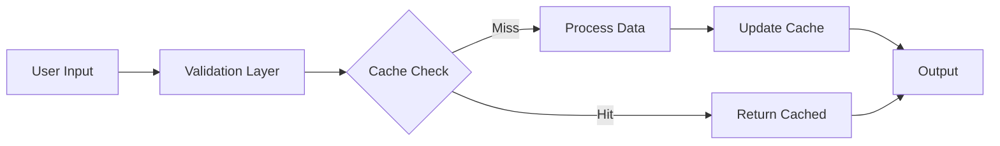
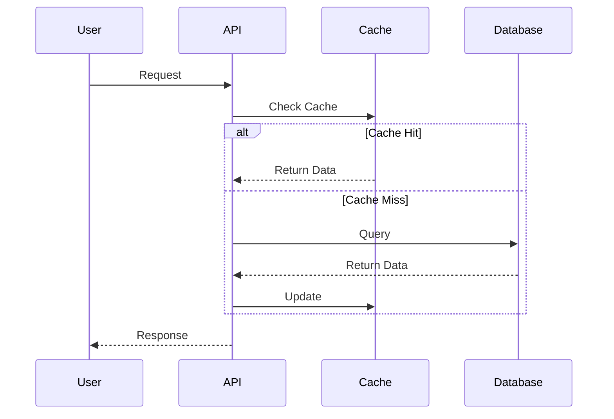

# Project Alpha

## Overview

This project aims to [[improve workflow]] using modern techniques. We're integrating with [[System Architecture]] and following [[Best Practices]].

> [!important] Key Deadline
> The first milestone is due on ==January 30th==.

> [!tip] Remember
> Always sync with the [[Team Members]] page before major decisions.

## Tasks

- [x] Initial planning
- [x] Resource allocation
- [x] Stakeholder approval
- [ ] Development phase
  - [ ] Backend implementation
  - [ ] Frontend design
  - [ ] API integration
- [ ] Testing
  - [ ] Unit tests
  - [ ] Integration tests
  - [ ] User acceptance testing
- [ ] Deployment
- [ ] Post-launch monitoring

## Technical Notes

The main algorithm uses the formula $O(n \log n)$ for sorting operations.

### Performance Considerations

Time complexity analysis:
$$
T(n) = \sum_{i=1}^{n} \log_2(i) = n \log n - n + O(\log n)
$$

### Implementation

```python
def process_data(items):
    """Process items with priority-based sorting."""
    return sorted(items, key=lambda x: x.priority, reverse=True)

def batch_process(data_chunks, max_workers=4):
    """Process data in parallel batches."""
    with ThreadPoolExecutor(max_workers=max_workers) as executor:
        results = executor.map(process_data, data_chunks)
    return list(results)
```

## Architecture



## System Flow



## Related Documents

- ![[Meeting Notes 2024-01-10#Decisions]]
- [[Budget Allocation|Budget Details]]
- [[Team Members]]
- [[Risk Assessment#^mitigation-strategies]]

## Team Communication

> [!note] Weekly Sync
> Every Friday at 2 PM in Conference Room B

## Risk Management

> [!warning] High Priority Risks
> - Timeline constraints may require scope reduction
> - Third-party API stability concerns
> - Resource availability during Q2

> [!success] Mitigations
> - Built 20% buffer into timeline
> - Implemented fallback API endpoints
> - Cross-trained team members

## References

For more details, see the official documentation[^1] and the architecture guide[^2].

[^1]: https://example.com/docs/project-alpha
[^2]: Smith, J. (2024). Modern Software Architecture Patterns.

Additional inline notes are helpful.^[This approach was validated in the proof-of-concept phase.]

%%
Internal notes:
- Review with team on Friday
- Consider alternative approaches for caching layer
- Follow up with Alice on budget approval
- Bob is on vacation Jan 20-25
%%
