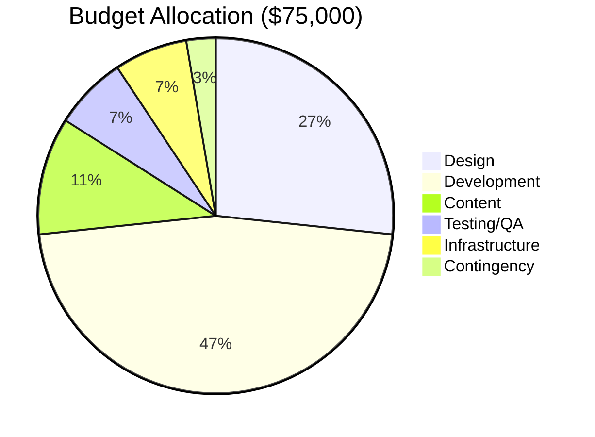

# Website Redesign Project

## Project Overview

Complete redesign of company website including UX improvements, modernized design, and technical infrastructure upgrades.

> [!important] Critical Deadline
> **Launch Date**: March 15, 2024
> **Days Remaining**: 54 days

> [!tip] Project Links
> - [[Project Charter]]
> - [[Design System]]
> - [[Technical Architecture]]
> - [[Stakeholder Registry]]

## Key Stakeholders

| Name | Role | Contact |
|------|------|---------|
| [[Sarah Chen]] | Project Manager | sarah.chen@company.com |
| [[Marcus Williams]] | Lead Designer | marcus.w@company.com |
| [[Priya Patel]] | Tech Lead | priya.p@company.com |
| [[David Lee]] | Marketing Director | david.lee@company.com |

## Project Phases

### Phase 1: Discovery & Planning ✅

- [x] Stakeholder interviews
- [x] User research and personas
- [x] Competitive analysis
- [x] Requirements documentation
- [x] Project charter approval
- [x] Budget allocation

**Completed**: January 5, 2024

### Phase 2: Design 🔄

- [x] Information architecture
- [x] Wireframes (all pages)
- [x] Design system creation
- [x] High-fidelity mockups (homepage)
- [ ] High-fidelity mockups (remaining pages)
  - [x] About page
  - [x] Services pages
  - [ ] Product pages (8 remaining)
  - [ ] Blog template
  - [ ] Contact page
- [ ] Accessibility review
- [ ] Stakeholder approval on final designs

**Target Completion**: February 10, 2024

> [!warning] Design Phase Risk
> Product page designs are behind schedule. May need to simplify template approach or add design resources.

### Phase 3: Development 📝

- [x] Development environment setup
- [x] Component library foundation
- [ ] Frontend development
  - [x] Navigation and header
  - [x] Footer and global components
  - [ ] Homepage implementation
  - [ ] About page
  - [ ] Services section
  - [ ] Product pages
  - [ ] Blog system
  - [ ] Contact forms
- [ ] Backend development
  - [x] CMS setup
  - [ ] API development
  - [ ] User authentication
  - [ ] Analytics integration
- [ ] Content migration
  - [ ] Audit existing content
  - [ ] Rewrite and optimize
  - [ ] Image optimization
  - [ ] SEO metadata

**Target Completion**: March 1, 2024

### Phase 4: Testing & QA 🔜

- [ ] Cross-browser testing
  - [ ] Chrome
  - [ ] Firefox
  - [ ] Safari
  - [ ] Edge
  - [ ] Mobile browsers
- [ ] Responsive testing (all breakpoints)
- [ ] Performance testing
  - [ ] Page load speeds
  - [ ] Core Web Vitals
  - [ ] Lighthouse scores
- [ ] Accessibility testing (WCAG 2.1 AA)
- [ ] User acceptance testing
- [ ] Security audit
- [ ] Bug fixes and refinements

**Target Completion**: March 10, 2024

### Phase 5: Launch 🚀

- [ ] Final content review
- [ ] SEO verification
- [ ] Backup current site
- [ ] DNS and hosting preparation
- [ ] Soft launch (staged rollout)
- [ ] Monitor analytics and errors
- [ ] Address any critical issues
- [ ] Full public launch
- [ ] Post-launch announcement

**Target Completion**: March 15, 2024

## Weekly Tasks

### This Week (Jan 20-26)

> [!todo] High Priority
> - [ ] Complete product page mockups (Marcus) - **Due: Jan 24**
> - [ ] Review and approve design system updates (Sarah) - **Due: Jan 22**
> - [ ] Finish homepage frontend implementation (Priya) - **Due: Jan 26**
> - [ ] Content audit for Services section (David) - **Due: Jan 25**

### Next Week (Jan 27 - Feb 2)

- [ ] Accessibility review of all designs
- [ ] Begin About page frontend development
- [ ] CMS configuration for blog
- [ ] First round of content rewrites

## Technical Stack

```yaml
Frontend:
  - React 18
  - Next.js 14
  - TypeScript
  - Tailwind CSS
  - Framer Motion

Backend:
  - Node.js
  - Express
  - PostgreSQL
  - Redis (caching)

CMS:
  - Contentful

Hosting:
  - Vercel (frontend)
  - AWS (backend, database)

Tools:
  - Figma (design)
  - Linear (project management)
  - GitHub (version control)
```

## Performance Goals

> [!success] Target Metrics
> - Lighthouse Score: 90+
> - First Contentful Paint: < 1.5s
> - Time to Interactive: < 3.5s
> - Cumulative Layout Shift: < 0.1

## Budget Tracking



**Current Spend**: $26,250 (35%)
**Remaining**: $48,750

> [!warning] Budget Alert
> Design phase slightly over budget (+$2,000). Offset by savings in infrastructure costs.

## Risk Management

| Risk | Impact | Probability | Mitigation |
|------|--------|-------------|------------|
| Design delays | High | Medium | Added 1 week buffer, simplified product pages |
| Content migration complexity | Medium | High | Started audit early, hired contractor |
| Performance issues | High | Low | Regular testing, optimization sprints |
| Browser compatibility | Medium | Medium | Early testing, polyfill strategy |
| Launch date pressure | High | Medium | Phased rollout plan, clear go/no-go criteria |

> [!danger] Critical Risks
> If product page designs aren't approved by Feb 1, we risk missing the March 15 launch date.

## Meeting Notes

### Weekly Standup (Jan 19, 2024)

![[Meeting Notes 2024-01-19#Project Status]]

**Key Decisions**:
- Simplified product page template to save time
- Approved additional budget for content contractor
- Moved analytics integration to post-launch enhancement

### Design Review (Jan 17, 2024)

![[Design Review 2024-01-17#Feedback Summary]]

## Resources

- [[Design System Documentation]]
- [[Component Library]]
- [[API Documentation]]
- [[Deployment Guide]]
- [[Testing Checklist]]
- ![[Brand Guidelines#^color-palette]]
- ![[Accessibility Standards#^wcag-checklist]]

## Success Metrics

Post-launch KPIs to monitor:

- [ ] 20% increase in conversion rate
- [ ] 40% improvement in page load time
- [ ] 90+ Lighthouse score maintained
- [ ] <1% error rate
- [ ] 25% increase in mobile traffic
- [ ] 15% improvement in bounce rate

## Communication Plan

> [!info] Status Updates
> - **Daily**: Team standup at 9:30 AM
> - **Weekly**: Stakeholder email update (Fridays)
> - **Bi-weekly**: Executive presentation
> - **Ad-hoc**: Slack #website-redesign channel

## Post-Launch Plans

- [ ] Monitor analytics for first 48 hours
- [ ] Address any critical bugs within 24 hours
- [ ] Gather user feedback
- [ ] Plan Phase 2 enhancements
- [ ] Retrospective meeting
- [ ] Update documentation

> [!quote] Project Vision
> "Create a modern, accessible, and performant web experience that showcases our brand and converts visitors into customers."

%%
Internal project notes:
- Keep close eye on Marcus's workload - may be stretched thin
- Consider moving blog launch to Phase 2 if timeline gets tight
- David mentioned possible rebrand in Q3 - may affect some design decisions
- Budget contingency can cover small overruns but not major scope changes
%%
