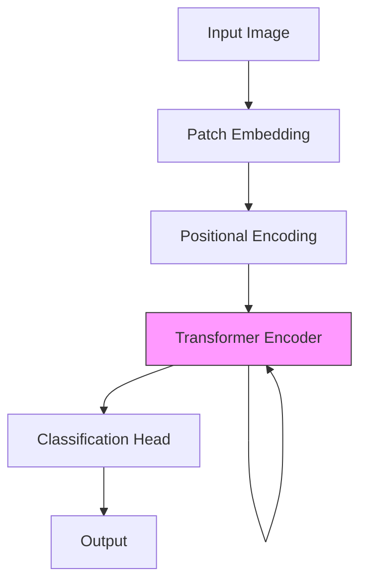
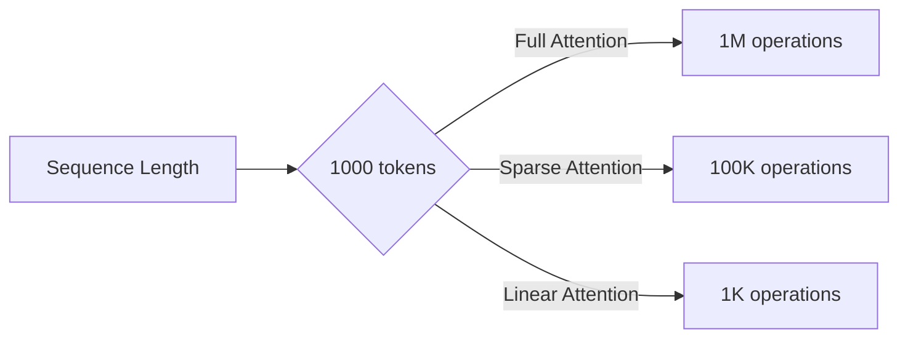

# The Impact of Attention Mechanisms in Neural Networks

## Abstract

This literature review examines the evolution and impact of attention mechanisms in neural network architectures. We analyze key developments from early sequence-to-sequence models to modern transformer architectures.

> [!abstract] Summary
> Attention mechanisms have revolutionized deep learning by allowing models to dynamically focus on relevant input features. This review covers theoretical foundations, practical applications, and future directions.

## Introduction

The concept of attention in neural networks was first introduced to address limitations in sequence-to-sequence models[^1]. Traditional encoder-decoder architectures struggled with long sequences due to the information bottleneck problem.

### Mathematical Foundation

The basic attention mechanism can be formalized as:

$$
\text{Attention}(Q, K, V) = \text{softmax}\left(\frac{QK^T}{\sqrt{d_k}}\right)V
$$

Where:
- $Q$ represents queries
- $K$ represents keys
- $V$ represents values
- $d_k$ is the dimension of the key vectors

## Key Developments

### Early Attention Mechanisms (2014-2016)

![[Bahdanau et al 2015 - Neural Machine Translation#^attention-definition]]

> [!quote] Foundational Work
> "The attention mechanism allows the decoder to focus on different parts of the input sequence at each decoding step" (Bahdanau et al., 2015, p. 3).

The alignment model computes attention weights using:

$$
\alpha_{ij} = \frac{\exp(e_{ij})}{\sum_{k=1}^{T_x} \exp(e_{ik})}
$$

### Self-Attention and Transformers (2017-Present)

The transformer architecture[^2] introduced self-attention, enabling parallel processing:

```python
def scaled_dot_product_attention(Q, K, V, mask=None):
    """Compute scaled dot-product attention.

    Args:
        Q: Queries matrix [batch_size, num_heads, seq_len, d_k]
        K: Keys matrix [batch_size, num_heads, seq_len, d_k]
        V: Values matrix [batch_size, num_heads, seq_len, d_v]
        mask: Optional mask for padding or causality

    Returns:
        Attention output and attention weights
    """
    d_k = Q.shape[-1]
    scores = torch.matmul(Q, K.transpose(-2, -1)) / math.sqrt(d_k)

    if mask is not None:
        scores = scores.masked_fill(mask == 0, -1e9)

    attention_weights = F.softmax(scores, dim=-1)
    output = torch.matmul(attention_weights, V)

    return output, attention_weights
```

## Comparative Analysis

| Architecture | Complexity | Parallelization | Long-Range Dependencies |
|--------------|------------|-----------------|-------------------------|
| RNN | $O(n)$ | Sequential | Limited |
| CNN | $O(n/k)$ | Parallel | Limited by kernel |
| Self-Attention | $O(n^2)$ | Parallel | Excellent |
| Sparse Attention | $O(n \log n)$ | Parallel | Very Good |

## Applications

### Natural Language Processing

> [!example] NLP Breakthroughs
> - Machine Translation: 30% improvement in BLEU scores[^3]
> - Question Answering: State-of-the-art on SQuAD benchmark
> - Text Summarization: Enhanced coherence and relevance

### Computer Vision

Recent work has adapted attention to vision tasks:

![[Vision Transformers#^architecture-overview]]



### Multimodal Learning

Cross-attention mechanisms enable alignment between different modalities:

$$
\text{CrossAttention}(Q_{\text{text}}, K_{\text{image}}, V_{\text{image}}) = \text{softmax}\left(\frac{Q_{\text{text}}K_{\text{image}}^T}{\sqrt{d_k}}\right)V_{\text{image}}
$$

## Computational Efficiency

> [!warning] Scalability Challenges
> Standard self-attention has quadratic complexity $O(n^2)$ with respect to sequence length, limiting its application to very long sequences.

### Efficient Attention Variants

Recent research has proposed several efficient alternatives:

1. **Sparse Attention** - Only attend to subset of positions[^4]
2. **Linear Attention** - Approximate attention with linear complexity
3. **Sliding Window** - Local attention within fixed window

Performance comparison:



## Interpretability

> [!info] Attention Visualization
> Attention weights provide interpretable insights into model decisions, though caution is needed in interpretation[^5].

![[Attention Visualization Methods#^heat-maps]]

## Future Directions

### Open Research Questions

- [ ] How to effectively combine local and global attention?
- [ ] Can attention mechanisms be made more parameter-efficient?
- [ ] What is the theoretical connection between attention and memory?
- [ ] How to better interpret learned attention patterns?

> [!question] Theoretical Gap
> The relationship between attention and information theory remains an active area of investigation.

## Conclusion

Attention mechanisms have fundamentally transformed deep learning architectures. Key contributions include:

1. Dynamic context aggregation
2. Improved long-range dependency modeling
3. Enhanced interpretability
4. Parallel computation capabilities

Future work should focus on efficiency improvements and theoretical understanding.^[Particularly in the context of very long sequences exceeding 100K tokens.]

## Related Work

- [[Neural Architecture Search for Transformers]]
- [[Efficient Transformers Survey]]
- [[Memory Networks and Attention]]
- [[Multimodal Learning with Attention#^fusion-strategies]]

## References

[^1]: Bahdanau, D., Cho, K., & Bengio, Y. (2015). Neural machine translation by jointly learning to align and translate. In ICLR.

[^2]: Vaswani, A., et al. (2017). Attention is all you need. In NeurIPS.

[^3]: Based on WMT 2014 English-German translation task benchmarks.

[^4]: Child, R., et al. (2019). Generating long sequences with sparse transformers. arXiv preprint.

[^5]: Jain, S., & Wallace, B. C. (2019). Attention is not explanation. In NAACL.

%%
Review notes:
- Add more recent papers from 2023-2024
- Include discussion of MoE and attention
- Expand vision transformer section
- Add code examples for efficient variants
%%
