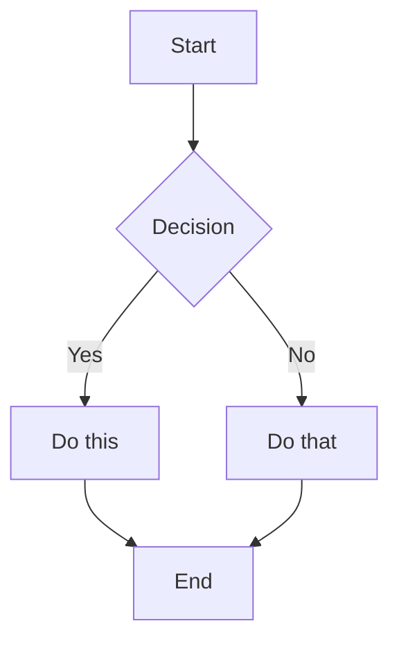
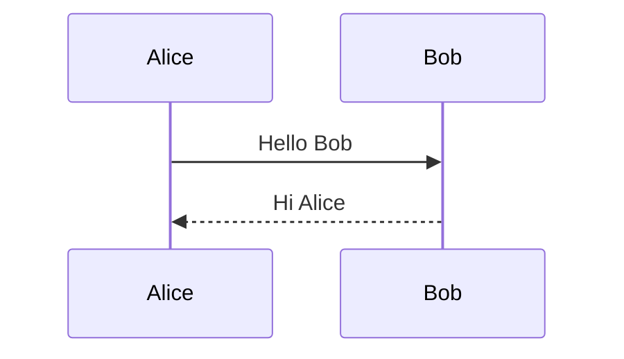
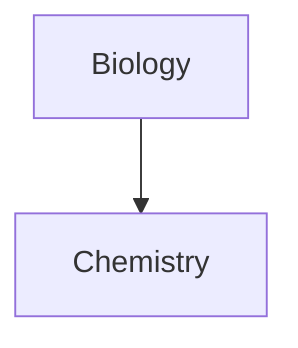

# Code and Math

## Code

### Inline Code

```markdown
Use `backticks` for inline code.
Use double backticks for ``code with a ` backtick inside``.
```

### Code Blocks

````markdown
```
Plain code block
```

```javascript
// Syntax highlighted code block
function hello() {
  console.log("Hello, world!");
}
```

```python
# Python example
def greet(name):
    print(f"Hello, {name}!")
```
````

### Nesting Code Blocks

Use more backticks or tildes for the outer block:

`````markdown
````markdown
Here's how to create a code block:
```js
console.log("Hello")
```
````
`````

## Tables

```markdown
| Header 1 | Header 2 | Header 3 |
|----------|----------|----------|
| Cell 1   | Cell 2   | Cell 3   |
| Cell 4   | Cell 5   | Cell 6   |
```

### Alignment

```markdown
| Left     | Center   | Right    |
|:---------|:--------:|---------:|
| Left     | Center   | Right    |
```

### Using Pipes in Tables

Escape pipes with backslash:
```markdown
| Column 1 | Column 2 |
|----------|----------|
| [[Link\|Display]] | ![[Image\|100]] |
```

## Math (LaTeX)

### Inline Math

```markdown
This is inline math: $e^{i\pi} + 1 = 0$
```

### Block Math

```markdown
$$
\begin{vmatrix}
a & b \\
c & d
\end{vmatrix} = ad - bc
$$
```

### Common Math Syntax

```markdown
$x^2$              Superscript
$x_i$              Subscript
$\frac{a}{b}$      Fraction
$\sqrt{x}$         Square root
$\sum_{i=1}^{n}$   Summation
$\int_a^b$         Integral
$\alpha, \beta$    Greek letters
```

## Diagrams (Mermaid)

````markdown

````

### Sequence Diagrams

````markdown

````

### Linking in Diagrams

````markdown

````

---

[← Back to Obsidian Markdown](../SKILL.md)
