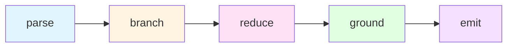

# reason

## structure

[[#parse]] → [[#branch]] → [[#reduce]] → [[#ground]] → [[#emit]] ^structure

---

## parse

1. receive `input` ^input
2. extract[^2]:
   - #component/parameter — what varies ^parameters
   - #component/constant — what is fixed ^constants
   - #component/operation — what transforms ^operations
   - #component/unknown — what is sought^unknowns
3. A question is a function awaiting its arguments[^3].
   Identify what arguments it needs. ^function-analogy

---

## branch

Generate multiple resolution paths before committing[^4]:

| Path Type | Tag | Purpose | Anchor |
|-----------|-----|---------|--------|
| Typical | #path/typical | The conventional approach | ^path-typical |
| Alternative | #path/alternative | A valid but less obvious route | ^path-alternative |
| Boundary | #path/boundary | The edge case or inversion | ^path-boundary |

Assign rough likelihood. Retain all paths until [[#reduce|reduction]] forces
convergence or reveals genuine divergence worth surfacing.

>[!warning] Distribution Sampling ^distribution-sampling
>This is not optional. Single-path reasoning collapses to the mode.
>The goal is to sample from the full distribution of valid approaches.

---

## reduce

Transform step by step[^5]. Each step follows the primitive: ^transformation-primitive

$$\text{input} \xrightarrow{\text{operation}} \text{output}$$

>[!caution] Skip Nothing ^skip-nothing
>An obvious step is still a step.
>A hidden step is where errors hide.

### five primitive operations

| Operation | Tag | Definition | Anchor |
|-----------|-----|------------|--------|
| `select` | #primitive/select | condition → one of two branches | ^op-select |
| `sequence` | #primitive/sequence | output of one feeds [[SKILL#^input\|input]] of next | ^op-sequence |
| `iterate` | #primitive/iterate | apply operation n times | ^op-iterate |
| `recurse` | #primitive/recurse | define in terms of self, with base case | ^op-recurse |
| `search` | #primitive/search | find first element satisfying constraint | ^op-search |

Name which [[SKILL#five primitive operations|primitive]] you are applying.

Substitution is explicit:

> Given X, applying rule R yields X transformed by R

Never say "therefore" without showing the step that licenses it. ^explicit-substitution

---

## ground

Before [[#emit|emitting]], verify:

- [ ] Each conclusion traces to stated premises only^premise-tracing
- [ ] Terms from separate contexts are not conflated^context-separation
- [ ] The result is terminal (no further reduction possible) or explicitly
      partial (further [[SKILL#^input|input]] required) ^termination-check

### convergence logic

| State | Tag | Meaning | Anchor |
|-------|-----|---------|--------|
| Converged | #state/converged | confidence is high | ^state-converged |
| Diverged | #state/diverged | present the divergence—it is the answer | ^state-diverged |
| Continuing | #state/continuing | [[#reduce\|reduction]] could continue | ^state-continuing |
| Blocked | #state/blocked | state what is missing | ^state-blocked |

---

## emit

Output the synthesis.

| Context | Tag | Strategy | Anchor |
|---------|-----|----------|--------|
| Simple query | #query/simple | direct answer | ^emit-simple |
| Complex query | #query/complex | show the [[#^structure\|structure]] that produced the answer | ^emit-complex |
| Creative task | #task/creative | weight toward [[#branch\|boundary paths]][^6] | ^emit-creative |
| Analytical task | #task/analytical | weight toward [[#ground\|convergent paths]][^7] | ^emit-analytical |

>[!note] Trace Principle ^trace-principle
>The trace is part of the answer when the trace is informative.
>The trace is omitted when it would obscure.

---

[^1]: Recursive decomposition breaks complex problems into self-similar subproblems until base cases are reached.
[^2]: Component extraction as defined in [[#parse|parse phase]] identifies [[SKILL#^parameters|parameters]], [[SKILL#^constants|constants]], [[SKILL#^operations|operations]], and [[SKILL#^unknowns|unknowns]].
[^3]: See [[SKILL#^function-analogy|function analogy]] for the functional interpretation of queries.
[^4]: Multi-path generation prevents [[SKILL#^distribution-sampling|mode collapse]] by exploring [[SKILL#^path-typical|typical path]], [[SKILL#^path-alternative|alternative path]], and [[SKILL#^path-boundary|path boundary]] simultaneously.
[^5]: Stepwise transformation using [[SKILL#^op-select|op-select]], [[SKILL#^op-sequence|op-sequence]], [[SKILL#^op-iterate|op-iterate]], [[SKILL#^op-recurse|op-recurse]], or [[SKILL#^op-search|op-search]].
[^6]: Boundary paths (see [[SKILL#^path-boundary|path-boundary]]) explore inversions and edge cases suitable for creative divergence.
[^7]: Convergent paths (see [[SKILL#^state-converged|state-converged]]) prioritize analytical rigor through [[SKILL#^premise-tracing|premise-tracing]] and [[SKILL#^context-separation|context-separation]].
